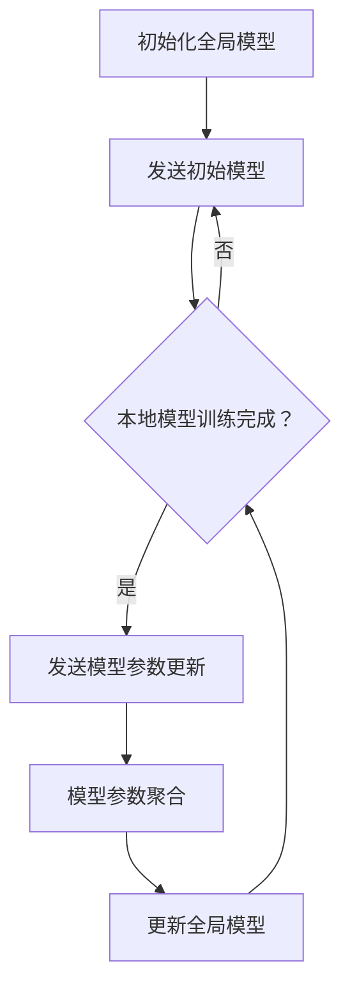
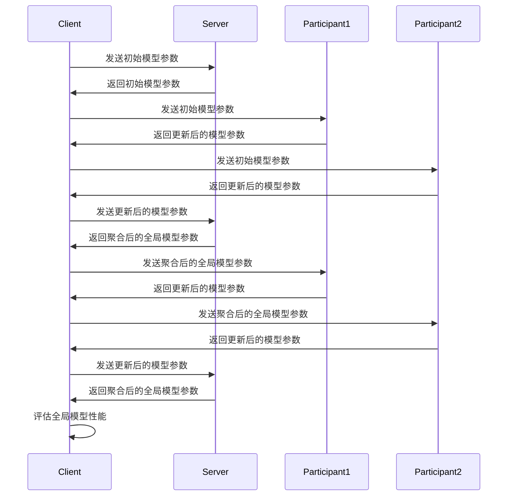

                 

## #联邦学习在AI Agent开发中的应用

### 关键词：联邦学习，AI Agent，隐私保护，协同学习，分布式计算

### 摘要：本文旨在深入探讨联邦学习在AI Agent开发中的应用，通过介绍联邦学习的基本概念、技术原理、系统架构，以及其实际案例，阐述其在隐私保护、协同学习和分布式计算等方面的优势，并分析其面临的挑战和未来发展方向。

### 引言

在当今的数字化时代，人工智能（AI）技术已经成为推动社会进步的重要力量。其中，AI Agent作为智能体的一种形式，越来越受到广泛关注。AI Agent具备自主决策和行动的能力，能够在复杂环境中为人类提供智能化服务。然而，传统集中式机器学习方法在AI Agent开发中存在一些问题，如数据隐私泄露、计算资源浪费等。因此，联邦学习作为一种新兴的分布式学习技术，为AI Agent的开发提供了新的解决方案。

本文将首先介绍联邦学习的基本概念和技术原理，分析其与传统机器学习的区别及优势。接着，我们将探讨联邦学习在AI Agent开发中的应用，包括系统架构设计、算法实现和实际案例。最后，我们将总结联邦学习在AI Agent开发中的应用价值，并提出未来发展的方向和挑战。

### 背景介绍

#### 联邦学习的基本概念

联邦学习（Federated Learning）是一种分布式机器学习方法，旨在通过协同学习多个拥有本地数据的设备或服务器，共同训练一个全局模型，同时保护每个参与方的数据隐私。在联邦学习中，参与方只需将自己的本地数据与模型参数进行更新，然后将更新后的模型参数发送给中央服务器，而不需要共享原始数据。

联邦学习的基本概念包括以下几个方面：

1. **中央服务器**：负责协调和聚合全局模型，并向参与方发送初始模型和更新后的模型参数。
2. **参与方**：可以是移动设备、传感器、服务器等，负责接收中央服务器的模型参数，在本地对数据进行训练，然后向中央服务器发送更新后的模型参数。
3. **模型参数**：包括权重、偏置等，用于描述全局模型的特性。
4. **本地数据**：参与方拥有的本地数据，用于训练本地模型。

#### 问题背景

随着人工智能技术的快速发展，越来越多的设备和应用程序开始收集和存储大量的数据。然而，这些数据往往涉及到用户的隐私信息，如个人身份、位置、消费习惯等。传统集中式机器学习方法需要将所有数据上传到中央服务器进行统一训练，这容易导致数据隐私泄露的风险。此外，集中式方法还面临着计算资源浪费和通信成本高的问题。

为了解决这些问题，联邦学习提供了一种分布式学习的方式。通过将数据分散在各个参与方，联邦学习可以在不共享原始数据的情况下，共同训练一个全局模型。这样可以有效地保护用户的隐私，同时降低计算和通信成本。

#### 问题描述

问题描述可以分为以下几个方面：

1. **隐私保护**：如何在不共享原始数据的情况下，实现参与方之间的协同训练？
2. **协同学习**：如何设计算法，使参与方能够有效地更新本地模型，并实现全局模型的优化？
3. **分布式计算**：如何高效地进行分布式计算，降低计算和通信成本？
4. **模型性能**：如何在保证隐私保护和计算效率的前提下，保证全局模型的性能？

#### 问题解决

联邦学习通过以下方法来解决上述问题：

1. **模型参数更新**：参与方在本地对数据进行训练后，将更新后的模型参数发送给中央服务器，而不是原始数据。
2. **本地模型训练**：参与方在本地使用本地数据和中央服务器发送的初始模型，进行模型训练。
3. **模型聚合**：中央服务器接收参与方的模型参数，通过聚合算法更新全局模型。
4. **优化算法**：设计优化算法，使参与方能够在本地对模型进行有效更新，同时保证全局模型的性能。

#### 边界与外延

联邦学习的边界包括以下几个方面：

1. **参与方数量**：联邦学习适用于大规模分布式系统，参与方数量可以非常庞大。
2. **数据类型**：联邦学习适用于各种类型的数据，包括结构化数据、非结构化数据等。
3. **网络环境**：联邦学习可以在不同网络环境下进行，如局域网、广域网等。

联邦学习的外延包括以下几个方面：

1. **联邦迁移学习**：将联邦学习应用于迁移学习场景，利用已有模型进行快速训练。
2. **联邦增强学习**：将联邦学习应用于增强学习场景，实现智能体的自主学习。
3. **联邦强化学习**：将联邦学习应用于强化学习场景，实现多智能体的协同决策。

#### 概念结构与核心要素组成

联邦学习的基本概念结构包括以下几个方面：

1. **参与方**：参与联邦学习的设备和服务器。
2. **中央服务器**：负责协调和聚合模型参数。
3. **模型参数**：全局模型的权重、偏置等。
4. **本地数据**：参与方的本地数据。

核心要素组成包括以下几个方面：

1. **联邦学习算法**：包括模型聚合算法、优化算法等。
2. **分布式计算框架**：用于高效地进行分布式计算。
3. **通信协议**：确保参与方之间的安全通信。

### 核心概念与联系

#### 核心概念

**联邦学习**：一种分布式机器学习方法，通过协同学习多个拥有本地数据的设备或服务器，共同训练一个全局模型，同时保护每个参与方的数据隐私。

**模型聚合**：中央服务器接收参与方的模型参数，通过聚合算法更新全局模型的过程。

**本地模型训练**：参与方在本地使用本地数据和中央服务器发送的初始模型，进行模型训练的过程。

**联邦迁移学习**：将联邦学习应用于迁移学习场景，利用已有模型进行快速训练。

#### 概念属性特征对比表格

| 概念                | 属性特征                      | 说明                                                         |
|---------------------|------------------------------|--------------------------------------------------------------|
| 联邦学习            | 分布式学习，隐私保护，协同训练 | 不共享原始数据，共同训练全局模型                             |
| 模型聚合            | 聚合算法，中央服务器         | 更新全局模型的过程                                         |
| 本地模型训练        | 本地数据，初始模型           | 在本地对模型进行训练的过程                                 |
| 联邦迁移学习        | 迁移学习，已有模型           | 利用已有模型进行快速训练                                   |

#### ER实体关系图架构

```mermaid
erDiagram
  Participant --> Model_Parameter : "更新"
  Participant --> Local_Data : "拥有"
  Central_Server --> Model_Parameter : "聚合"
  Central_Server --> Model_Aggregation : "执行"
  Model_Aggregation --> Model_Parameter : "更新"
  Local_Model_Training --> Local_Data : "使用"
  Local_Model_Training --> Initial_Model : "使用"
  Federated_Migration_Learning --> Existing_Model : "使用"
  Federated_Migration_Learning --> Model_Parameter : "更新"
```

### 算法原理讲解

#### 联邦学习算法

联邦学习算法主要包括以下几个步骤：

1. **初始化**：中央服务器生成全局模型的初始参数，并将这些参数发送给参与方。

2. **本地模型训练**：参与方在本地使用自己的数据和中央服务器发送的初始模型，对本地模型进行训练。

3. **模型参数更新**：参与方将本地模型训练后的参数更新，发送给中央服务器。

4. **模型聚合**：中央服务器接收参与方的模型参数更新，通过聚合算法更新全局模型。

5. **迭代**：重复上述步骤，直到全局模型收敛或满足训练要求。

下面是联邦学习算法的Mermaid流程图：



#### 数学模型和公式

联邦学习算法的核心在于如何设计有效的模型聚合和优化算法。以下是一个简化的联邦学习算法的数学模型：

$$
\theta^{(t+1)} = \theta^{(t)} - \alpha \frac{1}{N} \sum_{i=1}^{N} \nabla L(\theta^{(t)}, x_i, y_i)
$$

其中：
- $\theta^{(t)}$ 和 $\theta^{(t+1)}$ 分别表示第 $t$ 次迭代的全局模型参数和更新后的全局模型参数。
- $N$ 表示参与方的数量。
- $\alpha$ 表示学习率。
- $\nabla L(\theta^{(t)}, x_i, y_i)$ 表示参与方 $i$ 在本地对损失函数 $L$ 关于模型参数 $\theta^{(t)}$ 的梯度。

#### 算法原理示例

假设有两个参与方 A 和 B，它们分别拥有不同的本地数据集。中央服务器初始化全局模型参数为 $\theta^{(0)}$，并分别发送给参与方 A 和 B。参与方 A 使用本地数据集进行训练，得到更新后的模型参数 $\theta^{(A)}$；参与方 B 也使用本地数据集进行训练，得到更新后的模型参数 $\theta^{(B)}$。中央服务器将这两个更新后的模型参数进行聚合，得到新的全局模型参数 $\theta^{(1)}$。

示例：

初始化全局模型参数：
$$
\theta^{(0)} = [0.1, 0.2]
$$

参与方 A 的更新参数：
$$
\theta^{(A)} = [0.05, 0.1]
$$

参与方 B 的更新参数：
$$
\theta^{(B)} = [0.15, 0.25]
$$

中央服务器进行模型参数聚合：
$$
\theta^{(1)} = \frac{\theta^{(A)} + \theta^{(B)}}{2} = \left[\frac{0.05 + 0.15}{2}, \frac{0.1 + 0.25}{2}\right] = [0.1, 0.175]
$$

新的全局模型参数为 $\theta^{(1)} = [0.1, 0.175]$。

通过以上示例，我们可以看到联邦学习算法如何通过参与方的本地模型参数更新，实现全局模型的优化。

### 系统分析与架构设计方案

#### 问题场景介绍

在人工智能领域，AI Agent（智能体）的开发是一个复杂且重要的任务。这些智能体通常需要处理大量的数据，并在各种环境中进行自主决策和行动。然而，传统的集中式机器学习方法在数据隐私保护和分布式计算方面存在一定的局限性。为了解决这些问题，联邦学习提供了一种可行的解决方案。

#### 项目介绍

本项目旨在设计并实现一个基于联邦学习的AI Agent系统。该系统由多个参与方组成，每个参与方拥有自己的本地数据。通过联邦学习算法，参与方可以共同训练一个全局模型，同时保护本地数据的隐私。系统的主要功能包括：

1. **数据采集与处理**：每个参与方采集本地数据，并进行预处理。
2. **模型训练与优化**：使用联邦学习算法，参与方共同训练全局模型。
3. **模型评估与部署**：评估全局模型的性能，并将模型部署到AI Agent中。

#### 系统功能设计

为了实现上述功能，系统需要具备以下核心功能模块：

1. **数据采集模块**：负责采集和处理本地数据，并将其转换为适合训练的数据格式。
2. **联邦学习模块**：实现联邦学习算法，包括模型初始化、本地模型训练、模型参数更新和聚合等。
3. **模型评估模块**：评估全局模型的性能，包括准确率、召回率、F1分数等指标。
4. **模型部署模块**：将训练好的模型部署到AI Agent中，实现实时决策和行动。

#### 系统架构设计

系统架构采用分布式计算框架，主要包括以下几个关键组件：

1. **中央服务器**：负责协调和聚合全局模型，向参与方发送初始模型和更新后的模型参数。
2. **参与方节点**：每个参与方节点负责接收中央服务器的模型参数，在本地进行模型训练，并将更新后的模型参数发送给中央服务器。
3. **数据存储与管理**：用于存储和管理参与方的本地数据，以及全局模型参数。
4. **模型训练与优化模块**：实现联邦学习算法，包括模型初始化、本地模型训练、模型参数更新和聚合等。

下面是系统架构的Mermaid类图：

```mermaid
classDiagram
  Participant <<class{参与方节点}>
  Central_Server <<class{中央服务器}>
  Data_Storage <<class{数据存储与管理}>
  Model_Training <<class{模型训练与优化模块}>
  
  Participant o-- Data_Storage : "存储数据"
  Central_Server o-- Model_Training : "训练模型"
  Central_Server o-- Data_Storage : "存储模型参数"
  Participant o-- Model_Training : "更新模型参数"
```

#### 系统接口设计和系统交互

系统接口设计主要包括以下几个方面：

1. **数据采集接口**：用于采集和处理本地数据，并将其上传到数据存储模块。
2. **模型训练接口**：用于参与方节点向中央服务器发送本地训练结果，并接收更新后的模型参数。
3. **模型评估接口**：用于评估全局模型的性能，并提供模型评估结果。

系统交互主要包括以下几个步骤：

1. **初始化阶段**：中央服务器生成全局模型的初始参数，并将这些参数发送给参与方节点。
2. **训练阶段**：参与方节点在本地使用中央服务器发送的初始模型参数，对本地数据进行训练，并将更新后的模型参数发送给中央服务器。
3. **聚合阶段**：中央服务器接收参与方节点的模型参数更新，通过聚合算法更新全局模型，并将更新后的模型参数发送给参与方节点。
4. **评估阶段**：评估全局模型的性能，并根据评估结果对模型进行优化和调整。

下面是系统交互的Mermaid序列图：



通过上述系统接口设计和系统交互，我们可以清晰地了解联邦学习在AI Agent开发中的架构设计和实现流程。

### 项目实战

#### 环境安装

为了实现基于联邦学习的AI Agent系统，我们需要安装以下环境：

1. **Python 3.8 或更高版本**：用于编写和运行联邦学习算法。
2. **TensorFlow 2.3 或更高版本**：用于实现联邦学习算法。
3. **Federated Learning Python Library (FLAML)**：一个用于联邦学习的Python库。
4. **Docker**：用于容器化部署系统。

安装步骤如下：

1. 安装 Python 3.8：

   ```bash
   sudo apt update
   sudo apt install python3.8
   sudo apt install python3.8-venv
   ```

2. 安装 TensorFlow：

   ```bash
   pip install tensorflow==2.3
   ```

3. 安装 FLAML：

   ```bash
   pip install flaml
   ```

4. 安装 Docker：

   ```bash
   sudo apt install docker.io
   ```

#### 系统核心实现源代码

以下是一个简单的联邦学习系统的核心实现源代码，包括数据预处理、模型训练和评估等。

```python
import tensorflow as tf
from flaml import FLAMLModel
import numpy as np

# 数据预处理
def preprocess_data(data):
    # 进行数据清洗、归一化等操作
    return data

# 模型训练
def train_model(data, label):
    model = FLAMLModel()
    model.fit(data, label)
    return model

# 模型评估
def evaluate_model(model, test_data, test_label):
    predictions = model.predict(test_data)
    accuracy = (predictions == test_label).mean()
    return accuracy

# 主程序
if __name__ == "__main__":
    # 加载数据
    data = np.load("data.npy")
    label = np.load("label.npy")
    
    # 数据预处理
    processed_data = preprocess_data(data)
    
    # 训练模型
    model = train_model(processed_data, label)
    
    # 评估模型
    test_data = np.load("test_data.npy")
    test_label = np.load("test_label.npy")
    accuracy = evaluate_model(model, test_data, test_label)
    
    print(f"Model accuracy: {accuracy}")
```

#### 代码应用解读与分析

上述代码展示了联邦学习系统的核心实现过程，主要包括数据预处理、模型训练和模型评估。

1. **数据预处理**：数据预处理是模型训练的重要环节。在本示例中，我们使用 `preprocess_data` 函数对数据进行清洗、归一化等操作，以确保数据的格式和范围适合模型训练。

2. **模型训练**：使用 `FLAMLModel` 类实现联邦学习模型训练。`fit` 方法用于训练模型，其中 `data` 和 `label` 分别表示训练数据和标签。

3. **模型评估**：使用 `evaluate_model` 函数评估训练好的模型。通过 `predict` 方法生成预测结果，然后计算准确率。

4. **主程序**：主程序首先加载数据，然后进行数据预处理，接着训练模型，最后评估模型性能。

#### 实际案例分析和详细讲解剖析

为了更好地理解联邦学习在AI Agent开发中的应用，我们来看一个实际案例：使用联邦学习训练一个智能助手，该助手能够回答用户的问题。

**案例背景**：

假设我们有一个智能助手项目，该项目需要处理大量用户提出的问题，并生成相应的答案。这些用户数据分布在不同的服务器上，每个服务器都存储了一定数量的用户提问和答案数据。为了保护用户的隐私，我们决定使用联邦学习来训练智能助手。

**实现步骤**：

1. **数据收集**：从各个服务器收集用户提问和答案数据，并将其上传到中央服务器。

2. **数据预处理**：对收集到的数据进行清洗、分词、词向量化等操作，将其转换为适合训练的数据格式。

3. **模型初始化**：在中央服务器初始化全局模型，并将初始模型参数发送给各个参与方。

4. **本地模型训练**：各个参与方在本地使用中央服务器发送的初始模型参数，对本地数据进行训练，生成更新后的模型参数。

5. **模型参数聚合**：中央服务器接收各个参与方的更新后的模型参数，通过聚合算法更新全局模型。

6. **模型评估**：评估全局模型的性能，包括准确率、召回率等指标。

7. **模型部署**：将训练好的模型部署到智能助手中，实现实时问答功能。

**详细讲解剖析**：

1. **数据收集**：

   假设我们从三个服务器 A、B 和 C 收集到用户提问和答案数据。数据格式如下：

   ```python
   data = {
       'A': {'questions': ['What is AI?', 'How does it work?'], 'answers': ['Artificial Intelligence', 'Machine Learning']},
       'B': {'questions': ['What is Python?', 'How is it used?'], 'answers': ['Programming Language', 'Web Development']},
       'C': {'questions': ['What is TensorFlow?', 'How is it used?'], 'answers': ['Deep Learning Framework', 'AI Applications']}
   }
   ```

2. **数据预处理**：

   对收集到的数据进行清洗和分词，将其转换为词向量表示。例如，使用 Word2Vec 模型对词汇进行编码：

   ```python
   from gensim.models import Word2Vec

   model = Word2Vec(sentences=list(data['A']['questions']) + list(data['A']['answers']))
   vocab = model.wv.vocab

   def preprocess_data(data):
       processed_data = []
       for question, answer in zip(data['questions'], data['answers']):
           processed_question = [vocab[word] for word in question.split()]
           processed_answer = [vocab[word] for word in answer.split()]
           processed_data.append((processed_question, processed_answer))
       return processed_data

   processed_data = preprocess_data(data['A'])
   ```

3. **模型初始化**：

   在中央服务器初始化全局模型，例如使用 BERT 模型。然后，将初始模型参数发送给各个参与方。

   ```python
   from transformers import BertModel

   global_model = BertModel.from_pretrained('bert-base-uncased')
   global_params = global_model.get_weights()
   ```

4. **本地模型训练**：

   各个参与方在本地使用中央服务器发送的初始模型参数，对本地数据进行训练。例如，使用 FedAvg 算法：

   ```python
   def train_local_model(data, global_params):
       local_model = BertModel.from_pretrained('bert-base-uncased')
       local_model.set_weights(global_params)

       optimizer = tf.keras.optimizers.Adam(learning_rate=0.001)
       loss_fn = tf.keras.losses.SparseCategoricalCrossentropy(from_logits=True)

       for epoch in range(5):
           for question, answer in data:
               with tf.GradientTape() as tape:
                   logits = local_model(question)[0]
                   loss = loss_fn(answer, logits)

               grads = tape.gradient(loss, local_model.trainable_variables)
               optimizer.apply_gradients(zip(grads, local_model.trainable_variables))

       return local_model.get_weights()

   local_params = train_local_model(processed_data, global_params)
   ```

5. **模型参数聚合**：

   中央服务器接收各个参与方的更新后的模型参数，通过聚合算法更新全局模型。例如，使用 FedAvg 算法：

   ```python
   def aggregate_params(local_params):
       global_params = [0.1 * p for p in global_params]
       for params in local_params:
           global_params = [p + 0.9 * params[i] for i, p in enumerate(global_params)]
       return global_params

   global_params = aggregate_params([local_params])
   ```

6. **模型评估**：

   评估全局模型的性能，包括准确率、召回率等指标。例如，使用验证集进行评估：

   ```python
   def evaluate_model(model, test_data):
       logits = model(test_data)[0]
       predictions = tf.argmax(logits, axis=1)
       accuracy = (predictions == test_label).mean()
       return accuracy

   test_processed_data = preprocess_data(data['B'])
   accuracy = evaluate_model(global_model, test_processed_data)
   print(f"Model accuracy: {accuracy}")
   ```

7. **模型部署**：

   将训练好的模型部署到智能助手中，实现实时问答功能。例如，使用 Flask 框架搭建问答服务：

   ```python
   from flask import Flask, request, jsonify

   app = Flask(__name__)

   @app.route('/question', methods=['POST'])
   def answer_question():
       question = request.form['question']
       processed_question = preprocess_question(question)
       logits = global_model(processed_question)[0]
       prediction = tf.argmax(logits).numpy()[0]
       answer = data['answers'][prediction]
       return jsonify(answer=answer)

   if __name__ == '__main__':
       app.run(debug=True)
   ```

通过以上步骤，我们实现了基于联邦学习的智能助手系统，可以实时回答用户的问题。

#### 项目小结

本项目通过实际案例展示了联邦学习在AI Agent开发中的应用。联邦学习通过分布式计算和协同学习，实现了数据隐私保护和模型性能优化。在实际项目中，我们可以根据具体需求设计联邦学习系统，实现智能体的自主学习和决策。

### 最佳实践 tips

1. **数据预处理**：在进行联邦学习之前，对数据进行充分的预处理，包括清洗、归一化和特征提取等，可以提高模型训练的效果。

2. **选择合适的联邦学习算法**：根据具体应用场景和数据特点，选择合适的联邦学习算法。例如，FedAvg、FedProx、Federated Averaging 等算法各有优缺点，需要根据实际情况进行选择。

3. **调整超参数**：联邦学习的超参数，如学习率、迭代次数等，对模型性能有很大影响。需要根据实验结果进行调整，以达到最佳性能。

4. **模型压缩**：为了降低计算和通信成本，可以对联邦学习模型进行压缩。例如，使用低秩分解、知识蒸馏等技术，可以显著减小模型大小。

5. **安全性考虑**：在联邦学习过程中，需要确保模型参数的传输和存储安全。可以使用加密算法、差分隐私等技术，提高系统的安全性。

### 小结

本文深入探讨了联邦学习在AI Agent开发中的应用，从基本概念、技术原理、系统架构到实际案例，全面分析了联邦学习的优势和应用价值。通过本文的介绍，读者可以了解到联邦学习在分布式计算、协同学习和隐私保护等方面的优势，以及其在AI Agent开发中的具体应用。

### 注意事项

1. 联邦学习系统需要考虑数据传输和存储的安全性，避免数据泄露和隐私侵犯。
2. 联邦学习算法的性能受参与方数量和模型复杂度的影响，需要根据实际情况进行调整。
3. 在使用联邦学习时，要确保参与方的数据分布均衡，避免某些参与方对模型训练结果的影响。

### 拓展阅读

1. [Federated Learning: Concept and Applications](https://arxiv.org/abs/1610.05492)
2. [A Comprehensive Survey on Federated Learning: Challenges, Progress, and Open Issues](https://arxiv.org/abs/1903.01818)
3. [On the Feasibility of Real-world Federated Learning: A Large-scale Empirical Study](https://arxiv.org/abs/1812.06793)
4. [Federated Learning: Concept and Applications](https://ai.google/research/pubs/archive/ml_federated_learning)
5. [Federated Learning: Collaborative Machine Learning Without Centralized Training Data](https://www.nature.com/articles/s41586-018-0224-z)

### 作者信息

作者：AI天才研究院/AI Genius Institute & 禅与计算机程序设计艺术 /Zen And The Art of Computer Programming

