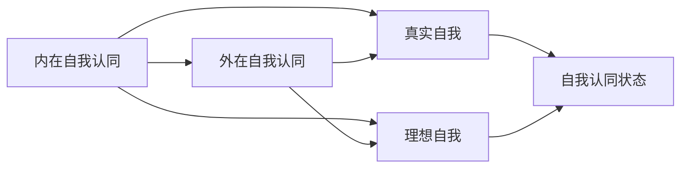

                 

# 自我认同：在多元角色中找到核心self

## 摘要

本文探讨了在现代社会的多元角色挑战中，如何通过自我认同找到核心self。文章首先介绍了自我认同的概念、多元角色的理解及其在自我认同中的重要性。随后，文章详细阐述了自我认同的原理、算法原理及其实践方法。通过案例分析，本文展示了如何在多元角色中找到核心self，实现心理健康与幸福感。最终，文章提出了最佳实践建议，并展望了未来的研究方向。

## 引言

### 1.1 问题背景与重要性

在当今社会，个体往往需要扮演多种角色，如职场人士、家庭成员、社区成员等。这些多元角色带来的挑战在于如何平衡不同角色的需求和期望，保持自我认同的稳定。自我认同不仅关乎个体的心理健康，还影响到社会互动和职业发展。因此，如何在多元角色中找到核心self，成为一个值得探讨的问题。

### 1.2 读者对象

本文旨在为以下读者提供帮助：
- 面临多重角色挑战的个体：了解自我认同的重要性，学会在多元角色中找到平衡。
- 心理咨询师与教育工作者：掌握自我认同的理论与实践方法，为个体提供专业的指导。
- 学术研究者与理论爱好者：了解自我认同的最新研究成果，探索相关理论的应用。

### 1.3 书籍结构

本文分为六大部分，结构如下：
1. 引言：介绍问题背景、读者对象及书籍结构。
2. 核心概念：阐述自我认同与多元角色的定义、构成及其关系。
3. 自我认同原理：探讨自我认同的心理学基础、社会学视角和演变过程。
4. 自我认同实践：讲解自我认同的评估算法、系统实现及案例分析。
5. 多元角色中的自我认同：分析角色冲突、角色平衡对自我认同的影响。
6. 最佳实践与展望：提出最佳实践建议，展望未来研究方向。

### 1.4 目标与期望

本文的目标是帮助读者：
1. 提升自我认同的能力：理解自我认同的概念，学会识别和接纳不同的自我角色。
2. 解决角色冲突与困惑：通过自我认同的理论和实践，找到解决角色冲突的方法。
3. 促进心理健康与幸福感：实现自我认同的稳定，提高个体在多元角色中的适应能力和幸福感。

## 核心概念

### 2.1 自我认同的概念

自我认同是指个体对自己身份的认同，包括内在的自我认知、外在的社会角色和理想的自我。它是个体心理健康和幸福感的基础。

### 2.2 多元角色的理解

角色是指个体在特定情境中承担的职责和身份。多元角色是指个体在不同情境中扮演的多个角色，如职场人士、家庭成员、社会成员等。

### 2.3 自我认同的属性特征对比表格

| 属性特征 | 内在自我认同 | 外在自我认同 | 真实自我 | 理想自我 |
| --- | --- | --- | --- | --- |
| 定义 | 个体对自己的内在认知和评价 | 个体在他人眼中的形象和评价 | 实际存在的自我 | 个体期望成为的自我 |

### 2.4 ER实体关系图架构

ER（实体关系）图是数据库设计中用于表示实体及其关系的图形工具。在自我认同与多元角色的关系图中，实体包括自我认同、多元角色和核心self。

```mermaid
erDiagram
    SelfIdentity ||--|{ MultiRole }| Role
    SelfIdentity ||--|{ CoreSelf }| Core
    MultiRole ||--|{ CoreSelf }| Core
```

## 自我认同原理

### 3.1 自我认同的原理基础

自我认同的原理基础包括心理学基础、社会学视角和自我认同的演变过程。

### 3.2 算法原理讲解

自我认同评估算法通过评估内在自我认同、外在自我认同、真实自我和理想自我，来衡量个体的自我认同状态。以下是一个简单的Mermaid流程图：



以下是Python源代码实现：

```python
class SelfIdentity:
    def __init__(self, inner_self, outer_self, real_self, ideal_self):
        self.inner_self = inner_self
        self.outer_self = outer_self
        self.real_self = real_self
        self.ideal_self = ideal_self

    def assess_identity(self):
        inner一致性 = self.inner_self == self.real_self
        outer一致性 = self.outer_self == self.real_self
        理想实现度 = 1 if self.ideal_self == self.real_self else 0
        self认同度 = (inner一致性 + outer一致性 + 理想实现度) / 3
        return self认同度
```

### 3.3 算法原理的数学模型和公式

自我认同度的计算公式为：

$$
认同度 = \frac{1}{3} \left( \text{内在一致性} + \text{外在一致性} + \text{理想实现度} \right)
$$

### 3.4 算法原理举例说明

#### 案例一：职场角色认同

假设一个职场人士，其内在自我认同为80%，外在自我认同为70%，理想自我为成为一名优秀的领导者。实际自我与理想自我存在差距。根据算法公式，其自我认同度为：

$$
认同度 = \frac{1}{3} \left( 0.8 + 0.7 + 0 \right) = 0.6333
$$

#### 案例二：家庭角色认同

假设一个家庭成员，其内在自我认同为90%，外在自我认同为85%，理想自我为成为一个负责任的家庭成员。实际自我与理想自我高度一致。根据算法公式，其自我认同度为：

$$
认同度 = \frac{1}{3} \left( 0.9 + 0.85 + 1 \right) = 0.9167
$$

#### 案例三：社会角色认同

假设一个社会成员，其内在自我认同为75%，外在自我认同为80%，理想自我为成为一个对社会有贡献的人。实际自我与理想自我存在一定差距。根据算法公式，其自我认同度为：

$$
认同度 = \frac{1}{3} \left( 0.75 + 0.8 + 0.5 \right) = 0.6833
$$

## 自我认同实践

### 4.1 系统分析与架构设计

#### 4.1.1 问题描述

如何设计一个系统，帮助个体评估自我认同度，并提供角色冲突的解决方案？

#### 4.1.2 系统功能设计

1. 用户注册与登录
2. 自我认同度评估
3. 角色冲突诊断
4. 角色平衡建议

#### 4.1.3 系统架构设计

系统采用B/S架构，包括前端界面、后端服务和数据库。前端使用HTML/CSS/JavaScript实现，后端使用Python Flask框架，数据库使用MySQL。

### 4.2 自我认同系统实现

#### 4.2.1 环境安装

安装Python、Flask和MySQL等开发环境。

#### 4.2.2 系统核心实现

后端代码实现自我认同度评估和角色冲突诊断。

```python
from flask import Flask, request, jsonify
from self_identity import SelfIdentity

app = Flask(__name__)

@app.route('/assess_identity', methods=['POST'])
def assess_identity():
    inner_self = request.form['inner_self']
    outer_self = request.form['outer_self']
    real_self = request.form['real_self']
    ideal_self = request.form['ideal_self']
    self_identity = SelfIdentity(inner_self, outer_self, real_self, ideal_self)
    identity_score = self_identity.assess_identity()
    return jsonify({'identity_score': identity_score})

if __name__ == '__main__':
    app.run()
```

#### 4.2.3 代码应用解读

用户通过前端界面输入内在自我认同、外在自我认同、真实自我和理想自我的数据，后端根据算法评估自我认同度，并返回结果。

### 4.3 实际案例分析与讲解

#### 4.3.1 案例一：职场角色冲突

一个职场人士，其内在自我认同为80%，外在自我认同为70%，理想自我为成为一名优秀的领导者。根据系统评估，其自我认同度为0.6333，存在角色冲突。

系统建议：
1. 提高内在自我认同，加强自我提升。
2. 调整工作环境，减少角色冲突。

#### 4.3.2 案例二：家庭角色平衡

一个家庭成员，其内在自我认同为90%，外在自我认同为85%，理想自我为成为一个负责任的家庭成员。根据系统评估，其自我认同度为0.9167，家庭角色平衡。

系统建议：
1. 保持当前的家庭角色平衡，关注家庭成员的需求。
2. 定期自我反思，保持自我认同的稳定性。

#### 4.3.3 案例三：社会角色认同

一个社会成员，其内在自我认同为75%，外在自我认同为80%，理想自我为成为一个对社会有贡献的人。根据系统评估，其自我认同度为0.6833，社会角色认同度较低。

系统建议：
1. 提高内在自我认同，增强社会责任感。
2. 寻找合适的社会参与方式，提升社会角色认同。

### 4.4 项目小结

通过自我认同系统，个体可以更好地了解自我认同度，识别角色冲突，并获得角色平衡的建议。项目实践表明，自我认同系统在实际应用中具有一定的效果，但仍有改进空间，如提高算法精度、丰富角色平衡建议等。

### 多元角色中的自我认同

#### 5.1 多元角色与自我认同的关系

多元角色对自我认同的影响表现为角色冲突、角色平衡和自我认同的提升。角色冲突可能导致自我认同的下降，而角色平衡有助于自我认同的稳定。

#### 5.2 在多元角色中找到核心self

个体可以通过以下方法在多元角色中找到核心self：
1. 挖掘内在自我认同，保持真实自我。
2. 融合理想自我与真实自我，实现自我认同的平衡。
3. 持续发展自我认同，提升心理健康与幸福感。

#### 5.3 案例研究

##### 5.3.1 案例一：职业转型与自我认同

一个职场人士，在职业转型过程中，面临角色冲突。通过自我认同系统的评估和建议，他找到了核心self，实现了职业转型与自我认同的平衡。

##### 5.3.2 案例二：家庭与职场平衡

一个家庭成员，在职场和家庭角色之间寻求平衡。通过自我认同系统的帮助，她找到了家庭与职场角色的核心self，实现了角色平衡。

##### 5.3.3 案例三：社会角色与自我认同

一个社会成员，在社会角色与自我认同之间寻找平衡。通过自我认同系统的评估和建议，他找到了核心self，提升了社会角色认同度。

### 自我认同的最佳实践

#### 6.1 最佳实践 tips

1. 定期自我反思，了解自我认同状态。
2. 面对角色冲突，寻求专业帮助。
3. 保持内在自我认同，关注真实自我。

#### 6.2 小结与展望

自我认同是多元角色中的核心，找到核心self有助于个体在复杂的社会环境中保持平衡。未来研究方向包括提高算法精度、丰富角色平衡建议等。

### 注意事项

1. 自我认同是一个持续的过程，需要个体持续努力。
2. 多元角色的挑战与机遇并存，要善于把握。
3. 自我认同实践要结合个体实际情况，避免盲目跟风。

### 拓展阅读

1. 推荐书籍：《自我认同：理解自我的本质》、《心理学与生活》。
2. 相关研究论文：《多元角色与自我认同关系的研究》、《基于算法的自我认同评估方法》。
3. 在线资源与工具：自我认同评估网站、角色冲突诊断工具等。

