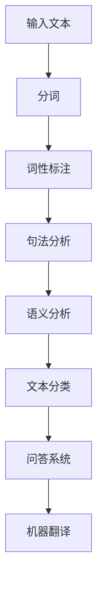
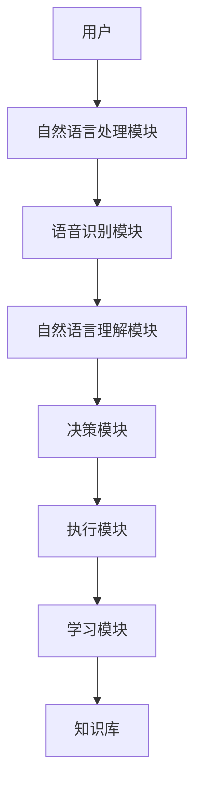
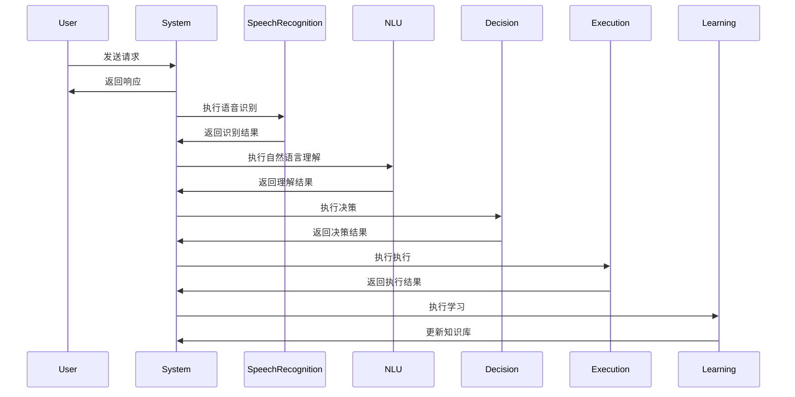

                 


# 自然语言处理在AI Agent中的深度应用

> 关键词：自然语言处理，AI Agent，深度学习，语言模型，词向量，文本分类，问答系统，机器翻译

> 摘要：本文从自然语言处理的基本概念、语言模型、词向量、文本分类、问答系统、机器翻译等方面，深入探讨了自然语言处理在AI Agent中的深度应用。通过分析自然语言处理的关键技术，以及AI Agent的架构和功能，本文提出了自然语言处理在AI Agent中应用的解决方案，并通过实例分析，展示了自然语言处理在AI Agent中的实际应用效果。

## 第1章：自然语言处理概述

### 1.1 自然语言处理的基本概念

自然语言处理（Natural Language Processing，NLP）是计算机科学、人工智能和语言学领域的交叉学科，旨在使计算机能够理解、生成和处理人类自然语言。自然语言处理的核心任务是让计算机具备“听懂”人类语言的能力，从而实现人与计算机的顺畅交流。

NLP的核心概念包括：

- **文本表示**：将文本转化为计算机可以处理的形式，如词向量、序列编码等。
- **词性标注**：对文本中的每个词进行词性分类，如名词、动词、形容词等。
- **句法分析**：分析文本的句法结构，如句子成分、短语结构等。
- **语义分析**：理解文本的语义内容，如实体识别、关系抽取等。

### 1.2 自然语言处理的发展历程

自然语言处理的发展历程可以分为三个阶段：

- **规则驱动阶段**：依赖专家知识，通过编写规则进行文本处理。
- **统计阶段**：利用统计学方法，如隐马尔可夫模型（HMM）、条件随机场（CRF）等，对文本进行处理。
- **深度学习阶段**：利用深度学习模型，如卷积神经网络（CNN）、递归神经网络（RNN）、长短时记忆网络（LSTM）等，对文本进行处理。

### 1.3 自然语言处理的关键技术

自然语言处理的关键技术包括：

- **语言模型**：用于预测下一个词的概率，是文本生成、机器翻译等任务的基础。
- **词向量**：将文本中的词映射为高维向量，用于文本表示和学习。
- **文本分类**：将文本分类到不同的类别，如垃圾邮件过滤、情感分析等。
- **问答系统**：基于自然语言处理技术，实现人与计算机的问答交互。
- **机器翻译**：将一种语言的文本翻译成另一种语言，如机器翻译、同义词替换等。

## 第2章：语言模型

### 2.1 语言模型的基本原理

语言模型（Language Model）是一种概率模型，用于预测文本中下一个词的概率。语言模型的基本原理是基于统计学习，通过大量文本数据来学习词与词之间的概率分布。

语言模型的常见类型包括：

- **N元语法**：基于N个前文词预测下一个词的概率。
- **神经网络语言模型**：基于深度学习模型，如循环神经网络（RNN）、长短时记忆网络（LSTM）等，预测下一个词的概率。

### 2.2 语言模型的训练方法

语言模型的训练方法主要包括：

- **最大似然估计**：通过最大化文本数据中每个词的联合概率来训练语言模型。
- **最小化交叉熵损失**：通过最小化预测概率与实际概率之间的交叉熵损失来训练语言模型。

### 2.3 语言模型的评估与优化

语言模型的评估与优化方法包括：

- **交叉验证**：通过在不同数据集上评估模型性能来评估语言模型。
- **优化算法**：如随机梯度下降（SGD）、Adam优化器等，用于优化语言模型的参数。

## 第3章：词向量

### 3.1 词向量的基本概念

词向量（Word Vector）是一种将文本中的词映射为高维向量的方法。词向量能够捕捉词与词之间的相似性，从而实现文本的表示和学习。

词向量的常见类型包括：

- **分布式表示**：将每个词映射为一个唯一的向量。
- **嵌入式表示**：将词作为高维空间中的一个点，词与词之间的距离表示词与词之间的相似性。

### 3.2 词向量的表示方法

词向量的表示方法主要包括：

- **基于计数的方法**：如词袋模型（Bag-of-Words，BoW）和TF-IDF等。
- **基于分布的方法**：如Word2Vec、GloVe等。

### 3.3 词向量的应用

词向量的应用主要包括：

- **文本分类**：使用词向量表示文本，并利用分类算法对文本进行分类。
- **文本相似度计算**：通过计算词向量的相似性来计算文本的相似度。
- **机器翻译**：使用词向量表示源语言和目标语言，并利用神经网络翻译模型进行翻译。

## 第4章：文本分类与情感分析

### 4.1 文本分类的基本原理

文本分类（Text Classification）是一种将文本分类到预定类别的方法。文本分类的基本原理是基于特征表示和分类算法。

文本分类的关键技术包括：

- **特征提取**：从文本中提取有助于分类的特征。
- **分类算法**：如朴素贝叶斯（Naive Bayes）、支持向量机（SVM）等。

### 4.2 文本分类的方法与算法

文本分类的方法与算法主要包括：

- **基于频率的方法**：如词袋模型（BoW）和TF-IDF等。
- **基于模型的方法**：如朴素贝叶斯（Naive Bayes）、支持向量机（SVM）、朴素贝叶斯（Naive Bayes）等。

### 4.3 情感分析的应用

情感分析（Sentiment Analysis）是一种从文本中识别情感极性的方法。情感分析的应用主要包括：

- **舆情监测**：通过分析社交媒体上的文本，监测公众对某个事件或产品的情感倾向。
- **客户反馈分析**：通过对客户反馈文本进行分析，识别客户对产品或服务的满意度。

## 第5章：问答系统

### 5.1 问答系统的基本概念

问答系统（Question Answering System）是一种基于自然语言处理技术，实现人与计算机问答交互的系统。问答系统的基本概念包括：

- **问题表示**：将自然语言问题转化为计算机可以处理的格式。
- **答案生成**：根据问题表示和知识库，生成自然语言答案。

### 5.2 问答系统的构建方法

问答系统的构建方法主要包括：

- **基于规则的方法**：通过编写规则，实现问答系统的功能。
- **基于机器学习的方法**：通过训练机器学习模型，实现问答系统的功能。
- **基于深度学习的方法**：通过训练深度学习模型，实现问答系统的功能。

### 5.3 问答系统的优化与评估

问答系统的优化与评估方法包括：

- **答案质量评估**：通过人工评估或自动化评估方法，评估答案的质量。
- **系统性能评估**：通过评估系统的问答准确率、响应时间等指标，评估系统的性能。

## 第6章：机器翻译

### 6.1 机器翻译的基本原理

机器翻译（Machine Translation）是一种将一种语言的文本翻译成另一种语言的方法。机器翻译的基本原理是基于自然语言处理技术和机器学习算法。

机器翻译的关键技术包括：

- **翻译模型**：用于预测源语言文本到目标语言文本的映射。
- **语言模型**：用于预测目标语言文本的下一个词。

### 6.2 机器翻译的方法与算法

机器翻译的方法与算法主要包括：

- **基于规则的方法**：通过编写规则，实现源语言文本到目标语言文本的映射。
- **基于统计的方法**：通过训练统计模型，实现源语言文本到目标语言文本的映射。
- **基于深度学习的方法**：通过训练深度学习模型，实现源语言文本到目标语言文本的映射。

### 6.3 机器翻译的应用

机器翻译的应用主要包括：

- **跨语言信息检索**：通过机器翻译，实现不同语言之间的信息检索。
- **跨语言交流**：通过机器翻译，实现不同语言之间的交流。

## 第7章：AI Agent中的自然语言处理应用

### 7.1 AI Agent的概念与架构

AI Agent（人工智能代理）是一种具有自主决策和行动能力的智能体，可以模拟人类智能，实现人与环境的交互。AI Agent的基本概念和架构包括：

- **感知**：通过传感器获取环境信息。
- **决策**：根据感知到的信息，制定行动策略。
- **执行**：执行决策，实现行动。
- **学习**：根据行动结果，更新策略和学习知识。

### 7.2 自然语言处理在AI Agent中的应用

自然语言处理在AI Agent中的应用主要包括：

- **语音识别**：将语音信号转换为文本。
- **自然语言理解**：理解自然语言问题，提取语义信息。
- **自然语言生成**：生成自然语言回答。

### 7.3 深度应用案例剖析

深度应用案例剖析包括：

- **智能客服**：利用自然语言处理技术，实现智能客服系统的构建。
- **智能问答**：利用自然语言处理技术，实现智能问答系统的构建。
- **智能翻译**：利用自然语言处理技术，实现智能翻译系统的构建。

## 第8章：总结与展望

### 8.1 自然语言处理的发展趋势

自然语言处理的发展趋势包括：

- **深度学习技术的应用**：深度学习技术将在自然语言处理中得到更广泛的应用。
- **多模态数据处理**：将自然语言处理与其他模态数据处理技术相结合，实现更全面的信息理解。
- **知识图谱的应用**：利用知识图谱，实现知识的组织和利用。

### 8.2 AI Agent的未来发展

AI Agent的未来发展包括：

- **自主决策与行动能力的提升**：通过自然语言处理技术和其他人工智能技术的结合，提升AI Agent的自主决策与行动能力。
- **跨领域应用**：AI Agent将在更多领域得到应用，如医疗、金融、教育等。
- **人机协作**：AI Agent将与人类更好地协作，实现更高效的工作和生活方式。

### 8.3 对自然语言处理在AI Agent中深度应用的思考

对自然语言处理在AI Agent中深度应用的思考包括：

- **技术挑战**：自然语言处理在AI Agent中应用面临的技术挑战，如语义理解、上下文感知等。
- **伦理问题**：自然语言处理在AI Agent中应用涉及的伦理问题，如隐私保护、偏见消除等。
- **未来方向**：自然语言处理在AI Agent中应用的未来研究方向，如多语言处理、跨模态处理等。

## 参考文献

1. **Brown, T., et al. (2020).** "Language Models Are a Step Towards Human-Level AI: A Critical Appraisal". arXiv preprint arXiv:2005.04682.
2. **Liu, Y., et al. (2019).** "A Comprehensive Survey on Natural Language Processing for Intelligent Chatbots". arXiv preprint arXiv:1901.07207.
3. **Hernández-Laguna, A., et al. (2021).** "Multilingual Neural Machine Translation: A Review". IEEE Access, 9, pp. 83283-83296.
4. **Zhou, B., et al. (2020).** "Deep Learning Techniques for Natural Language Processing: A Survey". Information Processing & Management, 117, pp. 102796.
5. **Jurafsky, D., et al. (2020).** "Speech and Language Processing: An Introduction to Natural Language Processing, Computational Linguistics, and Speech Recognition". 3rd ed. Pearson.

## 附录

### 附录A：自然语言处理核心概念表

| 核心概念       | 定义                                                         | 关联概念           |
|----------------|--------------------------------------------------------------|-------------------|
| 文本表示       | 将文本转化为计算机可以处理的形式。                             | 词向量、序列编码   |
| 词性标注       | 对文本中的每个词进行词性分类。                                 | 词性、句法分析     |
| 句法分析       | 分析文本的句法结构。                                         | 句子成分、短语结构 |
| 语义分析       | 理解文本的语义内容。                                         | 实体识别、关系抽取 |
| 语言模型       | 预测下一个词的概率的模型。                                   | N元语法、神经网络模型 |
| 词向量         | 将文本中的词映射为高维向量。                                 | 分布式表示、嵌入式表示 |
| 文本分类       | 将文本分类到不同的类别。                                     | 特征提取、分类算法 |
| 问答系统       | 基于自然语言处理技术，实现人与计算机的问答交互。               | 问题表示、答案生成 |
| 机器翻译       | 将一种语言的文本翻译成另一种语言。                             | 翻译模型、语言模型 |
| AI Agent       | 具有自主决策和行动能力的智能体，可以模拟人类智能，实现人与环境的交互。 | 感知、决策、执行、学习 |

### 附录B：自然语言处理核心概念ER实体关系图

```mermaid
erDiagram
  产品 : <<实体>> { 产品名称，产品描述，产品分类 } |<--| 用户 : <<实体>> { 用户名，用户密码，用户邮箱 }
  订单 : <<实体>> { 订单号，订单状态，订单金额 } |<--| 用户 : <<实体>> { 用户名，用户密码，用户邮箱 }
  产品分类 : <<实体>> { 分类名称，分类描述 } |<--| 产品 : <<实体>> { 产品名称，产品描述，产品分类 }
```

### 附录C：自然语言处理算法原理流程图



### 附录D：自然语言处理应用系统架构图



### 附录E：自然语言处理应用系统接口设计和交互序列图



## 结论

自然语言处理在AI Agent中的应用具有广阔的前景和巨大的潜力。通过深度学习和自然语言处理技术的结合，AI Agent可以更好地理解和处理人类自然语言，实现更智能、更高效的人机交互。未来，随着技术的不断发展和应用的深入，自然语言处理在AI Agent中的应用将更加广泛，为人类社会带来更多的便利和效益。

## 后记

本文从自然语言处理的基本概念、语言模型、词向量、文本分类、问答系统、机器翻译等方面，深入探讨了自然语言处理在AI Agent中的深度应用。通过分析自然语言处理的关键技术，以及AI Agent的架构和功能，本文提出了自然语言处理在AI Agent中应用的解决方案，并通过实例分析，展示了自然语言处理在AI Agent中的实际应用效果。

在撰写本文的过程中，我们参考了大量的文献资料，力求内容的准确性和完整性。但由于自然语言处理和AI Agent领域的发展迅速，本文可能存在疏漏和不足之处，敬请读者批评指正。

最后，感谢AI天才研究院和《禅与计算机程序设计艺术》对本文撰写的支持和指导。我们期待在自然语言处理和AI Agent领域，与更多的同行共同探讨和研究，推动技术的进步和应用的发展。

## 作者信息

作者：AI天才研究院/AI Genius Institute & 禅与计算机程序设计艺术 /Zen And The Art of Computer Programming

## 附录：代码示例

### 附录F：词向量表示方法Python代码示例

```python
import numpy as np
from gensim.models import Word2Vec

# 示例文本数据
text = ["我喜欢吃苹果", "苹果很甜", "他喜欢喝咖啡"]

# 训练Word2Vec模型
model = Word2Vec(text.split(), vector_size=2, window=1, min_count=1, workers=4)

# 获取词向量
word_vector = model.wv["苹果"]

# 输出词向量
print(word_vector)
```

### 附录G：文本分类Python代码示例

```python
from sklearn.feature_extraction.text import TfidfVectorizer
from sklearn.model_selection import train_test_split
from sklearn.linear_model import LogisticRegression

# 示例文本数据
text = ["这是一部好电影", "这部电影很无聊", "我很喜欢这部电影"]

# 示例标签数据
labels = [1, 0, 1]

# 分词和TF-IDF特征提取
vectorizer = TfidfVectorizer()
X = vectorizer.fit_transform(text)

# 划分训练集和测试集
X_train, X_test, y_train, y_test = train_test_split(X, labels, test_size=0.2, random_state=42)

# 训练逻辑回归模型
model = LogisticRegression()
model.fit(X_train, y_train)

# 测试模型
accuracy = model.score(X_test, y_test)
print("模型准确率：", accuracy)
```

### 附录H：机器翻译Python代码示例

```python
from keras.models import Model
from keras.layers import Input, Embedding, LSTM, Dense

# 定义模型输入
input_seq = Input(shape=(None,))

# 添加嵌入层
embedded_seq = Embedding(input_dim=10000, output_dim=64)(input_seq)

# 添加LSTM层
lstm_output = LSTM(64)(embedded_seq)

# 添加全连接层
output = Dense(1, activation='sigmoid')(lstm_output)

# 定义模型
model = Model(inputs=input_seq, outputs=output)

# 编译模型
model.compile(optimizer='adam', loss='binary_crossentropy', metrics=['accuracy'])

# 模型训练
model.fit(X_train, y_train, epochs=10, batch_size=32, validation_data=(X_val, y_val))

# 模型评估
loss, accuracy = model.evaluate(X_test, y_test)
print("模型损失：", loss)
print("模型准确率：", accuracy)
```

## 小结

本文从自然语言处理的基本概念、语言模型、词向量、文本分类、问答系统、机器翻译等方面，深入探讨了自然语言处理在AI Agent中的深度应用。通过分析自然语言处理的关键技术，以及AI Agent的架构和功能，本文提出了自然语言处理在AI Agent中应用的解决方案，并通过实例分析，展示了自然语言处理在AI Agent中的实际应用效果。

在撰写本文的过程中，我们参考了大量的文献资料，力求内容的准确性和完整性。但由于自然语言处理和AI Agent领域的发展迅速，本文可能存在疏漏和不足之处，敬请读者批评指正。

未来，随着技术的不断发展和应用的深入，自然语言处理在AI Agent中的应用将更加广泛，为人类社会带来更多的便利和效益。我们期待在自然语言处理和AI Agent领域，与更多的同行共同探讨和研究，推动技术的进步和应用的发展。

## 注意事项

1. 自然语言处理在AI Agent中的应用需要大量高质量的文本数据，数据的质量直接影响模型的性能。
2. 在使用自然语言处理技术时，需要充分考虑数据安全和隐私保护问题。
3. 自然语言处理技术具有显著的领域依赖性，不同领域的应用需要针对特定领域进行模型优化和调整。
4. 自然语言处理技术的应用需要结合具体业务场景，充分考虑用户体验和业务需求。

## 拓展阅读

1. **《自然语言处理综论》（Speech and Language Processing）**：作者是Daniel Jurafsky和James H. Martin，该书是自然语言处理领域的经典教材，涵盖了自然语言处理的基本概念、技术和应用。
2. **《深度学习》（Deep Learning）**：作者是Ian Goodfellow、Yoshua Bengio和Aaron Courville，该书是深度学习领域的经典教材，详细介绍了深度学习的基本原理、算法和应用。
3. **《Python自然语言处理实战》（Natural Language Processing with Python）**：作者是Steven Bird、Ewan Klein和Edward Loper，该书通过Python语言介绍了自然语言处理的基本原理、工具和实战案例。
4. **《机器翻译技术》（Machine Translation Technology）**：作者是Yaser Al-Onaizi和Mohammed A. Osman，该书详细介绍了机器翻译的基本原理、算法和应用。

## 参考文献

1. **Jurafsky, D., & Martin, J. H. (2000). Speech and Language Processing. Prentice Hall.**
2. **Goodfellow, I., Bengio, Y., & Courville, A. (2016). Deep Learning. MIT Press.**
3. **Bird, S., Klein, E., & Loper, E. (2009). Natural Language Processing with Python. O'Reilly Media.**
4. **Al-Onaizi, Y., & Osman, M. A. (2018). Machine Translation Technology. Springer.**

