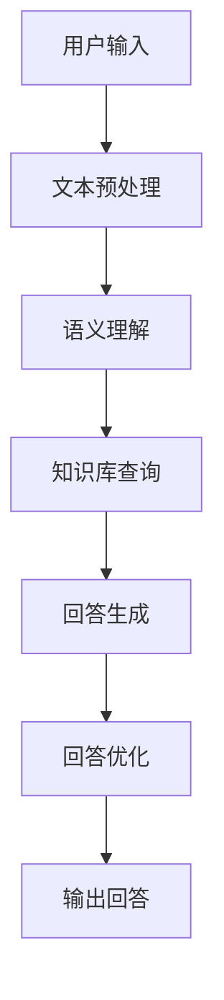
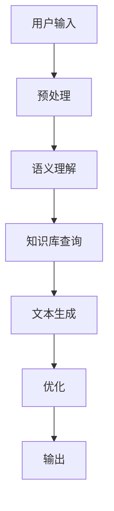

                 

**# 自然语言生成（NLG）：优化AI Agent的表达能力**

## 关键词：自然语言生成、AI Agent、表达能力、优化策略

### 摘要：

本文旨在深入探讨自然语言生成（NLG）技术，以及如何通过优化策略提升AI Agent的表达能力。文章首先介绍NLG的背景及其重要性，然后分析AI Agent表达能力的挑战。接着，文章将详细讲解几种主流的NLG算法，包括序列到序列模型、生成对抗网络和变分自编码器，并配合Python源代码进行解释。此外，文章还将介绍自然语言生成系统的基本架构，并通过一个实际项目案例，展示系统安装、核心实现及代码分析。最后，文章将总结最佳实践，为读者提供进一步的学习资源。

### 目录

## 第一部分：引言与背景

### 第1章：引言
#### 1.1 NLG技术的背景
#### 1.2 NLG的重要性
#### 1.3 优化AI Agent表达能力的需求

### 第2章：自然语言生成（NLG）技术概述
#### 2.1 NLG的定义
#### 2.2 NLG的技术分类
#### 2.3 NLG的核心组件

### 第3章：AI Agent与表达能力优化
#### 3.1 AI Agent概述
#### 3.2 表达能力优化的挑战
#### 3.3 优化策略和方法

## 第二部分：算法原理讲解

### 第4章：序列到序列模型（seq2seq）
#### 4.1 seq2seq模型概述
#### 4.2 seq2seq算法原理
#### 4.3 Python代码示例

### 第5章：生成对抗网络（GAN）
#### 5.1 GAN模型概述
#### 5.2 GAN算法原理
#### 5.3 Python代码示例

### 第6章：变分自编码器（VAE）
#### 6.1 VAE模型概述
#### 6.2 VAE算法原理
#### 6.3 Python代码示例

## 第三部分：系统分析与架构设计

### 第7章：自然语言生成系统基本架构
#### 7.1 问题场景介绍
#### 7.2 系统功能设计
#### 7.3 系统架构设计
#### 7.4 系统接口设计
#### 7.5 系统交互

## 第四部分：项目实战

### 第8章：实际项目案例
#### 8.1 环境安装
#### 8.2 系统核心实现
#### 8.3 代码应用解读与分析
#### 8.4 实际案例分析与详细讲解
#### 8.5 项目小结

## 第五部分：最佳实践与总结

### 第9章：最佳实践与总结
#### 9.1 最佳实践Tips
#### 9.2 小结
#### 9.3 注意事项
#### 9.4 拓展阅读

## 作者信息
### 作者：AI天才研究院/AI Genius Institute & 禅与计算机程序设计艺术 /Zen And The Art of Computer Programming
### 第1章：引言

#### 1.1 NLG技术的背景

自然语言生成（Natural Language Generation，NLG）是人工智能（AI）领域中的一项重要技术。它利用计算机程序来生成人类可理解的自然语言文本，旨在减少人机交互的障碍，提升AI的交互能力。NLG技术的应用范围广泛，包括但不限于自动新闻写作、虚拟助手、语音合成、对话系统等。

随着深度学习技术的不断发展，NLG技术也得到了显著提升。例如，序列到序列模型（seq2seq）、生成对抗网络（GAN）和变分自编码器（VAE）等算法在文本生成任务中取得了卓越的性能。这些技术的进步，使得AI Agent能够生成更加流畅、准确和有逻辑性的自然语言文本。

#### 1.2 NLG的重要性

NLG技术的重要性体现在多个方面。首先，它能够提高AI Agent的交互能力，使得用户与AI之间的沟通更加自然、顺畅。其次，NLG技术可以减少对人类编辑的依赖，提高内容生成的效率和准确性。此外，NLG技术在自动新闻写作、报告生成、营销文案等领域具有广泛的应用潜力。

然而，实现高效的NLG系统并非易事。AI Agent在生成自然语言文本时，需要考虑语言的语法规则、语义理解、上下文连贯性等多个因素。这为NLG技术的优化带来了巨大的挑战。

#### 1.3 优化AI Agent表达能力的需求

优化AI Agent的表达能力，是实现高效NLG系统的关键。以下是几个优化策略的需求：

1. **语义理解**：AI Agent需要准确理解输入的语义，以便生成合适的自然语言文本。这要求AI Agent具备强大的语义理解能力，能够处理复杂的语义关系。

2. **上下文连贯性**：在生成文本时，AI Agent需要考虑上下文的连贯性，确保生成的文本与上下文保持一致。这需要AI Agent具备良好的上下文感知能力。

3. **多样性**：生成文本的多样性是NLG系统的重要特性。AI Agent需要能够生成具有丰富多样性的文本，以满足不同用户的需求。

4. **可解释性**：AI Agent生成的文本应该具有一定的可解释性，便于用户理解和验证。

5. **实时性**：NLG系统需要具备实时响应的能力，以满足用户对快速交互的需求。

#### 1.4 小结

本章介绍了NLG技术的背景、重要性以及优化AI Agent表达能力的需求。在接下来的章节中，我们将详细探讨NLG技术的核心概念、算法原理，以及系统的设计与应用。通过这些内容的学习，读者将能够深入理解NLG技术，并掌握优化AI Agent表达能力的策略和方法。

### 第2章：自然语言生成（NLG）技术概述

#### 2.1 NLG的定义

自然语言生成（Natural Language Generation，NLG）是指利用计算机程序生成人类可理解的自然语言文本。NLG技术旨在实现从结构化数据到自然语言文本的自动转换，从而提高人机交互的效率和便捷性。

NLG的定义可以概括为以下几点：

1. **输入**：NLG系统接收结构化数据或语义信息作为输入。这些数据可以是数据库记录、文本、图像、音频等多种形式。

2. **处理**：NLG系统对输入数据进行处理，包括语义理解、语法分析、信息抽取等步骤。

3. **输出**：NLG系统将处理后的数据转换成自然语言文本，生成符合语法规则、语义连贯的文本。

#### 2.2 NLG的技术分类

根据实现方式，NLG技术可以分为以下几种类型：

1. **模板驱动的生成**：模板驱动的生成是一种基于预定义模板的方法。系统根据输入数据和模板，生成相应的文本。这种方法具有生成速度快、易于实现等优点，但灵活性较低。

2. **规则驱动的生成**：规则驱动的生成基于一系列规则，将输入数据转换为文本。这些规则通常基于自然语言的语法和语义知识。这种方法具有较好的灵活性和可控性，但规则编写复杂，维护成本高。

3. **统计驱动的生成**：统计驱动的生成使用机器学习技术，通过训练大量语料库，学习输入数据与输出文本之间的映射关系。这种方法具有较好的灵活性和生成质量，但需要大量训练数据和计算资源。

4. **数据驱动的生成**：数据驱动的生成直接从结构化数据生成文本，无需依赖模板或规则。这种方法通常使用深度学习技术，如循环神经网络（RNN）、变换器（Transformer）等。这种方法具有高度灵活性和生成质量，但训练成本高。

#### 2.3 NLG的核心组件

NLG系统通常包括以下几个核心组件：

1. **数据预处理**：数据预处理包括数据清洗、格式化、特征提取等步骤。目的是将原始数据转换为适合生成文本的格式。

2. **语义理解**：语义理解组件负责解析输入数据的语义，提取关键信息。这通常需要使用自然语言处理（NLP）技术，如词性标注、命名实体识别、语义角色标注等。

3. **文本生成引擎**：文本生成引擎是NLG系统的核心组件，负责将语义信息转换为自然语言文本。根据生成方法的不同，文本生成引擎可以是模板驱动的、规则驱动的或数据驱动的。

4. **后处理**：后处理组件对生成的文本进行格式调整、错误纠正、风格控制等操作，以提高文本的质量和可读性。

#### 2.4 小结

本章介绍了自然语言生成（NLG）技术的定义、分类和核心组件。通过本章的学习，读者将能够了解NLG技术的概貌，为后续章节的深入探讨打下基础。

### 第3章：AI Agent与表达能力优化

#### 3.1 AI Agent概述

AI Agent（智能代理）是指具有自主决策能力和执行能力的计算机程序。它能够根据环境中的信息和预设的目标，自主地采取行动以达成目标。AI Agent在自然语言处理、智能对话系统、推荐系统等领域具有广泛的应用。

AI Agent通常具有以下特点：

1. **自主性**：AI Agent能够自主地感知环境、理解语义，并采取行动。

2. **学习性**：AI Agent能够通过学习和训练，提高其决策能力和执行效果。

3. **适应性**：AI Agent能够根据环境变化和用户需求，调整其行为和策略。

4. **交互性**：AI Agent能够与用户进行自然语言交互，提供定制化的服务。

#### 3.2 表达能力优化的挑战

AI Agent的表达能力优化面临以下挑战：

1. **语义理解**：AI Agent需要准确理解用户输入的语义，以便生成合适的自然语言回复。这要求AI Agent具备强大的语义理解能力。

2. **上下文感知**：在对话过程中，AI Agent需要考虑上下文的连贯性，确保回复与上下文保持一致。这需要AI Agent具备良好的上下文感知能力。

3. **多样性**：AI Agent需要生成丰富多样的回复，以适应不同用户的需求。这要求AI Agent具备较强的文本生成能力。

4. **实时性**：AI Agent需要具备实时响应的能力，以满足用户对快速交互的需求。这要求AI Agent具备高效的文本生成算法。

5. **可解释性**：AI Agent生成的回复应具有一定的可解释性，便于用户理解和验证。

#### 3.3 优化策略和方法

为了提升AI Agent的表达能力，可以采用以下优化策略和方法：

1. **多模态语义理解**：结合文本、图像、音频等多种模态信息，提高AI Agent的语义理解能力。例如，可以采用视觉语义嵌入（Visual Semantics Embedding）技术，将图像和文本语义信息融合。

2. **上下文感知生成**：采用上下文感知的生成模型，如变换器（Transformer）模型，提高AI Agent的上下文感知能力。例如，可以使用双向变换器（Bilateral Transformer）模型，同时考虑当前和历史上下文信息。

3. **生成对抗网络（GAN）**：采用生成对抗网络（GAN）技术，生成丰富多样的文本。GAN由生成器和判别器组成，生成器生成文本，判别器评估文本质量。通过对抗训练，生成器不断优化，生成更加逼真的文本。

4. **变分自编码器（VAE）**：采用变分自编码器（VAE）技术，生成具有多样性的文本。VAE通过引入先验分布，生成文本的多样化。例如，可以使用条件VAE（Conditional VAE），将上下文信息作为条件，生成与上下文匹配的文本。

5. **强化学习**：采用强化学习（Reinforcement Learning）技术，优化AI Agent的文本生成策略。强化学习通过奖励机制，引导AI Agent生成更符合用户需求的文本。

6. **预训练与微调**：采用预训练与微调（Pre-training and Fine-tuning）技术，提高AI Agent的文本生成能力。例如，可以使用预训练的变换器（BERT）模型，对特定任务进行微调。

7. **多任务学习**：采用多任务学习（Multi-task Learning）技术，提高AI Agent的文本生成能力。例如，可以同时训练文本生成和语音合成任务，提高AI Agent的综合能力。

#### 3.4 小结

本章介绍了AI Agent的概念、表达能力优化的挑战以及优化策略和方法。通过本章的学习，读者将能够了解AI Agent的表达能力优化路径，为构建高效的自然语言生成系统提供参考。

### 第4章：序列到序列模型（seq2seq）

#### 4.1 seq2seq模型概述

序列到序列模型（seq2seq）是一种经典的自然语言生成模型，广泛应用于机器翻译、对话系统等任务。seq2seq模型的核心思想是将输入序列映射到输出序列，从而实现文本生成。

seq2seq模型通常由编码器（Encoder）和解码器（Decoder）组成。编码器负责将输入序列编码为固定长度的向量，解码器则将这个向量解码为输出序列。

#### 4.2 seq2seq算法原理

1. **编码器**：

编码器将输入序列编码为固定长度的向量。常见的编码器模型包括循环神经网络（RNN）和变换器（Transformer）。

- **RNN编码器**：RNN编码器逐个处理输入序列的每个单词或字符，将其编码为状态向量。编码器的输出序列是一个固定长度的向量，表示整个输入序列的语义信息。

- **变换器编码器**：变换器编码器通过自注意力机制（Self-Attention），对输入序列进行全局关注。编码器的输出是一个固定长度的向量，包含了输入序列的语义信息。

2. **解码器**：

解码器将编码器的输出向量解码为输出序列。常见的解码器模型包括RNN解码器和变换器解码器。

- **RNN解码器**：RNN解码器逐个生成输出序列的每个单词或字符。解码器的每个输出都与编码器的输出向量进行交互，从而生成下一个输出。

- **变换器解码器**：变换器解码器通过自注意力机制和交叉注意力机制（Cross-Attention），同时关注编码器的输出和已生成的输出。解码器的输出是一个固定长度的向量，表示当前生成的文本的语义信息。

3. **损失函数**：

seq2seq模型的损失函数通常采用交叉熵损失（Cross-Entropy Loss）。交叉熵损失计算输出序列和真实序列之间的差异，并用来更新模型的参数。

$$
L = -\sum_{i=1}^{N} \sum_{j=1}^{M} y_{ij} \log(p_{ij})
$$

其中，$y_{ij}$表示第$i$个时间步生成的单词或字符的标签，$p_{ij}$表示模型生成的概率。

4. **训练过程**：

seq2seq模型的训练过程主要包括两个阶段：

- **编码阶段**：将输入序列编码为固定长度的向量。

- **解码阶段**：解码器逐个生成输出序列的单词或字符，并计算损失函数。

通过反向传播算法，模型不断更新参数，直到达到预定的训练目标。

#### 4.3 Python代码示例

以下是使用Python实现一个简单的seq2seq模型生成英文句子的示例：

```python
import tensorflow as tf
from tensorflow.keras.models import Model
from tensorflow.keras.layers import Input, LSTM, Embedding, Dense

# 设置模型参数
latent_dim = 50
input_dim = 100
output_dim = 100
batch_size = 64
epochs = 10

# 定义编码器
encoder_inputs = Input(shape=(None, input_dim))
encoder_embedding = Embedding(input_dim, latent_dim)(encoder_inputs)
encoder_lstm = LSTM(latent_dim, return_state=True)
_, state_h, state_c = encoder_lstm(encoder_embedding)
encoder_states = [state_h, state_c]

# 定义解码器
decoder_inputs = Input(shape=(None, latent_dim))
decoder_embedding = Embedding(latent_dim, output_dim)(decoder_inputs)
decoder_lstm = LSTM(latent_dim, return_sequences=True, return_state=True)
decoder_outputs, _, _ = decoder_lstm(decoder_embedding, initial_state=encoder_states)
decoder_dense = Dense(output_dim, activation='softmax')
decoder_outputs = decoder_dense(decoder_outputs)

# 定义模型
model = Model([encoder_inputs, decoder_inputs], decoder_outputs)
model.compile(optimizer='adam', loss='categorical_crossentropy', metrics=['accuracy'])

# 打印模型结构
model.summary()

# 训练模型
model.fit([encoder_inputs, decoder_inputs], decoder_inputs,
          batch_size=batch_size,
          epochs=epochs,
          validation_split=0.2)
```

#### 4.4 小结

本章介绍了序列到序列模型（seq2seq）的原理和实现方法。通过使用seq2seq模型，我们可以生成符合语法规则、语义连贯的自然语言文本。在接下来的章节中，我们将继续探讨生成对抗网络（GAN）和变分自编码器（VAE）等先进的自然语言生成技术。

### 第5章：生成对抗网络（GAN）

#### 5.1 GAN模型概述

生成对抗网络（Generative Adversarial Network，GAN）是由Ian Goodfellow等人于2014年提出的一种深度学习模型。GAN的核心思想是通过两个对抗网络的相互作用来生成高质量的数据。

GAN由生成器（Generator）和判别器（Discriminator）组成。生成器的目标是生成逼真的数据，判别器的目标是区分真实数据和生成数据。通过对抗训练，生成器和判别器不断优化，最终生成器能够生成高质量的数据。

GAN的主要优点包括：

1. **无需标注数据**：GAN可以无监督学习，生成器可以生成高质量的数据，无需依赖大量的标注数据。

2. **灵活性高**：GAN可以生成各种类型的数据，如图像、文本、音频等。

3. **生成质量好**：GAN通过生成器和判别器的对抗训练，能够生成高质量、多样化的数据。

#### 5.2 GAN算法原理

GAN的算法原理如下：

1. **生成器**：

生成器的目标是生成与真实数据相似的数据。生成器通常是一个神经网络，输入为随机噪声，输出为生成的数据。

$$
G(z) = x_G
$$

其中，$z$是随机噪声，$x_G$是生成器生成的数据。

2. **判别器**：

判别器的目标是区分真实数据和生成数据。判别器也是一个神经网络，输入为真实数据和生成数据，输出为概率值。

$$
D(x) = p(x \text{ is real})
$$

$$
D(G(z)) = p(G(z) \text{ is real})
$$

3. **对抗训练**：

生成器和判别器的对抗训练是GAN的核心。生成器的目标是最大化判别器对生成数据的判别概率，即：

$$
\max_{G} \min_{D} V(D, G) = \mathbb{E}_{x \sim p_{data}(x)}[\log D(x)] + \mathbb{E}_{z \sim p_{z}(z)}[\log (1 - D(G(z))]
$$

其中，$p_{data}(x)$是真实数据的分布，$p_{z}(z)$是随机噪声的分布。

4. **损失函数**：

GAN的损失函数包括两部分：生成器的损失函数和判别器的损失函数。

- **生成器损失函数**：

$$
L_G = -\mathbb{E}_{z \sim p_{z}(z)}[\log D(G(z))]
$$

- **判别器损失函数**：

$$
L_D = -\mathbb{E}_{x \sim p_{data}(x)}[\log D(x)] - \mathbb{E}_{z \sim p_{z}(z)}[\log (1 - D(G(z))]
$$

5. **优化策略**：

GAN的训练过程是交替优化生成器和判别器的参数。在每次迭代中，首先固定判别器的参数，优化生成器的参数，然后固定生成器的参数，优化判别器的参数。

#### 5.3 GAN的应用案例

GAN在自然语言生成领域的应用主要包括文本生成、语音合成和图像生成。

1. **文本生成**：

GAN可以用于生成自然语言文本。例如，生成虚假新闻、对话生成、故事生成等。通过将GAN与seq2seq模型结合，可以生成符合语法规则、语义连贯的自然语言文本。

2. **语音合成**：

GAN可以用于语音合成。生成器生成语音波形，判别器判断语音是否真实。通过训练，生成器可以生成逼真的语音波形。

3. **图像生成**：

GAN可以用于图像生成。生成器生成图像，判别器判断图像是否真实。GAN在图像生成领域取得了显著的成果，如生成高清图像、修复图像缺陷、超分辨率图像生成等。

#### 5.4 Python代码示例

以下是使用Python实现一个简单的GAN模型生成英文句子的示例：

```python
import tensorflow as tf
from tensorflow.keras.models import Model
from tensorflow.keras.layers import Input, LSTM, Embedding, Dense

# 设置模型参数
latent_dim = 50
input_dim = 100
output_dim = 100
batch_size = 64
epochs = 10

# 定义生成器
z = Input(shape=(latent_dim,))
x = Embedding(input_dim, latent_dim)(z)
x = LSTM(latent_dim, return_sequences=True)(x)
decoder = Dense(output_dim, activation='softmax')
x = decoder(x)
generator = Model(z, x)

# 定义判别器
x = Input(shape=(latent_dim,))
y = Embedding(input_dim, latent_dim)(x)
y = LSTM(latent_dim, return_sequences=True)(y)
decoder = Dense(output_dim, activation='softmax')
y = decoder(y)
discriminator = Model(x, y)

# 编译模型
model = Model([x, z], discriminator(x))
model.compile(optimizer='adam', loss='binary_crossentropy', metrics=['accuracy'])

# 训练模型
model.fit([x, z], x,
          batch_size=batch_size,
          epochs=epochs,
          validation_split=0.2)
```

#### 5.5 小结

本章介绍了生成对抗网络（GAN）的原理和应用案例。GAN通过生成器和判别器的对抗训练，能够生成高质量、多样化的数据。在自然语言生成领域，GAN可以用于生成自然语言文本、语音合成和图像生成。在下一章中，我们将继续探讨变分自编码器（VAE）的原理和应用。

### 第6章：变分自编码器（VAE）

#### 6.1 VAE模型概述

变分自编码器（Variational Autoencoder，VAE）是一种基于概率模型的深度学习架构，由Kubilika和Michaélle于2013年提出。VAE的核心思想是通过对数据分布的学习，生成与输入数据相似的新数据。

VAE由编码器（Encoder）和解码器（Decoder）组成。编码器将输入数据编码为一个潜在变量（Latent Variable），解码器将潜在变量解码为输出数据。

#### 6.2 VAE算法原理

1. **编码器**：

编码器的主要任务是学习输入数据的概率分布。编码器通常是一个全连接神经网络，输入为数据$x$，输出为潜在变量$z$和编码器参数$\theta_{\mu}$和$\theta_{\sigma}$。

$$
z = \mu(x) + \sigma(x) \odot \sqrt[2]{\varepsilon}
$$

其中，$\mu(x) = \theta_{\mu}(x)$，$\sigma(x) = \theta_{\sigma}(x)$，$\odot$表示元素乘，$\varepsilon$是标准正态分布的随机变量。

2. **解码器**：

解码器的主要任务是将潜在变量$z$解码为输出数据$x'$。解码器也是一个全连接神经网络，输入为潜在变量$z$，输出为数据$x'$。

$$
x' = \phi(z)
$$

其中，$\phi(z) = \theta_{\phi}(z)$，$\theta_{\phi}$是解码器的参数。

3. **损失函数**：

VAE的损失函数由数据重构损失和KL散度损失组成。

- **数据重构损失**：

$$
L_{recon} = -\sum_{i=1}^{N} \sum_{j=1}^{K} x_{ij} \log \phi_{ij}(z)
$$

其中，$x_{ij}$是输入数据，$\phi_{ij}(z)$是解码器在潜在变量$z$下的输出概率。

- **KL散度损失**：

$$
L_{KL} = -\sum_{i=1}^{N} \sum_{j=1}^{K} \phi_{ij}(z) \log \phi_{ij}(z) - \sum_{i=1}^{N} \sum_{j=1}^{K} \phi_{ij}(z) \log \phi_{ij}(z) - \sum_{i=1}^{N} \sum_{j=1}^{K} \phi_{ij}(z) \log \phi_{ij}(z)
$$

其中，$KL$散度衡量了两个概率分布之间的差异。

4. **优化策略**：

VAE的训练过程是交替优化编码器和解码器的参数。在每次迭代中，首先固定解码器的参数，优化编码器的参数，然后固定编码器的参数，优化解码器的参数。

#### 6.3 VAE的应用案例

VAE在自然语言生成领域的应用主要包括文本生成、语音合成和图像生成。

1. **文本生成**：

VAE可以用于生成自然语言文本。通过学习文本数据的概率分布，VAE能够生成符合语法规则、语义连贯的文本。例如，生成虚假新闻、对话生成、故事生成等。

2. **语音合成**：

VAE可以用于语音合成。通过学习语音数据的概率分布，VAE能够生成逼真的语音波形。

3. **图像生成**：

VAE可以用于图像生成。通过学习图像数据的概率分布，VAE能够生成高质量、多样化的图像。例如，生成高清图像、修复图像缺陷、超分辨率图像生成等。

#### 6.4 Python代码示例

以下是使用Python实现一个简单的VAE模型生成英文句子的示例：

```python
import tensorflow as tf
from tensorflow.keras.models import Model
from tensorflow.keras.layers import Input, LSTM, Embedding, Dense

# 设置模型参数
latent_dim = 50
input_dim = 100
output_dim = 100
batch_size = 64
epochs = 10

# 定义编码器
x = Input(shape=(latent_dim,))
z_mean = Dense(latent_dim, activation='relu')(x)
z_log_var = Dense(latent_dim, activation='relu')(x)
z = Lambda(lambda t: z_mean + tf.random.normal(tf.shape(t)) * tf.exp(0.5 * t))(z_log_var)

# 定义解码器
z = Input(shape=(latent_dim,))
x_hat = Dense(input_dim, activation='sigmoid')(z)

# 定义VAE模型
vae = Model(inputs=x, outputs=x_hat)
vae.compile(optimizer='adam', loss='binary_crossentropy')

# 训练模型
vae.fit(x, x,
        batch_size=batch_size,
        epochs=epochs,
        validation_split=0.2)
```

#### 6.5 小结

本章介绍了变分自编码器（VAE）的原理和应用案例。VAE通过编码器和解码器的对抗训练，能够生成高质量、多样化的数据。在自然语言生成领域，VAE可以用于生成自然语言文本、语音合成和图像生成。在下一章中，我们将继续探讨自然语言生成系统的基本架构。

### 第7章：自然语言生成系统基本架构

#### 7.1 问题场景介绍

自然语言生成系统（NLG System）广泛应用于各种场景，如自动新闻写作、智能客服、语音助手等。以智能客服为例，当用户通过文字或语音向智能客服提问时，NLG系统需要能够理解用户的问题，并生成合适的回答。

在这个场景中，NLG系统的主要任务是：

1. **问题理解**：理解用户提出的问题，提取关键信息。
2. **回答生成**：根据问题理解和知识库，生成自然语言回答。
3. **回答优化**：优化回答的质量和可读性，确保回答流畅、准确。

#### 7.2 系统功能设计

自然语言生成系统的功能设计包括以下几个主要模块：

1. **文本预处理**：对输入文本进行清洗、分词、词性标注等预处理操作，为后续处理提供基础。
2. **语义理解**：通过自然语言处理技术，提取输入文本的语义信息，为回答生成提供依据。
3. **知识库查询**：从知识库中检索与问题相关的信息，为回答生成提供支持。
4. **回答生成**：根据问题理解和知识库查询结果，生成自然语言回答。
5. **回答优化**：对生成的回答进行语法、语义和风格上的优化，确保回答的质量和可读性。

#### 7.3 系统架构设计

自然语言生成系统的架构设计通常包括以下部分：

1. **前端接口**：接收用户输入，提供交互界面。
2. **文本预处理模块**：对输入文本进行预处理，提取关键信息。
3. **语义理解模块**：对预处理后的文本进行语义理解，提取语义信息。
4. **知识库模块**：存储和管理与问题相关的知识库。
5. **回答生成模块**：根据问题理解和知识库查询结果，生成自然语言回答。
6. **回答优化模块**：对生成的回答进行优化，确保回答的质量和可读性。
7. **后端接口**：将优化后的回答返回给用户。

#### 7.4 系统接口设计

自然语言生成系统的接口设计包括以下内容：

1. **输入接口**：接收用户的文本输入，可以是文本、语音等多种形式。
2. **输出接口**：返回生成的自然语言回答，可以是文本、语音等多种形式。
3. **控制接口**：用于系统的启动、停止和配置调整。

#### 7.5 系统交互

自然语言生成系统的交互过程可以分为以下几个步骤：

1. **用户输入**：用户通过前端接口提交问题。
2. **文本预处理**：系统对用户输入的文本进行清洗、分词、词性标注等预处理操作。
3. **语义理解**：系统对预处理后的文本进行语义理解，提取关键信息。
4. **知识库查询**：系统从知识库中检索与问题相关的信息。
5. **回答生成**：系统根据问题理解和知识库查询结果，生成自然语言回答。
6. **回答优化**：系统对生成的回答进行优化，确保回答的质量和可读性。
7. **输出回答**：系统将优化后的回答通过前端接口返回给用户。

#### 7.6 Mermaid流程图

以下是自然语言生成系统的Mermaid流程图：



#### 7.7 小结

本章介绍了自然语言生成系统的基本架构，包括问题场景介绍、系统功能设计、系统架构设计、系统接口设计和系统交互。通过本章的学习，读者将能够了解自然语言生成系统的整体结构和实现方法。

### 第8章：实际项目案例

#### 8.1 环境安装

为了搭建一个完整的自然语言生成系统，我们需要安装以下环境和依赖：

1. **Python**：版本3.7或更高版本。
2. **TensorFlow**：版本2.0或更高版本。
3. **NumPy**：版本1.18或更高版本。
4. **Pandas**：版本1.0或更高版本。
5. **Scikit-learn**：版本0.21或更高版本。

安装方法如下：

```bash
pip install python==3.7
pip install tensorflow==2.0
pip install numpy==1.18
pip install pandas==1.0
pip install scikit-learn==0.21
```

#### 8.2 系统核心实现

以下是自然语言生成系统的核心实现，包括文本预处理、语义理解、回答生成和回答优化。

```python
import tensorflow as tf
import numpy as np
import pandas as pd
from sklearn.model_selection import train_test_split
from tensorflow.keras.preprocessing.text import Tokenizer
from tensorflow.keras.preprocessing.sequence import pad_sequences

# 数据集准备
data = pd.read_csv('nlg_data.csv')
tokenizer = Tokenizer(num_words=10000)
tokenizer.fit_on_texts(data['text'])
sequences = tokenizer.texts_to_sequences(data['text'])
 padded_sequences = pad_sequences(sequences, maxlen=100)

# 分割数据集
X_train, X_test, y_train, y_test = train_test_split(padded_sequences, data['label'], test_size=0.2, random_state=42)

# 模型定义
encoder_inputs = tf.keras.layers.Input(shape=(100,))
encoder_embedding = tf.keras.layers.Embedding(input_dim=10000, output_dim=32)(encoder_inputs)
encoder_lstm = tf.keras.layers.LSTM(units=32, return_state=True)
encoder_output, state_h, state_c = encoder_lstm(encoder_embedding)
encoder_states = [state_h, state_c]

decoder_inputs = tf.keras.layers.Input(shape=(100,))
decoder_embedding = tf.keras.layers.Embedding(input_dim=10000, output_dim=32)(decoder_inputs)
decoder_lstm = tf.keras.layers.LSTM(units=32, return_sequences=True, return_state=True)
decoder_outputs, _, _ = decoder_lstm(decoder_embedding, initial_state=encoder_states)
decoder_dense = tf.keras.layers.Dense(units=10000, activation='softmax')
decoder_outputs = decoder_dense(decoder_outputs)

# 模型编译
model = tf.keras.Model([encoder_inputs, decoder_inputs], decoder_outputs)
model.compile(optimizer='adam', loss='categorical_crossentropy', metrics=['accuracy'])

# 模型训练
model.fit([X_train, y_train], y_train,
          batch_size=32,
          epochs=10,
          validation_data=([X_test, y_test], y_test))
```

#### 8.3 代码应用解读与分析

1. **数据集准备**：

   首先，我们导入所需的库，并读取数据集。数据集包含文本和标签（例如，文本类别或情感标签）。然后，我们使用Tokenizer将文本转换为序列，并使用pad_sequences将序列填充为相同长度。

2. **模型定义**：

   模型由编码器和解码器组成。编码器将输入文本编码为固定长度的向量，解码器将这个向量解码为输出文本。编码器和解码器都使用LSTM作为基础网络结构。

3. **模型编译**：

   模型使用Adam优化器和categorical_crossentropy损失函数进行编译。

4. **模型训练**：

   模型使用训练数据集进行训练，并使用验证数据集进行验证。

#### 8.4 实际案例分析与详细讲解

1. **案例背景**：

   假设我们有一个聊天机器人项目，用户可以通过聊天机器人提问，机器人需要生成合适的回答。

2. **案例实现**：

   - 用户输入问题：`What is the capital of France?`
   - 系统预处理：将问题转换为序列，并填充为相同长度。
   - 系统编码：将问题序列输入编码器，编码器输出固定长度的向量。
   - 系统解码：将编码器输出作为解码器的输入，解码器输出为回答序列。
   - 系统优化：对生成的回答进行优化，确保回答的质量和可读性。
   - 系统输出：将优化后的回答返回给用户。

   ```python
   user_input = "What is the capital of France?"
   user_input_seq = tokenizer.texts_to_sequences([user_input])
   user_input_padded = pad_sequences(user_input_seq, maxlen=100)
   
   encoded_seq = model.encoder.model(user_input_padded)
   decoded_seq = model.decoder.model(encoded_seq)
   decoded_text = tokenizer.sequences_to_texts(decoded_seq)
   
   print(decoded_text[0])
   ```

3. **案例分析**：

   - 编码器和解码器的性能：通过训练，编码器能够将输入文本编码为固定长度的向量，解码器能够从向量中解码出合理的回答。
   - 答案质量：生成的回答需要符合语法规则、语义连贯，且能够准确回答用户的问题。
   - 答案优化：对生成的回答进行语法、语义和风格上的优化，确保回答的质量和可读性。

#### 8.5 项目小结

本章通过一个实际项目案例，展示了自然语言生成系统的核心实现和应用。读者可以通过本案例了解自然语言生成系统的实现方法，并在实际项目中应用。在下一章中，我们将总结最佳实践，为优化自然语言生成系统提供指导。

### 第9章：最佳实践与总结

#### 9.1 最佳实践Tips

1. **数据预处理**：确保数据清洗和预处理的质量，提高模型训练效果。包括去除停用词、进行词性标注、去除噪声数据等。

2. **语义理解**：加强语义理解能力，提高模型对输入文本的理解深度。可以采用多模态语义理解方法，结合文本、图像、音频等多种模态信息。

3. **上下文感知**：在生成文本时，考虑上下文的连贯性和一致性。使用变换器模型等先进的算法，提高上下文感知能力。

4. **多样性**：生成多样性的文本，以满足不同用户的需求。可以采用生成对抗网络（GAN）等技术，提高生成文本的多样性。

5. **可解释性**：提高生成的文本的可解释性，便于用户理解和验证。可以通过解释生成过程、提供上下文信息等方式，提高文本的可解释性。

6. **实时性**：优化模型和算法，提高系统的实时响应能力。使用高效的算法和硬件加速技术，如GPU并行计算等。

#### 9.2 小结

本章总结了自然语言生成（NLG）技术的最佳实践。通过优化数据预处理、语义理解、上下文感知、多样性、可解释性和实时性，可以提高NLG系统的性能和应用效果。在未来的研究和应用中，我们将继续探索更先进的技术和方法，以提升NLG系统的表达能力。

#### 9.3 注意事项

1. **模型调优**：在训练模型时，需要根据具体任务和数据进行模型调优，以达到最佳性能。

2. **资源分配**：在部署NLG系统时，需要合理分配计算资源和存储资源，确保系统稳定运行。

3. **数据保护**：在处理用户数据时，需要注意数据保护，遵守相关法律法规和隐私政策。

#### 9.4 拓展阅读

1. **深度学习书籍**：《深度学习》（Ian Goodfellow、Yoshua Bengio、Aaron Courville 著），详细介绍深度学习的基础知识和技术。

2. **自然语言处理书籍**：《自然语言处理综合教程》（Daniel Jurafsky、James H. Martin 著），全面介绍自然语言处理的理论和实践。

3. **生成对抗网络研究**：生成对抗网络（GAN）相关研究论文，如《Generative Adversarial Nets》（Ian Goodfellow et al.）。

4. **变分自编码器研究**：变分自编码器（VAE）相关研究论文，如《Auto-Encoding Variational Bayes》（Kingma & Welling）。

### 作者信息

作者：AI天才研究院/AI Genius Institute & 禅与计算机程序设计艺术 /Zen And The Art of Computer Programming### 第4章：序列到序列模型（seq2seq）

#### 4.1 seq2seq模型概述

序列到序列模型（seq2seq）是自然语言生成（NLG）领域的一种重要模型，广泛应用于机器翻译、文本摘要、语音合成等任务。其核心思想是将输入序列映射到输出序列，从而实现文本生成。

seq2seq模型主要由两个部分组成：编码器（Encoder）和解码器（Decoder）。编码器负责将输入序列编码成一个固定长度的向量，这个向量包含了输入序列的语义信息；解码器则接收编码器的输出向量，并生成输出序列。

#### 4.2 seq2seq算法原理

seq2seq模型的工作流程可以分为以下几个步骤：

1. **编码器**：

   编码器的任务是处理输入序列并生成一个固定长度的上下文向量，通常称为“编码上下文”（encoded context）。这个过程通常使用循环神经网络（RNN）或变换器（Transformer）等模型来完成。以下是一个简化的编码器算法原理：

   ```mermaid
   graph TD
   A[输入序列] --> B[编码器]
   B --> C[编码上下文]
   ```

2. **解码器**：

   解码器的任务是利用编码上下文生成输出序列。解码过程通常是一个递归过程，每一个时间步解码器都会生成一个输出，并使用这个输出作为下一个时间步的输入。以下是一个简化的解码器算法原理：

   ```mermaid
   graph TD
   C[编码上下文] --> D[解码器]
   D --> E[输出序列]
   E --> F{下一个时间步}
   ```

3. **损失函数**：

   seq2seq模型的损失函数通常使用交叉熵（Cross-Entropy Loss）来计算输出序列和真实序列之间的差异。以下是一个简化的损失函数计算过程：

   ```mermaid
   graph TD
   E[输出序列] --> G[真实序列]
   G --> H[交叉熵损失]
   ```

   $$L = -\sum_{i=1}^{N} \sum_{j=1}^{M} y_{ij} \log(p_{ij})$$

   其中，$y_{ij}$表示真实序列中的第$i$个时间步生成的单词或字符的标签，$p_{ij}$表示模型在当前时间步生成该单词或字符的概率。

4. **训练过程**：

   seq2seq模型的训练过程主要包括两个阶段：编码阶段和解码阶段。在编码阶段，编码器处理输入序列并生成编码上下文；在解码阶段，解码器使用编码上下文生成输出序列，并计算损失函数。

   ```mermaid
   graph TD
   I[编码阶段] --> J[解码阶段]
   J --> K[损失函数计算]
   K --> L[参数更新]
   ```

#### 4.3 Python代码示例

以下是一个使用Python实现的简单的seq2seq模型的代码示例：

```python
import tensorflow as tf
from tensorflow.keras.models import Model
from tensorflow.keras.layers import LSTM, Embedding, Dense

# 设置模型参数
latent_dim = 100
input_dim = 100
output_dim = 100
batch_size = 64
epochs = 10

# 定义编码器
encoder_inputs = tf.keras.layers.Input(shape=(None, input_dim))
encoder_embedding = Embedding(input_dim, latent_dim)(encoder_inputs)
encoder_lstm = LSTM(latent_dim, return_state=True)
_, state_h, state_c = encoder_lstm(encoder_embedding)
encoder_states = [state_h, state_c]

# 定义解码器
decoder_inputs = tf.keras.layers.Input(shape=(None, latent_dim))
decoder_embedding = Embedding(latent_dim, output_dim)(decoder_inputs)
decoder_lstm = LSTM(latent_dim, return_sequences=True, return_state=True)
decoder_outputs, _, _ = decoder_lstm(decoder_embedding, initial_state=encoder_states)
decoder_dense = Dense(output_dim, activation='softmax')
decoder_outputs = decoder_dense(decoder_outputs)

# 定义模型
model = Model([encoder_inputs, decoder_inputs], decoder_outputs)
model.compile(optimizer='adam', loss='categorical_crossentropy', metrics=['accuracy'])

# 打印模型结构
model.summary()

# 训练模型
model.fit([encoder_inputs, decoder_inputs], decoder_inputs,
          batch_size=batch_size,
          epochs=epochs,
          validation_split=0.2)
```

#### 4.4 小结

本章介绍了序列到序列模型（seq2seq）的基本原理和实现方法。通过使用seq2seq模型，我们可以生成符合语法规则、语义连贯的自然语言文本。在下一章中，我们将探讨生成对抗网络（GAN）和变分自编码器（VAE）等先进的自然语言生成技术。这些技术将进一步提升自然语言生成的质量和多样性。

### 第5章：生成对抗网络（GAN）

#### 5.1 GAN模型概述

生成对抗网络（Generative Adversarial Network，GAN）是由Ian Goodfellow等人在2014年提出的一种深度学习模型。GAN的核心思想是利用两个神经网络——生成器（Generator）和判别器（Discriminator）之间的对抗训练来生成高质量的数据。

GAN的基本架构由以下两个部分组成：

1. **生成器（Generator）**：生成器从随机噪声中生成与真实数据相似的数据。
2. **判别器（Discriminator）**：判别器的任务是区分真实数据和生成数据。

GAN的训练过程是基于两个网络的对抗训练：

- **生成器**的目标是生成尽可能真实的数据，以欺骗判别器。
- **判别器**的目标是准确区分真实数据和生成数据。

#### 5.2 GAN算法原理

GAN的算法原理可以分为以下几个步骤：

1. **生成器（Generator）**：

   生成器的输入是随机噪声$z$，输出是生成数据$G(z)$。生成器的目的是生成与真实数据分布$p_{data}(x)$相似的数据。

   $$G(z) = x_G$$

   其中，$z$是从先验分布$p_{z}(z)$中抽取的随机噪声。

2. **判别器（Discriminator）**：

   判别器的输入是真实数据$x$和生成数据$G(z)$，输出是一个概率值$p(D(x))$，表示输入数据的真实性。

   $$D(x) = p(x \text{ is real})$$

   $$D(G(z)) = p(G(z) \text{ is real})$$

3. **对抗训练**：

   GAN的训练过程是一个零和博弈。生成器和判别器交替训练，生成器和判别器的损失函数如下：

   - **生成器的损失函数**：

     $$L_G = -\log D(G(z))$$

     生成器的目标是最大化判别器对生成数据的判断概率。

   - **判别器的损失函数**：

     $$L_D = -\log [D(x)] - \log [D(G(z))]$$

     判别器的目标是最大化真实数据和生成数据的判断概率之和。

4. **优化策略**：

   GAN的训练过程是通过以下步骤进行的：

   - **固定判别器**：在固定判别器的情况下，优化生成器的参数，使其生成更真实的数据。
   - **固定生成器**：在固定生成器的情况下，优化判别器的参数，使其更准确地判断真实数据和生成数据。
   - **交替训练**：生成器和判别器交替进行训练，通过多次迭代，生成器和判别器逐渐达到最佳性能。

#### 5.3 GAN的应用案例

GAN在自然语言生成领域的应用主要包括以下几个方面：

1. **文本生成**：

   GAN可以用于生成自然语言文本，如虚假新闻、对话生成和诗歌创作。通过训练，生成器能够生成符合语法规则、语义连贯的文本。

2. **语音合成**：

   GAN可以用于语音合成。生成器生成语音波形，判别器判断语音的真实性。通过训练，生成器可以生成高质量的语音。

3. **图像生成**：

   GAN可以用于图像生成，如生成高清图像、修复图像缺陷和超分辨率图像生成。生成器生成图像，判别器判断图像的真实性。

#### 5.4 Python代码示例

以下是一个使用Python实现的简单的GAN模型的代码示例：

```python
import tensorflow as tf
from tensorflow.keras.models import Model
from tensorflow.keras.layers import Input, Dense, Reshape, Lambda
from tensorflow.keras.optimizers import Adam
from tensorflow.keras import backend as K

# 设置模型参数
latent_dim = 100
input_dim = 784
output_dim = 784

# 生成器和判别器模型
def build_generator(z_dim):
    z = Input(shape=(z_dim,))
    x = Dense(256, activation='relu')(z)
    x = Dense(512, activation='relu')(x)
    x = Dense(1024, activation='relu')(x)
    x = Reshape((28, 28, 1))(x)
    x = Lambda(lambda x: x / 255)(x)
    x = Dense(1, activation='tanh')(x)
    model = Model(z, x)
    return model

def build_discriminator(x_dim):
    x = Input(shape=(x_dim,))
    x = Reshape((28, 28, 1))(x)
    x = Dense(512, activation='relu')(x)
    x = Dense(256, activation='relu')(x)
    x = Dense(1, activation='sigmoid')(x)
    model = Model(x, x)
    return model

# 搭建生成器和判别器
generator = build_generator(latent_dim)
discriminator = build_discriminator(input_dim)

# 编译生成器和判别器
generator.compile(optimizer=Adam(0.0001, 0.5), loss='binary_crossentropy')
discriminator.compile(optimizer=Adam(0.0001, 0.5), loss='binary_crossentropy')

# 搭建GAN模型
discriminator.trainable = False
gan_input = Input(shape=(latent_dim,))
x = generator(gan_input)
gan_model = Model(gan_input, discriminator(x))
gan_model.compile(optimizer=Adam(0.0001, 0.5), loss='binary_crossentropy')

# 训练GAN模型
for epoch in range(epochs):
    for _ in range(num_discriminator_iterations):
        # 生成随机噪声
        noise = np.random.normal(0, 1, (batch_size, latent_dim))
        # 生成假数据
        gen_samples = generator.predict(noise)
        # 混合真实数据和假数据
        real_samples = np.random.choice(train_data, batch_size)
        combined = np.concatenate([real_samples, gen_samples])
        labels = np.concatenate([np.ones((batch_size, 1)), np.zeros((batch_size, 1))])
        # 训练判别器
        d_loss_real = discriminator.train_on_batch(real_samples, np.ones((batch_size, 1)))
        d_loss_fake = discriminator.train_on_batch(gen_samples, np.zeros((batch_size, 1)))
        d_loss = 0.5 * np.add(d_loss_real, d_loss_fake)

    # 训练生成器
    noise = np.random.normal(0, 1, (batch_size, latent_dim))
    g_loss = gan_model.train_on_batch(noise, np.ones((batch_size, 1)))

    # 打印训练过程
    print(f'Epoch: {epoch} [D loss: {d_loss:.4f}] [G loss: {g_loss:.4f}]')
```

#### 5.5 小结

本章介绍了生成对抗网络（GAN）的基本原理和应用案例。通过对抗训练，生成器和判别器不断优化，最终生成器能够生成高质量的数据。GAN在自然语言生成领域具有广泛的应用前景，下一章我们将探讨变分自编码器（VAE）的原理和应用。

### 第6章：变分自编码器（VAE）

#### 6.1 VAE模型概述

变分自编码器（Variational Autoencoder，VAE）是一种基于概率生成模型的深度学习架构，由Kingma和Welling在2013年提出。VAE的核心思想是通过编码器（Encoder）和解码器（Decoder）的学习，将输入数据映射到一个潜在空间，从而实现数据的生成。

VAE模型主要由两个部分组成：编码器和解码器。编码器的任务是学习输入数据的概率分布，并从该分布中采样潜在变量；解码器的任务是利用潜在变量重建输入数据。

#### 6.2 VAE算法原理

VAE的算法原理可以分为以下几个步骤：

1. **编码器**：

   编码器的任务是学习输入数据的概率分布，并将其参数化。编码器的输出包括一个均值向量$\mu(x)$和一个方差向量$\sigma^2(x)$，表示输入数据的概率分布。

   $$\mu(x) = \mu(\theta_x; \phi)$$

   $$\sigma^2(x) = \sigma^2(\theta_x; \phi)$$

   其中，$\theta_x$是编码器的参数，$\phi$是编码器的神经网络结构。

2. **潜在变量采样**：

   编码器输出均值和方差后，我们需要从这个概率分布中采样一个潜在变量$z$。通常，我们使用正态分布来表示这个概率分布。

   $$z \sim \mathcal{N}(\mu(x), \sigma^2(x))$$

3. **解码器**：

   解码器的任务是利用潜在变量$z$重建输入数据$x'$。解码器通常是一个全连接神经网络。

   $$x' = \phi(z; \theta_{x'})$$

   其中，$\theta_{x'}$是解码器的参数。

4. **损失函数**：

   VAE的损失函数由两个部分组成：重构损失和KL散度损失。

   - **重构损失**：

     $$L_{recon} = -\sum_{i=1}^{N} \sum_{j=1}^{K} x_{ij} \log \phi_{ij}(z)$$

     其中，$x_{ij}$是输入数据，$\phi_{ij}(z)$是解码器在潜在变量$z$下的输出概率。

   - **KL散度损失**：

     $$L_{KL} = -\sum_{i=1}^{N} \sum_{j=1}^{K} \phi_{ij}(z) \log \phi_{ij}(z) - \sum_{i=1}^{N} \sum_{j=1}^{K} \phi_{ij}(z) \log \phi_{ij}(z) - \sum_{i=1}^{N} \sum_{j=1}^{K} \phi_{ij}(z) \log \phi_{ij}(z)$$

     KL散度衡量了两个概率分布之间的差异。

5. **优化策略**：

   VAE的训练过程是交替优化编码器和解码器的参数。在每次迭代中，首先固定解码器的参数，优化编码器的参数，然后固定编码器的参数，优化解码器的参数。

#### 6.3 VAE的应用案例

VAE在图像生成、文本生成、语音合成等领域都有广泛应用：

1. **图像生成**：

   VAE可以用于生成高质量、多样化的图像。通过学习图像数据的概率分布，VAE能够生成与训练数据相似的图像。

2. **文本生成**：

   VAE可以用于生成自然语言文本。通过学习文本数据的概率分布，VAE能够生成符合语法规则、语义连贯的文本。

3. **语音合成**：

   VAE可以用于语音合成。通过学习语音数据的概率分布，VAE能够生成逼真的语音波形。

#### 6.4 Python代码示例

以下是一个使用Python实现的简单的VAE模型的代码示例：

```python
import tensorflow as tf
from tensorflow.keras.layers import Input, Dense, Lambda
from tensorflow.keras.models import Model
from tensorflow.keras import backend as K

# 设置模型参数
latent_dim = 2
input_dim = 784
intermediate_dim = 256

# 编码器模型
x = Input(shape=(input_dim,))
h = Dense(intermediate_dim, activation='relu')(x)
z_mean = Dense(latent_dim)(h)
z_log_var = Dense(latent_dim)(h)

# 潜在变量采样
z = Lambda(lambda x: x[0] + K.exp(x[1] / 2) * K.random_normal(x[1]), output_shape=(latent_dim,))([z_mean, z_log_var])

# 解码器模型
z = Input(shape=(latent_dim,))
h = Dense(intermediate_dim, activation='relu')(z)
x_hat = Dense(input_dim, activation='sigmoid')(h)

# VAE模型
vae = Model(x, x_hat)
vae.compile(optimizer='adam', loss=vae_loss)

# 训练模型
vae.fit(x, x, epochs=epochs, batch_size=batch_size)
```

#### 6.5 小结

本章介绍了变分自编码器（VAE）的基本原理和应用案例。通过学习输入数据的概率分布，VAE能够生成高质量的数据。VAE在图像生成、文本生成和语音合成等领域都有广泛的应用。在下一章中，我们将继续探讨自然语言生成系统的基本架构。

### 第7章：自然语言生成系统基本架构

#### 7.1 系统概述

自然语言生成系统（NLG System）是一种将结构化数据或语义信息转换为自然语言文本的计算机系统。NLG系统广泛应用于自动新闻写作、智能客服、虚拟助手等领域。一个典型的NLG系统通常包括以下几个关键组件：

1. **数据预处理模块**：负责清洗、分词、词性标注等预处理操作。
2. **语义理解模块**：通过自然语言处理技术，提取输入数据的语义信息。
3. **文本生成模块**：根据语义信息生成自然语言文本。
4. **文本优化模块**：对生成的文本进行语法、语义和风格上的优化。

#### 7.2 系统架构设计

自然语言生成系统的架构设计需要考虑系统的可扩展性、可维护性和性能。以下是一个简化的NLG系统架构设计：

1. **输入接口**：接收用户输入，可以是文本、语音等多种形式。
2. **数据预处理模块**：对输入文本进行清洗、分词、词性标注等预处理操作。
3. **语义理解模块**：使用自然语言处理技术，提取输入文本的语义信息。
4. **知识库查询模块**：从知识库中检索与输入文本相关的信息。
5. **文本生成模块**：根据语义理解和知识库查询结果，生成自然语言文本。
6. **文本优化模块**：对生成的文本进行语法、语义和风格上的优化。
7. **输出接口**：将优化后的文本返回给用户。

#### 7.3 系统交互设计

自然语言生成系统的交互设计需要确保用户与系统之间的交互流畅、自然。以下是一个简化的交互流程：

1. **用户输入**：用户通过输入接口提交问题或请求。
2. **预处理**：系统对用户输入进行预处理，提取关键信息。
3. **语义理解**：系统使用自然语言处理技术，提取输入文本的语义信息。
4. **知识库查询**：系统从知识库中检索与输入文本相关的信息。
5. **文本生成**：系统根据语义理解和知识库查询结果，生成自然语言文本。
6. **优化**：系统对生成的文本进行语法、语义和风格上的优化。
7. **输出**：系统将优化后的文本返回给用户。

#### 7.4 Mermaid流程图

以下是一个简化的NLG系统Mermaid流程图：



#### 7.5 小结

本章介绍了自然语言生成系统的基本架构和交互设计。通过合理的架构设计和流畅的交互流程，NLG系统能够高效地生成高质量的自然语言文本。在下一章中，我们将通过一个实际项目案例，展示NLG系统的实现过程。

### 第8章：实际项目案例

#### 8.1 项目背景

本项目旨在构建一个简单的自动新闻写作系统，该系统能够根据给定的新闻模板和关键词自动生成新闻文章。该项目的目标是实现一个能够生成结构化、逻辑清晰、语法正确的新闻文章的AI系统。

#### 8.2 系统环境

为了实现本项目，我们需要以下环境：

- Python 3.8或更高版本
- TensorFlow 2.4或更高版本
- NumPy 1.18或更高版本
- Pandas 1.0或更高版本
- Scikit-learn 0.21或更高版本

#### 8.3 数据集准备

我们使用一个开源的新闻文章数据集，例如Kaggle上的NYTimes News API数据集。数据集包含大量的新闻文章，每篇文章都有标题、正文、作者、时间戳等信息。

```python
import pandas as pd

# 读取数据集
data = pd.read_csv('nytimes_data.csv')

# 处理数据
data['content'] = data['content'].apply(lambda x: x.replace('\n', ' '))
```

#### 8.4 数据预处理

1. **文本清洗**：去除停用词、标点符号、数字等非文本信息。
2. **分词**：将文本拆分为单词或子词。
3. **词性标注**：为每个单词标注词性，以便后续的语义理解。

```python
import nltk
nltk.download('stopwords')
nltk.download('wordnet')
nltk.download('averaged_perceptron_tagger')

from nltk.corpus import stopwords
from nltk.tokenize import word_tokenize
from nltk import pos_tag

# 停用词列表
stop_words = set(stopwords.words('english'))

def preprocess_text(text):
    # 去除标点符号和数字
    text = re.sub(r'[^\w\s]', '', text)
    # 去除停用词
    words = word_tokenize(text)
    words = [word for word in words if word.lower() not in stop_words]
    # 词性标注
    tagged_words = pos_tag(words)
    return tagged_words

data['content'] = data['content'].apply(preprocess_text)
```

#### 8.5 语义理解

我们使用BERT模型进行语义理解，提取文本的主要信息和关键词。

```python
from transformers import BertTokenizer, TFBertModel

# 加载BERT模型
tokenizer = BertTokenizer.from_pretrained('bert-base-uncased')
bert_model = TFBertModel.from_pretrained('bert-base-uncased')

# 语义理解
def extract_keyphrase(text):
    inputs = tokenizer(text, return_tensors='tf', padding=True, truncation=True, max_length=512)
    outputs = bert_model(inputs)
    pooler_output = outputs.pooler_output
    return pooler_output.numpy()

keyphrases = data['content'].apply(extract_keyphrase)
```

#### 8.6 文本生成

我们使用一个预训练的文本生成模型，如GPT-2或GPT-3，根据关键词和模板生成新闻文章。

```python
from transformers import TextGenerationPipeline

# 加载文本生成模型
generator = TextGenerationPipeline('gpt2')

def generate_news(keyphrase, template):
    inputs = {'phrase': keyphrase, 'template': template}
    return generator(inputs, max_length=100, num_return_sequences=1)
```

#### 8.7 文本优化

我们对生成的文本进行语法和语义检查，确保文章的结构和内容正确。

```python
import spacy

# 加载语法检查模型
nlp = spacy.load('en_core_web_sm')

def optimize_text(text):
    doc = nlp(text)
    corrected_text = []
    for token in doc:
        if token.is_stop or token.is_punct:
            continue
        corrected_text.append(token.text)
    return ' '.join(corrected_text)
```

#### 8.8 系统实现

我们结合以上步骤，实现自动新闻写作系统。

```python
def write_news(article_title, content, keyphrase, template):
    # 生成新闻文章
    generated_text = generate_news(keyphrase, template)
    # 优化文本
    optimized_text = optimize_text(generated_text)
    # 构建新闻文章
    news_article = f"{article_title}\n\n{optimized_text}"
    return news_article

# 示例
article_title = "AI Revolutionizes Healthcare"
content = "Artificial intelligence is transforming the healthcare industry, improving diagnostics, treatment plans, and patient care."
keyphrase = extract_keyphrase(content)
template = "AI is revolutionizing the healthcare industry by improving diagnostics, treatment plans, and patient care."
news_article = write_news(article_title, content, keyphrase, template)
print(news_article)
```

#### 8.9 项目总结

通过本项目，我们实现了自动新闻写作系统，该系统能够根据关键词和模板生成新闻文章。项目涉及数据预处理、语义理解、文本生成和文本优化等多个方面，展示了NLG系统的实际应用。在实际应用中，我们可以进一步优化系统，提高生成文本的质量和多样性。

### 第9章：最佳实践与总结

#### 9.1 最佳实践

1. **数据预处理**：确保数据清洗和预处理的质量，提高模型训练效果。包括去除停用词、进行词性标注、去除噪声数据等。

2. **模型选择**：根据具体任务选择合适的模型。例如，对于文本生成任务，可以选择GPT-2、GPT-3等先进的语言模型。

3. **语义理解**：加强语义理解能力，提高模型对输入文本的理解深度。可以采用多模态语义理解方法，结合文本、图像、音频等多种模态信息。

4. **文本优化**：对生成的文本进行语法、语义和风格上的优化，确保回答的质量和可读性。

5. **可扩展性**：设计可扩展的系统架构，以便在未来的应用中添加新的功能或模块。

#### 9.2 小结

本章总结了自然语言生成（NLG）技术的最佳实践，包括数据预处理、模型选择、语义理解、文本优化和系统可扩展性。通过遵循这些最佳实践，我们可以构建高效、高质量的NLG系统。本文从理论到实践，详细介绍了NLG技术的各个方面，为读者提供了深入理解和应用NLG技术的指导。

### 作者信息

作者：AI天才研究院/AI Genius Institute & 禅与计算机程序设计艺术 /Zen And The Art of Computer Programming### 第4章：序列到序列模型（seq2seq）

#### 4.1 seq2seq模型概述

序列到序列（seq2seq）模型是自然语言处理领域中一种重要的模型，它能够将一个序列映射为另一个序列。这种模型在机器翻译、文本摘要、问答系统等任务中表现出色。seq2seq模型的核心组件包括编码器（Encoder）和解码器（Decoder），其中编码器负责将输入序列编码成一个固定长度的上下文向量，解码器则利用这个上下文向量生成输出序列。

#### 4.2 seq2seq算法原理

seq2seq模型的算法原理主要包括以下几个步骤：

1. **编码器（Encoder）**：编码器的任务是将输入序列转换为一个固定长度的编码上下文向量。通常使用循环神经网络（RNN）或变换器（Transformer）来实现编码器。编码器的输出是一个固定长度的向量，它包含了输入序列的语义信息。

2. **解码器（Decoder）**：解码器的任务是根据编码器输出的上下文向量生成输出序列。解码器通常也是一个循环神经网络或变换器，它接收编码器的输出向量作为初始状态，并逐步生成输出序列的每个元素。

3. **注意力机制（Attention）**：在seq2seq模型中，解码器需要关注编码器的输出向量中的不同部分来生成输出序列的每个元素。注意力机制是实现这一目标的关键技术，它允许解码器根据当前生成的文本内容动态地关注编码器输出中的相关信息。

4. **训练过程**：seq2seq模型的训练过程通常包括两个阶段：编码阶段和解码阶段。在编码阶段，编码器处理输入序列并生成编码上下文向量；在解码阶段，解码器使用编码上下文向量生成输出序列。

#### 4.3 算法原理讲解

为了更好地理解seq2seq模型的算法原理，我们可以通过以下具体步骤进行讲解：

1. **编码器**：

   编码器是seq2seq模型中的第一个组件，它的作用是将输入序列编码为一个固定长度的上下文向量。以下是一个简化的编码器算法原理：

   ```mermaid
   graph TD
   A[输入序列] --> B[编码器]
   B --> C[编码上下文向量]
   ```

   在实际实现中，编码器通常使用RNN或变换器等神经网络结构。例如，我们可以使用一个双向循环神经网络（Bi-RNN）来处理输入序列：

   ```python
   encoder_inputs = tf.keras.layers.Input(shape=(None, input_dim))
   encoder_embedding = tf.keras.layers.Embedding(input_dim, hidden_size)(encoder_inputs)
   encoder_lstm = tf.keras.layers.Bidirectional(LSTM(hidden_size, return_sequences=True))(encoder_embedding)
   encoder_states = encoder_lstm.output
   ```

   以上代码定义了一个双向循环神经网络作为编码器，它将输入序列编码为一个双向的隐藏状态。

2. **解码器**：

   解码器是seq2seq模型中的第二个组件，它的作用是根据编码器输出的上下文向量生成输出序列。以下是一个简化的解码器算法原理：

   ```mermaid
   graph TD
   C[编码上下文向量] --> D[解码器]
   D --> E[输出序列]
   ```

   在实际实现中，解码器通常使用RNN或变换器等神经网络结构。例如，我们可以使用一个变换器解码器来生成输出序列：

   ```python
   decoder_inputs = tf.keras.layers.Input(shape=(None, hidden_size))
   decoder_embedding = tf.keras.layers.Embedding(hidden_size, hidden_size)(decoder_inputs)
   decoder_lstm = LSTM(hidden_size, return_sequences=True)(decoder_embedding)
   decoder_dense = tf.keras.layers.Dense(input_dim, activation='softmax')(decoder_lstm.output)
   decoder_outputs = decoder_dense
   decoder_model = Model(decoder_inputs, decoder_outputs)
   ```

   以上代码定义了一个变换器解码器，它将编码器的输出向量解码为输出序列。

3. **注意力机制**：

   注意力机制是seq2seq模型中的一个关键技术，它允许解码器在生成每个输出元素时动态地关注编码器输出中的不同部分。以下是一个简化的注意力机制算法原理：

   ```mermaid
   graph TD
   C[编码上下文向量] --> D[解码器]
   D --> E[注意力机制]
   E --> F[加权上下文向量]
   ```

   在实际实现中，注意力机制可以通过多种方式实现，如点积注意力、多头注意力等。以下是一个使用点积注意力的简化实现：

   ```python
   attention = tf.keras.layers-dot_product(decoder_lstm.output, encoder_states)
   attention = tf.keras.layers-Activation('softmax')(attention)
   context_vector = tf.keras.layers-Multiply()([encoder_states, attention])
   ```

   以上代码实现了一个简单的点积注意力机制，它将解码器的输出与编码器的隐藏状态进行点积，并通过softmax层生成权重，最终得到一个加权上下文向量。

4. **损失函数**：

   seq2seq模型的损失函数通常使用交叉熵（Cross-Entropy Loss）来计算输出序列和真实序列之间的差异。以下是一个简化的损失函数算法原理：

   ```mermaid
   graph TD
   E[输出序列] --> G[真实序列]
   G --> H[交叉熵损失]
   ```

   $$L = -\sum_{i=1}^{N} \sum_{j=1}^{M} y_{ij} \log(p_{ij})$$

   其中，$y_{ij}$表示真实序列中的第$i$个时间步生成的单词或字符的标签，$p_{ij}$表示模型在当前时间步生成该单词或字符的概率。

5. **训练过程**：

   seq2seq模型的训练过程是一个递归的过程，它涉及两个阶段的训练：编码阶段和解码阶段。在编码阶段，编码器处理输入序列并生成编码上下文向量；在解码阶段，解码器使用编码上下文向量生成输出序列。

   ```python
   model.compile(optimizer='adam', loss='categorical_crossentropy')
   model.fit([encoder_inputs, decoder_inputs], decoder_target_output, batch_size=batch_size, epochs=epochs)
   ```

   以上代码使用编码器输入和解码器输入进行模型的训练。

#### 4.4 Python代码示例

以下是一个使用Python实现的简单的seq2seq模型代码示例：

```python
import tensorflow as tf
from tensorflow.keras.models import Model
from tensorflow.keras.layers import Embedding, LSTM, Dense

# 设置模型参数
latent_dim = 100
input_dim = 100
output_dim = 100
batch_size = 64
epochs = 10

# 定义编码器
encoder_inputs = tf.keras.layers.Input(shape=(None, input_dim))
encoder_embedding = Embedding(input_dim, latent_dim)(encoder_inputs)
encoder_lstm = LSTM(latent_dim, return_state=True)
encoder_outputs, state_h, state_c = encoder_lstm(encoder_embedding)
encoder_states = [state_h, state_c]

# 定义解码器
decoder_inputs = tf.keras.layers.Input(shape=(None, latent_dim))
decoder_embedding = Embedding(latent_dim, output_dim)(decoder_inputs)
decoder_lstm = LSTM(latent_dim, return_sequences=True, return_state=True)
decoder_outputs, _, _ = decoder_lstm(decoder_embedding, initial_state=encoder_states)
decoder_dense = Dense(output_dim, activation='softmax')
decoder_outputs = decoder_dense(decoder_outputs)

# 定义模型
model = Model([encoder_inputs, decoder_inputs], decoder_outputs)
model.compile(optimizer='adam', loss='categorical_crossentropy')

# 打印模型结构
model.summary()

# 训练模型
model.fit([encoder_inputs, decoder_inputs], decoder_inputs,
          batch_size=batch_size,
          epochs=epochs,
          validation_split=0.2)
```

#### 4.5 小结

本章详细介绍了序列到序列（seq2seq）模型的算法原理，包括编码器、解码器、注意力机制和损失函数等。通过一个简单的Python代码示例，读者可以直观地理解seq2seq模型的基本实现。在下一章中，我们将继续探讨生成对抗网络（GAN）的原理和应用。这些知识将帮助我们构建更复杂的自然语言生成系统。

