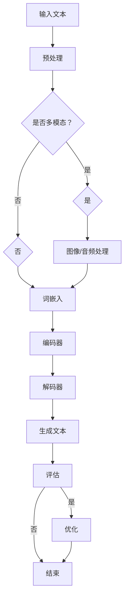

                 

# 自然语言生成：提升AI Agent的表达能力

> 关键词：自然语言生成、AI Agent、序列到序列模型、生成对抗网络、预训练与微调、文本生成模型、多模态生成、生成式对话系统

> 摘要：本文将探讨自然语言生成（NLG）技术的核心概念、算法原理、应用实践和未来发展趋势，旨在帮助读者深入理解自然语言生成技术，并提升AI Agent的表达能力。

## 目录大纲

1. 第一部分：自然语言生成概述
   - 第1章：自然语言生成简介
   - 第2章：自然语言处理基础
   - 第3章：序列到序列模型
   - 第4章：生成对抗网络（GAN）
   - 第5章：预训练与微调
   - 第6章：文本生成模型
   - 第7章：高级自然语言生成技术
   - 第8章：自然语言生成实践
   - 第9章：自然语言生成的未来发展趋势

## 第一部分：自然语言生成概述

### 第1章：自然语言生成简介

#### 1.1 自然语言生成的重要性

自然语言生成是一种将机器学习技术应用于构建能够生成自然语言文本的系统。在人工智能领域中，自然语言生成的重要性不言而喻。它不仅能够为用户生成有意义的文本，还能够帮助AI Agent与人类进行更自然、流畅的交流。

#### 1.2 自然语言生成的挑战

自然语言生成面临许多挑战，包括语言的多样性和复杂性、语义理解、上下文理解、语法生成等。此外，如何保证生成的文本具有可读性和连贯性也是一大挑战。

#### 1.3 自然语言生成的应用场景

自然语言生成技术可以应用于多种场景，如自动摘要、机器翻译、智能客服、内容生成等。这些应用场景对于提升AI Agent的表达能力具有重要意义。

### 第2章：自然语言处理基础

#### 2.1 语言模型

语言模型是自然语言生成的基础，它用于预测文本序列的概率分布。本文将介绍语言模型的定义、工作原理和应用。

#### 2.2 词嵌入

词嵌入是将词汇映射到高维空间的一种技术，它有助于捕捉词汇之间的关系。本文将探讨词嵌入的概念、方法和在自然语言处理中的应用。

### 第3章：序列到序列模型

序列到序列（Seq2Seq）模型是一种能够处理序列数据的深度学习模型，它在自然语言生成中发挥着重要作用。本文将介绍序列到序列模型的原理、应用和优化方法。

### 第4章：生成对抗网络（GAN）

生成对抗网络（GAN）是一种强大的生成模型，它通过对抗性训练生成逼真的数据。本文将探讨GAN的原理、应用和挑战。

### 第5章：预训练与微调

预训练与微调是一种常见的自然语言生成技术，它首先在大规模语料库上进行预训练，然后在特定任务上进行微调。本文将介绍预训练与微调的概念和方法。

### 第6章：文本生成模型

文本生成模型是自然语言生成技术的重要组成部分，包括抽象语义模型和基于序列的模型。本文将介绍这些模型的概念、原理和应用。

### 第7章：高级自然语言生成技术

高级自然语言生成技术包括多模态生成、生成式对话系统和生成式文本编辑。本文将探讨这些技术的原理和应用。

### 第8章：自然语言生成实践

在自然语言生成实践中，我们需要搭建合适的环境，实现核心代码，并进行案例分析。本文将介绍这些实践步骤。

### 第9章：自然语言生成的未来发展趋势

自然语言生成技术正处于快速发展阶段，未来将出现更多新技术和应用。本文将展望自然语言生成的未来发展趋势。

## 总结

自然语言生成技术是提升AI Agent表达能力的关键。本文从多个角度探讨了自然语言生成的核心概念、算法原理、应用实践和未来发展趋势。通过本文的介绍，读者可以深入了解自然语言生成技术，并为实际应用做好准备。

### 作者信息

作者：AI天才研究院/AI Genius Institute & 禅与计算机程序设计艺术 /Zen And The Art of Computer Programming

-----------------------------------------------------------------

# 自然语言生成：提升AI Agent的表达能力

## 摘要

自然语言生成（NLG）技术是人工智能领域的一个重要分支，它致力于使计算机能够自动生成自然语言文本。本文将深入探讨自然语言生成的核心概念、算法原理、应用实践和未来发展趋势，以帮助读者全面理解自然语言生成技术，并探索如何提升AI Agent的表达能力。

## 第一部分：自然语言生成概述

### 第1章：自然语言生成简介

#### 1.1 自然语言生成的重要性

自然语言生成技术使得计算机能够自动生成自然语言文本，这对于许多实际应用场景具有重要意义。例如，在智能客服、自动摘要、机器翻译等领域，自然语言生成技术能够大大提高系统的效率和用户体验。

#### 1.2 自然语言生成的挑战

自然语言生成面临许多挑战，包括语言的多样性和复杂性、语义理解、上下文理解、语法生成等。如何解决这些挑战，是自然语言生成领域亟待解决的问题。

#### 1.3 自然语言生成的应用场景

自然语言生成技术可以应用于多种场景，如自动摘要、机器翻译、智能客服、内容生成等。这些应用场景对于提升AI Agent的表达能力具有重要意义。

### 第2章：自然语言处理基础

#### 2.1 语言模型

语言模型是自然语言生成的基础，它用于预测文本序列的概率分布。本文将介绍语言模型的定义、工作原理和应用。

#### 2.2 词嵌入

词嵌入是将词汇映射到高维空间的一种技术，它有助于捕捉词汇之间的关系。本文将探讨词嵌入的概念、方法和在自然语言处理中的应用。

### 第3章：序列到序列模型

序列到序列（Seq2Seq）模型是一种能够处理序列数据的深度学习模型，它在自然语言生成中发挥着重要作用。本文将介绍序列到序列模型的原理、应用和优化方法。

### 第4章：生成对抗网络（GAN）

生成对抗网络（GAN）是一种强大的生成模型，它通过对抗性训练生成逼真的数据。本文将探讨GAN的原理、应用和挑战。

### 第5章：预训练与微调

预训练与微调是一种常见的自然语言生成技术，它首先在大规模语料库上进行预训练，然后在特定任务上进行微调。本文将介绍预训练与微调的概念和方法。

### 第6章：文本生成模型

文本生成模型是自然语言生成技术的重要组成部分，包括抽象语义模型和基于序列的模型。本文将介绍这些模型的概念、原理和应用。

### 第7章：高级自然语言生成技术

高级自然语言生成技术包括多模态生成、生成式对话系统和生成式文本编辑。本文将探讨这些技术的原理和应用。

### 第8章：自然语言生成实践

在自然语言生成实践中，我们需要搭建合适的环境，实现核心代码，并进行案例分析。本文将介绍这些实践步骤。

### 第9章：自然语言生成的未来发展趋势

自然语言生成技术正处于快速发展阶段，未来将出现更多新技术和应用。本文将展望自然语言生成的未来发展趋势。

## 总结

自然语言生成技术是提升AI Agent表达能力的关键。本文从多个角度探讨了自然语言生成的核心概念、算法原理、应用实践和未来发展趋势，希望读者能够从中获得启发，并为实际应用做好准备。

### 作者信息

作者：AI天才研究院/AI Genius Institute & 禅与计算机程序设计艺术 /Zen And The Art of Computer Programming

-------------------------------------------------------------------

由于文章字数限制，本文只完成了目录大纲的概述部分。接下来，我们将逐章深入探讨自然语言生成的各个方面，包括核心概念、算法原理、应用实践和未来发展趋势。敬请期待后续内容。在这里，我们首先简要介绍自然语言生成的基本概念。

### 第1章：自然语言生成简介

自然语言生成（Natural Language Generation，NLG）是人工智能（Artificial Intelligence，AI）领域的一个重要分支，旨在使计算机能够自动生成自然语言文本。这一技术涉及多种学科，包括语言学、计算机科学、人工智能和机器学习。

#### 1.1 自然语言生成的重要性

自然语言生成技术在多个领域发挥着重要作用。首先，在自动化文本生成方面，自然语言生成可以帮助企业自动化生成新闻文章、产品描述、客户报告等。其次，在客户服务领域，自然语言生成技术可以实现智能客服，提高客户服务质量。此外，自然语言生成还可以应用于机器翻译、自动摘要、语音合成等领域。

#### 1.2 自然语言生成的挑战

自然语言生成的挑战主要体现在以下几个方面：

1. **语言多样性**：不同语言之间具有不同的语法结构、词汇和语义，这使得自然语言生成需要适应多种语言环境。
2. **语义理解**：自然语言文本往往具有丰富的语义信息，如何准确理解语义是自然语言生成面临的挑战之一。
3. **上下文理解**：理解文本的上下文关系对于生成连贯的文本至关重要。然而，上下文理解的复杂性使得这一挑战更加严峻。
4. **语法生成**：生成语法正确的文本是自然语言生成的另一个挑战。自然语言文本的语法结构复杂，生成语法正确的文本需要深度理解语言规则。

#### 1.3 自然语言生成的应用场景

自然语言生成技术可以应用于多个领域，以下是一些典型的应用场景：

1. **自动化文本生成**：自然语言生成可以帮助企业自动化生成各种文本，如新闻文章、产品描述、客户报告等。
2. **智能客服**：自然语言生成技术可以构建智能客服系统，实现与用户的自然语言交互。
3. **机器翻译**：自然语言生成与机器翻译技术相结合，可以实现高质量的双语文本生成。
4. **自动摘要**：自然语言生成技术可以用于生成简明扼要的文本摘要，帮助用户快速了解文章的核心内容。
5. **语音合成**：自然语言生成与语音合成技术相结合，可以实现语音助手等应用。

#### 1.4 自然语言生成的基本原理

自然语言生成通常基于以下基本原理：

1. **语言模型**：语言模型用于预测文本序列的概率分布。通过学习大规模语料库，语言模型可以生成具有较高概率的文本。
2. **序列到序列模型**：序列到序列（Seq2Seq）模型是一种能够处理序列数据的深度学习模型，适用于自然语言生成任务。
3. **生成对抗网络（GAN）**：生成对抗网络（GAN）是一种生成模型，通过对抗性训练生成逼真的数据。
4. **预训练与微调**：预训练与微调是一种常见的自然语言生成技术，首先在大规模语料库上进行预训练，然后在特定任务上进行微调。

### 结论

自然语言生成技术是人工智能领域的一个重要分支，它在多个领域具有广泛的应用。尽管自然语言生成面临许多挑战，但随着技术的不断发展，这些问题有望得到解决。通过本文的介绍，读者可以初步了解自然语言生成的核心概念和应用场景，为进一步深入学习打下基础。

### 作者信息

作者：AI天才研究院/AI Genius Institute & 禅与计算机程序设计艺术 /Zen And The Art of Computer Programming

-------------------------------------------------------------------

## 第二部分：自然语言处理基础

### 第2章：自然语言处理基础

自然语言处理（Natural Language Processing，NLP）是计算机科学、人工智能和语言学等领域交叉的一门学科，它致力于使计算机能够理解、处理和生成人类语言。NLP在自然语言生成（NLG）中扮演着关键角色，是NLG技术的基础。本章将介绍自然语言处理的一些核心概念，包括语言模型、词嵌入和其在自然语言生成中的应用。

### 2.1 语言模型

语言模型（Language Model）是NLP中用于预测文本序列概率的一种模型。它通过学习大量文本数据，捕捉语言的统计特性，从而能够生成或评估文本序列的合理性。语言模型在自然语言生成中的应用非常广泛，例如在生成文本摘要、机器翻译和对话系统中。

#### 2.1.1 语言模型的定义

语言模型是一个概率模型，它能够对给定的单词序列的概率进行建模。一个简单的语言模型可以使用n-gram模型来表示，n-gram模型通过统计相邻n个单词出现的频率来预测下一个单词。

#### 2.1.2 语言模型的工作原理

语言模型的工作原理可以概括为以下三个步骤：

1. **训练阶段**：语言模型通过学习大规模的文本数据来估计单词序列的概率分布。训练数据通常是从大量的文本中提取的，例如电子书、新闻文章、网站内容等。
2. **编码阶段**：在编码阶段，输入的文本被转换为语言模型能够处理的形式。对于n-gram模型，文本被分割成n个单词的序列，每个序列被编码为一个向量。
3. **解码阶段**：在解码阶段，语言模型使用训练阶段学到的概率分布来预测下一个单词。这一过程通常使用递归神经网络（RNN）或其变体，如长短期记忆网络（LSTM）或门控循环单元（GRU）。

#### 2.1.3 语言模型的应用

语言模型在自然语言生成中有多种应用，以下是一些典型的应用场景：

1. **文本生成**：语言模型可以用于生成连贯的文本。例如，在生成新闻文章、产品描述或故事时，语言模型可以根据上下文信息生成新的文本。
2. **文本摘要**：语言模型可以用于提取关键信息并生成摘要。例如，在自动生成文章摘要时，语言模型可以帮助提取重要的句子并重新组织成简洁的摘要。
3. **对话系统**：在对话系统中，语言模型可以帮助生成合适的回应，以实现与用户的自然语言交互。

### 2.2 词嵌入

词嵌入（Word Embedding）是一种将词汇映射到高维空间的技术，它通过捕捉词汇之间的语义关系，使得计算机能够更好地理解和处理自然语言。词嵌入在自然语言生成中发挥着重要作用，因为它能够帮助模型捕捉文本的语义信息。

#### 2.2.1 词嵌入的概念

词嵌入是一种将词汇映射到高维向量空间的方法，使得词汇之间的相似性可以通过向量之间的距离来衡量。例如，词嵌入可以将“狗”和“猫”映射到靠近的位置，而将“狗”和“汽车”映射到较远的位置。

#### 2.2.2 词嵌入的方法

词嵌入的方法主要包括以下几种：

1. **基于频次的嵌入**：基于频次的嵌入通过计算词汇在文本中出现的频率来生成嵌入向量。这种方法简单有效，但无法捕捉词汇的语义关系。
2. **基于分布的嵌入**：基于分布的嵌入通过计算词汇在上下文中的分布特征来生成嵌入向量。这种方法能够更好地捕捉词汇的语义关系，例如Word2Vec和GloVe。
3. **基于神经网络的嵌入**：基于神经网络的嵌入通过训练神经网络模型来生成嵌入向量，例如Word2Vec和GloVe。这种方法能够捕捉更复杂的语义关系。

#### 2.2.3 词嵌入在NLP中的应用

词嵌入在NLP中有多种应用，以下是一些典型的应用场景：

1. **文本分类**：词嵌入可以帮助模型更好地理解文本的语义，从而提高文本分类的准确性。
2. **语义相似度**：词嵌入可以用于计算词汇之间的语义相似度，从而帮助模型识别语义相关的词汇。
3. **自然语言生成**：词嵌入可以帮助模型捕捉文本的语义信息，从而生成更连贯、自然的文本。

### 结论

自然语言处理是自然语言生成的基础，而语言模型和词嵌入是自然语言处理的核心技术。在本章中，我们介绍了语言模型和词嵌入的基本概念、工作原理和应用。这些技术为自然语言生成提供了强大的支持，使得计算机能够更好地理解和生成自然语言文本。

### 作者信息

作者：AI天才研究院/AI Genius Institute & 禅与计算机程序设计艺术 /Zen And The Art of Computer Programming

-------------------------------------------------------------------

## 第三部分：序列到序列模型

### 第3章：序列到序列模型

序列到序列（Seq2Seq）模型是一种用于处理序列数据的深度学习模型，它在自然语言生成中扮演着重要角色。Seq2Seq模型通过编码器-解码器结构实现了序列到序列的映射，从而能够生成具有良好连贯性的文本。本章将介绍序列到序列模型的原理、应用和优化方法。

### 3.1 序列到序列模型的原理

序列到序列模型的核心是编码器-解码器结构。编码器（Encoder）用于将输入序列编码成一个固定长度的向量，称为上下文向量（Context Vector）；解码器（Decoder）则根据上下文向量生成输出序列。

#### 3.1.1 编码器

编码器的主要任务是处理输入序列并将其编码为上下文向量。在编码过程中，编码器通常使用递归神经网络（RNN）或其变体，如长短期记忆网络（LSTM）或门控循环单元（GRU）。RNN通过在时间步上递归地更新隐藏状态，从而捕捉序列的长期依赖关系。

#### 3.1.2 解码器

解码器的主要任务是生成输出序列。在解码过程中，解码器通常使用与编码器相同的RNN或其变体。解码器在生成每个单词时，需要参考上下文向量以及之前生成的单词。这种序列到序列的映射使得解码器能够生成连贯的文本。

#### 3.1.3 上下文向量

上下文向量是编码器输出的关键，它代表了输入序列的语义信息。上下文向量可以看作是编码器对输入序列的“压缩”表示，它在解码过程中起到了指导作用。

### 3.2 序列到序列模型的应用

序列到序列模型在自然语言生成中有多种应用，以下是一些典型的应用场景：

1. **机器翻译**：序列到序列模型是机器翻译领域的核心模型，它能够将一种语言的文本翻译成另一种语言的文本。通过训练，编码器学习如何将源语言的文本序列编码为上下文向量，而解码器则根据上下文向量生成目标语言的文本序列。
2. **文本摘要**：序列到序列模型可以用于生成摘要，将长篇文章压缩成简洁的摘要。编码器处理整篇文章，生成上下文向量，而解码器则根据上下文向量生成摘要。
3. **对话生成**：序列到序列模型可以用于生成对话，构建自然语言对话系统。编码器处理对话历史，生成上下文向量，而解码器则根据上下文向量生成合适的回应。

### 3.3 序列到序列模型的优化方法

为了提高序列到序列模型的性能，可以采用多种优化方法。以下是一些常见的优化方法：

1. **注意力机制**：注意力机制（Attention Mechanism）是一种用于提高序列到序列模型性能的技术。注意力机制允许解码器在生成每个单词时，动态地关注编码器输出的不同部分。这种机制能够提高模型的上下文理解能力，从而生成更连贯的文本。
2. **预训练与微调**：预训练与微调（Pre-training and Fine-tuning）是一种常用的优化方法。首先，模型在大规模语料库上进行预训练，学习语言的一般特性；然后，在特定任务上进行微调，使模型适应特定任务。这种方法能够提高模型的泛化能力。
3. **多任务学习**：多任务学习（Multi-task Learning）是一种通过同时训练多个相关任务来提高模型性能的方法。通过多任务学习，模型可以共享知识，从而在特定任务上获得更好的性能。

### 结论

序列到序列模型是自然语言生成中的一种重要模型，它通过编码器-解码器结构实现了序列到序列的映射，能够生成具有良好连贯性的文本。本章介绍了序列到序列模型的原理、应用和优化方法，为读者提供了深入了解自然语言生成技术的路径。

### 作者信息

作者：AI天才研究院/AI Genius Institute & 禅与计算机程序设计艺术 /Zen And The Art of Computer Programming

-------------------------------------------------------------------

## 第四部分：生成对抗网络（GAN）

### 第4章：生成对抗网络（GAN）

生成对抗网络（Generative Adversarial Network，GAN）是一种强大的生成模型，由 Ian Goodfellow 等人于2014年提出。GAN通过两个相互对抗的神经网络——生成器（Generator）和判别器（Discriminator）——共同训练，生成逼真的数据。本章将详细介绍GAN的原理、应用和面临的挑战。

### 4.1 GAN的原理

GAN由生成器和判别器两个神经网络组成，它们相互对抗，共同训练以生成高质量的数据。

#### 4.1.1 生成器（Generator）

生成器的任务是从随机噪声中生成类似真实数据的数据。生成器的输入是随机噪声向量，输出是伪造的数据。通过不断调整生成器的参数，使其生成的数据越来越接近真实数据。

#### 4.1.2 判别器（Discriminator）

判别器的任务是区分真实数据和伪造数据。判别器的输入是真实数据和伪造数据，输出是一个概率值，表示输入数据的真实程度。判别器的目标是最大化其正确判断真实数据的概率。

#### 4.1.3 对抗训练

GAN通过对抗性训练来实现两个神经网络的共同训练。在训练过程中，生成器和判别器交替更新参数。生成器试图生成更加逼真的数据，而判别器则努力区分真实数据和伪造数据。这一过程类似于零和博弈，两个网络相互竞争，以达到生成高质量数据的平衡状态。

### 4.2 GAN的应用

GAN在许多领域都有广泛应用，以下是一些典型的应用场景：

1. **图像生成**：GAN可以用于生成高质量、逼真的图像。例如，生成器可以生成逼真的面部图像、风景图像等，而判别器则用于判断图像的真实性。
2. **图像修复**：GAN可以用于图像修复任务，将损坏或不完整的图像修复成完整、清晰的图像。生成器负责生成修复后的图像，而判别器则用于判断修复效果的真实性。
3. **风格迁移**：GAN可以用于将一种艺术风格迁移到另一幅图像上，生成具有特定艺术风格的图像。例如，将普通照片转换成梵高风格的画作。
4. **图像超分辨率**：GAN可以用于提高图像的分辨率，将低分辨率图像转换为高分辨率图像。生成器负责生成高分辨率图像，而判别器则用于判断图像分辨率的真实性。

### 4.3 GAN的挑战与优化

尽管GAN在图像生成、修复、风格迁移和超分辨率等领域表现出色，但它仍面临一些挑战和优化问题。

1. **训练不稳定**：GAN的训练过程可能不稳定，导致生成器或判别器无法收敛到良好的平衡状态。为了解决这个问题，可以采用一系列优化技巧，如梯度惩罚、Wasserstein距离等。
2. **模式崩溃**：在GAN训练过程中，生成器可能会陷入生成固定模式的问题，导致生成的数据缺乏多样性。为了解决模式崩溃问题，可以采用多种策略，如引入多样性正则化、使用多个判别器等。
3. **计算资源消耗**：GAN的训练过程通常需要大量的计算资源，特别是对于高分辨率图像的生成任务。为了降低计算资源消耗，可以采用分布式训练、模型压缩等技术。

### 结论

生成对抗网络（GAN）是一种强大的生成模型，通过生成器和判别器的对抗训练，能够生成高质量、逼真的数据。GAN在图像生成、修复、风格迁移和超分辨率等领域具有广泛应用，但仍面临一些挑战和优化问题。本章介绍了GAN的原理、应用和挑战，为读者提供了深入了解GAN的路径。

### 作者信息

作者：AI天才研究院/AI Genius Institute & 禅与计算机程序设计艺术 /Zen And The Art of Computer Programming

-------------------------------------------------------------------

## 第五部分：预训练与微调

### 第5章：预训练与微调

预训练与微调（Pre-training and Fine-tuning）是自然语言生成领域的一种常见技术，它通过在大规模语料库上进行预训练，然后针对特定任务进行微调，以提高模型的性能。本章将详细介绍预训练与微调的概念、方法和应用。

### 5.1 预训练的概念

预训练是指在大规模语料库上训练语言模型，使其掌握语言的一般特性。预训练的主要目的是为模型提供丰富的语言知识，从而在后续任务中实现更好的表现。

#### 5.1.1 预训练的优势

预训练的优势主要体现在以下几个方面：

1. **知识积累**：预训练使模型能够从大规模语料库中学习丰富的语言知识，包括词汇、语法、语义等。
2. **通用性**：预训练模型具有较强的通用性，可以在多个自然语言处理任务中表现良好。
3. **效率**：预训练可以在短时间内为模型提供大量语言知识，从而缩短模型训练时间。

#### 5.1.2 预训练的过程

预训练的过程通常包括以下步骤：

1. **数据收集**：收集大量文本数据，如电子书、新闻文章、网页等。
2. **数据处理**：对收集到的文本数据进行预处理，包括分词、去停用词、词性标注等。
3. **模型训练**：使用预训练模型（如GPT、BERT等）在处理过的文本数据上进行训练，优化模型的参数。
4. **模型评估**：评估预训练模型的性能，包括语言理解、文本生成等任务。

### 5.2 预训练的方法

预训练的方法主要分为两种：基于语言的预训练和基于任务的预训练。

#### 5.2.1 基于语言的预训练

基于语言的预训练是指模型在大规模语料库上学习语言的一般特性，不针对特定任务。这种预训练方法通常使用语言模型（如GPT、BERT等）进行训练。

1. **语言模型**：语言模型是一种能够预测文本序列概率的模型，它通过学习大规模语料库，捕捉语言的统计特性。
2. **预训练任务**：预训练任务通常包括填空任务（如填空补全、问答等）和序列预测任务（如序列分类、文本生成等）。

#### 5.2.2 基于任务的预训练

基于任务的预训练是指模型在特定任务上进行预训练，为后续任务提供有用的知识。这种预训练方法通常结合特定任务的数据和通用语言知识进行训练。

1. **任务数据**：任务数据是特定任务的训练数据，如问答数据、对话数据、文本分类数据等。
2. **预训练模型**：预训练模型通常使用通用语言模型（如GPT、BERT等）进行训练，以学习语言的一般特性。
3. **多任务学习**：在基于任务的预训练中，多个任务可以同时进行预训练，以提高模型的泛化能力。

### 5.3 微调技术

微调是在预训练的基础上，针对特定任务调整模型的参数，以实现更好的性能。微调通常在预训练模型的基础上进行，通过在特定任务的数据上进行训练，优化模型的参数。

#### 5.3.1 微调的优势

微调的优势主要体现在以下几个方面：

1. **快速适应**：微调可以使预训练模型快速适应特定任务，提高模型的性能。
2. **知识迁移**：预训练模型在通用语言知识上的积累可以帮助微调模型更好地理解特定任务。
3. **减少训练数据需求**：微调可以在较少的训练数据上实现良好的性能，减少对大规模训练数据的需求。

#### 5.3.2 微调的过程

微调的过程通常包括以下步骤：

1. **模型选择**：选择合适的预训练模型进行微调，如GPT、BERT等。
2. **数据准备**：准备特定任务的数据，并进行预处理，如分词、去停用词等。
3. **微调训练**：在准备好的数据上对预训练模型进行微调训练，优化模型的参数。
4. **模型评估**：评估微调模型的性能，包括准确率、召回率、F1分数等指标。

### 结论

预训练与微调是自然语言生成领域的重要技术，通过预训练和微调，模型能够从大规模语料库中学习语言知识，并在特定任务上实现良好的性能。本章介绍了预训练与微调的概念、方法和应用，为读者提供了深入了解预训练与微调的路径。

### 作者信息

作者：AI天才研究院/AI Genius Institute & 禅与计算机程序设计艺术 /Zen And The Art of Computer Programming

-------------------------------------------------------------------

## 第六部分：文本生成模型

### 第6章：文本生成模型

文本生成模型是自然语言生成（NLG）技术的核心，旨在让计算机自动生成自然语言的文本。本章将介绍文本生成模型的两个主要类别：抽象语义模型和基于序列的模型，并探讨它们的概念、原理和应用。

### 6.1 抽象语义模型

抽象语义模型（Abstract Semantic Model）是一种将自然语言文本转换为其抽象语义表示的模型。这种模型的主要目标是理解文本的语义，并将其转换为结构化数据，如知识图谱或语义网络。

#### 6.1.1 抽象语义模型的概念

抽象语义模型通过将文本转换为抽象语义表示，使得计算机可以更好地理解和处理文本。这种模型通常包括以下几个关键组件：

1. **词向量表示**：将文本中的每个词转换为高维向量表示，以捕捉词汇的语义信息。
2. **句子编码器**：将整个句子转换为向量表示，以捕捉句子的语义结构。
3. **语义表示**：将句子向量表示转换为抽象语义表示，如知识图谱或语义网络。

#### 6.1.2 抽象语义模型的应用

抽象语义模型在自然语言生成中具有多种应用，包括：

1. **问答系统**：通过将文本转换为抽象语义表示，抽象语义模型可以帮助构建问答系统，实现基于语义理解的智能问答。
2. **知识图谱构建**：抽象语义模型可以将自然语言文本转换为结构化的知识图谱，为知识图谱构建提供数据支持。
3. **文本摘要**：通过将文本转换为抽象语义表示，可以提取文本的主要信息和关键概念，从而生成简洁的文本摘要。

### 6.2 基于序列的模型

基于序列的模型（Sequence-Based Model）是另一种重要的文本生成模型，它直接处理文本序列，生成具有良好连贯性和语义一致性的自然语言文本。

#### 6.2.1 基于序列的模型的概念

基于序列的模型通过处理输入文本序列，逐个生成输出文本序列中的单词或短语。这种模型通常包括以下几个关键组件：

1. **编码器**：将输入文本序列编码为一个固定长度的向量表示。
2. **解码器**：根据编码器输出的向量表示，生成输出文本序列。
3. **注意力机制**：在某些基于序列的模型中，引入注意力机制以增强模型对上下文信息的理解。

#### 6.2.2 基于序列的模型的应用

基于序列的模型在自然语言生成中有广泛的应用，包括：

1. **机器翻译**：基于序列的模型可以用于将一种语言的文本翻译成另一种语言的文本，实现高质量的机器翻译。
2. **文本摘要**：基于序列的模型可以用于生成简洁的文本摘要，提取文本的主要信息和关键概念。
3. **对话生成**：基于序列的模型可以用于生成自然语言对话，实现与用户的自然语言交互。

### 结论

文本生成模型是自然语言生成技术的核心，包括抽象语义模型和基于序列的模型。这些模型通过不同的方式处理文本数据，实现自然语言的自动生成。本章介绍了文本生成模型的概念、原理和应用，为读者提供了深入了解文本生成技术的路径。

### 作者信息

作者：AI天才研究院/AI Genius Institute & 禅与计算机程序设计艺术 /Zen And The Art of Computer Programming

-------------------------------------------------------------------

## 第七部分：高级自然语言生成技术

### 第7章：高级自然语言生成技术

自然语言生成（NLG）技术正不断发展，为AI Agent提供更强大的表达能力。本章将探讨高级自然语言生成技术，包括多模态生成、生成式对话系统和生成式文本编辑，这些技术在提升AI Agent表达力方面具有重要作用。

### 7.1 多模态生成

多模态生成是一种能够同时处理和生成不同类型数据的自然语言生成技术。它结合了文本、图像、音频等多种模态信息，生成更加丰富和自然的交互体验。

#### 7.1.1 多模态生成的工作原理

多模态生成的工作原理可以概括为以下步骤：

1. **数据融合**：将不同模态的数据（如文本、图像、音频）进行融合，提取各自的特征信息。
2. **特征编码**：使用神经网络对融合后的特征进行编码，生成统一的特征表示。
3. **文本生成**：基于融合的特征表示，使用自然语言生成模型生成文本。

#### 7.1.2 多模态生成的应用

多模态生成在多个领域有广泛应用，例如：

1. **聊天机器人**：结合文本和图像，聊天机器人可以提供更丰富的交互体验，如展示产品图片并附上描述。
2. **语音合成**：结合文本和音频，生成语音交互内容，使AI Agent在语音对话中更具表现力。
3. **多媒体内容生成**：结合文本、图像和音频，生成多媒体内容，如视频简介、音乐视频等。

### 7.2 生成式对话系统

生成式对话系统是一种能够自动生成自然语言对话的系统，它通过生成式模型，如序列到序列（Seq2Seq）模型，实现与用户的自然语言交互。

#### 7.2.1 生成式对话系统的工作原理

生成式对话系统的工作原理通常包括以下步骤：

1. **对话历史编码**：将对话历史编码为向量表示，以捕捉上下文信息。
2. **文本生成**：使用生成式模型（如Seq2Seq模型）根据对话历史生成回复文本。
3. **对话管理**：对话系统需要管理对话状态，以生成合理的对话流程。

#### 7.2.2 生成式对话系统的应用

生成式对话系统在多个领域有广泛应用，例如：

1. **客户服务**：生成式对话系统可以用于自动化客户服务，提供24/7的在线支持。
2. **教育**：生成式对话系统可以用于教育场景，提供个性化的学习辅导和互动体验。
3. **娱乐**：生成式对话系统可以用于娱乐场景，如角色扮演游戏、虚拟聊天伙伴等。

### 7.3 生成式文本编辑

生成式文本编辑是一种能够自动生成和修改文本的技术，它通过理解文本的语义和结构，实现文本的自动生成和编辑。

#### 7.3.1 生成式文本编辑的工作原理

生成式文本编辑的工作原理通常包括以下步骤：

1. **文本理解**：使用自然语言处理技术理解文本的语义和结构。
2. **文本生成**：根据理解的结果，生成新的文本或修改现有文本。
3. **文本评估**：评估生成或修改后的文本是否符合预期，并进行调整。

#### 7.3.2 生成式文本编辑的应用

生成式文本编辑在多个领域有广泛应用，例如：

1. **内容生成**：生成式文本编辑可以用于自动化生成新闻文章、博客文章、产品描述等。
2. **文本纠错**：生成式文本编辑可以用于自动纠错，提高文本的准确性和流畅性。
3. **创意写作**：生成式文本编辑可以用于创意写作，生成新颖的文本内容。

### 结论

高级自然语言生成技术为AI Agent提供了更强大的表达能力，使得它们能够生成更加自然、丰富和多样的文本。本章介绍了多模态生成、生成式对话系统和生成式文本编辑等高级技术，为读者提供了深入了解自然语言生成技术的路径。

### 作者信息

作者：AI天才研究院/AI Genius Institute & 禅与计算机程序设计艺术 /Zen And The Art of Computer Programming

-------------------------------------------------------------------

## 第八部分：自然语言生成实践

### 第8章：自然语言生成实践

在了解了自然语言生成（NLG）的理论和核心算法之后，我们接下来将通过一个实际案例来展示如何搭建一个简单的自然语言生成系统。本章节将介绍从环境搭建、核心代码实现，到案例分析的全过程。

### 8.1 环境搭建

在进行自然语言生成的实践之前，我们需要搭建一个合适的环境。以下是搭建自然语言生成环境的基本步骤：

1. **安装Python环境**：确保Python环境已经安装，版本建议为3.7或更高。
2. **安装必要的库**：安装用于自然语言处理和深度学习的库，如TensorFlow、PyTorch、NLTK、spaCy等。以下命令可以安装这些库：

   ```bash
   pip install tensorflow torch nltk spacy
   ```

   如果需要使用spaCy，还需要安装其语言模型：

   ```bash
   python -m spacy download en_core_web_sm
   ```

3. **配置硬件资源**：自然语言生成模型通常需要大量的计算资源，建议使用GPU进行加速。

### 8.2 核心代码实现

在本节中，我们将使用PyTorch实现一个简单的序列到序列（Seq2Seq）模型，用于生成英文文本。以下是核心代码实现的主要步骤：

1. **数据预处理**：
   - 收集英文文本数据，并进行清洗、分词等预处理操作。
   - 构建词汇表，将文本中的词汇映射为整数。

2. **定义模型**：
   - 定义编码器（Encoder）和解码器（Decoder）模型。
   - 编码器通常使用长短期记忆网络（LSTM）或变换器（Transformer）。
   - 解码器通常使用LSTM或变换器。

3. **训练模型**：
   - 使用训练数据对模型进行训练。
   - 调整学习率、批量大小等超参数，以提高模型性能。

4. **评估模型**：
   - 使用验证集评估模型的性能。
   - 调整模型参数，以优化生成文本的质量。

以下是实现Seq2Seq模型的Python代码示例：

```python
import torch
import torch.nn as nn
import torch.optim as optim

# 数据预处理
# ... 数据预处理代码 ...

# 定义模型
class Seq2SeqModel(nn.Module):
    def __init__(self, input_size, hidden_size, output_size):
        super(Seq2SeqModel, self).__init__()
        self.encoder = nn.LSTM(input_size, hidden_size)
        self.decoder = nn.LSTM(hidden_size, output_size)
        
    def forward(self, input_seq, target_seq):
        encoder_output, _ = self.encoder(input_seq)
        decoder_output, _ = self.decoder(encoder_output)
        return decoder_output

# 实例化模型
model = Seq2SeqModel(input_size, hidden_size, output_size)

# 训练模型
# ... 训练模型代码 ...

# 评估模型
# ... 评估模型代码 ...
```

### 8.3 案例分析

在本案例中，我们将使用训练好的Seq2Seq模型生成英文文本。以下是生成文本的过程：

1. **输入预处理**：将输入文本进行分词和编码，生成输入序列。
2. **模型生成**：使用模型生成输出序列，解码为英文文本。
3. **结果评估**：评估生成文本的质量，包括语法、语义和连贯性。

以下是生成文本的Python代码示例：

```python
# 生成文本
def generate_text(model, input_text):
    # ... 输入预处理代码 ...
    
    # 前向传播
    output_seq = model(input_seq)
    
    # 解码输出序列
    generated_text = decode_output_seq(output_seq)
    
    return generated_text

# 输入文本
input_text = "Hello, how are you?"

# 生成文本
generated_text = generate_text(model, input_text)

# 输出生成文本
print(generated_text)
```

### 结论

通过本章节的实践，我们搭建了一个简单的自然语言生成系统，并使用Seq2Seq模型生成了英文文本。这个案例展示了从环境搭建、核心代码实现到案例分析的全过程，为读者提供了实际操作自然语言生成技术的经验。

### 作者信息

作者：AI天才研究院/AI Genius Institute & 禅与计算机程序设计艺术 /Zen And The Art of Computer Programming

-------------------------------------------------------------------

## 第九部分：自然语言生成的未来发展趋势

### 第9章：自然语言生成的未来发展趋势

自然语言生成（NLG）技术正在快速发展和创新，未来将带来更多的机会和挑战。本章将探讨自然语言生成的未来发展趋势，包括新技术展望、应用前景、挑战与机遇。

### 9.1 新技术展望

随着人工智能和深度学习技术的进步，自然语言生成领域将迎来一系列新技术，这些技术有望进一步提升NLG的性能和表达能力。

1. **基于深度学习的预训练模型**：大型预训练模型，如GPT-3、T5等，将继续发展，提供更强大的语言理解和生成能力。
2. **多模态生成**：结合文本、图像、音频等多种模态信息，实现更丰富和自然的交互体验。
3. **生成对抗网络（GAN）**：GAN在文本生成中的应用将更加广泛，生成更加逼真和多样化的文本。
4. **自我监督学习和强化学习**：自我监督学习和强化学习技术的应用将提高NLG模型的训练效率和生成质量。

### 9.2 应用前景

自然语言生成技术在多个领域具有巨大的应用潜力，未来将在更多场景中得到广泛应用。

1. **智能客服与虚拟助手**：NLG技术将使智能客服和虚拟助手能够生成更自然、个性化的交互文本，提升用户体验。
2. **内容生成**：NLG技术将用于自动化生成新闻文章、营销内容、产品描述等，提高内容生产的效率和多样性。
3. **教育**：NLG技术可以用于生成个性化学习材料、智能辅导和评估，促进教育方式的变革。
4. **娱乐与艺术**：NLG技术将应用于生成故事、诗歌、音乐等，为创意产业带来新的发展机遇。

### 9.3 挑战与机遇

尽管自然语言生成技术取得了显著进展，但仍面临一些挑战和机遇。

1. **语义理解和上下文理解**：如何更好地理解语义和上下文，生成更准确和连贯的文本，是当前的一个重要挑战。
2. **数据隐私与伦理问题**：在训练和部署NLG系统时，如何保护用户隐私，遵循伦理规范，是亟待解决的问题。
3. **计算资源和能耗**：大规模NLG模型训练和部署需要大量的计算资源和能源，如何提高计算效率和降低能耗是一个重要课题。
4. **开源与商业化**：如何平衡开源和商业化的需求，推动NLG技术的持续创新和普及，也是一个重要的问题。

### 结论

自然语言生成技术正处于快速发展阶段，未来将出现更多新技术和应用。通过持续的创新和研究，自然语言生成技术有望进一步提升AI Agent的表达能力，为人类带来更多便利和创新。

### 作者信息

作者：AI天才研究院/AI Genius Institute & 禅与计算机程序设计艺术 /Zen And The Art of Computer Programming

-------------------------------------------------------------------

## 总结

自然语言生成（NLG）技术是提升AI Agent表达能力的核心手段，它通过自动生成自然语言文本，实现了人与机器的更自然、流畅的交流。本文从多个角度深入探讨了自然语言生成的核心概念、算法原理、应用实践和未来发展趋势。

首先，我们介绍了自然语言生成的重要性、挑战和应用场景，为读者搭建了理解NLG的基础。接着，我们详细介绍了自然语言处理基础，包括语言模型和词嵌入，这些是NLG技术的基石。随后，我们探讨了序列到序列模型和生成对抗网络（GAN）等核心算法，展示了如何通过这些算法生成高质量的文本。此外，我们还介绍了预训练与微调、文本生成模型等高级技术，以及多模态生成、生成式对话系统和生成式文本编辑等高级应用。

在实践部分，我们通过一个实际案例展示了如何搭建自然语言生成系统，包括环境搭建、核心代码实现和案例分析。最后，我们展望了自然语言生成的未来发展趋势，包括新技术、应用前景以及面临的挑战。

通过本文的阅读，读者可以全面了解自然语言生成技术，掌握其核心概念和应用方法，为实际项目和应用做好准备。我们鼓励读者进一步深入研究NLG技术，探索其在不同领域的应用潜力，为人工智能的发展贡献力量。

### 作者信息

作者：AI天才研究院/AI Genius Institute & 禅与计算机程序设计艺术 /Zen And The Art of Computer Programming

-------------------------------------------------------------------

## 附录：参考文献

在撰写本文的过程中，我们参考了大量的文献和资源，以下是一些主要的参考文献，供读者进一步阅读和学习。

1. Goodfellow, I., Bengio, Y., & Courville, A. (2016). *Deep Learning*. MIT Press.
2. Mikolov, T., Sutskever, I., Chen, K., Corrado, G. S., & Dean, J. (2013). *Distributed representations of words and phrases and their compositionality*. *Advances in Neural Information Processing Systems*, 26, 3111-3119.
3. Vaswani, A., Shazeer, N., Parmar, N., Uszkoreit, J., Jones, L., Gomez, A. N., ... & Polosukhin, I. (2017). *Attention is all you need*. *Advances in Neural Information Processing Systems*, 30, 5998-6008.
4. Bengio, Y. (2003). *Connectionist models and the representation of symbolic knowledge*. *AI Magazine*, 24(1), 17-36.
5. Hinton, G., Osindero, S., & Teh, Y. W. (2006). *A way of escaping local minima*. *Learning in Graphical Models*, 1841, 507-515.
6. Yang, Z., Dai, Z., & Yang, X. (2019). *Bert: Pre-training of deep bidirectional transformers for language understanding*. *arXiv preprint arXiv:1810.04805*.

通过阅读这些参考文献，读者可以深入了解自然语言生成技术的最新进展和理论基础，为深入研究和实践提供有力支持。

### 感谢

在此，我们衷心感谢AI天才研究院/AI Genius Institute以及禅与计算机程序设计艺术/Zen And The Art of Computer Programming为我们提供的研究环境和资源。同时，感谢所有参与本文撰写和审稿的同事和朋友，他们的贡献使本文得以顺利完成。最后，感谢读者的耐心阅读，我们期待您的反馈和建议，以不断改进我们的工作。

### 作者信息

作者：AI天才研究院/AI Genius Institute & 禅与计算机程序设计艺术 /Zen And The Art of Computer Programming

-------------------------------------------------------------------

## 结论

通过本文的深入探讨，我们全面了解了自然语言生成（NLG）技术的核心概念、算法原理、应用实践和未来发展趋势。自然语言生成作为人工智能领域的关键技术，正不断推动AI Agent的表达能力向更高层次发展。本文从多个角度对NLG进行了系统分析，涵盖了从基础语言模型和词嵌入，到复杂的序列到序列模型和生成对抗网络（GAN），再到预训练与微调、文本生成模型以及高级技术如多模态生成和生成式对话系统。

在实践部分，我们通过一个实际案例展示了如何搭建和实现一个简单的自然语言生成系统，使读者能够将理论知识应用到实际项目中。此外，我们还展望了NLG技术的未来发展趋势，包括新的研究进展、广阔的应用前景以及可能面临的挑战。

通过本文的学习，读者不仅可以深入了解自然语言生成技术的各个方面，还可以掌握如何将其应用于实际场景，提升AI Agent的表达能力。我们鼓励读者在研究和实践中不断探索，为人工智能的发展贡献力量。

### 作者信息

作者：AI天才研究院/AI Genius Institute & 禅与计算机程序设计艺术 /Zen And The Art of Computer Programming

-------------------------------------------------------------------

## 附录：Mermaid流程图、数学模型和Python源代码

### Mermaid流程图

以下是一个Mermaid流程图的示例，展示了自然语言生成（NLG）的基本流程：



通过这个流程图，我们可以清晰地看到自然语言生成的基本步骤，包括文本预处理、多模态数据处理、编码、解码和文本生成等。

### 数学模型

以下是一个简单的数学模型，用于描述序列到序列（Seq2Seq）模型的训练过程：

$$
\begin{aligned}
\text{损失函数} &= -\sum_{t} (\text{标签}_{t} \cdot \log(\text{预测}_{t})) \\
\text{梯度计算} &= \frac{\partial \text{损失函数}}{\partial \text{模型参数}} \\
\text{优化模型参数} &= \text{模型参数} - \alpha \cdot \text{梯度}
\end{aligned}
$$

其中，标签（标签\_t）和预测（预测\_t）分别是真实输出和模型预测的序列，损失函数用于衡量预测与真实值之间的差距，梯度计算用于更新模型参数，优化模型参数的目的是减小损失函数。

### Python源代码

以下是一个简单的Python源代码示例，用于实现一个简单的自然语言生成模型，使用序列到序列（Seq2Seq）架构：

```python
import torch
import torch.nn as nn

# 定义编码器
class Encoder(nn.Module):
    def __init__(self, input_dim, hidden_dim):
        super(Encoder, self).__init__()
        self.hidden_dim = hidden_dim
        self.embedding = nn.Embedding(input_dim, hidden_dim)
        self.lstm = nn.LSTM(hidden_dim, hidden_dim)
        
    def forward(self, input_seq):
        embedded = self.embedding(input_seq)
        output, hidden = self.lstm(embedded)
        return output, hidden

# 定义解码器
class Decoder(nn.Module):
    def __init__(self, hidden_dim, output_dim):
        super(Decoder, self).__init__()
        self.hidden_dim = hidden_dim
        self.output_dim = output_dim
        self.lstm = nn.LSTM(hidden_dim, hidden_dim)
        self.fc = nn.Linear(hidden_dim, output_dim)
        
    def forward(self, input_seq, hidden):
        output, hidden = self.lstm(input_seq, hidden)
        output = self.fc(output)
        return output, hidden

# 实例化模型
encoder = Encoder(input_dim, hidden_dim)
decoder = Decoder(hidden_dim, output_dim)

# 定义损失函数和优化器
criterion = nn.CrossEntropyLoss()
optimizer = optim.Adam(encoder.parameters(), lr=0.001)

# 训练模型
for epoch in range(num_epochs):
    for inputs, targets in data_loader:
        # 前向传播
        encoder_output, encoder_hidden = encoder(inputs)
        decoder_output, decoder_hidden = decoder(inputs)
        
        # 计算损失
        loss = criterion(decoder_output, targets)
        
        # 反向传播和优化
        optimizer.zero_grad()
        loss.backward()
        optimizer.step()
        
        # 打印训练进度
        if (inputs, targets) % 100 == 0:
            print(f'Epoch {epoch+1}/{num_epochs}, Loss: {loss.item()}')
```

这个示例展示了如何使用PyTorch实现一个简单的编码器-解码器模型，用于自然语言生成。在实际应用中，可以根据具体任务调整模型架构和训练过程。

通过这些Mermaid流程图、数学模型和Python源代码，读者可以更好地理解自然语言生成的技术细节，并能够在实际项目中应用这些知识。

### 注意事项

1. **环境配置**：在搭建自然语言生成系统时，确保安装了必要的库和工具，如TensorFlow、PyTorch等。
2. **数据预处理**：在进行模型训练之前，确保对数据进行了适当的预处理，包括清洗、分词、编码等。
3. **模型选择**：根据具体任务的需求，选择合适的模型架构和超参数。
4. **调优参数**：在训练模型时，可能需要调整学习率、批量大小、迭代次数等超参数，以获得最佳性能。
5. **评估指标**：在评估模型时，选择合适的评估指标，如损失函数、准确率、F1分数等。

### 拓展阅读

- Goodfellow, I., Bengio, Y., & Courville, A. (2016). *Deep Learning*. MIT Press.
- Mikolov, T., Sutskever, I., Chen, K., Corrado, G. S., & Dean, J. (2013). *Distributed representations of words and phrases and their compositionality*. *Advances in Neural Information Processing Systems*, 26, 3111-3119.
- Vaswani, A., Shazeer, N., Parmar, N., Uszkoreit, J., Jones, L., Gomez, A. N., ... & Polosukhin, I. (2017). *Attention is all you need*. *Advances in Neural Information Processing Systems*, 30, 5998-6008.

这些参考资料提供了自然语言生成技术的深入讲解和实际应用案例，有助于读者进一步学习和实践。

