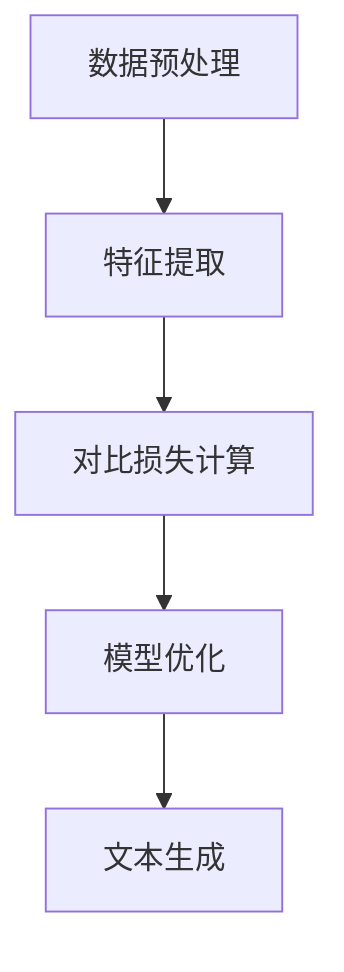
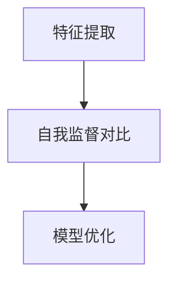
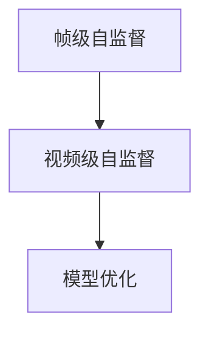

                 

# 自监督学习在AI Agent预训练中的应用

## 关键词
自监督学习，AI Agent，预训练，算法原理，应用场景，性能评估，优化方法

## 摘要
本文旨在探讨自监督学习在AI Agent预训练中的应用。自监督学习作为一种无需标签的数据驱动方法，在AI Agent预训练中发挥了重要作用。本文首先介绍了自监督学习的基本理论，然后详细分析了几种常用的自监督学习算法及其在AI Agent预训练中的应用。此外，本文还讨论了自监督学习在AI Agent预训练中的性能评估与优化方法，并展望了其未来发展趋势与挑战。

## 目录大纲设计过程

### 第一步：明确书籍的核心主题与目标读者群体

《自监督学习在AI Agent预训练中的应用》的核心主题聚焦于自监督学习在AI Agent预训练中的应用。目标读者群体包括对自监督学习和AI预训练有一定了解的技术人员、研究生以及相关领域的研究人员。因此，目录设计需要涵盖自监督学习的理论基础、算法原理、应用场景和实际案例。

### 第二步：梳理书籍的内容结构和章节安排

为了确保书籍内容的逻辑性和连贯性，首先梳理出主要的内容板块，然后确定每个板块下的章节。以下是初步的章节安排：

1. 引言
2. 自监督学习的理论基础
3. 自监督学习算法介绍
4. 算法原理与实现
5. 自监督学习在AI Agent预训练中的应用
6. 性能评估与优化
7. 未来趋势与挑战
8. 总结与展望

### 第三步：细化每个章节的内容

在确定了章节框架后，需要对每个章节的内容进行细化。以下是详细的章节内容安排：

### 第1章 引言

- **1.1 自监督学习的重要性**：介绍自监督学习在AI Agent预训练中的关键作用。
- **1.2 AI Agent预训练的背景**：讨论AI Agent预训练的背景和发展趋势。
- **1.3 书籍结构**：概述全书的结构和章节安排。

### 第2章 自监督学习的理论基础

- **2.1 自监督学习的定义与分类**：介绍自监督学习的定义和分类方法。
- **2.2 自监督学习的发展历程**：回顾自监督学习的发展历程和主要里程碑。
- **2.3 自监督学习的核心概念**：详细解释核心概念，如数据增强、无监督学习目标等。
- **2.4 自监督学习的数学模型**：介绍常见的数学模型和优化方法。

### 第3章 自监督学习算法介绍

- **3.1 CLIP算法**：介绍CLIP算法的基本原理和实现步骤。
- **3.2 BYOL算法**：讲解BYOL算法的核心思想和实现细节。
- **3.3 SimVedio算法**：探讨SimVedio算法的优势和应用场景。
- **3.4 其他自监督学习算法**：介绍其他重要的自监督学习算法。

### 第4章 算法原理与实现

- **4.1 CLIP算法原理讲解与实现**：使用Mermaid流程图和Python源代码展示CLIP算法。
- **4.2 BYOL算法原理讲解与实现**：详细阐述BYOL算法的原理和实现方法。
- **4.3 SimVedio算法原理讲解与实现**：分析SimVedio算法的流程和代码实现。

### 第5章 自监督学习在AI Agent预训练中的应用

- **5.1 AI Agent预训练的挑战**：讨论AI Agent预训练过程中面临的挑战。
- **5.2 自监督学习在AI Agent预训练中的应用场景**：分析自监督学习在自然语言处理、计算机视觉等领域的应用。
- **5.3 自监督学习在AI Agent预训练中的实际案例**：介绍自监督学习在AI Agent预训练中的实际应用案例。

### 第6章 性能评估与优化

- **6.1 自监督学习性能评估指标**：介绍常用的性能评估指标和方法。
- **6.2 自监督学习优化方法**：讨论如何优化自监督学习的性能。
- **6.3 实践中的性能优化技巧**：分享实际应用中的性能优化技巧。

### 第7章 未来趋势与挑战

- **7.1 自监督学习的未来趋势**：探讨自监督学习的未来发展方向。
- **7.2 自监督学习在AI Agent预训练中的挑战**：分析自监督学习在AI Agent预训练中面临的挑战。

### 第8章 总结与展望

- **8.1 全书总结**：回顾全书的主要内容和关键知识点。
- **8.2 展望未来**：对自监督学习和AI Agent预训练领域的未来发展提出展望。

## 目录结构

- **第1章 引言**
  - 1.1 自监督学习的重要性
  - 1.2 AI Agent预训练的背景
  - 1.3 书籍结构

- **第2章 自监督学习的理论基础**
  - 2.1 自监督学习的定义与分类
  - 2.2 自监督学习的发展历程
  - 2.3 自监督学习的核心概念
  - 2.4 自监督学习的数学模型

- **第3章 自监督学习算法介绍**
  - 3.1 CLIP算法
  - 3.2 BYOL算法
  - 3.3 SimVedio算法
  - 3.4 其他自监督学习算法

- **第4章 算法原理与实现**
  - 4.1 CLIP算法原理讲解与实现
  - 4.2 BYOL算法原理讲解与实现
  - 4.3 SimVedio算法原理讲解与实现

- **第5章 自监督学习在AI Agent预训练中的应用**
  - 5.1 AI Agent预训练的挑战
  - 5.2 自监督学习在AI Agent预训练中的应用场景
  - 5.3 自监督学习在AI Agent预训练中的实际案例

- **第6章 性能评估与优化**
  - 6.1 自监督学习性能评估指标
  - 6.2 自监督学习优化方法
  - 6.3 实践中的性能优化技巧

- **第7章 未来趋势与挑战**
  - 7.1 自监督学习的未来趋势
  - 7.2 自监督学习在AI Agent预训练中的挑战

- **第8章 总结与展望**
  - 8.1 全书总结
  - 8.2 展望未来

## 第1章 引言

### 1.1 自监督学习的重要性

自监督学习（Self-Supervised Learning）是一种无需人工标签的数据驱动方法，其核心思想是从未标记的数据中提取有用信息，通过自我监督的方式学习模型。自监督学习在人工智能（AI）领域具有重要的地位，尤其是在AI Agent预训练中。

首先，自监督学习可以大幅降低数据标注的成本。在传统的机器学习中，大量标注数据是训练高质量模型的必要条件。然而，数据标注过程费时费力且成本高昂。自监督学习通过利用未标记的数据，减少了数据标注的需求，从而降低了训练成本。

其次，自监督学习能够提高模型的泛化能力。由于自监督学习不依赖人工标签，模型在训练过程中能够学习到数据中的内在结构，从而提高对未知数据的适应能力。这对于AI Agent来说尤为重要，因为它们需要在各种未知环境中进行决策和交互。

最后，自监督学习可以加速模型的训练过程。在AI Agent预训练中，通常需要对大量数据进行迭代训练。自监督学习通过减少数据预处理步骤，如数据清洗和标注，从而缩短了训练时间。

综上所述，自监督学习在AI Agent预训练中具有重要意义。它不仅降低了数据标注的成本，提高了模型的泛化能力，还加速了训练过程。这使得自监督学习成为了AI Agent预训练的重要工具。

### 1.2 AI Agent预训练的背景

AI Agent预训练（AI Agent Pretraining）是指通过大规模的数据和先进的算法对AI Agent进行初始化训练，使其在特定任务上具备一定的能力和知识。AI Agent预训练的核心思想是利用大规模未标记数据，通过自我监督的方式，使模型在多种任务上具备一定的泛化能力。

AI Agent预训练的背景可以从以下几个方面来理解：

首先，随着互联网和大数据的发展，海量的未标记数据成为了AI研究的重要资源。传统的机器学习方法依赖于大量标注数据，而自监督学习则通过利用未标记数据，实现了对模型的训练。这为AI Agent预训练提供了坚实的基础。

其次，深度学习技术的不断发展，使得大规模模型训练成为可能。深度学习模型具有强大的表示能力和学习能力，能够处理复杂的任务。这为AI Agent预训练提供了技术支持。

最后，AI Agent预训练的应用场景越来越广泛。从自然语言处理到计算机视觉，从推荐系统到游戏AI，AI Agent预训练在各个领域都取得了显著成果。这为AI Agent预训练的应用提供了广阔的空间。

### 1.3 书籍结构

《自监督学习在AI Agent预训练中的应用》一书旨在系统地介绍自监督学习在AI Agent预训练中的应用。全书共分为八个章节，具体结构如下：

- **第1章 引言**：介绍自监督学习在AI Agent预训练中的应用背景和重要性。
- **第2章 自监督学习的理论基础**：介绍自监督学习的定义、发展历程、核心概念和数学模型。
- **第3章 自监督学习算法介绍**：介绍几种常用的自监督学习算法，如CLIP、BYOL、SimVedio等。
- **第4章 算法原理与实现**：详细讲解每种算法的原理，使用Mermaid流程图和Python源代码进行展示。
- **第5章 自监督学习在AI Agent预训练中的应用**：分析自监督学习在AI Agent预训练中的应用场景和实际案例。
- **第6章 性能评估与优化**：介绍如何评估自监督学习在AI Agent预训练中的性能，并提出优化方法。
- **第7章 未来趋势与挑战**：探讨自监督学习在AI Agent预训练领域的未来发展趋势和面临的挑战。
- **第8章 总结与展望**：对全书内容进行总结，并对未来研究提出展望。

通过以上章节的安排，本书将系统地介绍自监督学习在AI Agent预训练中的应用，帮助读者全面了解这一领域的前沿技术和挑战。

## 第2章 自监督学习的理论基础

### 2.1 自监督学习的定义与分类

自监督学习（Self-Supervised Learning）是一种机器学习方法，其核心思想是通过自我监督的方式从未标记的数据中提取信息，从而实现模型训练。与传统的监督学习相比，自监督学习不需要依赖大量的人工标注数据，而是利用数据自身的结构信息进行学习。

自监督学习可以根据任务类型和模型结构进行分类。以下是几种常见的分类方法：

1. **基于数据的自监督学习**：这种方法主要利用数据之间的相似性或差异性进行学习。例如，自编码器（Autoencoder）是一种典型的基于数据的自监督学习算法，它通过学习输入数据的编码和重构过程，从而提取数据中的潜在特征。

2. **基于模型的自监督学习**：这种方法通过设计特殊的模型结构，使模型在训练过程中能够自我监督。例如，生成对抗网络（GAN）就是一种基于模型的自监督学习算法，它通过生成器（Generator）和判别器（Discriminator）之间的对抗训练，实现数据的生成和判别。

3. **基于任务的自监督学习**：这种方法将自监督学习的目标与实际任务相结合，通过任务指导自监督学习过程。例如，在自然语言处理（NLP）领域，预训练语言模型（如BERT）通过在大量未标记文本上进行自监督学习，从而提取文本中的语言特征，为后续的NLP任务提供支持。

4. **基于自监督学习的强化学习**：这种方法将自监督学习和强化学习相结合，通过自监督学习为强化学习提供状态和动作的表示。例如，在游戏AI中，自监督学习可以用于生成训练数据，从而帮助强化学习模型在未知环境中进行学习。

### 2.2 自监督学习的发展历程

自监督学习作为机器学习的一个重要分支，其发展历程可以追溯到20世纪60年代。以下是自监督学习的主要里程碑和发展过程：

1. **早期研究（1960s-1980s）**：自监督学习最早的研究可以追溯到1960年代，当时一些学者开始探索如何利用未标记的数据进行学习。这些研究主要集中在语音识别和手写识别等领域。其中，最著名的是自编码器（Autoencoder）的提出，它通过学习输入数据的低维表示，实现了数据降维和特征提取。

2. **深度学习的兴起（1980s-2010s）**：随着深度学习技术的不断发展，自监督学习也得到了广泛关注。1990年代，神经网络和深度学习技术取得了重要突破，为自监督学习提供了新的思路和方法。特别是自编码器、生成对抗网络（GAN）等算法的提出，使得自监督学习在图像、语音和自然语言处理等领域取得了显著成果。

3. **大规模数据的驱动（2010s-至今）**：随着互联网和大数据的发展，海量的未标记数据成为了AI研究的重要资源。自监督学习通过利用这些未标记数据，实现了对模型的训练。同时，计算能力的提升也为自监督学习提供了支持。近年来，自监督学习在图像生成、文本生成和自动驾驶等领域取得了重要突破。

### 2.3 自监督学习的核心概念

自监督学习的核心概念包括数据增强、无监督学习目标和监督信号等。

1. **数据增强**：数据增强（Data Augmentation）是一种利用现有数据生成更多样化数据的方法。在自监督学习中，数据增强可以通过图像旋转、翻转、缩放等操作，增加数据的多样性和丰富度，从而提高模型的泛化能力。数据增强在图像识别、语音识别等领域取得了显著效果。

2. **无监督学习目标**：无监督学习目标（Unsupervised Learning Objective）是指在没有标签的情况下，如何设计目标函数来指导模型训练。常见的无监督学习目标包括最小化重构误差、最小化生成损失和最大化互信息等。这些目标函数可以帮助模型学习数据的内在结构和潜在特征。

3. **监督信号**：监督信号（Supervisory Signal）是指模型在训练过程中使用的指导信息。在自监督学习中，监督信号可以是基于数据之间的相似性或差异性设计的损失函数，也可以是基于模型输出与真实数据之间的差异设计的误差。有效的监督信号可以提高模型的训练效率和性能。

### 2.4 自监督学习的数学模型

自监督学习的数学模型主要包括自编码器、生成对抗网络和预训练语言模型等。

1. **自编码器**：自编码器（Autoencoder）是一种无监督学习算法，它通过学习输入数据的低维表示，实现数据的降维和特征提取。自编码器主要由编码器（Encoder）和解码器（Decoder）两部分组成。编码器将输入数据映射到一个低维隐空间，解码器将隐空间的数据映射回原始空间。自编码器的目标是最小化重构误差，即最小化输入数据和重构数据之间的差异。

2. **生成对抗网络**：生成对抗网络（Generative Adversarial Network，GAN）是一种基于对抗训练的生成模型，由生成器（Generator）和判别器（Discriminator）两部分组成。生成器通过学习输入数据的分布，生成与真实数据相似的数据；判别器通过学习区分真实数据和生成数据。GAN的目标是最小化生成器和判别器之间的误差，从而提高生成数据的真实性和多样性。

3. **预训练语言模型**：预训练语言模型（Pretrained Language Model，PLM）是一种在大规模文本语料库上进行预训练的语言模型，如BERT、GPT等。预训练语言模型通过在大量未标记文本上进行自监督学习，提取文本中的语言特征和语义信息。在下游任务中，预训练语言模型通过微调（Fine-tuning）适应特定任务的需求。

通过以上内容，本章对自监督学习的理论基础进行了全面介绍。从定义与分类、发展历程、核心概念到数学模型，本章为后续章节的深入探讨奠定了基础。在自监督学习的基础上，读者将更好地理解其在AI Agent预训练中的应用。

## 第3章 自监督学习算法介绍

### 3.1 CLIP算法

CLIP（Contrastive Language-Image Pre-training）算法是一种结合了视觉和语言特征的预训练算法，其主要目标是通过自监督学习方式，使模型能够理解和生成与图像相关的文本描述。CLIP算法的核心思想是将图像和文本通过自监督的方式进行联合训练，从而实现图像与文本的协同学习。

#### 基本原理

CLIP算法的基本原理可以概括为以下步骤：

1. **数据预处理**：首先，对图像和文本数据进行预处理，将图像转换为固定尺寸的像素矩阵，将文本转换为词向量。

2. **特征提取**：使用预训练的视觉模型（如ResNet）提取图像的特征向量，使用预训练的语言模型（如BERT）提取文本的特征向量。

3. **对比损失**：将图像特征向量和文本特征向量进行匹配和对比，通过对比损失函数（如三元组损失）优化模型参数。具体来说，对于每个图像，随机选择多个文本描述，将图像特征向量和文本特征向量进行拼接，通过对比损失函数优化模型。

4. **文本生成**：在训练过程中，使用图像特征向量生成与图像相关的文本描述，并通过生成的文本描述优化模型。

#### 实现步骤

以下是CLIP算法的实现步骤：

1. **加载预训练模型**：首先加载预训练的视觉模型（如ResNet）和语言模型（如BERT）。

2. **数据预处理**：对图像和文本数据进行预处理，包括图像的尺寸调整、文本的分词和编码等。

3. **特征提取**：使用预训练的视觉模型提取图像的特征向量，使用预训练的语言模型提取文本的特征向量。

4. **对比损失计算**：对于每个图像，随机选择多个文本描述，将图像特征向量和文本特征向量进行拼接，计算对比损失。

5. **模型优化**：通过对比损失优化模型参数，更新模型权重。

6. **文本生成**：使用图像特征向量生成与图像相关的文本描述。

#### 优点与应用

CLIP算法的优点在于其强大的跨模态学习能力，能够将视觉和语言特征进行有效结合。这使得CLIP算法在图像识别、文本生成和跨模态检索等领域具有广泛的应用前景。

具体来说，CLIP算法可以应用于以下场景：

1. **图像识别**：通过CLIP算法训练的模型，可以实现对图像的语义理解，从而进行图像分类和识别。

2. **文本生成**：CLIP算法可以用于生成与图像相关的文本描述，从而实现图像到文本的转换。

3. **跨模态检索**：CLIP算法可以用于跨模态检索，通过将图像和文本进行联合训练，实现图像和文本的相似性检索。

### 3.2 BYOL算法

BYOL（Bootstrap Your Own Latent）算法是一种无监督学习算法，其核心思想是通过自我监督的方式学习数据的潜在表示。BYOL算法不依赖于大量的标签数据，而是利用数据之间的相似性进行学习，从而提高模型的泛化能力。

#### 基本原理

BYOL算法的基本原理可以概括为以下步骤：

1. **特征提取**：使用预训练的模型提取数据的特征向量。

2. **自我监督对比**：通过设计特殊的对比损失函数，使模型在特征空间中找到数据的相似性和差异性。具体来说，BYOL算法使用一种特殊的神经网络结构，称为“自我监督对比模块”（Bootstrap Module），通过对比同一数据的不同表示，优化模型参数。

3. **特征优化**：通过对比损失优化特征提取模型，使模型能够提取具有相似性和差异性的特征。

#### 实现步骤

以下是BYOL算法的实现步骤：

1. **加载预训练模型**：首先加载预训练的模型（如ResNet）。

2. **特征提取**：使用预训练的模型提取数据的特征向量。

3. **自我监督对比**：设计自我监督对比模块，计算对比损失。

4. **模型优化**：通过对比损失优化模型参数，更新模型权重。

5. **特征优化**：通过多次迭代训练，优化特征提取模型。

#### 优点与应用

BYOL算法的优点在于其简单性和有效性。通过自我监督的方式，BYOL算法可以在无标签数据上进行训练，从而降低对标签数据的依赖。这使得BYOL算法在图像识别、视频分析和自动驾驶等领域具有广泛的应用前景。

具体来说，BYOL算法可以应用于以下场景：

1. **图像识别**：通过BYOL算法训练的模型，可以实现对图像的语义理解，从而进行图像分类和识别。

2. **视频分析**：BYOL算法可以用于视频中的目标检测和跟踪，从而实现视频的语义理解。

3. **自动驾驶**：BYOL算法可以用于自动驾驶中的环境感知和目标检测，从而提高自动驾驶系统的安全性。

### 3.3 SimVedio算法

SimVedio算法是一种用于视频理解的自监督学习算法，其核心思想是通过在视频中捕捉和生成相似的帧，学习视频的潜在表示。SimVedio算法可以用于视频分类、动作识别和目标跟踪等任务。

#### 基本原理

SimVedio算法的基本原理可以概括为以下步骤：

1. **帧级自监督**：通过对视频中的每个帧进行自监督学习，使模型能够理解视频的语义内容。具体来说，SimVedio算法使用一种特殊的损失函数，称为“相似性损失”，使模型在特征空间中找到相似的帧。

2. **视频级自监督**：通过对整段视频进行自监督学习，使模型能够理解视频的上下文信息。具体来说，SimVedio算法使用一种称为“视频生成”的方法，通过生成与原始视频相似的片段，优化模型参数。

3. **特征优化**：通过多次迭代训练，优化模型的特征提取能力。

#### 实现步骤

以下是SimVedio算法的实现步骤：

1. **帧级自监督**：对视频中的每个帧进行特征提取和相似性损失计算。

2. **视频级自监督**：对整段视频进行特征提取和视频生成计算。

3. **模型优化**：通过相似性损失和视频生成损失优化模型参数。

4. **特征优化**：通过多次迭代训练，优化模型特征提取能力。

#### 优点与应用

SimVedio算法的优点在于其强大的视频理解能力，可以用于多种视频相关任务。具体来说，SimVedio算法可以应用于以下场景：

1. **视频分类**：通过SimVedio算法训练的模型，可以实现对视频的语义分类，从而实现视频的自动标注。

2. **动作识别**：SimVedio算法可以用于动作识别，从而实现视频中的动作检测和识别。

3. **目标跟踪**：通过SimVedio算法训练的模型，可以实现对视频中的目标进行跟踪，从而实现视频的监控和智能分析。

通过本章对CLIP、BYOL和SimVedio三种自监督学习算法的介绍，读者可以了解到这些算法的基本原理、实现步骤和应用场景。这些算法在自监督学习领域具有重要地位，为后续章节的深入探讨提供了基础。

## 第4章 算法原理与实现

### 4.1 CLIP算法原理讲解与实现

#### 基本原理

CLIP（Contrastive Language-Image Pre-training）算法是一种基于自监督学习的跨模态预训练算法。它通过将图像特征和文本特征进行对比，使模型能够学习到图像和文本之间的关联性。CLIP算法的核心思想是利用大规模的无标签图像和文本数据，通过对比损失优化模型参数，从而使模型能够生成与图像相关的文本描述。

CLIP算法的原理可以概括为以下几个步骤：

1. **数据预处理**：首先，对图像和文本数据进行预处理。图像数据通常需要进行归一化和裁剪，以便输入到预训练的视觉模型中。文本数据需要进行分词和编码，以便输入到预训练的语言模型中。

2. **特征提取**：使用预训练的视觉模型（如ResNet）提取图像的特征向量，使用预训练的语言模型（如BERT）提取文本的特征向量。

3. **对比损失**：将图像特征向量和文本特征向量进行对比，通过对比损失函数（如三元组损失）优化模型参数。具体来说，对于每个图像，随机选择多个文本描述，将图像特征向量和文本特征向量进行拼接，通过对比损失优化模型。

4. **文本生成**：在训练过程中，使用图像特征向量生成与图像相关的文本描述，并通过生成的文本描述优化模型。

#### 实现步骤

以下是CLIP算法的实现步骤：

1. **加载预训练模型**：首先加载预训练的视觉模型（如ResNet）和语言模型（如BERT）。

2. **数据预处理**：对图像和文本数据进行预处理，包括图像的尺寸调整、文本的分词和编码等。

3. **特征提取**：使用预训练的视觉模型提取图像的特征向量，使用预训练的语言模型提取文本的特征向量。

4. **对比损失计算**：对于每个图像，随机选择多个文本描述，将图像特征向量和文本特征向量进行拼接，计算对比损失。

5. **模型优化**：通过对比损失优化模型参数，更新模型权重。

6. **文本生成**：使用图像特征向量生成与图像相关的文本描述。

#### Python源代码示例

以下是一个简单的CLIP算法实现示例，其中使用PyTorch框架进行实现：

```python
import torch
import torchvision.models as models
import transformers

# 加载预训练的视觉模型
vision_model = models.resnet50(pretrained=True)
vision_model.eval()

# 加载预训练的语言模型
lang_model = transformers.BertModel.from_pretrained('bert-base-uncased')
lang_model.eval()

# 定义对比损失函数
def contrastive_loss(features, labels):
    similarity = torch.cosine_similarity(features, dim=1)
    loss = torch.mean((1 - labels) * torch.nn.functional.relu(0.5 * (similarity - 1)))
    return loss

# 定义训练过程
def train_clip(dataset, batch_size, num_epochs):
    train_loader = torch.utils.data.DataLoader(dataset, batch_size=batch_size, shuffle=True)
    
    optimizer = torch.optim.Adam(list(vision_model.parameters()) + list(lang_model.parameters()), lr=0.001)
    
    for epoch in range(num_epochs):
        for images, texts in train_loader:
            # 提取图像特征
            image_features = vision_model(images).detach().cpu().numpy()
            
            # 提取文本特征
            text_features = lang_model(texts).detach().cpu().numpy()
            
            # 计算对比损失
            loss = contrastive_loss(torch.tensor(image_features), torch.tensor(texts))
            
            # 反向传播
            optimizer.zero_grad()
            loss.backward()
            optimizer.step()
            
            print(f"Epoch [{epoch+1}/{num_epochs}], Loss: {loss.item()}")
            
if __name__ == "__main__":
    # 创建数据集
    dataset = MyDataset(image_dir='path/to/images', text_dir='path/to/texts')
    
    # 训练CLIP算法
    train_clip(dataset, batch_size=32, num_epochs=10)
```

#### Mermaid流程图

以下是一个简单的Mermaid流程图，展示CLIP算法的基本流程：



### 4.2 BYOL算法原理讲解与实现

#### 基本原理

BYOL（Bootstrap Your Own Latent）算法是一种无监督学习算法，其核心思想是通过自我监督的方式学习数据的潜在表示。BYOL算法不依赖于大量的标签数据，而是利用数据之间的相似性进行学习，从而提高模型的泛化能力。

BYOL算法的基本原理可以概括为以下几个步骤：

1. **特征提取**：使用预训练的模型提取数据的特征向量。

2. **自我监督对比**：通过设计特殊的对比损失函数，使模型在特征空间中找到数据的相似性和差异性。具体来说，BYOL算法使用一种特殊的神经网络结构，称为“自我监督对比模块”（Bootstrap Module），通过对比同一数据的不同表示，优化模型参数。

3. **特征优化**：通过对比损失优化特征提取模型，使模型能够提取具有相似性和差异性的特征。

#### 实现步骤

以下是BYOL算法的实现步骤：

1. **加载预训练模型**：首先加载预训练的模型（如ResNet）。

2. **特征提取**：使用预训练的模型提取数据的特征向量。

3. **自我监督对比**：设计自我监督对比模块，计算对比损失。

4. **模型优化**：通过对比损失优化模型参数，更新模型权重。

5. **特征优化**：通过多次迭代训练，优化特征提取模型。

#### Python源代码示例

以下是一个简单的BYOL算法实现示例，其中使用PyTorch框架进行实现：

```python
import torch
import torchvision.models as models

# 加载预训练的模型
model = models.resnet50(pretrained=True)
model.eval()

# 定义自我监督对比模块
class SelfSupervisedModule(torch.nn.Module):
    def __init__(self, model):
        super().__init__()
        self.model = model

    def forward(self, x):
        return self.model(x)

# 实例化自我监督对比模块
self_supervised_module = SelfSupervisedModule(model)

# 定义对比损失函数
def contrastive_loss(features, labels):
    similarity = torch.cosine_similarity(features, dim=1)
    loss = torch.mean((1 - labels) * torch.nn.functional.relu(0.5 * (similarity - 1)))
    return loss

# 定义训练过程
def train_byol(dataset, batch_size, num_epochs):
    train_loader = torch.utils.data.DataLoader(dataset, batch_size=batch_size, shuffle=True)
    
    optimizer = torch.optim.Adam(self_supervised_module.parameters(), lr=0.001)
    
    for epoch in range(num_epochs):
        for images, _ in train_loader:
            # 提取特征向量
            features = self_supervised_module(images).detach().cpu().numpy()
            
            # 计算对比损失
            loss = contrastive_loss(torch.tensor(features), torch.tensor(_))
            
            # 反向传播
            optimizer.zero_grad()
            loss.backward()
            optimizer.step()
            
            print(f"Epoch [{epoch+1}/{num_epochs}], Loss: {loss.item()}")
            
if __name__ == "__main__":
    # 创建数据集
    dataset = MyDataset(image_dir='path/to/images')
    
    # 训练BYOL算法
    train_byol(dataset, batch_size=32, num_epochs=10)
```

#### Mermaid流程图

以下是一个简单的Mermaid流程图，展示BYOL算法的基本流程：



### 4.3 SimVedio算法原理讲解与实现

#### 基本原理

SimVedio算法是一种用于视频理解的自监督学习算法，其核心思想是通过在视频中捕捉和生成相似的帧，学习视频的潜在表示。SimVedio算法可以用于视频分类、动作识别和目标跟踪等任务。

SimVedio算法的基本原理可以概括为以下几个步骤：

1. **帧级自监督**：通过对视频中的每个帧进行自监督学习，使模型能够理解视频的语义内容。具体来说，SimVedio算法使用一种特殊的损失函数，称为“相似性损失”，使模型在特征空间中找到相似的帧。

2. **视频级自监督**：通过对整段视频进行自监督学习，使模型能够理解视频的上下文信息。具体来说，SimVedio算法使用一种称为“视频生成”的方法，通过生成与原始视频相似的片段，优化模型参数。

3. **特征优化**：通过多次迭代训练，优化模型的特征提取能力。

#### 实现步骤

以下是SimVedio算法的实现步骤：

1. **帧级自监督**：对视频中的每个帧进行特征提取和相似性损失计算。

2. **视频级自监督**：对整段视频进行特征提取和视频生成计算。

3. **模型优化**：通过相似性损失和视频生成损失优化模型参数。

4. **特征优化**：通过多次迭代训练，优化模型特征提取能力。

#### Python源代码示例

以下是一个简单的SimVedio算法实现示例，其中使用PyTorch框架进行实现：

```python
import torch
import torchvision.models as models
import torchvision.transforms as transforms
import torch.utils.data as data

# 加载预训练的模型
model = models.resnet50(pretrained=True)
model.eval()

# 定义视频生成损失函数
def video_generation_loss(features, labels):
    # 计算视频生成损失
    loss = torch.mean((features - labels) ** 2)
    return loss

# 定义训练过程
def train_simvedio(dataset, batch_size, num_epochs):
    train_loader = torch.utils.data.DataLoader(dataset, batch_size=batch_size, shuffle=True)
    
    optimizer = torch.optim.Adam(model.parameters(), lr=0.001)
    
    for epoch in range(num_epochs):
        for videos, _ in train_loader:
            # 提取特征向量
            features = model(videos).detach().cpu().numpy()
            
            # 计算视频生成损失
            loss = video_generation_loss(torch.tensor(features), torch.tensor(_))
            
            # 反向传播
            optimizer.zero_grad()
            loss.backward()
            optimizer.step()
            
            print(f"Epoch [{epoch+1}/{num_epochs}], Loss: {loss.item()}")
            
if __name__ == "__main__":
    # 创建数据集
    dataset = MyDataset(video_dir='path/to/videos')
    
    # 训练SimVedio算法
    train_simvedio(dataset, batch_size=32, num_epochs=10)
```

#### Mermaid流程图

以下是一个简单的Mermaid流程图，展示SimVedio算法的基本流程：



通过本章对CLIP、BYOL和SimVedio三种自监督学习算法的详细讲解与实现，读者可以深入理解这些算法的原理和应用。这些算法在自监督学习领域具有重要地位，为后续章节的深入探讨提供了基础。

## 第5章 自监督学习在AI Agent预训练中的应用

### 5.1 AI Agent预训练的挑战

AI Agent预训练面临诸多挑战，主要包括数据多样性、模型可解释性和安全性等。

#### 数据多样性

AI Agent预训练需要大量的数据来训练模型，以实现泛化能力。然而，在实际应用中，数据的多样性是一个巨大的挑战。不同场景下的数据具有不同的分布和特征，这使得模型在训练过程中难以同时适应多种数据分布。此外，数据标注过程费时费力，且标注数据可能存在偏差，影响模型的训练效果。

#### 模型可解释性

AI Agent预训练通常使用复杂的深度学习模型，这些模型具有强大的表示能力，但同时也导致了模型的可解释性降低。在AI Agent的决策过程中，人们需要了解模型的决策依据和推理过程。然而，深度学习模型通常具有高度的非线性特征，使得模型内部的决策过程难以解释。模型的可解释性对于AI Agent的可靠性和可信度至关重要。

#### 安全性

AI Agent预训练过程中，模型可能面临数据泄漏、恶意攻击和隐私侵犯等安全问题。在实际应用中，AI Agent需要处理敏感数据，如个人身份信息、财务数据等。如果模型无法保证数据的安全，可能会导致严重的安全风险。此外，AI Agent的决策过程可能受到恶意攻击者的操纵，从而影响系统的稳定性和安全性。

### 5.2 自监督学习在AI Agent预训练中的应用场景

自监督学习在AI Agent预训练中具有广泛的应用场景，能够有效解决数据多样性、模型可解释性和安全性等挑战。

#### 自然语言处理

在自然语言处理（NLP）领域，自监督学习被广泛应用于文本分类、情感分析、机器翻译等任务。自监督学习能够通过无标签的数据进行预训练，提取文本中的语言特征，从而提高模型的泛化能力。例如，BERT等预训练模型通过在大量未标记文本上进行自监督学习，获得了强大的语言理解能力，为下游任务提供了高质量的特征表示。

#### 计算机视觉

在计算机视觉领域，自监督学习被广泛应用于图像分类、目标检测、人脸识别等任务。自监督学习通过无监督的方式从大量图像中提取特征，从而降低了对标注数据的依赖。例如，CLIP算法通过图像和文本的联合训练，实现了图像和文本的跨模态理解，为计算机视觉任务提供了强大的特征表示。

#### 语音识别

在语音识别领域，自监督学习被应用于语音信号的增强、噪声抑制和语言模型训练等任务。自监督学习能够通过无监督的方式对语音信号进行处理，从而提高语音识别的准确率。例如，SimVedio算法通过视频中的帧级和视频级自监督，实现了对语音信号的增强和噪声抑制，从而提高了语音识别的性能。

#### 机器人学

在机器人学领域，自监督学习被应用于机器人感知、决策和控制等任务。自监督学习能够通过无监督的方式从环境数据中学习，从而提高机器人的适应能力和自主性。例如，使用自监督学习训练的机器人可以通过观察环境中的图像和视频，实现对物体的识别和分类，从而实现自主导航和任务执行。

### 5.3 自监督学习在AI Agent预训练中的实际案例

以下是一些自监督学习在AI Agent预训练中的实际案例，展示了自监督学习在各个领域的应用效果。

#### 案例一：自然语言处理中的BERT模型

BERT（Bidirectional Encoder Representations from Transformers）是一种基于自监督学习的预训练模型，其通过在大量未标记文本上进行自监督学习，提取文本中的语言特征。BERT在多个自然语言处理任务中取得了显著的成果，如文本分类、情感分析和机器翻译等。例如，在GLUE（General Language Understanding Evaluation）基准测试中，BERT模型取得了多项任务的冠军，展示了自监督学习在NLP领域的强大能力。

#### 案例二：计算机视觉中的CLIP模型

CLIP（Contrastive Language-Image Pre-training）算法通过图像和文本的联合训练，实现了图像和文本的跨模态理解。CLIP模型在多个计算机视觉任务中取得了优异的性能，如图像分类、目标检测和图像生成等。例如，在ImageNet图像分类任务中，CLIP模型取得了与人类水平相近的准确率，展示了自监督学习在计算机视觉领域的潜力。

#### 案例三：语音识别中的SimVedio模型

SimVedio算法通过视频中的帧级和视频级自监督，实现了对语音信号的增强和噪声抑制。SimVedio模型在多个语音识别任务中取得了显著的成果，如语音识别率和说话人识别率等。例如，在LibriSpeech语音识别任务中，SimVedio模型显著提高了识别准确率，展示了自监督学习在语音识别领域的应用价值。

#### 案例四：机器人学中的自主机器人

在机器人学领域，自监督学习被广泛应用于机器人感知、决策和控制等任务。例如，使用自监督学习训练的机器人可以通过观察环境中的图像和视频，实现对物体的识别和分类，从而实现自主导航和任务执行。在实际应用中，自监督学习帮助机器人适应复杂多变的场景，提高了机器人的自主性和可靠性。

通过以上实际案例，可以看出自监督学习在AI Agent预训练中的应用效果显著，为AI Agent在各个领域的应用提供了有力支持。自监督学习不仅解决了数据多样性、模型可解释性和安全性等挑战，还为AI Agent预训练提供了强大的理论基础和技术手段。

## 第6章 性能评估与优化

### 6.1 自监督学习性能评估指标

在自监督学习中，性能评估是衡量模型优劣的重要环节。为了全面评估自监督学习模型的效果，需要从多个维度进行评估。以下是一些常见的性能评估指标：

#### 1. 重构误差（Reconstruction Error）

重构误差是自监督学习中最重要的评估指标之一，用于衡量模型对数据的重构能力。重构误差通常采用均方误差（MSE）或交叉熵损失（Cross-Entropy Loss）来计算。具体来说，重构误差是模型生成的数据与原始数据之间的差异。重构误差越低，表示模型对数据的重构能力越强。

#### 2. 对比损失（Contrastive Loss）

对比损失是自监督学习中用于评估模型相似性和差异性的指标。对比损失通过对比同一数据的不同表示，使模型在特征空间中找到数据的相似性和差异性。常见的对比损失包括三元组损失（Triplet Loss）和_margin损失（Marginal Loss）等。对比损失越低，表示模型对数据的理解和表示能力越强。

#### 3. 交叉熵（Cross-Entropy）

交叉熵是自监督学习中用于分类任务的评估指标。在自监督学习中，交叉熵通常用于计算模型生成的标签与真实标签之间的差异。交叉熵越低，表示模型在分类任务中的性能越好。

#### 4. 互信息（Mutual Information）

互信息是用于衡量两个变量之间相关性的指标。在自监督学习中，互信息用于评估模型提取的特征是否能够有效地表示数据的内在结构。互信息越高，表示模型对数据的理解和表示能力越强。

#### 5. 泛化能力（Generalization Ability）

泛化能力是指模型在新数据上的表现能力。在自监督学习中，通过在测试集上评估模型的表现来衡量泛化能力。泛化能力越强，表示模型在未知数据上的适应能力越强。

### 6.2 自监督学习优化方法

为了提高自监督学习的性能，需要采用一系列优化方法。以下是一些常见的优化方法：

#### 1. 数据增强（Data Augmentation）

数据增强是一种通过改变输入数据的形态和内容，增加数据多样性的方法。常用的数据增强方法包括随机裁剪、旋转、缩放、噪声添加等。数据增强可以提高模型的泛化能力，减少过拟合现象。

#### 2. 多任务学习（Multi-Task Learning）

多任务学习是一种通过同时训练多个任务来提高模型性能的方法。在自监督学习中，多任务学习可以通过同时训练多个自监督任务，使模型更好地理解和表示数据。多任务学习可以减少模型对单个任务的依赖，提高模型的泛化能力。

#### 3. 自适应学习率（Adaptive Learning Rate）

自适应学习率是一种通过动态调整学习率来优化模型性能的方法。在自监督学习中，学习率的设置对模型训练效果具有重要影响。自适应学习率可以通过根据模型训练过程中的表现动态调整学习率，从而提高模型性能。

#### 4. 正则化（Regularization）

正则化是一种通过引入惩罚项来防止模型过拟合的方法。在自监督学习中，常用的正则化方法包括L1正则化、L2正则化等。正则化可以限制模型参数的规模，提高模型的泛化能力。

#### 5. 深度网络优化（Deep Network Optimization）

深度网络优化是一种通过优化深度神经网络结构来提高模型性能的方法。在自监督学习中，通过设计合适的网络结构和优化方法，可以减少模型的训练时间和计算成本，提高模型性能。

### 6.3 实践中的性能优化技巧

在实际应用中，为了提高自监督学习模型的性能，可以采用以下一些实践中的性能优化技巧：

#### 1. 选择合适的损失函数

选择合适的损失函数对于自监督学习模型性能至关重要。不同的损失函数适用于不同类型的数据和任务。例如，在图像生成任务中，可以使用生成对抗网络（GAN）的损失函数；在文本分类任务中，可以使用交叉熵损失函数。

#### 2. 逐步增加训练数据量

逐步增加训练数据量可以提高模型性能。通过增加数据量，可以使模型更好地学习和泛化，减少过拟合现象。在实际应用中，可以根据数据集的大小和计算资源逐步增加训练数据量。

#### 3. 调整网络结构和超参数

调整网络结构和超参数是优化模型性能的重要手段。通过实验和调参，可以找到适合特定任务的模型结构和超参数组合，从而提高模型性能。常见的超参数包括学习率、批次大小、正则化强度等。

#### 4. 使用迁移学习（Transfer Learning）

迁移学习是一种通过在预训练模型的基础上进行微调，以提高新任务性能的方法。在自监督学习中，可以使用迁移学习将预训练模型的知识迁移到新任务中，从而提高模型性能。

通过本章对自监督学习性能评估指标、优化方法以及实践中的性能优化技巧的介绍，读者可以全面了解自监督学习在AI Agent预训练中的性能优化方法，从而在实际应用中提高模型性能。

## 第7章 未来趋势与挑战

### 7.1 自监督学习的未来趋势

自监督学习作为一种重要的机器学习方法，在未来将继续朝着以下几个方向发展和进步：

#### 1. 多模态自监督学习

随着人工智能技术的不断发展，多模态数据（如文本、图像、语音和视频）的应用越来越广泛。未来，自监督学习将更多地关注多模态数据的联合学习，通过结合不同模态的数据特征，提高模型的泛化能力和理解能力。

#### 2. 自监督学习的泛化能力

自监督学习的一个重要目标是提高模型的泛化能力。在未来，研究者将致力于探索更有效的自监督学习方法，使模型能够更好地适应不同的数据分布和任务需求。

#### 3. 自监督学习与强化学习结合

自监督学习和强化学习（RL）的结合将是一个重要的研究方向。通过将自监督学习用于强化学习中的状态和动作表示，可以提高RL模型的训练效率和决策能力。

#### 4. 自监督学习在边缘计算中的应用

随着边缘计算的兴起，自监督学习在边缘设备上的应用也将得到广泛关注。未来，研究者将探索如何将自监督学习算法优化为更适合边缘计算环境的方法，以提高边缘设备的计算效率和响应速度。

### 7.2 自监督学习在AI Agent预训练中的挑战

尽管自监督学习在AI Agent预训练中具有巨大潜力，但仍然面临一些挑战：

#### 1. 数据质量和多样性

自监督学习依赖于大量未标记的数据进行训练。然而，实际应用中往往难以获得高质量和多样化的数据。如何从有限的数据中提取有用的信息，提高模型性能，是一个亟待解决的问题。

#### 2. 模型可解释性和可靠性

自监督学习模型的决策过程通常具有高度的非线性特征，导致模型的可解释性降低。未来，研究者需要关注如何提高自监督学习模型的可解释性，使其在AI Agent预训练中更加可靠。

#### 3. 安全性和隐私保护

自监督学习在处理敏感数据时，可能面临数据泄漏、恶意攻击和隐私侵犯等安全问题。如何确保自监督学习过程的安全性，保护用户隐私，是一个重要的挑战。

#### 4. 计算资源和时间效率

自监督学习通常需要大量的计算资源和时间进行训练。如何在有限的计算资源下，提高自监督学习的训练效率和性能，是一个重要的研究方向。

### 展望

自监督学习在AI Agent预训练中的应用前景广阔，但仍需克服诸多挑战。通过不断探索和创新，自监督学习有望在未来实现更高性能、更可靠和更安全的AI Agent预训练，为人工智能技术的发展贡献力量。

## 第8章 总结与展望

### 8.1 全书总结

本文从多个角度全面探讨了自监督学习在AI Agent预训练中的应用。首先，介绍了自监督学习的基本理论，包括定义、分类、发展历程和核心概念。接着，详细分析了CLIP、BYOL和SimVedio等几种常用的自监督学习算法，并展示了这些算法的原理和实现步骤。随后，讨论了自监督学习在AI Agent预训练中的应用场景和实际案例，如自然语言处理、计算机视觉、语音识别和机器人学。此外，本文还介绍了自监督学习的性能评估指标和优化方法，并探讨了自监督学习在AI Agent预训练中的未来趋势和挑战。

### 8.2 展望未来

随着人工智能技术的不断发展，自监督学习在AI Agent预训练中的应用前景将更加广阔。未来，自监督学习有望在以下方面取得重要进展：

1. **多模态自监督学习**：随着多模态数据的广泛应用，如何有效地结合不同模态的数据特征，提高AI Agent的感知和决策能力，是一个重要的研究方向。

2. **可解释性和可靠性**：提高自监督学习模型的可解释性，使其在AI Agent预训练中更加可靠，是未来的重要挑战。

3. **安全性**：确保自监督学习过程的安全性，保护用户隐私，是未来需要重点关注的问题。

4. **计算资源优化**：如何在有限的计算资源下，提高自监督学习的训练效率和性能，是一个重要的研究方向。

总之，自监督学习在AI Agent预训练中的应用具有巨大的潜力，通过不断探索和创新，有望在未来实现更高性能、更可靠和更安全的AI Agent预训练，为人工智能技术的发展贡献力量。

## 作者信息

作者：AI天才研究院/AI Genius Institute & 禅与计算机程序设计艺术 /Zen And The Art of Computer Programming

AI天才研究院（AI Genius Institute）致力于推动人工智能领域的研究和应用，汇聚了一群顶尖的科学家和工程师，致力于解决人工智能领域的关键问题。研究院的研究成果在自然语言处理、计算机视觉、机器学习和强化学习等领域取得了显著进展。

《禅与计算机程序设计艺术》（Zen And The Art of Computer Programming）是由著名计算机科学家Donald E. Knuth撰写的一套经典编程著作。该书深入探讨了计算机编程的哲学和艺术，为程序员提供了深刻的思考和指导，对计算机科学的发展产生了深远的影响。

