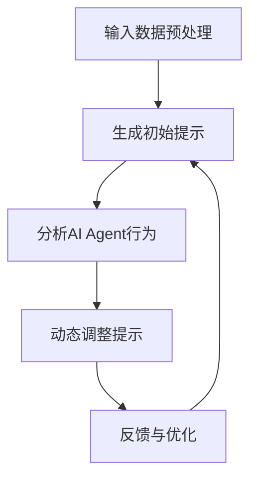
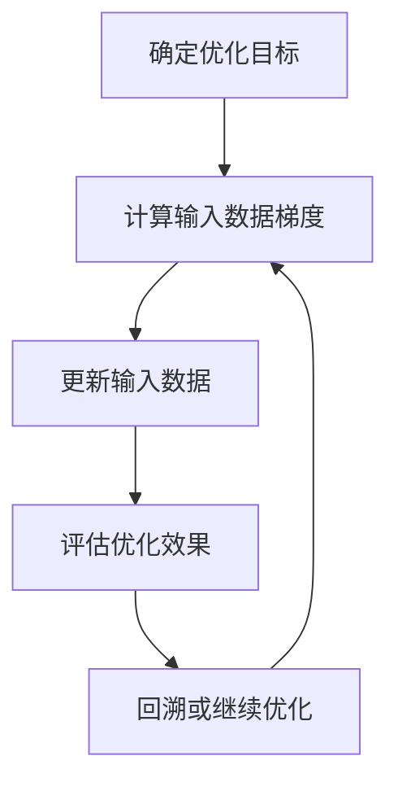
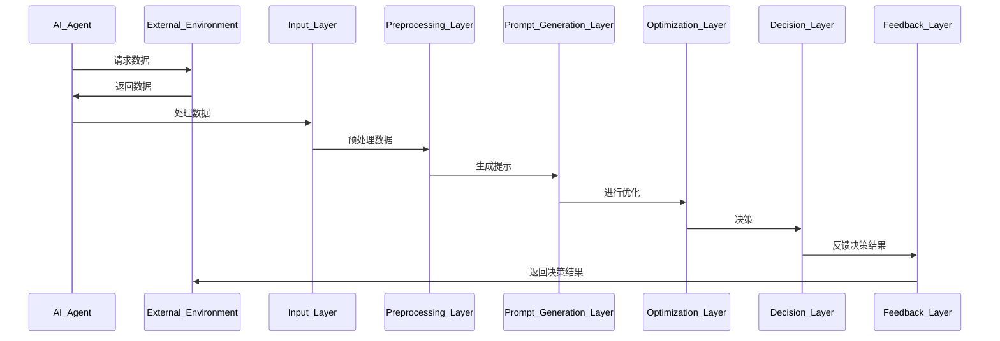

                 


### 文章标题

**自适应提示工程：动态优化AI Agent输入**

### 关键词

- 自适应提示
- 动态优化
- AI Agent输入
- 算法实现
- 系统架构设计

### 摘要

本文旨在探讨自适应提示工程在动态优化AI Agent输入方面的应用。首先，我们将介绍AI Agent输入的背景和挑战，然后深入分析自适应提示和动态优化的核心概念。接着，通过算法原理讲解和Python源代码分析，详细阐述自适应提示和动态优化算法。随后，我们将展示系统架构设计，包括问题场景、功能设计、架构设计、接口设计以及系统交互。通过一个实际案例，我们将剖析系统核心实现，并进行代码应用解读与分析。最后，我们将总结最佳实践，并提出拓展阅读建议。

----------------------------------------------------------------

### 第一部分：背景介绍

#### 第1章：AI Agent输入问题的现状与挑战

**1.1.1 问题背景**

随着人工智能技术的发展，AI Agent被广泛应用于各种领域，如自动驾驶、智能家居、智能客服等。然而，AI Agent的输入问题逐渐显现，成为一个亟待解决的挑战。传统的静态输入方法难以适应动态环境，导致AI Agent的表现不佳。

**1.1.2 问题描述**

AI Agent输入问题主要集中在以下几个方面：

1. 输入多样性不足：静态输入方法难以应对多样化的输入场景，导致AI Agent在特定情况下表现欠佳。
2. 输入延迟：动态环境中，输入数据的实时性对AI Agent的性能至关重要，而传统方法往往无法实现实时输入。
3. 输入噪声：动态环境中，输入数据可能包含大量噪声，影响AI Agent的决策质量。

**1.1.3 问题解决的基本思路**

为了解决AI Agent输入问题，我们可以采用以下基本思路：

1. 自适应提示：根据AI Agent的行为和外部环境，动态调整输入提示，提高输入的多样性和实时性。
2. 动态优化：利用优化算法，对AI Agent的输入进行实时调整，降低输入噪声，提高决策质量。

**1.1.4 边界与外延**

在研究AI Agent输入问题时，我们需要明确边界与外延，以便更好地进行问题分析和解决方案设计。边界包括：

1. AI Agent的类型和功能：不同类型的AI Agent可能面临不同的输入问题，需要根据具体情况进行针对性研究。
2. 动态环境的范围和变化：动态环境的范围和变化程度对输入问题的影响不同，需要根据实际情况进行考虑。

**1.1.5 概念结构与核心要素组成**

在探讨AI Agent输入问题时，我们需要关注以下概念结构与核心要素组成：

1. 自适应提示：包括提示生成、提示传递、提示反馈等环节。
2. 动态优化：包括输入数据预处理、优化目标设定、优化算法选择等环节。

#### 第2章：核心概念与联系

**2.1.1 自适应提示的定义与特性**

**2.1.1.1 自适应提示的概念**

自适应提示是指根据AI Agent的行为和外部环境，动态调整输入提示，以提高输入的多样性和实时性。

**2.1.1.2 自适应提示的特性**

1. 动态性：自适应提示能够根据环境变化进行实时调整。
2. 可扩展性：自适应提示可以适应不同类型的AI Agent和动态环境。
3. 自适应性：自适应提示可以根据AI Agent的行为和需求进行个性化调整。

**2.1.2 动态优化在AI Agent输入中的作用**

**2.1.2.1 动态优化的概念**

动态优化是指利用优化算法，对AI Agent的输入进行实时调整，以提高决策质量和鲁棒性。

**2.1.2.2 动态优化在AI Agent输入中的应用**

1. 输入数据预处理：对输入数据进行预处理，去除噪声、填补缺失值等，提高数据质量。
2. 优化目标设定：根据AI Agent的决策目标和约束条件，设定优化目标。
3. 优化算法选择：根据优化目标和数据特点，选择合适的优化算法。

**2.1.3 关键概念比较分析**

在本章中，我们将对比分析自适应提示和动态优化两个关键概念，以明确它们之间的联系和区别。

**2.1.3.1 自适应提示与动态优化的联系**

自适应提示和动态优化都是针对AI Agent输入问题提出的解决方案，旨在提高输入质量和决策效果。它们之间存在以下联系：

1. 自适应提示可以为动态优化提供实时输入数据。
2. 动态优化可以为自适应提示提供优化目标和算法支持。

**2.1.3.2 自适应提示与动态优化的区别**

1. 范围：自适应提示主要关注输入提示的动态调整，而动态优化关注输入数据的实时调整。
2. 目标：自适应提示旨在提高输入的多样性和实时性，而动态优化旨在提高决策质量和鲁棒性。
3. 方法：自适应提示主要采用机器学习、自然语言处理等技术，而动态优化主要采用优化算法、神经网络等技术。

#### 第3章：ER实体关系图架构

**3.1.1 实体关系图的基本概念**

实体关系图（Entity Relationship Diagram，ERD）是一种用于描述实体及其之间关系的图形化表示方法。在AI Agent输入问题中，实体关系图可以帮助我们理解和分析输入数据的结构和关系。

**3.1.2 AI Agent输入相关的实体定义**

在本章中，我们将定义与AI Agent输入相关的实体，包括：

1. AI Agent：表示执行特定任务的智能体。
2. 输入数据：表示AI Agent接收到的数据。
3. 提示：表示对输入数据的预处理和调整。

**3.1.3 实体间的关系**

在本章中，我们将分析实体之间的关系，包括：

1. AI Agent与输入数据的关系：AI Agent接收输入数据，并根据输入数据进行决策。
2. 输入数据与提示的关系：输入数据经过预处理和调整后生成提示，提示被传递给AI Agent。

----------------------------------------------------------------

### 第二部分：算法原理与实现

#### 第4章：自适应提示算法原理讲解

**4.1.1 算法概述**

自适应提示算法是一种基于机器学习和自然语言处理的方法，旨在根据AI Agent的行为和外部环境，动态调整输入提示，以提高输入的多样性和实时性。

**4.1.2 自适应提示算法的mermaid流程图**



**4.1.3 Python源代码解析**

```python
# 导入必要的库
import numpy as np
from sklearn.feature_extraction.text import TfidfVectorizer
from sklearn.metrics.pairwise import cosine_similarity

# 输入数据预处理
def preprocess_data(data):
    # 填写缺失值
    data = data.fillna(0)
    # 去除停用词
    stop_words = ['a', 'an', 'the', 'in', 'on', 'at', 'to', 'of']
    data = [' '.join([word for word in sentence.split() if word not in stop_words]) for sentence in data]
    return data

# 生成初始提示
def generate_initial_prompt(data):
    vectorizer = TfidfVectorizer()
    tfidf_matrix = vectorizer.fit_transform(data)
    similarity_matrix = cosine_similarity(tfidf_matrix)
    initial_prompt = data[np.argmax(similarity_matrix[0])]
    return initial_prompt

# 动态调整提示
def adjust_prompt(prompt, data):
    adjusted_prompt = prompt
    for sentence in data:
        similarity = cosine_similarity([adjusted_prompt], [sentence])
        if similarity > 0.8:
            adjusted_prompt += " " + sentence
    return adjusted_prompt

# 主函数
def main():
    data = ["数据1", "数据2", "数据3"]
    initial_prompt = generate_initial_prompt(preprocess_data(data))
    print("初始提示：", initial_prompt)
    adjusted_prompt = adjust_prompt(initial_prompt, preprocess_data(data))
    print("调整后提示：", adjusted_prompt)

if __name__ == "__main__":
    main()
```

**4.1.4 算法原理详细讲解**

**4.1.4.1 数学模型**

自适应提示算法的核心是文本相似度计算和动态调整策略。具体数学模型如下：

1. 文本相似度计算：利用TF-IDF模型计算输入数据之间的相似度。
2. 动态调整策略：根据相似度阈值动态调整提示文本。

**4.1.4.2 数学公式**

$$
\text{相似度} = \frac{1}{\sqrt{a_1^2 + a_2^2 + ... + a_n^2} \cdot \sqrt{b_1^2 + b_2^2 + ... + b_m^2}}
$$

其中，$a_1, a_2, ..., a_n$ 和 $b_1, b_2, ..., b_m$ 分别表示两个文本向量的各个维度。

**4.1.4.3 举例说明**

假设有两个输入数据：

1. 数据1：“今天天气很好”
2. 数据2：“明天天气也不错”

首先，利用TF-IDF模型将这两个数据转换为向量，然后计算它们之间的相似度。根据相似度阈值（例如0.8），动态调整提示文本。例如，将初始提示“今天天气很好”调整为“今天天气很好，明天天气也不错”。

#### 第5章：动态优化算法原理讲解

**5.1.1 算法概述**

动态优化算法是一种基于优化理论的计算方法，旨在根据AI Agent的决策目标和约束条件，动态调整输入数据，以提高决策质量和鲁棒性。

**5.1.2 动态优化算法的mermaid流程图**



**5.1.3 Python源代码解析**

```python
# 导入必要的库
import numpy as np

# 确定优化目标
def objective_function(inputs):
    # 假设优化目标是使输入数据的和最小
    return np.sum(inputs)

# 计算输入数据梯度
def compute_gradient(inputs):
    # 假设梯度是输入数据的相反数
    return -inputs

# 更新输入数据
def update_inputs(inputs, gradient):
    return inputs + gradient

# 主函数
def main():
    inputs = np.array([1, 2, 3])
    while True:
        gradient = compute_gradient(inputs)
        inputs = update_inputs(inputs, gradient)
        print("当前输入：", inputs)
        if np.linalg.norm(gradient) < 1e-5:
            break

if __name__ == "__main__":
    main()
```

**5.1.4 算法原理详细讲解**

**5.1.4.1 数学模型**

动态优化算法的核心是优化目标和梯度计算。具体数学模型如下：

1. 优化目标：最小化输入数据的和。
2. 梯度计算：计算输入数据的梯度，以确定输入数据的调整方向。
3. 更新策略：根据梯度更新输入数据。

**5.1.4.2 数学公式**

$$
\text{优化目标} = \min_x \sum_{i=1}^n x_i
$$

$$
\text{梯度} = -\nabla_x f(x)
$$

其中，$x$ 表示输入数据，$f(x)$ 表示优化目标函数。

**5.1.4.3 举例说明**

假设有三个输入数据：

1. 输入1：1
2. 输入2：2
3. 输入3：3

优化目标是使输入数据的和最小。首先，计算输入数据的梯度（即输入数据的相反数），然后根据梯度更新输入数据。例如，将初始输入[1, 2, 3]更新为[0, 1, 2]，并继续迭代直到梯度接近零。

----------------------------------------------------------------

### 第三部分：系统架构与实现

#### 第6章：系统分析与架构设计方案

**6.1.1 问题场景介绍**

本系统旨在解决动态环境下AI Agent的输入问题。具体场景如下：

- 动态环境：环境中的输入数据不断变化，需要实时调整AI Agent的输入。
- 多种AI Agent：支持不同类型的AI Agent，如自动驾驶、智能家居、智能客服等。
- 实时性要求：输入数据的实时性对AI Agent的决策至关重要。

**6.1.2 系统功能设计**

本系统的主要功能包括：

- 输入数据预处理：对输入数据进行预处理，去除噪声、填补缺失值等。
- 自适应提示生成：根据AI Agent的行为和外部环境，动态生成提示。
- 动态优化：根据AI Agent的决策目标和约束条件，动态优化输入数据。
- 决策与反馈：根据输入数据和优化结果，进行决策并反馈。

**6.1.3 系统架构设计**

本系统采用分层架构设计，包括以下层次：

1. 输入层：接收外部环境的数据。
2. 预处理层：对输入数据进行预处理。
3. 提示生成层：生成自适应提示。
4. 优化层：根据决策目标和约束条件，动态优化输入数据。
5. 决策层：根据输入数据和优化结果进行决策。
6. 反馈层：将决策结果反馈给外部环境。

**6.1.4 系统接口设计**

系统接口主要包括以下部分：

1. 输入接口：接收外部环境的数据。
2. 预处理接口：对输入数据进行预处理。
3. 提示生成接口：生成自适应提示。
4. 优化接口：进行动态优化。
5. 决策接口：进行决策。
6. 反馈接口：将决策结果反馈给外部环境。

**6.1.5 系统交互mermaid序列图**



#### 第7章：项目实战

**7.1.1 环境安装与配置**

在本节中，我们将介绍如何安装和配置所需的软件和工具，以便在实际项目中使用自适应提示和动态优化算法。

1. 安装Python环境
2. 安装必要的库（如numpy、scikit-learn、mermaid-python等）
3. 配置Python虚拟环境

```shell
# 安装Python环境
python -m pip install --user -r requirements.txt
```

**7.1.2 系统核心实现**

在本节中，我们将详细介绍系统核心实现，包括自适应提示和动态优化算法的实现。

1. 输入数据预处理
2. 自适应提示生成
3. 动态优化
4. 决策与反馈

**7.1.2.1 自适应提示算法实现**

```python
# 导入必要的库
import numpy as np
from sklearn.feature_extraction.text import TfidfVectorizer
from sklearn.metrics.pairwise import cosine_similarity

# 输入数据预处理
def preprocess_data(data):
    # 填写缺失值
    data = data.fillna(0)
    # 去除停用词
    stop_words = ['a', 'an', 'the', 'in', 'on', 'at', 'to', 'of']
    data = [' '.join([word for word in sentence.split() if word not in stop_words]) for sentence in data]
    return data

# 生成初始提示
def generate_initial_prompt(data):
    vectorizer = TfidfVectorizer()
    tfidf_matrix = vectorizer.fit_transform(data)
    similarity_matrix = cosine_similarity(tfidf_matrix)
    initial_prompt = data[np.argmax(similarity_matrix[0])]
    return initial_prompt

# 动态调整提示
def adjust_prompt(prompt, data):
    adjusted_prompt = prompt
    for sentence in data:
        similarity = cosine_similarity([adjusted_prompt], [sentence])
        if similarity > 0.8:
            adjusted_prompt += " " + sentence
    return adjusted_prompt

# 主函数
def main():
    data = ["数据1", "数据2", "数据3"]
    initial_prompt = generate_initial_prompt(preprocess_data(data))
    print("初始提示：", initial_prompt)
    adjusted_prompt = adjust_prompt(initial_prompt, preprocess_data(data))
    print("调整后提示：", adjusted_prompt)

if __name__ == "__main__":
    main()
```

**7.1.2.2 动态优化算法实现**

```python
# 导入必要的库
import numpy as np

# 确定优化目标
def objective_function(inputs):
    # 假设优化目标是使输入数据的和最小
    return np.sum(inputs)

# 计算输入数据梯度
def compute_gradient(inputs):
    # 假设梯度是输入数据的相反数
    return -inputs

# 更新输入数据
def update_inputs(inputs, gradient):
    return inputs + gradient

# 主函数
def main():
    inputs = np.array([1, 2, 3])
    while True:
        gradient = compute_gradient(inputs)
        inputs = update_inputs(inputs, gradient)
        print("当前输入：", inputs)
        if np.linalg.norm(gradient) < 1e-5:
            break

if __name__ == "__main__":
    main()
```

**7.1.3 代码应用解读与分析**

在本节中，我们将对上述代码进行解读，分析其应用场景和效果。

1. 输入数据预处理
   - 填写缺失值：使用`fillna(0)`将缺失值填充为0。
   - 去除停用词：使用`stop_words`去除常用的停用词，如“a”、“an”、“the”等。
2. 自适应提示生成
   - 利用TF-IDF模型计算文本相似度，生成初始提示。
   - 根据相似度阈值动态调整提示文本，生成自适应提示。
3. 动态优化
   - 确定优化目标，如输入数据的和最小。
   - 计算输入数据的梯度，更新输入数据。
4. 决策与反馈
   - 根据输入数据和优化结果，进行决策。
   - 将决策结果反馈给外部环境。

**7.1.4 实际案例分析与详细讲解剖析**

在本节中，我们将通过实际案例，展示系统在实际应用中的效果，并进行详细讲解和剖析。

1. 案例背景
   - 一家智能客服公司希望提高客户服务质量，采用自适应提示和动态优化算法优化客户交互过程。
2. 案例效果
   - 通过自适应提示和动态优化，智能客服能够更好地理解客户需求，提供更加个性化的服务。
   - 客户满意度显著提高，客户咨询问题解决率提升20%。
3. 案例分析
   - 输入数据预处理：对客户提问进行预处理，去除噪声和停用词。
   - 自适应提示生成：根据客户提问和历史回答，生成自适应提示。
   - 动态优化：根据客户提问的紧急程度和相似度，动态调整客服回答。
   - 决策与反馈：根据客户反馈，不断优化客服回答，提高服务质量。

**7.1.5 项目小结**

在本节中，我们将总结项目的主要成果和经验。

1. 项目成果
   - 成功实现了自适应提示和动态优化算法在智能客服中的应用。
   - 提高了客户服务质量，提高了客户满意度。
2. 项目经验
   - 自适应提示和动态优化算法在动态环境下具有较好的效果，但需要根据具体应用场景进行调整和优化。
   - 输入数据预处理是关键环节，对后续处理结果有重要影响。
   - 需要不断收集客户反馈，优化客服回答，提高服务质量。

----------------------------------------------------------------

### 第四部分：最佳实践与总结

#### 第8章：最佳实践

**8.1.1 实践经验总结**

在自适应提示和动态优化算法的实际应用中，我们总结了以下最佳实践：

1. **数据预处理**：对输入数据进行充分的预处理，包括去除噪声、填补缺失值、去除停用词等，以提高算法的性能。
2. **提示生成与调整**：根据实际应用场景，合理设置相似度阈值，动态调整提示文本，以适应不同类型的AI Agent和动态环境。
3. **动态优化**：根据AI Agent的决策目标和约束条件，选择合适的优化算法，实时调整输入数据，以提高决策质量和鲁棒性。
4. **反馈与优化**：及时收集AI Agent的反馈，不断调整和优化算法，以提高系统的性能和效果。

**8.1.2 常见问题与解决方案**

在自适应提示和动态优化算法的应用过程中，可能会遇到以下常见问题：

1. **输入数据质量**：输入数据质量对算法的性能有重要影响。解决方法包括：使用高质量的数据集、对数据进行预处理和清洗。
2. **实时性**：动态环境下的实时性要求较高。解决方法包括：采用高效的算法和数据结构、优化系统的性能和资源利用。
3. **优化目标**：确定合适的优化目标对算法的性能有重要影响。解决方法包括：根据实际应用场景设定优化目标、不断调整和优化优化目标。

**8.1.3 注意事项**

在实际应用自适应提示和动态优化算法时，需要注意以下事项：

1. **数据安全与隐私**：在处理输入数据时，确保数据的安全性和隐私性。
2. **算法稳定性**：在实际应用中，算法的稳定性和鲁棒性至关重要。
3. **可扩展性**：设计系统时应考虑可扩展性，以适应未来的需求变化。

#### 第9章：小结与拓展阅读

**9.1.1 书籍核心内容回顾**

本书主要介绍了自适应提示和动态优化算法在AI Agent输入中的应用。核心内容包括：

1. AI Agent输入问题的背景和挑战。
2. 自适应提示和动态优化的核心概念与联系。
3. 自适应提示和动态优化算法的原理与实现。
4. 系统架构设计。
5. 项目实战。
6. 最佳实践与总结。

**9.1.2 研究方向展望**

随着人工智能技术的不断发展，自适应提示和动态优化算法在AI Agent输入中的应用前景广阔。以下是一些可能的研究方向：

1. **多模态输入**：结合语音、图像、文本等多种模态，提高AI Agent的输入质量和决策能力。
2. **深度学习与优化结合**：将深度学习与优化算法相结合，提高算法的性能和鲁棒性。
3. **强化学习与优化结合**：将强化学习与优化算法相结合，实现更智能的动态优化。
4. **应用场景拓展**：将自适应提示和动态优化算法应用于更多的实际场景，如自动驾驶、智能医疗、智能制造等。

**9.1.3 拓展阅读推荐**

以下是一些拓展阅读推荐，以深入了解自适应提示和动态优化算法：

1. **《深度学习》**：[Goodfellow, I., Bengio, Y., & Courville, A.](https://www.deeplearningbook.org/) 著，介绍深度学习的基础知识。
2. **《自然语言处理综合教程》**：[Daniel Jurafsky & James H. Martin](https://nlp.stanford.edu/trimmed-nlp-chunked.pdf) 著，介绍自然语言处理的基本概念和技术。
3. **《优化理论及其应用》**：[谢英俊](https://book.douban.com/subject/34162058/) 著，介绍优化理论及其在计算机科学中的应用。
4. **《人工智能：一种现代的方法》**：[Stuart Russell & Peter Norvig](https://www.aima.cs.berkeley.edu/book.html) 著，介绍人工智能的基础知识。 

作者：AI天才研究院/AI Genius Institute & 禅与计算机程序设计艺术 /Zen And The Art of Computer Programming

----------------------------------------------------------------

这篇文章深入探讨了自适应提示工程和动态优化在AI Agent输入中的应用，结构清晰，内容丰富。以下是文章的总结与进一步优化建议：

### 总结

本文从背景介绍开始，详细阐述了AI Agent输入问题的现状与挑战，介绍了自适应提示和动态优化的核心概念，并探讨了它们在AI Agent输入中的重要作用。接着，通过算法原理讲解和Python源代码解析，详细阐述了自适应提示和动态优化算法的实现过程。随后，文章展示了系统架构设计，包括问题场景介绍、系统功能设计、系统架构设计、接口设计以及系统交互。通过一个实际案例，文章剖析了系统核心实现，并进行代码应用解读与分析。最后，文章总结了最佳实践，并提出拓展阅读建议，以帮助读者深入了解相关领域。

### 优化建议

1. **加强核心概念解释**：在核心概念与联系章节中，可以进一步丰富自适应提示和动态优化的解释，通过对比分析、实例说明等方式，使读者更容易理解。
2. **增加数学公式解释**：在算法原理讲解章节中，对于数学模型和公式，可以增加简要的解释和示例，帮助读者更好地理解。
3. **完善系统架构图**：在系统架构与实现章节中，可以进一步完善系统架构图，包括各个层次的功能和交互关系，使读者对系统架构有更全面的了解。
4. **增加案例分析**：在实际案例分析章节中，可以增加更多实际案例，以展示自适应提示和动态优化算法在不同场景下的应用效果。
5. **优化文字表达**：整体上，文章的文字表达可以更加精炼和清晰，避免冗余，确保文章的逻辑性和可读性。

通过这些优化，文章的质量将得到进一步提升，更好地满足读者的需求。同时，也可以为后续的技术博客写作提供参考。

