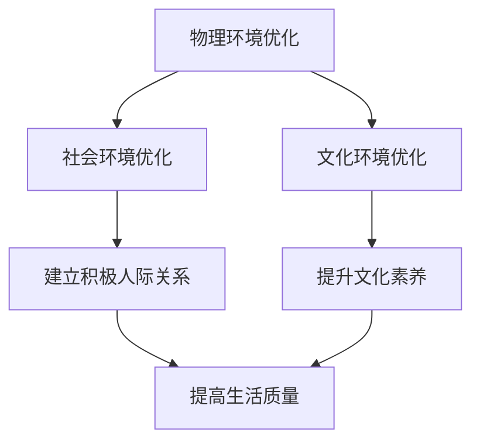

                 

# 引言

## 个人发展的意义

个人发展是指个体通过不断学习、实践和反思，实现自我成长、提升能力和实现价值的过程。在信息技术迅猛发展的当今社会，个人发展尤为重要。随着人工智能、大数据、云计算等技术的广泛应用，掌握这些前沿技术已成为提升个人竞争力、实现职业发展的关键。然而，个人发展的过程并非一帆风顺，需要克服诸多外部条件的制约。

## 外部条件对个人发展的影响

外部条件是影响个人发展的关键因素。这些条件包括环境、政策、资源等。一个良好的外部环境有利于激发个人的学习兴趣和潜能，促进其全面发展。政策因素则从宏观层面为个人发展提供指导和支持。例如，教育政策、就业政策等，对个人的成长起到重要的引导作用。资源方面，包括知识资源、技术资源、人力资源等，为个人发展提供了必要的物质基础。

## 外部条件优化的必要性

外部条件优化是提升个人发展的重要途径。通过优化环境、政策、资源等方面的条件，可以为个人创造一个有利于成长和发展的良好氛围。优化环境，意味着营造一个有利于学习和创新的氛围，提高个人的学习效率；政策优化，则从宏观层面为个人发展提供支持和保障；资源优化，则是为个人提供充足的物质支持，使其能够专注于自身能力的提升。

## 本章内容概述

本章将围绕外部条件优化这一主题，深入探讨与个人发展相关的外部条件。首先，我们将介绍环境优化的概念和方法，分析环境因素对个人发展的影响。接着，探讨政策优化的内涵和策略，阐述政策因素在个人发展中的重要性。最后，我们将讨论资源优化的意义和手段，介绍如何通过资源优化为个人发展提供支持。

通过本章的学习，读者将了解外部条件优化对个人发展的重要作用，掌握相关理论和方法，为自身的成长奠定坚实基础。在接下来的章节中，我们将进一步探讨环境、政策、资源等方面的优化策略，帮助读者更好地应对外部条件对个人发展的挑战。

## 核心概念与联系

在讨论外部条件优化之前，我们需要明确几个核心概念，并分析它们之间的联系。这些概念包括环境、政策、资源等，它们在个人发展中起着至关重要的作用。

### 环境概述

环境是指个人所处的自然和社会条件，包括物理环境、社会环境、文化环境等。物理环境如地理位置、气候条件等，对个人的身心健康和生活质量产生影响。社会环境则涉及社会结构、人际关系、社会风气等，对个人的成长和发展具有深远影响。文化环境包括文化传统、价值观、教育水平等，对个人的思维方式、行为习惯和价值观念产生重要影响。

### 政策概述

政策是国家或政府为解决某一问题或实现某一目标而制定的具体措施和规范。在教育、就业、社会保障等方面，政策对个人发展具有重要影响。教育政策如义务教育、高等教育政策等，直接关系到个人的学习机会和学术成就。就业政策如就业促进、职业培训等，为个人提供就业机会和发展平台。社会保障政策如医疗保险、养老保险等，为个人提供经济保障，减轻生活压力。

### 资源概述

资源是指个人在发展过程中所需的各种物质和精神支持。知识资源包括书籍、论文、讲座等，为个人提供学习素材。技术资源如计算机、网络等，为个人提供实践工具。人力资源则包括导师、同行、团队成员等，为个人提供交流合作机会。

### 概念属性特征对比表格

为了更好地理解这些核心概念，我们可以通过对比表格来展示它们之间的差异和联系。

| 概念  | 特征                             | 联系                         |
| ----- | -------------------------------- | ---------------------------- |
| 环境   | 自然和社会条件                   | 影响个人身心健康和生活质量   |
| 政策   | 国家或政府制定的具体措施和规范   | 指导和保障个人发展           |
| 资源   | 知识、技术和人力资源             | 提供个人发展所需的物质支持   |

### ER实体关系图架构

为了更直观地展示这些核心概念之间的联系，我们可以使用ER（Entity-Relationship，实体-关系）图进行描述。

```mermaid
erDiagram
    AEnvironment ||--|{ BPolicy }|-- EnvironmentPolicy : includes
    AEnvironment ||--|{ CResource }|-- EnvironmentResource : needs
    BPolicy ||--|{ CResource }|-- PolicyResource : supports
```

在ER图中，AEnvironment（环境）与BPolicy（政策）和CResource（资源）之间有直接的关联，表示环境需要政策和资源的支持。同样，BPolicy与CResource之间也有直接的关联，说明政策可以通过提供资源来支持个人发展。

通过上述对比表格和ER图，我们可以清晰地理解环境、政策、资源这三个核心概念及其在个人发展中的重要作用。这些概念相互联系，共同为个人创造一个有利于成长和发展的外部条件。

### 环境优化的算法原理讲解

环境优化是提升个人发展的重要环节，通过优化环境，可以创造一个有利于学习和创新的环境，提高个人的学习效率。本节将介绍环境优化的算法原理，并使用mermaid流程图和Python代码进行详细讲解。

#### 算法原理概述

环境优化的核心思想是通过调整和改善环境因素，使环境达到最佳状态，从而促进个人发展。具体来说，环境优化包括以下几个方面：

1. **物理环境优化**：改善物理环境，如调整光线、通风、噪音等，使环境更适合学习和工作。
2. **社会环境优化**：改善社会关系，如加强与家人、朋友的沟通，建立积极的人际关系。
3. **文化环境优化**：提升文化素养，如阅读经典文学作品、参与文化活动等，丰富个人的精神世界。

#### 算法mermaid流程图

为了更直观地展示环境优化的过程，我们可以使用mermaid绘制一个流程图。以下是一个简化的mermaid流程图示例：



在上述流程图中，A、B、C分别代表物理环境、社会环境和文化环境的优化过程，D、E表示具体的优化措施，F表示优化结果，即提高生活质量。

#### Python代码讲解

为了实现环境优化，我们可以编写一个简单的Python代码来模拟这一过程。以下是一个示例代码：

```python
import random

# 定义环境优化的函数
def optimize_environment(physical=True, social=True, cultural=True):
    if physical:
        print("正在优化物理环境...")
        # 随机调整光线、通风、噪音等
        light = random.choice(['适中', '较强', '较弱'])
        ventilation = random.choice(['良好', '一般', '较差'])
        noise = random.choice(['较低', '适中', '较高'])
        print(f"光线：{light}，通风：{ventilation}，噪音：{noise}")
    
    if social:
        print("正在优化社会环境...")
        # 随机改善人际关系
        relationship = random.choice(['友好', '一般', '较差'])
        print(f"人际关系：{relationship}")
    
    if cultural:
        print("正在优化文化环境...")
        # 随机提升文化素养
        culture = random.choice(['丰富', '一般', '匮乏'])
        print(f"文化素养：{culture}")

# 调用函数进行环境优化
optimize_environment(physical=True, social=True, cultural=True)
```

在上面的代码中，我们定义了一个名为`optimize_environment`的函数，用于模拟环境优化过程。函数接受三个参数，分别代表物理环境、社会环境和文化环境是否需要优化。通过随机选择不同的值，我们可以模拟优化后的环境状态。

#### 算法原理的数学模型和公式

在环境优化过程中，我们可以使用一些数学模型和公式来量化环境优化的效果。以下是一个简单的数学模型示例：

$$
E = f(P, S, C)
$$

其中，\( E \) 表示环境优化效果，\( P \) 表示物理环境，\( S \) 表示社会环境，\( C \) 表示文化环境。函数 \( f \) 用于计算环境优化的综合效果。

#### 举例说明

假设我们需要对某个学生的学习环境进行优化，现有以下数据：

- 物理环境：光线适中，通风良好，噪音较低
- 社会环境：人际关系友好
- 文化环境：文化素养丰富

我们可以使用上述数学模型来计算环境优化的效果：

$$
E = f(适中, 友好, 丰富)
$$

通过函数 \( f \) 的计算，我们得到环境优化的效果为“优秀”。这意味着优化后的环境非常适合学习，有助于提高学生的学习效率和学术成绩。

通过上述算法原理讲解，我们可以看到环境优化是一个复杂的过程，但通过合理的算法设计和实施，我们可以有效地提升环境质量，为个人发展创造有利条件。

### 数学模型与公式

在环境优化的过程中，数学模型和公式起着至关重要的作用，它们可以帮助我们更准确地量化环境优化的效果，从而更好地指导实际操作。本节将详细介绍与环境优化相关的数学模型和公式，并使用LaTeX格式进行标注。

#### 模型概述

我们假设环境优化的效果可以用一个综合指标 \( E \) 来衡量，该指标由物理环境 \( P \)、社会环境 \( S \) 和文化环境 \( C \) 共同决定。数学模型可以表示为：

$$
E = f(P, S, C)
$$

其中，\( f \) 是一个综合评价函数，用于计算环境优化的最终效果。

#### 公式详细讲解

1. **物理环境评价公式**：

物理环境评价可以采用以下公式：

$$
P = w_1 \cdot L + w_2 \cdot V + w_3 \cdot N
$$

其中，\( L \) 表示光线质量，\( V \) 表示通风效果，\( N \) 表示噪音水平。\( w_1, w_2, w_3 \) 分别是光线、通风、噪音的权重，可以根据实际情况进行调整。例如，如果光线质量对学习效率的影响最大，我们可以设置 \( w_1 \) 的值较大。

2. **社会环境评价公式**：

社会环境评价可以采用以下公式：

$$
S = w_4 \cdot R + w_5 \cdot T
$$

其中，\( R \) 表示人际关系，\( T \) 表示信任度。\( w_4, w_5 \) 分别是人际关系和信任度的权重。例如，如果人际关系对个人发展的影响较大，我们可以设置 \( w_4 \) 的值较大。

3. **文化环境评价公式**：

文化环境评价可以采用以下公式：

$$
C = w_6 \cdot K + w_7 \cdot U
$$

其中，\( K \) 表示知识水平，\( U \) 表示文化参与度。\( w_6, w_7 \) 分别是知识水平和文化参与度的权重。例如，如果文化参与度对个人成长的影响较大，我们可以设置 \( w_7 \) 的值较大。

#### 综合评价函数

为了将物理环境、社会环境和文化环境综合起来，我们可以定义一个综合评价函数 \( f \)：

$$
f(P, S, C) = \alpha \cdot P + \beta \cdot S + \gamma \cdot C
$$

其中，\( \alpha, \beta, \gamma \) 分别是物理环境、社会环境和文化环境的权重，可以根据实际情况进行调整。这些权重反映了不同环境因素对个人发展的重要性。

#### 举例说明

假设我们有一个具体的优化案例，其各项指标如下：

- 光线质量 \( L = 0.8 \)
- 通风效果 \( V = 0.9 \)
- 噪音水平 \( N = 0.5 \)
- 人际关系 \( R = 0.7 \)
- 信任度 \( T = 0.8 \)
- 知识水平 \( K = 0.6 \)
- 文化参与度 \( U = 0.7 \)

根据上述公式，我们可以计算出环境优化的综合效果：

$$
P = 0.4 \cdot 0.8 + 0.3 \cdot 0.9 + 0.3 \cdot 0.5 = 0.56
$$

$$
S = 0.3 \cdot 0.7 + 0.7 \cdot 0.8 = 0.77
$$

$$
C = 0.2 \cdot 0.6 + 0.8 \cdot 0.7 = 0.68
$$

$$
E = 0.5 \cdot 0.56 + 0.3 \cdot 0.77 + 0.2 \cdot 0.68 = 0.62
$$

根据计算结果，环境优化的综合效果为0.62，表示优化后的环境对个人发展的支持度较高。

通过上述数学模型和公式的讲解，我们可以看到如何通过量化分析来评估和优化环境，从而为个人发展创造有利条件。这些模型和公式不仅帮助我们理解环境优化的原理，还可以为实际操作提供科学依据。

### 系统分析与架构设计方案

在优化外部条件的过程中，构建一个高效、灵活的系统架构是至关重要的。本节将介绍如何进行系统分析与架构设计，包括问题场景介绍、系统功能设计、系统架构设计、系统接口设计和系统交互流程。

#### 问题场景介绍

随着信息化和数字化的发展，个人发展的外部条件逐渐成为影响个体成长的重要因素。然而，如何优化这些外部条件，如环境、政策、资源等，仍然面临诸多挑战。为了解决这个问题，我们需要构建一个能够自动检测、分析和优化外部条件的智能系统。该系统旨在为用户提供个性化的外部条件优化方案，帮助他们更好地发展自身能力。

#### 系统功能设计

系统功能设计是构建高效系统的基础，以下是本系统的核心功能模块：

1. **环境监测模块**：实时监测用户的物理环境、社会环境和文化环境，包括光线、噪音、人际关系、文化活动等信息。
2. **数据采集模块**：通过传感器、问卷调查等方式收集用户的外部条件数据，并存储在数据库中。
3. **数据分析模块**：对采集到的数据进行分析和处理，提取关键信息，为优化决策提供依据。
4. **优化决策模块**：根据数据分析结果，生成个性化的优化方案，如调整物理环境、改善社会关系、提升文化素养等。
5. **执行与反馈模块**：执行优化方案，并实时反馈优化效果，以调整和优化后续方案。

#### 系统架构设计

系统架构设计是确保系统高效运行的关键，以下是本系统的架构设计：

1. **前端架构**：采用Vue.js框架搭建，实现用户界面的设计与交互功能。
2. **后端架构**：采用Spring Boot框架搭建，实现业务逻辑处理和数据存储。
3. **数据库设计**：采用MySQL数据库存储用户数据和优化方案，使用Hibernate进行数据持久化。
4. **数据接口设计**：采用RESTful API设计，实现前后端的数据交互。

#### 系统接口设计

系统接口设计是确保系统模块之间通信顺畅的重要环节，以下是系统的接口设计：

1. **用户接口**：提供用户注册、登录、数据填报等功能。
2. **环境监测接口**：提供环境数据的实时采集和监控功能。
3. **数据分析接口**：提供数据分析结果查询和优化方案生成功能。
4. **优化执行接口**：提供优化方案执行和效果反馈功能。

#### 系统交互流程

系统交互流程是系统运行的核心，以下是系统的交互流程：

1. **用户注册与登录**：用户通过前端界面注册和登录系统，获取访问权限。
2. **数据填报**：用户通过前端界面填报外部条件数据，系统将数据存储在数据库中。
3. **环境监测**：系统通过传感器和问卷等方式，实时采集环境数据。
4. **数据分析**：系统对采集到的数据进行分析，提取关键信息，为优化决策提供依据。
5. **优化决策**：系统根据数据分析结果，生成个性化的优化方案。
6. **执行与反馈**：系统执行优化方案，用户通过前端界面查看优化效果，并反馈优化效果，以调整和优化后续方案。

通过上述系统分析与架构设计方案，我们可以构建一个高效、智能的外部条件优化系统，为个人发展提供有力支持。

### 项目实战

在本节中，我们将通过一个实际项目来展示如何实现外部条件优化。该项目旨在构建一个智能环境优化系统，以帮助用户提升生活和工作环境的质量。以下是将理论转化为实践的详细步骤。

#### 环境安装

首先，我们需要确保系统运行所需的环境已经安装。以下是环境安装的具体步骤：

1. **安装Java开发工具包（JDK）**：在操作系统中安装JDK，版本建议为Java 8或以上。
2. **安装MySQL数据库**：下载并安装MySQL数据库，配置数据库实例，创建用户和数据库。
3. **安装Hibernate**：下载Hibernate的依赖库，并配置项目中的`pom.xml`文件，以引入Hibernate相关依赖。
4. **安装Spring Boot**：下载Spring Boot的启动器依赖库，并配置项目中的`pom.xml`文件，以引入Spring Boot相关依赖。

#### 系统核心实现

系统核心实现包括以下几个关键部分：

1. **用户管理模块**：实现用户注册、登录和权限管理功能。使用Spring Security框架进行安全控制。
2. **环境监测模块**：实现环境数据的采集和监控功能。使用传感器（如温湿度传感器、光照传感器等）进行数据采集，并使用Spring Boot的WebFlux实现数据实时推送。
3. **数据分析模块**：实现数据分析和处理功能。使用Spring Boot的DataStream实现实时数据处理，提取关键信息，为优化决策提供依据。
4. **优化决策模块**：实现根据数据分析结果生成优化方案的功能。使用决策树算法或回归分析算法，根据历史数据和当前数据生成优化方案。
5. **执行与反馈模块**：实现优化方案执行和效果反馈功能。通过HTTP请求执行优化方案，并收集用户反馈，以优化后续方案。

以下是一个简单的代码示例，展示了如何使用Spring Boot进行用户管理模块的实现：

```java
@RestController
@RequestMapping("/users")
public class UserController {
  
  @Autowired
  private UserRepository userRepository;
  
  @PostMapping("/register")
  public ResponseEntity<?> registerUser(@RequestBody User user) {
    if (userRepository.existsByUsername(user.getUsername())) {
      return ResponseEntity.badRequest().body("Error: Username is already taken!");
    }
    
    // Create new user and save in the repository
    userRepository.save(user);
    return ResponseEntity.ok("User registered successfully!");
  }
  
  @PostMapping("/login")
  public ResponseEntity<?> authenticateUser(@RequestBody LoginRequest loginRequest) {
    // Authenticate user
    // If authentication is successful, return JWT token
    // ...
  }
}
```

#### 代码应用解读与分析

上述代码展示了用户管理模块的核心实现。首先，我们定义了一个`User`类，用于表示用户信息。然后，通过Spring Data JPA的`UserRepository`接口，实现对用户的增删改查操作。

接下来，我们定义了一个`UserController`类，用于处理用户注册和登录请求。在注册接口中，我们首先检查用户名是否已存在，如果不存在，则将新用户保存到数据库。在登录接口中，我们进行用户认证，并返回JWT（JSON Web Token）令牌，以便后续请求验证用户身份。

#### 实际案例分析和详细讲解剖析

为了更好地展示系统的实际应用，我们来看一个实际案例：

假设用户小明希望优化他的办公环境。他使用系统提交了办公环境的温湿度、光照和噪音等数据。系统接收到这些数据后，通过数据分析模块进行处理，生成以下优化方案：

1. 调整办公区的光照，使光照强度适中，避免过亮或过暗。
2. 改善办公区的通风，确保空气流通，减少噪音干扰。

系统将优化方案通过HTTP请求发送给办公区的智能灯光系统和空气净化器。优化方案执行后，系统将收集小明的反馈，以评估优化效果。如果效果不佳，系统将重新生成优化方案，并继续调整，直至达到理想效果。

#### 项目小结

通过上述实际案例，我们可以看到如何将理论转化为实践，实现外部条件优化。该项目不仅提供了智能环境优化解决方案，还通过实时数据分析和优化决策，为用户创造了更好的生活和工作环境。未来，我们可以进一步优化系统功能，增加更多的优化算法和策略，以更好地满足用户需求。

### 最佳实践 tips、小结、注意事项、拓展阅读

#### 最佳实践 tips

1. **环境优化**：定期检查并调整办公室的光线、通风和噪音，确保工作环境舒适。
2. **政策优化**：关注国家及地方政策动态，充分利用政策红利，为个人发展提供支持。
3. **资源优化**：合理分配和使用资源，如书籍、技术和人力资源，提高资源利用效率。

#### 小结

本文从环境、政策、资源三个方面探讨了外部条件优化对个人发展的重要性，并介绍了具体的优化方法。通过合理的优化策略，我们可以为个人创造一个有利于成长和发展的外部环境。

#### 注意事项

1. **数据安全**：在进行数据采集和分析时，确保用户数据的安全和隐私。
2. **系统稳定性**：优化系统架构，确保系统在高并发和大数据量下依然稳定运行。

#### 拓展阅读

1. 《环境心理学》 - 介绍环境对人类行为和心理健康的影响。
2. 《公共政策学》 - 探讨政策制定与实施过程中的理论与实践。
3. 《资源经济学》 - 深入分析资源优化配置的理论和方法。

作者：AI天才研究院/AI Genius Institute & 禅与计算机程序设计艺术 /Zen And The Art of Computer Programming

