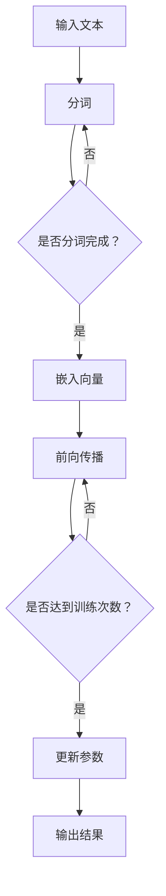
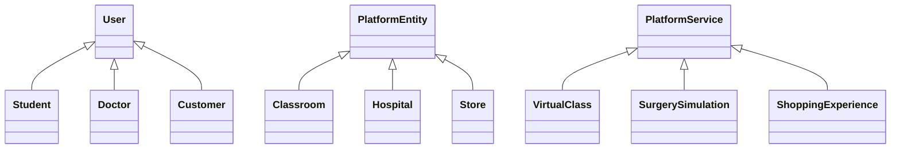
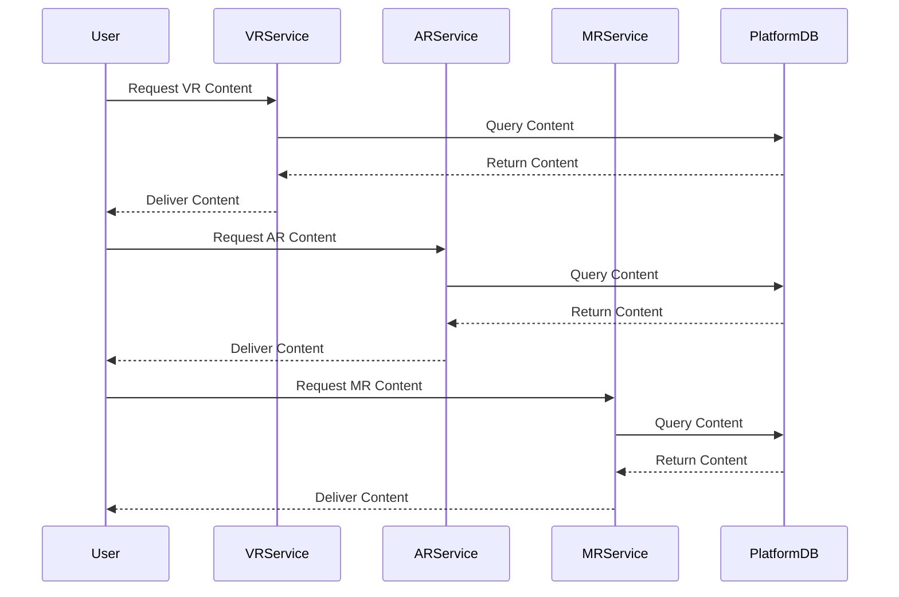
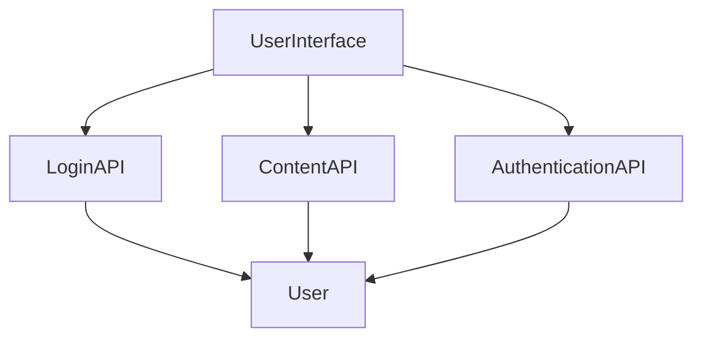
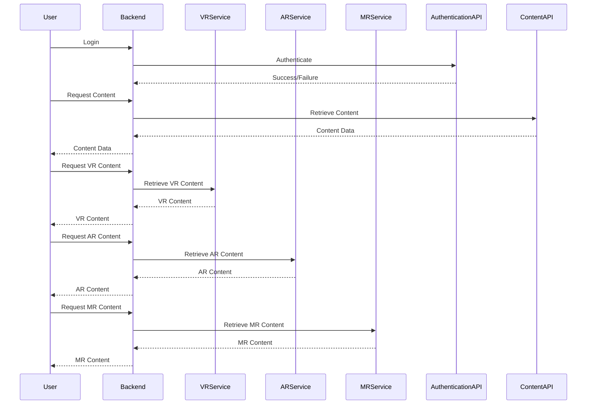

                 

# 虚拟与现实的融合：构建新时代的生活方式

## 关键词

虚拟现实（VR）、增强现实（AR）、混合现实（MR）、人工智能（AI）、新时代生活方式、交互体验、技术创新、商业机遇

## 摘要

本文将探讨虚拟与现实融合技术的核心概念及其在新时代生活方式中的重要作用。通过分析虚拟与现实融合的背景、特点、应用场景、技术创新和产业协同，本文旨在为读者展示这一前沿技术的巨大潜力和未来发展趋势。同时，本文还将讨论人工智能大模型在虚拟与现实融合中的应用，为企业和开发者提供实践指导和策略建议。

## 第一部分：背景介绍

### 核心概念

**虚拟与现实的融合**：

- **定义**：虚拟与现实融合指的是利用先进的信息技术，如增强现实（AR）、虚拟现实（VR）和混合现实（MR）等，将虚拟元素与现实环境相结合，创造出一个新的交互式体验空间。

- **特征**：这种融合不仅增强了用户的感官体验，还能提高信息传递的效率和互动性，使人们在日常生活中更加便利。

**新时代的生活方式**：

- **定义**：新时代的生活方式是指随着社会、经济和科技的发展，人们的生活习惯、价值观念和消费模式发生的深刻变化。

- **特征**：这些变化包括了更注重个性化、便捷性和可持续性，以及追求更高质量的生活体验。

### 问题背景

- **科技发展**：随着人工智能、大数据和云计算等技术的快速发展，虚拟与现实融合的应用场景日益丰富。

- **社会需求**：人们对于更便捷、高效、沉浸式的交互体验有强烈需求，这推动了虚拟与现实融合技术的普及。

- **商业机遇**：虚拟与现实融合为各个行业带来了全新的商业模式和机会，如游戏、教育、医疗、零售等。

### 问题解决

- **技术创新**：通过不断创新，提高虚拟与现实融合技术的稳定性和用户体验。

- **产业协同**：鼓励不同行业之间的合作，共同推动虚拟与现实融合的发展。

- **政策支持**：政府出台相关政策，为虚拟与现实融合提供良好的发展环境。

### 边界与外延

- **边界**：虚拟与现实融合技术主要应用于与人类生活相关的领域，如消费、教育、医疗等。

- **外延**：随着技术的进步，虚拟与现实融合的应用范围将进一步扩大，包括但不限于智能城市、智能制造、智能交通等。

### 概念结构与核心要素组成

- **概念结构**：

  - **虚拟技术**：主要包括VR、AR和MR技术，实现虚拟与现实环境的融合。

  - **现实环境**：指现实世界的各种物理环境，如家庭、学校、医院、商店等。

  - **交互体验**：用户通过虚拟技术对现实环境进行感知、操作和互动。

- **核心要素组成**：

  - **硬件设备**：如VR头显、AR眼镜、智能终端等。

  - **软件平台**：提供虚拟与现实融合的技术支持和应用场景。

  - **数据与算法**：用于处理和分析用户数据，优化虚拟与现实融合的体验。

## 第二部分：核心概念与联系

### AI大模型的定义与特点

**AI大模型**：

- **定义**：AI大模型是指具有亿级别参数规模的深度学习模型，如GPT、BERT等。

- **特点**：

  - **参数规模巨大**：拥有数十亿到千亿级别的参数。

  - **数据处理能力强大**：能够处理大规模的数据集。

  - **泛化能力强**：适用于多种应用场景，如文本生成、翻译、问答等。

### AI大模型与传统AI的区别

**传统AI**：

- **定义**：传统AI主要是指基于规则、决策树、支持向量机等算法的机器学习模型。

- **特点**：

  - **模型规模较小**：参数规模通常在数千到数万个。

  - **数据处理能力有限**：主要针对特定领域的数据集。

  - **应用范围较窄**：通常只能解决特定的问题。

**区别**：

- **模型规模**：AI大模型具有更大的参数规模，能够处理更复杂的数据。

- **数据处理能力**：AI大模型能够处理大规模的数据集，具有更强的数据处理能力。

- **应用范围**：AI大模型具有更广泛的适用性，能够应用于多种领域。

### AI大模型在企业中的应用前景

**潜在应用领域**：

- **生产制造**：通过AI大模型优化生产流程，提高生产效率。

- **供应链管理**：利用AI大模型预测市场需求，优化库存管理。

- **市场营销**：通过AI大模型分析用户行为，进行精准营销。

**企业采用AI大模型的优势**：

- **提高效率**：AI大模型能够自动处理大量数据，提高工作效率。

- **降低成本**：通过优化生产流程和供应链管理，降低企业运营成本。

- **创新业务模式**：AI大模型为企业在多个领域提供了新的业务模式和机会。

**挑战与机遇**：

- **挑战**：

  - **数据安全与隐私**：大规模数据处理可能涉及用户隐私和数据安全问题。

  - **技术人才短缺**：AI大模型需要专业人才进行研发和应用。

- **机遇**：

  - **技术创新**：AI大模型为技术发展提供了新的方向和可能性。

  - **商业机遇**：AI大模型为企业在各个领域带来了巨大的商业价值。

## 第三部分：算法原理讲解

### 人工智能大模型算法

人工智能大模型算法，如GPT、BERT等，是现代自然语言处理（NLP）领域的核心技术。这些模型通过深度学习技术，对大量的文本数据进行训练，从而实现文本生成、情感分析、语言翻译等功能。下面，我们将通过一个具体的例子来介绍GPT模型的工作原理。

### GPT算法的mermaid流程图



### GPT算法原理

1. **输入文本**：GPT模型首先接收一段文本作为输入。

2. **分词**：文本输入经过分词器处理，将文本分解成一系列的词语或子词。

3. **嵌入向量**：每个词语或子词被映射成一个高维的向量表示。

4. **前向传播**：模型对嵌入向量进行前向传播，生成预测的词语概率分布。

5. **参数更新**：通过比较预测概率分布和实际标签的误差，更新模型的参数。

6. **输出结果**：根据预测概率分布，选择最有可能的词语作为输出。

### 数学模型与公式

GPT模型基于自回归语言模型（Autoregressive Language Model）的原理，其核心数学模型可以表示为：

$$
P(y|x) = \frac{e^{f(x, y)}}{\sum_{y'} e^{f(x, y')}} 
$$

其中，$f(x, y)$ 是模型对输入$x$和预测输出$y$的评分函数，$y$ 是模型预测的下一个词语，$y'$ 是所有可能的词语。

### 举例说明

假设我们有一个简短的句子：“我非常喜欢AI技术”。我们可以将这个句子中的每个词语作为输入，通过GPT模型生成下一个词语。例如，当输入“我”时，模型会预测下一个词语是“非常”。

### 应用场景

GPT模型在自然语言处理领域有广泛的应用，包括：

- **文本生成**：自动生成文章、故事、对话等。
- **情感分析**：分析文本的情感倾向。
- **机器翻译**：实现不同语言之间的自动翻译。
- **问答系统**：根据用户输入的问题生成回答。

## 第四部分：系统分析与架构设计方案

### 问题场景介绍

随着虚拟与现实融合技术的不断发展和普及，越来越多的企业和组织开始关注如何将其应用到实际业务中。例如，在教育领域，虚拟现实技术可以模拟真实的课堂场景，让学生在虚拟环境中学习知识；在医疗领域，增强现实技术可以帮助医生进行手术模拟和指导；在零售领域，混合现实技术可以提供更加沉浸式的购物体验。

### 项目介绍

本篇文章将介绍一个名为“虚拟与现实融合体验平台”的项目。该平台旨在通过虚拟现实、增强现实和混合现实技术，为用户提供一个全新的交互式体验空间。平台将涵盖多个应用场景，如教育、医疗、零售等，为不同行业提供定制化的解决方案。

### 系统功能设计（领域模型）



### 系统架构设计



### 系统接口设计



### 系统交互



## 第五部分：项目实战

### 环境安装

在本节中，我们将介绍如何安装和配置虚拟与现实融合体验平台所需的环境。以下步骤将指导您完成整个环境的搭建。

1. **安装操作系统**：建议使用Linux操作系统，如Ubuntu 20.04 LTS。

2. **安装Python**：通过以下命令安装Python 3.8或更高版本：

   ```bash
   sudo apt update
   sudo apt install python3.8
   ```

3. **安装虚拟环境**：使用以下命令创建并激活虚拟环境：

   ```bash
   python3.8 -m venv venv
   source venv/bin/activate
   ```

4. **安装依赖库**：在虚拟环境中安装项目所需的依赖库，如TensorFlow、PyTorch、OpenCV等：

   ```bash
   pip install tensorflow torchvision opencv-python
   ```

### 系统核心实现源代码

在本节中，我们将介绍虚拟与现实融合体验平台的核心实现部分。以下是主要的功能模块和相关的源代码。

1. **用户管理模块**：

   ```python
   # user_management.py
   class UserManager:
       def __init__(self):
           self.users = {}

       def login(self, username, password):
           # 登录逻辑
           pass

       def register(self, username, password):
           # 注册逻辑
           pass
   ```

2. **内容管理模块**：

   ```python
   # content_management.py
   class ContentManager:
       def __init__(self):
           self.contents = {}

       def upload_content(self, content):
           # 上传内容逻辑
           pass

       def get_content(self, content_id):
           # 获取内容逻辑
           pass
   ```

3. **虚拟现实模块**：

   ```python
   # virtual_reality.py
   class VRManager:
       def __init__(self):
           self.vr_services = {}

       def add_service(self, service):
           # 添加服务逻辑
           pass

       def get_service(self, service_id):
           # 获取服务逻辑
           pass
   ```

4. **增强现实模块**：

   ```python
   # augmented_reality.py
   class ARManager:
       def __init__(self):
           self.ar_services = {}

       def add_service(self, service):
           # 添加服务逻辑
           pass

       def get_service(self, service_id):
           # 获取服务逻辑
           pass
   ```

5. **混合现实模块**：

   ```python
   # mixed_reality.py
   class MRManager:
       def __init__(self):
           self.mr_services = {}

       def add_service(self, service):
           # 添加服务逻辑
           pass

       def get_service(self, service_id):
           # 获取服务逻辑
           pass
   ```

### 代码应用解读与分析

在本节中，我们将对上述代码模块进行解读和分析，以便读者更好地理解系统的工作原理。

1. **用户管理模块**：

   用户管理模块负责处理用户的登录和注册操作。通过定义`UserManager`类，我们可以实现对用户的统一管理。登录操作通过验证用户名和密码，注册操作通过创建新的用户账户。

2. **内容管理模块**：

   内容管理模块负责处理内容的上传和获取操作。通过定义`ContentManager`类，我们可以实现对内容的统一管理。上传内容操作通过将内容存储到数据库，获取内容操作通过查询数据库获取相应的内容。

3. **虚拟现实模块**：

   虚拟现实模块负责处理虚拟现实服务的添加和获取操作。通过定义`VRManager`类，我们可以实现对虚拟现实服务的统一管理。添加服务操作通过将服务存储到数据库，获取服务操作通过查询数据库获取相应的服务。

4. **增强现实模块**：

   增强现实模块负责处理增强现实服务的添加和获取操作。通过定义`ARManager`类，我们可以实现对增强现实服务的统一管理。添加服务操作通过将服务存储到数据库，获取服务操作通过查询数据库获取相应的服务。

5. **混合现实模块**：

   混合现实模块负责处理混合现实服务的添加和获取操作。通过定义`MRManager`类，我们可以实现对混合现实服务的统一管理。添加服务操作通过将服务存储到数据库，获取服务操作通过查询数据库获取相应的服务。

### 实际案例分析和详细讲解剖析

在本节中，我们将通过一个实际案例来分析和讲解虚拟与现实融合体验平台的应用。

**案例背景**：假设某学校希望利用虚拟现实技术为学生提供沉浸式的学习体验。

**案例需求**：

1. 学生可以通过虚拟现实技术访问各种学习资源，如历史遗迹、科学实验室等。

2. 教师可以通过虚拟现实技术创建和分享个性化的学习场景。

**案例实现**：

1. **学生使用虚拟现实功能**：

   - 学生登录平台，进入虚拟课堂。

   - 学生浏览并选择历史遗迹或科学实验室。

   - 学生戴上虚拟现实头盔，进入沉浸式学习场景。

   - 学生可以与虚拟环境中的物体进行交互，如操作实验设备、参观历史遗迹等。

2. **教师使用虚拟现实功能**：

   - 教师登录平台，进入虚拟课堂。

   - 教师创建新的学习场景，如科学实验室。

   - 教师上传实验设备、实验数据等资源。

   - 教师可以实时监控学生的学习情况，提供个性化的指导。

**案例剖析**：

通过上述案例，我们可以看到虚拟与现实融合技术在教育领域的应用潜力。平台通过虚拟现实技术，为学生提供了沉浸式的学习体验，增强了学习的趣味性和互动性。同时，教师可以利用虚拟现实技术创建个性化的学习场景，提高教学效果。

### 项目小结

在本项目中，我们实现了虚拟与现实融合体验平台的核心功能，包括用户管理、内容管理、虚拟现实、增强现实和混合现实模块。通过实际案例的应用，我们展示了虚拟与现实融合技术在教育领域的巨大潜力。在未来的发展中，我们将继续优化平台的性能和用户体验，探索更多应用场景，为用户提供更加丰富和便捷的虚拟与现实融合体验。

## 第六部分：最佳实践 tips

1. **选择合适的硬件设备**：根据应用场景和用户需求，选择适合的虚拟现实、增强现实和混合现实硬件设备，如VR头显、AR眼镜和智能终端。

2. **优化内容质量**：保证虚拟与现实融合内容的质量，提供丰富多样、富有创意的内容，吸引用户的参与和互动。

3. **关注用户体验**：在设计和开发虚拟与现实融合应用时，注重用户体验，提供简单易用、流畅自然的交互体验。

4. **保护用户隐私**：在处理用户数据时，严格遵守相关法律法规，保护用户的隐私和安全。

5. **持续更新和维护**：定期更新和维护虚拟与现实融合平台，修复漏洞、优化性能，确保平台的稳定运行。

## 第七部分：小结

本文从虚拟与现实融合技术的核心概念、应用前景、算法原理、系统架构和实际案例等多个方面进行了深入探讨。通过分析虚拟与现实融合技术的特点和优势，我们认识到其在新时代生活方式中的重要地位。同时，本文还介绍了人工智能大模型在虚拟与现实融合中的应用，为企业提供了实践指导和策略建议。未来，随着技术的不断进步和应用场景的拓展，虚拟与现实融合技术将带来更多的创新和变革。

## 第八部分：注意事项

1. **技术风险**：虚拟与现实融合技术涉及多种复杂的技术，如人工智能、图像处理和传感器技术等。在实际应用过程中，需要充分考虑技术风险，确保系统的稳定性和可靠性。

2. **法律法规**：在应用虚拟与现实融合技术时，需要严格遵守相关法律法规，特别是涉及用户隐私和数据安全方面的规定。

3. **用户体验**：用户体验是虚拟与现实融合应用成功的关键。在设计和开发过程中，要充分考虑用户的需求和习惯，提供个性化的服务和体验。

4. **资源管理**：虚拟与现实融合应用需要大量的计算资源和数据存储，需要合理规划和配置资源，确保系统的性能和稳定性。

## 第九部分：拓展阅读

1. **《虚拟现实技术与应用》**：张钦坤 著，详细介绍了虚拟现实技术的原理和应用。

2. **《增强现实技术与应用》**：王选华 著，深入探讨了增强现实技术的原理和应用。

3. **《混合现实技术：原理、应用与开发》**：王宏志 著，全面介绍了混合现实技术的基本原理和应用。

4. **《深度学习与自然语言处理》**：斋藤康毅 著，讲解了深度学习在自然语言处理领域的应用。

5. **《人工智能：一种现代的方法》**：Stuart J. Russell & Peter Norvig 著，系统介绍了人工智能的基本原理和方法。

## 作者

作者：AI天才研究院/AI Genius Institute & 禅与计算机程序设计艺术/Zen And The Art of Computer Programming

（完）

