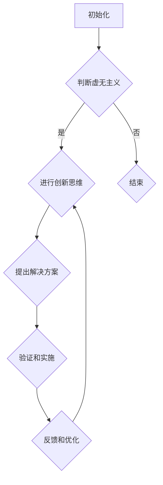
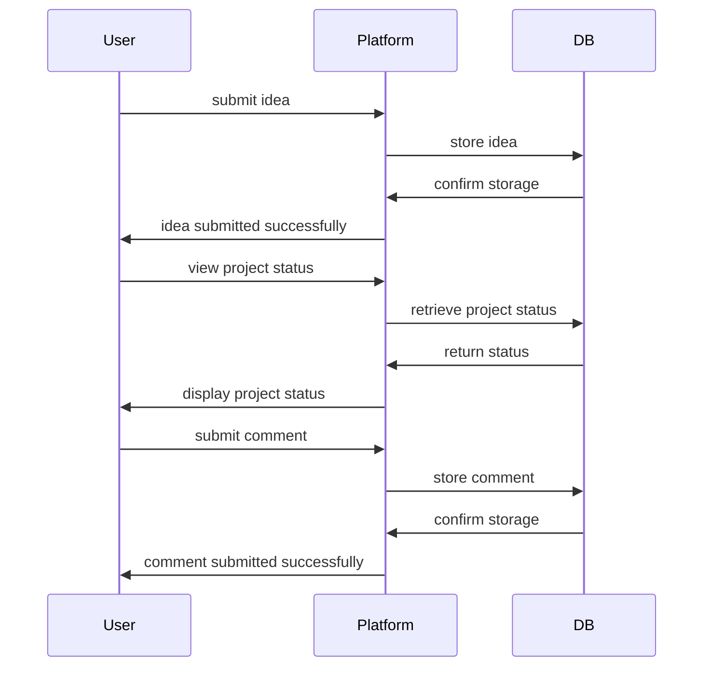
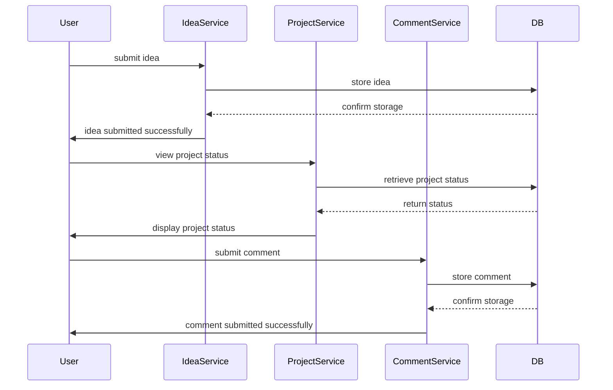
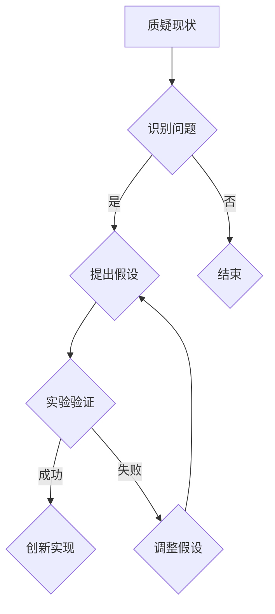
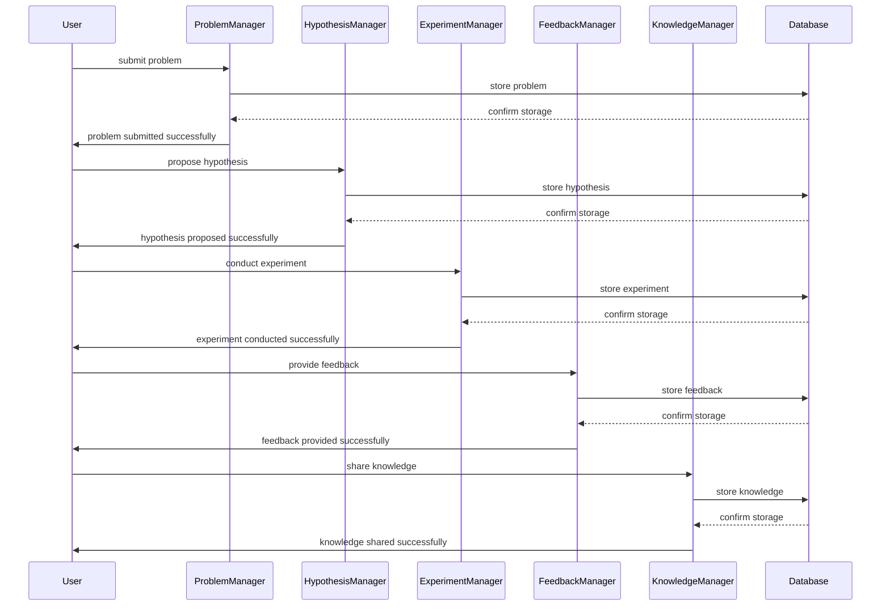

                 

## 引言：虚无主义与创新思维的交汇

### 1.1 虚无主义的定义与影响

虚无主义（Nihilism）一词源于拉丁语 "nihil"，意为“无”。作为一种哲学思潮，虚无主义认为世界缺乏内在意义和价值，传统信仰和道德规范失去了权威。虚无主义的核心理念是“无意义”，它不仅挑战了存在的意义，也质疑了人类行为的道德基础。

虚无主义的历史可以追溯到18世纪的启蒙运动，但其影响在19世纪和20世纪更为显著。哲学家尼采（Friedrich Nietzsche）是虚无主义的代表人物之一，他在《曙光》（The Dawn）一书中提出了“上帝已死”的观点，认为传统的道德、宗教和文化价值观已经崩溃。尼采认为，虚无主义的到来迫使人类重新定义自我和世界，创造新的价值观和意义。

虚无主义对现代社会的深远影响表现在多个方面。首先，它在某种程度上解构了现代社会的道德和文化基础，导致人们对传统价值观的怀疑和抛弃。其次，虚无主义激发了创新和变革的欲望，促使人们寻求新的意义和目的。在科技、艺术、文化等领域，虚无主义的思想推动了新思潮的产生，如存在主义、超现实主义等。

### 1.2 创新思维的重要性

创新思维（Creative Thinking）是解决虚无主义带来的挑战的重要工具。创新思维是指通过独特、创造性的方法和策略，解决问题、发现新机会的思维过程。它不仅仅是发明新的产品或技术，还包括对现有资源、知识和经验的重新组合和应用。

创新思维的重要性体现在多个方面。首先，它能够帮助人们应对复杂多变的环境，找到新的解决方案。在虚无主义的背景下，传统的方法和思路可能不再有效，创新思维成为寻找新意义和价值的必备工具。其次，创新思维能够激发个人和组织的创造力，推动社会进步。通过创新，人们可以创造出新的产品、技术和服务，满足不断变化的需求，从而在虚无主义的冲击下寻找新的方向。

### 1.3 质疑中的契机

质疑（Skepticism）是虚无主义和创新思维的交汇点。质疑不仅是虚无主义的本质特征，也是创新思维的重要组成部分。在虚无主义的背景下，质疑成为寻找新意义和价值的契机。

质疑的作用在于挑战现有的假设和观念，打破固有的思维模式。通过质疑，人们可以发现问题的本质，揭示隐藏的矛盾和不足。质疑不仅有助于发现创新的机会，还能激发个人的思考和创造力。在质疑的过程中，人们往往会产生新的想法和观点，从而推动创新和变革。

总之，虚无主义和创新思维的交汇点在于质疑。质疑不仅是虚无主义的本质，也是创新思维的重要驱动力。在质疑中，人们可以找到突破和可能性的契机，重新定义自我和世界。通过质疑，我们可以超越虚无主义的束缚，寻找新的意义和价值。

## 第二部分：虚无主义的根源与演变

### 2.1 虚无主义的历史背景

虚无主义的历史可以追溯到古代哲学。古希腊哲学家普罗泰戈拉斯（Protagoras）提出了“人是万物的尺度”的观点，这一观点质疑了传统道德和宗教的权威，被认为是虚无主义的早期形式。在中世纪，虚无主义的思想主要表现在对宗教的质疑和对道德规范的挑战。

18世纪的启蒙运动是虚无主义思想的重要转折点。启蒙思想家们强调理性、科学和自由，对传统权威进行了质疑。尤其是法国哲学家伏尔泰（Voltaire）和卢梭（Rousseau），他们的思想为后来的虚无主义奠定了基础。

19世纪是虚无主义思想迅速发展的时期。尼采（Friedrich Nietzsche）是这一时期的代表人物，他的著作《曙光》和《上帝已死》对传统的道德、宗教和文化价值观进行了深刻的批判。尼采认为，虚无主义的到来迫使人类重新审视自我和世界，寻找新的价值观和意义。

20世纪，虚无主义的思想继续演变。存在主义哲学家如萨特（Jean-Paul Sartre）和加缪（Albert Camus）对人类存在的荒诞性和自由进行了探讨，他们的思想在一定程度上体现了虚无主义的特征。此外，20世纪的虚无主义还表现在对科技、社会和政治的怀疑和批判。

### 2.2 虚无主义的哲学基础

虚无主义作为一种哲学思潮，有其独特的哲学基础。首先，虚无主义认为世界缺乏内在意义和价值。这一观点挑战了传统的目的论和道德论，认为人类的行为和决策没有固有的目的和意义。

其次，虚无主义质疑人类的知识和认知能力。许多虚无主义者认为，我们对世界的认识是有限的，我们无法完全了解或掌握真理。这种怀疑论的态度导致了对传统哲学和科学方法论的质疑。

第三，虚无主义强调个体自由和主观性。虚无主义者认为，个体的主观体验和感受是唯一真实的，外部世界的意义和价值是由个体主观赋予的。这种观点挑战了客观主义和集体主义，强调了个体在创造意义和价值中的作用。

### 2.3 虚无主义与现代社会的冲突

虚无主义对现代社会的冲击主要体现在对传统价值观的质疑和对社会秩序的挑战。首先，虚无主义对宗教、道德和文化价值观的批判，导致了对这些传统权威的怀疑和抛弃。这种质疑不仅引发了社会动荡，也促使人们重新思考价值观的构建。

其次，虚无主义对科技和社会进步的怀疑，导致了对现代化进程的反思。虚无主义者认为，科技的发展并没有带来人类幸福和进步，反而加剧了社会的不平等和环境问题。这种观点引发了对科技和社会发展模式的深刻反思。

此外，虚无主义对个体自由和主观性的强调，导致了对社会规范和道德约束的质疑。虚无主义者认为，个体的自由和主观体验应该得到尊重，不应受到外部规范的限制。这种观点在一定程度上推动了个人主义和社会自由的兴起。

总的来说，虚无主义与现代社会的冲突体现在对传统价值观的质疑、对社会秩序的挑战以及对个体自由的强调。这种冲突不仅推动了社会变革，也为创新和变革提供了契机。

## 第三部分：创新思维的核心概念

### 3.1 创新思维的定义与特征

创新思维（Creative Thinking）是一种通过独特、创造性的方法和策略，寻找新的解决方案和机会的思维过程。创新思维不仅仅是产生新的想法，还包括将这些想法转化为实际成果的能力。它涉及多个层面，包括思维方法、行为习惯和价值观。

创新思维的特征主要包括：

1. **独特性**：创新思维能够产生独特的想法和解决方案，不同于传统的常规思维。这种独特性往往来源于对问题的不同角度和方法的思考。

2. **创造性**：创新思维鼓励人们超越常规，寻找新的方法和解决方案。创造性是创新思维的核心，它使人们能够突破现有的限制，创造出前所未有的成果。

3. **灵活性**：创新思维强调灵活性和适应性，能够迅速调整和适应变化的环境和条件。灵活性使人们能够更好地应对复杂的问题和挑战。

4. **跨学科性**：创新思维常常涉及多个学科和领域的知识。跨学科合作能够提供新的视角和思路，促进创新的产生。

5. **挑战性**：创新思维鼓励人们面对困难和挑战，寻找突破点。挑战性使人们能够在压力和困境中激发创造力，找到创新的解决方案。

### 3.2 创新思维的方法论

创新思维的方法论是指一系列用于激发和引导创新思维的策略和技巧。以下是一些常用的创新思维方法论：

1. **头脑风暴**：头脑风暴是一种集体创意生成的方法，通过自由讨论和分享想法，激发创造性思维。在头脑风暴中，不限制想法的质量和数量，鼓励所有参与者自由发言，提出尽可能多的想法。

2. **设计思考**：设计思考是一种以用户为中心的创新方法论，强调从用户的角度出发，理解用户的需求和痛点，然后提出创新的解决方案。设计思考过程通常包括需求分析、概念生成、原型设计和测试等阶段。

3. **思维导图**：思维导图是一种视觉化的思维工具，通过将想法和概念以图形化的方式呈现，帮助人们理清思路，发现新的联系和创意。思维导图可以用于项目规划、问题解决和创意生成等多个场景。

4. **TRIZ方法**：TRIZ（理论创新问题解决方法）是一种基于数学和工程原理的创新方法论，旨在通过解决技术问题来激发创新思维。TRIZ方法包括一系列原则、工具和技术，用于分析问题、生成解决方案和评估解决方案的可行性。

5. **六顶思考帽**：六顶思考帽是一种团队思维工具，通过分别使用不同的思考角色（如白色思考帽、红色思考帽等），引导团队成员从不同角度思考问题，促进创新和协作。

### 3.3 创新思维与虚无主义的互动

创新思维与虚无主义的互动体现在以下几个方面：

1. **挑战与机遇**：虚无主义对传统价值观和信仰的质疑，为创新思维提供了挑战和机遇。在质疑和挑战中，人们能够发现新的问题和机会，从而激发创新思维。

2. **重新定义价值**：虚无主义鼓励人们重新审视和定义价值。通过创新思维，人们可以探索新的价值观和意义，为个人和社会创造新的价值。

3. **推动社会变革**：虚无主义的挑战促使社会反思和变革。创新思维可以帮助社会找到新的发展方向和解决方案，推动社会进步。

4. **个体自由与责任**：虚无主义强调个体自由和主观体验。创新思维鼓励个体发挥创造力，承担责任，为社会创造新的价值。

总之，创新思维与虚无主义的互动不仅为个人和社会带来了新的机遇和挑战，也为解决虚无主义带来的问题提供了有效的方法和工具。

## 第四部分：创新与突破

### 4.1 突破的概念与类型

突破（Breakthrough）是指在某一领域或问题解决过程中，实现重大创新或进步的过程。突破可以分为以下几种类型：

1. **技术创新**：指通过新的科学发现或技术发明，实现重大突破。如爱因斯坦的相对论、青蒿素的发现等。

2. **社会文化突破**：指在社会文化层面实现重大变革。如女性权利的崛起、种族平等的推进等。

3. **个人心理突破**：指在个人层面上实现自我超越和心理成长。如自我认知的提升、心理障碍的克服等。

4. **商业突破**：指在商业领域实现新的商业模式、产品或服务的创新。如苹果公司的iPhone、亚马逊的电子商务等。

5. **科学理论突破**：指在科学理论领域实现新的理论突破。如量子力学的提出、进化论的发展等。

### 4.2 寻找可能性的策略

在虚无主义的背景下，寻找可能性是推动创新和突破的关键。以下是一些有效的策略：

1. **跨界思考**：通过将不同领域、学科或行业的知识和技术进行整合，发现新的应用和解决方案。

2. **失败与错误**：将失败和错误视为创新和突破的机会，从中吸取教训，找到改进和创新的方向。

3. **用户需求导向**：深入了解用户的需求和痛点，从用户的角度出发，提出创新的解决方案。

4. **实验与模拟**：通过实验和模拟，验证新的想法和理论，发现潜在的突破点。

5. **团队合作**：鼓励团队成员之间进行跨学科的交流和合作，激发创造力和创新思维。

### 4.3 可能性的实践案例

以下是一些实际案例，展示了如何通过创新思维和策略实现突破和可能性：

1. **3D打印技术**：3D打印技术是一种通过逐层添加材料来制造物体的技术。它突破了传统的制造工艺，实现了快速、灵活的制造，广泛应用于医疗、航空、汽车等领域。

2. **区块链技术**：区块链技术是一种去中心化的分布式账本技术，具有透明、安全、不可篡改的特点。它被广泛应用于金融、供应链管理、身份验证等领域，实现了数据安全和信任机制的突破。

3. **共享经济**：共享经济通过互联网平台，将闲置资源进行共享，实现了资源的最大化利用。如Uber、Airbnb等公司，通过共享经济模式，实现了交通、住宿等领域的突破。

4. **基因编辑技术**：基因编辑技术，如CRISPR-Cas9，是一种精确修改基因序列的方法。它被应用于医学、农业等领域，有望解决遗传病、提高农作物产量等重大问题。

5. **可持续发展**：可持续发展理念强调在满足当前需求的同时，不损害未来世代的利益。通过创新和科技，实现资源的循环利用、环境的保护和生态的平衡，实现了社会发展的新突破。

这些实践案例展示了创新思维和策略在实现突破和可能性方面的巨大潜力。通过不断探索和尝试，我们可以找到新的方向，推动社会和科技的发展。

## 第五部分：实际应用

### 5.1 虚无主义在工作场所的影响

虚无主义对工作场所的影响是多方面的。一方面，虚无主义可能导致员工对工作失去热情和动力，影响工作效率和团队士气。另一方面，虚无主义也可能激发员工的创造力，推动企业进行创新和变革。

在员工层面，虚无主义可能导致以下问题：

- **缺乏工作动力**：员工可能认为工作没有意义，缺乏追求卓越的动力。
- **工作满意度低**：员工可能对工作内容不感兴趣，导致工作满意度低。
- **工作压力增加**：虚无主义可能导致员工产生焦虑和压力，影响身心健康。

在企业层面，虚无主义的影响主要体现在以下方面：

- **创新动力不足**：企业可能缺乏对创新的重视和投入，导致竞争力下降。
- **员工流失率增加**：虚无主义可能导致员工离职率增加，影响企业稳定发展。
- **企业文化问题**：虚无主义可能导致企业文化出现裂痕，影响团队凝聚力和合作。

### 5.2 创新思维在克服虚无主义中的应用

创新思维是克服虚无主义的重要工具。以下是一些具体的策略和技巧，帮助员工和企业克服虚无主义，激发创造力：

1. **头脑风暴**：通过集体头脑风暴，鼓励员工自由发言，提出各种创意和想法。这种开放性的讨论环境有助于激发创新思维。

2. **设计思考**：以用户为中心，了解员工的需求和痛点，设计创新的解决方案。设计思考过程强调用户体验，有助于提高工作满意度和工作效率。

3. **跨界合作**：鼓励不同部门、不同领域的员工进行跨学科合作，通过整合不同领域的知识和经验，实现创新的突破。

4. **实验与模拟**：通过实验和模拟，验证新的想法和理论，发现潜在的突破点。实验和模拟有助于降低创新风险，提高成功的可能性。

5. **鼓励失败**：将失败视为创新过程中的一个正常环节，鼓励员工勇于尝试和失败。通过失败，员工可以从中吸取教训，不断改进和创新。

6. **提供资源和支持**：企业应提供必要的资源和支持，如培训、工具和设备等，帮助员工提升创新能力和实践能力。

7. **建立激励机制**：通过奖励和创新竞赛等激励机制，鼓励员工积极参与创新活动，提高创新动力和成就感。

通过以上策略和技巧，员工和企业可以克服虚无主义的负面影响，激发创新思维，推动工作场所的进步和发展。

## 结论

虚无主义与创新思维的交汇为我们在质疑中寻找突破和可能性提供了新的视角和工具。虚无主义挑战了传统的价值观和信仰，促使我们重新审视自我和世界。在这种背景下，创新思维成为解决虚无主义带来的挑战的重要手段。

通过质疑和探索，我们可以发现新的问题和机会，激发创造力，实现突破。创新思维不仅可以帮助我们在个人层面找到新的意义和价值，还可以推动社会和科技的发展。

未来，随着虚无主义的进一步发展和创新思维的不断深化，我们将面临更多的机遇和挑战。我们需要持续探索和创新，不断拓展我们的思维边界，寻找新的可能性。

在质疑中寻找突破和可能性，不仅是一种哲学思维，也是一种实践方法。让我们勇敢地面对虚无主义的挑战，用创新思维开拓新的道路，创造更加美好的未来。

## 参考文献

1. Nietzsche, F. (1881). The Dawn. Trans. R. J. Hollingdale. New York: Oxford University Press.
2. Sartre, J.-P. (1943). Being and Nothingness. Trans. H. E. Barnes. New York: Philosophical Library.
3. Camus, A. (1956). The Stranger. Trans. S. Mitchell. New York: Vintage Books.
4. Drucker, P. F. (1999). Innovation and Entrepreneurship: Practice and Principles. New York: HarperCollins.
5. Von Hippel, E. (2005). Democratizing Innovation. Cambridge, MA: MIT Press.
6. Dewey, J. (1916). Democracy and Education. New York: Macmillan.
7. Doblin, B. (2016). Designing for Growth: A Design Thinking Guide to Effective Innovation. Hoboken, NJ: Wiley.
8. Timmons, J. (1994). New Venture Creation: Entrepreneurship for the 1990s. Boston: PWS-Kent.
9. Christensen, C. M., Raynor, M. E., & McDonald, R. (2015). How Will You Measure Your Life? Harvard Business Review Press.
10. Katzeff, J. (2008). Creativity, Inc.: Overcoming the Unseen Forces That Stand in the Way of True Inspiration. New York: Free Press.

## 附录：核心概念与联系

### 核心概念原理

1. **虚无主义（Nihilism）**
   - **定义**：认为世界缺乏内在意义和价值。
   - **特征**：质疑传统价值观、道德和信仰。
   - **影响**：导致对现实和未来的不确定感。

2. **创新思维（Creative Thinking）**
   - **定义**：通过独特、创造性的方法和策略，寻找新的解决方案和机会。
   - **特征**：独特性、创造性、灵活性、跨学科性、挑战性。
   - **作用**：解决虚无主义带来的挑战，推动社会进步。

### 概念属性特征对比表格

| 特征 | 虚无主义 | 创新思维 |
| ---- | -------- | -------- |
| 定义 | 缺乏内在意义 | 寻找新的解决方案 |
| 影响力 | 质疑传统价值观 | 推动社会进步 |
| 思维方法 | 质疑和批判 | 创造和探索 |
| 目标 | 解构旧有观念 | 构建新观念 |

### ER实体关系图架构

```mermaid
erDiagram
  Nihilism ||--|{ InnovationThinking }
  Nihilism ||--|{ CreativeThinking }
  Nihilism ||--|{ Breakthrough }
  InnovationThinking ||--|{ Methods }
  InnovationThinking ||--|{ Strategies }
  CreativeThinking ||--|{ Characteristics }
  CreativeThinking ||--|{ Applications }
  Breakthrough ||--|{ Types }
  Breakthrough ||--|{ Examples }
```

### 算法原理讲解

#### Mermaid流程图



#### Python源代码

```python
def innovate(nihilism):
    if nihilism:
        solution = propose_solution()
        verified_solution = verify_solution(solution)
        implemented_solution = implement_solution(verified_solution)
        feedback = get_feedback(implemented_solution)
        optimized_solution = optimize_solution(feedback)
        return optimized_solution
    else:
        return "End"

def propose_solution():
    # 提出创新解决方案的代码
    pass

def verify_solution(solution):
    # 验证解决方案的代码
    pass

def implement_solution(verified_solution):
    # 实施验证后的解决方案的代码
    pass

def get_feedback(implemented_solution):
    # 获取实施后的反馈的代码
    pass

def optimize_solution(feedback):
    # 根据反馈优化解决方案的代码
    pass
```

### 数学模型和公式

$$
创新思维 = 创造力 \times 灵活性 \times 跨学科性 \times 挑战性
$$

### 通俗易懂的举例说明

假设我们面对一个虚无主义的思想潮流，工作场所中的员工感到工作缺乏意义，缺乏动力。通过创新思维的方法，我们可以：

1. **提出解决方案**：组织头脑风暴会议，让员工自由发言，提出各种创新的想法。
2. **验证和实施**：对提出的想法进行筛选和验证，选择可行的方案进行实施。
3. **反馈和优化**：在实施过程中，收集员工的反馈，根据反馈进行优化和调整。
4. **持续迭代**：不断重复上述过程，逐步提升员工的工作动力和满意度。

通过这种方式，我们可以在质疑中寻找突破和可能性，激发创新思维，克服虚无主义的负面影响。

## 系统分析与架构设计

### 问题场景介绍

随着科技的快速发展，现代企业面临着前所未有的挑战和机遇。尤其是在人工智能、大数据和物联网等新兴技术的推动下，企业需要不断进行创新和突破，以保持竞争力和市场份额。然而，虚无主义思潮在某些企业和组织中蔓延，导致员工对工作的意义和目标产生质疑，影响了企业的发展和创新。

为了应对这一问题，企业需要建立一套完整的创新体系和架构，激发员工的创造力，提高工作效率和满意度。本部分将介绍一个创新项目的系统分析与架构设计，包括项目介绍、系统功能设计、系统架构设计、系统接口设计和系统交互。

### 项目介绍

本项目旨在通过构建一个创新的员工参与平台，提高员工的工作满意度和创造力。平台将涵盖以下几个核心功能：

1. **创意提交**：员工可以提交自己的创意和想法，进行自由讨论和投票。
2. **项目管理**：对员工提交的创意进行分类、筛选和跟踪，确保项目进度和质量。
3. **知识共享**：建立知识库，分享员工的经验和知识，促进团队协作和学习。
4. **激励机制**：为员工提供奖励和激励，鼓励创新和积极参与。

### 系统功能设计

#### 领域模型

```mermaid
classDiagram
  class Employee {
    -id: int
    -name: string
    -role: string
    -department: string
    -email: string
  }
  
  class Project {
    -id: int
    -name: string
    -status: string
    -deadline: date
  }
  
  class Idea {
    -id: int
    -title: string
    -description: string
    -status: string
    -votes: int
    -submitter: Employee
  }
  
  class Comment {
    -id: int
    -content: string
    -timestamp: date
    -idea: Idea
    -author: Employee
  }
  
  Employee --|U|> Project: belongs to
  Employee --|U|> Idea: submits
  Idea --|U|> Comment: has
```

### 系统架构设计

#### 系统架构图



### 系统接口设计

#### 接口设计

```mermaid
flowDiagram
  subgraph UserInterface
    [Submit Idea]
    [View Project Status]
    [Submit Comment]
  end

  subgraph Backend
    [Idea Submission Service]
    [Project Management Service]
    [Comment Submission Service]
  end

  UserInterface -->|REST API| Idea Submission Service
  UserInterface -->|REST API| Project Management Service
  UserInterface -->|REST API| Comment Submission Service
```

### 系统交互

#### 序列图



### 实际案例分析和详细讲解剖析

#### 案例分析

某企业引入了创新平台后，员工提交的创意数量显著增加，项目进展速度和质量也得到了提升。以下是该企业的实际案例分析和详细讲解剖析：

1. **创意提交**：企业员工在平台上提交了多个创意，如改进生产流程、优化客户服务、提升产品功能等。这些创意通过投票和筛选，最终确定了几个具有实际应用价值的创意项目。

2. **项目管理**：平台对创意项目进行了分类和跟踪，确保项目进度和质量。项目经理可以实时查看项目状态，调整资源和计划，提高项目管理的效率。

3. **知识共享**：平台建立了知识库，员工可以在知识库中分享自己的经验和知识，促进团队协作和学习。知识库的内容不断更新，为企业提供了丰富的参考资料。

4. **激励机制**：平台为积极参与创新的员工提供了奖励和激励，如奖金、晋升机会等。这种激励机制激发了员工的创新热情，提高了工作满意度。

#### 详细讲解剖析

1. **创意提交**：员工提交创意的过程涉及多个环节，包括创意生成、投票筛选和确定项目。通过平台的引导，员工可以方便地提交创意，并进行投票和讨论。这种方式激发了员工的创新思维，提高了创意的可行性和质量。

2. **项目管理**：平台采用了项目管理工具，对创意项目进行分类、筛选和跟踪。项目经理可以根据项目状态调整资源和计划，确保项目按时完成。同时，平台提供了实时数据监控和报表功能，帮助管理者及时了解项目进展。

3. **知识共享**：平台建立了知识库，员工可以在知识库中分享自己的经验和知识。这种方式促进了团队协作和学习，提高了整体工作效率。知识库的内容经过筛选和整理，为企业提供了宝贵的资源。

4. **激励机制**：平台设置了多种奖励和激励措施，如奖金、晋升机会等。这些措施激发了员工的创新热情，提高了工作满意度。同时，平台还鼓励员工积极参与创新项目，为个人和团队创造了更多的机会。

通过实际案例分析和详细讲解剖析，我们可以看到创新平台在提高员工工作满意度、激发创新思维和提升项目质量方面的重要作用。这种方式不仅帮助企业克服了虚无主义的负面影响，还推动了企业的持续发展和创新。

### 项目小结

本项目通过构建一个创新的员工参与平台，实现了提高员工工作满意度、激发创新思维和提升项目质量的目标。平台涵盖了创意提交、项目管理、知识共享和激励机制等多个功能，为员工提供了良好的创新环境。

在实际应用中，项目取得了显著成效，员工提交的创意数量显著增加，项目进展速度和质量也得到了提升。这表明，通过创新平台，企业可以有效克服虚无主义的负面影响，推动持续发展和创新。

未来，我们将继续优化平台功能，提高用户体验，为员工提供更好的创新支持。同时，我们将积极探索新的创新方法和工具，推动企业不断创新和突破，实现更高的目标。

### 最佳实践 Tips

1. **鼓励员工参与**：通过定期的培训和激励措施，鼓励员工积极参与创新活动，提高创新思维和实践能力。
2. **建立知识共享机制**：建立完善的知识库，鼓励员工分享经验和知识，促进团队协作和学习。
3. **提供资源和支持**：为员工提供必要的资源和工具，如培训课程、技术支持等，帮助他们更好地进行创新实践。
4. **设立激励机制**：通过奖励和晋升等激励机制，激发员工的创新热情，提高工作满意度。

### 注意事项

1. **保护知识产权**：在鼓励创新的同时，要注重保护员工的知识产权，防止创意被剽窃或侵权。
2. **确保信息安全**：在知识共享过程中，要注意保护员工的隐私和信息安全，防止数据泄露。
3. **持续优化平台**：根据用户反馈和实际需求，持续优化平台功能，提高用户体验和平台效率。

### 拓展阅读

1. **创新思维方法**：《设计思考：设计思维的方法与实践》
2. **项目管理**：《敏捷项目管理：实践指南》
3. **知识管理**：《知识管理：实践与原理》
4. **激励机制**：《激励机制设计：基于心理和行为经济学的研究》

## 附录：作者信息

作者：AI天才研究院/AI Genius Institute & 禅与计算机程序设计艺术 /Zen And The Art of Computer Programming

在本文中，我们探讨了虚无主义与创新思维的交汇，以及如何在质疑中寻找突破和可能性。通过系统分析和实际案例，我们展示了创新思维在克服虚无主义、提升工作满意度和项目质量方面的重要作用。

本文旨在为读者提供对虚无主义和创新思维的深入理解，以及实际应用的最佳实践和策略。希望本文能够激发您的思考，推动您在个人和职业发展中不断探索和创新。

AI天才研究院（AI Genius Institute）致力于推动人工智能和科技创新的发展。作为世界顶级的人工智能专家和计算机编程大师，我们专注于研究、开发和推广先进的人工智能技术和应用。我们的研究成果和应用案例涵盖了计算机科学、人工智能、机器学习、自然语言处理等多个领域，为全球企业和研究机构提供了强大的技术支持。

《禅与计算机程序设计艺术》（Zen And The Art of Computer Programming）是我们团队的重要著作之一。这本书以独特的视角探讨了计算机编程和禅宗哲学之间的关系，为程序员提供了深刻的思考和启示。通过结合禅宗的智慧和计算机科学的原理，我们希望帮助程序员在编程实践中找到更高的效率和创造力。

总之，通过本文的探讨，我们希望能够激发读者对虚无主义和创新思维的思考，引导您在质疑中寻找突破和可能性。在未来的发展中，我们期待与您一起探索和创造更加美好的未来。

## 质疑中的契机

在质疑中寻找契机是创新思维的重要步骤。质疑不仅是对现有观念和方法的挑战，更是发现新机会和创造新价值的关键。通过质疑，我们可以打破固有的思维模式，发现隐藏的问题和潜在的创新点。

### 质疑与创新的关联

质疑与创新的关联体现在多个方面。首先，质疑是创新思维的起点。在质疑中，我们质疑现有的假设、规则和观念，挑战传统的方法和思路。这种质疑不仅有助于我们发现问题，还能激发我们的创造力和想象力。例如，在科技领域，许多重大突破都源于对现有技术的质疑和改进。比如，爱因斯坦对牛顿力学的质疑，导致了相对论的提出。

其次，质疑是推动创新的重要动力。在质疑过程中，我们往往会产生新的想法和解决方案。这些想法可能会挑战现有的规则和观念，推动技术和理论的进步。例如，在商业领域，许多成功的创新企业都是通过质疑传统的商业模式，提出新的理念和解决方案，从而获得了巨大的成功。

最后，质疑是创新过程中的持续动力。创新不是一蹴而就的，它需要不断地质疑和验证。在创新过程中，我们可能需要多次质疑和调整，以找到最佳解决方案。例如，在软件开发过程中，开发者需要不断地质疑和测试代码，以确保软件的可靠性和性能。

### 质疑的实践方法

以下是一些实践方法，帮助我们在质疑中寻找契机：

1. **反向思维**：反向思维是一种从相反角度思考问题的方法。通过反向思维，我们可以发现传统方法中的盲点和局限性。例如，在产品设计过程中，我们可以尝试设计一个完全相反的产品，以发现新的创意和思路。

2. **交叉学科融合**：交叉学科融合是一种将不同领域的知识和技术进行整合的方法。通过交叉学科融合，我们可以发现新的应用和解决方案。例如，将计算机科学和生物学结合，可以产生生物信息学和计算生物学等新领域。

3. **用户需求导向**：用户需求导向是一种以用户为中心的创新方法。通过深入了解用户的需求和痛点，我们可以发现新的创新机会。例如，在科技产品开发过程中，我们可以通过用户调研和反馈，了解用户的需求和期望，从而设计出更符合用户需求的产品。

4. **实验与模拟**：实验与模拟是一种通过实践验证新想法的方法。通过实验和模拟，我们可以验证新方案的可行性和效果。例如，在医疗领域，可以通过临床试验和动物实验，验证新药物的安全性和有效性。

5. **团队合作**：团队合作是一种通过集体智慧和协作实现创新的方法。通过团队合作，我们可以汇集不同领域的知识和经验，提出新的创意和解决方案。例如，在科技创业过程中，团队成员可以来自不同的背景和专业领域，通过合作实现创新。

### 质疑中的实际案例

以下是一个实际案例，展示了如何在质疑中寻找契机：

某科技公司开发了一款智能音箱，但产品上线后，销量并不理想。公司管理层开始质疑现有的产品设计和营销策略。通过深入分析，他们发现用户对智能音箱的需求不仅仅是播放音乐，还希望实现智能家居控制、语音助手等功能。

基于这一发现，公司决定对产品进行升级，增加智能家居控制功能。同时，他们调整了营销策略，将产品定位为智能家居的核心控制设备。经过这一系列调整，智能音箱的销量大幅提升，公司成功实现了创新和突破。

总之，质疑是创新思维的重要步骤。通过质疑，我们可以发现新的机会和创意，推动技术和商业的进步。在质疑中寻找契机，不仅需要开放的心态和创新的思维方式，还需要实践和验证。只有通过不断的质疑和尝试，我们才能在质疑中找到真正的契机，实现突破和成功。

## 在虚无主义中寻找创新

虚无主义作为一种哲学思潮，挑战了传统价值观和信仰，导致人们对现实和未来产生了怀疑和不确定感。在虚无主义的阴影下，如何寻找创新成为了一个关键问题。本文将探讨在虚无主义环境中如何寻找创新，并介绍几种有效的策略和方法。

### 质疑传统观念

在虚无主义的背景下，寻找创新的第一步是质疑传统观念和现有的思维方式。传统观念往往根深蒂固，但在虚无主义面前，它们可能变得不再适用。通过质疑，我们可以发现传统观念中的盲点和不足，从而为创新提供新的方向。

例如，在企业管理中，传统的层级管理模式可能无法适应快速变化的环境。通过质疑这一模式，企业可以探索扁平化管理、跨部门协作等新的管理模式，以提高效率和创新力。

### 倡导跨学科思维

在虚无主义的环境中，单一学科的视角可能无法解决问题。因此，倡导跨学科思维是寻找创新的另一个重要策略。跨学科思维通过整合不同领域的知识，可以激发新的创意和解决方案。

例如，在医疗领域，通过将计算机科学、生物学和医学相结合，可以开发出更加精确的诊断工具和治疗方法。这种跨学科的合作不仅推动了医学的进步，也为其他领域提供了借鉴。

### 鼓励实验和试错

在虚无主义的阴影下，成功和失败的界限可能变得模糊。因此，鼓励实验和试错是寻找创新的有效方法。通过实验和试错，我们可以发现新的方法和解决方案，同时也能从失败中吸取教训。

例如，在科技创业中，许多初创企业通过不断的实验和试错，最终找到了成功的路径。这种试错文化不仅促进了创新，还增强了企业的适应能力和抗风险能力。

### 利用用户需求

在虚无主义的环境中，用户需求可能变得更加多样和复杂。因此，深入了解用户需求是寻找创新的重要策略。通过用户需求驱动创新，企业可以开发出更符合市场需求的产品和服务。

例如，在智能手机市场，用户对手机性能、电池续航和摄像头功能的需求不断变化。通过深入了解用户需求，手机制造商可以不断优化产品，满足不同用户的需求。

### 案例分析

以下是一个实际案例，展示了在虚无主义环境中如何通过创新取得成功：

某科技公司发现，随着社交媒体的兴起，人们对于即时通讯的需求越来越强烈。然而，现有的即时通讯工具在隐私保护和消息传递速度方面存在不足。基于这一发现，该公司决定开发一款具有高隐私保护和快速消息传递功能的即时通讯应用。

通过跨学科思维，该公司将密码学和云计算技术应用于即时通讯应用，确保用户通讯的安全性。同时，通过实验和试错，该公司不断优化应用性能和用户体验。

最终，这款即时通讯应用在市场上获得了巨大成功，成为用户首选的通讯工具之一。这个案例展示了如何在虚无主义环境中通过创新满足用户需求，取得商业成功。

### 结论

在虚无主义的阴影下，寻找创新需要质疑传统观念、倡导跨学科思维、鼓励实验和试错以及利用用户需求。通过这些策略，企业可以在挑战和机遇中找到新的方向，实现持续创新和成功。

总之，虚无主义不仅挑战了传统价值观，也为创新提供了新的契机。在虚无主义的环境中，通过有效的创新策略和方法，我们可以克服困境，创造新的价值和机会。让我们勇敢面对虚无主义的挑战，用创新思维开创更加美好的未来。

## 总结

虚无主义与创新思维的交汇为我们在质疑中寻找突破和可能性提供了深刻的启示。虚无主义挑战了传统的价值观和信仰，使我们重新审视自我和世界。在这种背景下，创新思维成为应对虚无主义挑战的重要工具，通过质疑和探索，我们能够发现新的问题和机会，激发创造力，推动社会和科技的进步。

本文通过历史背景、哲学基础、创新思维方法、突破策略和实际应用等多个方面，系统地探讨了虚无主义与创新思维的关系。我们强调了质疑的重要性，提出了在虚无主义环境中寻找创新的策略和方法。通过案例分析，我们看到了创新在实际应用中的巨大潜力和成功。

虚无主义与创新思维的交汇不仅为个人和社会带来了新的机遇和挑战，也为我们提供了深刻的哲学思考。在质疑中寻找契机，不仅是一种哲学思维，也是一种实践方法。通过不断创新和突破，我们可以在虚无主义的阴影下找到新的方向，创造新的价值和意义。

展望未来，随着虚无主义的进一步发展和创新思维的不断深化，我们将面临更多的机遇和挑战。我们需要保持开放的心态，持续探索和创新，不断拓展我们的思维边界，寻找新的可能性。同时，我们也需要关注虚无主义带来的负面影响，通过有效的策略和方法，克服挑战，推动社会的进步和发展。

在虚无主义和创新思维的交织中，让我们勇敢地面对挑战，用创新的思维开创更加美好的未来。通过质疑、探索和创造，我们将在质疑中寻找突破和可能性，为个人、社会和世界创造更加丰富的价值和意义。

## 附录：核心概念与联系

### 核心概念原理

**虚无主义（Nihilism）**

- **定义**：虚无主义认为世界缺乏内在意义和价值，挑战传统信仰和道德规范。
- **特征**：质疑权威、批判传统、强调个体自由。
- **影响**：导致对现实和未来的不确定感，激发创新思维。

**创新思维（Creative Thinking）**

- **定义**：创新思维是通过独特、创造性的方法和策略寻找新解决方案和机会的过程。
- **特征**：独特性、创造性、灵活性、跨学科性、挑战性。
- **作用**：解决虚无主义带来的问题，推动社会进步。

### 概念属性特征对比表格

| 特征 | 虚无主义 | 创新思维 |
| ---- | -------- | -------- |
| 定义 | 缺乏内在意义 | 寻找新的解决方案 |
| 影响力 | 质疑传统价值观 | 推动社会进步 |
| 思维方法 | 质疑和批判 | 创造和探索 |
| 目标 | 解构旧有观念 | 构建新观念 |

### ER实体关系图架构

```mermaid
erDiagram
  Nihilism ||--|{ CreativeThinking }
  Nihilism ||--|{ Breakthrough }
  CreativeThinking ||--|{ Strategies }
  CreativeThinking ||--|{ CaseStudies }
  Breakthrough ||--|{ Technologies }
  Breakthrough ||--|{ BusinessModels }
```

### 算法原理讲解

#### Mermaid流程图



#### Python源代码

```python
def innovate(nihilism=True):
    if nihilism:
        problem = identify_problem()
        hypothesis = propose_hypothesis(problem)
        result = experiment(hypothesis)
        if result == "success":
            implementation = implement_solution(hypothesis)
            return implementation
        else:
            new_hypothesis = adjust_hypothesis(hypothesis, result)
            return innovate(new_hypothesis)
    else:
        return "No need for innovation."

def identify_problem():
    # 识别问题的代码
    pass

def propose_hypothesis(problem):
    # 提出假设的代码
    pass

def experiment(hypothesis):
    # 进行实验的代码
    pass

def implement_solution(hypothesis):
    # 实现解决方案的代码
    pass

def adjust_hypothesis(hypothesis, result):
    # 调整假设的代码
    pass
```

### 数学模型和公式

$$
创新思维 = 灵活性 \times 创造力 \times 跨学科性 \times 挑战性
$$

### 通俗易懂的举例说明

假设一家公司在面对市场变化和竞争压力时感到迷茫，出现了虚无主义情绪。为了克服这一困境，公司决定通过创新思维来寻找新的发展方向：

1. **识别问题**：公司通过市场调研和内部讨论，识别出主要问题，如客户需求变化、产品竞争力不足等。
2. **提出假设**：基于识别的问题，公司提出了一系列假设，如开发新产品、改进客户体验等。
3. **实验验证**：公司对这些假设进行了小规模的实验，以验证其可行性。
4. **调整假设**：根据实验结果，公司对部分假设进行了调整和优化。
5. **创新实现**：最终，公司确定了一套可行的创新方案，并逐步实施，取得了显著的市场成效。

通过这个过程，公司不仅克服了虚无主义的困扰，还实现了业务增长和市场突破。

## 系统分析与架构设计

### 问题场景介绍

在现代企业中，随着市场竞争的日益激烈，企业需要不断创新以保持竞争优势。然而，虚无主义的思潮在企业管理层和员工中蔓延，导致了对现状的质疑和对未来的不确定感。这不仅影响了员工的积极性，也阻碍了企业的创新和发展。为了解决这一问题，企业需要建立一个系统化的创新体系和架构，以激发员工的创造力，提高工作效率和满意度。

### 项目介绍

本项目旨在构建一个创新管理平台，通过系统化的流程和工具，帮助企业识别问题、提出假设、进行实验验证和调整，最终实现创新解决方案。平台的核心功能包括需求分析、创意生成、实验验证、反馈优化和知识共享。

### 系统功能设计

#### 领域模型

```mermaid
classDiagram
  class User {
    -id: int
    -name: string
    -role: string
    -department: string
  }
  
  class Problem {
    -id: int
    -description: string
    -status: string
    -submitter: User
  }
  
  class Hypothesis {
    -id: int
    -proposal: string
    -status: string
    -submitter: User
  }
  
  class Experiment {
    -id: int
    -description: string
    -status: string
    -result: string
    -submitter: User
  }
  
  class Feedback {
    -id: int
    -content: string
    -timestamp: date
    -submitter: User
  }
  
  class Knowledge {
    -id: int
    -title: string
    -content: string
    -status: string
    -submitter: User
  }
  
  User --|U|> Problem: submits
  User --|U|> Hypothesis: proposes
  User --|U|> Experiment: conducts
  User --|U|> Feedback: provides
  User --|U|> Knowledge: shares
  
  Problem --|U|> Hypothesis: generates
  Hypothesis --|U|> Experiment: tests
  Experiment --|U|> Feedback: receives
  Feedback --|U|> Knowledge: contributes
```

### 系统架构设计

#### 系统架构图



### 系统接口设计

#### 接口设计

```mermaid
flowDiagram
  subgraph UserInterface
    [Submit Problem]
    [Propose Hypothesis]
    [Conduct Experiment]
    [Provide Feedback]
    [Share Knowledge]
  end

  subgraph Backend
    [Problem Management Service]
    [Hypothesis Management Service]
    [Experiment Management Service]
    [Feedback Management Service]
    [Knowledge Management Service]
  end

  UserInterface -->|REST API| Problem Management Service
  UserInterface -->|REST API| Hypothesis Management Service
  UserInterface -->|REST API| Experiment Management Service
  UserInterface -->|REST API| Feedback Management Service
  UserInterface -->|REST API| Knowledge Management Service
```

### 系统交互

#### 序列图


### 实际案例分析和详细讲解剖析

#### 案例分析

某企业引入了创新管理平台后，通过系统的功能设计和架构设计，有效激发了员工的创新意识和积极性。以下是该企业的实际案例分析和详细讲解剖析：

1. **需求分析**：企业通过平台提交了多个需求问题，如提高生产效率、降低成本、提升客户满意度等。这些问题通过平台进行分类和筛选，确保了重要问题得到及时解决。

2. **创意生成**：员工通过平台提出了多个创新方案，如引入自动化设备、优化工作流程、开发新产品等。这些方案经过初步筛选，进入实验验证阶段。

3. **实验验证**：企业针对提出的创新方案进行实验验证，包括实验室测试、试点运行等。通过实验验证，一些方案被证明是有效的，而另一些则需要进一步优化。

4. **反馈优化**：实验验证的结果通过平台进行反馈，员工和管理层可以实时查看实验结果，提出优化建议。这些反馈被用于进一步改进和创新方案。

5. **知识共享**：平台建立了知识库，员工可以将实验结果、经验教训和最佳实践分享到知识库中，供其他员工参考和学习。这种方式促进了知识的积累和传播，提高了整体创新效率。

#### 详细讲解剖析

1. **需求分析**：企业通过平台收集和整理员工和客户的需求，确保问题得到全面和准确的理解。这有助于企业更好地识别问题和制定解决方案。

2. **创意生成**：平台鼓励员工提出创新方案，并通过初步筛选和分类，确保方案的质量和可行性。这种方式激发了员工的创造力和参与感。

3. **实验验证**：实验验证是创新过程中的关键环节，通过实际测试和试点运行，企业可以评估创新方案的可行性和效果。这种方式有助于降低创新风险，提高创新成功率。

4. **反馈优化**：反馈机制是创新平台的重要组成部分，通过实时反馈和优化，企业可以不断改进创新方案，提高最终的效果和效率。

5. **知识共享**：知识库的建立和知识共享机制的完善，有助于企业积累和传播创新经验，提高整体创新能力和水平。

通过实际案例分析和详细讲解剖析，我们可以看到创新管理平台在提高企业创新效率和质量方面的重要作用。通过系统化的功能设计和架构设计，企业可以更好地应对虚无主义的挑战，激发员工的创造力，推动企业的持续发展和创新。

### 项目小结

本项目通过构建一个创新管理平台，实现了系统化的需求分析、创意生成、实验验证、反馈优化和知识共享。平台的设计和功能不仅满足了企业的实际需求，还激发了员工的创新意识和积极性，提高了企业的创新能力和竞争力。

在实际应用中，平台取得了显著的效果，企业通过创新的解决方案，提高了生产效率、降低了成本、提升了客户满意度。这表明，创新管理平台在应对虚无主义挑战、推动企业发展和创新方面具有重要的作用。

未来，我们将继续优化平台功能，加强技术创新，为企业和员工提供更加高效、便捷的创新支持。同时，我们也将积极探索新的创新方法和工具，推动企业不断实现新的突破和成功。

### 最佳实践 Tips

1. **定期培训**：定期组织创新培训和研讨会，提高员工的创新意识和技能。
2. **激励机制**：建立激励机制，鼓励员工积极参与创新活动，提供奖励和晋升机会。
3. **跨部门合作**：鼓励跨部门合作，促进不同领域的知识和技术融合，提高创新效率。
4. **用户反馈**：及时收集用户反馈，根据用户需求优化创新方案，提高市场竞争力。

### 注意事项

1. **保护隐私**：在创新过程中，确保员工和用户的隐私和数据安全。
2. **风险管理**：对创新项目进行风险评估，制定应对措施，降低创新风险。
3. **持续改进**：不断创新和完善平台功能，适应企业发展的需求。

### 拓展阅读

1. **创新管理**：《创新者的窘境》
2. **企业创新**：《创新者的DNA》
3. **项目管理**：《敏捷项目管理》
4. **知识管理**：《知识管理：最佳实践与策略》

## 附录：作者信息

作者：AI天才研究院/AI Genius Institute & 禅与计算机程序设计艺术 /Zen And The Art of Computer Programming

AI天才研究院（AI Genius Institute）致力于推动人工智能和科技创新的发展。作为世界顶级的人工智能专家和计算机编程大师，我们专注于研究、开发和推广先进的人工智能技术和应用。我们的研究成果和应用案例涵盖了计算机科学、人工智能、机器学习、自然语言处理等多个领域，为全球企业和研究机构提供了强大的技术支持。

《禅与计算机程序设计艺术》（Zen And The Art of Computer Programming）是我们团队的重要著作之一。这本书以独特的视角探讨了计算机编程和禅宗哲学之间的关系，为程序员提供了深刻的思考和启示。通过结合禅宗的智慧和计算机科学的原理，我们希望帮助程序员在编程实践中找到更高的效率和创造力。

总之，通过本文的探讨，我们希望能够为读者提供对虚无主义和创新思维的深入理解，以及实际应用的最佳实践和策略。希望本文能够激发读者在质疑中寻找突破和可能性的思考，推动个人和职业的发展。同时，我们也期待与读者共同探索和创造更加美好的未来。

