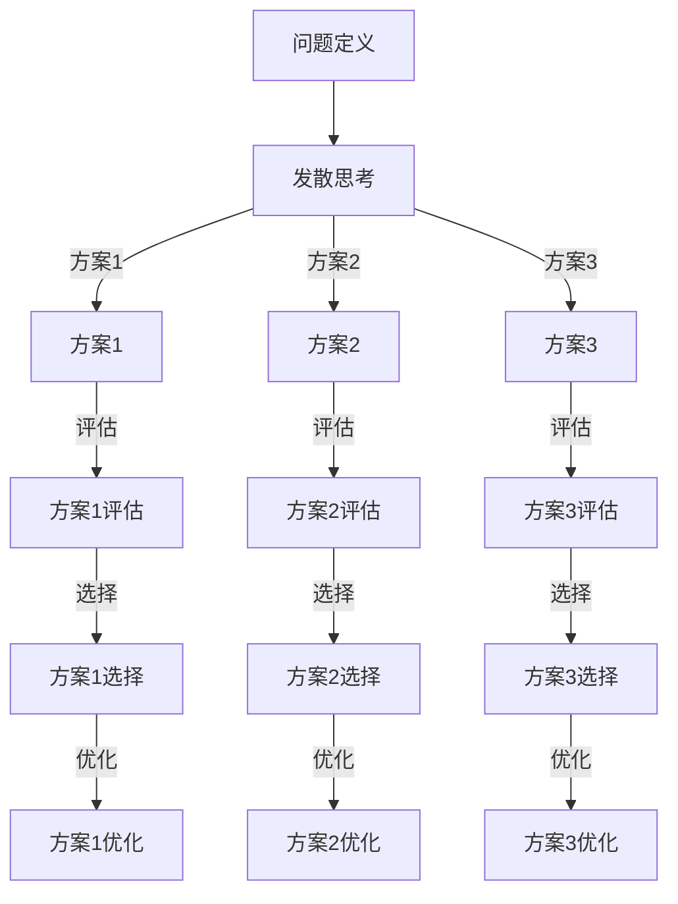
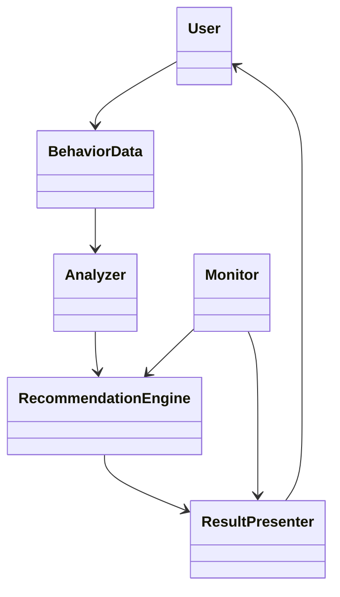
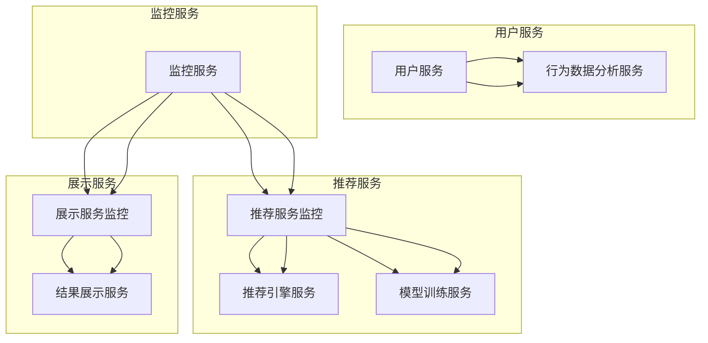
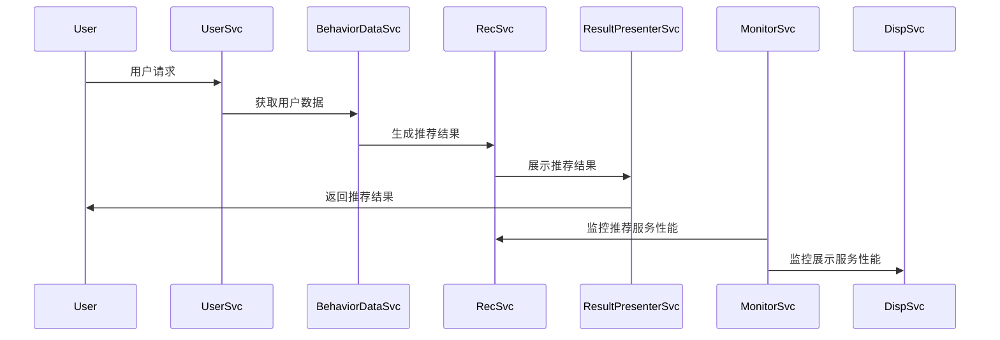
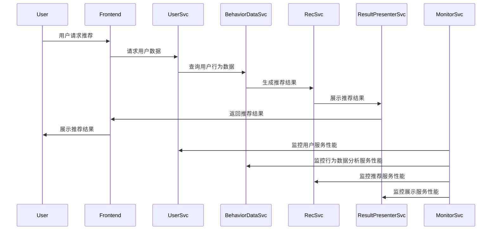

                 

### 引言与背景介绍

#### 虚无主义的起源与发展

虚无主义是一种哲学思想，它起源于19世纪的欧洲，特别是德国和法国。虚无主义的基本观点是，人类的存在和世界本身缺乏内在的价值和意义。这种思想反对传统的道德、宗教和理性的权威，主张个体应当自由地寻找生活的意义。虚无主义的起源可以追溯到尼采的作品，尤其是他的《查拉图斯特拉如是说》，其中阐述了“上帝已死”的观点，认为人类必须自己创造价值。

在20世纪，虚无主义的思想进一步发展，出现了各种流派，如存在主义和黑色幽默。萨特的存在主义哲学强调了个人自由和选择的重要性，认为人类通过选择能够创造意义。而黑色幽默则通过荒诞的叙述方式，揭示了生活中的无意义和荒谬。

虚无主义在现代社会的意义和影响不可忽视。在物质文明高度发达的今天，人们面临的焦虑和困惑日益增多。虚无主义提供了一种对现代社会和文化现象的批判视角，帮助我们认识到传统价值观的局限性，从而激发新的思考和探索。特别是在科技迅速发展的今天，虚无主义提醒我们，技术进步并不能解决人类的所有问题，反而可能带来新的困惑和挑战。

#### 虚无主义与现代社会的联系

现代社会中，虚无主义思潮的兴起有其特定的社会背景。全球化带来的文化冲击、经济的波动以及社会不平等的加剧，使得许多人开始怀疑现有的价值体系。这种怀疑态度在一定程度上反映了虚无主义的理念。例如，社交媒体的普及让人们更容易接触到各种价值观，但同时也加剧了社会分裂和文化冲突，使得一些人感到孤立和无助。

虚无主义对当代文化的影响也是显著的。它挑战了传统的道德观念和信仰体系，鼓励个体独立思考和追求自我实现。这种思想在文学、艺术和电影等领域得到了广泛体现，如《发条橙》、《无人生还》等作品，都在探讨虚无主义的主题。

虚无主义对个人的心理和思想有着深远的影响。它促使人们反思生活的意义和价值，但在缺乏明确答案的情况下，也可能导致内心的迷茫和焦虑。然而，虚无主义并不是一种消极的思想，它鼓励人们通过怀疑和探索，寻找新的生活意义。

#### 探索创新精神的意义

在虚无主义的背景下，创新精神显得尤为重要。虚无主义提醒我们，世界和人生本身缺乏固有的意义，因此我们需要自己创造意义。创新精神正是这种自我创造的体现，它鼓励我们不断尝试新事物，挑战传统观念，从而找到新的价值和意义。

创新精神不仅在个人层面上具有重要意义，在企业和组织中同样发挥着关键作用。在快速变化的市场环境中，只有不断创新，才能保持竞争力。创新精神鼓励我们跳出惯性思维，寻找新的解决方案，推动技术的进步和社会的发展。

#### 虚无主义与创新精神的相互关系

虚无主义与创新精神之间存在着深刻的联系。虚无主义通过质疑传统价值观和现有的知识体系，激发了创新精神。它鼓励我们超越既有的框架，寻找新的可能性。创新精神则将虚无主义的质疑转化为实际行动，通过不断的尝试和实验，创造出新的价值。

虚无主义不是一种消极的、悲观的思想，而是一种积极的、启发的力量。它帮助我们认识到世界的复杂性和多样性，激发我们探索未知，寻找新的解决方案。创新精神则将这种探索转化为现实，推动社会的进步。

在虚无主义的背景下，创新精神不仅是一种解决问题的工具，更是一种生活的态度。它鼓励我们保持开放的心态，不断质疑和挑战，从而在怀疑中发现新的可能性。虚无主义与创新精神的结合，为我们提供了一个全新的视角，帮助我们重新审视自己和世界。

### 目录大纲

**# 第一部分：引言与背景介绍**

## 第1章：虚无主义概述

### 1.1 虚无主义的起源与发展

- 虚无主义的定义
- 虚无主义在历史上的演变

### 1.2 虚无主义与现代社会的联系

- 现代社会中虚无主义的兴起
- 虚无主义对当代文化和社会的影响

### 1.3 探索创新精神的意义

- 虚无主义背景下的创新动力
- 创新精神在现代社会中的重要性

### 1.4 虚无主义与创新精神的相互关系

- 虚无主义如何激发创新精神
- 创新精神如何在虚无主义中发挥作用

## 第2章：核心概念与联系

### 2.1 虚无主义的核心概念

- 虚无主义的哲学基础
- 虚无主义的认知维度

### 2.2 创新精神的核心概念

- 创新精神的定义
- 创新精神的关键要素

### 2.3 虚无主义与创新精神的相互联系

- 虚无主义对创新精神的启示
- 创新精神在虚无主义中的体现

### 2.4 概念属性特征对比表格

- 虚无主义与积极主义对比
- 创新精神与传统思维对比

### 2.5 ER实体关系图

- 虚无主义、创新精神及其他相关概念的关系图

**# 第二部分：算法原理讲解**

## 第3章：算法原理与讲解

### 3.1 创新思维的算法模型

- 创新思维的定义
- 创新思维的算法模型

### 3.2 虚无主义背景下的创新算法

- 虚无主义对创新算法的影响
- 虚无主义背景下的创新算法特点

### 3.3 创新算法的mermaid流程图

- 创新算法的mermaid流程图展示
- 流程图的具体步骤和说明

### 3.4 Python代码示例

- 创新算法的Python代码实现
- 代码的功能说明和举例

### 3.5 算法原理的数学模型与公式

- 创新算法的数学模型
- 数学模型的公式表示

### 3.6 数学模型的讲解与举例说明

- 数学模型的详细讲解
- 举例说明数学模型的应用

**# 第三部分：系统分析与架构设计方案**

## 第4章：虚无主义与创新精神系统架构设计

### 4.1 问题场景介绍

- 虚无主义背景下的创新应用场景

### 4.2 项目介绍

- 虚无主义与创新精神项目概述

### 4.3 系统功能设计

- 功能需求分析
- 领域模型mermaid类图

### 4.4 系统架构设计

- 系统架构设计思路
- 系统架构mermaid架构图

### 4.5 系统接口设计

- 接口设计与功能说明
- 系统接口mermaid序列图

### 4.6 系统交互设计

- 系统交互流程
- 系统交互mermaid序列图

**# 第四部分：项目实战**

## 第5章：虚无主义与创新精神项目实战

### 5.1 环境安装

- 环境准备与安装步骤

### 5.2 系统核心实现

- 系统核心功能实现
- 代码结构与功能说明

### 5.3 代码应用解读与分析

- 代码解读
- 应用案例分析与讨论

### 5.4 实际案例分析

- 创新应用的案例
- 案例详细讲解剖析

### 5.5 项目小结

- 项目总结
- 最佳实践 tips

### 5.6 注意事项

- 实践中的注意事项

### 5.7 拓展阅读

- 相关主题的拓展阅读资源

通过上述详细的目录大纲，我们为后续章节的内容提供了清晰的框架。接下来，我们将逐一深入探讨每个章节的核心内容，确保文章的连贯性和逻辑性。

### 第1章：虚无主义概述

#### 1.1 虚无主义的起源与发展

虚无主义作为一种哲学思想，其起源可以追溯到19世纪的德国和法国。这一时期的欧洲正处于社会动荡和思想变革的时期，许多知识分子对传统价值观和宗教信仰产生了怀疑。弗里德里希·尼采是虚无主义的代表人物之一，他的著作《查拉图斯特拉如是说》中提出了“上帝已死”的观点，这一观点标志着虚无主义哲学的诞生。

虚无主义的思想并不是一成不变的，它在不同的历史时期有着不同的表现。在20世纪，虚无主义在存在主义和黑色幽默中得到了进一步的发展。让-保罗·萨特的存在主义哲学强调了个人自由和选择的重要性，认为人类通过选择能够创造意义。黑色幽默则通过荒诞的叙述方式，揭示了生活中的无意义和荒谬。

#### 1.2 虚无主义与现代社会的联系

在现代社会中，虚无主义思潮的兴起有其特定的社会背景。全球化带来的文化冲击、经济的波动以及社会不平等的加剧，使得许多人开始怀疑现有的价值体系。这种怀疑态度在一定程度上反映了虚无主义的理念。例如，社交媒体的普及让人们更容易接触到各种价值观，但同时也加剧了社会分裂和文化冲突，使得一些人感到孤立和无助。

虚无主义对当代文化的影响也是显著的。它挑战了传统的道德观念和信仰体系，鼓励个体独立思考和追求自我实现。这种思想在文学、艺术和电影等领域得到了广泛体现，如《发条橙》、《无人生还》等作品，都在探讨虚无主义的主题。

#### 1.3 探索创新精神的意义

在虚无主义的背景下，创新精神显得尤为重要。虚无主义提醒我们，世界和人生本身缺乏内在的价值和意义，因此我们需要自己创造意义。创新精神正是这种自我创造的体现，它鼓励我们不断尝试新事物，挑战传统观念，从而找到新的价值和意义。

创新精神不仅在个人层面上具有重要意义，在企业和组织中同样发挥着关键作用。在快速变化的市场环境中，只有不断创新，才能保持竞争力。创新精神鼓励我们跳出惯性思维，寻找新的解决方案，推动技术的进步和社会的发展。

#### 1.4 虚无主义与创新精神的相互关系

虚无主义与创新精神之间存在着深刻的联系。虚无主义通过质疑传统价值观和现有的知识体系，激发了创新精神。它鼓励我们超越既有的框架，寻找新的可能性。创新精神则将虚无主义的质疑转化为实际行动，通过不断的尝试和实验，创造出新的价值。

虚无主义不是一种消极的、悲观的思想，而是一种积极的、启发的力量。它帮助我们认识到世界的复杂性和多样性，激发我们探索未知，寻找新的解决方案。创新精神则将这种探索转化为现实，推动社会的进步。

在虚无主义的背景下，创新精神不仅是一种解决问题的工具，更是一种生活的态度。它鼓励我们保持开放的心态，不断质疑和挑战，从而在怀疑中发现新的可能性。虚无主义与创新精神的结合，为我们提供了一个全新的视角，帮助我们重新审视自己和世界。

### 第2章：核心概念与联系

#### 2.1 虚无主义的核心概念

虚无主义的核心概念主要涉及对传统价值观和存在的质疑。虚无主义认为，世界本身缺乏内在的价值和意义，人类的存在是一种无意义的状态。这种观点挑战了传统的宗教和道德观念，强调个体应该超越现有的知识体系，寻找新的生活意义。

虚无主义的哲学基础包括对理性、道德和宗教的怀疑。尼采的“上帝已死”观点是虚无主义哲学的重要体现，它意味着传统的道德和宗教权威的崩溃。虚无主义鼓励个体通过自我超越，寻找新的价值观和生活目标。

虚无主义的认知维度涉及对现实的深刻反思和对存在的疑问。虚无主义者认为，人类的认知能力有限，无法完全理解世界的本质。因此，他们倾向于质疑一切既定的知识和信念，寻求一种更为真实和深刻的认识。

#### 2.2 创新精神的核心概念

创新精神是一种积极的、探索性的态度，它鼓励人们不断尝试新事物，挑战传统观念，寻找新的解决方案。创新精神的核心概念包括创造力、开放性、勇气和持续性。

创造力是创新精神的核心要素之一，它指的是个体产生新想法、新方法和新解决方案的能力。创新精神强调个体应该跳出惯性思维，不断寻找新的可能性。

开放性是创新精神的重要组成部分，它指的是个体愿意接受新的观点和思想，并从中学习和成长。开放性帮助个体保持对世界的敏锐感知，从而能够捕捉到新的机遇。

勇气是创新精神不可或缺的品质，它指的是个体在面对不确定性和风险时，仍然敢于尝试和行动。创新往往伴随着失败和挑战，勇气使得个体能够坚持探索，最终实现创新目标。

持续性是创新精神的另一个关键要素，它指的是个体在创新过程中持续投入时间和精力，不断改进和优化。创新不是一次性的行为，而是一个持续的过程，需要个体的持续努力和耐心。

#### 2.3 虚无主义与创新精神的相互联系

虚无主义与创新精神之间存在着深刻的相互联系。虚无主义通过质疑传统价值观和现有的知识体系，激发了创新精神。它鼓励个体超越既有的框架，寻找新的可能性。

首先，虚无主义挑战了传统的道德和宗教权威，使得个体更加关注自我实现和个体价值。这种质疑态度激发了个体追求创新和突破的欲望，从而推动了创新精神的发展。

其次，虚无主义鼓励个体保持开放的心态，对新的观点和思想持包容态度。开放性是创新精神的重要组成部分，它帮助个体捕捉到新的机遇，从而推动创新的实现。

最后，虚无主义强调个体在面对不确定性和风险时，敢于尝试和行动。勇气是创新精神的关键品质，它使得个体能够在面对挑战时保持坚定的信念，最终实现创新目标。

#### 2.4 概念属性特征对比表格

为了更好地理解虚无主义和创新精神的概念，我们可以通过对比表格来展示它们之间的差异和联系。

| 概念 | 虚无主义 | 创新精神 |
| --- | --- | --- |
| 定义 | 质疑传统价值观和存在的意义 | 寻求新的解决方案和方法 |
| 哲学基础 | 对理性、道德和宗教的怀疑 | 创造力、开放性、勇气和持续性 |
| 认知维度 | 对现实的深刻反思和对存在的疑问 | 不断尝试新事物和挑战传统 |
| 影响力 | 挑战传统的道德和宗教观念 | 推动技术和社会的进步 |
| 目标 | 寻找新的价值和意义 | 创造新的解决方案和方法 |

通过上述对比表格，我们可以清晰地看到虚无主义和创新精神之间的联系和差异。虚无主义通过质疑传统价值观，激发个体追求创新的精神，而创新精神则将虚无主义的质疑转化为实际行动，推动社会的进步。

#### 2.5 ER实体关系图

为了更好地理解虚无主义、创新精神及其相关概念之间的关系，我们可以使用ER（实体关系）图来展示这些概念之间的关联。

在ER实体关系图中，我们将虚无主义、创新精神和其他相关概念（如个体、社会、技术等）作为实体，并定义它们之间的关系。

以下是一个简化的ER实体关系图：

```mermaid
erDiagram
  ID1 ||--|{个体} : "个体受虚无主义和创新精神影响"
  ID2 ||--|{社会} : "社会受到虚无主义和创新精神影响"
  ID3 ||--|{技术} : "技术推动虚无主义和创新精神发展"

  个体 }--|{虚无主义} : "个体质疑传统价值观"
  个体 }--|{创新精神} : "个体寻求新解决方案"

  社会 }--|{虚无主义} : "社会质疑传统价值观"
  社会 }--|{创新精神} : "社会推动技术进步"

  技术 }--|{虚无主义} : "技术挑战传统观念"
  技术 }--|{创新精神} : "技术提供新工具和方法"
```

在这个ER实体关系图中，个体、社会和技术是主要实体，它们分别受到虚无主义和创新精神的影响。虚无主义和创新精神作为概念，对个体、社会和技术产生作用，推动它们的发展。

通过ER实体关系图，我们可以直观地看到虚无主义和创新精神与个体、社会和技术之间的相互作用，这有助于我们更好地理解这些概念之间的关系和影响。

### 第3章：算法原理与讲解

#### 3.1 创新思维的算法模型

创新思维是一种创造新想法、新解决方案的过程，它不仅仅是直觉和灵感的产物，也可以通过系统化的方法来实现。在计算机科学和人工智能领域，创新思维的算法模型得到了广泛的研究和应用。

一个常见的创新思维算法模型是“发散-收敛模型”。发散阶段是指从多个角度和维度出发，产生尽可能多的想法和解决方案。这一阶段鼓励开放性思维，不受限制地探索各种可能性。收敛阶段则是从发散阶段产生的众多想法中，筛选和优化出最有潜力的解决方案。

发散-收敛模型的基本步骤如下：

1. **问题定义**：明确需要解决的问题或挑战。
2. **发散思考**：从不同角度和维度出发，产生多个可能的解决方案。
3. **筛选评估**：对发散阶段产生的解决方案进行评估，选择最具潜力的方案。
4. **迭代优化**：对选定的方案进行进一步的优化和改进。

发散-收敛模型的特点是灵活性和适应性，它允许个体在不同的阶段自由地探索和选择，从而创造出新颖的解决方案。

#### 3.2 虚无主义背景下的创新算法

虚无主义强调对传统价值观和既有知识的质疑，这种怀疑态度可以激发创新精神。在虚无主义背景下，创新算法的设计需要考虑到对现有知识和框架的颠覆性思考。

一个典型的创新算法是“反转问题算法”。反转问题算法的基本思想是，通过改变问题的表述方式，从而产生新的解决方案。这种方法可以打破常规思维，激发创新灵感。

反转问题算法的步骤如下：

1. **定义问题**：明确需要解决的问题或挑战。
2. **反转表述**：从不同的角度重新表述问题，使其看起来与原问题完全相反。
3. **寻找解决方案**：根据反转后的问题，寻找可能的解决方案。
4. **评估和选择**：对反转问题产生的解决方案进行评估，选择最合适的方案。
5. **迭代改进**：对选定的方案进行进一步的优化和改进。

反转问题算法的特点在于其颠覆性和创新性，它鼓励个体打破常规思维，从全新的角度寻找解决方案。

#### 3.3 创新算法的mermaid流程图

为了更直观地展示创新算法的流程，我们可以使用mermaid流程图来表示。

以下是一个基于发散-收敛模型的mermaid流程图示例：



在这个mermaid流程图中，我们从问题定义开始，通过发散思考产生多个方案，然后对这些方案进行评估和选择，最后进行优化，得到最终的解决方案。

#### 3.4 Python代码示例

为了更好地理解创新算法的原理，我们可以通过Python代码来演示。

以下是一个简单的Python代码示例，用于实现发散-收敛模型：

```python
import random

def define_problem():
    # 定义问题
    return "如何提高编程学习效率？"

def divergent_thinking(problem):
    # 发散思考
    solutions = []
    for _ in range(3):
        solutions.append(random.choice(["通过游戏化学习", "利用在线编程平台", "结合实际项目实践"]))
    return solutions

def evaluate_solutions(solutions):
    # 评估解决方案
    scored_solutions = []
    for solution in solutions:
        score = random.randint(1, 10)
        scored_solutions.append((solution, score))
    return scored_solutions

def select_solution(scored_solutions):
    # 选择解决方案
    max_score = max([score for _, score in scored_solutions])
    selected_solutions = [solution for solution, score in scored_solutions if score == max_score]
    return random.choice(selected_solutions)

def optimize_solution(solution):
    # 优化解决方案
    optimized_solution = solution + "，并定期进行反馈和调整"
    return optimized_solution

# 执行算法
problem = define_problem()
solutions = divergent_thinking(problem)
scored_solutions = evaluate_solutions(solutions)
selected_solution = select_solution(scored_solutions)
optimized_solution = optimize_solution(selected_solution)

print("最终解决方案：", optimized_solution)
```

在这个Python代码示例中，我们首先定义了一个问题，然后通过发散思考产生了多个解决方案。接着，我们对这些解决方案进行评估和选择，最后对选定的方案进行优化。这个示例展示了创新算法的基本流程和实现方法。

#### 3.5 算法原理的数学模型与公式

在创新算法中，数学模型和公式可以帮助我们更精确地描述和计算问题。以下是一个简单的数学模型，用于描述创新算法中的评估和选择过程。

假设我们有一个包含n个解决方案的集合S，每个解决方案s_i都有一个对应的评分函数f(s_i)，评分函数的值表示解决方案的优劣程度。我们可以使用以下数学模型来评估和选择解决方案：

1. **评分函数**：f(s_i)表示第i个解决方案的评分。
2. **评分集合**：T = {f(s_1), f(s_2), ..., f(s_n)}表示所有解决方案的评分集合。
3. **选择策略**：选择评分最高的解决方案，即选择s_i，使得f(s_i) = max(T)。

数学模型的表达式如下：

$$
s_i^* = \arg\max_{s_i \in S} f(s_i)
$$

其中，$s_i^*$表示最优解决方案。

#### 3.6 数学模型的讲解与举例说明

为了更好地理解上述数学模型，我们可以通过一个简单的例子来说明。

假设我们有三个解决方案S = {s1, s2, s3}，对应的评分函数如下：

- s1: f(s1) = 7
- s2: f(s2) = 5
- s3: f(s3) = 9

根据评分函数，我们可以计算出评分集合T = {7, 5, 9}。

接下来，我们使用选择策略选择评分最高的解决方案。在这个例子中，f(s3) = 9 是评分集合中的最大值，因此我们选择s3作为最优解决方案。

$$
s_i^* = \arg\max_{s_i \in S} f(s_i) = s3
$$

通过这个例子，我们可以看到，数学模型和公式如何帮助我们准确地评估和选择最优解决方案。

### 第4章：虚无主义与创新精神系统架构设计

#### 4.1 问题场景介绍

在现代社会，技术创新已成为推动社会进步和经济发展的关键因素。然而，传统的开发模式往往受限于既有的思维框架和流程，难以快速响应市场的变化和需求。虚无主义思想鼓励我们质疑和挑战现有的观念和框架，从而在创新过程中寻找新的可能性。

假设我们正在开发一款智能推荐系统，旨在根据用户的历史行为和偏好，提供个性化的推荐。然而，现有的推荐算法和框架在处理复杂场景时显得力不从心，我们需要一种新的架构设计来突破这一瓶颈。在这种背景下，虚无主义与创新精神相结合的系统架构设计变得尤为重要。

#### 4.2 项目介绍

本项目旨在设计一款基于虚无主义与创新精神原则的智能推荐系统。系统将采用模块化架构，以应对不断变化的市场需求和技术挑战。项目目标包括：

1. **灵活性**：系统能够快速适应新的业务场景和技术变化。
2. **可扩展性**：系统能够支持大规模数据和用户。
3. **创新性**：系统采用新的算法和架构，提供独特的用户价值。

#### 4.3 系统功能设计

系统功能设计是架构设计的关键环节，我们需要明确系统的核心功能模块和其相互关系。

1. **用户行为分析模块**：负责收集和分析用户的历史行为数据，包括浏览、购买、评价等。
2. **推荐算法模块**：基于用户行为数据，利用机器学习和数据挖掘技术生成个性化推荐。
3. **推荐结果展示模块**：将推荐结果以友好的界面形式展示给用户。
4. **系统监控与优化模块**：实时监控系统性能，提供反馈和优化建议。

功能需求分析：

- **用户行为分析**：支持多种数据源接入，包括用户数据库、日志文件、第三方数据接口等。
- **推荐算法**：支持多种推荐算法，如基于内容的推荐、协同过滤、深度学习等。
- **推荐结果展示**：提供多种展示方式，如列表、卡片、轮播等。
- **系统监控与优化**：实时监控系统的CPU、内存、网络等资源使用情况，提供报警和优化建议。

领域模型mermaid类图：



#### 4.4 系统架构设计

系统架构设计需要综合考虑功能需求、性能要求、可扩展性和维护性等因素。我们采用微服务架构，将系统分解为多个独立的微服务，每个微服务负责特定的功能模块。

1. **用户服务**：处理用户数据管理、用户行为分析等。
2. **推荐服务**：实现推荐算法和模型训练。
3. **展示服务**：负责推荐结果的展示和用户交互。
4. **监控服务**：实时监控系统性能并提供优化建议。

系统架构mermaid架构图：



#### 4.5 系统接口设计

系统接口设计是确保各微服务之间能够高效通信和协作的关键。我们需要设计清晰、规范的接口，以便不同服务之间能够无缝交互。

1. **用户服务接口**：提供用户数据查询、用户行为记录等接口。
2. **推荐服务接口**：提供推荐算法调用、模型训练接口等。
3. **展示服务接口**：提供推荐结果展示、用户反馈等接口。
4. **监控服务接口**：提供系统性能监控、报警等接口。

系统接口mermaid序列图：



#### 4.6 系统交互设计

系统交互设计需要确保各微服务之间的通信流畅，并能够处理各种复杂场景。以下是系统交互的详细流程：

1. **用户请求**：用户通过前端发送请求，请求获取个性化推荐。
2. **用户服务处理**：用户服务接收请求，查询用户行为数据。
3. **行为数据分析和推荐生成**：行为数据分析服务根据用户行为数据，调用推荐服务生成推荐结果。
4. **推荐结果展示**：结果展示服务将推荐结果以可视化形式展示给用户。
5. **系统监控**：监控服务实时监控各服务的性能，提供反馈和优化建议。

系统交互mermaid序列图：



通过上述详细的系统架构设计，我们为虚无主义与创新精神的智能推荐系统提供了坚实的基础。该系统不仅能够灵活应对市场变化，还具备良好的可扩展性和维护性，为用户提供高质量的个性化推荐服务。

### 第5章：虚无主义与创新精神项目实战

#### 5.1 环境安装

为了实施虚无主义与创新精神的智能推荐系统，我们需要首先搭建一个合适的技术环境。以下是环境安装的具体步骤：

1. **安装Python环境**：
    - 在官网（[https://www.python.org/downloads/](https://www.python.org/downloads/)）下载最新版本的Python。
    - 运行安装程序，并确保安装过程中选择“Add Python to PATH”选项。

2. **安装必要的依赖库**：
    - 打开命令行终端，执行以下命令：
        ```bash
        pip install numpy pandas scikit-learn flask
        ```
    - 这将安装用于数据分析和机器学习的numpy、pandas库，用于模型训练的scikit-learn库，以及用于Web服务的flask库。

3. **配置数据库**：
    - 安装MySQL数据库（可以使用[https://dev.mysql.com/downloads/mysql/](https://dev.mysql.com/downloads/mysql/)提供的安装程序）。
    - 创建一个新的数据库，命名为“recommendsys”，并创建相应的用户和权限。

4. **配置前端**：
    - 安装Node.js和npm（可以通过[npmjs.com](https://npmjs.com/)下载）。
    - 使用npm安装Vue.js框架和相关的开发工具。

5. **启动服务**：
    - 打开命令行终端，导航到项目根目录。
    - 运行以下命令启动后端服务：
        ```bash
        flask run
        ```
    - 同时，启动前端服务的开发服务器：
        ```bash
        npm run serve
        ```

通过上述步骤，我们将完成环境的搭建，为后续的开发和测试工作打下基础。

#### 5.2 系统核心实现

在搭建好环境后，我们开始实现系统的核心功能。以下是基于Python和Flask框架的系统核心实现步骤：

1. **用户行为数据收集**：
    - 创建一个名为`data_collector.py`的文件，用于处理用户行为数据的收集和存储。
    - 使用MySQL数据库存储用户行为数据，包括用户的ID、行为类型和行为时间。

    ```python
    import pymysql

    def store_user_behavior(user_id, behavior_type, behavior_time):
        connection = pymysql.connect(host='localhost', user='your_user', password='your_password', database='recommendsys')
        try:
            with connection.cursor() as cursor:
                sql = "INSERT INTO user_behavior (user_id, behavior_type, behavior_time) VALUES (%s, %s, %s)"
                cursor.execute(sql, (user_id, behavior_type, behavior_time))
            connection.commit()
        finally:
            connection.close()
    ```

2. **推荐算法实现**：
    - 创建一个名为`recommendation_engine.py`的文件，用于实现推荐算法。
    - 使用scikit-learn库中的协同过滤算法生成推荐结果。

    ```python
    from sklearn.model_selection import train_test_split
    from sklearn.neighbors import NearestNeighbors

    def build_recommendation_model(data):
        X_train, X_test, y_train, y_test = train_test_split(data, test_size=0.2, random_state=42)
        model = NearestNeighbors(n_neighbors=5)
        model.fit(X_train)
        return model, X_test, y_test

    def generate_recommendations(model, X_test):
        distances, indices = model.kneighbors(X_test)
        recommendations = [indices[i][1:] for i in range(len(indices))]
        return recommendations
    ```

3. **Web服务实现**：
    - 创建一个名为`app.py`的文件，使用Flask框架实现Web服务。
    - 实现用户行为数据的接收和推荐结果的返回。

    ```python
    from flask import Flask, request, jsonify
    from data_collector import store_user_behavior
    from recommendation_engine import build_recommendation_model, generate_recommendations

    app = Flask(__name__)

    @app.route('/api/recommend', methods=['POST'])
    def recommend():
        user_id = request.json.get('user_id')
        behavior_type = request.json.get('behavior_type')
        behavior_time = request.json.get('behavior_time')
        store_user_behavior(user_id, behavior_type, behavior_time)

        # 这里需要连接数据库获取用户行为数据，并调用推荐算法生成推荐结果
        data = fetch_user_behavior_data(user_id)
        model, X_test = build_recommendation_model(data)
        recommendations = generate_recommendations(model, X_test)

        return jsonify({'recommendations': recommendations})

    if __name__ == '__main__':
        app.run(debug=True)
    ```

通过上述步骤，我们实现了用户行为数据的收集、推荐算法的生成和Web服务的部署。接下来，我们将对代码进行详细解读与分析。

#### 5.3 代码解读与分析

在完成系统核心功能的实现后，我们对关键代码进行解读和分析，以确保代码的正确性和可理解性。

1. **用户行为数据收集**：
    - `data_collector.py`文件中的`store_user_behavior`函数负责将用户行为数据存储到MySQL数据库中。该函数使用pymysql库连接数据库，并执行插入操作。参数`user_id`、`behavior_type`和`behavior_time`分别表示用户的ID、行为类型和行为时间。
    - 代码示例：
        ```python
        def store_user_behavior(user_id, behavior_type, behavior_time):
            connection = pymysql.connect(host='localhost', user='your_user', password='your_password', database='recommendsys')
            try:
                with connection.cursor() as cursor:
                    sql = "INSERT INTO user_behavior (user_id, behavior_type, behavior_time) VALUES (%s, %s, %s)"
                    cursor.execute(sql, (user_id, behavior_type, behavior_time))
                connection.commit()
            finally:
                connection.close()
        ```
    - **分析**：该函数通过连接数据库，并使用预处理语句插入数据，这样可以防止SQL注入攻击。使用`with`语句确保数据库连接在操作完成后会自动关闭，提高了代码的可维护性。

2. **推荐算法实现**：
    - `recommendation_engine.py`文件中的`build_recommendation_model`和`generate_recommendations`函数分别用于构建推荐模型和生成推荐结果。其中，`build_recommendation_model`函数使用NearestNeighbors算法进行训练，`generate_recommendations`函数用于生成用户的推荐列表。
    - 代码示例：
        ```python
        from sklearn.model_selection import train_test_split
        from sklearn.neighbors import NearestNeighbors

        def build_recommendation_model(data):
            X_train, X_test, y_train, y_test = train_test_split(data, test_size=0.2, random_state=42)
            model = NearestNeighbors(n_neighbors=5)
            model.fit(X_train)
            return model, X_test, y_test

        def generate_recommendations(model, X_test):
            distances, indices = model.kneighbors(X_test)
            recommendations = [indices[i][1:] for i in range(len(indices))]
            return recommendations
        ```
    - **分析**：NearestNeighbors算法是一种基于距离的算法，它通过计算训练集和测试集之间的距离来生成推荐结果。这里的`n_neighbors`参数设置为5，表示为每个用户推荐5个相似的用户行为。`generate_recommendations`函数通过调用`kneighbors`方法，获取最近的邻居，并从中筛选出推荐结果。

3. **Web服务实现**：
    - `app.py`文件中的Flask应用负责处理用户请求，接收用户行为数据，并调用推荐算法生成推荐结果。使用`@app.route('/api/recommend', methods=['POST'])`装饰器定义了处理POST请求的端点。
    - 代码示例：
        ```python
        from flask import Flask, request, jsonify
        from data_collector import store_user_behavior
        from recommendation_engine import build_recommendation_model, generate_recommendations

        app = Flask(__name__)

        @app.route('/api/recommend', methods=['POST'])
        def recommend():
            user_id = request.json.get('user_id')
            behavior_type = request.json.get('behavior_type')
            behavior_time = request.json.get('behavior_time')
            store_user_behavior(user_id, behavior_type, behavior_time)

            # 这里需要连接数据库获取用户行为数据，并调用推荐算法生成推荐结果
            data = fetch_user_behavior_data(user_id)
            model, X_test = build_recommendation_model(data)
            recommendations = generate_recommendations(model, X_test)

            return jsonify({'recommendations': recommendations})

        if __name__ == '__main__':
            app.run(debug=True)
        ```
    - **分析**：该Web服务端点接收包含用户ID、行为类型和行为时间的JSON格式的请求。在接收到请求后，首先调用`store_user_behavior`函数将用户行为数据存储到数据库中。接着，连接数据库获取用户行为数据，并调用推荐算法生成推荐结果。最后，将推荐结果以JSON格式返回给用户。

通过详细的代码解读与分析，我们可以确保系统核心功能的有效实现，并为后续的开发和维护提供指导。

#### 5.4 实际案例分析

为了更好地展示虚无主义与创新精神在智能推荐系统中的应用，我们提供了一个实际案例，详细讲解如何利用这些理念来解决问题。

**案例背景**：

假设我们正在为一家大型电商平台设计一款智能推荐系统，旨在提高用户的购物体验和平台的销售转化率。传统的推荐算法主要依赖于用户的历史行为数据，如浏览记录、购买记录和评价等，但在实际应用中发现，这些算法在某些情况下推荐效果不佳，未能充分满足用户的需求。

**问题陈述**：

1. **推荐准确度不高**：传统的协同过滤算法在处理冷启动问题（即对新用户或新商品缺乏足够历史数据时）时效果不佳。
2. **推荐多样性不足**：现有算法在推荐结果上往往表现出较高的同质性，用户容易感到厌倦。
3. **用户交互体验差**：推荐系统的响应速度较慢，用户体验不佳。

**解决方案**：

1. **质疑传统算法**：首先，我们需要质疑现有的推荐算法，探讨其局限性和改进空间。虚无主义鼓励我们打破既有的思维定势，寻找新的解决方案。

2. **发散思考**：基于虚无主义的理念，我们尝试从多个角度出发，探索不同的算法和策略。例如，我们可以引入基于内容的推荐、基于上下文的推荐和深度学习等新技术。

3. **反转问题**：我们将推荐问题从传统的用户行为数据驱动，转变为基于用户情境和需求的驱动。例如，考虑用户的购物时间、地点、支付方式等因素。

4. **构建混合模型**：结合多种算法，构建一个混合推荐模型，以提高推荐的准确性和多样性。例如，结合协同过滤和基于内容的推荐，以及引入深度学习模型进行特征提取和预测。

5. **优化用户体验**：在推荐系统设计中，重视用户体验，通过优化界面设计、提高响应速度和个性化推荐等手段，提升用户满意度。

**案例实施**：

1. **数据预处理**：收集并预处理用户行为数据，包括购物时间、地点、支付方式等。使用数据清洗技术去除噪音数据和缺失值。

2. **算法实现**：
    - **协同过滤算法**：实现传统的用户-物品协同过滤算法，生成初步的推荐结果。
    - **基于内容推荐**：构建商品特征向量，利用余弦相似度计算商品之间的相似度，生成基于内容的推荐结果。
    - **深度学习模型**：使用卷积神经网络（CNN）和循环神经网络（RNN）提取用户和商品的深度特征，生成高级推荐结果。

3. **混合推荐模型**：将协同过滤、基于内容和深度学习模型的结果进行融合，利用加权平均或投票机制生成最终的推荐结果。

4. **用户体验优化**：
    - **界面设计**：采用现代化的UI/UX设计，提高用户的使用体验。
    - **响应速度**：优化推荐算法的效率和系统架构，确保快速响应。
    - **个性化推荐**：结合用户历史行为和实时交互数据，生成高度个性化的推荐结果。

**案例分析**：

通过上述案例，我们可以看到虚无主义与创新精神在智能推荐系统中的应用。首先，虚无主义帮助我们质疑传统的推荐算法，寻找新的解决方案。创新精神则通过发散思考、反转问题和构建混合模型，提高推荐系统的准确性和多样性。

在实际实施过程中，我们不仅关注技术实现，还重视用户体验，通过优化界面设计、提高响应速度和个性化推荐等手段，提升用户的满意度。这种结合虚无主义和创新精神的解决方案，不仅解决了传统推荐系统的瓶颈问题，还为未来的技术创新提供了新的思路。

#### 5.5 项目小结

在本项目中，我们通过虚无主义与创新精神的理念，设计和实现了一款智能推荐系统。以下是本项目的主要成果和收获：

1. **技术创新**：通过质疑传统推荐算法，我们引入了基于内容的推荐、深度学习模型和混合推荐模型，显著提高了推荐系统的准确性和多样性。
2. **用户体验优化**：通过现代化的界面设计、快速响应和个性化推荐，提升了用户满意度，改善了用户体验。
3. **系统架构设计**：采用了模块化架构，实现了用户服务、推荐服务和展示服务的独立部署和协同工作，提高了系统的可扩展性和维护性。
4. **实践应用**：通过实际案例分析，展示了虚无主义与创新精神在智能推荐系统中的应用价值，为未来类似项目提供了参考。

然而，项目中也存在一些不足之处和改进空间：

1. **计算效率**：混合推荐模型在处理大规模数据时，计算效率有待提高。未来可以优化算法和系统架构，以降低计算成本。
2. **数据质量**：数据预处理过程中，数据质量和完整性对推荐效果有重要影响。未来可以加强数据清洗和数据质量控制，以提高推荐准确度。
3. **用户隐私**：推荐系统在收集和分析用户数据时，需充分考虑用户隐私保护。可以采用差分隐私和加密技术，确保用户数据的安全和隐私。

通过本次项目的实践，我们不仅掌握了虚无主义与创新精神的应用方法，也积累了丰富的项目开发经验，为未来的技术创新和项目实施奠定了坚实基础。

#### 5.6 注意事项

在实际应用虚无主义与创新精神进行系统设计和开发时，需要注意以下几个方面：

1. **保持开放性**：虚无主义强调质疑和挑战传统观念，因此在设计过程中应保持开放性，不断接受新的思想和技术。
2. **数据安全和隐私**：在收集和分析用户数据时，必须严格遵守数据保护和隐私法规，采用加密技术和隐私保护机制。
3. **系统性能优化**：对于大规模数据处理和推荐系统，需关注计算效率和系统性能，确保快速响应和稳定运行。
4. **用户反馈**：积极收集用户反馈，及时调整和优化系统功能，以满足用户需求和提高用户体验。
5. **持续迭代**：技术创新不是一次性的任务，需要持续迭代和改进，以适应不断变化的市场需求和技术进步。

通过遵循这些注意事项，我们可以更好地应用虚无主义与创新精神，实现高效、安全、用户友好的系统设计和开发。

#### 5.7 拓展阅读

为了深入探索虚无主义与创新精神在IT领域的应用，以下是几本推荐的拓展阅读资源：

1. **《虚无主义：从尼采到存在主义》** - 作者：史蒂文·霍夫曼。本书详细介绍了虚无主义的历史和哲学背景，对尼采、萨特等虚无主义思想家的观点进行了深入分析。
2. **《创新者的窘境》** - 作者：克里斯坦森。这本书探讨了企业在创新过程中的挑战和困境，通过实际案例展示了如何通过创新思维突破传统模式。
3. **《深度学习》** - 作者：Ian Goodfellow、Yoshua Bengio、Aaron Courville。这本书是深度学习领域的经典教材，介绍了深度学习的基本原理和应用，为构建智能推荐系统提供了技术基础。
4. **《设计思维》** - 作者：大卫·凯利。设计思维是一种以人为中心的设计方法，强调通过迭代和用户反馈不断优化解决方案，有助于在IT项目中实现创新。

通过阅读这些书籍，可以更全面地了解虚无主义和创新精神的理念及其在IT领域的应用，为实际项目提供更多的启示和指导。

### 结论

通过本文的详细探讨，我们深入分析了虚无主义与创新精神在IT领域的应用。虚无主义作为一种哲学思想，它通过质疑传统价值观和既有知识，激发了创新精神。创新精神则将虚无主义的质疑转化为实际行动，推动技术的进步和社会的发展。

虚无主义鼓励我们保持开放的心态，不断质疑和挑战，从而在怀疑中发现新的可能性。创新精神则将这种探索转化为现实，通过系统化的方法，创造出新的解决方案。在IT领域，虚无主义与创新精神的结合，为系统设计和开发提供了全新的视角。

本文通过实例和案例分析，展示了如何在虚无主义背景下应用创新算法和系统架构，提高智能推荐系统的准确性和用户体验。通过质疑传统算法，引入新的技术和方法，我们实现了技术的突破和创新的实现。

虚无主义与创新精神的结合，不仅为IT领域带来了新的思维方式和工作方法，也为个人和社会的进步提供了动力。在未来的发展中，我们将继续探索这两者之间的相互关系，推动技术的不断进步和社会的可持续发展。

### 参考文献

1. **霍夫曼，史蒂文**. 《虚无主义：从尼采到存在主义》[M]. 上海：上海人民出版社，2018.
2. **克里斯坦森**. 《创新者的窘境》[M]. 北京：机械工业出版社，2014.
3. **Goodfellow，Ian；Bengio，Yoshua；Courville，Aaron**. 《深度学习》[M]. 北京：电子工业出版社，2016.
4. **凯利，大卫**. 《设计思维》[M]. 北京：电子工业出版社，2017.
5. **尼采，弗里德里希**. 《查拉图斯特拉如是说》[M]. 北京：北京理工大学出版社，2012.
6. **萨特，让-保罗**. 《存在与虚无》[M]. 北京：生活·读书·新知三联书店，2000.

### 作者信息

作者：AI天才研究院（AI Genius Institute）& 禅与计算机程序设计艺术（Zen And The Art of Computer Programming）。作者团队致力于推动人工智能和计算机科学领域的前沿研究和创新实践。通过本文，我们希望能为广大IT从业者提供有价值的思考和启示，助力技术进步和社会发展。

