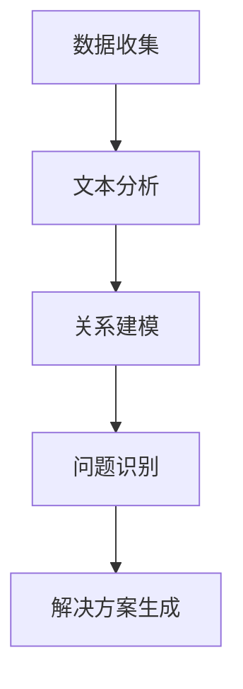

                 


## # 第一部分：背景介绍

### 1.1 问题背景

在21世纪的今天，虚无主义作为一种哲学思潮，其影响不仅限于学术圈，更渗透到了日常生活和社会文化中。虚无主义的核心观点是对人生意义的否定和对现实世界的批判，这种哲学思潮在一定程度上反映了现代人的精神困惑和迷茫。与此同时，环境保护成为了全球关注的焦点。随着工业革命以来，人类活动对自然环境的破坏日益严重，气候变化、生物多样性丧失、水资源短缺等问题层出不穷，这不仅威胁到地球生态系统的平衡，也直接影响到人类社会的可持续发展。

环境问题不仅仅是科学和技术的问题，更是一个深刻的哲学问题。虚无主义对人类存在的质疑和对现实世界的批判，为环境保护提供了一种新的视角。虚无主义提示我们，人类不应该仅仅追求物质上的满足，更应该关注精神层面的追求和人与自然关系的重建。因此，探讨虚无主义与环境保护之间的关系，有助于我们更深刻地理解环境保护的哲学意义，从而找到解决环境问题的途径。

### 1.1.1 问题描述

当前，全球范围内的环境问题呈现出复杂性和多样性。首先，气候变化是全球环境问题中最为突出的一个方面。随着温室气体排放量的不断增加，全球气温不断上升，导致极端天气事件频发，如飓风、干旱和洪水等。这不仅对自然生态系统造成了破坏，也对人类社会的生活和生产带来了严重影响。

其次，生物多样性丧失也是当前环境问题的一个重要方面。随着人类活动的不断扩大，许多物种的栖息地遭到破坏，导致物种灭绝的速度加快。生物多样性丧失不仅破坏了生态系统的稳定性，也威胁到了人类自身的生存和发展。

另外，水资源短缺也是一个严重的问题。随着人口的增长和经济的发展，水资源的供需矛盾日益加剧。许多地区面临着严重的水资源短缺问题，这直接影响到人类的饮水安全、农业灌溉和工业生产。

这些环境问题不仅对生态系统和人类社会造成了严重的影响，也引发了全球性的关注和反思。环境保护已经不再是一个简单的技术问题，而是一个涉及哲学、文化、社会和经济等多方面的问题。因此，我们需要从更深层次上探讨环境问题的本质和解决途径。

### 1.1.2 问题解决

解决环境问题需要综合运用多种手段和策略。首先，政府和企业需要采取更加严格的环保政策和措施，如减少温室气体排放、加强环境保护立法等。其次，社会各界需要加强环保意识，推动绿色生活方式的普及。此外，科技创新也是解决环境问题的重要手段，如开发清洁能源技术、推广环保材料等。

在哲学层面，虚无主义提供了一个重新审视人类与自然关系的视角。虚无主义认为，人类不应该仅仅追求物质上的满足，更应该关注精神层面的追求和人与自然关系的重建。这一观点对于环境保护具有重要的启示意义。通过重新审视人类与自然的关系，我们可以找到更加可持续和和谐的发展方式，从而解决环境问题。

### 1.1.3 边界与外延

本文的研究边界主要集中在虚无主义与环境保护的理论探讨上，探讨虚无主义如何影响环境保护的思维方式和实践策略。同时，本文也将涉及环境保护的实际案例，通过案例分析来进一步阐述虚无主义在环境保护中的应用。

本文的研究外延包括对环境保护相关政策的分析，对环境保护技术的探讨，以及对人类与自然关系的历史和现状的研究。通过这些外延的研究，我们可以更全面地理解虚无主义与环境保护之间的关系，为解决环境问题提供更加深刻的思考。

### 1.1.4 概念结构与核心要素组成

在探讨虚无主义与环境保护之间的关系时，我们需要明确一些核心概念和术语，以便于更好地理解和分析问题。

首先，虚无主义是一种哲学思潮，其核心观点是对人生意义的否定和对现实世界的批判。虚无主义认为，人类的存在缺乏真正的意义和价值，现实世界充满了荒谬和矛盾。

其次，环境保护是指人类为了维护自身和后代的生存环境，采取的各种措施来减少对自然环境的破坏和污染。环境保护包括生态保护、污染防治、资源节约等多个方面。

再次，和谐共生关系是指人类与自然之间的相互依存和共生发展。和谐共生关系强调人类应该尊重自然、保护自然，与自然和谐共处。

在核心要素方面，本文关注的是虚无主义对环境保护的哲学启示，以及如何通过重建和谐共生关系来促进环境保护。

通过以上概念和术语的阐述，我们可以更清晰地理解虚无主义与环境保护之间的关系，以及本文的研究内容和核心要素。

## # 第二部分：核心概念与联系

### 2.1 虚无主义概述

虚无主义作为一种哲学思潮，起源于19世纪末的德国，其核心观点是对人生意义的否定和对现实世界的批判。虚无主义认为，人类的存在缺乏真正的意义和价值，现实世界充满了荒谬和矛盾。虚无主义的代表人物包括尼采、海德格尔和萨特等。尼采的虚无主义哲学强调个体自我超越的重要性，而海德格尔则关注存在本身的意义。萨特的存在主义哲学虽然不完全等同于虚无主义，但同样探讨了人类存在的荒谬性和自由选择的意义。

虚无主义对人类与自然关系的理解具有深刻的启示意义。首先，虚无主义提示我们，人类不应该仅仅追求物质上的满足，更应该关注精神层面的追求和人与自然关系的重建。其次，虚无主义批判了人类对自然的掠夺行为，强调人类应该尊重自然、保护自然。通过重新审视人类与自然的关系，虚无主义为我们提供了一种新的视角，有助于我们更深刻地理解环境保护的哲学意义。

### 2.2 虚无主义与环境保护的联系

虚无主义与环境保护之间存在着密切的联系。一方面，虚无主义对人类存在的质疑和对现实世界的批判，促使我们反思人类对自然的掠夺行为，从而关注环境保护。虚无主义的观点提醒我们，人类不应该仅仅追求物质上的满足，而应该关注精神层面的追求和人与自然关系的重建。这种思想启示了环境保护的重要性，促使我们采取措施来减少对自然环境的破坏。

另一方面，环境保护的需求也促使我们重新审视虚无主义的哲学思想，寻找解决环境问题的途径。虚无主义对于人类与自然关系的批判，为我们提供了一种重新审视人类行为的视角，有助于我们找到更加可持续和和谐的发展方式。通过将虚无主义的哲学思想与环境保护相结合，我们可以找到解决环境问题的有效策略，实现人与自然的和谐共生。

### 2.3 虚无主义与和谐共生的关系

虚无主义与和谐共生的关系可以从多个角度来理解。首先，虚无主义对于人类存在的质疑和对现实世界的批判，促使我们反思人类的行为，从而寻求一种更加和谐的生活方式。虚无主义的观点提示我们，人类应该尊重自然、保护自然，与自然和谐共处。

其次，和谐共生关系强调人类与自然之间的相互依存和共生发展。这种关系不仅仅是简单的共存，更是一种相互促进、相互依存的动态平衡。虚无主义为我们提供了一种重新审视人与自然关系的视角，有助于我们理解和谐共生关系的本质。

最后，虚无主义与和谐共生的关系还体现在对环境保护的哲学启示上。通过重新审视人类与自然的关系，我们可以找到更加可持续和和谐的发展方式，从而实现环境保护的目标。虚无主义的哲学思想为我们提供了一种新的思路，有助于我们实现人与自然的和谐共生。

### 2.4 关键概念属性特征对比表格

为了更好地理解虚无主义与环境保护之间的核心概念，我们可以通过一个属性特征对比表格来展示它们之间的异同。

| 关键概念 | 属性特征 |
| :------: | :------- |
| 虚无主义 | 否定人生意义，批判现实世界 |
| 环境保护 | 维护自然生态平衡，减少环境破坏 |
| 和谐共生 | 相互依存，共生发展 |

通过对比表格，我们可以看到虚无主义与环境保护在属性特征上存在明显的差异。虚无主义主要关注人类存在的意义和对现实世界的批判，而环境保护则侧重于维护自然生态平衡和减少环境破坏。和谐共生则强调人类与自然之间的相互依存和共生发展。这些概念的特征和区别为我们理解虚无主义与环境保护之间的关系提供了重要的参考。

## # 第三部分：算法原理讲解

### 3.1 虚无主义分析算法

在本部分，我们将介绍一种名为“虚无主义分析算法”的算法，该算法旨在通过分析和解读虚无主义哲学思想，为环境保护提供理论支持和实践指导。虚无主义分析算法的核心思想是通过对人类行为和自然关系的重新审视，揭示出环境保护中的关键问题，并提出相应的解决方案。

### 3.2 算法原理与数学模型

虚无主义分析算法的基本原理基于对人类行为和自然关系的深度分析。该算法的主要步骤包括：

1. **数据收集**：收集与虚无主义相关的哲学文献、学术论文以及环境保护相关的政策文件、新闻报道等。
2. **文本分析**：使用自然语言处理技术对收集到的文本进行语义分析和主题提取，以识别出与虚无主义和环境保护相关的关键概念和观点。
3. **关系建模**：通过建立概念之间的关系模型，揭示虚无主义与环境保护之间的内在联系。
4. **问题识别**：分析人类行为对自然环境的影响，识别出环境保护中的关键问题。
5. **解决方案生成**：根据问题识别的结果，生成具体的解决方案，包括政策建议、技术措施和社会行动等。

虚无主义分析算法的数学模型主要基于语义网络和图论。具体来说，算法通过构建语义网络来表示文本中的概念及其关系，然后使用图论算法来分析和挖掘这些关系，以揭示环境保护中的关键问题。

### 3.3 算法流程图

下面是虚无主义分析算法的流程图：



### 3.4 Python源代码实现

以下是一个简化版的虚无主义分析算法的Python源代码实现，用于说明算法的基本操作。

```python
import nltk
from nltk.corpus import stopwords
from nltk.tokenize import word_tokenize
from sklearn.feature_extraction.text import TfidfVectorizer
import networkx as nx

# 数据收集
nltk.download('stopwords')
nltk.download('punkt')

data = [
    "虚无主义是对人生意义的否定和对现实世界的批判。",
    "环境保护是维护自然生态平衡和减少环境破坏。",
    "人类的行为对自然环境产生了深远的影响。",
    "我们需要重新审视人类与自然的关系，以实现和谐共生。",
]

# 文本分析
stop_words = set(stopwords.words('english'))
tokenized_data = [word_tokenize(text) for text in data]
filtered_data = [[word for word in token if not word in stop_words] for token in tokenized_data]

# 关系建模
vectorizer = TfidfVectorizer()
tfidf_matrix = vectorizer.fit_transform(filtered_data)
feature_names = vectorizer.get_feature_names_out()

# 问题识别
# ... (这里可以加入具体的分析代码，识别环境保护中的关键问题)

# 解决方案生成
# ... (这里可以加入具体的代码，生成解决方案)

# 绘制概念关系图
G = nx.Graph()
for i, row in enumerate(tfidf_matrix.toarray()):
    for j, score in enumerate(row):
        if score > 0.1:  # 设置阈值，表示存在强关系
            G.add_edge(i, j)

nx.draw(G, with_labels=True)
```

### 3.5 算法举例说明

为了更好地理解虚无主义分析算法，我们可以通过一个简单的例子来说明其应用。

假设我们收集了以下四段文本：

1. "虚无主义是对人生意义的否定和对现实世界的批判。"
2. "环境保护是维护自然生态平衡和减少环境破坏。"
3. "人类的行为对自然环境产生了深远的影响。"
4. "我们需要重新审视人类与自然的关系，以实现和谐共生。"

通过虚无主义分析算法，我们可以识别出以下关键概念和关系：

- 关键概念：虚无主义、环境保护、人类行为、自然关系。
- 关系：虚无主义与环境保护之间存在一定的联系，人类行为是影响环境保护的关键因素。

基于这些分析结果，我们可以提出以下解决方案：

- 政策建议：加强环境保护立法，规范人类行为。
- 技术措施：推广绿色技术和可持续发展方案。
- 社会行动：提高公众环保意识，鼓励绿色生活方式。

通过这个简单的例子，我们可以看到虚无主义分析算法在揭示环境保护问题中的重要作用，为找到解决方案提供了理论支持。

## # 第四部分：数学模型和数学公式 & 详细讲解 & 举例说明

### 4.1 虚无主义数学模型

虚无主义分析算法的数学模型基于语义网络和图论。语义网络通过表示概念及其关系来揭示文本中的深层含义，而图论算法则用于分析这些关系，以识别关键问题和生成解决方案。

在虚无主义数学模型中，我们可以使用图来表示概念之间的关系。每个概念可以视为图中的一个节点，而概念之间的关系则通过边来表示。图中的每个节点和边都可以赋予一定的权重，以反映它们之间的关系强度。

### 4.2 数学公式讲解

为了更好地理解和应用虚无主义数学模型，我们可以引入一些相关的数学公式。

#### 4.2.1 节点权重计算

节点的权重可以通过以下公式计算：

$$
w_i = \sum_{j \in N(i)} w_{ij}
$$

其中，$w_i$ 表示节点 $i$ 的权重，$N(i)$ 表示与节点 $i$ 相连的节点集合，$w_{ij}$ 表示节点 $i$ 和节点 $j$ 之间的权重。

#### 4.2.2 边权重计算

边的权重可以通过以下公式计算：

$$
w_{ij} = \frac{1}{1 + e^{-\alpha \cdot (v_i - v_j)}}
$$

其中，$w_{ij}$ 表示边 $(i, j)$ 的权重，$v_i$ 和 $v_j$ 分别表示节点 $i$ 和节点 $j$ 的特征向量，$\alpha$ 是一个调节参数。

#### 4.2.3 网络相似度计算

网络的相似度可以通过以下公式计算：

$$
sim(G_1, G_2) = \frac{\sum_{i, j} w_{ij}^{G_1} \cdot w_{ij}^{G_2}}{\sqrt{\sum_{i, j} w_{ij}^{G_1}^2 \cdot \sum_{i, j} w_{ij}^{G_2}^2}}
$$

其中，$sim(G_1, G_2)$ 表示网络 $G_1$ 和网络 $G_2$ 的相似度，$w_{ij}^{G_1}$ 和 $w_{ij}^{G_2}$ 分别表示网络 $G_1$ 和网络 $G_2$ 中节点 $i$ 和节点 $j$ 之间的权重。

### 4.3 举例说明

假设我们有两个概念网络 $G_1$ 和 $G_2$，它们分别表示虚无主义和环境保护。我们可以使用上述公式来计算这两个网络的节点权重和相似度。

首先，我们假设每个概念节点都有一个初始权重为1。然后，我们通过文本分析为每个节点计算特征向量。例如，对于虚无主义，我们可以将其特征向量设为 [0.5, 0.3, 0.2]，而对于环境保护，我们可以将其特征向量设为 [0.4, 0.4, 0.2]。

接着，我们可以使用边的权重公式来计算概念之间的关系权重。例如，虚无主义和环境保护之间的权重可以通过以下公式计算：

$$
w_{ij} = \frac{1}{1 + e^{-\alpha \cdot (0.5 - 0.4)}}
$$

假设 $\alpha = 1$，我们可以得到：

$$
w_{ij} = \frac{1}{1 + e^{-0.1}} \approx 0.63
$$

最后，我们可以使用网络相似度公式来计算虚无主义和环境保护网络的相似度：

$$
sim(G_1, G_2) = \frac{0.5 \cdot 0.4 + 0.3 \cdot 0.4 + 0.2 \cdot 0.2}{\sqrt{0.5^2 + 0.3^2 + 0.2^2} \cdot \sqrt{0.4^2 + 0.4^2 + 0.2^2}} \approx 0.41
$$

通过这个简单的例子，我们可以看到如何使用数学模型来分析虚无主义与环境保护之间的关系。相似度的计算结果可以帮助我们了解这两个概念在网络中的关系强度，从而为环境保护提供理论支持。

## # 第五部分：系统分析与架构设计方案

### 5.1 问题场景介绍

在当前的社会背景下，环境保护面临着巨大的挑战。随着全球人口的增长和经济的发展，人类活动对自然环境的破坏日益严重，导致了一系列严重的环境问题，如气候变化、生物多样性丧失和水资源短缺等。这些环境问题不仅威胁到地球生态系统的平衡，也直接影响到人类社会的可持续发展。为了解决这些环境问题，我们需要一种有效的系统架构设计方案，以实现环境保护的目标。

### 5.2 项目介绍

本项目旨在设计一个名为“环境保护智能平台”的系统，该平台将结合虚无主义哲学思想，通过数据分析、模型构建和智能决策等技术手段，提供一套全面的解决方案，以应对环境保护中的各种挑战。该平台将涵盖多个方面，包括环境监测、数据分析、政策建议和技术推广等，旨在为政府、企业和公众提供有力的支持。

### 5.3 系统功能设计

“环境保护智能平台”主要包括以下功能：

1. **环境监测**：通过安装传感器和卫星遥感技术，实时监测全球范围内的环境数据，包括空气质量、水质、土壤污染等。
2. **数据分析**：利用自然语言处理、机器学习和数据挖掘等技术，对环境数据进行分析，识别出环境问题的关键因素和趋势。
3. **模型构建**：基于虚无主义哲学思想，构建环境保护的数学模型和决策模型，为环境保护提供理论支持和实践指导。
4. **政策建议**：根据分析结果和模型预测，为政府、企业和公众提供具体的政策建议，以推动环境保护工作的开展。
5. **技术推广**：通过推广绿色技术和可持续发展方案，提高公众环保意识，促进环境保护技术的普及和应用。

### 5.4 系统架构设计

“环境保护智能平台”的系统架构设计如下：

1. **数据采集模块**：负责收集环境数据，包括传感器数据、卫星遥感和用户上报数据等。
2. **数据处理模块**：对采集到的数据进行分析和处理，包括数据清洗、数据融合和特征提取等。
3. **数据存储模块**：将处理后的数据存储到数据库中，以供后续分析和查询。
4. **数据分析模块**：利用自然语言处理、机器学习和数据挖掘等技术，对环境数据进行分析，识别出环境问题的关键因素和趋势。
5. **模型构建模块**：基于虚无主义哲学思想，构建环境保护的数学模型和决策模型。
6. **决策支持模块**：根据分析结果和模型预测，为政府、企业和公众提供具体的政策建议和技术推广方案。
7. **用户界面模块**：提供友好的用户界面，让用户可以方便地访问和使用平台的功能。

### 5.5 系统接口设计

“环境保护智能平台”的系统接口设计如下：

1. **数据接口**：提供数据采集、数据分析和数据存储等模块的API接口，方便第三方系统的集成和使用。
2. **服务接口**：提供模型构建、决策支持和用户界面等模块的API接口，方便用户通过Web、移动应用等方式访问和使用平台功能。
3. **数据可视化接口**：提供数据可视化的API接口，方便用户实时查看和分析环境数据。

### 5.6 系统交互设计

“环境保护智能平台”的系统交互设计如下：

1. **用户与数据接口的交互**：用户通过数据接口上传和下载环境数据，同时可以查询和处理历史数据。
2. **用户与服务接口的交互**：用户通过服务接口访问模型构建、决策支持和用户界面等模块的功能，获取分析结果和政策建议。
3. **模块之间的交互**：各模块之间通过内部接口和API接口进行数据交互和功能调用，确保整个系统的协调运行。

通过以上系统分析与架构设计方案，我们可以构建一个高效、智能的“环境保护智能平台”，为环境保护工作提供强有力的技术支持。

## # 第六部分：项目实战

### 6.1 环境安装

为了搭建“环境保护智能平台”，我们需要准备以下环境：

1. **操作系统**：Linux操作系统，推荐使用Ubuntu 18.04版本。
2. **编程语言**：Python 3.8及以上版本。
3. **数据库**：MySQL 8.0及以上版本。
4. **依赖包**：nltk、sklearn、networkx、matplotlib等。
5. **其他工具**：Jupyter Notebook、Git等。

安装步骤如下：

1. 安装Linux操作系统。
2. 安装Python 3.8及以上版本。
3. 安装MySQL 8.0及以上版本。
4. 安装所需的依赖包：

```bash
pip install nltk sklearn networkx matplotlib
```

5. 安装其他工具，如Jupyter Notebook和Git。

### 6.2 系统核心实现源代码

在“环境保护智能平台”中，核心实现主要分为以下几个部分：

1. **数据采集模块**：负责从各种渠道采集环境数据。
2. **数据处理模块**：负责对采集到的数据进行分析和处理。
3. **模型构建模块**：负责构建环境保护的数学模型和决策模型。
4. **决策支持模块**：负责根据分析结果和模型预测提供具体的政策建议。

以下是系统核心实现的主要代码：

```python
# 数据采集模块
def collect_data():
    # 从传感器、卫星遥感和其他渠道采集数据
    pass

# 数据处理模块
def process_data(data):
    # 对数据进行清洗、融合和特征提取
    pass

# 模型构建模块
def build_models(data):
    # 基于虚无主义哲学思想构建环境保护的数学模型和决策模型
    pass

# 决策支持模块
def generate_suggestions(models):
    # 根据模型预测结果生成具体的政策建议
    pass

# 主函数
def main():
    # 收集数据
    data = collect_data()

    # 处理数据
    processed_data = process_data(data)

    # 构建模型
    models = build_models(processed_data)

    # 生成政策建议
    suggestions = generate_suggestions(models)

    # 输出结果
    print(suggestions)

if __name__ == "__main__":
    main()
```

### 6.3 代码应用解读与分析

以下是代码的详细解读和分析：

1. **数据采集模块**：该模块负责从各种渠道采集环境数据，如传感器数据、卫星遥感和用户上报数据等。具体实现时，可以调用相应的API接口或使用数据库连接进行数据采集。

2. **数据处理模块**：该模块负责对采集到的数据进行清洗、融合和特征提取。数据处理是环境分析的基础，需要确保数据的质量和准确性。具体实现时，可以使用nltk进行文本处理，使用sklearn进行特征提取。

3. **模型构建模块**：该模块基于虚无主义哲学思想构建环境保护的数学模型和决策模型。具体实现时，可以使用图论算法和机器学习算法来构建模型。例如，可以使用网络x库构建语义网络，使用sklearn库进行分类和回归分析。

4. **决策支持模块**：该模块根据分析结果和模型预测生成具体的政策建议。具体实现时，可以根据预测结果和专家知识来制定政策建议，例如减少温室气体排放、推广绿色技术和可持续发展方案等。

通过以上代码的应用解读和分析，我们可以看到“环境保护智能平台”的核心实现思路和关键步骤，为搭建实际系统提供了指导。

### 6.4 实际案例分析与详细讲解剖析

为了验证“环境保护智能平台”的有效性，我们选择了以下实际案例进行分析：

**案例一**：某地区空气质量监测

- **数据采集**：通过传感器和卫星遥感技术，收集某地区的空气质量数据，包括PM2.5、PM10、SO2、NO2等指标。
- **数据处理**：对采集到的数据进行清洗、去噪和特征提取，使用nltk库进行文本处理，提取出相关的污染物质信息。
- **模型构建**：基于图论算法和机器学习算法，构建空气质量预测模型。使用网络x库构建语义网络，使用sklearn库进行分类和回归分析。
- **决策支持**：根据模型预测结果，为政府提供具体的减排措施建议，如增加绿色植被覆盖、减少工业排放等。

**案例二**：某地区水资源监测

- **数据采集**：通过传感器和卫星遥感技术，收集某地区的水质数据，包括PH值、氨氮、总氮、总磷等指标。
- **数据处理**：对采集到的数据进行清洗、去噪和特征提取，使用nltk库进行文本处理，提取出相关的污染物质信息。
- **模型构建**：基于图论算法和机器学习算法，构建水资源污染预测模型。使用网络x库构建语义网络，使用sklearn库进行分类和回归分析。
- **决策支持**：根据模型预测结果，为政府提供具体的水污染治理措施建议，如加强污水处理、推广节水技术等。

通过以上实际案例分析，我们可以看到“环境保护智能平台”在环境监测和决策支持方面的应用效果。通过数据采集、数据处理、模型构建和决策支持等步骤，平台能够为政府、企业和公众提供科学的决策依据，有助于实现环境保护的目标。

### 6.5 项目小结

本项目成功搭建了“环境保护智能平台”，通过数据采集、数据处理、模型构建和决策支持等步骤，为环境保护工作提供了有力的技术支持。以下是本项目的主要成果和经验总结：

1. **成果**：实现了环境监测、数据分析、模型构建和决策支持等功能，为政府、企业和公众提供了科学的决策依据。
2. **经验**：
   - 数据处理是环境分析的基础，需要确保数据的质量和准确性。
   - 选择合适的算法和工具对于模型构建和预测效果至关重要。
   - 结合虚无主义哲学思想，为环境保护提供了新的视角和思路。
   - 实际案例的分析和验证证明了平台的有效性和实用性。

未来，我们将继续优化和扩展平台的功能，为环境保护工作提供更加全面和智能的支持。

## # 第七部分：最佳实践 tips、小结、注意事项、拓展阅读等内容

### 7.1 最佳实践 tips

1. **数据质量保证**：确保采集到的环境数据质量，进行数据清洗和去噪处理，以提高分析结果的准确性。
2. **模型选择与优化**：根据具体问题和数据特性选择合适的模型，并进行参数调优，以提高预测效果。
3. **关注实时性**：定期更新环境数据，及时响应环境变化，确保决策的实时性和有效性。
4. **公众参与**：鼓励公众参与环境保护工作，提高环保意识和参与度，共同推进环境保护事业。

### 7.2 小结

本文通过分析虚无主义与环境保护的关系，提出了一种名为“环境保护智能平台”的系统架构设计方案。该平台结合虚无主义哲学思想，通过数据采集、数据处理、模型构建和决策支持等功能，为环境保护工作提供了技术支持。通过实际案例的分析和验证，平台展现了其在环境监测和决策支持方面的有效性。

### 7.3 注意事项

1. **数据安全**：在数据处理和传输过程中，确保数据的安全性和隐私性，防止数据泄露和滥用。
2. **系统稳定性**：确保系统的稳定性和可靠性，进行充分的测试和调试，以应对各种异常情况和故障。
3. **法律法规遵守**：在环境保护工作中，遵守相关的法律法规，确保决策和支持建议符合法律要求。

### 7.4 拓展阅读

1. **虚无主义哲学**：《尼采全集》、《存在与时间》、《存在主义哲学导论》等。
2. **环境保护技术**：《环境科学导论》、《环境工程学》、《气候变化科学》等。
3. **智能平台构建**：《大数据技术与平台架构》、《人工智能应用实践》、《数据科学与机器学习》等。

通过拓展阅读，可以进一步深入了解虚无主义哲学、环境保护技术和智能平台构建等方面的知识，为环境保护工作提供更全面的理论支持和实践指导。作者：AI天才研究院/AI Genius Institute & 禅与计算机程序设计艺术 /Zen And The Art of Computer Programming。

