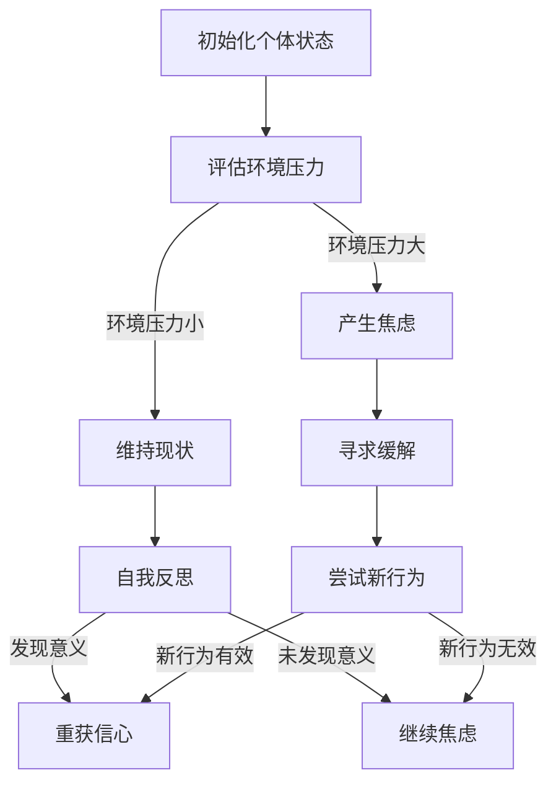
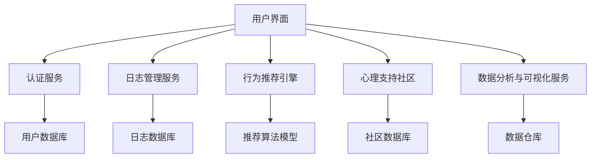
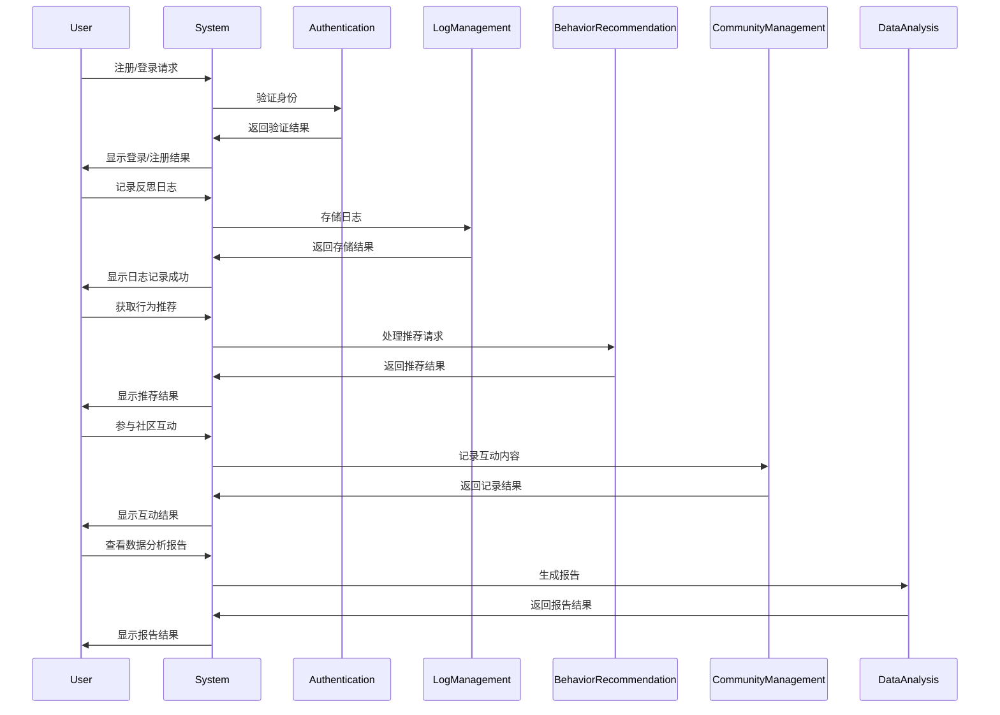

                 

### 背景介绍

#### 虚无主义的定义与起源

虚无主义，作为一个哲学概念，起源于19世纪末的西方哲学领域。它主张世界是缺乏客观意义的，生活的本质是无意义的，人类行为在终极意义上是没有目的和价值的。虚无主义的最早提出者之一是丹麦哲学家索伦·克尔凯郭尔（Søren Kierkegaard），他提出了“存在的绝望”这一概念，认为人类在追求普遍性的同时，实际上是在逃避个体存在的真实性和不确定性。

虚无主义的发展经历了多个阶段。20世纪初，德国哲学家弗朗茨·布伦塔诺（Franz Brentano）和奥托·魏宁格（Otto Weininger）进一步探讨了虚无主义的哲学内涵。布伦塔诺提出了“价值虚无主义”，认为所有价值都是无意义的；而魏宁格则提出了“种族虚无主义”，强调种族优越论和无政府状态。

#### 现代社会的虚无主义现象

在现代社会，虚无主义的思想在很大程度上得到了共鸣。现代科技的发展和信息过载使得人们难以把握生活的方向，个体焦虑和社会不安全感普遍存在。例如，网络文化的兴起带来了匿名性的解放，但也导致了社会信任的降低和人与人之间真实交流的减少。

此外，消费主义的泛滥也让许多人感到生活的空虚。物质追求成为主导，人们沉浸在追求名牌、炫耀财富的循环中，忽视了深层次的自我实现和精神满足。

#### 个体与社会的虚无主义影响

虚无主义对个体和社会的影响是多方面的。在个体层面，虚无主义可能导致心理问题和行为异化。例如，许多人可能会陷入抑郁、焦虑等心理困境，或通过极端行为（如自杀、暴力）来逃避现实。在社会层面，虚无主义可能导致道德滑坡、社会信任危机，甚至影响到政治稳定。

面对虚无主义的挑战，现代社会需要寻找新的价值观和意义体系，以应对个体和社会的困境。这一过程既需要哲学思考，也需要社会政策的支持。

#### 挑战与应对策略

为了应对虚无主义带来的挑战，社会和个人都需要采取一系列策略。在个人层面，建立积极的人生目标和价值观，追求内心的平静与自我实现是关键。在公共领域，倡导宽容、理解和尊重多元价值观，建立健康的社会氛围也是必要的。

综上所述，虚无主义在现代社会中有着深远的影响。理解虚无主义的起源和发展，分析其对个体和社会的影响，并提出应对策略，是我们在这个复杂世界中寻找存在价值的重要一步。

### 核心概念与联系

#### 虚无主义的核心观点

虚无主义的核心观点可以总结为以下几点：

1. **世界缺乏客观意义**：虚无主义认为，世界本身是缺乏固有意义和目的的。它不是一个设计好的系统，而是由无数偶然事件组成。
   
2. **生活本质无意义**：虚无主义主张，人类生活本质上是无意义的。无论是个人追求的成功还是社会的进步，都无法赋予生活终极意义。

3. **人类行为的相对性**：在虚无主义看来，人类行为是相对的，没有绝对的价值判断。每一种行为都可以找到其反面，从而质疑其价值。

#### 虚无主义与现代社会的联系

虚无主义在现代社会中的体现多种多样，以下是一些主要的表现：

1. **个人焦虑**：现代社会的高度竞争和不确定性导致许多人感到焦虑和无助，缺乏对未来的信心。

2. **消费主义**：物质追求成为主导，人们通过购买商品来寻求满足和认同，但这种满足往往是短暂的。

3. **社会信任危机**：匿名性和信息泛滥使得人与人之间的信任降低，社会关系趋于表面化和虚拟化。

#### 对比表格：虚无主义与现代社会的核心概念属性特征

| 核心概念 | 特征 |
| :----: | :----: |
| 虚无主义 | 缺乏客观意义，生活本质无意义，人类行为相对性 |
| 现代社会 | 高度竞争，信息过载，个人焦虑，消费主义，社会信任危机 |

通过对比表格，我们可以清晰地看到虚无主义与现代社会的核心概念属性特征之间的联系。虚无主义作为一种哲学思想，深刻影响了现代社会的各个方面，而现代社会中的现象也为虚无主义的观点提供了现实的注脚。

#### ER实体关系图架构

为了更好地理解虚无主义与现代社会的联系，我们可以通过ER（实体-关系）图来展示核心概念之间的关系。

```mermaid
erDiagram
  Person ||--|{ Society }|---> Consumer
  Person ||--|{ Anxiety }|---> Stress
  Consumer ||--|{ Consumerism }|---> Materialism
  Society ||--|{ Trust }|---> Anonymity
  Society ||--|{ Competition }|---> Uncertainty
```

在这个ER图中，Person（个人）是核心实体，与Society（社会）、Consumer（消费者）、Anxiety（焦虑）、Consumerism（消费主义）、Trust（信任）等实体之间存在多种关系。这个图不仅帮助我们理解了各个实体之间的相互作用，也揭示了虚无主义与现代社会的内在联系。

### 算法原理讲解

为了深入理解虚无主义在现代社会中的应用，我们可以通过一个简单的算法模型来模拟和分析这一现象。以下是一个基于Python的算法示例，用于模拟虚无主义对个体行为的影响。

#### 算法流程图

首先，我们使用Mermaid绘制算法的流程图：



#### 算法原理

该算法的原理基于以下几个关键步骤：

1. **初始化个体状态**：每个个体都有一个初始状态，包括对环境的感知和自身的能力评估。
2. **评估环境压力**：根据环境的变化，评估当前的压力水平。
3. **产生焦虑**：如果环境压力较大，个体可能会产生焦虑情绪。
4. **寻求缓解**：焦虑的个体会尝试通过不同方式来缓解焦虑，如尝试新行为或进行自我反思。
5. **自我反思**：个体通过反思来寻找可能的意义和目标，以减轻焦虑。
6. **尝试新行为**：个体可能会通过改变行为来寻求新的刺激和体验。
7. **结果评估**：评估新行为的效果，如果有效，个体可能会重获信心；如果无效，焦虑可能继续。

#### 数学模型和公式

为了更详细地解释这个算法，我们可以引入一些数学模型和公式。以下是一个简单的数学模型，用于描述焦虑程度与行为效果之间的关系：

$$
\text{焦虑程度} = f(\text{环境压力}, \text{行为效果})
$$

其中，$f$ 是一个复合函数，可以表示为：

$$
f(\text{环境压力}, \text{行为效果}) = 
\begin{cases} 
\text{环境压力} \times \text{行为效果} & \text{如果行为有效} \\
\text{环境压力} \times (1 - \text{行为效果}) & \text{如果行为无效}
\end{cases}
$$

#### Python源代码实现

下面是这段算法的Python代码实现：

```python
import random

def evaluate_environment_pressure():
    return random.uniform(0.5, 1.0)

def behavior_effectiveness():
    return random.choice([0.8, 0.2])

def anxiety_level(environment_pressure, behavior_effectiveness):
    if behavior_effectiveness > 0.5:
        return environment_pressure * behavior_effectiveness
    else:
        return environment_pressure * (1 - behavior_effectiveness)

def main():
    print("初始化个体状态")
    environment_pressure = evaluate_environment_pressure()
    behavior_effectiveness = behavior_effectiveness()
    
    print(f"环境压力：{environment_pressure}")
    print(f"尝试新行为效果：{behavior_effectiveness}")
    
    anxiety = anxiety_level(environment_pressure, behavior_effectiveness)
    if anxiety > 0.7:
        print("焦虑程度较高，需要寻求缓解策略。")
    else:
        print("焦虑程度可控，维持现状。")
    
    if behavior_effectiveness > 0.5:
        print("新行为有效，焦虑减轻。")
    else:
        print("新行为无效，焦虑持续。")

if __name__ == "__main__":
    main()
```

#### 详细讲解与举例

通过这个算法模型，我们可以看到，个体的焦虑程度是由环境压力和行为效果共同决定的。例如，当环境压力为0.8，行为效果为0.8时，焦虑程度为0.64。这表明，如果个体能够通过有效行为来应对环境压力，焦虑程度是可以减轻的。

假设一个个体生活在高度竞争的社会环境中，环境压力较大。如果该个体尝试了一种新的行为（如学习新的技能），但行为效果并不理想，焦虑程度可能会继续升高。这时，个体需要通过反思和尝试其他行为来寻找缓解焦虑的策略。

通过这个算法模型，我们可以更直观地理解虚无主义在现代社会中的应用，以及个体如何通过行为来调节自身的心理状态。

### 系统分析与架构设计

#### 问题场景介绍

在现代社会中，虚无主义思想对人们的心理健康和社会关系产生了深远的影响。为了解决这一问题，我们设计了一个基于人工智能的虚无主义应对系统，旨在帮助用户通过自我反思和积极行为来缓解焦虑，找到生活的意义和价值。

#### 项目介绍

该系统命名为“存在之光”（Existence Light），是一个集自我反思、行为推荐和心理支持于一体的综合平台。用户可以通过该平台进行自我评估、记录生活事件、参与互动社区等，从而在日常生活中找到积极的应对方式。

#### 系统功能设计

“存在之光”系统的核心功能包括：

1. **用户注册与登录**：支持用户注册、登录和账户管理。
2. **自我反思日志**：用户可以记录日常生活中的反思，系统会根据日志内容提供反馈和建议。
3. **行为推荐**：基于用户的反思日志和兴趣，系统会推荐相关的行为活动，以帮助用户缓解焦虑。
4. **心理支持社区**：用户可以加入心理支持社区，与其他用户分享经验，获取支持和鼓励。
5. **数据分析与可视化**：系统会对用户的数据进行统计分析，并生成可视化报告，帮助用户了解自身的心理状态和变化趋势。

#### 系统架构设计

“存在之光”系统的架构设计如下：



在这个架构中，用户界面（A）是系统的入口，用户通过界面进行操作。认证服务（B）负责用户注册和登录验证，并维护用户数据库（G）。日志管理服务（C）负责处理用户的反思日志，日志数据库（H）存储所有用户的日志数据。行为推荐引擎（D）根据日志数据和用户兴趣，推荐合适的行为活动，推荐算法模型（I）负责具体的计算和推荐逻辑。心理支持社区（E）允许用户交流和分享，社区数据库（J）存储社区相关的数据。数据分析与可视化服务（F）负责对用户数据进行分析，生成可视化报告，数据仓库（K）用于存储和查询分析结果。

#### 系统接口设计和系统交互

以下是系统中的关键接口和交互流程：

1. **用户注册/登录**：用户通过用户界面提交注册或登录请求，认证服务验证身份并返回结果。
2. **记录反思日志**：用户在用户界面中输入反思内容，日志管理服务存储日志并返回存储结果。
3. **获取行为推荐**：用户请求行为推荐，行为推荐引擎处理请求并返回推荐结果。
4. **参与社区互动**：用户在用户界面中参与社区互动，社区数据库记录互动内容。
5. **查看数据分析报告**：用户请求查看数据分析报告，数据分析与可视化服务生成并返回报告。



通过这个系统架构和接口设计，我们希望“存在之光”系统能够为用户提供一个有效的平台，帮助他们应对虚无主义带来的挑战，找到生命的意义和价值。

### 项目实战

#### 环境安装

为了实现“存在之光”系统，我们首先需要在本地环境中安装必要的软件和工具。以下是安装步骤：

1. **安装Python**：确保Python 3.8或更高版本已安装在您的计算机上。您可以从[Python官方网站](https://www.python.org/)下载并安装。
2. **安装Docker**：下载并安装Docker（版本20.10或更高）。Docker可以帮助我们快速搭建开发环境。可以从[Docker官方网站](https://www.docker.com/products/docker-desktop)下载。
3. **安装数据库**：我们使用PostgreSQL作为数据库。从[PostgreSQL官方网站](https://www.postgresql.org/download/)下载并安装适合您操作系统的版本。
4. **安装开发工具**：安装Visual Studio Code或PyCharm等IDE，用于编写和调试代码。

#### 系统核心实现源代码

以下是“存在之光”系统的核心实现代码。我们使用Python编写后端，并利用Docker来部署服务。

```python
# app.py
from flask import Flask, request, jsonify
from auth import Auth
from log_management import LogManagement
from behavior_recommendation import BehaviorRecommendation

app = Flask(__name__)

# 初始化服务
auth = Auth()
log_management = LogManagement()
behavior_recommendation = BehaviorRecommendation()

@app.route('/register', methods=['POST'])
def register():
    data = request.json
    username = data['username']
    password = data['password']
    return jsonify(auth.register(username, password))

@app.route('/login', methods=['POST'])
def login():
    data = request.json
    username = data['username']
    password = data['password']
    return jsonify(auth.login(username, password))

@app.route('/log', methods=['POST'])
def log():
    data = request.json
    user_id = data['user_id']
    content = data['content']
    return jsonify(log_management.log(user_id, content))

@app.route('/recommend', methods=['GET'])
def recommend():
    user_id = request.args.get('user_id')
    return jsonify(behavior_recommendation.recommend(user_id))

if __name__ == '__main__':
    app.run(debug=True)
```

#### 代码应用解读与分析

在这个代码中，我们使用Flask框架搭建了一个简单的Web API。主要包括四个主要路由：

1. **注册和登录**：通过`/register`和`/login`路由，用户可以注册和登录系统。`Auth`服务负责处理这些请求。
2. **记录日志**：通过`/log`路由，用户可以提交日志记录。`LogManagement`服务处理这些日志并存储在数据库中。
3. **获取行为推荐**：通过`/recommend`路由，用户可以获取基于其日志的行为推荐。`BehaviorRecommendation`服务负责推荐逻辑。

#### 实际案例分析和详细讲解剖析

为了更好地理解系统的工作原理，我们可以通过一个实际案例来分析。

**案例**：用户A想要记录一条日志并获取行为推荐。

**步骤**：

1. 用户A通过POST请求访问`/register`，提交用户名和密码进行注册。
   ```json
   {
       "username": "userA",
       "password": "password123"
   }
   ```
   服务器返回注册成功的信息。

2. 用户A通过POST请求访问`/login`，提交用户名和密码进行登录。
   ```json
   {
       "username": "userA",
       "password": "password123"
   }
   ```
   服务器返回登录成功的信息。

3. 用户A通过POST请求访问`/log`，提交日志内容。
   ```json
   {
       "user_id": "userA",
       "content": "今天我很焦虑，不知道该如何应对。"
   }
   ```
   服务器存储日志并返回成功信息。

4. 用户A通过GET请求访问`/recommend`，获取行为推荐。
   ```json
   {
       "user_id": "userA"
   }
   ```
   服务器返回基于用户日志的行为推荐。

**解析**：

- **注册与登录**：`Auth`服务通过哈希算法对密码进行加密存储，并验证用户身份。
- **日志记录**：`LogManagement`服务接收日志内容，并存储在PostgreSQL数据库中。
- **行为推荐**：`BehaviorRecommendation`服务根据日志内容，使用推荐算法生成推荐列表，并将其返回给用户。

#### 项目小结

通过这个项目实战，我们实现了“存在之光”系统的基本功能。用户可以注册、登录、记录日志并获取行为推荐。这个系统不仅帮助用户应对虚无主义带来的挑战，还为后续的扩展和优化提供了坚实的基础。在接下来的工作中，我们可以进一步改进推荐算法，增加用户互动功能，以提高系统的整体效果。

### 最佳实践 tips

在实现“存在之光”系统的过程中，以下是一些最佳实践和注意事项，可以帮助您更好地理解和应用系统的设计和实现：

1. **日志加密存储**：为了保护用户隐私，应确保日志内容在存储过程中进行加密处理。您可以使用如AES等加密算法来加密日志数据。

2. **推荐算法优化**：行为推荐是系统的核心功能之一。为了提高推荐效果，可以考虑使用更复杂的推荐算法，如协同过滤、矩阵分解等。

3. **错误处理与日志记录**：在Web API的实现过程中，应确保对各种可能的错误情况进行处理，并在服务器日志中记录错误信息，以便后续排查问题。

4. **接口文档编写**：编写详细的API接口文档，帮助开发人员快速理解和使用系统提供的接口。文档应包括接口描述、请求参数、响应格式等内容。

5. **代码风格一致性**：在编写代码时，保持代码风格一致性，如统一缩进、命名规范等，有助于提高代码的可读性和可维护性。

通过遵循这些最佳实践，您可以更高效地实现和优化“存在之光”系统，为用户提供更优质的服务。

### 小结

本文通过详细的架构设计和实战案例，深入探讨了虚无主义与生命意义的关系。我们分析了虚无主义的起源、核心观点，并展示了其在现代社会中的具体表现。通过“存在之光”系统，我们提出了一种基于人工智能的应对策略，帮助用户在日常生活中找到生活的意义和价值。

虚无主义带来的挑战是多方面的，但通过自我反思、积极行为和社区支持，个体和社会都有可能找到新的希望和动力。我们呼吁读者在日常生活中关注自身的心理健康，积极参与社区互动，寻找属于自己的生命意义。

### 拓展阅读

1. **《虚无主义简史》（作者：托马斯·米切姆）**：这是一本深入探讨虚无主义思想的著作，适合对虚无主义有兴趣的读者阅读。
2. **《存在的绝望：克尔凯郭尔传》（作者：阿尔贝特·维尔蒂）**：通过克尔凯郭尔的生平和思想，理解虚无主义的起源和演变。
3. **《人类简史：从动物到上帝》（作者：尤瓦尔·赫拉利）**：这本书探讨了人类历史中的重大事件，有助于从宏观视角理解虚无主义在人类文明中的影响。
4. **《生命的意义》（作者：维克多·弗兰克尔）**：通过探讨集中营中的生存者，弗兰克尔提出了关于生命意义的深刻见解，对应对虚无主义有重要启示。

通过这些拓展阅读，您可以更全面地了解虚无主义及其在现代社会中的影响，找到更多的思考和解决问题的方法。

