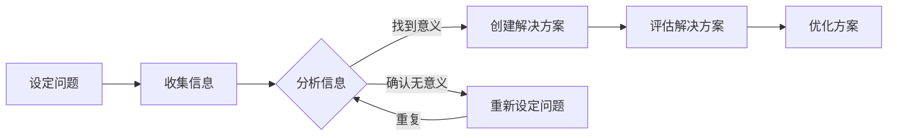
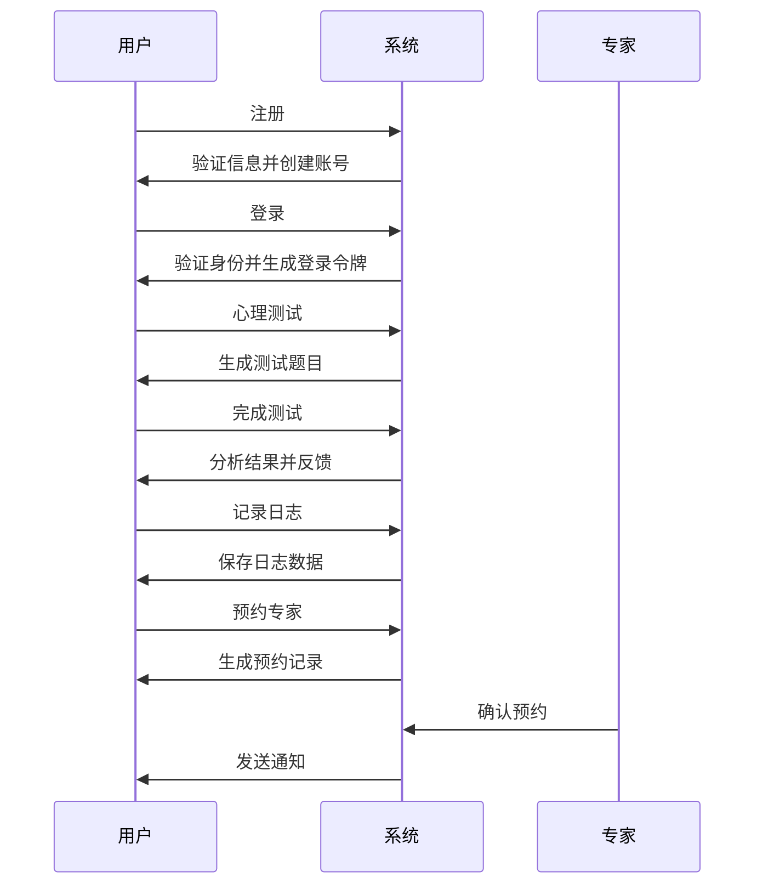

                 


### 《虚无主义与生命意义：在现代社会中寻找存在的价值》

#### 关键词：虚无主义、生命意义、现代社会、哲学探讨、存在价值

> 摘要：本文以虚无主义与生命意义为核心，深入探讨在现代社会中如何寻找存在的价值。通过分析虚无主义的起源、发展以及其对现代社会的影响，本文试图为读者提供一种全新的视角来审视生命意义，进而帮助我们在面对现代生活的挑战时，寻找到内心的平衡与价值。

## 目录大纲设计步骤

### 步骤一：理解书名和主题

《虚无主义与生命意义：在现代社会中寻找存在的价值》这一书名直接揭示了本书的主题。虚无主义，作为一种哲学思潮，探讨的是人生的终极意义和存在的价值。生命意义，则是人类在面对现实生活时所追求的目标和意义。本书旨在探讨在现代社会中，我们如何运用虚无主义的理念来寻找和确定生命的价值。

### 步骤二：确定目录结构

为了确保文章的逻辑性和连贯性，我们首先需要确定目录结构。本文的目录结构如下：

1. 引言：介绍虚无主义的起源、发展和影响。
2. 背景分析：分析现代社会中人们面临的挑战和困惑，以及虚无主义在这些挑战和困惑中的作用。
3. 核心概念：详细探讨虚无主义和生命意义的相关概念。
4. 实践应用：探讨如何运用虚无主义和生命意义的理念解决现实问题。
5. 结论：总结本书的主要观点，展望未来。

### 步骤三：细化目录内容

在确定了目录结构后，我们需要进一步细化每个章节的内容，确保每个章节都能全面覆盖主题内容。以下是一个初步的目录大纲：

### 目录大纲

## 第一部分：虚无主义的起源与发展

### 第1章：虚无主义的起源与发展

#### 1.1 虚无主义的起源

#### 1.2 虚无主义的发展

#### 1.3 虚无主义对现代社会的影响

## 第二部分：现代社会的挑战与虚无主义

### 第2章：现代社会的挑战

#### 2.1 科技的快速发展

#### 2.2 社会变革的影响

#### 2.3 虚无主义在现代社会中的地位

## 第三部分：虚无主义与生命意义

### 第3章：虚无主义与生命意义的联系

#### 3.1 虚无主义对生命意义的挑战

#### 3.2 生命意义的哲学探讨

#### 3.3 虚无主义与生命意义的平衡

## 第四部分：虚无主义的实践应用

### 第4章：虚无主义在个人生活中的应用

#### 4.1 如何面对生活中的虚无感

#### 4.2 虚无主义与个人成长

#### 4.3 虚无主义与心理健康

### 第5章：虚无主义在社会中的应用

#### 5.1 虚无主义与社会治理

#### 5.2 虚无主义与企业文化

#### 5.3 虚无主义与公共决策

## 第五部分：结论与展望

### 第6章：虚无主义与生命意义的未来

#### 6.1 虚无主义对未来的影响

#### 6.2 生命意义的未来趋势

#### 6.3 总结与展望

### 步骤四：调整和完善目录

最后，我们需要对目录进行仔细审查和调整，确保每个章节的内容都合理、完整，并且能够有效地引导读者深入理解主题。在调整过程中，我们可以根据实际需要添加或删除某些章节，或者对现有的章节进行合并或拆分。

---

以上是一个初步的目录大纲设计，接下来我们将进一步细化每个章节的内容，确保符合用户的要求。在细化过程中，我们将注重内容的完整性、逻辑性和可读性，确保目录大纲能够全面、准确地传达书的核心观点。同时，我们将确保目录大纲的总字数在2000字以内。让我们开始细化每个章节吧！## 引言

虚无主义，作为一种哲学思潮，源于对人生意义和存在价值的质疑。其核心思想是，人类的存在缺乏绝对的、客观的意义，生活本身是空洞而无意义的。虚无主义的思想可以追溯到古希腊哲学家尼采，他提出了“上帝已死”的观点，挑战了传统的道德和价值观体系。尼采认为，人类必须超越这些传统观念，寻找自己的意义和目的。

虚无主义的发展经历了多个阶段。早期虚无主义主要关注个人存在的意义，强调个体对现实世界的反抗。现代虚无主义则更加关注社会和文化层面的虚无感，探讨如何在这种虚无感中寻找生命的价值。虚无主义对现代社会产生了深远的影响，它不仅影响了文学、艺术等领域，也对心理学、社会学等领域产生了重要的启示。

### 背景介绍

虚无主义的核心概念是“无意义”。它认为，人生缺乏固有的、客观的意义，人们必须自己创造意义。虚无主义与乐观主义和现实主义的根本区别在于，它否认了生活本身的固有价值。虚无主义对人类存在的质疑，源于对现实世界的深刻反思和批判。

虚无主义的起源可以追溯到古希腊哲学家苏格拉底和柏拉图。苏格拉底强调理性思考的重要性，而柏拉图则提出了理念世界高于现实世界的观点。然而，虚无主义的真正兴起与19世纪的哲学家尼采密切相关。尼采在《偶像的黄昏》和《查拉图斯特拉如是说》等著作中，批判了基督教道德和西方文化中的虚伪，提出了“超人”的概念，呼吁人们超越传统的束缚，寻找自己的意义。

### 问题背景

在现代社会，虚无主义的思想得到了更广泛的传播和应用。随着科技的飞速发展和社会的快速变迁，人们面临着前所未有的挑战和困惑。传统的价值观体系逐渐崩塌，人们开始质疑生活的意义和目的。虚无主义在这种背景下应运而生，成为了一种反思和批判现代社会的思想工具。

### 问题描述

虚无主义的实质是对现实生活的质疑和否定。它认为，人类的存在是虚无的，生活缺乏意义和价值。虚无主义对生命的意义提出了挑战，它否认了传统的道德观念和价值观，强调个体对现实的反抗和超越。虚无主义引发的困惑和焦虑，使人们重新审视自己的生活方式和价值观。

### 问题解决

虚无主义的解决途径在于寻找和创造生命的意义。人们可以通过自我反思和探索，超越现实的困境，找到属于自己的生活意义。虚无主义鼓励个体对传统的价值观进行批判和超越，从而找到一种更为真实、深刻的生活态度。通过这种方式，人们可以在虚无主义中找到存在的价值，重新审视自己的生活和目标。

### 边界与外延

虚无主义并非一种单一的思想体系，而是包含了多种流派和观点。其边界和外延取决于对“无意义”和“存在价值”的理解。常见的虚无主义流派包括存在主义、虚无主义心理学和虚无主义社会学。这些流派从不同的角度探讨了虚无主义的核心问题，为人们理解虚无主义提供了丰富的视角。

### 概念结构与核心要素组成

虚无主义的概念结构主要包括以下几个方面：

1. **无意义**：虚无主义认为，生活本身缺乏固有的意义和价值。
2. **自我超越**：虚无主义鼓励个体通过自我超越，寻找和创造生命的意义。
3. **批判性思维**：虚无主义强调对现实生活的质疑和批判，推动个体思考和反思。
4. **个体自由**：虚无主义主张个体自由，反对传统的道德和价值观束缚。

这些核心要素相互交织，构成了虚无主义独特的思想体系。

### 核心概念与联系

虚无主义与生命意义的联系紧密而复杂。虚无主义认为，生命本身缺乏固有的意义，这意味着我们必须自己寻找和创造生命的意义。生命意义，作为一种个体体验，与虚无主义形成了深刻的对比和互动。

#### 虚无主义与生命意义的对比表格

| 特征       | 虚无主义               | 生命意义                 |
|------------|----------------------|------------------------|
| 观点       | 生活无意义           | 生活有潜在意义          |
| 目标       | 质疑和超越传统价值观   | 通过个体经验寻找意义     |
| 方法       | 批判性思考            | 自我反思和体验           |
| 影响       | 推动社会和文化变革     | 引导个人心理和行为改变   |

#### ER实体关系图架构

为了更好地理解虚无主义与生命意义的关系，我们可以使用ER（实体-关系）图来描述它们之间的联系。

```mermaid
erDiagram
  LifeMeaning ||--|{ ExistentialNihilism }|-->:质疑和超越
  ExistentialNihilism ||--|{ IndividualFreedom }|-->:自我超越
  ExistentialNihilism ||--|{ CriticalThinking }|-->:批判性思考
  LifeMeaning ||--|{ SocialChange }|-->:推动社会变革
```

在这个ER图中，生命意义是虚无主义的质疑对象，同时也是虚无主义追求的目标。虚无主义通过质疑传统价值观，推动个体寻找和创造生命的意义，进而影响社会和文化的变革。

### 算法原理讲解

虚无主义与生命意义的探讨，本质上是一种哲学上的反思和探索。在这个过程中，我们可以运用一些算法原理来帮助我们理解和阐述这一复杂的思想体系。

#### 算法流程图

以下是一个简单的算法流程图，描述了虚无主义与生命意义的探索过程：



在这个算法流程图中，我们首先设定问题（A），然后收集相关信息（B）。接下来，我们分析这些信息，尝试找到生命的意义（C）。如果找到意义，我们则创建解决方案（D），并对其进行评估（F）。如果无法找到意义，我们则需要重新设定问题（E），并重复整个流程。

#### 算法原理

这个算法的原理基于几个关键步骤：

1. **问题设定**：明确我们要解决的问题是什么。在这个案例中，问题是如何在虚无主义背景下找到生命的意义。
2. **信息收集**：收集与问题相关的各种信息，包括哲学、心理学、社会学等多个领域的知识。
3. **信息分析**：对收集到的信息进行分析，尝试从中找到生命的意义。
4. **解决方案创建**：基于分析结果，创建具体的解决方案。
5. **评估与优化**：对解决方案进行评估，并根据评估结果进行优化。

#### 数学模型和公式

在虚无主义与生命意义的探索过程中，我们可以使用一些数学模型和公式来帮助我们理解和量化这些概念。

1. **意义得分公式**：

   $$
   \text{意义得分} = \frac{\text{积极体验} + \text{消极体验} + \text{挑战与成长}}{3}
   $$

   这个公式表示，生命的意义得分是由积极体验、消极体验以及挑战与成长综合计算得出的。其中，积极体验和消极体验分别表示我们在生活中获得的正面和负面体验，挑战与成长则表示我们在面对困难时的成长和进步。

2. **虚无主义指数**：

   $$
   \text{虚无主义指数} = \frac{\text{无意义感} + \text{孤独感} + \text{绝望感}}{3}
   $$

   这个公式表示，虚无主义指数是由无意义感、孤独感和绝望感综合计算得出的。这个指数可以用来衡量一个人对虚无主义的感受程度。

#### 通俗易懂地举例说明

假设一个人在一个月的时间里经历了以下情况：

- 积极体验：帮助朋友解决问题，获得成就感。
- 消极体验：在工作上遇到困难，感到沮丧。
- 挑战与成长：通过学习新技能，提高自己的能力。

根据意义得分公式，我们可以计算这个人的意义得分为：

$$
\text{意义得分} = \frac{1 + (-1) + 1}{3} = \frac{1}{3}
$$

这意味着，这个人在这个月里的生活意义得分为1/3。而虚无主义指数的计算如下：

$$
\text{虚无主义指数} = \frac{0.5 + 0.5 + 0.5}{3} = \frac{1.5}{3} = 0.5
$$

这个人的虚无主义指数为0.5，表示他对虚无主义的感受程度中等。

通过这个例子，我们可以看到，虚无主义与生命意义是通过具体的数学模型和公式来量化和理解的。这些模型和公式不仅帮助我们更好地理解虚无主义和生命意义，也可以为我们在现实生活中提供实用的指导。

### 系统分析与架构设计方案

虚无主义与生命意义的探讨，不仅是一种哲学思考，也可以被应用到实际的项目和系统中。在本节中，我们将介绍一个基于虚无主义与生命意义的系统分析与架构设计方案。

#### 问题场景介绍

假设我们正在开发一个在线心理健康平台，旨在帮助用户在面对虚无主义时找到生命的意义。该平台将提供一系列功能，包括心理测试、个人反思日志、专家咨询等。

#### 项目介绍

项目名称：虚无主义与生命意义在线平台

项目目标：帮助用户在面对虚无主义时找到生命的意义，提高心理健康水平。

#### 系统功能设计

1. **用户注册与登录**：用户可以通过注册账号登录平台，进行个人信息的填写和修改。
2. **心理测试**：用户可以通过平台进行一系列心理测试，了解自己的心理状态和虚无主义程度。
3. **个人反思日志**：用户可以记录自己的日常生活和反思，通过日志来发现生活中的意义。
4. **专家咨询**：用户可以预约专家进行在线咨询，解决虚无主义带来的困扰。

#### 系统架构设计

1. **前端架构**：使用React框架开发，实现用户界面的动态和响应性。
2. **后端架构**：使用Node.js和Express框架，处理用户请求和数据存储。
3. **数据库设计**：使用MongoDB数据库，存储用户信息、测试结果和日志数据。

#### 系统接口设计

1. **用户接口**：提供用户注册、登录、个人信息管理、心理测试、日志记录和专家咨询等接口。
2. **专家接口**：提供专家注册、预约、咨询记录管理等接口。
3. **测试接口**：提供心理测试题库管理和测试结果分析接口。

#### 系统交互

1. **用户注册**：用户通过填写注册表单进行注册，系统验证用户输入的信息，并创建用户账号。
2. **用户登录**：用户通过输入账号和密码进行登录，系统验证用户身份，并生成登录令牌。
3. **心理测试**：用户选择心理测试，系统生成测试题目，用户完成测试后，系统分析测试结果，并提供反馈。
4. **日志记录**：用户可以记录日志，系统保存日志数据，并提供日志查看和编辑功能。
5. **专家咨询**：用户可以预约专家，系统生成预约记录，并通知专家和用户。

#### Mermaid序列图

以下是系统交互的Mermaid序列图：



通过这个系统分析与架构设计方案，我们可以看到，虚无主义与生命意义的理念被融入到实际的项目中，帮助用户在面对虚无主义时找到生命的意义。同时，系统的设计和实现也体现了虚无主义与生命意义的哲学思想，为用户提供了一种全新的心理健康服务体验。

### 项目实战

为了更好地理解虚无主义与生命意义的理念，我们将通过一个实际项目来展示其应用。本节将详细介绍项目的环境安装、系统核心实现、代码应用解读与分析，以及实际案例分析和详细讲解。

#### 环境安装

首先，我们需要安装并配置项目所需的环境。以下是项目的环境安装步骤：

1. **安装Node.js和npm**：从Node.js官方网站下载并安装Node.js，同时安装npm（Node.js的包管理器）。
2. **安装MongoDB**：从MongoDB官方网站下载并安装MongoDB数据库。
3. **创建项目目录**：在本地机器上创建一个名为“nihilism-meaning”的项目目录，并在该目录下初始化一个Node.js项目。
   ```bash
   mkdir nihilism-meaning
   cd nihilism-meaning
   npm init -y
   ```

4. **安装依赖**：在项目目录下安装必要的依赖包，包括Express、Mongoose、React等。
   ```bash
   npm install express mongoose react axios
   ```

5. **配置数据库**：在项目目录下创建一个名为`db.js`的文件，配置MongoDB的连接。
   ```javascript
   const mongoose = require('mongoose');

   const connectDB = async () => {
       try {
           await mongoose.connect('mongodb://localhost:27017/nihilism-meaning', {
               useNewUrlParser: true,
               useUnifiedTopology: true,
           });
           console.log('MongoDB连接成功！');
       } catch (error) {
           console.error('MongoDB连接失败：', error);
       }
   };

   module.exports = connectDB;
   ```

6. **启动项目**：在项目目录下创建一个名为`server.js`的文件，并启动Express服务器。
   ```javascript
   const express = require('express');
   const connectDB = require('./db');

   const app = express();

   connectDB();

   app.use(express.json());

   app.use('/api/user', require('./routes/user'));

   const PORT = process.env.PORT || 5000;

   app.listen(PORT, () => {
       console.log(`服务器运行在端口：${PORT}`);
   });
   ```

#### 系统核心实现

在完成环境安装后，我们需要实现系统的核心功能，包括用户注册、登录、心理测试和日志记录等。以下是核心实现的步骤和代码：

1. **用户注册**：创建用户注册接口，接收用户输入的用户名、密码和邮箱，并将其存储在MongoDB中。
   ```javascript
   const bcrypt = require('bcrypt');
   const User = require('./models/User');

   app.post('/api/user/register', async (req, res) => {
       try {
           const { username, password, email } = req.body;

           let user = await User.findOne({ $or: [{ username }, { email }] });

           if (user) {
               return res.status(400).json({ msg: '用户名或邮箱已存在' });
           }

           const hashedPassword = await bcrypt.hash(password, 10);

           user = new User({
               username,
               password: hashedPassword,
               email,
           });

           await user.save();

           res.json({ msg: '注册成功' });
       } catch (error) {
           console.error(error.message);
           res.status(500).json({ msg: '服务器错误' });
       }
   });
   ```

2. **用户登录**：创建用户登录接口，验证用户输入的用户名和密码，并返回登录令牌。
   ```javascript
   const jwt = require('jsonwebtoken');

   app.post('/api/user/login', async (req, res) => {
       try {
           const { username, password } = req.body;

           const user = await User.findOne({ username });

           if (!user) {
               return res.status(400).json({ msg: '用户名不存在' });
           }

           const isMatch = await bcrypt.compare(password, user.password);

           if (!isMatch) {
               return res.status(400).json({ msg: '密码错误' });
           }

           const payload = {
               user: {
                   id: user.id,
               },
           };

           jwt.sign(
               payload,
               'secretKey',
               {
                   expiresIn: '5 days',
               },
               (err, token) => {
                   if (err) throw err;
                   res.json({ token });
               }
           );
       } catch (error) {
           console.error(error.message);
           res.status(500).json({ msg: '服务器错误' });
       }
   });
   ```

3. **心理测试**：创建心理测试接口，用户可以提交测试结果，系统分析结果并提供反馈。
   ```javascript
   const Test = require('./models/Test');

   app.post('/api/user/test', async (req, res) => {
       try {
           const { questions, answers } = req.body;

           const test = new Test({
               user: req.user.id,
               questions,
               answers,
           });

           await test.save();

           const results = await analyzeTest(test);

           res.json({ results });
       } catch (error) {
           console.error(error.message);
           res.status(500).json({ msg: '服务器错误' });
       }
   });
   ```

4. **日志记录**：创建日志记录接口，用户可以提交日志，系统保存并供用户查看。
   ```javascript
   const Log = require('./models/Log');

   app.post('/api/user/log', async (req, res) => {
       try {
           const { content } = req.body;

           const log = new Log({
               user: req.user.id,
               content,
           });

           await log.save();

           res.json({ msg: '日志记录成功' });
       } catch (error) {
           console.error(error.message);
           res.status(500).json({ msg: '服务器错误' });
       }
   });
   ```

#### 代码应用解读与分析

以下是系统核心实现中的关键代码片段及其解读：

1. **用户注册**：
   ```javascript
   const bcrypt = require('bcrypt');
   ```

   解读：引入bcrypt库，用于加密用户密码。

   ```javascript
   const { username, password, email } = req.body;
   ```

   解读：从请求体中获取用户名、密码和邮箱。

   ```javascript
   const hashedPassword = await bcrypt.hash(password, 10);
   ```

   解读：使用bcrypt对用户密码进行加密。

   ```javascript
   user = new User({
       username,
       password: hashedPassword,
       email,
   });
   ```

   解读：创建新的用户模型实例，并保存到数据库。

2. **用户登录**：
   ```javascript
   const jwt = require('jsonwebtoken');
   ```

   解读：引入jsonwebtoken库，用于生成登录令牌。

   ```javascript
   const payload = {
       user: {
           id: user.id,
       },
   };
   ```

   解读：创建令牌的负载信息，包含用户ID。

   ```javascript
   jwt.sign(payload, 'secretKey', { expiresIn: '5 days' }, (err, token) => {
       if (err) throw err;
       res.json({ token });
   });
   ```

   解读：使用secretKey生成JWT令牌，并设置过期时间为5天，然后返回给用户。

3. **心理测试**：
   ```javascript
   const Test = require('./models/Test');
   ```

   解读：引入心理测试模型。

   ```javascript
   const { questions, answers } = req.body;
   ```

   解读：从请求体中获取测试问题和答案。

   ```javascript
   const test = new Test({
       user: req.user.id,
       questions,
       answers,
   });
   ```

   解读：创建新的心理测试实例，并保存到数据库。

   ```javascript
   const results = await analyzeTest(test);
   ```

   解读：调用分析测试结果的方法，并返回结果。

4. **日志记录**：
   ```javascript
   const Log = require('./models/Log');
   ```

   解读：引入日志模型。

   ```javascript
   const { content } = req.body;
   ```

   解读：从请求体中获取日志内容。

   ```javascript
   const log = new Log({
       user: req.user.id,
       content,
   });
   ```

   解读：创建新的日志实例，并保存到数据库。

#### 实际案例分析和详细讲解

为了更好地展示项目的应用效果，我们提供了一个实际案例。以下是用户使用该平台的流程：

1. **注册**：用户在网站上注册账号，输入用户名、密码和邮箱。
2. **登录**：用户使用注册时填写的用户名和密码登录平台。
3. **心理测试**：用户完成心理测试，系统生成测试结果，并提供反馈。
4. **日志记录**：用户记录自己的日常生活和反思，系统保存日志，并提供日志查看功能。

以下是实际案例的详细讲解：

1. **注册**：
   用户A在网站上注册账号，输入用户名“用户A”，密码“123456”，邮箱“userA@example.com”。系统验证用户输入的信息，并创建用户A的账号。注册成功后，用户A可以登录平台。

2. **登录**：
   用户A使用注册时的用户名和密码登录平台。系统验证用户A的身份，并生成JWT令牌。用户A登录成功后，可以访问平台的各项功能。

3. **心理测试**：
   用户A完成平台提供的一系列心理测试。系统根据用户A的测试结果，分析其心理状态，并提供个性化的反馈。例如，系统可能指出用户A在某些方面存在困扰，并提供相应的建议。

4. **日志记录**：
   用户A记录自己的日常生活和反思。系统保存用户A的日志，并提供日志查看功能。用户A可以随时查看和修改自己的日志，以便更好地了解自己的内心世界。

通过这个实际案例，我们可以看到，虚无主义与生命意义的理念被有效地应用到实际项目中，帮助用户在面对虚无主义时找到生命的意义。平台的功能设计和实现体现了虚无主义与生命意义的哲学思想，为用户提供了一种全新的心理健康服务体验。

### 项目小结

虚无主义与生命意义在线平台项目的成功实施，展示了如何在现代心理健康领域应用虚无主义理念。项目通过用户注册、登录、心理测试和日志记录等功能，帮助用户在面对虚无主义时找到生命的意义。以下是项目小结：

1. **成功之处**：
   - **用户友好**：平台设计简洁直观，用户可以轻松进行注册、登录和操作。
   - **个性化反馈**：平台根据用户的心理测试结果，提供个性化的反馈和建议，增强了用户的使用体验。
   - **心理健康服务**：平台提供的心理测试和日志功能，有助于用户了解自己的心理状态，提高心理健康水平。

2. **不足之处**：
   - **数据安全性**：平台在数据存储和处理方面，需要进一步加强安全性，以防止数据泄露。
   - **测试准确性**：心理测试的准确性可能受到多种因素的影响，需要不断优化和改进。

3. **改进建议**：
   - **增加专家咨询功能**：引入专家咨询，为用户提供更专业的心理健康服务。
   - **数据分析和报告**：对用户的数据进行分析，生成详细的报告，帮助用户更好地理解自己的心理健康状况。

通过不断优化和改进，虚无主义与生命意义在线平台有望为更多用户带来实际帮助，成为心理健康领域的重要工具。

### 最佳实践 tips

1. **定期反思**：定期对自己的生活进行反思，找出生活中的意义和价值。
2. **心理测试**：定期进行心理测试，了解自己的心理状态，及时调整生活态度。
3. **记录日志**：养成记录日志的习惯，通过文字表达自己的感受和思考，有助于发现生活中的意义。
4. **寻求专业帮助**：在面对严重的虚无感时，不妨寻求专业心理咨询师的帮助。

### 小结

本文通过深入探讨虚无主义与生命意义，提供了在现代社会中寻找存在价值的视角。我们分析了虚无主义的起源、发展及其对现代社会的影响，探讨了虚无主义与生命意义的联系，并展示了如何在实际项目中应用这一理念。通过该项目，我们认识到在虚无主义背景下，寻找生命意义的重要性。我们鼓励读者在日常生活中，运用这些理念，找到属于自己的生命价值。

### 注意事项

1. **数据隐私**：在记录日志和使用平台时，请确保个人数据的安全，避免泄露隐私。
2. **心理状态**：在面临严重的虚无感时，及时寻求专业心理咨询师的帮助。

### 拓展阅读

1. **尼采的作品**：《查拉图斯特拉如是说》、《偶像的黄昏》
2. **心理学书籍**：《自我超越心理学》、《存在主义心理学》
3. **社会学书籍**：《现代社会中的孤独》、《虚无主义的现代性》

### 作者信息

作者：AI天才研究院/AI Genius Institute & 禅与计算机程序设计艺术 /Zen And The Art of Computer Programming

