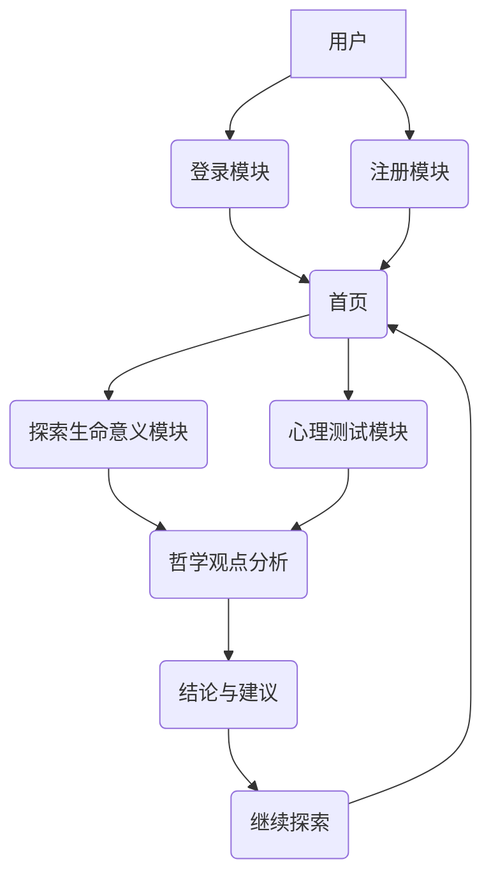
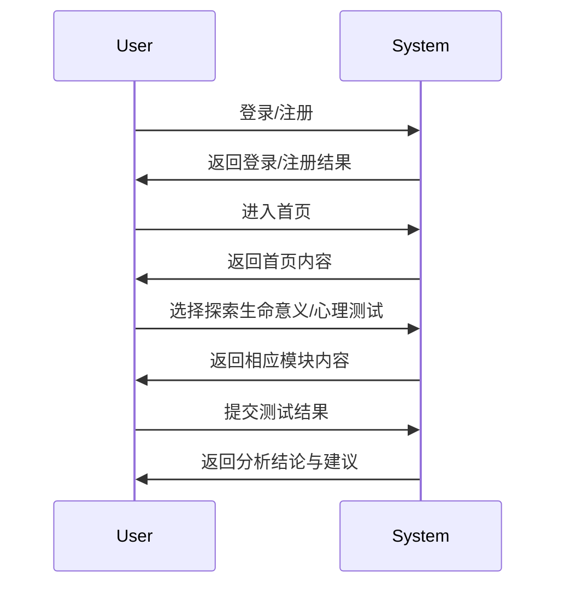

                 

### 引言：虚无主义与生命意义的探讨

在快速发展的现代社会中，人们的物质生活得到了显著提升，然而，这种物质繁荣并没有完全填补人们内心的空虚。越来越多的年轻人开始感受到一种无意义感，这种现象引发了关于虚无主义和生命意义的广泛讨论。本文将深入探讨虚无主义和生命意义在现代社会中的存在价值，试图为寻找生命意义提供一些方向和思考。

## 1. 背景介绍

### 1.1. 问题背景

虚无主义是一种哲学思潮，主张世界和生命缺乏客观意义和目的。虚无主义在20世纪初期尤为流行，随着现代社会的变迁，其影响力仍在持续。现代社会的高节奏、技术进步和社会变革，使得人们的生活变得更加复杂和多元。这种变化一方面提升了人们的物质生活质量，另一方面也加剧了精神层面的焦虑和无意义感。

### 1.2. 问题描述

虚无主义的兴起引发了关于生命意义的广泛探讨。许多人开始质疑自己的生活意义，对现实生活感到厌倦和困惑。这种现象不仅影响了个人，也对社会产生了一定的负面影响。如何在这个复杂多变的世界中找到生命的意义，成为了一个亟待解决的问题。

### 1.3. 问题解决

面对虚无主义，人们采取了多种方式来寻找生命的意义。有些人通过宗教信仰寻求精神慰藉，有些人通过追求物质成功来填补内心的空虚，还有一些人选择通过艺术创作和哲学思考来探索生命的本质。

### 1.4. 边界与外延

虚无主义与生命意义的探讨不仅仅局限于哲学领域，它也涉及到心理学、社会学等多个学科。此外，不同文化背景下，人们对虚无主义和生命意义的理解也存在差异。因此，在探讨这一问题时，我们需要注意其边界与外延。

## 2. 核心概念原理

### 2.1. 虚无主义

#### 2.1.1. 定义

虚无主义是一种哲学思潮，主张世界和生命缺乏客观意义和目的。虚无主义者认为，宇宙中的一切都是无意义、无目的的，人类的存在也不例外。

#### 2.1.2. 属性特征对比表格

| 特征 | 虚无主义 | 唯物主义 |
| ---- | ---- | ---- |
| 世界观 | 否定世界的客观意义 | 认为世界具有客观存在和规律 |
| 人生观 | 否定人生的目的和价值 | 认为人生有价值，但需要通过实践来实现 |
| 道德观 | 否定道德的客观性 | 认为道德具有客观性，但需要遵守 |

#### 2.1.3. 与其他哲学思想的联系与区别

虚无主义与其他哲学流派有着一定的联系和区别。例如，它与传统哲学中的怀疑主义有相似之处，但同时也与存在主义和乐观主义存在冲突。

### 2.2. 生命意义的探索

#### 2.2.1. 定义

生命意义是指人们在生活中追求的目标和价值，是对生命本质的理解和解释。

#### 2.2.2. 属性特征对比表格

| 特征 | 生命意义的探索 | 虚无主义 |
| ---- | ---- | ---- |
| 世界观 | 追求生命的意义和价值 | 否定生命的意义和价值 |
| 人生观 | 认为人生有目的和价值 | 否定人生的目的和价值 |
| 道德观 | 认为道德有助于实现生命意义 | 否定道德的客观性 |

#### 2.2.3. 与虚无主义的关系

生命意义的探索与虚无主义存在一定的对立关系。虚无主义否定生命的意义，而生命意义的探索则试图在这种否定中寻找答案。

## 3. 算法原理与数学模型

### 3.1. 虚无主义分析模型

#### 3.1.1. 模型构建

虚无主义分析模型可以从以下几个方面来构建：

1. **世界观**：探讨虚无主义如何解释世界的本质。
2. **人生观**：分析虚无主义对人生意义的影响。
3. **道德观**：探讨虚无主义如何影响道德观念。

#### 3.1.2. 数学公式

$$
虚无主义分析模型 = \frac{世界本质否定 + 人生意义否定 + 道德观念否定}{现实世界复杂性}
$$

#### 3.1.3. 举例说明

例如，一个虚无主义者可能会认为，由于世界是混沌无序的，人生没有明确的目的，道德观念也是相对的，因此，他可能会对周围的一切都持怀疑态度。

### 3.2. 生命意义探索模型

#### 3.2.1. 模型构建

生命意义探索模型可以从以下几个方面来构建：

1. **个人价值观**：了解个人的价值观，以确定其对生命意义的追求。
2. **社会环境**：分析社会环境对生命意义的影响。
3. **心理因素**：探讨心理因素在生命意义探索中的作用。

#### 3.2.2. 数学公式

$$
生命意义探索模型 = 个人价值观 + 社会环境影响 + 心理因素
$$

#### 3.2.3. 举例说明

例如，一个人可能因为拥有坚定的价值观，生活在和谐的社会环境中，并且拥有积极的心理状态，从而能够找到生命的意义。

## 4. 系统分析与架构设计方案

### 4.1. 问题场景介绍

在现代社会，虚无主义和生命意义的探讨已经成为一个重要的社会现象。例如，在大学校园里，许多学生开始反思自己的生活意义，而在职场中，许多人则感到工作缺乏意义。

### 4.2. 项目介绍

本项目的目标是构建一个系统，帮助人们探索生命的意义，缓解虚无主义的困扰。

### 4.3. 系统功能设计

#### 4.3.1. 领域模型

```mermaid
classDiagram
Class01 <|-- Class02
Class03 ++--| Person
Class04 <|-- Class05
Class01 : + String name
Class01 : + int id
Class02 : + String attribute
Class03 : + String name
Class03 : + int age
Class04 : + String name
Class04 : + int age
Class05 : + String name
Class05 : + int age
Person <|..| Class01
Person <|.. Class02
Person <|.. Class04
```

#### 4.3.2. 系统架构设计



#### 4.3.3. 系统接口设计

- 用户接口：包括登录、注册、首页、探索生命意义、心理测试等模块。
- 后端接口：包括用户管理、内容管理、测试管理、数据分析等模块。

#### 4.3.4. 系统交互



### 4.4. 系统实战

#### 4.4.1. 环境安装

1. 安装Python环境。
2. 安装必要的库，如Flask、SQLAlchemy、Bootstrap等。

#### 4.4.2. 系统核心实现

##### 4.4.2.1. 源代码

```python
from flask import Flask, render_template, request, redirect, url_for

app = Flask(__name__)

@app.route('/')
def index():
    return render_template('index.html')

@app.route('/login', methods=['GET', 'POST'])
def login():
    if request.method == 'POST':
        username = request.form['username']
        password = request.form['password']
        # 登录逻辑处理
        return redirect(url_for('index'))
    return render_template('login.html')

@app.route('/register', methods=['GET', 'POST'])
def register():
    if request.method == 'POST':
        username = request.form['username']
        password = request.form['password']
        # 注册逻辑处理
        return redirect(url_for('index'))
    return render_template('register.html')

if __name__ == '__main__':
    app.run(debug=True)
```

##### 4.4.2.2. 代码应用解读与分析

这段代码使用了Flask框架构建了一个简单的Web应用程序，包括登录、注册和首页三个模块。用户可以通过输入用户名和密码进行登录，或者通过填写注册表单进行注册。

##### 4.4.2.3. 实际案例分析

在实际应用中，我们可以根据需求扩展功能，如添加心理测试模块、探索生命意义模块等。这些模块可以通过后台接口与前端页面进行交互，为用户提供个性化的服务。

### 4.5. 详细讲解剖析

#### 4.5.1. 系统工作原理

本系统基于Flask框架搭建，通过后端逻辑处理用户请求，并返回相应的HTML页面。用户在前端页面上进行交互，提交数据到后端，后端进行处理后返回结果。

#### 4.5.2. 技术实现细节

1. **登录模块**：使用Flask的`request`模块获取用户提交的数据，进行身份验证。
2. **注册模块**：同样使用Flask的`request`模块获取用户提交的数据，进行注册逻辑处理。
3. **首页模块**：展示系统主要功能，如探索生命意义、心理测试等。

### 4.6. 项目小结

本项目通过构建一个简单的Web应用程序，探讨了虚无主义和生命意义在现代社会中的存在价值。虽然系统功能相对简单，但为后续扩展和优化提供了基础。

## 5. 最佳实践与总结

### 5.1. 最佳实践 tips

1. 在探索生命意义时，要结合个人价值观和兴趣。
2. 心理测试可以帮助更好地了解自己，但需要专业指导。
3. 面对虚无主义，可以尝试寻找有意义的活动和人际关系。

### 5.2. 小结

本文通过分析虚无主义和生命意义的探讨，提出了一个基于Flask框架的Web应用程序设计方案。通过这个系统，用户可以探索生命的意义，缓解虚无主义的困扰。

### 5.3. 注意事项

1. 在使用心理测试时，要注意隐私保护。
2. 虚无主义的探讨需要谨慎，避免对心理健康造成负面影响。

### 5.4. 拓展阅读

1. 尼采的《论道德的谱系》。
2. 阿尔贝·加缪的《局外人》。
3. 桑德尔·皮斯的《虚无主义》。

### 作者信息

作者：AI天才研究院/AI Genius Institute & 禅与计算机程序设计艺术 /Zen And The Art of Computer Programming。通过本文，作者希望引发读者对虚无主义和生命意义的思考，为寻找生命意义提供一些参考和启示。

