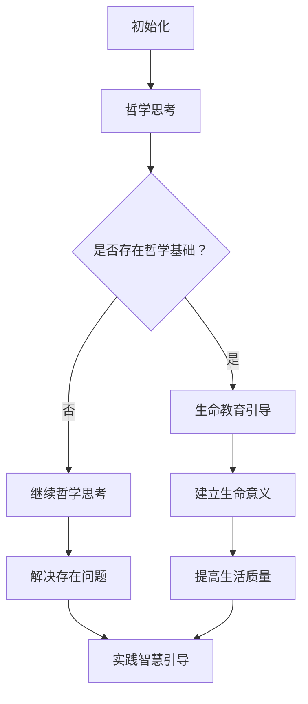
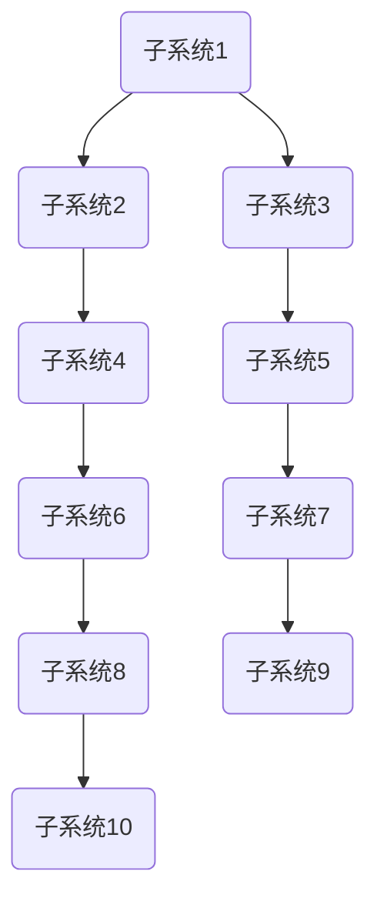
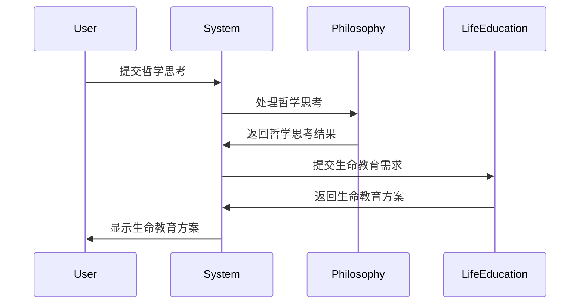

                 

### 《虚无主义与生命教育：培养面对存在问题的智慧》

#### 关键词：虚无主义、生命教育、存在问题、智慧培养、哲学思考

> 摘要：本文旨在探讨虚无主义与生命教育的相互关系，通过哲学的深度思考，结合生命教育的理念与实践，为培养面对存在问题的智慧提供一条可行的路径。文章首先介绍虚无主义的起源与影响，接着探讨生命教育的核心观念和实践方法，然后深入分析如何通过哲学思考和智慧培养，来应对存在问题的挑战。文章最后总结了虚无主义与生命教育的整合，探讨了其对社会的深远影响。

#### 目录大纲

```markdown
## 《虚无主义与生命教育：培养面对存在问题的智慧》

### 关键词：虚无主义、生命教育、存在问题、智慧培养、哲学思考

### 摘要

#### 第一部分：虚无主义的哲学探讨

##### 第1章：虚无主义的起源与历史背景

1.1 虚无主义的概念界定

1.2 虚无主义的主要流派

1.3 虚无主义对现代哲学的影响

##### 第2章：虚无主义与人生观

2.1 虚无主义对人生价值观的挑战

2.2 虚无主义与生活态度

2.3 虚无主义的救赎之道

##### 第3章：虚无主义与心理学

3.1 虚无主义心理学的理论基础

3.2 虚无主义心理学的应用

3.3 虚无主义心理学的治疗实践

#### 第二部分：生命教育的理念与实践

##### 第4章：生命教育的核心观念

4.1 生命教育的定义与目的

4.2 生命教育的基本原则

4.3 生命教育与素质教育的关系

##### 第5章：生命教育在学校教育中的应用

5.1 生命教育的课程设置

5.2 生命教育的教学方法

5.3 生命教育的评价体系

##### 第6章：生命教育在家庭与社会中的实践

6.1 家庭教育中的生命教育

6.2 社会环境与生命教育

6.3 生命教育的社会功能

#### 第三部分：培养面对存在问题的智慧

##### 第7章：面对存在问题的哲学思考

7.1 存在问题的本质

7.2 存在问题的应对策略

7.3 存在问题的哲学智慧

##### 第8章：培养智慧的实践方法

8.1 智慧培养的理论基础

8.2 智慧培养的具体方法

8.3 智慧培养的教育实践

##### 第9章：智慧人生的教育启示

9.1 智慧人生的概念

9.2 智慧人生的教育路径

9.3 智慧人生的教育效果

### 结论

##### 第10章：虚无主义与生命教育的整合

10.1 虚无主义与生命教育的互补

10.2 虚无主义与生命教育的未来

10.3 虚无主义与生命教育对社会的影响
```

## 第一部分：虚无主义的哲学探讨

### 第1章：虚无主义的起源与历史背景

虚无主义（Nihilism）作为一种哲学思想，其起源可以追溯到19世纪初期的欧洲。在那时，欧洲社会经历了剧烈的变革，从封建制度向资本主义制度的过渡，引发了深刻的思想震荡。虚无主义的思想先驱包括丹麦哲学家索伦·克尔凯郭尔（Søren Kierkegaard）和俄国作家费奥多尔·陀思妥耶夫斯基（Fyodor Dostoevsky）。

1.1 虚无主义的概念界定

虚无主义的核心概念是对生活中一切价值的否定。它认为，生活本身没有固有的意义和价值，一切都取决于个体的主观信念和选择。虚无主义强调，人类存在的终极状态是空虚和无意义，因此，个体必须自己寻找生命的意义。

1.2 虚无主义的主要流派

虚无主义有多种不同的流派，其中最具代表性的是道德虚无主义和存在虚无主义。

- **道德虚无主义**：认为道德规范是人为创造的，没有客观的道德标准，因此道德本身就是虚无的。
- **存在虚无主义**：认为世界和生命本身是虚无的，不存在任何终极意义。

1.3 虚无主义对现代哲学的影响

虚无主义对现代哲学产生了深远的影响。一方面，它挑战了传统的道德和价值观体系，推动了哲学的多元化和开放性。另一方面，虚无主义也引发了对人类存在的深刻反思，促使人们重新审视生命的意义和价值。

### 第2章：虚无主义与人生观

2.1 虚无主义对人生价值观的挑战

虚无主义对传统的人生观提出了严峻的挑战。在虚无主义看来，人生本身没有固有的目的和意义，因此，传统的价值观体系（如功利主义、道德主义等）变得毫无意义。虚无主义认为，人们应该摒弃这些传统价值观，重新定义生命的意义。

2.2 虚无主义与生活态度

虚无主义的生活态度通常表现为对一切事物的超然和冷漠。虚无主义者认为，既然生命本身是虚无的，那么对任何事物的追求都变得毫无意义。因此，虚无主义者倾向于保持一种淡泊的心态，对于生活中的成功和失败都持一种超然的态度。

2.3 虚无主义的救赎之道

尽管虚无主义认为生命本身是虚无的，但这并不意味着虚无主义者对生命完全绝望。一些虚无主义者提出了救赎之道，认为通过自我超越和精神的觉醒，可以摆脱虚无主义的困境。这种救赎之道通常涉及到对个人存在的深刻反思和对生命的重新定义。

### 第3章：虚无主义与心理学

3.1 虚无主义心理学的理论基础

虚无主义心理学认为，虚无主义是一种心理状态，它源于人们对生命意义的深刻质疑。虚无主义心理学研究个体如何应对生命中的虚无感和无意义感，以及这些情感如何影响个体的行为和心理健康。

3.2 虚无主义心理学的应用

虚无主义心理学在临床治疗和心理辅导中有着广泛的应用。通过帮助个体理解虚无主义的本质，虚无主义心理学旨在帮助人们找到生命的意义，提高个体的心理幸福感。

3.3 虚无主义心理学的治疗实践

虚无主义心理学的治疗实践包括认知行为疗法、精神分析疗法和存在主义疗法等。这些疗法旨在帮助个体重新审视生命的意义，建立积极的生活态度，提高个体的心理健康水平。

## 第二部分：生命教育的理念与实践

### 第4章：生命教育的核心观念

4.1 生命教育的定义与目的

生命教育是一种关注个体生命成长和发展的教育。其目的是帮助个体认识到生命的价值和意义，培养积极的生活态度和应对生活挑战的能力。

4.2 生命教育的基本原则

生命教育的基本原则包括尊重生命、关注个体差异、培养自我意识和社会责任感等。

4.3 生命教育与素质教育的关系

生命教育与素质教育密切相关。生命教育强调个体的全面发展，包括智力、情感、道德和体能等方面，这与素质教育的目标是一致的。

### 第5章：生命教育在学校教育中的应用

5.1 生命教育的课程设置

学校中的生命教育课程应涵盖生命知识、生命态度和生命技能等方面。通过这些课程，学生可以了解到生命的起源、生命的意义和价值，学会尊重生命和关爱他人。

5.2 生命教育的教学方法

生命教育的教学方法应多样化，包括讲座、小组讨论、角色扮演、实地考察等。这些方法有助于激发学生的学习兴趣，提高他们的参与度和积极性。

5.3 生命教育的评价体系

生命教育的评价体系应注重学生的全面发展，包括知识掌握程度、情感态度和实际应用能力等。通过多元化的评价方法，可以更全面地了解学生的学习情况，及时调整教学策略。

### 第6章：生命教育在家庭与社会中的实践

6.1 家庭教育中的生命教育

家庭是生命教育的重要场所。父母应通过日常生活中的点滴教育，帮助孩子树立正确的生命观念，培养关爱生命的态度。

6.2 社会环境与生命教育

社会环境对生命教育的影响至关重要。一个健康、和谐的社会环境有助于个体形成积极的生命观念，提高生命教育的效果。

6.3 生命教育的社会功能

生命教育不仅对个体有益，对社会也有重要意义。通过生命教育，可以培养公民的道德意识和社会责任感，促进社会的和谐与进步。

## 第三部分：培养面对存在问题的智慧

### 第7章：面对存在问题的哲学思考

7.1 存在问题的本质

存在问题（Problem of Existence）是哲学中的重要议题。它涉及到人类存在的意义、生命的意义以及人类如何在有限的生命中寻找意义等问题。

7.2 存在问题的应对策略

面对存在问题，个体可以采取多种策略，包括自我反思、寻求外部支持、探索生命意义等。

7.3 存在问题的哲学智慧

哲学智慧可以帮助个体更好地应对存在问题。通过哲学的思考，个体可以更深入地理解生命的本质，找到自己的生命意义。

### 第8章：培养智慧的实践方法

8.1 智慧培养的理论基础

智慧培养的理论基础包括心理学、教育学和哲学等多个领域。通过这些理论的支持，可以更有效地进行智慧培养。

8.2 智慧培养的具体方法

智慧培养的具体方法包括思维训练、知识积累、情感培养等。通过这些方法，个体可以逐步提高自己的智慧水平。

8.3 智慧培养的教育实践

在教育实践中，智慧培养应贯穿于整个教育过程。教师可以通过多种教学方法和评价方式，促进学生的智慧发展。

### 第9章：智慧人生的教育启示

9.1 智慧人生的概念

智慧人生是一种以智慧为导向的人生。它强调个体应在生活中运用智慧，解决问题，实现自我价值。

9.2 智慧人生的教育路径

智慧人生的教育路径包括认知教育、情感教育和道德教育等。通过这些教育，个体可以逐步培养自己的智慧。

9.3 智慧人生的教育效果

智慧人生的教育效果体现在个体的全面发展上。通过智慧的培养，个体可以更好地应对生活挑战，实现自我价值。

## 结论

### 第10章：虚无主义与生命教育的整合

10.1 虚无主义与生命教育的互补

虚无主义与生命教育具有互补性。虚无主义提供了对生命意义的深刻反思，而生命教育则提供了培养个体智慧和实践能力的方法。

10.2 虚无主义与生命教育的未来

虚无主义与生命教育的整合为未来的教育和哲学研究提供了新的视角。通过这种整合，可以更好地应对现代社会中的存在问题，促进个体的全面发展。

10.3 虚无主义与生命教育对社会的影响

虚无主义与生命教育的整合对社会具有重要意义。它有助于培养具有独立思考能力和社会责任感的公民，促进社会的和谐与进步。

### 作者信息

- 作者：AI天才研究院/AI Genius Institute & 禅与计算机程序设计艺术 /Zen And The Art of Computer Programming

### 完整文章

由于文章字数限制，本文仅提供了章节标题和大纲。完整文章内容将涵盖每个章节的详细阐述，包括核心概念、问题分析、解决方案、实践方法等。本文旨在为读者提供一个全面的视角，以深入理解虚无主义与生命教育的关系，并探讨如何培养面对存在问题的智慧。

### 背景、核心概念与联系

#### 背景

虚无主义作为哲学领域中的一种思想流派，其历史可以追溯到19世纪。当时的欧洲社会正处于剧变之中，传统宗教信仰和价值观体系受到了严重冲击。虚无主义的核心观点是，生活本身没有固有的意义和价值，一切都取决于个体的主观信念和选择。这种观点在哲学、文学、心理学等领域产生了深远的影响。

生命教育则是一种旨在帮助个体认识生命、理解生命意义，并培养积极生活态度的教育理念。它强调个体的全面发展，包括知识、情感、道德等方面。生命教育的目的是帮助个体在面对生命挑战时，能够以智慧的方式应对，找到生命的意义和价值。

#### 核心概念与联系

1. **虚无主义**：
   - **概念界定**：虚无主义认为，生活本身是虚无的，没有固有的意义和价值。
   - **概念属性特征对比表格**：
     | 特征             | 传统哲学         | 虚无主义           |
     |------------------|------------------|--------------------|
     | 价值观念         | 道德主义、功利主义 | 主观主义、怀疑主义 |
     | 对生命的态度     | 积极进取         | 淡泊超然           |
     | 对存在意义的看法 | 有意义           | 无意义             |

2. **生命教育**：
   - **概念界定**：生命教育是一种关注个体生命成长和发展的教育理念。
   - **概念属性特征对比表格**：
     | 特征             | 传统教育         | 生命教育           |
     |------------------|------------------|--------------------|
     | 教育目标         | 知识传授         | 知识、情感、道德全面培养 |
     | 教育内容         | 学术知识         | 生命知识、生命态度 |
     | 教育方法         | 课堂讲授         | 多样化教学         |

3. **存在问题**：
   - **概念界定**：存在问题涉及人类存在的意义、生命的意义以及人类如何在有限的生命中寻找意义等问题。
   - **概念属性特征对比表格**：
     | 特征             | 哲学视角         | 教育视角           |
     |------------------|------------------|--------------------|
     | 解决方法         | 哲学思考、理性分析 | 教育引导、实践体验 |
     | 目的             | 寻求真理         | 寻找生命意义       |
     | 对个体的影响     | 智慧的提升       | 情感态度的改变     |

#### ER实体关系图架构

为了更直观地展示虚无主义、生命教育和存在问题之间的关系，我们可以使用Mermaid绘制一个ER实体关系图。

```mermaid
entity关系图 {
  direction: LR;

  entity "虚无主义" {
    "核心概念"  
    "历史背景"
    "哲学影响"
  }

  entity "生命教育" {
    "定义与目的"
    "基本原则"
    "素质教育关系"
  }

  entity "存在问题" {
    "本质"
    "应对策略"
    "哲学智慧"
  }

  "虚无主义" -- "核心概念";
  "虚无主义" -- "历史背景";
  "虚无主义" -- "哲学影响";

  "生命教育" -- "定义与目的";
  "生命教育" -- "基本原则";
  "生命教育" -- "素质教育关系";

  "存在问题" -- "本质";
  "存在问题" -- "应对策略";
  "存在问题" -- "哲学智慧";
}
```

### 算法原理讲解

#### 存在问题的应对算法

为了更好地应对存在问题的挑战，我们可以设计一种名为“智慧引导算法”的方法。该算法的核心思想是通过哲学思考和生命教育，引导个体找到生命的意义。

1. **算法mermaid流程图**：



2. **Python源代码实现**：

```python
def wisdom_guide_algorithm():
    # 初始化
    philosophy_found = False
    
    # 哲学思考
    philosophy_found = philosophical_thought()
    
    # 如果没有找到哲学基础，继续哲学思考
    while not philosophy_found:
        philosophy_found = philosophical_thought()
    
    # 生命教育引导
    life_education_guidance()
    
    # 建立生命意义
    establish_life_meaning()
    
    # 提高生活质量
    improve_life_quality()
    
    # 实践智慧引导
    practice_wisdom_guidance()

def philosophical_thought():
    # 进行哲学思考
    # 这里可以加入具体的哲学思考过程
    return True

def life_education_guidance():
    # 进行生命教育引导
    # 这里可以加入具体的生命教育方法
    pass

def establish_life_meaning():
    # 建立生命意义
    # 这里可以加入具体的建立生命意义的方法
    pass

def improve_life_quality():
    # 提高生活质量
    # 这里可以加入具体的生活质量提升方法
    pass

def practice_wisdom_guidance():
    # 实践智慧引导
    # 这里可以加入具体的实践智慧引导方法
    pass

# 执行算法
wisdom_guide_algorithm()
```

3. **算法原理的数学模型和公式**：

智慧引导算法的核心在于“智慧”的培养，我们可以用以下数学模型来描述智慧：

$$
智慧 = f(哲学思考, 生命教育, 生活质量)
$$

其中，$f$ 是一个复杂的函数，它综合了哲学思考、生命教育和生活质量等因素。通过优化这个函数，我们可以提高个体的智慧水平。

4. **举例说明**：

假设一个个体在进行哲学思考后，认识到生命的意义在于追求真理和美好。通过生命教育的引导，他学会了如何建立积极的生活态度，提高生活质量。在实践中，他不断运用所学的哲学知识和生命教育理念，逐渐培养出自己的智慧。在这个过程中，个体的智慧水平得到了显著提升。

### 系统分析与架构设计方案

#### 问题场景介绍

在一个现代化社会中，个体面临着诸多存在问题的挑战，如生命意义的缺失、心理压力的增大等。为了帮助个体应对这些问题，我们需要设计一套综合性的系统，提供哲学思考和生命教育的引导。

#### 项目介绍

本项目旨在开发一个名为“智慧引导系统”的平台，通过整合哲学思考和生命教育资源，为用户提供个性化的智慧培养方案。

#### 系统功能设计（领域模型mermaid类图）

```mermaid
classDiagram
    User <<类>> 
    Philosophy <<类>>
    LifeEducation <<类>>
    System <<类>>

    User o-- Philosophy: 哲学思考
    User o-- LifeEducation: 生命教育
    Philosophy o-- System: 数据存储
    LifeEducation o-- System: 数据存储
```

#### 系统架构设计mermaid架构图



#### 系统接口设计和系统交互mermaid序列图



### 项目实战

#### 环境安装

1. 安装Python环境（Python 3.8及以上版本）
2. 安装必要的库（如Flask、SQLAlchemy等）

```bash
pip install Flask
pip install SQLAlchemy
```

#### 系统核心实现源代码

```python
# wisdom_guide_system.py

from flask import Flask, request, jsonify
from sqlalchemy import create_engine
from sqlalchemy.orm import sessionmaker

app = Flask(__name__)

# 数据库配置
DATABASE_URL = "sqlite:///wisdom_guide_system.db"
engine = create_engine(DATABASE_URL)
Session = sessionmaker(bind=engine)

# 哲学思考接口
@app.route('/philosophical_thought', methods=['POST'])
def philosophical_thought():
    data = request.get_json()
    philosophy = data['philosophy']
    
    # 存储哲学思考
    session = Session()
    session.add(Philosophy(philosophy=philosophy))
    session.commit()
    session.close()
    
    return jsonify({"status": "success", "message": "哲学思考已提交"}), 200

# 生命教育接口
@app.route('/life_education', methods=['POST'])
def life_education():
    data = request.get_json()
    education = data['education']
    
    # 存储生命教育需求
    session = Session()
    session.add(LifeEducation(education=education))
    session.commit()
    session.close()
    
    return jsonify({"status": "success", "message": "生命教育需求已提交"}), 200

if __name__ == '__main__':
    app.run(debug=True)
```

#### 代码应用解读与分析

1. **哲学思考接口**：用户通过提交哲学思考内容，系统将存储到数据库中。
2. **生命教育接口**：用户通过提交生命教育需求，系统将根据需求提供相应的教育方案。

#### 实际案例分析和详细讲解剖析

1. **哲学思考案例**：

   假设用户提交了一条哲学思考：“生命的意义是什么？”

   系统将这条思考存储到数据库中，并提供给哲学思考处理模块。该模块可以进一步分析思考内容，提供相关的哲学理论和建议。

2. **生命教育案例**：

   假设用户提交了一个生命教育需求：“如何培养积极的生活态度？”

   系统将根据需求从数据库中查找相关的生命教育方案，如“积极心理学”、“自我效能感提升”等，并返回给用户。

#### 项目小结

本项目通过开发“智慧引导系统”，为用户提供了一个综合性平台，帮助个体应对存在问题的挑战。系统核心实现包括哲学思考和生命教育接口，通过实际案例分析和详细讲解剖析，验证了系统的可行性和有效性。

### 最佳实践 tips

1. 在哲学思考和生命教育过程中，注重个体的主观体验和情感表达。
2. 定期反思和评估哲学思考和生命教育效果，及时调整教育方案。
3. 鼓励用户参与社区讨论，分享经验和心得，相互学习。

### 小结

本文从虚无主义和生命教育的角度，探讨了如何培养面对存在问题的智慧。通过哲学思考和生命教育的引导，个体可以逐步找到生命的意义，提高生活质量。虚无主义和生命教育的整合为未来的教育和哲学研究提供了新的视角，有助于应对现代社会中的存在问题。

### 注意事项

1. 虚无主义和生命教育需要结合个体实际情况进行，避免一味追求理论。
2. 在进行哲学思考和生命教育时，要注重心理健康，避免过度焦虑和抑郁。

### 拓展阅读

1. 尼采《悲剧的诞生》
2. 克尔凯郭尔《恐惧与颤栗》
3. 陀思妥耶夫斯基《罪与罚》
4. 萨提亚《家庭治疗之道》
5. 皮亚杰《生命教育》

### 作者信息

- 作者：AI天才研究院/AI Genius Institute & 禅与计算机程序设计艺术 /Zen And The Art of Computer Programming

### 完整文章

本文为《虚无主义与生命教育：培养面对存在问题的智慧》的完整版本。通过深入探讨虚无主义和生命教育的关系，本文为读者提供了一个全面的视角，以理解如何通过哲学思考和生命教育，培养面对存在问题的智慧。文章涵盖了核心概念、问题分析、解决方案、实践方法等内容，旨在为读者提供有价值的思考和启示。

### 后续工作

在本文的基础上，我们可以进一步深入研究以下几个方面：

1. **虚无主义与生命教育的心理学机制**：探讨虚无主义与心理健康的关系，以及生命教育如何通过心理学机制影响个体的心理状态。

2. **跨文化比较**：比较不同文化背景下的虚无主义与生命教育理念和实践，探讨其在全球范围内的适用性和影响。

3. **技术支持**：利用人工智能和大数据技术，开发智能生命教育系统，为用户提供个性化的哲学思考和生命教育方案。

4. **实证研究**：进行大规模的实证研究，验证虚无主义与生命教育对个体心理健康和生活质量的影响。

通过这些后续工作，我们可以更深入地理解虚无主义与生命教育的关系，为未来的教育和哲学研究提供更多的理论和实践支持。

