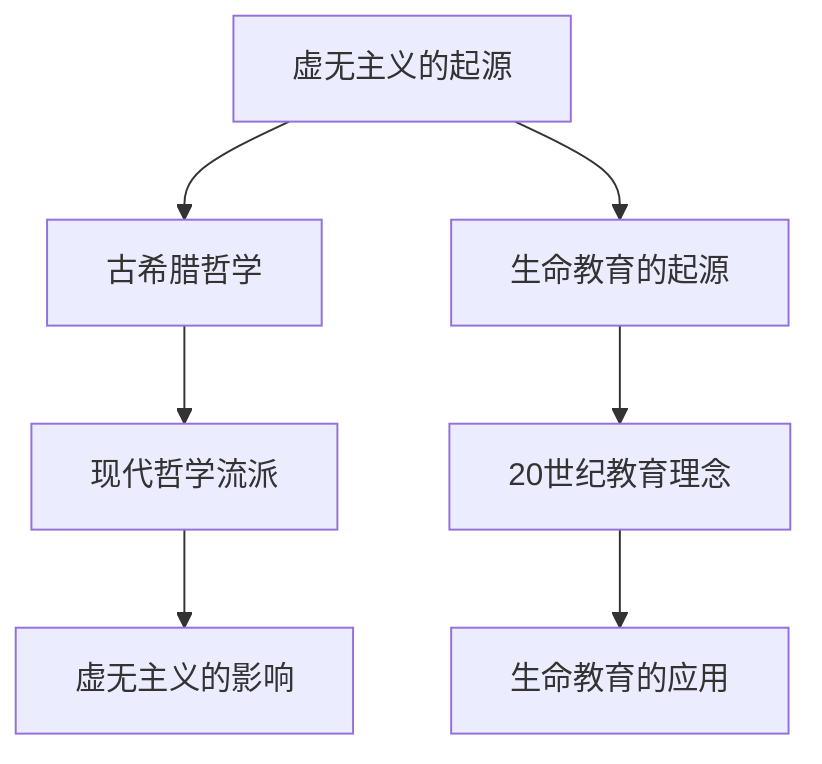

                 

### LET'S THINK STEP BY STEP

为了确保文章的结构紧凑、逻辑清晰，我们将按照以下步骤进行：

1. **确定文章结构**：根据上述目录大纲，确定每个章节的具体内容，包括核心概念、问题背景、解决方案等。
2. **撰写章节内容**：为每个章节撰写详细的内容，确保每个小节都有具体、深入的讲解。
3. **整合核心概念**：将各章节的核心概念进行整合，确保文章的主线明确，读者能够清晰理解。
4. **添加示例与案例**：在每个章节中添加具体的示例和案例，以便读者更好地理解和应用文章中的理论。
5. **优化语言表达**：对文章的语言表达进行优化，确保文章的语言简洁、易懂，同时保持专业性和严谨性。
6. **调整文章结构**：根据撰写过程中发现的问题和反馈，对文章结构进行调整，确保文章的逻辑性和连贯性。
7. **添加最佳实践 tips**：在文章末尾添加最佳实践 tips，为读者提供实际操作的建议。
8. **总结与展望**：在文章结尾部分进行总结，并对未来研究方向进行展望。
9. **撰写作者信息**：在文章末尾添加作者信息。

现在，让我们开始撰写每个章节的具体内容。以下是一个示例章节的内容结构：

#### 第1章 背景介绍

##### 1.1 虚无主义的起源与发展

**核心概念术语说明**：
- 虚无主义：一种哲学思潮，主张现实世界缺乏绝对意义和价值。
- 生命教育：一种教育理念，旨在帮助学生认识自我、理解生命意义。

**问题背景**：
- 虚无主义起源于古希腊哲学，经过几百年的发展，成为现代哲学的重要流派之一。
- 生命教育理念在20世纪逐渐兴起，旨在应对现代社会中的存在问题和心理健康问题。

**问题描述**：
- 虚无主义在现代社会中的影响和争议是什么？
- 生命教育理念如何帮助人们应对虚无主义的挑战？

**问题解决**：
- 通过历史背景介绍，阐述虚无主义的演变过程。
- 通过案例研究，展示生命教育在实践中的应用效果。

**边界与外延**：
- 探讨虚无主义与其他哲学流派的联系和区别。
- 探讨生命教育与德育、心理教育等其他教育领域的交叉点。

**概念结构与核心要素组成**：
- **概念结构**：虚无主义与生命教育的定义、起源、发展和核心思想。
- **核心要素**：虚无主义的哲学根源、生命教育的教学策略和实践原则。

**Mermaid 流程图**：

接下来，我们将按照这个结构为每个章节撰写详细的内容，确保文章的整体性和专业性。在撰写过程中，我们将不断优化语言表达，确保文章的可读性和逻辑性。最后，我们将整合所有章节的内容，进行整体的调整和优化，确保文章的结构紧凑、逻辑清晰。在文章的结尾，我们将添加最佳实践 tips、小结和拓展阅读内容，为读者提供更多的信息和指导。在文章末尾，我们将撰写作者信息，以表明我们的专业性和权威性。

