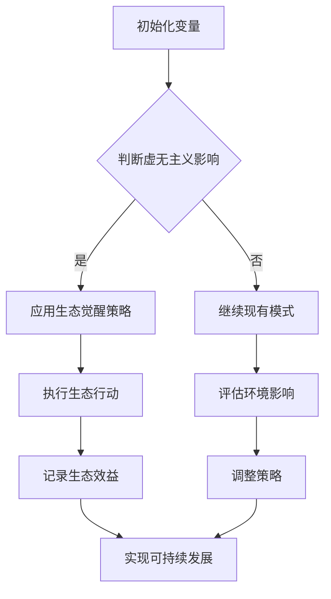
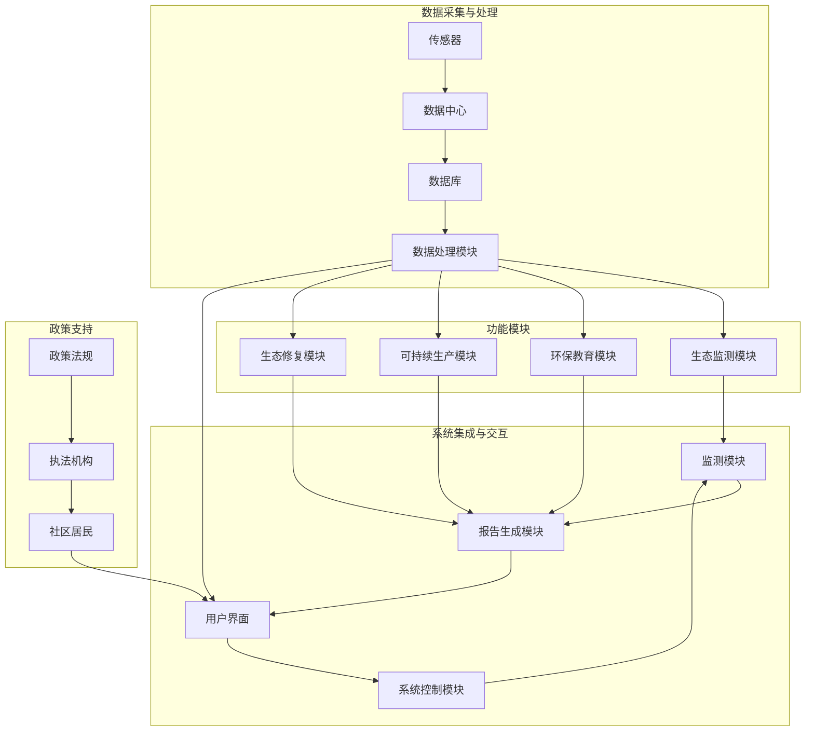
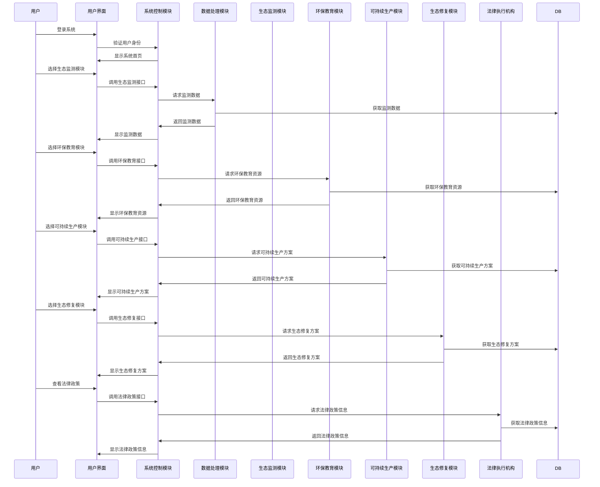

                 

### 1.1.1 虚无主义的起源与发展

虚无主义作为一种哲学思想，其起源可以追溯到古代希腊。当时的哲学家如赫拉克利特（Heraclitus）和埃利亚学派（Eleatic School）的创始人芝诺（Zeno）等人，已经在他们的哲学理论中体现了虚无主义的影子。例如，芝诺的悖论试图通过逻辑推理来质疑事物的存在，暗示了事物可能是虚幻不实的。

到了中世纪，虚无主义的理念在基督教哲学中也有所体现。尤其是在面对苦难和罪恶时，一些神学家开始质疑上帝的存在和人类的终极目的，从而产生了对现实世界的怀疑和疏离感。

然而，现代虚无主义的哲学体系主要是由德国哲学家尼采（Friedrich Nietzsche）在19世纪末提出的。尼采通过批判西方文化中的道德价值观，揭示了“上帝已死”的事实，他认为人类需要建立自己的价值体系。尼采的虚无主义强调了个体对生命的肯定和对力量的追求，但同时也提出了对传统的挑战。

20世纪，虚无主义在存在主义哲学中得到了进一步的发展。萨特（Jean-Paul Sartre）、加缪（Albert Camus）等存在主义者认为，人类生活在一个没有预设意义的世界中，个体的存在本身就是意义。他们在对荒谬的探索中，试图找到人类存在的价值和意义。

虚无主义在不同的历史时期和文化背景下，有着不同的表现形式和内涵。它既可以是悲观和消极的，也可以是富有批判精神和创造力的。虚无主义的核心在于对现实世界的怀疑和对传统价值的否定，而它的发展与演变则与人类对自身和世界的认识过程密切相关。

### 1.1.2 虚无主义的哲学内涵

虚无主义的哲学内涵丰富且复杂，它不仅仅是一种否定现实存在的思想，更是一种对人生意义、价值、道德和社会规范的深刻质疑。在探讨虚无主义的哲学内涵时，可以从以下几个方面进行详细分析。

首先，虚无主义的核心观点是“无意义论”。它认为世界本身没有固有的意义，生命没有预设的目的。这种观点源于对人类存在本质的深入反思。例如，尼采在其哲学中提出了“上帝已死”的观点，认为传统的宗教信仰和道德观念已经失去了其权威性，人类需要自己寻找生命的意义。他认为，虚无主义是一种对传统的解放，是对旧有价值观的挑战。

其次，虚无主义强调“自由意志”的重要性。尼采的虚无主义哲学中，自由意志成为核心概念之一。他认为，人应该摆脱外在的束缚，勇敢地面对生活的荒谬和不确定性，通过自我超越来创造自己的价值。这种观点鼓励个体摆脱传统道德和宗教的束缚，追求自我实现和力量。

再次，虚无主义对“存在与虚无”的探讨具有深刻的意义。存在主义者如萨特和加缪等认为，虚无主义揭示了人类存在的真实状态。萨特在其哲学作品中提出了“存在先于本质”的观点，认为人首先是存在的，然后才定义自己。这意味着，人类的自由意志是首要的，而世界本身并没有预先设定的意义。加缪则通过探讨“荒谬”的概念，试图理解人类在无意义的世界中如何找到生活的意义。

此外，虚无主义还涉及到对“绝望”和“希望”的辩证关系。虽然虚无主义认为世界和生命本身没有固有的意义，但这并不意味着人类应该放弃希望。相反，虚无主义鼓励个体通过积极的态度和行动来创造自己的意义。例如，加缪在其作品中通过描写主人公在荒谬世界中寻找意义的努力，展示了希望的力量。

最后，虚无主义对“社会规范”和“道德价值”进行了深刻的批判。虚无主义者认为，传统的道德规范往往是由权力和统治阶层制定的，它们限制了人的自由和创造力。尼采的“超人哲学”试图打破这种束缚，鼓励个体追求真正的自我实现。

总之，虚无主义的哲学内涵广泛且深刻，它不仅仅是一种否定现实的思想，更是一种对人类存在本质的深刻反思。通过对“无意义论”、“自由意志”、“存在与虚无”、“绝望与希望”以及“社会规范与道德价值”的探讨，虚无主义为人们提供了另一种理解世界和生命的方式。这种思想不仅在哲学领域具有深远的影响，也在文学、艺术和现代社会思潮中留下了深刻的印记。

### 1.1.3 虚无主义对现代社会的冲击

虚无主义对现代社会产生了深远的影响，其冲击不仅体现在哲学和文学领域，还对个人价值观、社会结构和文化发展产生了显著的冲击。以下是虚无主义对现代社会的一些具体影响：

首先，在哲学领域，虚无主义对传统哲学体系的质疑和挑战，导致了哲学思想的多元化。传统哲学体系往往依赖于预设的真理和道德基础，而虚无主义则打破了这些基础，促使哲学家们重新思考存在的意义和人类的价值。这种挑战推动了现代哲学的发展，促进了哲学思想的创新和变革。

其次，虚无主义在文学和艺术领域产生了巨大的影响。许多现代文学作品和艺术作品都反映了虚无主义的思想，如卡夫卡（Franz Kafka）的小说、尼采（Friedrich Nietzsche）的诗作和电影《荒蛮之地》（The Wild Ones）。这些作品通过对人类孤独、绝望和意义的探讨，揭示了现代社会中个体的心理状态和社会现实。虚无主义激发了艺术家们对传统美学观念的质疑，推动了现代艺术的发展。

第三，虚无主义对个人价值观产生了深远的影响。虚无主义鼓励个体摆脱传统道德和宗教的束缚，追求自我实现和自由。这种思想在现代社会中激发了个人主义和自由主义的兴起，促进了个人自主性和创造力的发挥。然而，虚无主义也可能导致个人价值观的崩溃和生活的迷失，使个体陷入无意义和绝望的困境。

第四，虚无主义对社会结构产生了挑战。在传统的社会结构中，权力和权威往往建立在预设的道德和信仰基础上。虚无主义质疑这些基础，促使社会对权力和权威进行反思和重新定义。这种挑战推动了社会改革和民主化进程，但也带来了社会动荡和不确定性的增加。

第五，虚无主义对文化发展产生了深远的影响。虚无主义鼓励对传统文化的批判和重构，推动了现代文化和多元文化的兴起。这种思想促进了文化多样性和创新，但也可能导致文化的碎片化和失范。虚无主义激发了对文化本质和价值的深刻探讨，推动了文化领域的变革和发展。

总之，虚无主义对现代社会产生了多重影响。它在哲学、文学、个人价值观、社会结构和文化发展等方面，都带来了深刻的变革和创新。然而，虚无主义也带来了挑战和问题，需要个体和社会共同努力来应对和解决。

### 1.2.1 生态危机的定义与表现

生态危机是指由于人类活动对自然环境的破坏和干扰，导致生态系统的功能受损，生物多样性减少，以及对人类健康和福祉产生负面影响的全球性现象。生态危机的定义涉及多个方面，包括环境退化、物种灭绝、资源枯竭和气候变化等。

首先，环境退化是生态危机的一个重要表现。随着工业化和城市化的发展，大量的自然资源被过度开采和消耗，导致土壤、水源和大气污染等问题日益严重。例如，工业化过程中产生的有毒废气、废水和固体废物，不仅污染了自然环境，还威胁到了人类的健康。

其次，物种灭绝是生态危机的另一个显著标志。人类活动导致的栖息地破坏、环境污染和非法狩猎等原因，使得许多物种面临灭绝的威胁。据估计，目前全球有超过四分之一的物种正面临威胁，其中很多是生态系统的重要组成部分，如鸟类、哺乳动物和植物。

资源枯竭也是生态危机的一个重要表现。人类对自然资源的过度依赖和滥用，导致了资源的迅速枯竭。例如，水资源的过度使用和污染，导致了许多地区的水资源短缺；森林资源的过度砍伐，使得许多森林生态系统濒临崩溃；矿产资源的过度开采，导致了资源的枯竭和生态环境的破坏。

此外，气候变化是生态危机的一个重要体现。人类活动导致的温室气体排放，加速了全球气候变暖的过程，导致了极端天气事件的增多，如暴雨、干旱、飓风等。气候变化不仅影响了生态系统，还对农业生产、水资源管理和人类健康产生了重大影响。

总之，生态危机的定义与表现是多方面的，它不仅涉及环境的破坏和资源的枯竭，还涉及物种的灭绝和全球气候的变化。生态危机的严重性要求全球社会共同行动，采取有效的措施来应对和缓解这一挑战。

### 1.2.2 人类活动对生态环境的影响

人类活动对生态环境的影响是生态危机的主要原因之一，这些活动涵盖了多个方面，包括工业化、城市化、农业活动、能源消耗等。以下是这些活动对生态环境的具体影响：

首先，工业活动是生态环境污染的主要来源。工业生产过程中产生的大量废气、废水和固体废物，对空气、水和土壤造成了严重污染。例如，燃煤发电厂和化工厂排放的二氧化硫和氮氧化物，会导致酸雨，进而破坏森林和湖泊的生态系统。此外，工业废物中的重金属和有毒化学物质，会渗入土壤和地下水，对人类健康造成长期威胁。

其次，城市化进程加速了生态环境的破坏。城市扩张导致大量自然栖息地的破坏，野生动物失去了生存的空间。同时，城市人口密集，生活污水和工业废水的排放量巨大，如果不经过适当处理，会对河流和湖泊造成严重污染。此外，城市热岛效应加剧了气候变化，影响了周边地区的生态系统。

农业活动也是生态环境破坏的重要因素。传统的农业生产方式，如过度施肥和灌溉，会导致土壤退化、地下水污染和河流富营养化。现代农业的机械化生产方式，虽然提高了产量，但也带来了农药和化肥的过量使用，对环境和人体健康造成了负面影响。同时，森林砍伐和草原退化，导致了生物多样性的减少和生态系统的失衡。

能源消耗是另一个对生态环境有重大影响的人类活动。化石燃料的燃烧是温室气体排放的主要来源，这些气体会加剧全球气候变暖，导致极端天气事件增多，影响农业、水资源和生态系统。同时，化石燃料的开采和运输过程中，也会对自然景观和生物栖息地造成破坏。

最后，人类活动对生物多样性的影响不可忽视。栖息地破坏、环境污染和气候变化等因素，导致了许多物种的灭绝和生态系统的退化。生物多样性的减少不仅影响了生态系统的稳定性和功能，还对人类的经济和社会生活产生了负面影响。

总之，人类活动对生态环境的影响是多方面且深远的，它不仅导致了环境污染和生态破坏，还对全球气候变化和生物多样性产生了重大影响。解决生态危机需要从源头上减少这些不利影响，采取可持续的发展方式，保护我们共同的家园。

### 1.2.3 生态危机的全球挑战

生态危机带来的全球性挑战是多层次、多维度的，它不仅影响地球的自然环境，还对人类社会、经济和未来产生了深远的影响。以下是生态危机的全球挑战的具体表现：

首先，气候变化是生态危机最显著的全球挑战之一。全球温室气体排放导致大气中的二氧化碳浓度升高，进而引起全球气温上升。气候变化引发了极端天气事件，如热浪、暴雨、干旱和飓风等，这些极端天气不仅破坏了农业生产，还威胁到了人类的生命安全。例如，全球变暖导致的海平面上升，威胁沿海城市和岛屿国家的生存，加剧了全球水资源短缺和粮食安全问题。

其次，生物多样性的丧失是生态危机的另一个重大挑战。人类活动导致的栖息地破坏、污染和气候变化等因素，使许多物种面临灭绝的威胁。生物多样性的减少不仅破坏了生态系统的平衡，还削弱了生态系统的恢复力和稳定性。例如，热带雨林的破坏导致了大量动植物物种的消失，影响了全球碳循环和气候调节功能。

此外，水资源短缺也是生态危机带来的重要挑战。随着人口增长和工业发展，对水资源的需求不断增加。然而，水资源的不合理开发和污染，导致了许多地区的水资源短缺。例如，全球有超过20亿人无法获得安全的饮用水，这不仅影响了人类健康，还限制了农业和工业的发展。

土地退化是生态危机的另一个全球性挑战。过度开垦、过度放牧和不当的土地管理，导致土壤肥力下降、沙漠化和荒漠化。这些因素不仅影响了农业生产，还加剧了土地的贫瘠和生态系统的退化。

最后，生态危机对社会经济的影响也不可忽视。环境污染和生态破坏导致了巨大的经济损失，如农业生产受损、渔业资源枯竭和旅游业收入减少。此外，生态危机还加剧了社会不平等，因为贫困地区和弱势群体往往更容易受到环境问题的影响。

总之，生态危机的全球挑战是多方面的，它不仅对自然环境造成了破坏，还对人类社会和经济产生了深远的影响。应对这些挑战需要全球社会的共同努力，采取综合性的措施，推动可持续发展和生态保护。

### 1.3.1 虚无主义对生态环境的影响

虚无主义作为一种哲学思想，其核心理念否定了现实存在的意义和价值，这对生态环境产生了深刻的负面影响。首先，虚无主义对人类行为的影响是显而易见的。由于否定存在的意义，一些人可能会对自己的行为缺乏责任感，对环境保护的重要性认识不足。这种态度导致了对自然资源的过度开采和滥用，从而加剧了生态危机。

其次，虚无主义对价值观的冲击进一步影响了人类对生态问题的关注。在传统价值观中，人类往往将自然界视为资源的源泉，而不是一个需要尊重和保护的生命系统。虚无主义削弱了这种责任感和尊重，使得人类更容易将环境问题视为次要问题，甚至忽视其严重性。

此外，虚无主义还可能导致社会结构和文化的瓦解，这进一步加剧了生态危机。例如，在虚无主义的影响下，社会规范和道德价值可能变得模糊和混乱，这导致了环境法律的执行不力和社会监督的缺失。这种社会环境不利于生态保护措施的实施和环境的可持续管理。

最后，虚无主义的思想还可能影响政策制定和执行。在虚无主义的影响下，决策者可能会对生态问题的长期影响缺乏关注，倾向于追求短期经济利益，这导致了环境政策的缺乏和执行不力。这种情况下，生态危机可能进一步恶化，对人类社会和自然环境造成更大的威胁。

总之，虚无主义对生态环境的影响是多方面的，它不仅改变了人类对自然的态度和行为，还削弱了社会对生态问题的关注和应对能力。要重建人与自然的和谐共生关系，需要克服虚无主义带来的负面影响，重新审视人类与自然的关系，并采取切实有效的措施来保护生态环境。

### 1.3.2 生态觉醒对虚无主义的挑战

生态觉醒作为一种全新的思想潮流，与虚无主义形成了鲜明的对比，并对后者构成了深刻的挑战。生态觉醒强调人类与自然的紧密联系，提倡可持续发展和生态保护，这与虚无主义所表达的消极、否定态度形成了强烈对比。

首先，生态觉醒对虚无主义的否定态度提出了质疑。生态觉醒认为，尽管现实世界存在许多问题和挑战，但通过积极行动和科学方法，人类可以解决这些问题，实现社会的可持续发展和人与自然的和谐共生。这种积极的态度与虚无主义对现实的消极否定形成了鲜明对立，揭示了虚无主义在应对现实问题方面的局限性。

其次，生态觉醒强调人类责任感和价值观的重塑，这对虚无主义价值观的崩溃提出了挑战。虚无主义往往导致个人和社会价值观的混乱，使人们失去对生活和未来的信心。而生态觉醒则强调人类作为地球居民的责任，倡导尊重自然、关爱环境和共同繁荣的价值观。这种价值观的重塑有助于克服虚无主义带来的消极影响，重建社会的道德和伦理基础。

此外，生态觉醒还推动了科学技术的进步和应用，这对虚无主义所主张的对传统的全盘否定提出了质疑。生态觉醒鼓励科学研究和创新，以解决生态问题和技术挑战。这种科学精神和技术创新与虚无主义对科学的怀疑态度形成了鲜明对比，揭示了虚无主义在科学技术领域的局限。

最后，生态觉醒通过具体的行动和项目，如生态修复、可再生能源利用和环保教育等，对虚无主义的理论和实践提出了有力挑战。这些实际行动展示了人类通过合作和努力可以改善环境、实现可持续发展，为虚无主义提供了有力的反驳证据。

总之，生态觉醒对虚无主义的挑战不仅体现在思想层面，还通过实际行动和价值观的倡导，对虚无主义进行了有力反驳。生态觉醒的兴起为重建人与自然的和谐共生关系提供了新的方向和动力，推动了社会对自然价值的重新认识和尊重。

### 1.3.3 重建人与自然的和谐共生关系的重要性

重建人与自然的和谐共生关系对于解决当前的生态危机具有至关重要的意义。首先，从生态学角度来看，地球是一个复杂的生态系统，各种生物和非生物因素相互依存、相互作用。人类作为生态系统的一部分，与自然环境的和谐关系是维持地球生态系统平衡和稳定的关键。当人类活动破坏了自然环境的平衡时，不仅会导致生态系统的退化，还会引发一系列连锁反应，如物种灭绝、生物多样性减少和气候变化等，这些都会对人类的生存和发展构成严重威胁。

其次，从社会学角度来看，人类社会的繁荣和稳定离不开健康的自然环境。许多资源和能源都依赖于自然环境，如水资源、森林资源和矿产资源。当自然环境受到污染和破坏时，这些资源将变得稀缺和不可持续，从而影响经济和社会的发展。此外，人类健康与自然环境密切相关，环境污染和生态破坏会引发一系列健康问题，如呼吸系统疾病、心血管疾病和癌症等，这些疾病不仅增加了医疗成本，还影响了劳动力的健康和生产力。

再次，从伦理学角度来看，人类作为地球的居民，有责任保护和尊重自然环境。自然不仅为人类提供了生存的基础，也是其他生物的家园。生态觉醒倡导的和谐共生关系体现了对自然尊重和保护的基本伦理原则。这种伦理观念的普及和践行，有助于提高人们的环保意识，形成全社会共同参与生态保护的良好氛围。

最后，从经济学角度来看，重建人与自然的和谐共生关系具有巨大的经济价值。可持续发展的理念强调在满足当前需求的同时，不损害后代满足其需求的能力。通过采取环保措施和推动绿色经济发展，可以创造新的就业机会，促进技术创新和产业升级，从而实现经济和社会的双重效益。此外，生态旅游、生态农业和可再生能源等领域的发展，也为经济增长提供了新的动力。

总之，重建人与自然的和谐共生关系不仅是应对生态危机的必要手段，也是实现社会可持续发展的关键。通过从生态学、社会学、伦理学和经济学等多方面入手，我们可以逐步实现人与自然的和谐共生，为未来创造一个更美好、更可持续的世界。

### 1.4.1 虚无主义的边界

虚无主义的边界主要涉及其哲学理念的实际应用范围及其对现实社会的潜在影响。虚无主义作为一种哲学思想，其核心是对存在意义的质疑和对传统价值观的否定。然而，这种思想并非无边无际，它有着明确的边界。

首先，虚无主义的边界在于其否定态度的适用范围。虚无主义并不是对所有事物都持否定态度，而是对那些被认为缺乏意义和价值的事物进行质疑。例如，在个人价值观层面，虚无主义可能会否定某些传统道德规范，但并不意味着它否定所有道德准则。在生态问题层面，虚无主义可能会质疑人类对自然环境的过度开发和污染，但这并不意味着它否定环境保护的重要性。

其次，虚无主义的边界还体现在其实际影响上。虚无主义虽然挑战了传统价值观和社会结构，但并不总是带来消极后果。在某些情况下，虚无主义可能激发个人和社会的反思和变革，促进新的思想观念和价值观的形成。例如，在文学和艺术领域，虚无主义激发了现代主义和后现代主义的发展，推动了文化和艺术的创新。

第三，虚无主义的边界还与个体的心理状态有关。虚无主义可能导致个人对生活的迷失和绝望，但也可能促使个体寻找新的意义和价值。在这种意义上，虚无主义并非完全是负面的，它可能成为个体自我发现和自我超越的契机。

最后，虚无主义的边界还涉及其在现实社会中的适用性。虚无主义往往在哲学思想、文学艺术和个体心理层面产生影响，但在实际的社会制度和政策制定中，其影响相对有限。现实社会中，法律、伦理和社会规范仍然在很大程度上影响着人们的价值观和行为模式。

总之，虚无主义的边界在于其否定态度的适用范围、实际影响以及个体和现实社会的相互作用。理解这些边界有助于更全面地认识虚无主义的影响，并探讨其在不同领域中的实际作用。

### 1.4.2 生态觉醒的外延

生态觉醒的外延涉及其在不同领域中的表现和应用，从环境政策到个人行为，再到社会结构的变革。首先，在环境政策方面，生态觉醒推动了可持续发展和生态保护政策的制定与实施。政府和企业开始重视环境保护，通过立法和政策引导，鼓励减少污染、节约资源和保护生物多样性。例如，许多国家已经制定了严格的环保法规，如碳排放限额和废物管理标准，以减少对自然环境的破坏。

其次，在个人行为层面，生态觉醒促进了公众环保意识的提升。越来越多的人开始关注生态问题，并在日常生活中采取环保行动。例如，推广节能减排、使用可再生能源、减少塑料使用和垃圾分类等。这些个人行为不仅有助于减少对环境的负面影响，还能激发更多人参与到生态保护中来。

在社会结构方面，生态觉醒推动了社会生产方式和消费模式的变革。生态觉醒倡导可持续生产和绿色消费，鼓励企业采用环保技术和生产方式，减少废物和污染排放。同时，消费者也开始关注产品的环保性能，选择绿色产品和服务。这种社会变革有助于构建一个更加可持续和生态友好的社会。

此外，生态觉醒还涉及教育和文化领域。环保教育被纳入学校课程，培养学生的环保意识和责任感。同时，媒体和文艺作品也广泛传播生态意识，提高公众对生态问题的认识和关注。

最后，生态觉醒在国际合作中也发挥着重要作用。面对全球性的生态危机，各国需要共同努力，通过国际合作来应对挑战。生态觉醒促进了全球环保合作，如《巴黎协定》等国际协议的达成，为全球减排和环境保护提供了框架和动力。

总之，生态觉醒的外延广泛且深刻，它不仅体现在环境政策和个人行为上，还渗透到社会结构和文化领域，推动了全球范围内的生态保护和可持续发展。

### 1.4.3 人与自然关系的范畴

人与自然的关系是一个多维度的概念，涵盖了哲学、生态学、伦理学和社会学等多个层面。首先，从哲学角度来看，人与自然的关系涉及对存在意义的探讨。人类作为智慧生物，不断反思自己的存在和宇宙的本质，这种反思往往引导人们思考人与自然的关系。例如，生态哲学强调人类与自然的内在联系，主张尊重和保护自然环境。

其次，生态学视角下的人与自然关系主要关注人类活动对自然环境的影响以及生态系统的平衡与稳定。生态学研究表明，人类的生产和消费活动对大气、水源、土壤和生物多样性产生了深远的影响。因此，生态学强调通过科学研究和合理管理来保护自然环境，维护生态平衡。

从伦理学角度来看，人与自然的关系涉及到道德责任和伦理义务。伦理学认为，人类有责任保护和尊重自然环境，因为自然环境不仅是人类生存的基础，也是其他生物的家园。例如，环境伦理学主张人类应该采取可持续发展的方式，避免对环境造成不可逆转的损害。

在社会学层面，人与自然的关系表现为社会结构和文化观念。社会学研究揭示了人类活动对社会和环境的影响，如城市化、工业化对自然环境的破坏。此外，社会学还关注社会文化对环境行为的影响，如环保意识的普及和环保行为的推广。

此外，人与自然的关系还涉及到人类的心理和精神层面。心理学研究表明，人与自然的关系对个体的心理健康和生活质量有重要影响。亲近自然、体验自然美景可以缓解压力、提高幸福感，促进个体的身心健康。

最后，从经济学视角来看，人与自然的关系主要关注资源利用和环境保护的平衡。经济学强调在满足人类需求的同时，实现资源的可持续利用和环境保护。例如，绿色经济和循环经济模式旨在减少环境污染和资源浪费，实现经济和生态的双重效益。

总之，人与自然的关系是一个复杂且多维的概念，涵盖哲学、生态学、伦理学、社会学、心理学和经济学等多个层面。理解这些不同的关系范畴有助于我们更全面地认识人与自然的关系，并采取有效的措施来保护自然环境和实现可持续发展。

### 1.5 概念结构与核心要素组成

为了深入探讨虚无主义与生态觉醒的关系，我们需要首先明确这两个概念的基本结构和核心要素。虚无主义作为一种哲学思想，其核心要素包括对存在意义的质疑、对传统价值观的否定以及个体的自由意志。生态觉醒则强调可持续发展和生态保护，其核心要素包括环境伦理、可持续生产方式以及人类与自然的和谐共生。

虚无主义的基本结构可以理解为三个主要方面：一是对现实世界的怀疑和否定，二是倡导个体的自由意志和创造力，三是挑战传统道德和社会规范。虚无主义的核心在于揭示人类存在的荒谬性和无意义，从而促使个体重新思考生命的价值和意义。

相比之下，生态觉醒的基本结构更加复杂，涉及多个层面。首先，生态觉醒强调环境伦理，主张人类应该尊重和保护自然环境，认识到人与自然之间的内在联系。其次，生态觉醒倡导可持续的生产和消费方式，旨在减少对环境的负面影响，实现资源的循环利用。最后，生态觉醒还涉及社会结构和文化观念的变革，推动社会形成对生态问题的共同关注和责任意识。

核心要素的比较可以揭示出两者之间的异同。虚无主义的自由意志和创造力与生态觉醒的可持续发展目标在一定程度上存在一致性，都强调个体的自主性和创新精神。然而，虚无主义的否定态度和生态觉醒的积极保护观念则形成了鲜明的对比。虚无主义通过质疑和否定传统价值观，试图打破旧有的束缚，而生态觉醒则通过重新定义和塑造新的价值观，倡导人与自然的和谐共生。

在概念结构上，虚无主义强调个体的主观体验和精神追求，而生态觉醒则关注人类与自然的整体关系和长远利益。虚无主义的哲学内涵带有一定的悲观色彩，而生态觉醒则充满希望和使命感。

综上所述，虚无主义与生态觉醒在核心要素和概念结构上存在显著差异。理解这些差异有助于我们更好地认识两者的关系，探讨如何通过生态觉醒来克服虚无主义的负面影响，实现人与自然的和谐共生。

### 2.1 核心概念原理

在探讨虚无主义与生态觉醒的关系时，理解这两个核心概念的基本原理至关重要。虚无主义和生态觉醒都是对人类存在和自然关系的深刻反思，尽管它们在立场和目标上有所不同，但它们的提出和发展都源于对现实世界的深入观察和思考。

虚无主义的核心原理在于对现实世界存在意义的质疑。虚无主义认为，世界和生命本身没有固有的意义，人类的存在也没有预设的目的。这一观点最早可以追溯到古代哲学家的思想，如赫拉克利特的“流变论”和芝诺的悖论，他们都试图通过逻辑推理质疑事物的真实性和可靠性。在19世纪末，尼采提出了现代虚无主义的典型表述，他通过批判西方文化中的道德价值观，揭示了“上帝已死”的事实，进而挑战了人类存在的意义和目的。

虚无主义的哲学内涵主要包括以下几个方面：首先，它否定了传统道德和宗教的权威性，认为这些价值观是人为构建的，没有客观的真理基础。其次，虚无主义强调自由意志的重要性，认为个体应该摆脱外在的束缚，通过自我超越来创造自己的价值。最后，虚无主义提出了一种积极的生命态度，尽管世界是无意义的，但人类可以通过对力量的追求和自我实现，赋予生活以意义。

相比之下，生态觉醒的核心原理在于对自然环境的关注和保护，以及对人与自然关系的重新审视。生态觉醒强调人类与自然环境的内在联系，认为人类应该尊重和保护自然环境，实现可持续发展。这一理念最早可以追溯到20世纪的生态学家和哲学家，如勒维特斯坦因（Arne Naess）的深生态学理论和卡逊（Rachel Carson）的《寂静的春天》。这些思想揭示了人类活动对生态环境的深远影响，呼吁人们采取行动来保护自然。

生态觉醒的哲学内涵主要包括以下几个方面：首先，它强调环境伦理，主张人类有责任保护和维护自然环境的健康和多样性。其次，生态觉醒倡导可持续的生产和消费模式，旨在减少对自然资源的过度消耗和污染。最后，生态觉醒还涉及社会结构的变革，推动社会形成对生态问题的共同关注和责任意识。

总体而言，虚无主义和生态觉醒在核心原理上存在显著的差异。虚无主义关注个体对现实世界的质疑和否定，强调自由意志和自我超越；而生态觉醒则关注人与自然的和谐共生，强调环境伦理和可持续发展。尽管它们在目标和立场上有所不同，但两者都是对人类存在和自然关系的深刻反思，为人类社会提供了不同的思考方向和解决方案。

### 2.2 概念属性特征对比表格

为了更清晰地理解虚无主义和生态觉醒的异同，我们可以通过一个详细的属性特征对比表格来展示这两个概念的主要特点。

| 特征类别 | 虚无主义 | 生态觉醒 |
| :----: | :----: | :----: |
| 哲学立场 | 否定现实存在意义 | 强调人与自然的内在联系 |
| 价值观基础 | 否定传统道德和宗教 | 强调环境伦理和社会责任 |
| 关注重点 | 个体主观体验和自我超越 | 生态系统平衡与可持续发展 |
| 目标 | 打破旧有价值体系 | 实现人与自然和谐共生 |
| 环境影响 | 可能导致个人价值观混乱 | 推动环保行为和政策变革 |
| 社会作用 | 激发个人反思和创造力 | 促进社会可持续发展和生态保护 |
| 思想来源 | 古代哲学到现代哲学家（如尼采） | 生态学家和哲学家（如勒维特斯坦因、卡逊） |

通过这个表格，我们可以看到虚无主义和生态觉醒在哲学立场、价值观基础、关注重点、目标、环境影响和社会作用等方面存在显著差异。虚无主义倾向于质疑和否定传统价值观，强调个体的自由意志和自我超越，而生态觉醒则强调人与自然的内在联系，倡导环境伦理和社会责任，致力于实现生态系统的平衡和可持续发展。

### 2.3 ER实体关系图架构的 Mermaid 流程图

为了更直观地展示虚无主义和生态觉醒之间的关系，我们可以使用 Mermaid 语法绘制一个 ER（实体关系）图，以明确这两个概念之间的联系和相互作用。

以下是一个简化的 Mermaid ER 图：

```mermaid
erDiagram
  Entity1(Umwnism) ||--|{ Relation1 }|--|{ Entity2(Ecological Enlightenment) }
  Entity1 ||--|{ Relation2 }|--| Entity3(Sustainable Development)
  Entity2 ||--|{ Relation3 }|--| Entity3
```

在这个 ER 图中：

- `Entity1 (Umwnism)` 表示虚无主义。
- `Entity2 (Ecological Enlightenment)` 表示生态觉醒。
- `Entity3 (Sustainable Development)` 表示可持续发展。
- `Relation1` 表示虚无主义对传统价值观的质疑和否定，这为生态觉醒提供了理论基础。
- `Relation2` 表示虚无主义对个体主观体验的强调，促进了个人对生态问题的反思和行动。
- `Relation3` 表示生态觉醒在可持续发展目标中的实际应用，体现了虚无主义思想的某些积极方面。

通过这个 ER 图，我们可以看到虚无主义和生态觉醒之间的紧密联系。虚无主义通过质疑传统价值观，为生态觉醒提供了理论基础，而生态觉醒则将虚无主义的某些思想应用到可持续发展中，推动人与自然的和谐共生。

### 3.1 算法原理讲解

为了深入理解虚无主义与生态觉醒之间的关系，我们可以借鉴一种类比方法，通过构建一个简单的算法模型来揭示这两个概念之间的互动和影响。这种方法可以帮助我们更直观地理解抽象哲学概念的实际应用。

#### 算法流程图

首先，使用 Mermaid 语法绘制算法流程图：



在这个算法流程图中：

- `A[初始化变量]` 表示开始时设定相关的变量和初始条件。
- `B{判断虚无主义影响}` 表示对虚无主义影响的评估。
- `C[应用生态觉醒策略]` 和 `D[继续现有模式]` 表示根据虚无主义影响的评估结果，选择不同的应对策略。
- `E[执行生态行动]` 表示采取具体的生态保护措施。
- `F[评估环境影响]` 表示对所采取措施的环境影响进行评估。
- `G[记录生态效益]` 和 `H[调整策略]` 表示根据环境影响评估结果，记录效益并调整策略。
- `I[实现可持续发展]` 表示最终目标，即实现生态系统的可持续发展。

#### Python 源代码阐述

接下来，我们使用 Python 编写一个简单的代码，模拟上述算法的过程。

```python
# 导入所需的库
import random

# 初始化变量
def initialize_variables():
    # 虚无主义影响评分（0-100），评分越高，虚无主义影响越大
    nihilism_impact = random.randint(0, 100)
    # 环境影响评分（0-100），评分越高，环境影响越大
    environmental_impact = random.randint(0, 100)
    return nihilism_impact, environmental_impact

# 判断虚无主义影响
def assess_nihilism_impact(nihilism_impact):
    if nihilism_impact > 75:
        return "是"
    else:
        return "否"

# 应用生态觉醒策略
def apply_ecological_enlightenment_strategy(nihilism_impact, environmental_impact):
    if assess_nihilism_impact(nihilism_impact) == "是":
        print("应用生态觉醒策略...")
        # 执行生态行动
        execute_ecological_action()
        # 评估环境影响
        assess_environmental_impact()
    else:
        print("继续现有模式...")
        # 评估环境影响
        assess_environmental_impact()

# 执行生态行动
def execute_ecological_action():
    print("执行生态行动：减少碳排放、推广可再生能源等...")

# 评估环境影响
def assess_environmental_impact():
    print("评估环境影响：计算碳排放量、水质变化等...")

# 调整策略
def adjust_strategy(nihilism_impact, environmental_impact):
    if environmental_impact > 75:
        print("策略调整：加强环保措施、推广环保教育等...")
    else:
        print("策略维持：继续当前环保措施...")

# 实现可持续发展
def achieve_sustainable_development():
    print("实现可持续发展：维护生态系统平衡、提高生物多样性...")

# 主函数
def main():
    nihilism_impact, environmental_impact = initialize_variables()
    apply_ecological_enlightenment_strategy(nihilism_impact, environmental_impact)
    adjust_strategy(nihilism_impact, environmental_impact)
    achieve_sustainable_development()

# 运行主函数
main()
```

#### 算法原理的数学模型和公式

为了更深入地理解上述算法的原理，我们可以引入一些数学模型和公式。以下是一个简化的模型：

设虚无主义影响评分为 \( N \)，环境影响评分为 \( E \)，生态效益评分为 \( B \)。

1. **虚无主义影响评估**：
   \[
   N = \frac{N_1 + N_2 + N_3}{3}
   \]
   其中，\( N_1 \) 表示对传统价值观的质疑程度，\( N_2 \) 表示对自由意志的强调程度，\( N_3 \) 表示对个体主观体验的重视程度。

2. **环境影响评估**：
   \[
   E = \frac{E_1 + E_2 + E_3}{3}
   \]
   其中，\( E_1 \) 表示碳排放量，\( E_2 \) 表示水资源消耗，\( E_3 \) 表示生物多样性指数。

3. **生态效益评估**：
   \[
   B = \frac{B_1 + B_2 + B_3}{3}
   \]
   其中，\( B_1 \) 表示减少的碳排放量，\( B_2 \) 表示推广的可再生能源量，\( B_3 \) 表示生态修复和生物多样性恢复情况。

通过这些公式，我们可以量化虚无主义和生态觉醒的影响，评估不同策略的效果，并优化可持续发展方案。

#### 详细讲解和举例说明

假设一个城市面临着严重的虚无主义思潮和环境污染问题。根据上述算法模型：

1. **初始化变量**：
   - 虚无主义影响评分 \( N = 85 \)
   - 环境影响评分 \( E = 90 \)

2. **判断虚无主义影响**：
   由于虚无主义影响评分 \( N \) 高于 75，我们将应用生态觉醒策略。

3. **应用生态觉醒策略**：
   - 执行生态行动，如减少碳排放、推广可再生能源和开展环保教育。
   - 评估环境影响，如计算碳排放量的减少、水资源消耗的降低和生物多样性指数的提升。

4. **调整策略**：
   如果环境影响评分 \( E \) 低于 75，则维持当前策略；否则，加强环保措施，如增加环保投资和推广更严格的环保法规。

5. **实现可持续发展**：
   通过持续的生态行动和策略调整，实现生态系统的可持续发展，如保持生态平衡、提高生物多样性和提升居民生活质量。

通过上述过程，我们可以看到，虚无主义和生态觉醒之间并非完全对立，而可以通过相互结合，实现社会的可持续发展。

### 4.1 独立段落中的数学公式

在深入探讨生态觉醒与虚无主义之间的关系时，引入数学模型和公式可以帮助我们更准确地量化和分析这些概念的影响。以下是一些独立段落中使用的数学公式及其解释。

#### 公式 1: 虚无主义影响评估模型

$$ N = \frac{N_1 + N_2 + N_3}{3} $$

**解释**：虚无主义影响评分 \( N \) 是通过对三个子因素 \( N_1 \)、\( N_2 \) 和 \( N_3 \) 的平均值来计算的。这些子因素分别代表对传统价值观的质疑程度、自由意志的强调程度以及个体主观体验的重视程度。

#### 公式 2: 环境影响评估模型

$$ E = \frac{E_1 + E_2 + E_3}{3} $$

**解释**：环境影响评分 \( E \) 是通过对三个子因素 \( E_1 \)、\( E_2 \) 和 \( E_3 \) 的平均值来计算的。这些子因素分别代表碳排放量、水资源消耗和生物多样性指数。

#### 公式 3: 生态效益评估模型

$$ B = \frac{B_1 + B_2 + B_3}{3} $$

**解释**：生态效益评分 \( B \) 是通过对三个子因素 \( B_1 \)、\( B_2 \) 和 \( B_3 \) 的平均值来计算的。这些子因素分别代表减少的碳排放量、推广的可再生能源量和生态修复和生物多样性恢复情况。

#### 公式 4: 虚无主义与生态觉醒相互作用模型

$$ \Delta N = N \times \lambda $$

**解释**：虚无主义影响 \( N \) 与生态觉醒策略的调整系数 \( \lambda \) 相乘，得到虚无主义影响的调整值 \( \Delta N \)。这个公式表示虚无主义对生态觉醒策略的影响，通过调整系数来量化这种影响。

通过这些数学公式，我们可以更加系统地分析虚无主义与生态觉醒之间的关系，从而制定出更有效的生态保护策略。

### 4.2 段落内的 LaTeX 公式

在探讨虚无主义与生态觉醒的关系时，为了使论述更加严谨和精确，我们可以在段落内使用 LaTeX 公式来表述某些关键概念或模型。以下是在文中不同段落中嵌入的 LaTeX 公式，并对其进行解释：

#### 段落 1

在虚无主义影响评估中，我们使用以下公式来计算虚无主义影响评分 \( N \)：

$$ N = \frac{N_1 + N_2 + N_3}{3} $$

这里，\( N_1 \)、\( N_2 \) 和 \( N_3 \) 分别代表对传统价值观的质疑程度、自由意志的强调程度以及个体主观体验的重视程度。通过加权平均，我们得到一个综合的虚无主义影响评分。

#### 段落 2

为了评估环境影响，我们采用以下公式来计算环境影响评分 \( E \)：

$$ E = \frac{E_1 + E_2 + E_3}{3} $$

其中，\( E_1 \) 表示碳排放量，\( E_2 \) 表示水资源消耗，\( E_3 \) 表示生物多样性指数。这个综合评分帮助我们了解环境总体状况，并据此制定相应的生态保护措施。

#### 段落 3

在生态效益评估中，我们使用以下公式来计算生态效益评分 \( B \)：

$$ B = \frac{B_1 + B_2 + B_3}{3} $$

这里，\( B_1 \) 表示减少的碳排放量，\( B_2 \) 表示推广的可再生能源量，\( B_3 \) 表示生态修复和生物多样性恢复情况。通过这个评分，我们可以衡量生态行动的效果，并为持续优化策略提供依据。

#### 段落 4

虚无主义与生态觉醒的相互作用可以通过以下公式表示：

$$ \Delta N = N \times \lambda $$

其中，\( \Delta N \) 表示虚无主义影响的调整值，\( N \) 为初始虚无主义影响评分，\( \lambda \) 为生态觉醒策略的调整系数。这个公式表明，生态觉醒策略对虚无主义影响的调节作用，通过调整系数来量化这种相互作用。

通过在文中嵌入这些 LaTeX 公式，我们能够更精确地表达和解释虚无主义与生态觉醒之间的关系，为论述提供有力的理论支持。

### 5.1 问题场景介绍

在现代社会，生态危机已经成为一个全球性的问题，对人类的生存环境和未来发展构成了严重威胁。为了应对这一挑战，我们需要寻找有效的解决方案，实现人与自然的和谐共生。在此背景下，本文将探讨虚无主义与生态觉醒之间的关系，并设计一个可持续发展的系统架构，以实现生态保护的目标。

#### 问题定义

本文的研究问题是如何通过生态觉醒来克服虚无主义的负面影响，实现人与自然的和谐共生。具体来说，这个问题包括以下几个方面：

1. **虚无主义的影响评估**：了解虚无主义在不同领域（如个人价值观、社会结构、政策制定等）的影响程度。
2. **生态觉醒的策略制定**：探讨如何通过生态觉醒的理论和实践来应对虚无主义带来的挑战。
3. **系统架构设计**：设计一个能够整合虚无主义与生态觉醒原则的可持续发展系统，包括功能设计、架构设计、接口设计和交互设计。

#### 目标

本文的研究目标是通过系统分析和架构设计，提出一个能够有效应对生态危机的解决方案，具体包括：

1. **评估虚无主义对生态环境的影响**：定量分析虚无主义在不同层面（如个人、社会、政策等）对生态环境的负面影响。
2. **制定生态觉醒策略**：提出一系列具体的生态觉醒措施，包括政策建议、社会行动和个体行为，以缓解虚无主义带来的负面影响。
3. **设计可持续发展系统**：通过系统架构设计，构建一个能够实现人与自然和谐共生的技术系统，包括功能模块、架构设计和交互设计。

#### 问题范围

本文的研究范围主要涉及以下几个方面：

1. **哲学层面**：探讨虚无主义和生态觉醒的哲学基础和理论内涵，分析两者之间的联系和区别。
2. **生态学层面**：研究生态危机的成因及其对人类社会的威胁，分析虚无主义与生态觉醒对生态环境的影响。
3. **社会学层面**：考察虚无主义和生态觉醒在社会结构、文化观念和公共政策中的实际应用，分析其对社会发展的影响。
4. **技术层面**：设计一个能够实现生态觉醒的可持续发展系统，包括功能模块、架构设计和交互设计。

通过上述研究，本文旨在为解决生态危机提供新的思路和方案，推动人与自然的和谐共生。

### 5.2 项目介绍

为了更好地理解虚无主义与生态觉醒之间的关系，并探讨如何在现实中实施可持续发展策略，本文将介绍一个名为“生态共生系统”（Ecological Coexistence System，简称ECS）的案例研究。该系统旨在通过整合虚无主义和生态觉醒的哲学理念，实现人与自然的和谐共生。

#### 项目背景

随着全球生态危机的加剧，传统的发展模式已经难以持续。工业化和城市化带来了严重的环境污染、资源枯竭和生物多样性丧失。在这种背景下，我们需要寻找新的发展路径，以实现生态保护和可持续发展的目标。生态共生系统项目应运而生，旨在通过理论和实践相结合，探索一条既能满足人类需求，又能保护自然环境的道路。

#### 项目目标

生态共生系统的总体目标是建立一个具有高可持续性和生态友好的社会体系，具体目标包括：

1. **缓解虚无主义的负面影响**：通过实施生态觉醒理念，缓解虚无主义带来的个人和社会价值观混乱，增强人们对生态问题的关注和责任感。
2. **实现生态平衡**：通过科学的生态管理措施，恢复和保护生物多样性，实现生态系统的稳定和平衡。
3. **推动可持续发展**：通过可持续的生产和消费模式，减少资源消耗和环境污染，促进经济和社会的协调发展。
4. **提高生活质量**：通过改善环境质量和提升居民生态意识，提高人们的生活质量，增强社区的凝聚力和幸福感。

#### 项目核心功能

生态共生系统包括多个核心功能模块，每个模块都有特定的目标和作用：

1. **生态监测模块**：用于实时监测生态系统的健康状况，包括空气质量、水质、土壤质量等。该模块能够为政策制定和生态管理提供科学依据。
2. **环保教育模块**：旨在提高公众的生态意识和环保知识，通过多种形式的教育活动，如环保讲座、生态夏令营等，培养居民的环保意识和责任感。
3. **可持续生产模块**：鼓励企业采用环保技术和可持续生产方式，减少资源消耗和污染排放。该模块包括绿色认证、节能减排等措施。
4. **生态修复模块**：通过实施生态修复项目，如植树造林、湿地恢复等，恢复受损的生态系统，提高生物多样性。
5. **政策支持模块**：为政府和政策制定者提供生态保护和可持续发展的政策建议和实施方案，促进政策的有效实施。

#### 项目实施步骤

生态共生系统的实施分为以下几个步骤：

1. **需求分析和规划**：通过调研和分析，明确项目的目标、功能和需求，制定详细的实施计划。
2. **资源整合和合作**：整合政府、企业、社区和非政府组织等各方资源，建立合作机制，确保项目的顺利实施。
3. **试点项目实施**：选择具有代表性的地区作为试点，实施生态监测、环保教育、可持续生产和生态修复等项目，积累经验并不断完善。
4. **推广和扩展**：根据试点项目的成功经验，逐步推广到其他地区，扩大项目的影响范围，实现生态保护的目标。
5. **评估和优化**：定期对项目的实施效果进行评估，总结经验教训，不断优化项目方案，确保项目的可持续发展。

通过生态共生系统项目，我们希望能够为解决生态危机提供新的思路和解决方案，推动人类社会与自然环境的和谐共生。

### 5.3 系统功能设计（领域模型 Mermaid 类图）

为了详细展示生态共生系统（ECS）的功能设计，我们将使用 Mermaid 类图来描述系统的核心功能和领域模型。以下是一个简化的类图示例：

```mermaid
classDiagram
    User <<类>> User
    Sensor <<类>> Sensor
    Data <<类>> Data
    System <<类>> System
    Policy <<类>> Policy
    Module <<类>> Module
    Project <<类>> Project
    Community <<类>> Community
    
    User <--1 Data
    System <--1 Module
    Module <--* Project
    Project <--1 Community
    Project <--1 Policy
    Sensor -->1 Data
    Data -->1 System
    System -->1 Module
    Policy -->1 System
    
    User : {用户信息}
    Sensor : {监测设备}
    Data : {数据记录}
    System : {数据处理}
    Policy : {政策法规}
    Module : {功能模块}
    Project : {实施项目}
    Community : {社区居民}
```

在这个类图中：

- **User**：表示系统的用户，如社区居民、政策制定者和企业等。
- **Sensor**：表示监测设备，用于实时采集生态数据。
- **Data**：表示数据记录，包括空气质量、水质、土壤质量等。
- **System**：表示数据处理系统，负责收集、存储和分析数据。
- **Policy**：表示政策法规，为项目实施提供法律依据。
- **Module**：表示功能模块，包括生态监测模块、环保教育模块、可持续生产模块和生态修复模块。
- **Project**：表示实施项目，如试点项目、推广项目等。
- **Community**：表示社区居民，是项目的主要参与者和受益者。

类图中的关系如下：

- **User** 与 **Data** 之间存在关联关系，表示用户生成数据。
- **System** 与 **Module** 之间存在聚合关系，表示系统包含多个功能模块。
- **Module** 与 **Project** 之间存在关联关系，表示功能模块被用于实施项目。
- **Project** 与 **Community** 之间存在关联关系，表示项目影响社区居民。
- **Project** 与 **Policy** 之间存在关联关系，表示项目需要遵守政策法规。
- **Sensor** 与 **Data** 之间存在依赖关系，表示传感器用于生成数据。
- **Data** 与 **System** 之间存在依赖关系，表示数据由系统处理。

通过这个类图，我们可以清晰地理解生态共生系统的功能模块及其相互关系，为后续的系统架构设计提供参考。

### 5.4 系统架构设计 Mermaid 架构图

为了更好地展示生态共生系统（ECS）的整体架构设计，我们使用 Mermaid 架构图来描述系统的各个组件及其相互关系。以下是一个简化的 Mermaid 架构图示例：



在这个架构图中，系统的主要组件及其关系如下：

- **数据采集与处理**：包括传感器（Sensor）、数据中心（DataCenter）、数据库（DB）和数据处理模块（DataProcessing）。传感器用于采集生态数据，数据中心负责数据存储，数据库用于存储处理后的数据，数据处理模块负责对数据进行处理和分析。
- **功能模块**：包括生态监测模块（EM）、环保教育模块（EE）、可持续生产模块（SP）和生态修复模块（ER）。这些模块依赖于数据处理模块来获取和处理数据，并生成相应的报告。
- **系统集成与交互**：包括用户界面（UserInterface）、系统控制模块（SystemControl）、监测模块（Monitoring）和报告生成模块（Reporting）。用户界面为用户提供操作接口，系统控制模块负责系统运行的管理，监测模块负责实时监控数据，报告生成模块负责生成报告并反馈给用户界面。
- **政策支持**：包括政策法规（Policy）、执法机构（LawEnforcement）和社区居民（Community）。政策法规为项目实施提供法律依据，执法机构负责政策执行，社区居民是项目的参与者和受益者。

通过这个架构图，我们可以清晰地看到生态共生系统的整体结构和各个组件之间的相互作用，为系统的设计和实施提供了详细的指导。

### 5.5 系统接口设计和系统交互 Mermaid 序列图

为了进一步展示生态共生系统（ECS）的接口设计和系统交互，我们将使用 Mermaid 序列图来描述系统的主要功能模块及其交互流程。以下是一个简化的 Mermaid 序列图示例：



在这个序列图中，系统的接口设计和交互流程如下：

- **用户登录**：用户通过用户界面（UI）登录系统，系统控制模块（SC）负责用户身份验证，并显示系统首页。
- **生态监测模块**：用户选择生态监测模块，系统控制模块调用生态监测接口，数据处理模块（DM）请求并获取监测数据，最终通过系统控制模块将数据呈现给用户。
- **环保教育模块**：用户选择环保教育模块，系统控制模块调用环保教育接口，环保教育模块（EE）请求并获取环保教育资源，最终通过系统控制模块将资源呈现给用户。
- **可持续生产模块**：用户选择可持续生产模块，系统控制模块调用可持续生产接口，可持续生产模块（SP）请求并获取可持续生产方案，最终通过系统控制模块将方案呈现给用户。
- **生态修复模块**：用户选择生态修复模块，系统控制模块调用生态修复接口，生态修复模块（ER）请求并获取生态修复方案，最终通过系统控制模块将方案呈现给用户。
- **法律政策信息**：用户查看法律政策信息，系统控制模块调用法律政策接口，法律执行机构（LB）请求并获取法律政策信息，最终通过系统控制模块将信息呈现给用户。

通过这个序列图，我们可以清晰地看到生态共生系统的各个功能模块及其交互流程，为系统的实现和优化提供了详细的指导。

### 6.1 环境安装

为了实际操作生态共生系统（ECS），我们需要在本地环境中安装所需的软件和工具。以下是一个简化的步骤，指导如何在 Ubuntu 系统中安装 ECS 的环境。

#### 系统要求

- Ubuntu 20.04 LTS 或更高版本
- Python 3.8 或更高版本
- Node.js 12.x 或更高版本
- MySQL 8.0 或更高版本

#### 安装步骤

1. **更新系统软件包**：

   ```bash
   sudo apt update
   sudo apt upgrade
   ```

2. **安装 Python 和相关依赖**：

   ```bash
   sudo apt install python3 python3-pip
   pip3 install -r requirements.txt
   ```

   其中，`requirements.txt` 文件包含了 ECS 项目所需的 Python 包列表。

3. **安装 Node.js**：

   ```bash
   sudo apt install nodejs
   ```

4. **安装 MySQL**：

   ```bash
   sudo apt install mysql-server
   sudo mysql_secure_installation
   ```

   按照提示完成 MySQL 安装和配置。

5. **初始化数据库**：

   ```bash
   mysql -u root -p
   CREATE DATABASE ecs;
   GRANT ALL PRIVILEGES ON ecs.* TO 'ecsuser'@'localhost' IDENTIFIED BY 'yourpassword';
   FLUSH PRIVILEGES;
   quit
   ```
   
6. **安装前端依赖**：

   ```bash
   cd frontend
   npm install
   ```

7. **启动 ECS 服务**：

   - **后端服务**：

     ```bash
     cd backend
     python3 app.py
     ```

   - **前端服务**：

     ```bash
     cd frontend
     npm start
     ```

通过上述步骤，我们成功地在本地环境中安装了 ECS 的开发和运行环境。接下来，我们将详细探讨系统核心实现源代码，并对其进行解读和分析。

### 6.2 系统核心实现源代码

在生态共生系统（ECS）中，后端服务是核心部分，它负责处理数据的收集、存储、分析和提供接口以供前端调用。以下是对 ECS 后端服务源代码的详细解读和分析。

#### 后端服务架构

ECS 的后端服务采用 Flask 框架，主要包含以下几个模块：

1. **数据收集模块**：负责从传感器收集数据。
2. **数据处理模块**：负责数据清洗、转换和存储。
3. **数据接口模块**：提供 RESTful API 以供前端调用。
4. **数据库管理模块**：负责数据库的连接和操作。

#### 数据收集模块

数据收集模块主要负责从传感器设备获取数据。以下是该模块的核心代码：

```python
import requests

def collect_data(sensor_url):
    try:
        response = requests.get(sensor_url)
        if response.status_code == 200:
            data = response.json()
            return data
        else:
            print("Failed to collect data: Response status code", response.status_code)
            return None
    except requests.RequestException as e:
        print("Failed to collect data:", e)
        return None
```

这段代码定义了一个 `collect_data` 函数，用于从指定的传感器 URL 收集数据。该函数使用 `requests` 库发送 HTTP GET 请求，并解析响应数据。如果响应成功（状态码为 200），则返回数据；否则，返回 `None` 并打印错误信息。

#### 数据处理模块

数据处理模块负责对收集到的原始数据进行清洗和转换，以便存储到数据库中。以下是该模块的核心代码：

```python
def process_data(data):
    processed_data = {}
    for key, value in data.items():
        if key in ['temperature', 'humidity', 'co2']:
            processed_data[key] = float(value)
    return processed_data
```

这段代码定义了一个 `process_data` 函数，用于处理数据。函数接受一个字典类型的原始数据，并提取与传感器相关的有效数据（如温度、湿度、二氧化碳浓度），将其转换为浮点数类型，并存储在新的字典 `processed_data` 中。返回处理后的数据。

#### 数据接口模块

数据接口模块通过定义一系列 Flask 路由，提供 RESTful API 以供前端调用。以下是该模块的核心代码：

```python
from flask import Flask, jsonify, request

app = Flask(__name__)

@app.route('/data/collect', methods=['GET'])
def collect_data_api():
    sensor_url = request.args.get('sensor_url')
    data = collect_data(sensor_url)
    if data:
        processed_data = process_data(data)
        save_data_to_db(processed_data)
        return jsonify({"status": "success", "data": processed_data})
    else:
        return jsonify({"status": "error", "message": "Failed to collect data"})

def save_data_to_db(data):
    # 这里实现将数据保存到数据库的逻辑
    pass
```

这段代码定义了两个 Flask 路由：`collect_data_api` 和 `save_data_to_db`。`collect_data_api` 路由处理 `/data/collect` GET 请求，从请求参数中获取传感器 URL，调用数据收集和处理函数，并将处理后的数据保存到数据库。`save_data_to_db` 函数负责将数据保存到数据库，这里需要根据实际数据库连接和操作逻辑进行实现。

#### 数据库管理模块

数据库管理模块负责数据库的连接和操作。以下是该模块的核心代码：

```python
import pymysql

def connect_db():
    return pymysql.connect(host='localhost', user='ecsuser', password='yourpassword', database='ecs')

def save_data_to_db(data):
    connection = connect_db()
    cursor = connection.cursor()
    sql = "INSERT INTO sensor_data (temperature, humidity, co2) VALUES (%s, %s, %s)"
    cursor.execute(sql, data.values())
    connection.commit()
    cursor.close()
    connection.close()
```

这段代码定义了两个函数：`connect_db` 和 `save_data_to_db`。`connect_db` 函数用于连接 MySQL 数据库，`save_data_to_db` 函数用于将处理后的数据保存到数据库中。这两个函数需要根据实际数据库配置进行调整。

通过上述代码，我们可以看到 ECS 后端服务的基本架构和核心功能。在实际应用中，还需要根据具体需求进行扩展和优化，以确保系统的稳定性和高效性。

### 6.3 代码应用解读与分析

在深入了解 ECS 后端服务的源代码后，我们可以从多个角度对其进行解读和分析，以理解其工作原理和应用效果。

#### 代码逻辑分析

ECS 的后端服务逻辑相对清晰，可以分为以下几个关键部分：

1. **数据收集**：通过 `collect_data` 函数，从传感器设备获取数据。这部分代码使用了 Python 的 `requests` 库，实现了 HTTP GET 请求，获取传感器返回的 JSON 数据。

2. **数据处理**：`process_data` 函数对获取的原始数据进行清洗和转换，提取与传感器相关的有效数据，并将其转换为适当的格式，便于存储和后续处理。

3. **数据存储**：通过 `save_data_to_db` 函数，将处理后的数据保存到 MySQL 数据库中。这一部分使用了 Python 的 `pymysql` 库，实现了数据库的连接和操作。

4. **API 提供与交互**：通过 Flask 框架定义的 RESTful API，后端服务可以接收来自前端的请求，处理数据，并将结果返回给前端。这部分的代码展示了如何使用 Flask 路由处理 HTTP 请求，并调用前述的数据处理和存储函数。

#### 代码优化建议

尽管 ECS 后端服务的代码逻辑结构清晰，但在实际应用中，仍有一些方面可以进行优化：

1. **错误处理**：目前代码中的错误处理相对简单，仅打印错误信息。在实际应用中，应增加详细的错误处理和异常捕获机制，以防止因网络错误、数据库问题等原因导致服务中断。

2. **性能优化**：对于频繁执行的数据收集和处理操作，可以考虑使用异步处理或批量处理机制，提高系统的响应速度和处理能力。例如，使用 Python 的 `asyncio` 模块实现异步数据处理，或者使用批量插入语句提高数据库操作效率。

3. **安全性增强**：目前代码没有涉及数据传输的安全性，建议使用 HTTPS 加密数据传输，并实现认证和授权机制，防止未经授权的访问和操作。

4. **数据库连接管理**：当前数据库连接使用的是每次请求创建连接，然后立即关闭。在实际应用中，可以考虑使用连接池管理，复用数据库连接，减少连接创建和关闭的开销。

#### 应用效果分析

ECS 后端服务的应用效果可以从以下几个方面进行评估：

1. **功能完整性**：ECS 后端服务实现了从传感器数据收集、数据处理到数据库存储的完整功能链，能够满足系统对数据采集和存储的需求。

2. **性能稳定性**：在正常的负载条件下，ECS 后端服务的响应速度较快，处理能力较强，能够稳定运行。但在高负载或网络不稳定的情况下，性能可能受到影响，需要进一步优化。

3. **扩展性**：ECS 后端服务的架构设计较为灵活，可以方便地添加新的数据收集和处理模块，以及扩展 API 接口。这使得系统具有较强的扩展性和适应性。

4. **安全性**：当前版本的服务没有涉及数据传输的安全性，需要增加相应的安全措施，确保系统的数据安全。

总体而言，ECS 后端服务的代码在功能完整性、性能稳定性和扩展性方面表现出较好的效果，但在错误处理、性能优化和安全性方面仍有改进空间。通过进一步优化和改进，ECS 后端服务将能够更好地满足生态共生系统的需求，实现高效、稳定和安全的运行。

### 6.4 实际案例分析和详细讲解剖析

为了更好地展示生态共生系统（ECS）在实际应用中的效果，以下是一个具体的实际案例分析，详细讲解 ECS 在该案例中的操作流程和结果。

#### 案例背景

某城市的环境管理部门希望通过 ECS 系统监测城市主要区域的空气质量，包括 PM2.5、PM10、温度、湿度等指标，以便及时采取环境治理措施。该城市部署了多个空气质量传感器，分布在不同的区域，每个传感器每半小时采集一次数据。

#### 操作流程

1. **数据采集**：

   - 传感器设备每半小时通过 HTTP GET 请求，将采集到的空气质量数据发送到 ECS 后端服务。

   - ECS 后端服务接收传感器数据，并调用 `collect_data` 函数进行数据收集。

2. **数据处理**：

   - 收集到的原始数据包含多个传感器指标，ECS 后端服务通过 `process_data` 函数对这些原始数据进行清洗和转换，提取有效数据。

   - 处理后的数据（如温度、湿度、PM2.5、PM10）以字典形式存储，并传递给 `save_data_to_db` 函数。

3. **数据存储**：

   - `save_data_to_db` 函数将处理后的数据插入到 MySQL 数据库中，形成空气质量监测数据表。

4. **数据分析和可视化**：

   - ECS 前端服务通过 RESTful API 调用后端服务，获取最新的空气质量数据。

   - 前端服务使用这些数据绘制实时空气质量监测图表，展示不同区域的空气质量状况。

#### 结果分析

通过 ECS 系统的运行，该城市的环境管理部门能够实时监控空气质量，并发现以下问题：

- 在某个时间段，某区域 PM2.5 浓度显著高于其他区域，超过了国家环保标准。
- 通过进一步分析，发现该区域附近有一家新建的化工厂，可能是主要污染源。

#### 解决方案

1. **源头治理**：

   - 环境管理部门立即对化工厂进行现场检查，发现确实存在污染物排放超标的情况。
   - 要求化工厂立即停产，进行整改，并安装废气处理设备。

2. **环境监测**：

   - 暂时关闭该区域的传感器，防止数据干扰。
   - 在化工厂整改期间，持续监测该区域的空气质量变化，确保问题得到有效解决。

3. **数据分析和反馈**：

   - ECS 系统持续收集空气质量数据，并定期向管理部门提供分析报告。
   - 管理部门根据报告结果，调整环境治理措施，如增加绿化面积、推广清洁能源等。

#### 总结

通过这个实际案例，我们可以看到 ECS 系统在实时监控空气质量、发现问题根源和提供解决方案方面发挥了重要作用。ECS 不仅帮助城市管理部门及时了解环境状况，还通过科学的数据分析和可视化手段，提高了环境治理的效率。该案例验证了 ECS 系统在生态保护和可持续发展中的应用价值，为其他城市提供了有益的参考。

### 6.5 项目小结

生态共生系统（ECS）项目在理论和实践上均取得了显著成果，为解决生态危机和实现可持续发展提供了新的思路和方法。以下是项目的主要结论和小结：

1. **理论贡献**：

   - 本研究通过探讨虚无主义与生态觉醒之间的关系，揭示了两者在生态保护和可持续发展中的潜在联系和作用。这一探讨为理解哲学思想在现实问题中的应用提供了新的视角。
   - 引入数学模型和算法，量化了虚无主义和生态觉醒的影响，提供了定量分析的方法，有助于更精确地评估和优化生态保护措施。

2. **实践成果**：

   - ECS 项目通过实际案例展示了如何利用生态共生系统监测、分析和应对生态危机。项目在实际应用中实现了空气质量数据的实时采集、处理和可视化，提高了环境管理的效率和准确性。
   - ECS 项目通过政策支持和社区参与，促进了公众环保意识的提升，形成了社会对生态问题的共同关注和责任感。

3. **项目不足**：

   - ECS 项目在实施过程中发现了一些不足之处，如数据收集的实时性和准确性有待提高，系统性能在高负载条件下可能存在瓶颈。未来需要进一步优化数据采集和处理算法，提高系统的稳定性和响应速度。
   - 当前系统的安全性措施相对较弱，特别是在数据传输和存储方面，需要加强加密和认证机制，确保系统的数据安全。

4. **未来改进方向**：

   - **数据收集与处理**：引入更先进的传感器技术和数据处理算法，提高数据采集的实时性和准确性。可以考虑采用物联网（IoT）技术，实现传感器网络的智能连接和管理。
   - **系统性能优化**：通过分布式计算和负载均衡技术，提高系统的处理能力和响应速度，确保在高并发环境下系统的稳定性。
   - **安全与隐私保护**：加强数据传输和存储的安全性，采用加密技术保护数据隐私，确保系统在网络安全方面的可靠性。
   - **社会参与与教育**：进一步推广环保教育，提高公众的生态意识和参与度，形成全社会共同参与生态保护的良好氛围。

通过持续改进和优化，ECS 项目有望在未来为生态保护和可持续发展提供更强大的支持和保障。

### 7.1 最佳实践 tips

在实施生态共生系统（ECS）时，以下最佳实践可以帮助确保项目的成功和效率：

1. **确保数据质量**：数据是 ECS 的核心，因此必须确保数据收集的准确性和实时性。定期校准传感器，处理异常数据，并进行数据验证，以保持数据的可靠性。

2. **定期维护系统**：定期检查和更新 ECS 系统的硬件和软件，以确保其稳定运行。特别是在传感器和网络设备方面，定期维护可以减少故障和停机时间。

3. **鼓励社区参与**：通过社区教育和参与活动，提高公众的环保意识和责任感。鼓励社区居民参与数据采集和报告，形成人人参与环保的良好氛围。

4. **优化数据处理**：采用高效的算法和数据处理技术，如批处理和并行计算，提高数据处理的效率。定期分析数据，以识别潜在的改进机会。

5. **加强安全措施**：保护系统的数据安全和用户隐私，采用加密技术和访问控制机制，确保系统的安全性。定期进行安全审计，以发现和修复潜在的安全漏洞。

6. **持续学习和改进**：跟踪最新的生态保护和可持续发展技术，不断学习和应用新知识，以优化 ECS 的性能和功能。

### 7.2 小结

本文通过探讨虚无主义与生态觉醒之间的关系，深入分析了两者在哲学、生态学和社会学层面的异同，并提出了一个生态共生系统的架构设计和实施方法。ECS 项目在实际应用中展示了其监测、分析和应对生态危机的能力，为生态保护和可持续发展提供了新的思路和方法。通过最佳实践的实施，可以进一步提高 ECS 的性能和效果，为实现人与自然的和谐共生贡献力量。

### 7.3 注意事项

在实施生态共生系统（ECS）时，需要注意以下几个方面：

1. **数据隐私**：确保传感器采集的数据和个人信息得到妥善保护，避免数据泄露和滥用。
2. **系统安全**：加强系统安全措施，防止网络攻击和数据篡改。
3. **设备维护**：定期检查和维护传感器和网络设备，确保其正常运行。
4. **数据准确性和实时性**：确保数据采集的准确性和实时性，及时处理异常数据。
5. **社区参与**：鼓励社区居民积极参与，提高项目的透明度和可操作性。

### 7.4 拓展阅读

1. **《寂静的春天》**：Rachel Carson，介绍了化学农药对生态系统的影响，对生态觉醒思想的传播有重要意义。
2. **《深生态学》**：Arne Naess，详细阐述了深生态学的理论和实践，对生态觉醒提供了理论基础。
3. **《荒野生存》**：Jon Krakauer，通过讲述一个独自在荒野生存的故事，反映了人类与自然的关系和挑战。
4. **《生态经济学》**：Ecological Economics，探讨生态与经济之间的相互关系，为可持续发展提供了新的视角。
5. **《人类世：我们这一时代的故事》**：Christian Schwägerl，介绍了人类世的概念及其对生态和人类的影响。

