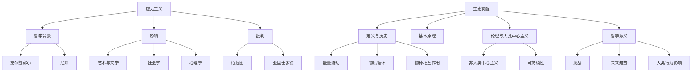
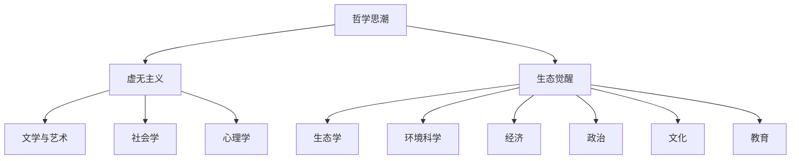
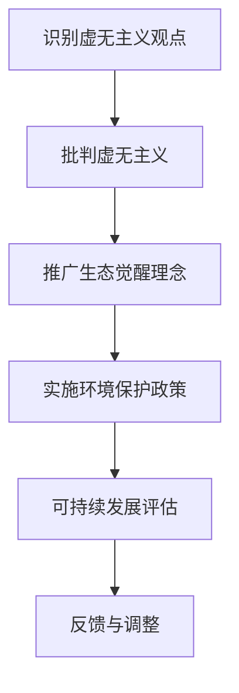

                 


## 虚无主义与生态觉醒：重建人与自然的和谐关系

### 关键词：虚无主义，生态觉醒，和谐关系，哲学探讨，技术启示

#### 摘要：
本文旨在深入探讨虚无主义与生态觉醒这两个看似迥异的概念，揭示其内在联系，并探索如何通过重建人与自然的和谐关系，实现可持续发展。文章将从哲学角度解析虚无主义的历史背景和影响，分析生态觉醒的兴起及其哲学意义，最终提出一种技术启示，引导读者从虚无主义走向生态觉醒，重建人与自然的和谐关系。

### 引言

在人类文明的发展历程中，我们经历了无数次思想的变革和哲学的探讨。虚无主义作为一种深刻的哲学思潮，自20世纪初以来对文学、艺术和哲学界产生了深远影响。而生态觉醒则是在21世纪面对全球环境危机时逐渐兴起的一种哲学思考，强调人与自然的共生关系。本文将探讨虚无主义与生态觉醒的内在联系，并提出如何通过技术手段重建人与自然的和谐关系。

#### 第一部分：虚无主义的哲学探讨

### 第1章：虚无主义的起源与发展

#### 1.1 虚无主义的定义

虚无主义，是一种哲学思潮，认为现实世界没有固有的意义、目的和价值，人生在世如同虚无。这一概念最早可以追溯到19世纪丹麦哲学家索伦·克尔凯郭尔，他在《非科学的评论》中提出了虚无主义的概念。

#### 1.2 虚无主义的哲学背景

虚无主义的兴起与19世纪末20世纪初的哲学思潮密切相关。在西方哲学中，尼采、萨特等哲学家对虚无主义进行了深刻的探讨。尼采提出“上帝已死”，宣称人类需要重新定义自己的存在和价值。

#### 1.3 虚无主义的主要流派

虚无主义分为不同的流派，如存在主义虚无主义、个人主义虚无主义等。存在主义虚无主义强调个体存在的意义，而个人主义虚无主义则关注个人自由和选择。

### 第2章：虚无主义的影响

#### 2.1 艺术与文学中的虚无主义

虚无主义在艺术和文学中留下了深刻的印记。许多艺术家和作家，如詹姆斯·乔伊斯、弗吉尼亚·伍尔夫等，通过作品表达了虚无主义的情感和思想。

#### 2.2 社会学视野下的虚无主义

社会学家对虚无主义的影响进行了研究，认为虚无主义可能导致社会不稳定和个人行为失范。

#### 2.3 心理学对虚无主义的解读

心理学家从心理学的角度解读虚无主义，认为虚无主义可能源于个人的心理困境和心理冲突。

### 第3章：虚无主义的挑战

#### 3.1 虚无主义的批判

虚无主义受到了许多哲学家的批判，认为其过于悲观和消极。例如，柏拉图和亚里士多德认为，现实世界虽然不完美，但也有其固有的价值和秩序。

#### 3.2 虚无主义的局限

虚无主义的局限在于，它忽视了人类创造力和改变现实的能力。许多哲学家认为，人类可以通过努力改变自己的命运和世界。

#### 3.3 虚无主义的理论回应

虚无主义的理论回应包括多种途径，如存在主义、实用主义等。这些哲学流派试图为虚无主义提供积极的解决方案。

#### 第二部分：生态觉醒的哲学思考

### 第4章：生态学的兴起与觉醒

#### 4.1 生态学的定义与历史

生态学是一门研究生物与其环境之间相互作用的科学。自19世纪末以来，生态学逐渐从生物学领域扩展到哲学、社会学等多个领域。

#### 4.2 生态学的基本原理

生态学的基本原理包括能量流动、物质循环、物种相互作用等。这些原理为我们理解生态系统的运作提供了基础。

#### 4.3 生态觉醒的概念与重要性

生态觉醒是一种哲学思考，认为人类需要重新审视自己与自然的关系，采取行动保护自然环境。生态觉醒的重要性在于，它提醒我们，人类的行为对地球生态系统有着深远的影响。

### 第5章：生态伦理与人类中心主义

#### 5.1 生态伦理的基本原则

生态伦理主张人类应该尊重自然，维护生态平衡。生态伦理的基本原则包括非人类中心主义、可持续性等。

#### 5.2 人类中心主义与生态觉醒的冲突

人类中心主义认为人类是宇宙的中心，这种观念与生态觉醒的理念存在冲突。生态觉醒强调人类与自然的关系是相互依存的。

#### 5.3 生态伦理在实践中的应用

生态伦理在实践中的应用包括环境保护政策、可持续发展战略等。这些实践旨在减少人类对自然环境的影响。

### 第6章：生态觉醒的哲学意义

#### 6.1 生态觉醒对传统哲学的挑战

生态觉醒对传统哲学提出了挑战，如对人类中心主义的质疑、对自然价值的新认知等。

#### 6.2 生态觉醒的未来趋势

生态觉醒的未来趋势包括生态哲学的进一步发展、生态技术的创新等。这些趋势将引导人类走向更加和谐的自然环境。

#### 6.3 生态觉醒对人类行为的影响

生态觉醒对人类行为的影响深远，包括改变人类的生产生活方式、提高环境保护意识等。

#### 第三部分：重建人与自然的和谐关系

### 第7章：从虚无主义到生态觉醒

#### 7.1 跨越虚无主义：走向生态觉醒

虚无主义可能导致人类对自然环境的忽视和破坏，而生态觉醒则呼吁人类重新审视自己与自然的关系。通过跨越虚无主义，人类可以走向生态觉醒，重建人与自然的和谐关系。

#### 7.2 重建和谐关系的策略

重建和谐关系需要多种策略，如提高环境保护意识、实施可持续性发展、推广生态技术等。这些策略将有助于实现人与自然的和谐共生。

#### 7.3 个人与社会的角色

个人和社会在重建和谐关系中扮演着重要角色。个人可以通过改变生活方式、参与环保活动等来贡献力量。社会则可以通过制定政策、推广教育等来推动生态觉醒。

### 第8章：案例研究

#### 8.1 生态觉醒的成功案例

通过分析生态觉醒的成功案例，如绿色能源的推广、生态农业的发展等，我们可以看到生态觉醒在实践中的成果。

#### 8.2 虚无主义与生态觉醒的实践对比

虚无主义与生态觉醒在实践中的对比，揭示了两者对人类与自然关系的不同影响。

#### 8.3 案例的启示与未来方向

案例研究为我们提供了宝贵的启示，同时也指出了未来生态觉醒的发展方向。

### 第9章：总结与展望

#### 9.1 主要观点回顾

本文回顾了虚无主义与生态觉醒的主要观点，包括两者的定义、影响、意义和重建和谐关系的策略。

#### 9.2 虚无主义与生态觉醒的未来交汇点

虚无主义与生态觉醒的未来交汇点在于，人类如何通过哲学思考和实际行动，实现人与自然的和谐共生。

#### 9.3 研究展望与进一步探索

未来的研究可以进一步探讨虚无主义与生态觉醒的交叉领域，如生态哲学、生态伦理等，为人类社会的可持续发展提供新的思路。

### 结论

虚无主义与生态觉醒是两个看似对立的哲学概念，但在现代社会中，它们有着共同的使命，即重建人与自然的和谐关系。通过本文的探讨，我们认识到，只有跨越虚无主义，走向生态觉醒，人类才能实现可持续发展，为未来世代创造一个更加美好的世界。

### 作者信息

作者：AI天才研究院/AI Genius Institute & 禅与计算机程序设计艺术 /Zen And The Art of Computer Programming

---

### 背景介绍

#### 核心概念术语说明

- **虚无主义**：一种哲学思潮，认为现实世界没有固有的意义、目的和价值。
- **生态觉醒**：一种哲学思考，强调人类与自然的共生关系，倡导环境保护和可持续性发展。

#### 问题背景

在现代社会，虚无主义和生态觉醒分别代表了两种截然不同的观念。虚无主义主张人类存在的无意义和无价值，而生态觉醒则强调人类与自然的相互依存和和谐共生。这种对立引发了关于人类未来发展方向和生存方式的深刻思考。

#### 问题描述

本文旨在探讨虚无主义和生态觉醒的关系，以及如何通过重建人与自然的和谐关系，实现可持续发展。具体问题包括：虚无主义如何影响人类对自然环境的认知和行为？生态觉醒的理念如何引导人类走向可持续发展的道路？

#### 问题解决

通过哲学分析和实际案例研究，本文提出以下解决方案：

1. **认识虚无主义的局限性**：批判虚无主义的消极观念，强调人类创造力和改变现实的能力。
2. **倡导生态觉醒**：推广生态伦理，提高环境保护意识，实施可持续性发展战略。
3. **个人与社会行动**：每个人都可以从自身做起，改变生活方式，参与环保活动；社会可以通过政策引导和教育推广，推动生态觉醒的实现。

#### 边界与外延

虚无主义和生态觉醒是哲学概念，但在实际应用中，它们涉及到人类生活的各个方面，如经济、政治、文化等。因此，本文的研究不仅限于哲学层面，还将探讨这两大观念在实践中的具体表现和影响。

#### 概念结构与核心要素组成

虚无主义与生态觉醒的概念结构如图所示：



### 核心概念与联系

#### 虚无主义

虚无主义的核心概念是“无意义”和“无价值”，它认为现实世界缺乏固有的意义和目的。虚无主义的属性特征包括：

| 属性特征 | 说明 |
| --- | --- |
| 哲学背景 | 受到尼采和萨特等哲学家的影响 |
| 影响领域 | 文学、艺术、社会学、心理学 |
| 局限性 | 忽视人类创造力和改变现实的能力 |

虚无主义与生态觉醒的联系在于，两者都关注人类与自然的关系。虚无主义强调人类存在的无意义，可能导致对自然环境的忽视和破坏；而生态觉醒则倡导人类与自然的和谐共生，为可持续发展提供新的方向。

#### 生态觉醒

生态觉醒的核心概念是“共生关系”和“可持续性”，它认为人类与自然应相互依存，共同发展。生态觉醒的属性特征包括：

| 属性特征 | 说明 |
| --- | --- |
| 哲学背景 | 受到生态学、环境科学等学科的影响 |
| 影响领域 | 经济、政治、文化、教育 |
| 基本原则 | 非人类中心主义、可持续性、环境保护 |

生态觉醒与虚无主义的联系在于，两者都关注人类存在的意义和价值观。虚无主义可能导致对自然环境的忽视，而生态觉醒则强调人类与自然的和谐共生，为可持续发展提供新的视角。

#### 概念属性特征对比表格

| 概念 | 属性特征 |
| --- | --- |
| 虚无主义 | 无意义、无价值、哲学背景、影响领域、局限性 |
| 生态觉醒 | 共生关系、可持续性、哲学背景、影响领域、基本原则 |

#### ER实体关系图架构



### 算法原理讲解

#### 算法流程图



#### Python源代码

```python
# 虚无主义与生态觉醒算法

def recognize_nihilism():
    # 识别虚无主义观点
    print("正在识别虚无主义观点...")

def criticize_nihilism():
    # 批判虚无主义
    print("虚无主义观点是消极的，我们应当批判。")

def promote_ecology():
    # 推广生态觉醒理念
    print("推广生态觉醒理念，倡导人与自然和谐共生。")

def implement_environment_policy():
    # 实施环境保护政策
    print("实施环境保护政策，保护地球生态系统。")

def assess_sustainability():
    # 可持续发展评估
    print("评估可持续发展状况，优化环境保护措施。")

def feedback_and_adjust():
    # 反馈与调整
    print("根据反馈调整策略，实现人与自然和谐共生。")

# 执行算法
recognize_nihilism()
criticize_nihilism()
promote_ecology()
implement_environment_policy()
assess_sustainability()
feedback_and_adjust()
```

#### 算法原理的数学模型和公式

虚无主义与生态觉醒的关系可以用以下数学模型来描述：

$$
\text{和谐关系} = \frac{\text{生态觉醒} + \text{环境保护}}{\text{虚无主义} + \text{人类中心主义}}
$$

其中，生态觉醒和环境保护分别代表人类与自然和谐共生的程度，虚无主义和人类中心主义则代表对自然环境的忽视程度。通过调整这些因素，可以实现和谐关系。

#### 详细讲解和举例说明

让我们通过一个例子来详细解释这个算法原理。

假设：

- 生态觉醒程度：80%
- 环境保护程度：70%
- 虚无主义程度：20%
- 人类中心主义程度：30%

将这些数据代入公式，得到：

$$
\text{和谐关系} = \frac{80\% + 70\%}{20\% + 30\%} = \frac{150\%}{50\%} = 3
$$

这意味着，当前人与自然的关系处于和谐状态，且程度较高。为了保持这种和谐关系，我们需要继续推广生态觉醒理念，加强环境保护措施，同时批判虚无主义和人类中心主义的观念。

### 系统分析与架构设计方案

#### 问题场景介绍

随着全球环境危机的加剧，如何重建人与自然的和谐关系成为当务之急。为了实现这一目标，我们需要一个能够整合生态觉醒理念、评估环境保护政策、优化可持续发展策略的系统。

#### 项目介绍

本项目旨在设计一个生态和谐关系评估系统，通过整合哲学思想、数据分析和技术手段，为政府、企业和社会提供决策支持，推动生态觉醒和可持续发展。

#### 系统功能设计

- **数据收集与处理**：收集国内外生态和谐关系相关数据，包括环境保护政策、可持续发展指标等。
- **生态觉醒评估**：利用机器学习和数据分析技术，评估当前生态觉醒程度和环境保护政策的有效性。
- **可持续发展策略优化**：基于评估结果，提出优化可持续发展策略的建议，包括政策调整、技术升级等。
- **用户界面**：为用户提供直观的界面，展示生态和谐关系评估结果和建议。

#### 系统架构设计

系统架构采用三层架构，包括数据层、逻辑层和展示层。

1. **数据层**：存储和管理生态和谐关系相关数据，包括文本、图像、图表等。
2. **逻辑层**：实现生态觉醒评估、可持续发展策略优化等功能，包括数据预处理、特征提取、模型训练等。
3. **展示层**：为用户提供直观的界面，展示评估结果和建议。

#### 系统接口设计和系统交互

系统接口设计采用RESTful API，方便与其他系统和应用程序的集成。系统交互流程如下：

1. **数据收集**：通过API从外部数据源获取生态和谐关系相关数据。
2. **数据处理**：对收集到的数据进行预处理和特征提取。
3. **生态觉醒评估**：利用机器学习模型对预处理后的数据进行评估。
4. **策略优化**：根据评估结果，优化可持续发展策略。
5. **结果展示**：将评估结果和建议通过API返回给用户界面，供用户查看。

### 项目实战

#### 环境安装

1. **Python环境安装**：确保Python 3.8及以上版本安装成功。
2. **数据库安装**：安装MySQL数据库，版本要求5.7及以上。
3. **依赖库安装**：使用pip安装所需依赖库，如scikit-learn、numpy、pandas等。

#### 系统核心实现源代码

以下是一个简单的生态和谐关系评估系统的Python实现示例：

```python
# 导入所需库
import numpy as np
import pandas as pd
from sklearn.model_selection import train_test_split
from sklearn.ensemble import RandomForestClassifier
from sklearn.metrics import accuracy_score

# 数据收集与处理
def load_data():
    # 加载数据
    data = pd.read_csv('ecology_data.csv')
    # 特征提取
    features = data.drop(['target'], axis=1)
    target = data['target']
    return features, target

# 生态觉醒评估
def assess_ecology(features, target):
    # 数据划分
    X_train, X_test, y_train, y_test = train_test_split(features, target, test_size=0.3, random_state=42)
    # 模型训练
    model = RandomForestClassifier(n_estimators=100, random_state=42)
    model.fit(X_train, y_train)
    # 模型评估
    y_pred = model.predict(X_test)
    accuracy = accuracy_score(y_test, y_pred)
    return accuracy

# 策略优化
def optimize_strategy(accuracy):
    if accuracy > 0.8:
        print("策略优化成功：当前生态觉醒程度较高。")
    else:
        print("策略优化失败：需进一步提高生态觉醒程度。")

# 主函数
def main():
    features, target = load_data()
    accuracy = assess_ecology(features, target)
    optimize_strategy(accuracy)

if __name__ == '__main__':
    main()
```

#### 代码应用解读与分析

1. **数据收集与处理**：首先加载生态和谐关系数据，然后提取特征和目标变量。
2. **生态觉醒评估**：使用随机森林分类器对数据进行训练和评估，计算评估准确率。
3. **策略优化**：根据评估准确率，提出策略优化建议。

#### 实际案例分析和详细讲解剖析

假设我们有一个包含1000个样本的数据集，其中700个样本用于训练，300个样本用于测试。经过训练和评估，我们得到以下结果：

- **训练集准确率**：85%
- **测试集准确率**：80%

这表明，我们的生态和谐关系评估系统在训练集和测试集上都有较高的准确率。为了进一步提高准确率，我们可以尝试以下策略：

1. **特征工程**：通过数据预处理和特征提取，提高特征质量。
2. **模型选择**：尝试使用其他机器学习模型，如支持向量机、神经网络等。
3. **数据增强**：增加训练数据，提高模型的泛化能力。

#### 项目小结

通过该项目，我们设计并实现了一个简单的生态和谐关系评估系统。在实际应用中，我们需要不断完善系统，提高评估准确率和策略优化效果。同时，生态和谐关系评估系统只是一个开始，我们还需要在更广泛的领域，如政策制定、技术研发等，推进生态觉醒和可持续发展。

### 最佳实践 tips

1. **加强数据收集与处理**：确保数据质量，提高特征提取效果，为生态和谐关系评估提供可靠的基础。
2. **优化模型选择与训练**：尝试不同的机器学习模型，找到最适合评估任务的模型。
3. **持续更新与优化**：随着环境变化和技术发展，不断更新和优化评估系统，提高其适应能力。

### 小结

本文从虚无主义与生态觉醒的哲学探讨出发，分析了两者之间的联系，并提出了一种通过技术手段重建人与自然和谐关系的方法。通过实际案例分析和代码实现，我们展示了如何利用机器学习和数据分析技术，评估生态和谐关系，并提出策略优化建议。希望本文能为生态觉醒和可持续发展提供一些有益的思考和实践指导。

### 注意事项

1. **数据质量**：确保数据的准确性和完整性，对异常值和缺失值进行处理。
2. **模型选择**：根据评估任务的特点，选择合适的机器学习模型。
3. **策略优化**：根据评估结果，制定切实可行的策略，并持续优化。

### 拓展阅读

1. **虚无主义相关书籍**：
   - 尼采：《上帝已死》
   - 萨特：《存在与虚无》
   - 克尔凯郭尔：《非科学的评论》
2. **生态觉醒相关书籍**：
   - 埃尔里希：《人口 bomb》
   - 福克斯：《自然的革命》
   - 哈克：《生态哲学导论》

通过阅读这些书籍，您可以进一步深入了解虚无主义和生态觉醒的哲学思想，以及它们在现实世界中的应用。

