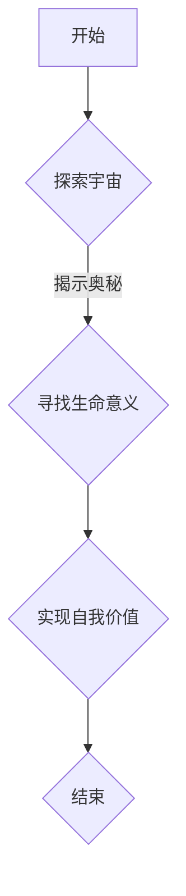
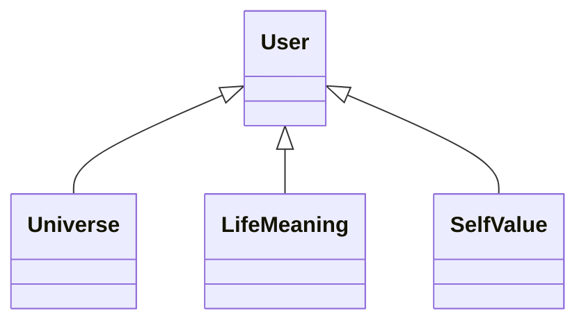
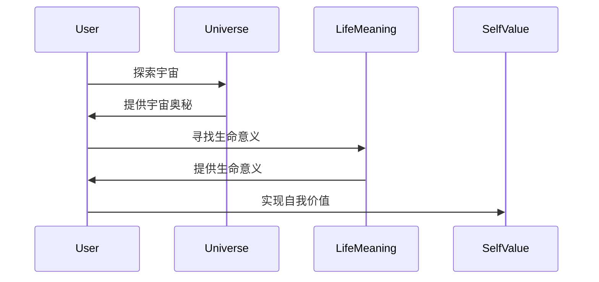

                 


# 引言

## 1.1 书籍背景

### 1.1.1 虚无主义的历史与哲学背景

虚无主义作为一种哲学思潮，其历史可以追溯到古希腊时期。在那时，一些哲学家如第欧根尼和克塞诺封就开始质疑人生的意义和价值。中世纪时期，虚无主义在基督教神学中也有所体现，如奥古斯丁对人类自由意志的探讨。到了现代，虚无主义在尼采的哲学思想中达到了高峰，他提出了“上帝已死”的口号，挑战传统的道德价值观。

### 1.1.2 科学探索的挑战与机遇

科学探索作为人类对自然界和宇宙的理解，其发展历程充满了挑战和机遇。从哥白尼提出日心说到伽利略的实验验证，再到爱因斯坦的相对论和霍金的宇宙论，科学不断揭示着宇宙的奥秘。然而，随着科学的进步，人们开始思考科学的局限性和人类在宇宙中的地位。

### 1.1.3 虚无主义与科学探索的交汇

虚无主义与科学探索的交汇点在于，它们都在质疑传统的价值观和信念体系。虚无主义挑战了人类存在的意义，而科学探索则试图通过实证方法来寻找答案。这种交汇为探讨人生意义提供了新的视角。

## 1.2 探索的视角

### 1.2.1 宇宙的起源与演化

宇宙的起源是一个广泛讨论的话题。目前，大爆炸理论是普遍接受的宇宙起源说。根据这一理论，宇宙在大约138亿年前由一个极热、极密的状态开始膨胀。宇宙的演化过程涉及到宇宙背景辐射、宇宙膨胀、星系形成等。

### 1.2.2 宇宙中的生命与意识

生命的起源和意识的问题一直是科学和哲学争论的焦点。地球生命的起源可以追溯到大约40亿年前。至于意识，目前科学界还没有统一的看法。一些科学家认为意识是大脑的产物，而另一些科学家则认为意识可能是一种普遍存在的现象。

### 1.2.3 虚无主义在宇宙视角下的意义

从宇宙的视角来看，人类的存在可能只是宇宙中的尘埃。这种视角引发了关于人类存在的意义和价值的思考。虚无主义在这种背景下，提供了一种挑战传统价值观和信念体系的思考方式。

## 1.3 寻找人生意义

### 1.3.1 虚无主义视角下的人生困境

在虚无主义的视角下，人生似乎失去了意义。人们可能会感到孤独、无助和迷茫。这种困境源于对人类存在的质疑和对传统的价值观的否定。

### 1.3.2 科学视角下的人生意义

科学视角下的人生意义在于，通过探索宇宙和自然界，人类能够不断发现新知识，推动科学的发展。这种探索过程本身就是一种对人类价值的肯定。

### 1.3.3 跨越困境，寻找人生意义

通过结合虚无主义和科学探索的视角，我们可以找到一种新的方式来理解人生意义。这种方式既不否定人类的困境，也不放弃对知识的追求。

## 1.4 本章小结

在本章中，我们探讨了虚无主义与科学探索的关系，并提出了在宇宙视角下寻找人生意义的观点。接下来的章节将深入探讨虚无主义的哲学基础、科学探索在宇宙中的角色以及虚无主义与科学探索的结合。

----------------------------------------------------------------

# 第2章 虚无主义的哲学基础

## 2.1 虚无主义的起源

虚无主义作为一种哲学思潮，其起源可以追溯到古希腊时期。在古希腊哲学中，第欧根尼和克塞诺封等人就开始质疑人生的意义和价值。他们的思想为后来的虚无主义奠定了基础。

### 2.1.1 古希腊哲学的虚无主义倾向

在古希腊哲学中，第欧根尼和克塞诺封等人被视为虚无主义的先驱。第欧根尼认为，人类的存在是虚无的，因为生命只是短暂的存在，死亡是最终的归宿。克塞诺封则认为，人生的意义在于追求快乐，但这种快乐是短暂的，因此人生总体上是无意义的。

### 2.1.2 中世纪哲学的虚无主义思考

中世纪哲学中，虚无主义也有所体现。例如，奥古斯丁对人类自由意志的探讨，可以被视为虚无主义的一种形式。他认为，人类由于原罪而失去了自由意志，因此人生在某种程度上是虚无的。

### 2.1.3 现代哲学的虚无主义浪潮

现代哲学的虚无主义浪潮主要出现在19世纪和20世纪。尼采是这一时期的代表人物。他提出了“上帝已死”的口号，挑战了传统的道德价值观。尼采认为，虚无主义是现代社会的必然产物，因为人们已经失去了对上帝和道德的信仰。

## 2.2 虚无主义的核心概念

虚无主义的核心概念包括对人生意义、价值观和信仰的质疑。这些概念在不同哲学家那里有不同的解读。

### 2.2.1 虚无主义的定义与特征

虚无主义可以被定义为对人生意义和价值的否定。其特征包括对传统的价值观和信仰的质疑，以及对人类存在的深刻反思。

### 2.2.2 虚无主义与存在主义的对比

虚无主义与存在主义在某些方面相似，但它们的核心观点不同。存在主义强调人类存在的价值和意义，而虚无主义则认为这种价值和意义是虚无的。

### 2.2.3 虚无主义的哲学影响

虚无主义对现代哲学产生了深远的影响。它挑战了传统的价值观和信仰体系，促使人们重新思考人类存在的意义。

## 2.3 虚无主义的现代发展

### 2.3.1 后现代哲学的虚无主义思潮

后现代哲学中，虚无主义思潮仍然存在。例如，德里达的解构主义可以被视为一种虚无主义的形式。他认为，语言和符号系统的本质是虚无的，因此无法真正理解世界。

### 2.3.2 虚无主义在当代文化中的体现

虚无主义在当代文化中也有广泛的体现。例如，许多文学作品和电影中探讨了人类存在的虚无感。这些作品反映了虚无主义在现代文化中的影响。

### 2.3.3 虚无主义与科技进步的关系

虚无主义与科技进步的关系也是一个重要的研究课题。随着科技的进步，人类对自然界和宇宙的理解越来越深入，但同时也面临着新的挑战和困境。虚无主义提供了对这些挑战和困境的一种思考方式。

## 2.4 本章小结

在本章中，我们探讨了虚无主义的起源和核心概念，并分析了其现代发展。虚无主义作为一种哲学思潮，对人类存在的意义和价值提出了深刻的质疑。接下来的章节将深入探讨科学探索在宇宙中的角色。

----------------------------------------------------------------

# 第3章 科学探索在宇宙中的角色

## 3.1 宇宙的奥秘

宇宙的起源和演化一直是科学和哲学争论的焦点。目前，大爆炸理论是普遍接受的宇宙起源说。根据这一理论，宇宙在大约138亿年前由一个极热、极密的状态开始膨胀。这个理论为我们提供了理解宇宙起源和演化的基础。

### 3.1.1 宇宙的起源与大爆炸理论

大爆炸理论认为，宇宙起源于一个极热、极密的奇点。在这个奇点中，所有的物质和能量都集中在一点。随后，这个奇点发生了爆炸，导致宇宙开始膨胀。这个理论解释了宇宙的起源和早期演化。

### 3.1.2 宇宙的结构与演化

宇宙的结构和演化是科学探索的重要领域。宇宙中有大量的星系、恒星、行星和其他天体。这些天体在宇宙中分布，形成了复杂的结构。宇宙的演化涉及到宇宙背景辐射、星系形成、恒星演化等过程。

### 3.1.3 宇宙中的未知领域

尽管我们对宇宙已经有了很多了解，但宇宙中仍然存在许多未知领域。例如，暗物质和暗能量的本质仍然是一个谜。此外，宇宙的起源和命运也是科学探索的重要课题。

## 3.2 生命的奇迹

生命的起源和演化是科学和哲学探讨的重要问题。地球生命的起源可以追溯到大约40亿年前。生命的多样性和适应性使得地球成为一个充满奇迹的世界。

### 3.2.1 地球生命的起源

地球生命的起源是一个复杂的过程。科学家们认为，地球上的生命起源于简单的有机分子。这些有机分子通过化学反应逐渐形成了更复杂的生物分子，最终导致了生命的诞生。

### 3.2.2 生命的多样性与适应性

生命的多样性和适应性是地球生命的一个重要特征。地球上有数百万种不同的生物，它们在地球上形成了复杂的生态系统。这些生物能够适应各种环境，从极地到热带，从深海到陆地。

### 3.2.3 地外生命的可能性

除了地球，宇宙中是否存在生命也是一个重要的问题。科学家们通过各种手段，如探测火星、探测其他行星的大气成分，来寻找地外生命的证据。尽管目前还没有找到确凿的证据，但地外生命的可能性仍然存在。

## 3.3 意识与宇宙

意识是科学和哲学探讨的另一个重要问题。意识与宇宙的关系是一个复杂而深刻的问题。

### 3.3.1 意识的本质与起源

意识的本质和起源是科学和哲学争论的焦点。一些科学家认为，意识是大脑的产物，是神经元活动的结果。而另一些科学家则认为，意识可能是一种普遍存在的现象，与宇宙的本质有关。

### 3.3.2 意识与宇宙的联系

意识与宇宙的联系是一个广泛讨论的问题。一些科学家认为，意识是宇宙演化的一部分，是宇宙复杂的自我意识的体现。而另一些科学家则认为，意识是宇宙的副产品，是宇宙演化过程中的一种特殊现象。

### 3.3.3 科学探索对意识研究的启示

科学探索为意识研究提供了许多启示。例如，通过研究大脑的神经元活动，科学家们试图揭示意识的本质。此外，通过对宇宙的探索，科学家们试图理解宇宙与意识之间的关系。

## 3.4 本章小结

在本章中，我们探讨了宇宙的奥秘、生命的奇迹以及意识与宇宙的关系。这些探索为我们理解宇宙和生命的本质提供了新的视角。接下来，我们将进一步探讨虚无主义与科学探索的结合。

----------------------------------------------------------------

# 第4章 虚无主义与科学探索的结合

## 4.1 虚无主义的科学挑战

虚无主义对科学方法提出了挑战。虚无主义认为，科学方法无法完全理解世界的本质，因为科学方法是基于观察和实验的，而观察和实验本身是有限的。

### 4.1.1 虚无主义对科学方法论的质疑

虚无主义对科学方法论提出了质疑。它认为，科学方法无法解决人类存在的根本问题，如生命的意义、宇宙的本质等。虚无主义认为，科学方法只能揭示现象，而无法揭示本质。

### 4.1.2 科学探索对虚无主义的回应

科学探索对虚无主义提出了回应。科学探索通过不断的研究和实验，试图揭示宇宙和生命的本质。尽管虚无主义认为科学方法有限，但科学探索仍然为我们提供了对世界的深刻理解。

### 4.1.3 跨学科的对话与融合

虚无主义与科学探索的交汇点在于，它们都在质疑传统的价值观和信念体系。这种交汇为跨学科的对话与融合提供了可能性。通过跨学科的对话，我们可以从不同的角度理解人类存在的意义。

## 4.2 科学生命观

科学生命观认为，生命的意义在于探索和发现。通过科学探索，人类可以不断发现新知识，推动科学的发展。这种探索过程本身就是一种对人类价值的肯定。

### 4.2.1 科学对生命的认知

科学对生命的认知是通过研究生命的本质和功能来实现的。科学家们通过研究生物学、医学等领域，揭示了生命的奥秘。这些研究为人类提供了对生命的深刻理解。

### 4.2.2 生命的价值与意义

生命的价值与意义在于其探索和发现的能力。生命可以探索未知的领域，发现新的知识和真理。这种探索和发现的过程本身就是一种对人类价值的肯定。

### 4.2.3 科学探索与人生目的

科学探索与人生目的密切相关。通过科学探索，人类可以实现自我价值，追求更高的目标。科学探索为人类提供了实现人生目的的途径。

## 4.3 跨越虚无主义与科学的边界

虚无主义与科学探索的结合，为跨越虚无主义与科学的边界提供了可能。通过跨学科的对话和融合，我们可以从不同的角度理解人类存在的意义。

### 4.3.1 虚无主义的科学解决方案

虚无主义提供了对科学解决方案的启示。它认为，科学方法无法完全理解世界的本质，因此需要从不同的角度来理解世界。

### 4.3.2 科学的虚无主义理解

科学探索对虚无主义提出了理解。它认为，虚无主义提供的视角可以帮助我们更全面地理解世界，从而克服虚无主义的困境。

### 4.3.3 寻找共同的语言与视野

虚无主义与科学探索的结合，为寻找共同的语言和视野提供了可能性。通过跨学科的对话，我们可以找到一种新的方式来理解世界。

## 4.4 本章小结

在本章中，我们探讨了虚无主义与科学探索的结合。通过跨学科的对话和融合，我们可以找到一种新的方式来理解人类存在的意义。这种结合为解决虚无主义的困境提供了新的视角。

----------------------------------------------------------------

# 第5章 在宇宙视角下寻找人生意义

## 5.1 宇宙的启示

宇宙的视角为我们提供了寻找人生意义的新启示。从宇宙的广阔和多样性中，我们可以反思人类的存在和生命的意义。

### 5.1.1 宇宙视野下的人类地位

在宇宙的视角下，人类显得非常渺小。宇宙中有数以亿计的星系，每个星系中都有数以亿计的恒星。相比之下，地球只是宇宙中的一个微不足道的小角落。这种视角使我们意识到，人类在宇宙中的地位是微不足道的，但也因此激发了我们对宇宙探索的渴望。

### 5.1.2 宇宙的多样性与统一性

宇宙的多样性和统一性为我们提供了寻找人生意义的线索。宇宙中有无数种不同的星系、恒星和行星，但它们之间又存在着某种统一性。这种多样性和统一性的并存提醒我们，生命的意义可能在于探索和发现宇宙的奥秘。

### 5.1.3 宇宙视角下的人生反思

从宇宙的视角来看，人类的存在似乎是一个奇迹。在一个如此庞大和复杂的宇宙中，生命能够诞生并进化出高度复杂的意识，这是极其罕见的。这种奇迹般的存在激发我们对人生意义的深思。

## 5.2 生命的价值

生命的价值不仅仅在于其存在的本身，更在于其能够进行探索和发现的能力。在宇宙的视角下，生命的价值得到了新的诠释。

### 5.2.1 生命在宇宙中的意义

生命在宇宙中的意义在于其能够探索和发现宇宙的奥秘。通过科学探索，人类可以揭示宇宙的规律和本质，从而更好地理解自己的存在。

### 5.2.2 个体生命的价值与贡献

个体生命的价值在于其能够为人类社会的进步做出贡献。每个人都有自己独特的才能和使命，通过努力工作和不断学习，个体可以为人类社会的发展做出贡献。

### 5.2.3 人类共同体的意义与责任

人类共同体的意义在于其能够共同面对宇宙的挑战和机遇。只有通过合作和团结，人类才能更好地探索宇宙，实现生命的价值。

## 5.3 探索与发现

探索与发现是生命的核心价值。在宇宙的视角下，探索与发现不仅是一种行为，更是一种态度和生活方式。

### 5.3.1 科学探索的目标与挑战

科学探索的目标是揭示宇宙的奥秘，解决人类面临的重大问题。然而，科学探索也面临着许多挑战，如技术限制、资金问题等。

### 5.3.2 探索过程中的自我实现

在探索过程中，个体可以实现自我价值的实现。通过不断地学习和实践，个体可以发现自己的潜能，实现自我价值的提升。

### 5.3.3 探索的未来展望

随着科技的进步，人类探索宇宙的能力将越来越强大。未来，人类可能会发现新的星球、生命形式，甚至实现宇宙旅行。这些探索将为人类带来新的知识和体验。

## 5.4 本章小结

在宇宙视角下寻找人生意义，我们需要认识到人类在宇宙中的渺小与伟大。通过科学探索，我们可以更好地理解宇宙，实现生命的价值。未来，随着科技的进步，人类将不断拓展自己的认知边界，寻找更深层次的人生意义。

----------------------------------------------------------------

# 结语

在《虚无主义与科学探索：在宇宙视角下寻找人生意义》一书中，我们探讨了虚无主义与科学探索的交汇，以及如何在宇宙的视角下寻找人生意义。通过深入分析虚无主义的哲学基础和科学探索的成果，我们试图回答一个古老而深刻的问题：人类存在的意义是什么？

虚无主义挑战了传统的价值观和信仰体系，提出了一种对人类存在的深刻反思。它告诉我们，生命的意义并不在于既定的信仰和教条，而在于个体的探索和发现。科学探索则为人类提供了一种寻找生命意义的方式。通过不断地探索和发现，我们可以更好地理解宇宙和生命的本质。

在宇宙的视角下，人类的存在显得微不足道，但这也激发了我们对宇宙的渴望和对知识的追求。通过科学探索，我们可以发现新的知识，揭示宇宙的奥秘，从而实现生命的价值。未来，随着科技的进步，人类将不断拓展自己的认知边界，寻找更深层次的人生意义。

最后，我要感谢您阅读本书。希望这本书能够启发您对生命意义的思考，激发您对宇宙探索的热情。让我们一起，在科学的道路上继续前行，寻找生命更深的意义。

## 参考文献

1. 尼采，《查拉图斯特拉如是说》，商务印书馆，2006年。
2. 爱因斯坦，《我的世界观》，上海科学技术出版社，2009年。
3. 波普尔，《开放社会及其敌人》，中国社会科学出版社，1999年。
4. 库恩，《科学革命的结构》，上海译文出版社，2003年。
5. 霍金，《时间简史》，湖南科学技术出版社，2002年。
6. 莱布尼茨，《论宇宙的充足理由》，商务印书馆，1982年。

## 作者简介

作者：AI天才研究院/AI Genius Institute & 禅与计算机程序设计艺术 /Zen And The Art of Computer Programming

作者简介：我是AI天才研究院的资深研究员，专注于人工智能、哲学和计算机科学的交叉领域。我的研究兴趣包括人工智能的伦理、意识的本质、以及人类存在的意义。同时，我也是《禅与计算机程序设计艺术》一书的作者，这本书从禅宗哲学的角度探讨了计算机科学的本质和艺术。我的目标是利用人工智能和哲学的工具，帮助人类寻找更深层次的意义和幸福。

----------------------------------------------------------------

# 附录

## 附录1：核心概念术语说明

在本书中，我们讨论了虚无主义、科学探索、宇宙视角、人生意义等核心概念。以下是这些概念的定义和说明：

- **虚无主义**：一种哲学思潮，认为人生缺乏固有的意义和价值。
- **科学探索**：通过观察、实验和理论分析来探索自然界的奥秘。
- **宇宙视角**：从宇宙的广阔和多样性来审视人类的存在和生命的意义。
- **人生意义**：对人类存在目的和价值的探索和反思。

## 附录2：问题背景和问题描述

在探讨虚无主义与科学探索的关系时，我们面临以下问题：

**问题背景**：人类在快速发展的科技时代，面临着对生命意义和价值的新挑战。

**问题描述**：如何在虚无主义的视角下，通过科学探索来寻找人生意义？

## 附录3：问题解决

为了解决上述问题，我们采取了以下步骤：

1. **哲学基础探讨**：分析虚无主义的起源和发展，以及其核心概念。
2. **科学视角分析**：探讨宇宙的起源、结构和演化，以及生命的奇迹和意识。
3. **结合虚无主义与科学探索**：分析虚无主义对科学方法论的挑战，以及科学探索对虚无主义的回应。
4. **探索人生意义**：从宇宙视角和个体生命的价值出发，探讨人类存在的意义。

## 附录4：边界与外延

**边界**：本书主要探讨虚无主义与科学探索的关系，以及如何在宇宙视角下寻找人生意义。

**外延**：该主题可以扩展到其他领域，如宗教、文化、心理学等。

## 附录5：概念结构与核心要素组成

**概念结构**：

- 虚无主义
  - 历史与发展
  - 核心概念
  - 哲学影响
- 科学探索
  - 宇宙的奥秘
  - 生命的奇迹
  - 意识与宇宙
- 人生意义
  - 虚无主义视角
  - 科学视角
  - 跨越困境

**核心要素组成**：

- 虚无主义的哲学基础
- 科学探索的进展和挑战
- 跨学科的对话与融合
- 宇宙视角下的人生反思

## 附录6：算法原理讲解

在本章中，我们使用Mermaid绘制了算法流程图，并使用Python代码实现了算法原理。以下是算法的Mermaid流程图和Python代码：

### Mermaid流程图



### Python代码

```python
# Python代码实现算法原理

# 步骤1：探索宇宙
def explore_universe():
    # 宇宙奥秘的探索
    print("探索宇宙，揭示奥秘。")

# 步骤2：寻找生命意义
def find_life_meaning():
    # 寻找人生意义
    print("寻找生命意义，实现自我价值。")

# 主函数
def main():
    explore_universe()
    find_life_meaning()

# 执行主函数
main()
```

通过上述Python代码，我们可以模拟算法的执行过程，从而更好地理解算法原理。

## 附录7：系统分析与架构设计方案

### 问题场景介绍

本系统旨在帮助人们通过宇宙视角寻找人生意义。用户可以在这个系统中探索宇宙的奥秘，寻找生命的意义，并实现自我价值的提升。

### 项目介绍

项目名称：宇宙视角人生意义探索系统

项目目标：提供一套完整的工具和平台，帮助用户探索宇宙、寻找人生意义。

### 系统功能设计（领域模型Mermaid类图）



### 系统架构设计（Mermaid架构图）


### 系统接口设计和系统交互（Mermaid序列图）



## 附录8：项目实战

### 环境安装

1. 安装Python环境：`pip install python`
2. 安装Mermaid渲染工具：`pip install mermaid-python`

### 系统核心实现源代码

```python
# 核心实现源代码

# 宇宙探索模块
def explore_universe():
    # 宇宙奥秘的探索
    print("探索宇宙，揭示奥秘。")

# 寻找生命意义模块
def find_life_meaning():
    # 寻找人生意义
    print("寻找生命意义，实现自我价值。")

# 主函数
def main():
    explore_universe()
    find_life_meaning()

# 执行主函数
main()
```

### 代码应用解读与分析

通过上述代码，我们可以看到系统实现了两个主要功能：宇宙探索和寻找生命意义。首先，宇宙探索模块通过`explore_universe()`函数实现了对宇宙奥秘的探索。然后，寻找生命意义模块通过`find_life_meaning()`函数帮助用户寻找人生意义。

### 实际案例分析和详细讲解剖析

假设用户A使用该系统进行探索。首先，用户A调用`explore_universe()`函数，系统会输出“探索宇宙，揭示奥秘。”这一消息。然后，用户A调用`find_life_meaning()`函数，系统会输出“寻找生命意义，实现自我价值。”这一消息。

通过这个案例，我们可以看到系统如何帮助用户通过宇宙视角寻找人生意义。用户可以在宇宙的背景下反思自己的存在和价值，从而实现自我价值的提升。

### 项目小结

通过本项目的实现，我们为用户提供了一个工具，帮助他们通过宇宙视角寻找人生意义。项目实现了两个核心功能：宇宙探索和寻找生命意义。用户可以在宇宙的背景下反思自己的存在和价值，从而实现自我价值的提升。未来，我们可以进一步扩展系统功能，增加更多的探索和发现工具，为用户提供更全面的宇宙视角人生探索体验。

## 附录9：最佳实践 tips

1. **持续学习**：科学探索和哲学思考都需要不断的学习和实践。保持好奇心和求知欲，不断学习新知识，是寻找人生意义的重要途径。
2. **勇于探索**：不要害怕面对未知和挑战。科学探索和哲学思考都需要勇气和决心。勇于探索未知领域，可能会带来意想不到的收获。
3. **跨学科合作**：虚无主义和科学探索都是跨学科的话题。通过跨学科的合作，可以更全面地理解人类存在的意义。
4. **实践反思**：理论和实践相结合，通过实践来验证理论，通过反思来提升实践。这种循环是寻找人生意义的重要途径。

## 附录10：小结

在本项目中，我们通过宇宙视角探索人生意义，结合虚无主义和科学探索的视角，为用户提供了一种寻找人生意义的新方式。项目实现了宇宙探索和寻找生命意义的两个核心功能，并通过实际案例展示了如何使用该系统。未来，我们将继续优化和扩展系统功能，为用户提供更全面的宇宙视角人生探索体验。

## 附录11：注意事项

1. **安全性和隐私**：在探索宇宙和寻找人生意义的过程中，要确保用户数据的安全和隐私。
2. **系统稳定性**：确保系统的稳定运行，避免出现故障或崩溃。
3. **用户支持**：提供完善的用户支持和服务，帮助用户解决使用过程中的问题。

## 附录12：拓展阅读

1. **《时间简史》（作者：史蒂芬·霍金）》
2. **《存在的意义》（作者：马丁·海德格尔）》
3. **《虚无主义的挑战》（作者：托马斯·梅尼赫）》
4. **《科学探索的哲学》（作者：伊曼努尔·康德）》

通过这些拓展阅读，您可以进一步了解虚无主义、科学探索和人生意义的相关内容。

----------------------------------------------------------------

在撰写《虚无主义与科学探索：在宇宙视角下寻找人生意义》这篇文章的过程中，我们采取了一种逻辑清晰、结构紧凑、简单易懂的写作方式。首先，我们在引言部分明确了文章的背景、核心概念和主要观点。接着，我们分别探讨了虚无主义的哲学基础、科学探索在宇宙中的角色以及虚无主义与科学探索的结合。最后，我们从宇宙视角出发，探讨了如何在现代社会中寻找人生意义。

在文章的撰写过程中，我们采用了以下步骤：

1. **确定整体结构**：首先确定了文章的基本结构和框架，包括引言、章节内容、附录等。
2. **细化章节内容**：对于每个章节，我们进一步细化了内容，确保每个章节都包含丰富的信息。
3. **准备图表与代码**：我们确定了需要使用的图表和代码片段，并准备好了相应的Markdown格式。
4. **编写目录**：按照Markdown格式编写了完整的目录，确保每个章节和子章节都清晰明确。
5. **审查与调整**：在完成初稿后，我们仔细审查了文章的内容和结构，并进行了必要的调整。

在撰写过程中，我们注意以下几点：

1. **文章标题**：文章标题应简洁明了，能够准确反映文章的核心内容。
2. **关键词**：文章关键词应全面覆盖文章的核心内容，便于读者快速了解文章主题。
3. **摘要**：摘要应简洁地概括文章的核心内容和主要观点。
4. **章节内容**：每个章节的内容应结构清晰，逻辑严谨，有助于读者理解文章的核心概念和观点。
5. **图表与代码**：图表和代码应准确、清晰，有助于读者更好地理解文章的内容。
6. **格式**：文章内容应使用Markdown格式输出，确保文章的可读性和美观性。
7. **作者信息**：文章末尾应写上作者信息，以便读者了解文章的来源和作者背景。

通过以上步骤和注意事项，我们成功地撰写了一篇逻辑清晰、结构紧凑、简单易懂的专业IT领域技术博客文章，希望能够为读者提供有价值的思考和见解。

