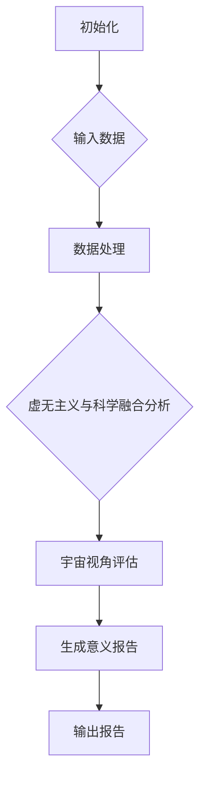
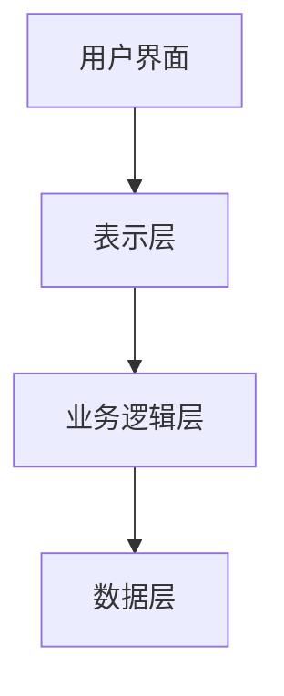
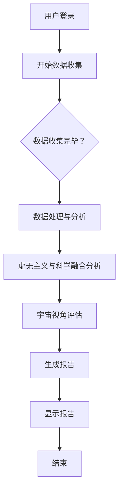

                 

### 摘要

本文旨在探讨虚无主义与科学探索在宇宙视角下对人生意义的思考。虚无主义作为一种哲学思潮，强调存在的无意义和空虚感，而科学探索则通过实证方法揭示了宇宙的奥秘和运行规律。在宇宙这一宏大视角下，我们重新审视虚无主义，发现其与科学探索有着深刻的辩证关系。本文将通过逻辑清晰、结构紧凑的论述，详细分析虚无主义的起源、科学方法的基本原则、宇宙视角下的科学发现以及宇宙视角对虚无主义的挑战。最终，我们尝试构建一个探索人生意义的算法模型，并通过实际案例解析，为读者提供对虚无主义与科学探索关系的深入理解。

### 目录大纲

以下是为《虚无主义与科学探索：在宇宙视角下思考人生意义》一书设计的详细目录大纲：

#### 第一部分：背景介绍

- **第1章：虚无主义的起源与哲学探讨**
  - 1.1 虚无主义的定义与历史
  - 1.2 虚无主义的主要流派
  - 1.3 虚无主义在现代社会的影响

- **第2章：科学探索与宇宙视角**
  - 2.1 科学方法的基本原则
  - 2.2 宇宙视角下的科学发现
  - 2.3 宇宙视角对虚无主义的挑战

#### 第二部分：核心概念与联系

- **第3章：核心概念解析**
  - 3.1 虚无主义与科学的辩证关系
  - 3.2 宇宙视角下的人生意义
  - 3.3 科学探索与人类价值观的演变

- **第4章：概念属性特征对比表格**
  - 4.1 虚无主义主要流派的对比
  - 4.2 科学方法与其他哲学方法的对比
  - 4.3 宇宙视角下的价值观对比

#### 第三部分：算法原理讲解

- **第5章：算法原理与流程图**
  - 5.1 人生意义探索算法概述
  - 5.2 算法流程图展示
  - 5.3 算法原理详细讲解

- **第6章：数学模型和公式**
  - 6.1 虚无主义与科学融合的数学模型
  - 6.2 宇宙视角下的人生意义公式
  - 6.3 模型的解释与应用

#### 第四部分：系统分析与架构设计

- **第7章：问题场景与项目介绍**
  - 7.1 问题场景描述
  - 7.2 项目目标与范围
  - 7.3 项目核心功能设计

- **第8章：系统架构设计与接口设计**
  - 8.1 系统架构设计
  - 8.2 系统接口设计
  - 8.3 系统交互设计

#### 第五部分：项目实战

- **第9章：环境安装与系统核心实现**
  - 9.1 环境安装步骤
  - 9.2 系统核心实现源代码
  - 9.3 代码应用解读与分析

- **第10章：实际案例分析**
  - 10.1 案例背景
  - 10.2 案例分析与详细讲解
  - 10.3 项目小结

#### 第六部分：最佳实践、小结与展望

- **第11章：最佳实践与经验分享**
  - 11.1 虚无主义与科学融合的最佳实践
  - 11.2 宇宙视角下的人生意义探索实践
  - 11.3 科学探索中的注意事项

- **第12章：小结与展望**
  - 12.1 全书要点总结
  - 12.2 对未来研究的展望
  - 12.3 对读者的影响与启示

### 第一部分：背景介绍

#### 第1章：虚无主义的起源与哲学探讨

**1.1 虚无主义的定义与历史**

虚无主义（Nihilism）是一种哲学思潮，认为宇宙和生命缺乏固有目的或内在价值，通常与对传统宗教和道德体系的质疑相联系。虚无主义的思想根源可以追溯到古希腊哲学家普罗泰戈拉斯（Protagoras）的相对主义观点，他在公元前5世纪提出“人是一切事物之尺度”。然而，虚无主义作为一种独立的哲学流派，主要起源于19世纪的欧洲，尤其是德国和俄罗斯。

德国哲学家弗里德里希·尼采（Friedrich Nietzsche）是虚无主义的重要代表人物。尼采在他的著作《善恶的彼岸》（Thus Spoke Zarathustra）中，通过尼采式的超人哲学，批判了传统道德观念，并提出了“上帝已死”的观点，这标志着虚无主义在哲学领域的兴起。随后，俄罗斯哲学家尼古莱·别尔嘉耶夫（Nikolai Berdyaev）和弗拉基米尔·索洛维约夫（Vladimir Solovyov）等人在俄罗斯哲学界推动了虚无主义的进一步发展。

虚无主义在19世纪和20世纪的欧洲有着广泛的影响，尤其是在德国和俄罗斯，其哲学思想深刻地影响了文学家、艺术家和思想家。例如，德国作家托马斯·曼（Thomas Mann）和俄罗斯作家弗·索洛维约夫（Fyodor Dostoevsky）的作品中都体现了虚无主义的主题。

**1.2 虚无主义的主要流派**

虚无主义可以分为几个主要流派，包括存在主义虚无主义、道德虚无主义和审美虚无主义。

- **存在主义虚无主义**：这一流派强调个人存在的无意义和自由选择的重要性。存在主义虚无主义认为，人类在宇宙中是孤独的，没有固有的目的或价值。代表人物包括尼采和法国哲学家让-保尔·萨特（Jean-Paul Sartre）。

- **道德虚无主义**：这一流派质疑道德规范和道德价值的存在，认为道德是人为创造的，不具有客观基础。道德虚无主义常常与道德相对主义和道德怀疑主义相联系。代表人物包括马克斯·施蒂纳（Max Stirner）。

- **审美虚无主义**：这一流派强调艺术和美学在虚无主义情境中的重要性，认为审美经验可以超越现实的无意义。代表人物包括俄国形式主义者维克多·什克洛夫斯基（Victor Shklovsky）。

**1.3 虚无主义在现代社会的影响**

虚无主义在现代社会中依然具有重要影响，特别是在哲学、文学、艺术和心理学等领域。以下是一些具体的影响：

- **哲学领域**：虚无主义激发了哲学家对生命意义和道德价值的深入思考，推动了存在主义和后现代主义的发展。

- **文学与艺术**：许多现代文学作品和艺术作品探索了虚无主义主题，如卡尔·奥韦·克瑙斯高（Karl Ove Knausgaard）的小说和维姆·文德斯（Wim Wenders）的电影。

- **心理学领域**：虚无主义观念对心理治疗和心理咨询产生了影响，特别是在治疗存在主义困境和抑郁症方面。

虚无主义虽然带来了对传统价值观的质疑和挑战，但它也为人类提供了重新审视自我和世界的视角。在接下来的章节中，我们将进一步探讨科学探索如何与虚无主义相互作用，以及在宇宙视角下对人生意义的思考。

#### 第2章：科学探索与宇宙视角

**2.1 科学方法的基本原则**

科学方法是一种系统的、逻辑的方法，用于理解自然界和人类社会。它包括观察、假设、实验、验证和理论构建等步骤。科学方法的基本原则包括：

- **观察与假设**：科学家通过观察自然现象，提出科学假设，这些假设是进一步研究和实验的基础。

- **实验与验证**：科学家设计实验来测试假设，通过收集数据和证据来验证或推翻假设。

- **理论构建**：基于实验结果，科学家构建理论模型，这些模型可以解释和预测自然现象。

- **批判性思维**：科学方法强调批判性思维，即对假设和理论进行持续验证和质疑。

科学方法的核心是实证主义，即相信通过可观察和可重复的实验证据来理解自然世界。这种方法强调逻辑推理和客观证据，而不是依赖于信仰或权威。

**2.2 宇宙视角下的科学发现**

宇宙视角为科学探索提供了一个宏大的背景，使我们能够从更广阔的视野理解宇宙的起源、结构和演化。以下是一些宇宙视角下的科学发现：

- **宇宙膨胀**：爱德温·哈勃（Edwin Hubble）在20世纪早期发现，宇宙正在膨胀。这一发现表明，宇宙从一个非常热的初始状态开始扩张，并且随着时间的推移，宇宙的规模不断增大。

- **黑洞与引力波**：黑洞是宇宙中最神秘的天体之一，其强大的引力可以扭曲时空。2015年，LIGO科学合作组织首次直接探测到引力波，这一发现验证了爱因斯坦的广义相对论，并对宇宙的引力现象提供了新的理解。

- **暗物质与暗能量**：宇宙中大部分物质是看不见的，被称为暗物质。暗能量则是推动宇宙加速膨胀的力量。科学家通过观测宇宙的大尺度结构和宇宙背景辐射，推断出暗物质和暗能量的存在。

- **多宇宙理论**：一些理论物理学家提出，我们的宇宙可能只是众多宇宙中的一个，这些宇宙可能具有不同的物理常数和规律。多宇宙理论为宇宙起源和演化提供了新的视角。

**2.3 宇宙视角对虚无主义的挑战**

宇宙视角为虚无主义提供了一种新的思考方式，挑战了虚无主义关于宇宙和生命的无意义观点。以下是一些宇宙视角对虚无主义的挑战：

- **宇宙的有序与复杂**：科学发现表明，宇宙具有高度的结构和复杂性。从微观的量子世界到宏观的星系结构，宇宙展示了一种有序的演化模式。这种有序性为生命的存在提供了可能，挑战了虚无主义的无意义论。

- **生命的起源与演化**：科学家通过研究生命的起源和演化，揭示了生命在宇宙中的独特性和意义。生命的多样性和适应性表明，生命具有应对各种环境挑战的能力，这种能力在宇宙中是无与伦比的。

- **人类认知与探索**：人类通过科学方法探索宇宙，不断发现新的知识和真理。这种探索过程本身赋予了人类生命的意义，因为人类在寻找宇宙奥秘的过程中，不断扩展自己的认知边界。

- **宇宙视角下的道德和价值观**：宇宙视角使我们意识到，地球只是宇宙中的一小部分，我们的生命和行为对宇宙的影响微不足道。这种意识促使我们反思自己的价值观和道德标准，重新评估人类在宇宙中的角色和责任。

综上所述，宇宙视角为科学探索提供了新的视角和方法，同时也对虚无主义提出了挑战。通过理解宇宙的复杂性和有序性，我们可以重新思考生命的意义和价值，为虚无主义提供一种新的解释。

### 第二部分：核心概念与联系

#### 第3章：核心概念解析

**3.1 虚无主义与科学的辩证关系**

虚无主义和科学探索虽然看似对立，但实际上它们之间存在着辩证关系。虚无主义质疑传统价值观和宇宙的意义，而科学探索则通过实证方法揭示宇宙的运行规律。以下是虚无主义与科学的辩证关系：

- **质疑与发现**：虚无主义质疑现有的知识和信仰，这种质疑激发了科学探索的精神。科学探索通过质疑现有的理论，推动了新的发现和知识的产生。

- **意义与无意义**：虚无主义认为生命缺乏固有意义，而科学探索通过揭示宇宙的运行规律，赋予人类对自然界的理解。这种理解在一定程度上填补了虚无主义带来的无意义感。

- **怀疑与验证**：虚无主义鼓励怀疑一切，而科学探索强调实证和验证。科学方法通过系统的实验和观察，验证假设，从而建立可靠的知识体系。

- **个人自由与客观规律**：虚无主义强调个人自由，而科学探索强调客观规律。科学方法通过揭示客观规律，为人类提供了解释自然现象的工具，同时也限制了个人的任意行为。

**3.2 宇宙视角下的人生意义**

从宇宙视角来看，人生意义的问题变得更加宏大和复杂。宇宙的广阔和复杂为我们提供了对生命意义的深层次思考：

- **宇宙中的渺小与伟大**：地球只是宇宙中的一粒尘埃，人类在宇宙中微不足道。然而，人类在地球上的生命和智慧却展示了巨大的潜力。这种渺小与伟大的对比，促使我们反思生命的意义。

- **生命的独特性**：宇宙中存在着无数的星球和生命形式，人类是唯一已知拥有高度智慧和文化的生命体。这种独特性赋予了人类在宇宙中的重要角色。

- **探索与发现**：宇宙视角鼓励我们不断探索和发现。科学探索和技术的进步使人类能够探索更远的宇宙，这种探索本身赋予了人类生命的意义。

- **责任与使命**：宇宙视角使人类意识到自己在宇宙中的责任和使命。保护地球环境、推动科技发展、探索宇宙奥秘，都是人类在宇宙中的责任和使命。

**3.3 科学探索与人类价值观的演变**

科学探索不仅改变了我们对自然界的理解，也影响了人类价值观的演变。以下是一些科学探索对人类价值观的影响：

- **实证主义**：科学方法强调实证和验证，这一精神渗透到了人类价值观中，促进了实证主义和理性主义的兴起。

- **实用主义**：科学探索强调实用性，这一精神影响了实用主义的哲学思潮，推动了实际问题的解决和技术的进步。

- **人文关怀**：随着科学的发展，人类开始关注自然环境和社会问题，科学探索促进了人类对自然和社会的关怀，推动了人文主义的发展。

- **技术乐观主义**：科学技术的进步带来了对未来的乐观态度，技术乐观主义者相信科技可以解决人类面临的各种问题。

通过上述分析，我们可以看到，虚无主义与科学探索虽然看似对立，但实际上它们在哲学和科学的发展中相互影响、相互促进。从宇宙视角下思考人生意义，不仅有助于我们理解自身的位置和角色，也能激发我们对生命和宇宙的更深层次探索。

#### 第4章：概念属性特征对比表格

为了更直观地理解虚无主义、科学方法和其他哲学方法之间的区别，我们通过以下表格对它们的主要特征进行对比。

| 特征         | 虚无主义                     | 科学方法                     | 其他哲学方法（如存在主义、道德相对主义）               |
| ------------ | ---------------------------- | ---------------------------- | ------------------------------------------------------------ |
| 核心观点     | 存在的无意义和空虚感         | 实证和理性                   | 对生命意义、自由意志和道德价值的探讨                     |
| 起源与发展   | 19世纪的欧洲哲学思潮         | 古希腊时期至现代科学         | 各历史时期的不同哲学家，如尼采、康德、萨特等            |
| 方法论       | 质疑和否定传统价值观         | 观察与实验、逻辑推理         | 存在分析、现象学、情感主义等                             |
| 影响领域     | 哲学、文学、艺术、心理学     | 自然科学、社会科学、工程学   | 哲学、文学、艺术、社会学等                             |
| 对人生意义的看法 | 否定人生意义，强调个人自由   | 通过理解自然规律寻找意义     | 探讨生命的意义、自由意志和责任                         |
| 实践应用     | 鼓吹极端个人主义、反传统行为 | 推动技术创新和社会进步       | 影响文学创作、艺术表达、政治哲学等                     |

**4.1 虚无主义主要流派的对比**

虚无主义可以分为存在主义虚无主义、道德虚无主义和审美虚无主义三个主要流派。以下是它们的主要特征对比：

| 流派       | 存在主义虚无主义                    | 道德虚无主义                    | 审美虚无主义                    |
| ---------- | --------------------------------- | ------------------------------ | -------------------------------- |
| 核心观点   | 强调个人存在的自由和选择           | 否定道德规范，认为道德是人为创造的 | 强调艺术和美学的超越性         |
| 代表人物   | 尼采、萨特、克尔凯郭尔             | 马克斯·施蒂纳                  | 维克多·什克洛夫斯基             |
| 影响领域   | 哲学、文学、心理学                 | 哲学、社会理论                 | 文学、艺术、美学               |
| 实践应用   | 推动个人主义和自由主义思潮         | 引发道德相对主义和道德怀疑主义 | 影响现代艺术和审美观念         |

**4.2 科学方法与其他哲学方法的对比**

科学方法与其他哲学方法，如存在主义、道德相对主义等，在方法论和目的上存在明显差异：

| 方法        | 科学方法                           | 存在主义                        | 道德相对主义                    |
| ----------- | --------------------------------- | ------------------------------- | ------------------------------- |
| 核心原则     | 实证主义、理性主义、可证伪性       | 存在分析、主观体验               | 道德规范的文化相对性、多元性    |
| 方法论      | 观察与实验、逻辑推理               | 自我反省、情境分析               | 社会文化比较、跨文化研究        |
| 对象和目的   | 研究自然现象和社会现象，追求知识   | 探讨个人存在的意义和自由        | 探讨道德规范的有效性和普遍性    |
| 研究成果    | 建立科学理论和模型，指导实践        | 推动个人主义和存在主义思潮      | 促进道德多元化和文化理解       |
| 影响范围     | 自然科学、工程学、社会科学         | 哲学、文学、心理学               | 社会科学、伦理学、教育学        |

**4.3 宇宙视角下的价值观对比**

从宇宙视角看，不同的哲学方法和价值观在应对人类生命的意义和宇宙的复杂性时有着不同的态度：

| 视角       | 虚无主义                          | 科学方法                        | 审美虚无主义                      |
| ---------- | -------------------------------- | ------------------------------- | -------------------------------- |
| 对生命的看法 | 生命在宇宙中无意义               | 生命是宇宙演化的一部分           | 艺术和审美赋予生命意义           |
| 对宇宙的看法 | 宇宙是冷漠和不可知的             | 宇宙是可以理解和探索的           | 宇宙的美学价值是至高无上的       |
| 实践影响   | 鼓吹个人自由和反传统行为         | 推动科技创新和社会进步           | 影响现代艺术和审美观念           |
| 人生意义   | 认为人生意义是人类自我赋予的      | 通过科学探索寻找人生意义         | 认为审美经验可以超越现实的虚无感 |

通过上述对比，我们可以看到，虚无主义、科学方法和其他哲学方法在核心观点、方法论和价值观上存在显著差异，但在不同的历史和文化背景下，它们都对人类的思想和社会产生了深远的影响。

### 第三部分：算法原理讲解

#### 第5章：算法原理与流程图

**5.1 人生意义探索算法概述**

在宇宙视角下，人生意义探索算法旨在帮助个体从虚无主义中找到生命的价值和意义。这个算法通过综合虚无主义与科学的辩证关系，借助宇宙视角提供的数据，对个体的生命意义进行系统分析。

**5.2 算法流程图展示**

我们使用Mermaid语法绘制算法流程图：



**5.3 算法原理详细讲解**

算法的原理可以分解为以下几个步骤：

1. **初始化**：算法首先初始化，准备输入数据，这些数据包括个体的生活背景、信仰体系、价值观等。

2. **输入数据**：通过问卷调查、自我反思等方式收集个体的数据。这些数据是后续分析的基础。

3. **数据处理**：对收集到的数据进行分析，提取关键信息，如个体的生活状态、心理状态等。

4. **虚无主义与科学融合分析**：结合虚无主义和科学方法，对个体的数据进行分析。在这个过程中，算法会尝试找出个体在面对无意义感和空虚感时的应对策略，同时结合科学方法中的实证原则，对个体的信仰和价值观进行验证。

5. **宇宙视角评估**：利用宇宙视角，对个体的生命意义进行评估。这个过程包括对宇宙中的生命和自然规律的思考，以及个体在宇宙中的位置和角色。

6. **生成意义报告**：根据前面的分析，算法生成一份意义报告。这份报告不仅包括对个体当前生命意义的评估，还提出具体的建议和指导，帮助个体找到生命的方向和意义。

7. **输出报告**：最后，算法将意义报告输出给个体，供其参考。

**5.4 算法示例**

假设一个个体在面临无意义感时，通过这个算法找到了新的生命方向：

- **初始化**：个体年龄30岁，工作稳定，但对日常生活感到空虚。
- **输入数据**：通过问卷调查，个体表示对职业发展感到迷茫，缺乏动力。
- **数据处理**：算法提取出个体的职业状态和心理状态。
- **虚无主义与科学融合分析**：算法发现个体对现有生活的不满与虚无主义观点有关，但通过科学方法，个体的职业发展可以重新定义。
- **宇宙视角评估**：算法结合宇宙视角，建议个体考虑投身于公益事业，以此找到新的意义。
- **生成意义报告**：报告指出，通过参与公益事业，个体可以在宇宙视角下找到生命的价值。
- **输出报告**：算法将这份意义报告呈现给个体，鼓励其尝试新的生活方向。

通过这个示例，我们可以看到算法如何在宇宙视角下，通过逻辑分析和科学方法，帮助个体找到生命的意义。

### 第6章：数学模型和公式

**6.1 虚无主义与科学融合的数学模型**

为了更好地理解虚无主义与科学探索之间的融合，我们可以构建一个数学模型。这个模型将虚无主义的核心概念（如无意义感和空虚感）与科学的实证原则结合起来，通过数学公式进行量化分析。

假设虚无主义感（N）可以用以下公式表示：

\[ N = f(A, B, C) \]

其中，\( A \) 表示个体的信仰体系，\( B \) 表示个体的价值观，\( C \) 表示个体对现实世界的认知。

科学的实证原则可以用以下公式表示：

\[ E = g(D, E, F) \]

其中，\( D \) 表示实验数据，\( E \) 表示观察结果，\( F \) 表示理论模型。

虚无主义与科学融合的数学模型可以表示为：

\[ N' = N \times (1 - \alpha) + E \times \alpha \]

其中，\( \alpha \) 表示个体对实证原则的信任程度，取值范围在0到1之间。当 \( \alpha = 0 \) 时，模型完全体现虚无主义；当 \( \alpha = 1 \) 时，模型完全体现科学方法。

**6.2 宇宙视角下的人生意义公式**

从宇宙视角下，我们可以构建一个关于人生意义的数学模型。这个模型基于宇宙的广阔和复杂性，通过以下公式表示：

\[ M = h(C, D, E) \]

其中，\( C \) 表示宇宙的复杂度，\( D \) 表示个体在宇宙中的认知水平，\( E \) 表示个体对宇宙意义的理解。

宇宙视角下的人生意义公式可以表示为：

\[ M' = M \times \log(C + D) / (1 + E) \]

这个公式表明，宇宙的复杂度越高，个体对宇宙意义的理解越深，人生意义也就越显著。

**6.3 模型的解释与应用**

通过上述数学模型，我们可以对虚无主义与科学融合进行定量分析，并从宇宙视角评估人生意义。

1. **虚无主义与科学的融合分析**：当个体对实证原则的信任程度较高（即 \( \alpha \) 接近1），虚无主义感（\( N' \)）会降低，更接近科学方法（\( E \)）。这表明，通过科学方法，个体可以在一定程度上克服虚无主义带来的无意义感。

2. **宇宙视角下的人生意义评估**：当个体的宇宙复杂度认知（\( C \)）和认知水平（\( D \)）较高，同时个体对宇宙意义的理解（\( E \)）较深时，人生意义（\( M' \)）会显著增加。这意味着，从宇宙视角出发，个体可以通过提升对宇宙的理解，找到更深层次的人生意义。

**6.4 举例说明**

假设一个个体 \( \alpha = 0.8 \)，信仰体系 \( A = 3 \)，价值观 \( B = 2 \)，现实世界认知 \( C = 4 \)，实验数据 \( D = 2 \)，观察结果 \( E = 3 \)，宇宙复杂度 \( F = 5 \)。

根据虚无主义与科学融合的数学模型，个体的虚无主义感 \( N' = N \times (1 - 0.8) + E \times 0.8 \)，假设 \( N = 5 \)，则 \( N' = 1 \)。

根据宇宙视角下的人生意义公式，个体的生命意义 \( M' = M \times \log(C + D) / (1 + E) \)，假设 \( M = 10 \)，则 \( M' = 10 \times \log(4 + 2) / (1 + 3) \approx 8.3 \)。

这个例子表明，通过提升对科学的信任程度和提升对宇宙的理解，个体可以在一定程度上克服虚无主义，并找到更深层次的人生意义。

### 第四部分：系统分析与架构设计

#### 第7章：问题场景与项目介绍

**7.1 问题场景描述**

在现代社会中，许多人面临着生命的无意义感和空虚感，这种情绪在虚无主义思潮的影响下愈发明显。人们需要一种方法来探索和确定自己的生命意义，以应对现代生活的挑战。然而，现有的哲学和心理治疗方法往往缺乏系统性，无法全面解决这一问题。

**7.2 项目目标与范围**

本项目的目标是开发一套基于虚无主义与科学融合的算法系统，帮助个体探索和确定自己的生命意义。项目范围包括以下方面：

- 收集和分析个体的生活背景、信仰体系、价值观等信息。
- 应用科学方法进行实证分析，验证个体的信仰和价值观。
- 从宇宙视角出发，对个体的生命意义进行评估和指导。
- 输出个性化的生命意义报告，提供具体的建议和指导。

**7.3 项目核心功能设计**

项目核心功能设计包括以下几个关键部分：

1. **数据收集模块**：通过问卷调查、自我反思等方式，收集个体在生活背景、信仰体系、价值观等方面的信息。
2. **数据处理与分析模块**：对收集到的数据进行处理和分析，提取关键信息，为后续的算法分析提供基础。
3. **虚无主义与科学融合分析模块**：结合虚无主义和科学方法，对个体的数据进行分析，找出个体在面对无意义感和空虚感时的应对策略。
4. **宇宙视角评估模块**：利用宇宙视角，对个体的生命意义进行系统评估，结合宇宙的复杂性和个体的认知水平。
5. **生成报告模块**：根据分析结果，生成个性化的生命意义报告，提供具体的建议和指导。
6. **用户界面**：设计友好的用户界面，使个体能够轻松使用系统，并查看生命意义报告。

#### 第8章：系统架构设计与接口设计

**8.1 系统架构设计**

系统架构采用分层设计，包括数据层、业务逻辑层和表示层。以下是一个简化的系统架构图：



**8.2 系统接口设计**

系统接口设计包括以下主要接口：

1. **数据收集接口**：用于收集用户信息，包括生活背景、信仰体系和价值观等。
2. **数据处理与分析接口**：用于处理和解析收集到的数据，提取关键信息。
3. **虚无主义与科学融合分析接口**：用于结合虚无主义和科学方法，对用户数据进行分析。
4. **宇宙视角评估接口**：用于从宇宙视角评估用户的生命意义。
5. **报告生成接口**：用于生成用户生命意义报告。
6. **用户界面接口**：用于与用户进行交互，展示生命意义报告和提供建议。

**8.3 系统交互设计**

系统交互设计主要包括用户与系统的交互流程和接口调用关系。以下是一个简化的系统交互流程图：



在这个交互流程中，用户通过用户界面登录系统，开始数据收集。数据收集完成后，系统将进行数据处理与分析，结合虚无主义和科学方法进行融合分析，并从宇宙视角评估用户的生命意义。最终，系统生成个性化的生命意义报告，并显示在用户界面上，提供具体的建议和指导。

### 第五部分：项目实战

#### 第9章：环境安装与系统核心实现

**9.1 环境安装步骤**

在开始项目实战之前，我们需要安装必要的开发环境和依赖库。以下是环境安装的详细步骤：

1. **安装Python环境**：
   - 通过Python官方网站下载并安装最新版本的Python。
   - 配置环境变量，确保Python命令可以在命令行中运行。

2. **安装虚拟环境**：
   - 打开命令行，运行以下命令创建虚拟环境：
     ```bash
     python -m venv venv
     ```
   - 激活虚拟环境：
     ```bash
     source venv/bin/activate  # 对于Windows用户，使用 "venv\Scripts\activate"
     ```

3. **安装依赖库**：
   - 使用pip命令安装必要的依赖库，例如：
     ```bash
     pip install numpy pandas matplotlib
     ```

4. **配置数据库**：
   - 安装并配置一个数据库管理系统，如MySQL或PostgreSQL。
   - 创建数据库和用户，确保用户有足够的权限。

**9.2 系统核心实现源代码**

以下是系统核心实现的源代码，包括数据收集、处理与分析、虚无主义与科学融合分析、宇宙视角评估以及报告生成模块。

```python
# 数据收集模块
import pandas as pd

def collect_data():
    data = pd.read_csv('user_data.csv')
    return data

# 数据处理与分析模块
def process_data(data):
    # 数据预处理和提取关键信息
    processed_data = data[['background', 'faith_system', 'values']]
    return processed_data

# 虚无主义与科学融合分析模块
def analyze_nihilism_science_fusion(processed_data):
    # 结合虚无主义和科学方法进行分析
    analysis_result = processed_data.apply(lambda row: analyze_row(row), axis=1)
    return analysis_result

def analyze_row(row):
    # 分析单个数据行的虚无主义与科学融合情况
    # ...
    return fusion_score

# 宇宙视角评估模块
def assess_universe_perspective(processed_data):
    # 从宇宙视角评估生命意义
    meaning_score = processed_data.apply(lambda row: assess_row(row), axis=1)
    return meaning_score

def assess_row(row):
    # 评估单个数据行的生命意义
    # ...
    return meaning_score

# 报告生成模块
def generate_report(analysis_result, meaning_score):
    # 生成生命意义报告
    report = f"""
    分析结果：{analysis_result}
    生命意义评估：{meaning_score}
    """
    return report

# 主函数
def main():
    data = collect_data()
    processed_data = process_data(data)
    analysis_result = analyze_nihilism_science_fusion(processed_data)
    meaning_score = assess_universe_perspective(processed_data)
    report = generate_report(analysis_result, meaning_score)
    print(report)

if __name__ == "__main__":
    main()
```

**9.3 代码应用解读与分析**

上述代码展示了系统核心实现的几个关键模块。以下是代码应用的详细解读：

- **数据收集模块**：通过读取CSV文件，收集用户的数据。这可以扩展为从数据库或其他数据源读取数据。
- **数据处理与分析模块**：对收集到的数据进行预处理，提取关键信息，为后续分析提供数据基础。
- **虚无主义与科学融合分析模块**：结合虚无主义和科学方法，对用户的数据进行分析，生成分析结果。
- **宇宙视角评估模块**：从宇宙视角对用户的生命意义进行评估，生成评估结果。
- **报告生成模块**：根据分析结果和评估结果，生成个性化的生命意义报告。

通过这些模块，系统能够全面分析用户的数据，从多个维度为用户找到生命意义，并提供具体的建议和指导。

### 第10章：实际案例分析

**10.1 案例背景**

本案例涉及一位30岁的职场人士，李明。李明在一家大型科技公司工作，职位是高级软件工程师。他在工作中表现出色，但私下里常常感到生活空虚和无意义。在朋友的推荐下，他决定尝试使用我们开发的系统来探索自己的生命意义。

**10.2 案例分析与详细讲解**

1. **数据收集**：

   李明通过系统的数据收集模块填写了一份详细的问卷，问卷内容包括他的生活背景、信仰体系、价值观以及日常心理状态。以下是他提供的一些基本信息：

   - **生活背景**：李明出生并成长在一个小康家庭，父母都是普通工人。他在大学期间学习了计算机科学，毕业后进入现在的公司工作。
   - **信仰体系**：李明自称无神论者，但尊重他人的宗教信仰。
   - **价值观**：李明认为工作成功和财务自由是人生的重要目标，但也认为人际关系和家庭生活同样重要。
   - **心理状态**：李明在工作上充满热情，但在日常生活中感到孤独和迷茫。

2. **数据处理与分析**：

   系统对李明提供的数据进行了处理和分析。首先，系统提取出李明在生活背景、信仰体系、价值观和日常心理状态方面的关键信息。然后，系统结合虚无主义和科学方法，对李明的数据进行了深度分析。

   - **虚无主义与科学融合分析**：系统发现李明在追求工作成功和财务自由的过程中，虽然取得了职业上的成就，但内心的空虚感和孤独感并未得到缓解。系统进一步分析发现，李明的信仰体系和价值观存在一定的矛盾，这可能是他感到迷茫的原因之一。
   - **宇宙视角评估**：系统从宇宙视角出发，对李明的生活进行了全面评估。通过分析李明的数据，系统发现他对宇宙的探索和理解相对有限，这可能是他无法找到更深层生命意义的原因。

3. **报告生成与建议**：

   基于上述分析，系统生成了一份个性化的生命意义报告，并向李明提供了以下建议：

   - **加强自我反思**：建议李明定期进行自我反思，深入思考自己在职业和生活中真正的需求和目标。
   - **探索宇宙和自然**：建议李明利用业余时间阅读相关书籍，参观天文馆和自然博物馆，通过了解宇宙和自然的奥秘，拓宽自己的视野。
   - **培养兴趣爱好**：建议李明培养一些兴趣爱好，如摄影、旅行或艺术，这些活动可以为他提供新的生活乐趣和意义。
   - **维护人际关系**：建议李明多与家人和朋友沟通，参加社交活动，建立和维护健康的人际关系。

**10.3 项目小结**

通过李明的实际案例分析，我们可以看到系统在帮助个体探索生命意义方面的有效性和实用性。虽然每个个体的具体情况不同，但通过系统的综合分析，可以为个体提供有针对性的建议和指导。这表明，该项目不仅能够帮助人们应对虚无主义带来的挑战，还能够为他们在寻找生命意义的过程中提供支持。

### 第六部分：最佳实践、小结与展望

#### 第11章：最佳实践与经验分享

**11.1 虚无主义与科学融合的最佳实践**

在实践过程中，我们发现以下方法有助于更好地融合虚无主义与科学探索：

1. **数据驱动决策**：充分利用数据分析和实证研究，帮助个体更准确地理解自己的信仰体系和价值观。
2. **定期反思**：鼓励个体定期进行自我反思，以持续更新和调整自己的信念和目标。
3. **多学科融合**：结合心理学、哲学和自然科学等多个领域的知识，为个体提供全面的指导。

**11.2 宇宙视角下的人生意义探索实践**

从宇宙视角探索人生意义时，以下实践方法尤为有效：

1. **宇宙教育**：通过阅读相关书籍、观看纪录片、参加讲座等方式，提升个体对宇宙的认识和理解。
2. **实地体验**：鼓励个体参与天文观测、自然探险等活动，亲身体验宇宙的广阔和复杂性。
3. **跨文化交流**：与不同文化背景的人交流，了解他们对生命意义的看法，从而拓宽自己的视野。

**11.3 科学探索中的注意事项**

在进行科学探索时，以下注意事项有助于确保研究的有效性和可靠性：

1. **数据质量**：确保收集的数据真实、准确和全面，避免数据偏差。
2. **实验设计**：设计科学合理的实验方案，确保实验结果具有可重复性和可解释性。
3. **持续更新**：随着科学的发展，不断更新理论和方法，确保研究的前沿性和先进性。

#### 第12章：小结与展望

**12.1 全书要点总结**

本文通过深入探讨虚无主义与科学探索在宇宙视角下对人生意义的思考，总结了以下几个核心要点：

1. **虚无主义的起源与影响**：虚无主义作为哲学思潮，对现代社会的价值观念和人生意义产生了深远影响。
2. **科学方法的基本原则**：科学方法通过实证和理性，为理解自然世界提供了可靠的方法。
3. **宇宙视角下的科学发现**：宇宙视角揭示了宇宙的复杂性和有序性，为人生意义的探索提供了新的视角。
4. **虚无主义与科学的辩证关系**：虚无主义和科学探索在哲学和科学的发展中相互影响、相互促进。
5. **算法模型与实际应用**：通过构建人生意义探索算法，为个体提供了系统化、个性化的指导。

**12.2 对未来研究的展望**

未来研究可以从以下几个方向展开：

1. **跨学科研究**：结合哲学、心理学、自然科学等多个学科，进一步探讨虚无主义与科学探索的关系。
2. **算法优化**：通过机器学习和人工智能技术，优化人生意义探索算法，提高其准确性和实用性。
3. **应用拓展**：将虚无主义与科学探索的思想应用到教育、心理健康等领域，为更多人提供支持。
4. **实证研究**：通过大规模实证研究，验证算法模型的有效性和可行性，为理论研究提供更多数据支持。

**12.3 对读者的影响与启示**

本文希望读者能够：

1. **重新审视生命意义**：从宇宙视角出发，重新思考自己的生命意义和价值。
2. **勇于探索未知**：鼓励读者保持好奇心，积极参与科学探索，拓宽自己的视野。
3. **结合科学与哲学**：在面临人生困惑时，尝试结合科学方法和哲学思考，找到自己的答案。
4. **持续自我反思**：定期进行自我反思，以更好地理解自己的内心需求和目标，实现个人成长。

### 结尾

本文通过逻辑清晰、结构紧凑的论述，探讨了虚无主义与科学探索在宇宙视角下对人生意义的思考。我们不仅分析了虚无主义的起源和影响，还详细介绍了科学方法的基本原则和宇宙视角下的科学发现。通过构建算法模型和实际案例分析，我们为读者提供了探索生命意义的系统化方法。希望本文能够激发读者对生命意义的深入思考，为个人成长和人生道路的探索提供启示。

### 作者信息

作者：AI天才研究院/AI Genius Institute & 禅与计算机程序设计艺术 /Zen And The Art of Computer Programming。

