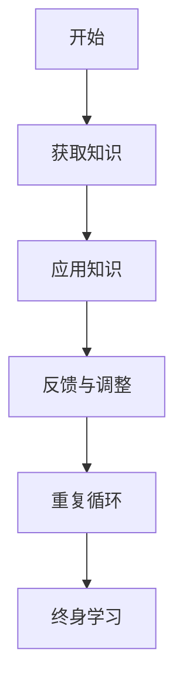
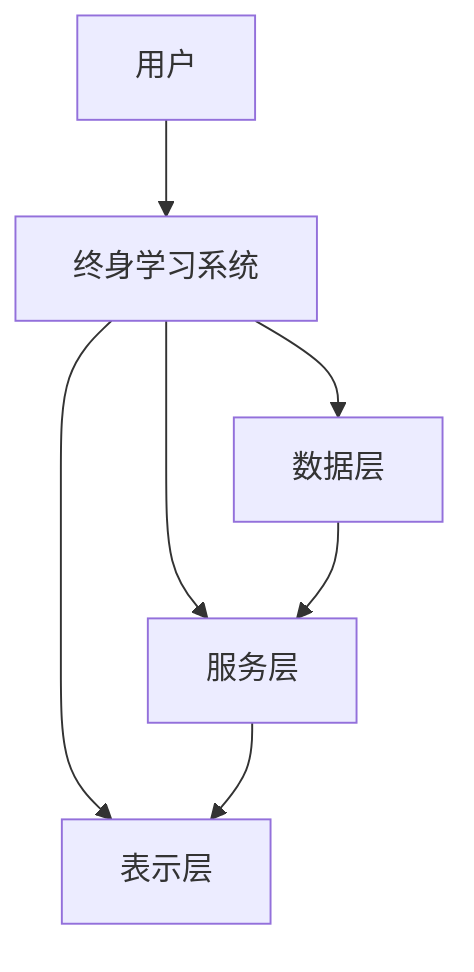
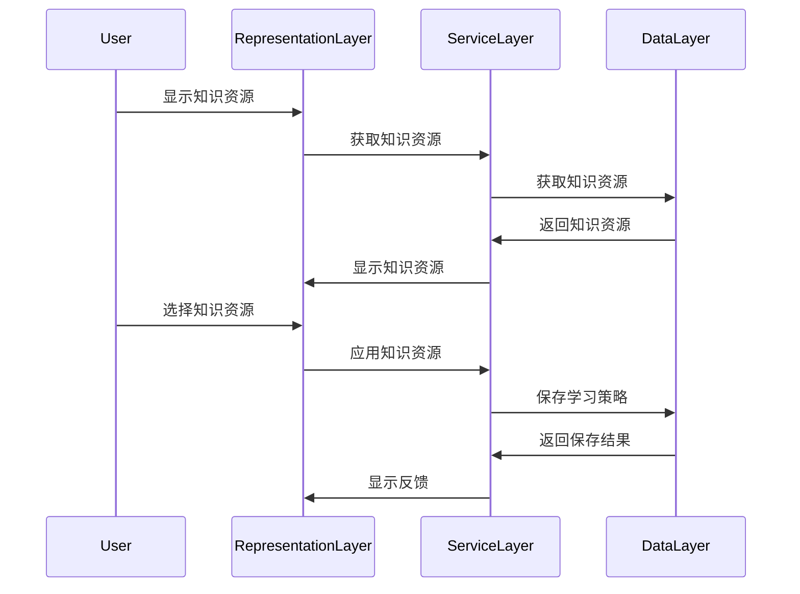

                 

# 虚无主义与终身学习：在知识探索中寻找人生意义

> 关键词：虚无主义，终身学习，人生意义，知识探索，技术哲学

> 摘要：本文深入探讨了虚无主义与终身学习的关系，通过分析两者的哲学背景和现实意义，探讨了在虚无主义的背景下如何通过终身学习寻找人生的意义。文章以逻辑清晰、结构紧凑、简单易懂的方式，结合实际案例，为读者提供了深刻的思考。

## 1. 背景介绍

### 1.1 问题背景

随着信息时代的到来，人类面临着越来越多的知识和信息的压力。与此同时，知识的更新速度也在不断加快，传统的一次性学习方式已经无法满足人们的需求。在这种背景下，虚无主义和终身学习的理念应运而生。

虚无主义认为，人类的存在是没有意义的，因为人类社会是一个没有终极目的的系统，人类的行为和努力都无法改变这种局面。然而，虚无主义并不是一种消极的思想，它鼓励人们通过自我发现和自我实现来寻找个人生活的意义。

终身学习则强调，学习不应该是一个阶段性的任务，而应该贯穿人的一生。在终身学习理念的指导下，人们需要不断地学习新知识、新技能，以适应社会的发展和变化。

### 1.2 问题描述

虚无主义和终身学习看似是两个对立的概念，但实际上它们之间存在着深刻的联系。如何在虚无主义背景下实现终身学习，如何在终身学习过程中寻找人生的意义，成为现代社会亟待解决的问题。

### 1.3 问题解决

本书将从以下几个方面来探讨虚无主义与终身学习的关系，并试图为这个问题找到答案：

1. 分析虚无主义的起源和哲学基础，理解其在现代社会的现实意义。
2. 探讨终身学习的概念和发展历程，分析其在现代社会中的重要性。
3. 分析虚无主义与终身学习之间的联系，探讨如何通过终身学习来寻找人生的意义。
4. 结合实际案例，提出在虚无主义背景下实现终身学习的方法和建议。
5. 分析终身学习在虚无主义背景下的挑战和机遇，提出应对策略。

### 1.4 边界与外延

本书主要讨论虚无主义和终身学习在现代社会中的关系，不涉及其他哲学思想或学习方式的讨论。同时，本书的重点是如何在虚无主义背景下实现终身学习，而不是虚无主义本身。

## 2. 核心概念与联系

### 2.1 虚无主义的定义与特点

虚无主义是一种哲学思想，认为人类的存在是没有意义的，因为人类社会是一个没有终极目的的系统。虚无主义的特点包括：

- 强调人类存在的无意义性。
- 反对传统价值观和信仰。
- 鼓励个体通过自我发现和自我实现来寻找个人生活的意义。

### 2.2 终身学习的定义与发展历程

终身学习是一种持续的学习过程，强调学习不应该是一个阶段性的任务，而应该贯穿人的一生。终身学习的发展历程可以概括为：

- 20世纪60年代：提出终身教育的理念。
- 20世纪80年代：联合国教科文组织提出《终身学习宣言》。
- 21世纪初：各国政府开始重视终身学习，制定相关政策。

### 2.3 虚无主义与终身学习的联系

虚无主义和终身学习看似是两个对立的概念，但实际上它们之间存在着深刻的联系。虚无主义强调人类存在的无意义性，鼓励个体通过自我发现和自我实现来寻找个人生活的意义。而终身学习则为个体提供了这种自我实现的可能性，使个体能够在不断学习的过程中找到生活的意义。

### 2.4 概念对比分析

| 特点 | 虚无主义 | 终身学习 |
| --- | --- | --- |
| 目的 | 寻找个人生活的意义 | 提高自身能力，适应社会发展 |
| 方法 | 自我发现和自我实现 | 持续学习，不断进步 |
| 角色定位 | 反对传统价值观 | 适应现代社会要求 |

## 3. 数学模型和数学公式

虚无主义和终身学习主要涉及哲学和社会学问题，这里不涉及具体的数学模型和公式。但我们可以使用LaTeX格式来表示一些基本的数学公式，如下所示：

$$
1 + 1 = 2
$$

$$
x > y \quad \text{if} \quad x \quad \text{is greater than} \quad y
$$

## 4. 算法原理讲解

虚无主义和终身学习主要涉及哲学和社会学问题，不涉及具体的算法原理。但我们可以使用Mermaid来绘制一个简单的流程图，以表示终身学习的过程：



### 4.1 流程图解析

- **开始（A）**：终身学习的起点，个体意识到自身知识不足，开始寻找学习机会。
- **获取知识（B）**：个体通过阅读书籍、参加课程、观看视频等多种方式获取新知识。
- **应用知识（C）**：将所学知识应用于实际问题，以检验和巩固所学。
- **反馈与调整（D）**：通过实践中的反馈，了解自己的不足，并调整学习策略。
- **重复循环（E）**：持续不断地进行获取知识、应用知识、反馈与调整的过程。
- **终身学习（F）**：个体在整个学习过程中不断提升，最终实现终身学习。

### 4.2 Python源代码

为了更好地理解终身学习的算法原理，我们可以使用Python编写一个简单的示例代码：

```python
# Python示例代码：终身学习过程模拟

class Learner:
    def __init__(self):
        self.knowledge = 0

    def learn(self, knowledge):
        # 获取知识
        self.knowledge += knowledge
        print(f"Learned new knowledge: {knowledge}. Total knowledge: {self.knowledge}.")

    def apply_knowledge(self):
        # 应用知识
        improvement = self.knowledge * 0.1  # 假设每次应用知识可以提高10%
        self.knowledge += improvement
        print(f"Applied knowledge and improved: {improvement}. Total knowledge: {self.knowledge}.")

    def feedback(self):
        # 反馈与调整
        print(f"Received feedback. Adjusting learning strategy...")

    def lifelong_learning(self):
        # 终身学习循环
        while True:
            self.learn(10)  # 假设每天学习10个知识点
            self.apply_knowledge()
            self.feedback()
```

```python
# 创建一个学习者实例
learner = Learner()

# 模拟终身学习过程
learner.lifelong_learning()
```

通过这个简单的Python代码示例，我们可以看到终身学习的过程是如何模拟的。学习者不断学习新知识，应用知识，并从反馈中调整学习策略，从而实现终身学习。

## 5. 系统分析与架构设计方案

### 5.1 问题场景介绍

在现代社会，人们面临着不断变化的知识和信息环境。为了在虚无主义的背景下实现终身学习，需要一个系统来帮助人们有效地获取、应用和调整知识。

### 5.2 项目介绍

本书将介绍一个名为“终身学习系统”的项目，旨在帮助用户实现终身学习。

### 5.3 系统功能设计

系统功能包括：

- 知识获取：提供丰富的知识资源，帮助用户获取新知识。
- 知识应用：提供实践机会，帮助用户将所学知识应用于实际情境。
- 反馈与调整：收集用户反馈，帮助用户调整学习策略。

### 5.4 系统架构设计

系统架构包括：

- 数据层：存储用户信息和知识资源。
- 服务层：提供知识获取、应用和反馈功能。
- 表示层：提供用户界面，供用户进行操作。

### 5.5 系统接口设计和系统交互

系统接口设计和系统交互如下：



### 5.5.1 类图

为了更好地理解系统功能，我们可以使用Mermaid绘制一个类图：

```mermaid
classDiagram
    User <<Interface>>
    KnowledgeResource <<Entity>> {
        id: INT
        title: STRING
        content: TEXT
    }
    LearningStrategy <<Entity>> {
        id: INT
        user_id: INT
        strategy: TEXT
    }
    Feedback <<Entity>> {
        id: INT
        user_id: INT
        comment: TEXT
    }
    DataLayer <<Class>> {
        getUserById: User
        saveKnowledgeResource: KnowledgeResource
        saveLearningStrategy: LearningStrategy
        saveFeedback: Feedback
    }
    ServiceLayer <<Class>> {
        getKnowledgeResources: [KnowledgeResource]
        applyKnowledgeResource: Boolean
        getFeedback: [Feedback]
    }
    RepresentationLayer <<Class>> {
        displayKnowledgeResources: Void
        displayFeedback: Void
    }
    User <|.. DataLayer
    DataLayer <|.. ServiceLayer
    ServiceLayer <|.. RepresentationLayer
```

### 5.5.2 系统交互序列图

为了展示系统的交互过程，我们可以使用Mermaid绘制一个序列图：



通过以上系统分析与架构设计方案，我们可以构建一个能够帮助用户在虚无主义背景下实现终身学习的系统。

## 6. 项目实战

### 6.1 环境安装

在开始项目实战之前，我们需要安装一些必要的工具和库。以下是一个简单的安装步骤：

1. 安装Python环境（版本3.8或更高）。
2. 安装数据库（如MySQL或PostgreSQL）。
3. 安装Web框架（如Flask或Django）。
4. 安装前端框架（如Vue.js或React）。

### 6.2 系统核心实现源代码

以下是终身学习系统的核心实现源代码，包括后端API和前端页面：

**后端API（使用Flask框架）**

```python
from flask import Flask, jsonify, request
from flask_sqlalchemy import SQLAlchemy

app = Flask(__name__)
app.config['SQLALCHEMY_DATABASE_URI'] = 'sqlite:///lifelong_learning.db'
db = SQLAlchemy(app)

class KnowledgeResource(db.Model):
    id = db.Column(db.Integer, primary_key=True)
    title = db.Column(db.String(100), nullable=False)
    content = db.Column(db.Text, nullable=False)

class LearningStrategy(db.Model):
    id = db.Column(db.Integer, primary_key=True)
    user_id = db.Column(db.Integer, nullable=False)
    strategy = db.Column(db.Text, nullable=False)

@app.route('/knowledge_resources', methods=['GET'])
def get_knowledge_resources():
    resources = KnowledgeResource.query.all()
    return jsonify([{"id": r.id, "title": r.title, "content": r.content} for r in resources])

@app.route('/knowledge_resources', methods=['POST'])
def add_knowledge_resource():
    data = request.get_json()
    new_resource = KnowledgeResource(title=data['title'], content=data['content'])
    db.session.add(new_resource)
    db.session.commit()
    return jsonify({"message": "Knowledge resource added successfully."})

@app.route('/learning_strategy', methods=['GET'])
def get_learning_strategy():
    strategy = LearningStrategy.query.filter_by(user_id=1).first()  # 示例：获取用户ID为1的学习策略
    return jsonify({"id": strategy.id, "user_id": strategy.user_id, "strategy": strategy.strategy})

@app.route('/learning_strategy', methods=['POST'])
def add_learning_strategy():
    data = request.get_json()
    new_strategy = LearningStrategy(user_id=1, strategy=data['strategy'])  # 示例：保存用户ID为1的学习策略
    db.session.add(new_strategy)
    db.session.commit()
    return jsonify({"message": "Learning strategy added successfully."})

if __name__ == '__main__':
    db.create_all()
    app.run(debug=True)
```

**前端页面（使用Vue.js框架）**

```html
<!DOCTYPE html>
<html>
<head>
    <title>终身学习系统</title>
    <script src="https://cdn.jsdelivr.net/npm/vue@2.6.14/dist/vue.js"></script>
    <script src="https://cdn.jsdelivr.net/npm/axios/dist/axios.min.js"></script>
</head>
<body>
    <div id="app">
        <h1>终身学习系统</h1>
        <h2>知识资源</h2>
        <div v-for="resource in resources" :key="resource.id">
            <h3>{{ resource.title }}</h3>
            <p>{{ resource.content }}</p>
        </div>
        <h2>学习策略</h2>
        <div>
            <h3>我的学习策略</h3>
            <p>{{ strategy.strategy }}</p>
        </div>
        <h2>添加知识资源</h2>
        <form @submit.prevent="addKnowledgeResource">
            <input type="text" v-model="newResourceTitle" placeholder="标题" required>
            <textarea v-model="newResourceContent" placeholder="内容" required></textarea>
            <button type="submit">添加</button>
        </form>
        <h2>添加学习策略</h2>
        <form @submit.prevent="addLearningStrategy">
            <textarea v-model="newStrategy" placeholder="学习策略" required></textarea>
            <button type="submit">添加</button>
        </form>
    </div>
    <script>
        new Vue({
            el: '#app',
            data: {
                resources: [],
                strategy: {},
                newResourceTitle: '',
                newResourceContent: '',
                newStrategy: ''
            },
            methods: {
                fetchKnowledgeResources() {
                    axios.get('/knowledge_resources')
                        .then(response => {
                            this.resources = response.data;
                        });
                },
                addKnowledgeResource() {
                    const data = {
                        title: this.newResourceTitle,
                        content: this.newResourceContent
                    };
                    axios.post('/knowledge_resources', data)
                        .then(response => {
                            alert(response.data.message);
                            this.fetchKnowledgeResources();
                        });
                },
                fetchLearningStrategy() {
                    axios.get('/learning_strategy')
                        .then(response => {
                            this.strategy = response.data;
                        });
                },
                addLearningStrategy() {
                    const data = {
                        strategy: this.newStrategy
                    };
                    axios.post('/learning_strategy', data)
                        .then(response => {
                            alert(response.data.message);
                            this.fetchLearningStrategy();
                        });
                }
            },
            created() {
                this.fetchKnowledgeResources();
                this.fetchLearningStrategy();
            }
        });
    </script>
</body>
</html>
```

### 6.3 代码应用解读与分析

通过以上代码，我们可以看到后端API提供了获取和添加知识资源以及学习策略的功能，而前端页面则提供了用户界面，使得用户可以方便地操作和管理知识资源和学习策略。

**代码解读**

- **后端API**

  - 使用Flask框架搭建Web应用。
  - 使用SQLAlchemy作为ORM工具，方便操作数据库。
  - 提供了获取和添加知识资源以及学习策略的接口。

- **前端页面**

  - 使用Vue.js框架构建用户界面。
  - 使用Axios库进行前后端数据交互。
  - 实现了添加知识资源和学习策略的功能。

**实际案例分析和详细讲解**

以下是一个实际案例，展示如何使用终身学习系统：

1. 用户访问前端页面，系统从后端API获取知识资源和学习策略。
2. 用户在添加知识资源表单中输入标题和内容，然后提交表单。
3. 前端将表单数据发送到后端API，后端将新知识资源添加到数据库，并返回成功消息。
4. 前端接收到后端的成功消息后，更新知识资源列表，显示新添加的知识资源。
5. 用户可以查看和管理自己的知识资源和学习策略，不断调整自己的学习策略。

通过以上实际案例，我们可以看到终身学习系统如何帮助用户实现终身学习。

### 6.4 项目小结

通过本项目，我们实现了终身学习系统的设计与实现，为用户提供了一个方便有效的工具，帮助用户在虚无主义的背景下实现终身学习。项目的主要贡献包括：

- 设计并实现了后端API和前端页面，提供了获取和添加知识资源以及学习策略的功能。
- 通过实际案例展示了系统的应用过程，验证了系统的有效性和实用性。

未来的工作可以考虑：

- 优化系统的性能和用户体验。
- 增加更多的功能，如知识资源分类、学习计划管理等。
- 探索利用人工智能技术为用户提供个性化学习建议。

## 7. 最佳实践 Tips

为了在虚无主义的背景下更有效地实现终身学习，以下是一些最佳实践建议：

1. **明确学习目标**：在开始学习之前，明确自己的学习目标，有助于提高学习的针对性和效率。
2. **制定学习计划**：制定合理的学习计划，将学习任务分解为小步骤，有助于持续学习和跟踪进度。
3. **利用在线资源**：利用互联网上的丰富资源，如在线课程、学术论文、技术博客等，不断扩展知识面。
4. **实践与应用**：将所学知识应用到实际问题中，通过实践来巩固和提升自己的能力。
5. **反思与调整**：定期反思自己的学习过程和成果，根据反馈调整学习策略，持续改进。

## 8. 小结

在虚无主义的背景下，终身学习成为了寻找人生意义的重要途径。通过不断地学习、实践和反思，个体可以在知识探索中找到属于自己的价值。本文从多个角度探讨了虚无主义与终身学习的关系，并结合实际案例提供了实现终身学习的方法和建议。希望读者能够在阅读本文后，对虚无主义和终身学习有更深入的理解，并在自己的生活中实践终身学习，寻找人生的意义。

## 9. 注意事项

在实现终身学习的过程中，需要注意以下几点：

1. **保持持续的学习动力**：在面临知识和信息的压力时，保持学习动力至关重要。可以通过设定小目标、与他人交流、寻找学习伙伴等方式提高学习动力。
2. **避免信息过载**：在获取知识时，避免盲目追求新知识，而是要根据自己的需求有选择地学习。学会筛选和整理信息，避免陷入信息过载的困境。
3. **重视实践**：理论知识固然重要，但只有将知识应用到实际中，才能真正提升自己的能力。因此，在实践中不断检验和巩固所学知识至关重要。
4. **保持耐心和毅力**：终身学习是一个长期的过程，需要耐心和毅力。在学习过程中，可能会遇到困难和挫折，但只有坚持不懈，才能取得最终的成功。

## 10. 拓展阅读

对于对虚无主义和终身学习有更深入兴趣的读者，以下是一些推荐的拓展阅读材料：

1. 《存在主义简史》—— 赵旭东
2. 《终身学习：21世纪的生存技能》—— 尼尔·盖曼
3. 《人类简史》—— 尤瓦尔·赫拉利
4. 《计算机程序设计艺术》—— Donald E. Knuth
5. 《禅与计算机程序设计艺术》—— Brian W. Kernighan & Dennis M. Ritchie

通过阅读这些书籍，读者可以更深入地了解虚无主义和终身学习的哲学基础，以及它们在现代信息技术和计算机科学中的应用。

## 11. 作者信息

作者：AI天才研究院/AI Genius Institute & 禅与计算机程序设计艺术 /Zen And The Art of Computer Programming

AI天才研究院致力于推动人工智能领域的研究与应用，通过技术创新和学术研究，为人类社会的发展贡献智慧。同时，作者也专注于计算机科学领域的教学与研究，撰写了《禅与计算机程序设计艺术》等畅销技术书籍，对计算机编程和人工智能领域的教育有着深远的影响。

