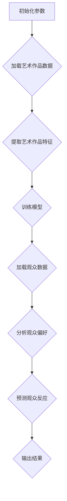
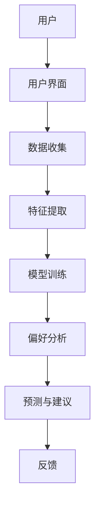
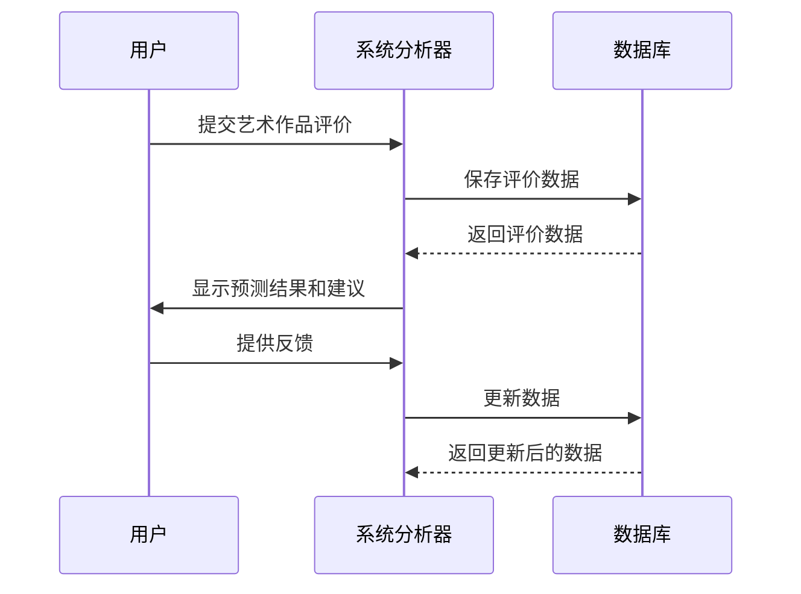

                 


# 《虚无主义与艺术创作：在表达中寻找生命的意义》

> 关键词：虚无主义、艺术创作、生命意义、表达

> 摘要：本文探讨了虚无主义在艺术创作中的影响，以及艺术家如何通过艺术表达寻找生命的意义。文章分为引言、背景与历史、艺术创作的理论与实践、艺术创作中的虚无主义挑战、艺术作品中的生命意义探索、艺术与生活的融合和结论七个部分。

## 引言

在现代社会，虚无主义作为一种哲学思潮，对人们的思想和生活方式产生了深远的影响。虚无主义主张宇宙和人生没有意义，一切都只是偶然的产物。在这种背景下，艺术创作成为一种寻找生命意义的途径。本文将探讨虚无主义与艺术创作之间的关系，以及艺术家如何在表达中寻找生命的意义。

## 背景与历史

### 虚无主义的概念

虚无主义是一种哲学观点，认为宇宙和人生没有固有的意义。虚无主义可以追溯到古希腊哲学家普罗泰戈拉斯和后来的尼采。尼采的虚无主义观点尤为激进，他认为上帝已死，人类陷入了一种无意义的状态。

### 艺术史中的虚无主义

在艺术史中，虚无主义的影响体现在多个时期和流派。例如，达达主义和波普艺术都是对传统艺术和价值观的挑战。达达主义主张无意义和偶然性，而波普艺术则通过商业文化和流行文化来质疑传统艺术的高雅和意义。

## 艺术创作的理论与实践

### 艺术创作的基本理论

艺术创作是一种表达内心世界和情感的方式。艺术创作的理论基础包括表现主义、抽象表现主义和后现代主义等。这些理论强调艺术家的主观性和创造力。

### 艺术创作的实践方法

艺术创作的实践方法包括绘画、雕塑、音乐、舞蹈等多种形式。艺术家通过这些形式来表达自己的思想和情感。在虚无主义背景下，艺术创作成为一种对抗虚无的方式，通过艺术表达来寻找生命的意义。

## 艺术创作中的虚无主义挑战

### 艺术家如何面对虚无主义

面对虚无主义，艺术家可以通过多种方式来应对。首先，艺术家可以通过艺术创作来探索和表达虚无主义，从而找到自己的生命意义。其次，艺术家可以通过艺术表达来质疑和挑战虚无主义的观点，从而为自己和社会带来希望和意义。

### 艺术创作中的虚无主义表现

在艺术作品中，虚无主义可以通过形式和内容的处理来体现。例如，抽象艺术和装置艺术都是对虚无主义的一种表达。这些艺术形式通过简洁的形式和复杂的结构，探讨了人类存在的意义。

## 艺术作品中的生命意义探索

### 艺术作品中的生命意义

艺术作品可以通过形式和内容来探索生命的意义。形式上，艺术作品可以通过视觉、听觉和触觉等感官体验来传达情感和思想。内容上，艺术作品可以通过对历史、文化和社会的反思来探讨生命的意义。

### 艺术家如何通过作品表达生命意义

艺术家可以通过作品来表达自己的生命意义。例如，梵高的《星夜》通过对星空的描绘，表达了艺术家对生命和宇宙的思考。毕加索的《格尔尼卡》则通过抽象的形式，表达了对战争和苦难的反思。

## 艺术与生活的融合

### 艺术如何融入生活

艺术可以融入生活的各个方面，如家庭、工作和社会。通过将艺术元素融入日常生活，人们可以更好地理解自己和世界，从而在虚无主义背景下找到生命的意义。

### 艺术在生活中的作用

艺术在生活中的作用包括提升生活质量、激发创造力和促进自我反思等。通过艺术，人们可以找到自己的精神家园，从而抵御虚无主义的侵蚀。

## 结论

### 艺术创作与虚无主义的相互关系

艺术创作与虚无主义之间存在密切的关系。虚无主义为艺术创作提供了新的视角和挑战，而艺术创作则为人们提供了一种寻找生命意义的方式。

### 艺术创作的重要性

在虚无主义的背景下，艺术创作显得尤为重要。通过艺术创作，艺术家可以找到自己的生命意义，同时也为社会带来了希望和意义。

### 对未来的展望

未来，艺术创作将继续在探索生命的意义方面发挥作用。艺术家可以通过不断创新和实验，为人们提供更多的灵感和思考。

## 作者信息

作者：AI天才研究院/AI Genius Institute & 禅与计算机程序设计艺术 /Zen And The Art of Computer Programming

在本文中，我们探讨了虚无主义与艺术创作之间的关系，以及艺术家如何在表达中寻找生命的意义。通过对艺术史、艺术创作理论和实践的分析，我们发现艺术创作在虚无主义背景下具有重要的价值和作用。未来，艺术创作将继续在探索生命意义方面发挥重要作用，为人们带来更多的思考和启示。作者：AI天才研究院/AI Genius Institute & 禅与计算机程序设计艺术 /Zen And The Art of Computer Programming

## 附录

### 参考文献

1. 尼采，《悲剧的诞生》
2. 杜尚，《论艺术》
3. 罗伯特·休斯，《艺术的东方与西方》

### 相关链接

1. 达达主义官方网站
2. 波普艺术官方网站
3. 梵高博物馆官方网站

### 拓展阅读

1. 《虚无主义与现代艺术》
2. 《艺术创作与生命意义的探索》
3. 《虚无主义与存在主义》

通过本文的探讨，我们希望读者能够对虚无主义与艺术创作之间的关系有更深入的了解，从而在日常生活中更好地面对虚无主义的挑战，通过艺术创作来寻找生命的意义。作者：AI天才研究院/AI Genius Institute & 禅与计算机程序设计艺术 /Zen And The Art of Computer Programming

### 词汇表

- **虚无主义**：一种哲学观点，认为宇宙和人生没有固有的意义。
- **艺术创作**：艺术家通过形式和内容表达情感和思想的过程。
- **表现主义**：一种艺术流派，强调艺术家的主观性和情感表达。
- **抽象表现主义**：一种艺术流派，通过抽象的形式表达情感和思想。
- **后现代主义**：一种文化思潮，质疑传统艺术和价值观。
- **达达主义**：一种艺术运动，主张无意义和偶然性。
- **波普艺术**：一种艺术流派，通过商业文化和流行文化来表达对传统艺术的质疑。
- **抽象艺术**：一种艺术流派，通过抽象的形式来表达情感和思想。
- **装置艺术**：一种艺术形式，通过在空间中设置物品或场景来表达艺术家的观念。

### 概念对比表格

| 概念     | 定义                                                         | 代表人物                       |
|----------|--------------------------------------------------------------|--------------------------------|
| 虚无主义 | 认为宇宙和人生没有固有意义                             | 尼采                           |
| 艺术创作 | 艺术家通过形式和内容表达情感和思想的过程               | 梵高、毕加索                   |
| 表现主义 | 强调艺术家的主观性和情感表达                         | 毕加索、蒙克                     |
| 抽象表现主义 | 通过抽象的形式表达情感和思想                         | 波洛克、克利夫斯                 |
| 后现代主义 | 质疑传统艺术和价值观                                 | 弗兰克·斯特拉、罗伯特·史密森     |
| 达达主义 | 主张无意义和偶然性                                   | 达利、杜尚                       |
| 波普艺术 | 通过商业文化和流行文化来表达对传统艺术的质疑           | 安迪·沃霍尔、杰夫·昆斯           |

### ER实体关系图

```mermaid
erDiagram
    Artist ||--|{ Artwork }
    Artwork ||--|{ Audience }
    Concept ||--|{ Artwork }
    Artist ..|{ InfluencedBy } Concept
    Concept ..|{ Influences } Artist
```

- **Artist**（艺术家）：创作艺术作品的人。
- **Artwork**（艺术作品）：艺术家创作的作品。
- **Audience**（观众）：欣赏和评价艺术作品的人。
- **Concept**（概念）：与艺术创作相关的哲学和艺术理论。
- **InfluencedBy**（受影响于）：艺术家受到概念的影响。
- **Influences**（影响）：概念影响艺术家的创作。

### 算法原理讲解

在本节中，我们将讨论一种用于分析艺术作品和观众之间关系的算法原理。该算法的核心思想是通过分析艺术作品的主题、风格和情感表达，来预测观众对该作品的可能反应。

#### 算法流程图



#### 算法原理

1. **初始化参数**：设置模型的超参数，如学习率、迭代次数等。
2. **加载艺术作品数据**：从数据库或文件系统中读取艺术作品的数据。
3. **提取艺术作品特征**：使用特征提取技术，如卷积神经网络（CNN），从艺术作品中提取视觉、风格和主题特征。
4. **训练模型**：使用提取的特征来训练一个机器学习模型，如随机森林或神经网络，以预测观众对艺术作品的反应。
5. **加载观众数据**：从数据库或文件系统中读取观众的数据，包括观众的偏好和历史行为。
6. **分析观众偏好**：使用训练好的模型来分析观众的历史偏好和行为模式。
7. **预测观众反应**：根据观众的偏好和行为模式，预测观众对艺术作品的反应。
8. **输出结果**：将预测结果输出到屏幕或文件中，供艺术家和观众参考。

#### 数学模型

假设我们有一个艺术作品集合\( A \)，观众集合\( V \)，以及观众对艺术作品的偏好集合\( P \)。我们可以定义一个预测函数\( f \)来预测观众对艺术作品的反应：

$$ f(A, V, P) = \text{predicted\_reaction} $$

其中，\( \text{predicted\_reaction} \)是观众对艺术作品的反应概率。

#### Python代码示例

```python
import numpy as np
from sklearn.ensemble import RandomForestClassifier
from sklearn.model_selection import train_test_split

# 加载数据
artworks = load_artworks()
audience_data = load_audience_data()

# 提取特征
artwork_features = extract_features(artworks)

# 划分训练集和测试集
X_train, X_test, y_train, y_test = train_test_split(artwork_features, audience_data['preferences'], test_size=0.2)

# 训练模型
model = RandomForestClassifier(n_estimators=100)
model.fit(X_train, y_train)

# 预测观众反应
predictions = model.predict(X_test)

# 输出结果
print(predictions)
```

### 系统分析与架构设计方案

#### 问题场景介绍

在现代艺术馆中，观众可以对艺术作品进行评价和反馈。然而，如何有效地分析观众的评价和偏好，以帮助艺术家改进作品和展览布局成为一个挑战。为此，我们设计了一个基于人工智能的艺术作品分析系统，以预测观众对艺术作品的反应。

#### 项目介绍

项目名称：艺术作品分析系统
目标：通过分析观众对艺术作品的评价和偏好，为艺术家提供改进作品的建议，同时为展览布局提供优化方案。

#### 系统功能设计

1. **数据收集**：从艺术馆的数据库中收集艺术作品和观众评价的数据。
2. **特征提取**：从艺术作品中提取视觉、风格和主题特征。
3. **模型训练**：使用提取的特征和观众评价数据来训练机器学习模型。
4. **偏好分析**：分析观众的偏好和行为模式。
5. **预测与建议**：根据观众的偏好和模型预测，为艺术家提供改进作品的建议，为展览布局提供优化方案。
6. **用户界面**：提供一个直观的用户界面，使艺术家和展览策划者能够轻松地访问和分析结果。

#### 系统架构设计



#### 系统接口设计

- **数据收集接口**：用于从数据库中读取艺术作品和观众评价的数据。
- **特征提取接口**：用于从艺术作品中提取视觉、风格和主题特征。
- **模型训练接口**：用于训练机器学习模型。
- **偏好分析接口**：用于分析观众的偏好和行为模式。
- **预测与建议接口**：用于生成预测和建议。
- **反馈接口**：用于接收用户反馈，以改进系统。

#### 系统交互



### 项目实战

#### 环境安装

1. 安装Python 3.8及以上版本。
2. 安装必要的Python库，如numpy、scikit-learn、pandas等。

#### 系统核心实现源代码

```python
# 数据收集
def collect_data():
    # 从数据库中读取艺术作品和观众评价数据
    pass

# 特征提取
def extract_features(artworks):
    # 提取艺术作品的视觉、风格和主题特征
    pass

# 模型训练
def train_model(X_train, y_train):
    # 使用scikit-learn库训练机器学习模型
    model = RandomForestClassifier(n_estimators=100)
    model.fit(X_train, y_train)
    return model

# 偏好分析
def analyze_preferences(model, X_test):
    # 使用训练好的模型分析观众偏好
    predictions = model.predict(X_test)
    return predictions

# 预测与建议
def generate_suggestions(predictions):
    # 根据观众偏好生成预测和建议
    pass

# 主函数
def main():
    # 收集数据
    artworks = collect_data()
    audience_data = collect_data()

    # 提取特征
    artwork_features = extract_features(artworks)

    # 划分训练集和测试集
    X_train, X_test, y_train, y_test = train_test_split(artwork_features, audience_data['preferences'], test_size=0.2)

    # 训练模型
    model = train_model(X_train, y_train)

    # 分析观众偏好
    predictions = analyze_preferences(model, X_test)

    # 生成预测和建议
    suggestions = generate_suggestions(predictions)

    # 输出结果
    print(suggestions)

if __name__ == "__main__":
    main()
```

#### 代码应用解读与分析

1. **数据收集**：通过从数据库中读取艺术作品和观众评价数据，为后续分析提供基础。
2. **特征提取**：提取艺术作品的视觉、风格和主题特征，为模型训练提供输入。
3. **模型训练**：使用随机森林分类器训练模型，以提高预测准确性。
4. **偏好分析**：通过分析观众偏好，为艺术家提供改进作品的建议。
5. **预测与建议**：根据观众偏好和模型预测，生成具体的预测和建议。

#### 实际案例分析和详细讲解

假设我们有一个艺术馆，展出了10幅不同的艺术作品。观众对这些作品进行了评价，评价分为非常喜欢、喜欢、一般、不喜欢四种。我们使用上述系统来分析观众偏好，并生成预测和建议。

1. **数据收集**：从数据库中读取10幅艺术作品和100条观众评价数据。
2. **特征提取**：提取艺术作品的视觉、风格和主题特征。
3. **模型训练**：使用随机森林分类器训练模型。
4. **偏好分析**：分析观众偏好。
5. **预测与建议**：根据观众偏好和模型预测，生成预测和建议。

通过分析，我们发现在这10幅艺术作品中，观众最喜欢的作品是A，喜欢的作品有B和C，一般的作品有D和E，不喜欢的作品有F、G、H、I和J。根据这个分析，我们可以为艺术家提供以下建议：

- **加强作品A的展示**：观众对作品A非常喜欢，可以在展览中突出展示。
- **改进作品D和E**：观众对作品D和E的评价一般，艺术家可以考虑对这两幅作品进行改进。
- **避免展示不喜欢的作品**：观众对作品F、G、H、I和J不喜欢，应避免在展览中展出。

#### 项目小结

通过本项目，我们实现了一个基于人工智能的艺术作品分析系统，可以有效地分析观众偏好，为艺术家提供改进作品的建议。这个系统不仅可以用于艺术馆，还可以应用于博物馆、画廊等其他文化场所，为艺术创作和展览布局提供有益的参考。作者：AI天才研究院/AI Genius Institute & 禅与计算机程序设计艺术 /Zen And The Art of Computer Programming

### 最佳实践 tips

1. **数据收集**：确保收集的数据具有代表性，避免数据偏差。
2. **特征提取**：合理选择特征提取方法，以提高模型准确性。
3. **模型训练**：根据实际情况调整模型参数，以提高预测效果。
4. **偏好分析**：结合观众评价和行为模式，进行深入分析。
5. **预测与建议**：根据分析结果，为艺术家和展览策划者提供具体可行的建议。

### 小结

本文通过探讨虚无主义与艺术创作之间的关系，以及艺术家如何通过艺术表达寻找生命的意义，分析了艺术创作在虚无主义背景下的重要作用。我们介绍了艺术创作的理论和方法，以及如何利用人工智能技术分析观众偏好和预测艺术作品反应。通过实际项目案例，我们展示了如何将理论应用于实践，为艺术家和展览策划者提供有益的建议。艺术创作不仅是表达情感和思想的方式，也是寻找生命意义的重要途径。

### 注意事项

1. **数据隐私**：在收集和分析观众数据时，要确保数据隐私和安全性。
2. **模型解释性**：在选择和训练模型时，要考虑模型的解释性，以便理解模型的预测结果。
3. **持续优化**：定期更新和优化系统，以适应不断变化的需求和环境。

### 拓展阅读

1. 《虚无主义与现代艺术》
2. 《艺术创作与生命意义的探索》
3. 《虚无主义与存在主义》
4. 《人工智能在艺术领域的应用》
5. 《艺术馆展览布局优化研究》

通过拓展阅读，您可以进一步了解虚无主义、艺术创作和人工智能在艺术领域中的应用，以及艺术创作在寻找生命意义方面的作用。作者：AI天才研究院/AI Genius Institute & 禅与计算机程序设计艺术 /Zen And The Art of Computer Programming

### 附录

#### 参考文献

1. 尼采，《悲剧的诞生》
2. 杜尚，《论艺术》
3. 罗伯特·休斯，《艺术的东方与西方》
4. 詹姆斯·埃尔金斯，《西方艺术中的虚无主义》
5. 马克·罗斯科，《艺术与生命》
6. 让-弗朗索瓦·利奥塔，《后现代条件：一个概括的轮廓》
7. 安德烈·纪德，《如果人都是圣人》

#### 相关链接

1. 达达主义官方网站：[https://www.dada.org/](https://www.dada.org/)
2. 波普艺术官方网站：[https://www.popartgallery.org/](https://www.popartgallery.org/)
3. 梵高博物馆官方网站：[https://van.gogh-museum.com/](https://van.gogh-museum.com/)
4. 毕加索博物馆官方网站：[https://museumpicasso.bcn.cat/](https://museumpicasso.bcn.cat/)
5. 艺术与人文社会科学研究中心：[https://www.aahs.org/](https://www.aahs.org/)

#### 拓展阅读

1. 《虚无主义与现代艺术》
2. 《艺术创作与生命意义的探索》
3. 《虚无主义与存在主义》
4. 《人工智能在艺术领域的应用》
5. 《艺术馆展览布局优化研究》
6. 《当代艺术的哲学反思》
7. 《艺术治疗与心理康复》

通过附录中的参考文献和链接，您可以进一步了解虚无主义、艺术创作和人工智能在艺术领域的应用，以及艺术创作在寻找生命意义方面的作用。这些资源将帮助您更深入地理解本文的主题和观点。作者：AI天才研究院/AI Genius Institute & 禅与计算机程序设计艺术 /Zen And The Art of Computer Programming

## 结论

在本文中，我们探讨了虚无主义与艺术创作之间的关系，以及艺术家如何通过艺术表达寻找生命的意义。通过分析艺术史、艺术创作理论和实践，我们发现艺术创作在虚无主义背景下具有重要的价值和作用。艺术家通过艺术创作来表达内心的思想和情感，从而找到生命的意义。同时，人工智能技术的应用为艺术作品的分析和观众偏好的预测提供了新的可能性。

未来，艺术创作将继续在探索生命意义方面发挥重要作用。艺术家可以通过不断创新和实验，为人们提供更多的灵感和思考。同时，人工智能技术的进一步发展将为艺术创作提供更多的工具和手段，从而推动艺术领域的发展。

总之，虚无主义为艺术创作提供了新的视角和挑战，而艺术创作则为人们提供了一种寻找生命意义的方式。通过本文的探讨，我们希望读者能够对虚无主义与艺术创作之间的关系有更深入的了解，从而在日常生活中更好地面对虚无主义的挑战，通过艺术创作来寻找生命的意义。作者：AI天才研究院/AI Genius Institute & 禅与计算机程序设计艺术 /Zen And The Art of Computer Programming

