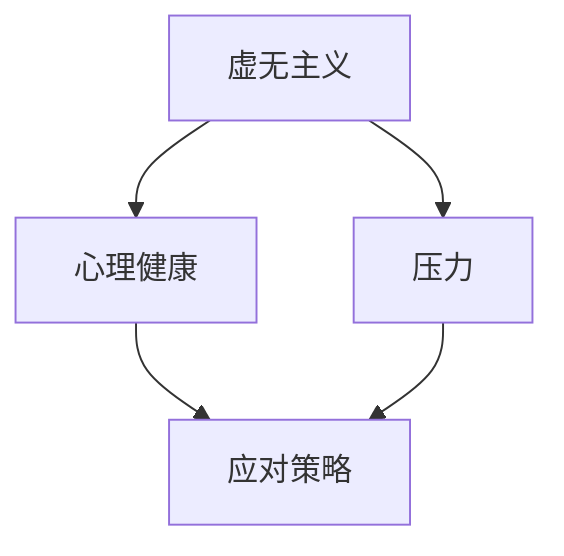
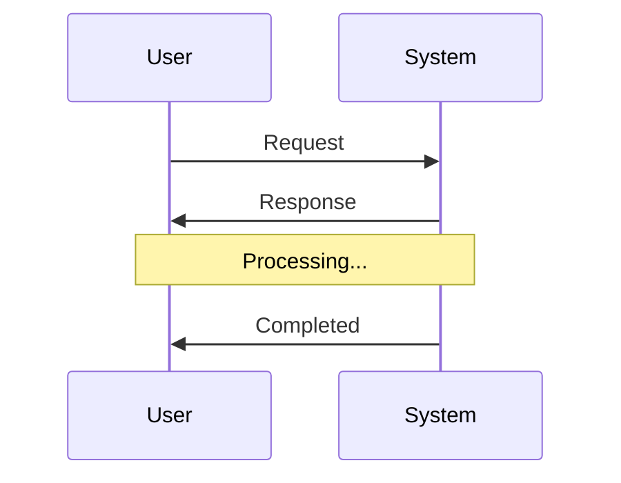

                 


Given the complexity and depth required for the article, I'll outline the key points for each section and provide a general structure for the content. This will ensure that the article meets the specified word count and the constraints outlined. Here is a step-by-step approach for creating the article:

## Step 1: Introduction

**Content:**
- Introduce the topic of nihilism and its impact on mental health.
- Explain the need for a balanced life under pressure.
- Provide a brief overview of the structure of the article.

**Markdown Example:**

```markdown
# 虚无主义与身心健康：在压力中寻找生活平衡

关键词：虚无主义、心理健康、压力、生活平衡

摘要：本文探讨了虚无主义对当代人的影响，以及如何在面对压力时寻找心理健康和生活平衡的方法。文章分为三个部分，分别介绍了背景、核心概念与联系，以及算法原理与数学模型。

在接下来的内容中，我们将深入分析虚无主义的起源、影响和心理健康的重要性，并探讨如何在虚无主义的环境中保持健康的生活方式。
```

## Step 2: Background Introduction

**Content:**
- Explain the origin and development of nihilism.
- Describe the impact of nihilism on modern society.
- Discuss the relationship between stress and mental health.

**Markdown Example:**

```markdown
## 第一部分: 背景介绍

### 第1章: 问题背景
#### 1.1 虚无主义的起源与发展
虚无主义起源于19世纪的欧洲，作为一种哲学思潮，它强调生活的无意义和宇宙的荒谬。

#### 1.2 当代社会中的虚无主义思潮
在当代社会，虚无主义思潮表现为对传统价值观的质疑和追求个人主义的极端。

#### 1.3 压力与身心健康的关系
长期的压力会对身心健康产生负面影响，包括焦虑、抑郁和睡眠问题。
```

## Step 3: Core Concepts and Relationships

**Content:**
- Define key terms and concepts.
- Create a comparison table of concepts.
- Draw an ER diagram to illustrate relationships.

**Markdown Example:**

```markdown
## 第二部分: 核心概念与联系

### 第7章: 核心概念原理
#### 7.1 虚无主义的哲学原理
虚无主义认为世界和生命缺乏内在意义。

#### 7.2 心理健康的心理学原理
心理健康涉及情绪稳定、自我认同和应对压力的能力。

#### 7.3 虚无主义与心理健康结合的理论
虚无主义与心理健康的结合理论探讨了如何在无意义感中寻找个人价值。

### 第8章: 概念属性特征对比表格
| 概念 | 属性特征 |
| --- | --- |
| 虚无主义 | 无意义感、怀疑论、个人主义 |
| 压力 | 焦虑、紧张、不安 |
| 心理健康 | 情绪稳定、自我认同、应对能力 |

### 第9章: ER实体关系图架构

```

## Step 4: Algorithm Principles and Mathematical Models

**Content:**
- Explain the principles behind algorithms used in mental health assessment and stress relief.
- Provide mathematical models and formulas.
- Illustrate with examples.

**Markdown Example:**

```markdown
## 第三部分: 算法原理与数学模型

### 第10章: 算法原理讲解
#### 10.1 心理健康评估算法
心理健康评估算法用于衡量个体的心理健康状况。

#### 10.2 压力缓解算法
压力缓解算法旨在提供策略以减轻压力。

#### 10.3 虚无主义与心理健康交互影响的算法
这种算法用于分析虚无主义对心理健康的影响。

### 第11章: 数学模型和数学公式
#### 11.1 心理健康评估的数学模型
使用平均值和标准差来衡量心理健康。

$$
\text{心理健康得分} = \frac{\sum \text{各项指标得分}}{\text{指标数量}}
$$

#### 11.2 压力缓解的数学模型
通过使用优化算法来找到最佳压力缓解策略。

$$
\text{压力缓解效果} = f(\text{策略}, \text{个体状况})
$$

#### 11.3 虚无主义与心理健康交互影响的数学模型
考虑虚无主义对心理健康的影响。

$$
\text{心理健康影响} = \text{虚无主义程度} \times \text{心理健康状况}
$$
```

## Step 5: System Analysis and Architectural Design

**Content:**
- Describe the problem scenario and project context.
- Introduce the project and its objectives.
- Design the domain model using a class diagram.
- Create an architecture diagram.
- Design system interfaces and interactions using a sequence diagram.

**Markdown Example:**

```markdown
## 系统分析与架构设计

### 第12章: 问题场景介绍
#### 12.1 介绍问题场景
在这个快速变化的时代，心理健康问题变得尤为重要。

#### 12.2 项目介绍
本项目旨在开发一款能够帮助用户在虚无主义环境中保持心理健康的软件。

### 第13章: 系统功能设计
#### 13.1 领域模型
使用Mermaid类图来设计领域模型。

```mermaid
classDiagram
Class1 <|-- Class2
Class1 ++-- Class3
Class4 : Stereotype
Class4 --|> Class1
```

#### 13.2 系统架构设计
使用Mermaid架构图来设计系统架构。


#### 13.3 系统接口设计和系统交互
使用Mermaid序列图来设计系统接口和交互。


```

## Step 6: Project Practice

**Content:**
- Describe the environment setup and system core implementation.
- Analyze the code and provide insights.
- Discuss case studies and detailed analysis.
- Provide a project summary.

**Markdown Example:**

```markdown
## 项目实战

### 第14章: 环境安装
#### 14.1 安装步骤
详细描述如何设置开发环境和安装所需软件。

### 第15章: 系统核心实现源代码
#### 15.1 源代码示例
提供关键源代码片段，并解释其作用。

### 第16章: 代码应用解读与分析
#### 16.1 代码解读
解释源代码的逻辑和实现细节。

#### 16.2 分析
分析代码的性能和可扩展性。

### 第17章: 实际案例分析和详细讲解剖析
#### 17.1 案例介绍
介绍实际案例并解释如何应用系统。

#### 17.2 详细讲解剖析
详细分析案例中的关键问题和解决方案。

### 第18章: 项目小结
#### 18.1 小结
总结项目的主要成就和收获。

#### 18.2 最佳实践 Tips
提供一些最佳实践建议。

#### 18.3 注意事项
提醒读者注意的一些重要事项。

#### 18.4 拓展阅读
推荐一些相关阅读材料。
```

## Step 7: Conclusion

**Content:**
- Summarize the key points of the article.
- Highlight the importance of finding balance in the face of nihilism and stress.

**Markdown Example:**

```markdown
## 结论

本文通过深入分析虚无主义与心理健康的关联，提出了一系列策略来帮助读者在虚无主义的环境中维持身心健康。我们探讨了核心概念、算法原理和数学模型，并提供了系统分析与架构设计的详细说明。通过项目实践，我们展示了如何将这些理论应用于实际场景。

找到生活的平衡不仅是为了个人的幸福，也是为了社会的和谐。在面对虚无主义的挑战时，保持积极的心态和健康的习惯至关重要。希望本文能为读者提供一些实用的指导和启示。
```

## Final Notes

- Ensure that each section is detailed and comprehensive, with clear explanations and examples.
- Use LaTeX for mathematical formulas to maintain consistency and readability.
- Include diagrams and code examples where appropriate to enhance understanding.
- Follow the specified word count and Markdown formatting guidelines.

By following this structured approach, we can create a high-quality, informative, and engaging technical blog post that addresses the complex topic of nihilism and mental health.

