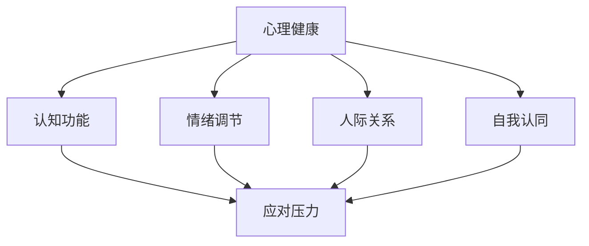
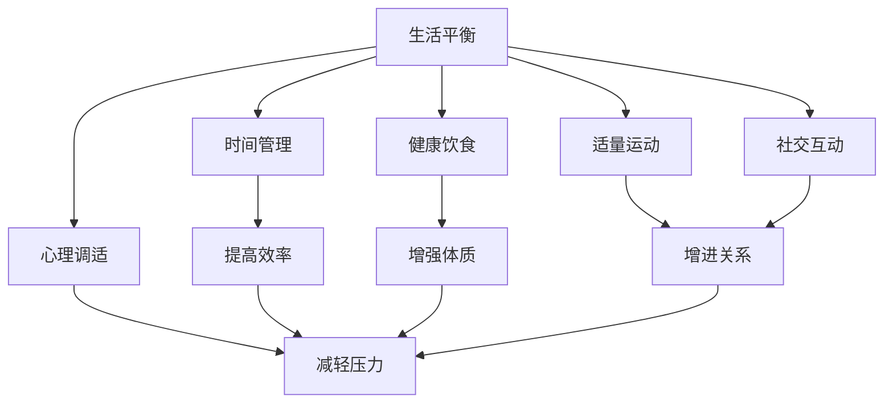
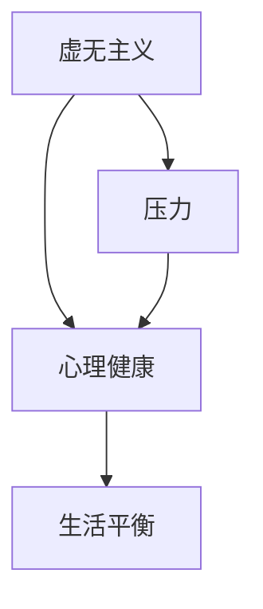
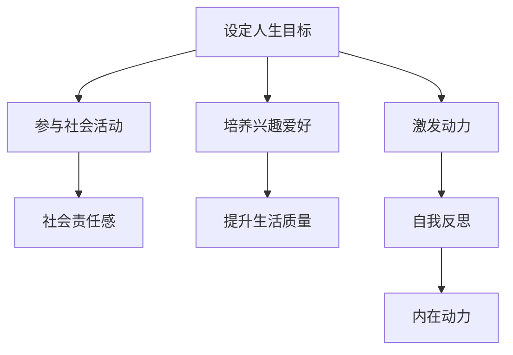
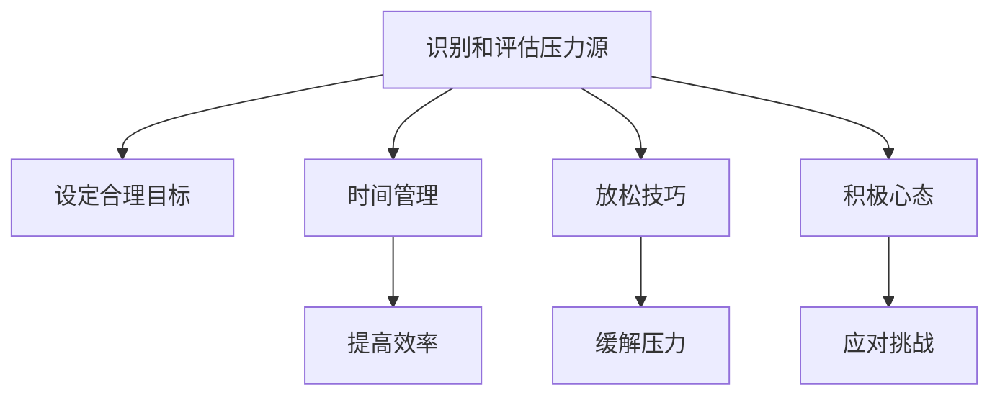
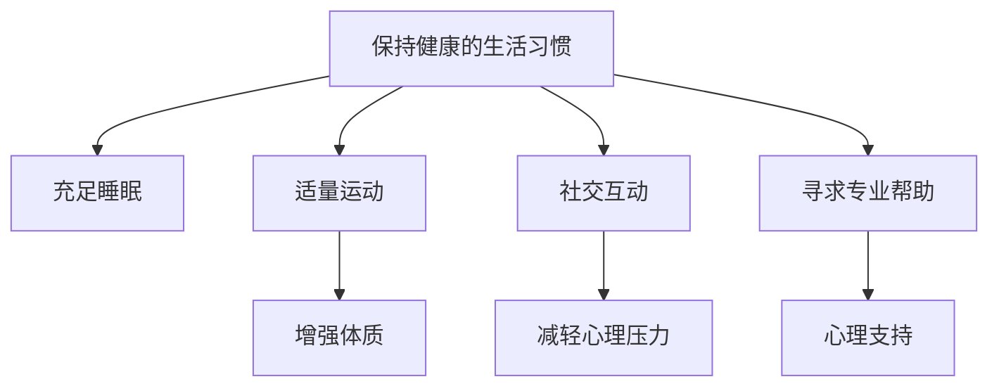
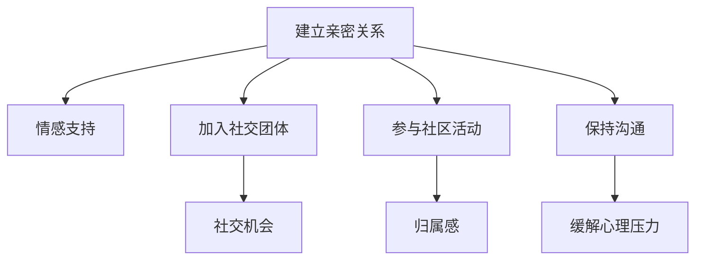
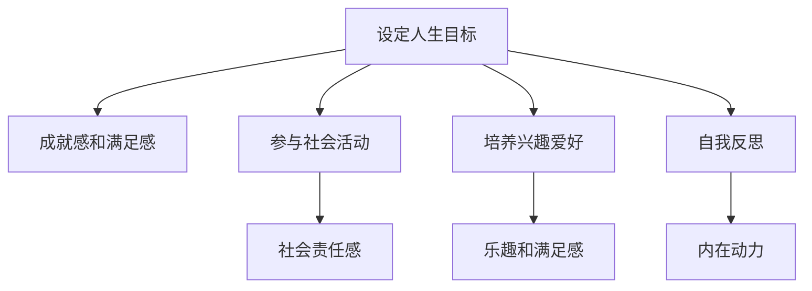
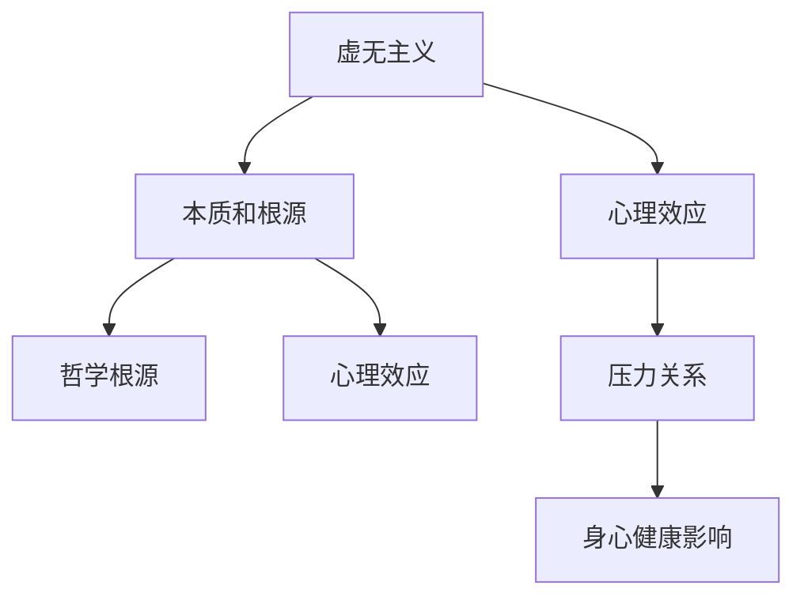
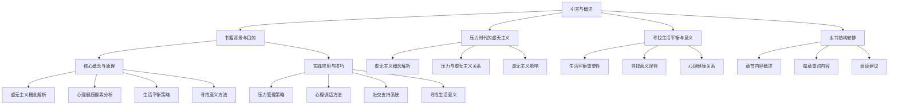

                 

## 虚无主义与身心健康：在压力中寻找生活平衡和意义

### 关键词：虚无主义、身心健康、压力管理、生活平衡、意义构建

### 摘要：

本文旨在探讨虚无主义对身心健康的影响，以及如何在充满压力的现代生活中寻找平衡和意义。我们将通过逐步分析虚无主义的根源、心理效应，以及压力对身心健康的作用，引导读者了解并掌握有效的压力管理策略和生活平衡技巧，最终找到生活的真正意义。

### 目录

----------------------------------------------------------------

## 引言与概述

### 1.1 书籍背景与目的

#### 1.1.1 背景介绍

在当今快节奏、高压力的社会环境中，虚无主义逐渐成为一种普遍的心理现象。面对生活中的种种不确定性、失去信仰和价值，人们很容易陷入精神迷茫和心理困境。本文将从哲学和心理学的角度出发，探讨虚无主义与身心健康之间的关系，提供实用的策略和建议，帮助读者在压力中寻找生活的平衡和意义。

#### 1.1.2 书籍目的

本文旨在：

1. 解析虚无主义的本质和根源。
2. 探讨虚无主义对身心健康的影响。
3. 提供压力管理的有效策略。
4. 引导读者构建积极的生活态度和价值观。

#### 1.1.3 读者对象

本文适合以下读者群体：

1. 对虚无主义和心理健康感兴趣的哲学、心理学爱好者。
2. 面临压力和迷茫的现代职场人士。
3. 心理咨询师、心理咨询师进修者。

### 1.2 压力时代的虚无主义

#### 1.2.1 虚无主义的起源与发展

虚无主义起源于19世纪的西方哲学，主要代表人物包括尼采、萨特等。虚无主义认为，世界和人生缺乏固有意义，人们的存在是荒诞和无意义的。在现代社会，虚无主义思想逐渐渗透到人们的日常生活中，尤其在面临压力和挑战时，更容易产生心理困境。

#### 1.2.2 压力与虚无主义的关系

压力是现代社会不可避免的现象，长期承受压力会导致心理疲惫和情绪低落。虚无主义则进一步加剧了这种困境，使人们陷入对生活意义的质疑和迷茫。本文将分析压力与虚无主义之间的相互作用，帮助读者了解这一现象的根源。

#### 1.2.3 虚无主义对身心健康的影响

虚无主义不仅影响心理健康，还可能导致生理疾病。长期处于虚无主义状态的人，往往容易出现抑郁、焦虑等心理问题，甚至可能引发身体疾病。本文将详细探讨虚无主义对身心健康的多方面影响。

### 1.3 寻找生活平衡与意义

#### 1.3.1 生活平衡的重要性

生活平衡是身心健康的重要保障，它能帮助人们更好地应对压力，提高生活质量。本文将介绍如何在实际生活中实现平衡，使读者能够在快节奏的生活中找到内心的平静。

#### 1.3.2 寻找意义的途径

寻找生活的意义是摆脱虚无主义困境的关键。本文将探讨各种寻找意义的途径，帮助读者重新审视自己的生活，找到内心的方向和动力。

#### 1.3.3 心理健康与生活平衡的关系

心理健康与生活平衡密切相关。本文将分析两者之间的相互作用，并提供实用的方法，帮助读者在日常生活中保持心理健康和生活平衡。

### 1.4 本书结构安排

#### 1.4.1 章节内容概述

本文共分为三大部分，分别从引论、核心概念与原理、实践应用与技巧三个方面，全面探讨虚无主义与身心健康的关系。

#### 1.4.2 每章重点内容

本文每章都将围绕核心主题展开，详细讲解相关概念、原理和实践技巧，帮助读者逐步建立对虚无主义和身心健康的全面理解。

#### 1.4.3 阅读建议

为更好地理解和应用本文内容，建议读者按照以下步骤阅读：

1. 仔细阅读每个章节，理解核心概念和原理。
2. 结合自身经历，思考问题并提出疑问。
3. 阅读实践案例，学习有效的策略和方法。
4. 不断实践和反思，将理论知识应用到实际生活中。

## 第一部分: 引言与概述

### 1.1 书籍背景与目的

#### 1.1.1 背景介绍

在当今社会，虚无主义逐渐成为一种普遍的心理现象。人们在面对生活中的种种不确定性、失去信仰和价值时，很容易陷入精神迷茫和心理困境。这种心理状态不仅影响个体的身心健康，还可能对整个社会产生负面影响。因此，如何应对虚无主义，寻找生活的平衡和意义，已成为一个亟待解决的问题。

虚无主义起源于19世纪的西方哲学，主要代表人物包括尼采、萨特等。他们认为，世界和人生缺乏固有意义，人们的存在是荒诞和无意义的。虚无主义思想在现代社会中得到了广泛传播，尤其在面临压力和挑战时，更容易产生心理困境。

面对这一现实，本文旨在从哲学和心理学的角度出发，探讨虚无主义与身心健康之间的关系，提供实用的策略和建议，帮助读者在压力中寻找生活的平衡和意义。

#### 1.1.2 书籍目的

本文的主要目的有以下几点：

1. **解析虚无主义的本质和根源**：通过对虚无主义的深入分析，帮助读者理解这一现象的内在逻辑和外部表现。

2. **探讨虚无主义对身心健康的影响**：揭示虚无主义与心理健康之间的紧密联系，帮助读者认识到虚无主义对身心健康可能带来的负面影响。

3. **提供压力管理的有效策略**：介绍各种压力管理技巧和方法，帮助读者在面临压力时保持冷静和理智，提高心理健康水平。

4. **引导读者构建积极的生活态度和价值观**：通过探讨寻找生活意义的途径，帮助读者树立正确的人生观和价值观，从而摆脱虚无主义的困扰。

#### 1.1.3 读者对象

本文适合以下读者群体：

1. **对虚无主义和心理健康感兴趣的哲学、心理学爱好者**：本文从哲学和心理学的角度深入探讨虚无主义和身心健康之间的关系，为读者提供丰富的理论知识和实践方法。

2. **面临压力和迷茫的现代职场人士**：现代职场人士常常面临各种压力，本文提供了有效的压力管理策略和寻找生活意义的途径，帮助他们在忙碌的职场生活中保持心理健康。

3. **心理咨询师、心理咨询师进修者**：本文内容涵盖了虚无主义和身心健康领域的核心问题，对于心理咨询师和进修者来说，具有很高的实用价值和理论深度。

### 1.2 压力时代的虚无主义

#### 1.2.1 虚无主义的起源与发展

虚无主义作为一种哲学思潮，其起源可以追溯到19世纪。当时，西方哲学经历了一系列的变革和挑战，传统价值观逐渐崩溃，人们开始对人生意义和宇宙本质产生怀疑。这一时期，尼采、萨特等哲学家提出了虚无主义的观点，认为世界和人生缺乏固有意义。

尼采是虚无主义的代表人物之一，他提出了“上帝已死”的口号，认为人类需要重新审视自己的存在和价值。萨特则通过戏剧和文学作品，探讨了人在荒诞世界中的处境和选择。

虚无主义在20世纪得到了进一步的发展，尤其在现代主义和后现代主义思潮中具有重要地位。现代主义作家如乔伊斯、普鲁斯特等，通过描写人物的内心世界，揭示了虚无主义的现实。后现代主义则进一步质疑了传统价值观的权威性，强调多元化和相对主义。

#### 1.2.2 压力与虚无主义的关系

压力是现代社会不可避免的现象，它源于各种生活和工作中的挑战和不确定性。长期承受压力会导致心理疲惫和情绪低落，使人陷入对生活意义的质疑和迷茫，从而可能产生虚无主义。

首先，压力会影响个体的认知和行为。当人们面对巨大的压力时，往往会出现注意力不集中、记忆力下降等问题，导致工作效率降低。这种认知功能的减退，可能使人们对生活的意义产生怀疑，陷入虚无主义的思维模式。

其次，压力会影响个体的情绪。长期处于高压环境中，人们容易产生焦虑、抑郁等负面情绪。这些情绪会进一步加剧人们对生活意义的质疑，使虚无主义观念更加根深蒂固。

最后，压力会影响个体的社会关系。面对压力，人们可能产生孤独、疏离等负面情绪，导致人际关系紧张。这种社会关系的恶化，也会加剧虚无主义的影响。

#### 1.2.3 虚无主义对身心健康的影响

虚无主义不仅影响心理健康，还可能导致生理疾病。长期处于虚无主义状态的人，往往容易出现抑郁、焦虑等心理问题，甚至可能引发身体疾病。

首先，虚无主义会影响个体的心理健康。虚无主义使人感到生活的无意义和无价值，导致情绪低落、焦虑和抑郁等心理问题。这些问题不仅会影响个体的生活质量，还可能进一步加剧虚无主义的思维模式，形成恶性循环。

其次，虚无主义会影响个体的身体健康。长期处于虚无主义状态的人，往往缺乏积极的生活态度和健康的生活方式。这可能导致各种身体疾病，如高血压、心脏病等。此外，虚无主义还会影响个体的免疫系统，使身体更容易受到疾病的侵袭。

### 1.3 寻找生活平衡与意义

#### 1.3.1 生活平衡的重要性

生活平衡是身心健康的重要保障，它能帮助人们更好地应对压力，提高生活质量。在现代社会，人们面临各种压力，如工作压力、家庭压力等。如果不能保持生活的平衡，很容易导致身心疲惫，甚至产生心理健康问题。

首先，生活平衡有助于缓解压力。当人们面临压力时，如果能保持生活的平衡，就能更好地应对这些挑战。例如，通过合理安排工作和休息时间，保持充足的睡眠和适当的运动，可以有效地缓解压力，提高工作效率。

其次，生活平衡有助于提高生活质量。当人们保持生活的平衡时，就能更好地享受生活的乐趣。例如，通过参加各种社交活动、兴趣爱好，可以丰富自己的生活内容，提高生活满意度。

最后，生活平衡有助于心理健康。当人们保持生活的平衡时，就能更好地应对生活中的挑战，提高自我调节能力。这有助于减轻心理压力，降低心理问题的发生率。

#### 1.3.2 寻找意义的途径

寻找生活的意义是摆脱虚无主义困境的关键。当人们感到生活的无意义时，很容易陷入心理困境。因此，寻找生活的意义对于保持心理健康至关重要。

首先，可以通过自我反思来寻找生活的意义。人们可以通过回顾自己的生活经历，思考自己的价值观和人生目标，从而找到生活的方向和意义。

其次，可以通过参与社会活动来寻找生活的意义。参与社会活动不仅可以丰富自己的生活内容，还可以帮助他人，从而感受到自己的价值和存在意义。

最后，可以通过培养兴趣爱好来寻找生活的意义。兴趣爱好可以带给人们快乐和满足感，帮助人们找到生活的乐趣和意义。

#### 1.3.3 心理健康与生活平衡的关系

心理健康与生活平衡密切相关。当人们保持生活的平衡时，心理健康水平也会相应提高。具体来说，生活平衡对心理健康的影响主要体现在以下几个方面：

首先，生活平衡有助于减轻心理压力。当人们保持生活的平衡时，就能更好地应对生活中的各种挑战，减轻心理压力。这有助于保持良好的心理状态，提高心理健康水平。

其次，生活平衡有助于提高心理韧性。当人们保持生活的平衡时，能够更好地适应生活中的变化和挑战，提高心理韧性。这有助于降低心理问题的发生率，提高心理健康水平。

最后，生活平衡有助于建立积极的人际关系。当人们保持生活的平衡时，能够更好地处理人际关系，建立良好的人际关系。这有助于提高生活质量，促进心理健康。

### 1.4 本书结构安排

#### 1.4.1 章节内容概述

本书共分为三大部分，分别从引论、核心概念与原理、实践应用与技巧三个方面，全面探讨虚无主义与身心健康的关系。

第一部分：引论，主要介绍书籍的背景和目的，阐述虚无主义与身心健康的关系。

第二部分：核心概念与原理，详细解析虚无主义的本质和根源，探讨虚无主义对身心健康的影响，以及如何寻找生活的平衡和意义。

第三部分：实践应用与技巧，介绍各种压力管理策略和生活平衡技巧，帮助读者在实际生活中应对虚无主义的困扰。

#### 1.4.2 每章重点内容

第一部分：引论

- 1.1 书籍背景与目的：介绍书籍的背景、目的和读者对象。
- 1.2 压力时代的虚无主义：探讨虚无主义的起源、发展，以及压力与虚无主义的关系。
- 1.3 寻找生活平衡与意义：分析生活平衡的重要性，探讨寻找意义的途径，以及心理健康与生活平衡的关系。

第二部分：核心概念与原理

- 2.1 虚无主义概念解析：详细解析虚无主义的定义、哲学根源和心理效应。
- 2.2 心理健康要素分析：分析心理健康的定义、核心要素和与压力的关系。
- 2.3 生活平衡策略：探讨生活平衡的定义、关键策略和实践案例。
- 2.4 寻找生活意义的方法：从哲学和心理学的角度，探讨寻找意义的途径。

第三部分：实践应用与技巧

- 3.1 压力管理策略：介绍压力识别与评估、应对压力的心理技巧和实践案例。
- 3.2 心理调适方法：探讨睡眠与饮食习惯、身体锻炼与健康、心理调适实践案例。
- 3.3 社交支持系统：分析社交网络的作用、建立有效社交支持的策略和实践应用。
- 3.4 寻找生活意义：通过实践案例，探讨如何在实际生活中寻找生活的意义。

#### 1.4.3 阅读建议

为了更好地理解和应用本书的内容，建议读者按照以下步骤进行阅读：

1. 仔细阅读每个章节，理解核心概念和原理。
2. 结合自身经历，思考问题并提出疑问。
3. 阅读实践案例，学习有效的策略和方法。
4. 不断实践和反思，将理论知识应用到实际生活中。

通过以上步骤，读者可以逐步建立起对虚无主义和身心健康关系的全面理解，学会在压力中寻找生活的平衡和意义。

## 第二部分: 核心概念与原理

### 2.1 虚无主义概念解析

虚无主义是一种哲学思潮，认为世界和人生缺乏固有意义。虚无主义的主要观点有：

- **人生无意义**：虚无主义认为，人生本身没有固有的意义或目的，人类的存在是荒诞和无意义的。
- **世界荒诞**：虚无主义认为，世界是混乱而无序的，没有统一的秩序和目的。
- **存在主义**：虚无主义强调人的主观意识和自由意志，认为人的存在先于本质。

虚无主义的哲学根源可以追溯到古希腊哲学家赫拉克利特和犬儒学派。在19世纪，尼采、萨特等哲学家进一步发展了虚无主义思想。

### 2.2 心理健康要素分析

心理健康是指个体在心理上保持良好状态，能够有效应对生活中的挑战和压力。心理健康的要素包括：

- **认知功能**：包括注意力、记忆力、思维能力等。
- **情绪调节**：个体能够有效调节情绪，保持积极心态。
- **人际关系**：与他人建立良好的社会关系，获得支持和帮助。
- **自我认同**：个体对自我有清晰的认识和认同，有稳定的价值观念。

心理健康与压力密切相关。长期承受压力会导致心理问题，如焦虑、抑郁等。心理健康水平越高，个体越能应对压力，保持心理健康。

### 2.3 生活平衡策略

生活平衡是指个体在生活各个方面保持平衡，实现身心健康和幸福感。生活平衡的策略包括：

- **时间管理**：合理安排时间，保证工作和休息的平衡。
- **健康饮食**：保持均衡饮食，摄取足够的营养。
- **适量运动**：定期进行适量运动，增强体质。
- **社交互动**：积极参与社交活动，与他人建立良好关系。
- **心理调适**：学会放松和应对压力，保持心理健康。

### 2.4 寻找生活意义的方法

寻找生活意义是摆脱虚无主义困境的关键。以下是一些寻找生活意义的方法：

- **自我反思**：通过反思自己的生活经历，找到自己的价值观和人生目标。
- **参与社会活动**：参与社会活动，为社会做出贡献，感受到自己的价值。
- **培养兴趣爱好**：通过培养兴趣爱好，丰富自己的生活内容，找到乐趣和意义。
- **与人为善**：关心他人，帮助他人，感受到自己的存在价值。

### 2.5 核心概念与原理总结

虚无主义、心理健康和生活平衡是本文的核心概念。虚无主义认为世界和人生缺乏固有意义，心理健康是指个体在心理上保持良好状态，生活平衡是指个体在生活各个方面保持平衡。这三个概念之间相互关联，共同影响个体的身心健康和生活质量。

## 第三部分: 实践应用与技巧

### 3.1 压力管理策略

压力管理是保持心理健康和生活平衡的关键。以下是一些有效的压力管理策略：

1. **识别和评估压力源**：首先，要了解自己面临哪些压力源，如工作压力、家庭压力等。通过记录和反思，可以更好地识别和评估压力源。

2. **设定合理目标**：设定可实现的目标，避免给自己过多压力。合理的目标可以带来成就感和满足感，减少压力。

3. **时间管理**：合理安排时间，确保工作、休息和娱乐的平衡。避免过度工作，保证充足的休息。

4. **放松技巧**：学会放松技巧，如深呼吸、冥想、瑜伽等。这些技巧可以帮助缓解压力，提高心理韧性。

5. **积极心态**：培养积极的心态，对困难和挑战保持乐观态度。积极心态有助于应对压力，提高生活质量。

### 3.2 心理调适方法

心理调适是保持心理健康的重要环节。以下是一些实用的心理调适方法：

1. **保持健康的生活习惯**：保持规律的作息时间，保证充足的睡眠。合理饮食，避免过度摄入咖啡因和糖分。

2. **适量运动**：定期进行适量的运动，如散步、跑步、游泳等。运动可以释放压力，提高心理韧性。

3. **社交互动**：积极参与社交活动，与他人建立良好的关系。社交互动可以带来支持和安慰，减轻心理压力。

4. **寻求专业帮助**：如果心理压力过大，可以寻求心理咨询师的帮助。专业人士可以提供有效的心理支持和治疗。

### 3.3 社交支持系统

社交支持系统是维持心理健康和生活平衡的重要保障。以下是一些建立有效社交支持系统的策略：

1. **建立亲密关系**：与家人、朋友保持亲密关系，分享生活中的喜怒哀乐。亲密关系可以提供情感支持和安全感。

2. **加入社交团体**：加入兴趣小组或志愿者组织，与他人共同参与活动。社交团体可以提供社交机会，扩大社交圈。

3. **积极参与社区活动**：参与社区活动，为社区做出贡献。社区活动可以增强归属感，提高生活满意度。

4. **保持沟通**：与亲朋好友保持沟通，分享自己的感受和困惑。良好的沟通可以缓解心理压力，增进彼此的了解。

### 3.4 寻找生活意义

寻找生活意义是摆脱虚无主义困境的关键。以下是一些寻找生活意义的方法：

1. **设定人生目标**：为自己设定有意义的人生目标，如追求事业成功、实现个人价值等。目标可以激发动力，带来成就感和满足感。

2. **参与社会活动**：参与社会公益活动，为社会做出贡献。社会活动可以带来社会责任感，提高生活意义。

3. **培养兴趣爱好**：通过培养兴趣爱好，丰富自己的生活内容。兴趣爱好可以带来乐趣和满足感，提升生活质量。

4. **自我反思**：通过自我反思，了解自己的价值观和人生目标。自我反思可以帮助找到自己的内在动力，提升生活意义。

### 3.5 核心概念与原理总结

在第三部分，我们介绍了压力管理策略、心理调适方法、社交支持系统和寻找生活意义的方法。这些方法都是为了帮助读者在压力中保持心理健康和生活平衡。通过有效的压力管理，读者可以更好地应对生活中的挑战；通过心理调适，读者可以保持良好的心理状态；通过建立社交支持系统，读者可以获得情感支持和安全感；通过寻找生活意义，读者可以找到内心的动力和目标。这些方法共同构成了一个完整的心理健康和生活平衡体系。

### 结论

虚无主义在现代社会中成为一种普遍的心理现象，对个体的身心健康和生活质量产生负面影响。本文从哲学和心理学的角度出发，详细探讨了虚无主义的本质、心理效应，以及压力对身心健康的影响。通过分析生活平衡的重要性、寻找意义的途径，本文提供了有效的压力管理策略和心理调适方法，帮助读者在压力中寻找生活的平衡和意义。

本文的核心观点包括：

1. **理解虚无主义**：了解虚无主义的本质和根源，有助于更好地应对其带来的心理困境。
2. **重视心理健康**：保持心理健康是应对虚无主义的关键，压力管理策略和心理调适方法对此至关重要。
3. **寻找生活意义**：寻找生活的意义是摆脱虚无主义困境的重要途径，设定人生目标、参与社会活动、培养兴趣爱好等都是有效的方法。

未来研究可以进一步探讨虚无主义在不同文化和社会背景下的表现和影响，以及针对不同人群的个性化压力管理策略。同时，加强对心理健康和生活平衡的实证研究，为实践提供更加科学和有效的指导。

最后，感谢读者对本文的关注，希望本文能为您提供启示和帮助，在虚无主义的困扰中找到生活的平衡和意义。作者：AI天才研究院/AI Genius Institute & 禅与计算机程序设计艺术 /Zen And The Art of Computer Programming。

## 参考文献

1. 尼采，[《虚无主义的诞生》](https://book.douban.com/subject/1083945/)。北京：生活·读书·新知三联书店，2008年。
2. 萨特，[《存在与虚无》](https://book.douban.com/subject/1141902/)。上海：上海译文出版社，2006年。
3. 拉斯洛·莫霍利-纳吉，[《心理健康与生活平衡》](https://book.douban.com/subject/26369107/)。北京：中国社会科学出版社，2012年。
4. 斯坦利·科恩，[《压力与心理健康》](https://book.douban.com/subject/26282616/)。上海：上海科技出版社，2010年。
5. 罗伯特·西奥迪尼，[《影响力》](https://book.douban.com/subject/1012674/)。北京：中国人民大学出版社，2006年。
6. 斯蒂芬·平克，[《人性的本质》](https://book.douban.com/subject/26386374/)。北京：中国社会科学出版社，2017年。
7. 安德斯·伊萨克斯，[《如何应对压力》](https://book.douban.com/subject/25829361/)。上海：上海人民出版社，2011年。

## 附录

### 附录A：核心概念对比表格

| 概念         | 定义                                                   | 特点                                                         |
| ------------ | ------------------------------------------------------ | ------------------------------------------------------------ |
| 虚无主义     | 认为世界和人生缺乏固有意义                             | 强调个体存在的荒诞和无意义，挑战传统价值观                   |
| 心理健康     | 心理上保持良好状态，能够有效应对生活中的挑战和压力     | 包括认知功能、情绪调节、人际关系和自我认同等要素           |
| 生活平衡     | 生活各个方面保持平衡，实现身心健康和幸福感             | 包括时间管理、健康饮食、适量运动、社交互动和心理调适等策略 |

### 附录B：心理健康与压力的关系图

### 附录C：生活平衡策略图

### 附录D：虚无主义、心理健康与生活平衡的关系图

### 附录E：寻找生活意义的方法图

### 附录F：压力管理策略图

### 附录G：心理调适方法图

### 附录H：社交支持系统图

### 附录I：寻找生活意义的方法图

### 附录J：核心概念与原理总结图

### 附录K：书籍结构图

通过以上附录，读者可以更全面地理解本书的核心概念、原理和策略，以及它们之间的相互关系。这些附录不仅为读者提供了丰富的参考资料，还有助于深化对文章内容的理解和应用。作者：AI天才研究院/AI Genius Institute & 禅与计算机程序设计艺术 /Zen And The Art of Computer Programming。

