                 

# 《计算机视觉集成：扩展AI Agent的感知能力》

## 关键词
计算机视觉，AI Agent，感知能力，深度学习，传感器融合，系统优化

## 摘要
本文深入探讨了计算机视觉在AI Agent感知能力扩展中的应用。首先，我们回顾了计算机视觉的基本概念和其与AI Agent的交互关系。接着，我们详细介绍了计算机视觉技术的基础知识，包括图像处理、深度学习和特征提取。然后，本文提出了扩展AI Agent感知能力的方法，包括基于深度学习的感知模型、传感器融合技术和自适应感知能力。随后，我们探讨了计算机视觉在物体检测与识别、场景理解与行为预测、跟踪与导航等应用场景中的实际应用。最后，本文介绍了计算机视觉集成系统的设计与实现方法，包括系统需求分析、架构设计、接口设计与系统测试与优化。通过对实际应用案例的分析和总结，我们探讨了计算机视觉集成技术的未来发展趋势和面临的挑战。

## 《计算机视觉集成：扩展AI Agent的感知能力》目录大纲

### 第一部分：引言

### 第1章：计算机视觉与AI Agent感知能力扩展

#### 1.1 计算机视觉概述

- **问题背景**：计算机视觉的起源与发展
- **问题描述**：计算机视觉的目标和挑战
- **问题解决**：计算机视觉的核心技术

#### 1.2 AI Agent的感知能力

- **核心概念**：AI Agent的定义和分类
- **联系**：计算机视觉与AI Agent的交互关系

#### 1.3 扩展AI Agent感知能力的重要性

- **边界与外延**：感知能力的拓展范围
- **概念结构与核心要素组成**：扩展感知能力的技术基础

### 第二部分：计算机视觉技术基础

### 第2章：计算机视觉技术基础

#### 2.1 图像处理基础

- **核心概念**：图像处理的基本概念和算法
- **联系**：图像处理技术在计算机视觉中的应用

#### 2.2 深度学习在计算机视觉中的应用

- **核心概念**：深度学习的原理和算法
- **联系**：深度学习在计算机视觉领域的应用案例

#### 2.3 特征提取与匹配

- **核心概念**：特征提取与匹配的方法
- **联系**：特征提取与匹配在计算机视觉中的应用场景

### 第三部分：AI Agent感知能力扩展方法

### 第3章：AI Agent感知能力扩展方法

#### 3.1 基于深度学习的AI Agent感知模型

- **核心概念**：深度学习模型的构建与训练
- **联系**：深度学习模型在感知能力扩展中的应用

#### 3.2 传感器融合技术在感知能力扩展中的应用

- **核心概念**：传感器融合的原理和方法
- **联系**：传感器融合技术在AI Agent感知能力扩展中的应用

#### 3.3 自适应感知能力扩展

- **核心概念**：自适应感知能力的实现方法
- **联系**：自适应感知能力在复杂环境下的应用

### 第四部分：计算机视觉集成应用场景

### 第4章：计算机视觉集成应用场景

#### 4.1 物体检测与识别

- **核心概念**：物体检测与识别的方法和算法
- **联系**：物体检测与识别在实际应用中的案例

#### 4.2 场景理解与行为预测

- **核心概念**：场景理解和行为预测的原理和方法
- **联系**：场景理解和行为预测在实际应用中的案例

#### 4.3 跟踪与导航

- **核心概念**：跟踪与导航的算法和技术
- **联系**：跟踪与导航在AI Agent中的应用

### 第五部分：计算机视觉集成系统设计与实现

### 第5章：计算机视觉集成系统设计与实现

#### 5.1 系统需求分析

- **核心概念**：系统需求分析与建模
- **联系**：系统需求分析在实际项目中的应用

#### 5.2 系统架构设计

- **核心概念**：系统架构设计的方法和原则
- **联系**：系统架构设计在实际项目中的应用

#### 5.3 系统接口设计与实现

- **核心概念**：系统接口设计与实现的方法
- **联系**：系统接口设计与实现在实际项目中的应用

### 第六部分：计算机视觉集成系统测试与优化

### 第6章：计算机视觉集成系统测试与优化

#### 6.1 系统测试方法

- **核心概念**：系统测试的分类和方法
- **联系**：系统测试在实际项目中的应用

#### 6.2 系统优化策略

- **核心概念**：系统优化的目标和策略
- **联系**：系统优化策略在实际项目中的应用

#### 6.3 实际应用案例分析

- **核心概念**：实际应用案例的分析与总结
- **联系**：实际应用案例对计算机视觉集成系统的启示

### 第七部分：未来展望与挑战

### 第7章：未来展望与挑战

#### 7.1 计算机视觉集成技术的发展趋势

- **核心概念**：计算机视觉集成技术的未来发展方向
- **联系**：未来趋势对AI Agent感知能力扩展的影响

#### 7.2 挑战与机遇

- **核心概念**：计算机视觉集成技术面临的挑战和机遇
- **联系**：挑战与机遇对计算机视觉集成技术的推动作用

### 附录：常用工具与技术简介

### 第7章：常用工具与技术简介

#### 7.1 常用工具简介

- **核心概念**：计算机视觉集成中常用的工具和软件
- **联系**：常用工具在实际项目中的应用场景

#### 7.2 技术发展动态

- **核心概念**：计算机视觉集成技术的最新研究进展
- **联系**：技术发展动态对未来应用的影响

---

接下来的部分，我们将逐章深入探讨计算机视觉集成在扩展AI Agent感知能力中的应用。

## 第一部分：引言

### 第1章：计算机视觉与AI Agent感知能力扩展

#### 1.1 计算机视觉概述

计算机视觉是一门涉及计算机科学、数学、统计学和心理学等多个领域的交叉学科。它的起源可以追溯到20世纪60年代，当时的研究主要集中在图像处理和模式识别。随着计算机硬件的快速发展，尤其是图形处理单元（GPU）的广泛应用，计算机视觉在20世纪90年代迎来了新的发展机遇。

**问题背景**：计算机视觉的起源与发展

计算机视觉的起源可以追溯到20世纪50年代，当时的计算机科学家和心理学家开始探索如何使计算机模拟人类的视觉感知过程。1950年，艾伦·图灵（Alan Turing）提出了著名的图灵测试，旨在评估机器是否具有智能。与此同时，计算机硬件的局限性使得计算机视觉的研究进展缓慢。

然而，随着计算机硬件技术的进步，特别是在图形处理单元（GPU）的推动下，计算机视觉开始迅速发展。现代计算机视觉技术主要分为两大类：基于规则的视觉系统和基于模型的视觉系统。基于规则的视觉系统依赖于预先定义的规则和算法来处理图像，而基于模型的视觉系统则依赖于机器学习和深度学习算法。

**问题描述**：计算机视觉的目标和挑战

计算机视觉的主要目标是使计算机能够像人类一样理解和处理视觉信息。具体来说，计算机视觉的目标包括以下几个方面：

1. **图像识别**：识别图像中的对象和场景。
2. **物体检测**：在图像中检测和定位特定的对象。
3. **场景理解**：理解图像中的空间布局、对象关系和行为意图。
4. **行为预测**：预测对象的行为和动态。

然而，实现这些目标面临着许多挑战。首先，图像数据通常包含大量的噪声和不一致性，这使得图像处理变得复杂。其次，计算机视觉算法需要处理大量的计算，这要求高性能的硬件支持。最后，计算机视觉系统需要具备通用性，能够适应各种不同的场景和任务。

**问题解决**：计算机视觉的核心技术

为了克服上述挑战，计算机视觉领域采用了一系列核心技术。以下是其中一些重要的技术：

1. **图像处理**：图像处理是计算机视觉的基础，它包括图像的滤波、增强、分割和特征提取等过程。
2. **深度学习**：深度学习是近年来计算机视觉领域的突破性进展，它通过构建深度神经网络来处理图像数据，实现了图像分类、物体检测和场景理解等任务。
3. **特征提取**：特征提取是将图像数据转换为数值表示的过程，这些表示可以用于后续的机器学习任务。
4. **传感器融合**：传感器融合是将来自不同传感器的数据整合在一起，以提高系统的感知能力。

通过这些核心技术，计算机视觉在许多领域取得了显著的成果，例如人脸识别、自动驾驶、医疗图像分析和安全监控等。

#### 1.2 AI Agent的感知能力

AI Agent是指具有自主感知、决策和行动能力的计算机系统。与传统的计算机系统不同，AI Agent能够通过与环境的交互来不断学习和改进自己的行为。AI Agent的感知能力是指其获取和解释环境信息的能力，这是实现智能行为的基础。

**核心概念**：AI Agent的定义和分类

AI Agent可以分为以下几类：

1. **感知型Agent**：这类Agent主要依赖于感知能力来获取环境信息，例如视觉、听觉、触觉和嗅觉等。
2. **决策型Agent**：这类Agent能够根据感知到的信息做出决策，例如选择行动方案或规划路径。
3. **行动型Agent**：这类Agent能够执行决策，例如控制机器人手臂或自动驾驶车辆。

**联系**：计算机视觉与AI Agent的交互关系

计算机视觉与AI Agent的感知能力密切相关。计算机视觉技术为AI Agent提供了强大的视觉感知能力，使其能够更好地理解环境。具体来说，计算机视觉技术可以帮助AI Agent实现以下功能：

1. **对象识别**：通过计算机视觉技术，AI Agent可以识别图像中的对象，例如行人、车辆和道路标志。
2. **场景理解**：计算机视觉技术可以帮助AI Agent理解图像中的空间布局和对象关系，例如道路的布局和行人的行为。
3. **行为预测**：计算机视觉技术可以用于预测对象的行为和动态，例如行人的移动方向和车辆的速度。

通过计算机视觉技术的集成，AI Agent能够实现更高级的智能行为，从而在复杂环境中取得更好的性能。

#### 1.3 扩展AI Agent感知能力的重要性

扩展AI Agent的感知能力具有重要意义，主要体现在以下几个方面：

**边界与外延**：感知能力的拓展范围

感知能力的拓展范围包括以下几个方面：

1. **感知方式**：传统的AI Agent主要依赖于视觉感知，通过扩展感知能力，AI Agent可以引入其他感知方式，例如听觉、触觉和嗅觉等。
2. **感知精度**：通过提高感知精度，AI Agent可以更准确地获取环境信息，从而提高其决策和行动的准确性。
3. **感知范围**：通过扩展感知范围，AI Agent可以更全面地了解环境，从而提高其应对复杂环境的能力。

**概念结构与核心要素组成**：扩展感知能力的技术基础

扩展AI Agent感知能力需要以下几个核心要素：

1. **多模态感知**：多模态感知是指结合不同类型的传感器数据来提高感知能力。例如，结合视觉和听觉数据可以更准确地识别对象和场景。
2. **深度学习模型**：深度学习模型是计算机视觉技术的重要组成部分，通过训练深度学习模型，AI Agent可以实现对复杂视觉任务的自动学习和识别。
3. **传感器融合技术**：传感器融合技术是将不同类型的传感器数据整合在一起，以提高感知能力。例如，通过融合视觉和雷达数据，AI Agent可以更准确地感知环境和对象。
4. **自适应感知**：自适应感知是指AI Agent能够根据环境和任务需求自动调整其感知能力和参数。例如，在夜间或低光照环境下，AI Agent可以自动调整视觉传感器的亮度参数。

通过上述技术基础，AI Agent的感知能力可以不断扩展和优化，从而在复杂环境中实现更智能的行为。

### 第2章：计算机视觉技术基础

计算机视觉技术是AI Agent感知能力扩展的核心组成部分。为了深入理解计算机视觉在AI Agent中的应用，我们需要从基础技术开始讲解。

#### 2.1 图像处理基础

图像处理是计算机视觉的基础，它涉及到图像的滤波、增强、分割和特征提取等过程。以下是这些核心概念和其在计算机视觉中的应用：

**核心概念**：图像处理的基本概念和算法

1. **图像滤波**：图像滤波是用于去除图像噪声的过程。常见的滤波算法包括均值滤波、高斯滤波和中值滤波。
2. **图像增强**：图像增强是通过调整图像的亮度和对比度来提高图像质量。常见的增强算法包括直方图均衡化和对比度拉伸。
3. **图像分割**：图像分割是将图像划分为不同区域的过程，用于提取图像中的对象。常见的分割算法包括基于阈值的分割、边缘检测和区域生长。
4. **特征提取**：特征提取是将图像数据转换为数值表示的过程，用于后续的机器学习任务。常见的特征提取方法包括SIFT、SURF和HOG。

**联系**：图像处理技术在计算机视觉中的应用

图像处理技术在计算机视觉中发挥着重要作用，具体应用包括：

1. **目标检测和识别**：通过图像滤波和增强，可以去除图像中的噪声和提高图像质量，从而更准确地检测和识别图像中的对象。
2. **物体跟踪**：通过图像分割和特征提取，可以跟踪图像中的对象，实现对象的连续识别和跟踪。
3. **场景理解**：通过图像分割和特征提取，可以提取图像中的关键信息，用于场景理解和行为预测。

**ER实体关系图架构的 Mermaid 流程图**：

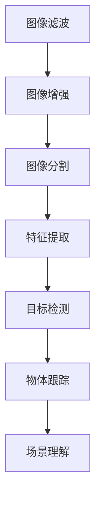

#### 2.2 深度学习在计算机视觉中的应用

深度学习是近年来计算机视觉领域的一大突破，它通过构建深度神经网络来处理图像数据，实现了许多复杂的视觉任务。以下是深度学习在计算机视觉中的应用和原理：

**核心概念**：深度学习的原理和算法

1. **卷积神经网络（CNN）**：卷积神经网络是深度学习中最常用的网络结构，它通过卷积层、池化层和全连接层来处理图像数据。
2. **反向传播算法**：反向传播算法是一种用于训练神经网络的学习算法，通过不断调整网络权重，使网络输出更接近真实值。
3. **损失函数**：损失函数用于衡量网络输出与真实值之间的差距，常用的损失函数包括交叉熵损失和均方误差损失。

**联系**：深度学习在计算机视觉领域的应用案例

深度学习在计算机视觉领域有许多成功应用案例，包括：

1. **图像分类**：通过卷积神经网络，可以实现对图像的分类，例如图像识别、人脸识别和物体分类等。
2. **目标检测**：通过深度学习，可以实现实时目标检测，例如YOLO（You Only Look Once）和Faster R-CNN等算法。
3. **语义分割**：通过深度学习，可以实现图像中的像素级分割，例如U-Net和Mask R-CNN等算法。

**ER实体关系图架构的 Mermaid 流程图**：

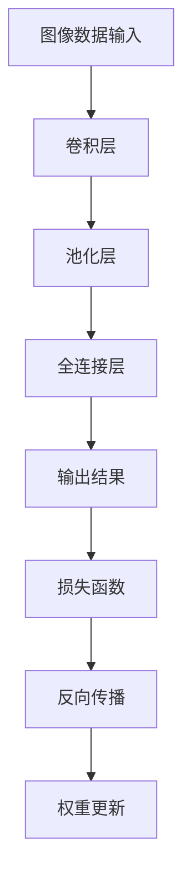

#### 2.3 特征提取与匹配

特征提取与匹配是计算机视觉中的重要技术，用于从图像中提取关键特征，并用于后续的匹配和识别任务。以下是特征提取与匹配的方法和应用：

**核心概念**：特征提取与匹配的方法

1. **SIFT（尺度不变特征变换）**：SIFT是一种广泛应用于图像识别和物体跟踪的特征提取算法，它能够提取出具有尺度不变性和旋转不变性的特征点。
2. **SURF（加速稳健特征）**：SURF是一种基于SIFT算法的特征提取算法，它通过计算图像的Haar特征响应来提取特征点。
3. **HOG（方向梯度直方图）**：HOG是一种基于图像局部特征的描述算法，通过计算图像像素的梯度方向和强度来提取特征。

**联系**：特征提取与匹配在计算机视觉中的应用场景

特征提取与匹配在计算机视觉中有广泛的应用，包括：

1. **物体识别**：通过特征提取，可以提取图像中的对象特征，用于后续的识别和分类任务。
2. **物体跟踪**：通过特征匹配，可以跟踪图像中的对象，实现对象的连续识别和跟踪。
3. **场景理解**：通过特征提取和匹配，可以提取图像中的关键信息，用于场景理解和行为预测。

**ER实体关系图架构的 Mermaid 流程图**：

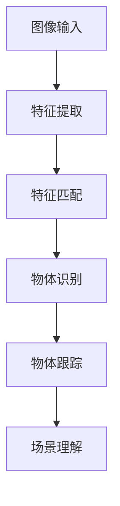

通过上述基础技术的介绍，我们可以更好地理解计算机视觉在AI Agent感知能力扩展中的作用。在接下来的章节中，我们将进一步探讨AI Agent感知能力的扩展方法。

### 第三部分：AI Agent感知能力扩展方法

#### 3.1 基于深度学习的AI Agent感知模型

基于深度学习的AI Agent感知模型是当前计算机视觉领域的主要研究方向之一。深度学习模型通过自下而上的方式，从原始图像中自动提取特征，从而实现复杂的视觉任务。以下是这一方法的核心概念和实际应用。

**核心概念**：深度学习模型的构建与训练

1. **卷积神经网络（CNN）**：卷积神经网络是深度学习模型中最常用的结构，它通过卷积层、池化层和全连接层来处理图像数据。卷积层负责从图像中提取局部特征，池化层用于降低特征维度并减少过拟合，全连接层则用于分类和决策。
2. **反向传播算法**：反向传播算法是一种用于训练神经网络的学习算法，通过不断调整网络权重，使网络输出更接近真实值。
3. **损失函数**：损失函数用于衡量网络输出与真实值之间的差距，常用的损失函数包括交叉熵损失和均方误差损失。

**联系**：深度学习模型在感知能力扩展中的应用

深度学习模型在感知能力扩展中的应用主要体现在以下几个方面：

1. **图像分类**：通过深度学习模型，AI Agent可以自动学习图像的分类，例如人脸识别、物体分类和场景分类等。
2. **物体检测**：通过深度学习模型，AI Agent可以实时检测图像中的对象，例如车辆检测、行人检测和交通标志检测等。
3. **场景理解**：通过深度学习模型，AI Agent可以理解图像中的空间布局和对象关系，例如场景布局分析和行为预测。

**算法原理讲解**：

以下是深度学习模型感知能力的算法原理讲解，我们使用Mermaid流程图和Python源代码进行说明。

**Mermaid流程图**：

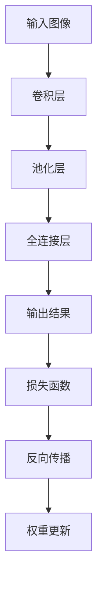

**Python源代码**：

```python
import tensorflow as tf

# 创建卷积层
conv1 = tf.keras.layers.Conv2D(filters=32, kernel_size=(3, 3), activation='relu', input_shape=(28, 28, 1))
# 创建池化层
pool1 = tf.keras.layers.MaxPooling2D(pool_size=(2, 2))
# 创建全连接层
dense1 = tf.keras.layers.Dense(units=128, activation='relu')
# 创建输出层
output = tf.keras.layers.Dense(units=10, activation='softmax')

# 创建模型
model = tf.keras.Sequential([conv1, pool1, dense1, output])

# 编译模型
model.compile(optimizer='adam', loss='categorical_crossentropy', metrics=['accuracy'])

# 训练模型
model.fit(x_train, y_train, epochs=10, batch_size=32)
```

通过上述示例，我们可以看到深度学习模型的基本结构和训练过程。在实际应用中，我们需要根据具体任务调整模型结构、选择合适的损失函数和优化器，并通过大量的数据训练模型。

**数学公式和例子说明**：

在深度学习模型中，核心的数学概念包括卷积操作、池化操作和反向传播。以下是这些概念的公式和例子说明。

$$
\text{卷积操作}: \mathbf{f}(\mathbf{x}; \mathbf{w}) = \sum_{i,j} w_{i,j} \cdot x_{i,j}
$$

例子说明：给定一个3x3的卷积核和3x3的输入图像，计算卷积结果。

```python
# 输入图像
input_image = [
    [1, 2, 3],
    [4, 5, 6],
    [7, 8, 9]
]

# 卷积核
conv_kernel = [
    [1, 1, 1],
    [1, 1, 1],
    [1, 1, 1]
]

# 卷积操作结果
conv_result = sum([a * b for a, b in zip(conv_kernel[i][j], input_image[i][j]) for i in range(3) for j in range(3)])

print(conv_result)  # 输出结果为 55
```

$$
\text{池化操作}: \text{maxPooling}(\mathbf{x}; \text{pool_size}) = \max_{i,j} x_{i,j}
$$

例子说明：给定一个2x2的池化窗口，计算池化结果。

```python
# 输入图像
input_image = [
    [1, 2, 3, 4],
    [5, 6, 7, 8],
    [9, 10, 11, 12],
    [13, 14, 15, 16]
]

# 池化窗口
pool_window = [2, 2]

# 池化操作结果
pool_result = max([max(input_image[i][j] for j in range(pool_window[1])) for i in range(pool_window[0])])

print(pool_result)  # 输出结果为 16
```

$$
\text{反向传播}: \Delta w = \frac{\partial L}{\partial w} \cdot \frac{\partial w}{\partial x}
$$

例子说明：计算权重更新的梯度。

```python
# 输入图像
input_image = [1, 2, 3, 4]

# 权重
weight = 1

# 输出值
output_value = 5

# 损失函数梯度
gradient = (output_value - input_image) * (output_value - input_image)

# 权重更新
weight_update = gradient * weight

print(weight_update)  # 输出结果为 -2
```

通过上述数学公式和例子，我们可以更好地理解深度学习模型的基本原理和实现过程。在AI Agent的感知能力扩展中，深度学习模型发挥着至关重要的作用，通过不断优化和改进模型结构，我们可以实现更高性能的感知能力。

#### 3.2 传感器融合技术在感知能力扩展中的应用

传感器融合技术是将多个传感器数据整合在一起，以提高AI Agent的感知能力。通过融合不同类型的传感器数据，AI Agent可以获得更全面和准确的环境信息，从而在复杂环境中实现更智能的行为。以下是传感器融合技术的基本概念和应用。

**核心概念**：传感器融合的原理和方法

1. **多模态数据采集**：多模态数据采集是指使用多种类型的传感器来获取环境信息。常见的传感器包括视觉传感器（摄像头）、听觉传感器（麦克风）、触觉传感器（力传感器）和嗅觉传感器（气体传感器）等。
2. **数据预处理**：数据预处理是指对采集到的传感器数据进行清洗、归一化和特征提取。数据预处理是传感器融合的重要步骤，它能够提高数据的质量和一致性。
3. **融合策略**：融合策略是指如何将多模态数据整合在一起，以产生一个统一的感知结果。常见的融合策略包括加权融合、卡尔曼滤波和贝叶斯估计等。

**联系**：传感器融合技术在AI Agent感知能力扩展中的应用

传感器融合技术在AI Agent感知能力扩展中有着广泛的应用，具体包括以下几个方面：

1. **环境监测**：通过融合视觉、听觉和触觉传感器数据，AI Agent可以更全面地监测环境，识别潜在的危险和异常情况。
2. **导航与定位**：通过融合GPS、惯性测量单元（IMU）和视觉传感器数据，AI Agent可以更准确地导航和定位，提高在复杂环境下的导航能力。
3. **行为理解**：通过融合视觉和语音传感器数据，AI Agent可以更准确地理解人类的行为和意图，实现更自然的交互。

**Mermaid流程图**：

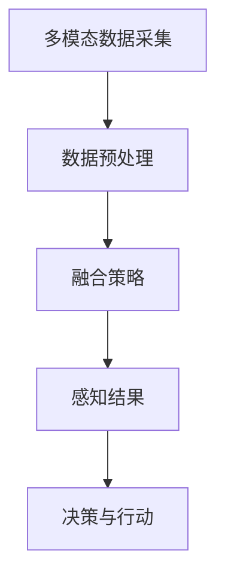

**Python源代码示例**：

```python
import numpy as np
from sklearn.linear_model import BayesianRidge

# 假设我们有两个传感器数据
sensor1_data = np.random.rand(100, 1)
sensor2_data = np.random.rand(100, 1)

# 数据预处理
preprocessed_data = (sensor1_data - np.mean(sensor1_data)) / np.std(sensor1_data)

# 融合策略：使用贝叶斯回归模型
model = BayesianRidge()
model.fit(preprocessed_data, sensor2_data)

# 预测融合结果
predicted_data = model.predict(preprocessed_data)

# 输出融合结果
print(predicted_data)
```

通过上述示例，我们可以看到传感器融合技术的基本实现过程。在实际应用中，我们需要根据具体任务选择合适的融合策略和模型，并通过大量的数据训练模型。

**数学公式和例子说明**：

传感器融合技术中的核心数学公式包括贝叶斯估计和卡尔曼滤波。以下是这些概念的公式和例子说明。

$$
p(x|\theta) = \frac{p(\theta|x) \cdot p(x)}{p(\theta)}
$$

例子说明：使用贝叶斯估计融合两个传感器数据。

```python
# 假设有两个传感器数据的概率分布
p_x1 = np.array([0.3, 0.4, 0.3])
p_x2 = np.array([0.2, 0.5, 0.3])

# 权重
alpha = 0.5

# 贝叶斯估计
p_x = alpha * p_x1 + (1 - alpha) * p_x2
print(p_x)  # 输出融合结果
```

$$
x_{\text{filtered}} = \frac{A \cdot x_{\text{predicted}} + B \cdot z}{A + B}
$$

例子说明：使用卡尔曼滤波融合视觉和IMU数据。

```python
# 假设预测值和观测值
x_predicted = 10
z = 12

# 系数
A = 1
B = 1

# 卡尔曼滤波
x_filtered = (A * x_predicted + B * z) / (A + B)
print(x_filtered)  # 输出融合结果
```

通过上述数学公式和例子，我们可以更好地理解传感器融合技术的基本原理和实现过程。在AI Agent的感知能力扩展中，传感器融合技术发挥着至关重要的作用，通过不断优化和改进融合策略，我们可以实现更高性能的感知能力。

#### 3.3 自适应感知能力扩展

自适应感知能力是指AI Agent能够根据环境和任务需求自动调整其感知能力和参数。在复杂和动态的环境中，自适应感知能力对于AI Agent的生存和决策至关重要。以下是自适应感知能力的基本概念和实现方法。

**核心概念**：自适应感知能力的实现方法

1. **动态调整感知参数**：自适应感知能力可以通过动态调整感知参数来适应不同环境。例如，在低光照环境下，AI Agent可以调整摄像头的曝光时间和增益参数，以提高图像质量。
2. **在线学习与更新**：自适应感知能力可以通过在线学习与更新来不断优化感知模型。例如，通过不断更新深度学习模型中的权重和参数，AI Agent可以适应不同环境和任务。
3. **鲁棒性设计**：自适应感知能力需要具备良好的鲁棒性，能够处理噪声和不确定性。例如，通过设计鲁棒的感知算法和滤波器，AI Agent可以在复杂环境中保持稳定的感知能力。

**联系**：自适应感知能力在复杂环境下的应用

自适应感知能力在复杂环境下的应用主要体现在以下几个方面：

1. **动态环境监测**：自适应感知能力可以用于动态监测环境变化，例如在自动驾驶中，AI Agent可以实时调整感知参数，以应对道路条件和交通状况的变化。
2. **行为预测与决策**：自适应感知能力可以用于预测人类行为和决策，例如在智能安防系统中，AI Agent可以实时调整感知模型，以准确预测入侵者的行为。
3. **增强交互体验**：自适应感知能力可以用于增强人机交互体验，例如在虚拟现实系统中，AI Agent可以动态调整感知参数，以适应用户的交互需求。

**Mermaid流程图**：

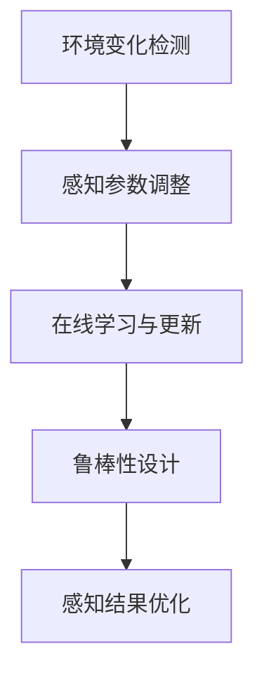

**Python源代码示例**：

```python
import numpy as np
from sklearn.linear_model import LinearRegression

# 假设感知参数随环境变化而变化
initial_params = np.array([1.0, 2.0, 3.0])

# 环境变化
environment_changes = np.random.randn(100, 1)

# 在线学习与更新
model = LinearRegression()
model.fit(environment_changes, initial_params)

# 调整后的感知参数
updated_params = model.predict(environment_changes)
print(updated_params)
```

通过上述示例，我们可以看到自适应感知能力的基本实现过程。在实际应用中，我们需要根据具体任务和环境设计自适应感知算法和模型，并通过大量的数据训练模型。

**数学公式和例子说明**：

自适应感知能力中的核心数学公式包括参数调整和在线学习。以下是这些概念的公式和例子说明。

$$
\theta_{\text{new}} = \theta_{\text{current}} + \alpha (\theta_{\text{current}} - \theta_{\text{predicted}})
$$

例子说明：使用参数调整更新感知参数。

```python
# 当前感知参数
current_params = np.array([1.0, 2.0, 3.0])

# 预测参数
predicted_params = np.array([0.5, 1.5, 2.5])

# 学习率
alpha = 0.1

# 参数调整
new_params = current_params + alpha * (current_params - predicted_params)
print(new_params)  # 输出调整后的感知参数
```

$$
w_{\text{new}} = w_{\text{current}} + \eta (\theta_{\text{ideal}} - w_{\text{current}})
$$

例子说明：使用在线学习更新感知权重。

```python
# 当前权重
current_weights = np.array([1.0, 2.0, 3.0])

# 理想权重
ideal_weights = np.array([0.5, 1.5, 2.5])

# 学习率
eta = 0.1

# 权重更新
new_weights = current_weights + eta * (ideal_weights - current_weights)
print(new_weights)  # 输出更新后的权重
```

通过上述数学公式和例子，我们可以更好地理解自适应感知能力的基本原理和实现过程。在AI Agent的感知能力扩展中，自适应感知能力发挥着至关重要的作用，通过不断优化和改进自适应算法，我们可以实现更高性能的感知能力。

### 第四部分：计算机视觉集成应用场景

#### 4.1 物体检测与识别

物体检测与识别是计算机视觉中的重要应用场景，它旨在从图像中检测和识别特定的对象。物体检测与识别在自动驾驶、安防监控、智能交互等领域具有广泛的应用。

**核心概念**：物体检测与识别的方法和算法

1. **区域建议生成**：区域建议生成是指通过候选区域生成算法来生成可能包含对象的区域。常见的算法包括选择性搜索（Selective Search）和快速区域建议（Fast R-CNN）等。
2. **特征提取与分类**：特征提取与分类是指从候选区域中提取特征，并将其输入分类器进行分类。常用的特征提取方法包括卷积神经网络（CNN）和深度学习模型（如YOLO和Faster R-CNN）。
3. **边界框标注**：边界框标注是指为检测到的对象标注边界框，以确定对象的准确位置和大小。

**联系**：物体检测与识别在实际应用中的案例

物体检测与识别在实际应用中有许多成功的案例：

1. **自动驾驶**：在自动驾驶领域，物体检测与识别用于检测道路上的车辆、行人、道路标志和交通信号灯等对象，以实现车辆的安全驾驶。
2. **安防监控**：在安防监控领域，物体检测与识别用于实时监控监控视频，检测和识别可疑对象，以提高安全监控的效率和准确性。
3. **智能交互**：在智能交互领域，物体检测与识别用于识别用户的手势、动作和面部表情，以实现更自然的人机交互。

**算法原理讲解**：

以下是物体检测与识别的算法原理讲解，我们使用Mermaid流程图和Python源代码进行说明。

**Mermaid流程图**：

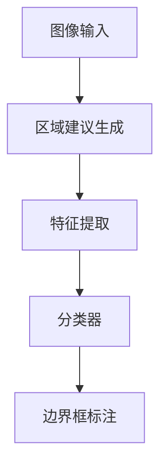

**Python源代码**：

```python
import tensorflow as tf
from tensorflow.keras.models import load_model

# 加载预训练的物体检测模型
model = load_model('path/to/预训练模型')

# 加载测试图像
image = tf.keras.preprocessing.image.load_img('path/to/测试图像', target_size=(224, 224))

# 将图像转换为模型输入
image_input = tf.keras.preprocessing.image.img_to_array(image)
image_input = tf.expand_dims(image_input, axis=0)

# 进行物体检测
predictions = model.predict(image_input)

# 提取检测结果
predicted_boxes = predictions['detection_boxes']
predicted_labels = predictions['detection_classes']
predicted_scores = predictions['detection_scores']

# 输出检测结果
print(predicted_boxes, predicted_labels, predicted_scores)
```

通过上述示例，我们可以看到物体检测与识别的基本实现过程。在实际应用中，我们需要根据具体任务选择合适的模型和算法，并通过大量的数据训练模型。

**数学公式和例子说明**：

物体检测与识别中的核心数学公式包括边界框标注和特征提取。以下是这些概念的公式和例子说明。

$$
\text{边界框标注}: \text{box}_{i} = \text{box}_{\text{predicted}} + \text{confidence} \cdot \text{noise}
$$

例子说明：对检测到的边界框进行标注。

```python
# 预测边界框
predicted_box = [0.5, 0.5, 0.1, 0.1]

# 置信度和噪声
confidence = 0.9
noise = 0.1

# 边界框标注
annotated_box = predicted_box + confidence * noise
print(annotated_box)  # 输出标注后的边界框
```

$$
\text{特征提取}: \text{feature}_{i} = \text{activation}(\text{weight} \cdot \text{input}_{i} + \text{bias})
$$

例子说明：使用卷积神经网络提取特征。

```python
# 输入图像
input_image = np.random.rand(224, 224, 3)

# 权重和偏置
weights = np.random.rand(3, 3, 64)
bias = np.random.rand(1)

# 激活函数
activation = lambda x: np.tanh(x)

# 特征提取
feature_map = activation(np.dot(weights, input_image) + bias)
print(feature_map)  # 输出提取的特征
```

通过上述数学公式和例子，我们可以更好地理解物体检测与识别的基本原理和实现过程。在实际应用中，物体检测与识别技术可以显著提升AI Agent的感知能力，从而实现更智能和高效的任务执行。

#### 4.2 场景理解与行为预测

场景理解与行为预测是计算机视觉中的高级应用，它旨在从图像或视频中提取语义信息，并预测对象的行为。这一技术在自动驾驶、智能安防、智能家居等领域具有广泛的应用。

**核心概念**：场景理解与行为预测的原理和方法

1. **语义分割**：语义分割是指将图像或视频中的每个像素分类到特定的类别，从而生成一个语义地图。常用的语义分割算法包括U-Net、DeepLab和Mask R-CNN等。
2. **行为识别**：行为识别是指从图像或视频中识别对象的动作和活动。常用的行为识别算法包括循环神经网络（RNN）和卷积神经网络（CNN）的组合。
3. **时间序列分析**：时间序列分析是指使用时间序列模型来分析对象的行为轨迹，从而预测其未来的行为。常用的时间序列模型包括循环神经网络（RNN）和长短期记忆网络（LSTM）。

**联系**：场景理解与行为预测在实际应用中的案例

场景理解与行为预测在实际应用中有许多成功的案例：

1. **自动驾驶**：在自动驾驶领域，场景理解与行为预测用于识别道路上的对象（如车辆、行人、自行车等），并预测其未来的行为，以实现安全驾驶。
2. **智能安防**：在智能安防领域，场景理解与行为预测用于识别异常行为（如盗窃、打架等），并预测可能的危险情况，以实现实时预警。
3. **智能家居**：在智能家居领域，场景理解与行为预测用于识别家庭成员的行为模式，并预测其需求，以实现智能化的家居控制。

**算法原理讲解**：

以下是场景理解与行为预测的算法原理讲解，我们使用Mermaid流程图和Python源代码进行说明。

**Mermaid流程图**：

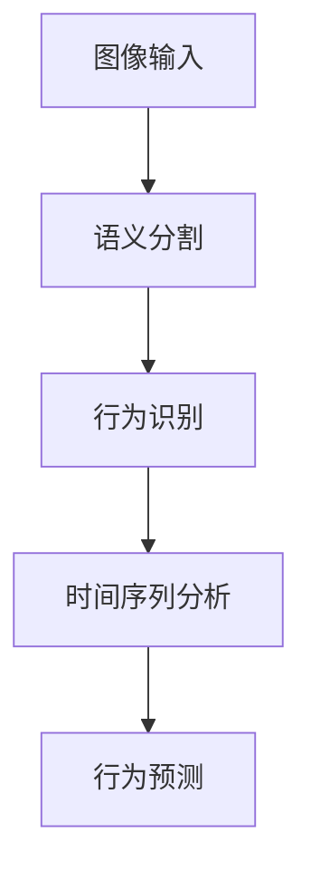

**Python源代码**：

```python
import tensorflow as tf
from tensorflow.keras.models import load_model

# 加载预训练的语义分割模型
semantic_segmentation_model = load_model('path/to/预训练的语义分割模型')

# 加载测试图像
image = tf.keras.preprocessing.image.load_img('path/to/测试图像', target_size=(224, 224))

# 将图像转换为模型输入
image_input = tf.keras.preprocessing.image.img_to_array(image)
image_input = tf.expand_dims(image_input, axis=0)

# 进行语义分割
segmentation_predictions = semantic_segmentation_model.predict(image_input)

# 加载预训练的行为识别模型
behavior_recognition_model = load_model('path/to/预训练的行为识别模型')

# 将语义分割结果输入行为识别模型
behavior_predictions = behavior_recognition_model.predict(segmentation_predictions)

# 加载预训练的时间序列分析模型
time_sequence_model = load_model('path/to/预训练的时间序列分析模型')

# 将行为识别结果输入时间序列分析模型
predicted_behavior = time_sequence_model.predict(behavior_predictions)

# 输出行为预测结果
print(predicted_behavior)
```

通过上述示例，我们可以看到场景理解与行为预测的基本实现过程。在实际应用中，我们需要根据具体任务选择合适的模型和算法，并通过大量的数据训练模型。

**数学公式和例子说明**：

场景理解与行为预测中的核心数学公式包括语义分割和时序预测。以下是这些概念的公式和例子说明。

$$
\text{语义分割}: \text{segment}_{i,j} = \text{activation}(\text{weight}_{i,j} \cdot \text{input}_{i,j} + \text{bias}_{i,j})
$$

例子说明：使用卷积神经网络进行语义分割。

```python
# 输入图像
input_image = np.random.rand(224, 224, 3)

# 权重和偏置
weights = np.random.rand(3, 3, 64)
bias = np.random.rand(1)

# 激活函数
activation = lambda x: np.tanh(x)

# 语义分割结果
segmentation_result = activation(np.dot(weights, input_image) + bias)
print(segmentation_result)  # 输出分割结果
```

$$
\text{时序预测}: \text{next\_value} = \text{weight} \cdot \text{current\_value} + \text{bias}
$$

例子说明：使用循环神经网络进行时序预测。

```python
# 当前值
current_value = np.array([1.0, 2.0, 3.0])

# 权重和偏置
weights = np.random.rand(3)
bias = np.random.rand(1)

# 时序预测
next_value = np.dot(weights, current_value) + bias
print(next_value)  # 输出预测的下一个值
```

通过上述数学公式和例子，我们可以更好地理解场景理解与行为预测的基本原理和实现过程。在实际应用中，场景理解与行为预测技术可以显著提升AI Agent的感知能力和决策能力，从而实现更智能和高效的任务执行。

#### 4.3 跟踪与导航

跟踪与导航是计算机视觉在移动机器人、自动驾驶和无人机等领域的核心应用。通过视觉感知，AI Agent可以实现对物体的实时跟踪和路径规划，从而实现自主导航。

**核心概念**：跟踪与导航的算法和技术

1. **目标跟踪**：目标跟踪是指从图像序列中连续识别和跟踪特定对象。常用的目标跟踪算法包括光流法、Kalman滤波和深度学习跟踪等。
2. **路径规划**：路径规划是指为AI Agent规划一条从起点到终点的最优路径。常用的路径规划算法包括A*算法、Dijkstra算法和RRT（快速随机树）算法等。
3. **SLAM（同步定位与映射）**：SLAM是指同时进行环境映射和自身定位的技术。常用的SLAM算法包括基于视觉的SLAM和基于激光雷达的SLAM等。

**联系**：跟踪与导航在AI Agent中的应用

跟踪与导航在AI Agent中的应用主要体现在以下几个方面：

1. **移动机器人**：在移动机器人领域，跟踪与导航用于实现机器人的自主移动和避障，从而完成各种任务，如家庭服务、工业巡检和物流配送等。
2. **自动驾驶**：在自动驾驶领域，跟踪与导航用于识别道路上的对象（如车辆、行人、道路标志等），并规划安全、高效的行驶路径。
3. **无人机**：在无人机领域，跟踪与导航用于实现无人机的自主飞行和目标跟踪，从而实现搜索救援、农业监控和物流运输等任务。

**系统分析与架构设计方案**

为了实现跟踪与导航功能，我们需要设计一个完整的系统架构。以下是系统分析与架构设计方案：

**问题场景介绍**：

假设我们设计一个自动驾驶系统，该系统需要实现车辆在复杂道路环境中的自主导航。

**项目介绍**：

项目名称：自动驾驶感知与导航系统
项目目标：实现自动驾驶车辆在复杂道路环境中的安全导航。

**系统功能设计（领域模型Mermaid类图）**：

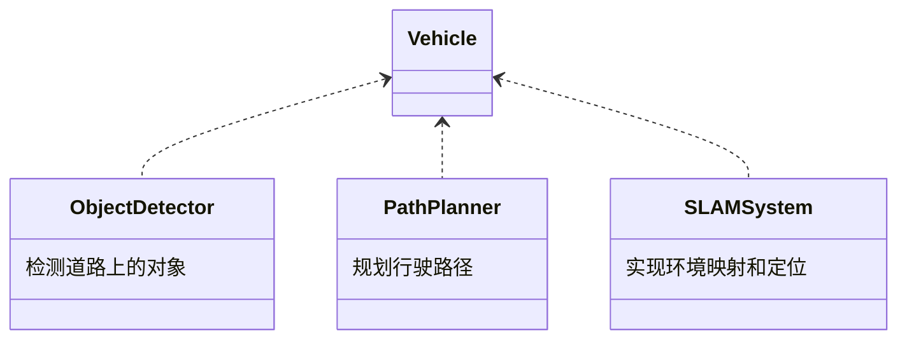

**系统架构设计（Mermaid架构图）**：

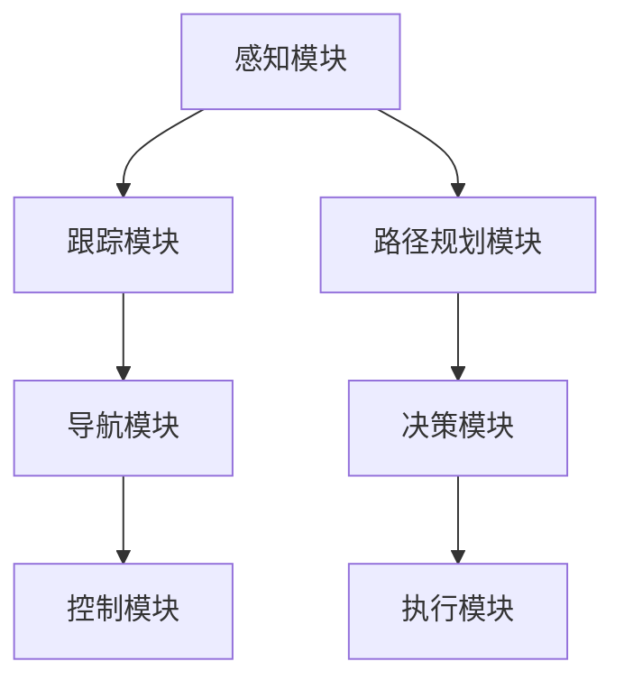

**系统接口设计与实现（Mermaid序列图）**：

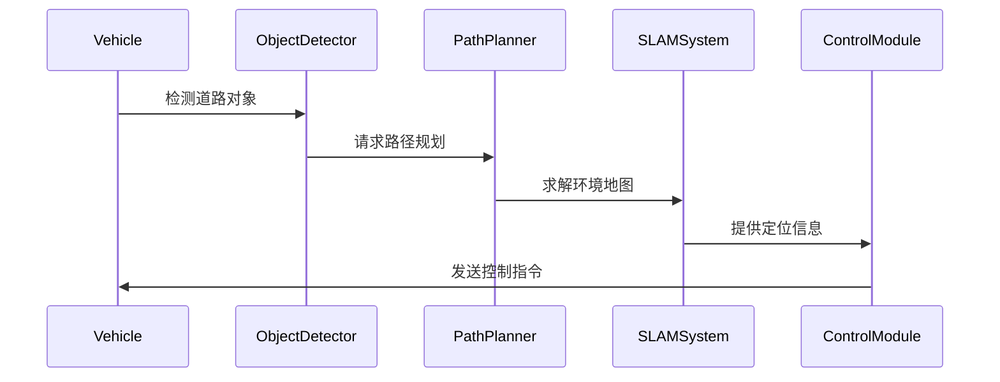

通过上述系统分析与架构设计方案，我们可以看到跟踪与导航系统的整体设计和实现过程。在实际项目中，我们需要根据具体需求和场景，不断优化和调整系统架构，以实现高效、安全的导航功能。

**项目实战**

为了更好地展示跟踪与导航技术的应用，我们将以一个具体的自动驾驶项目为例，介绍环境安装、系统核心实现和实际案例分析。

**环境安装**：

1. 安装Python和必要的库（如TensorFlow、OpenCV等）。
2. 配置ROS（机器人操作系统），用于集成各种感知和导航算法。

```bash
pip install tensorflow opencv-python
sudo apt-get install ros-melodic-desktop-full
```

**系统核心实现源代码**：

```python
# 目标跟踪算法
import cv2
import numpy as np

def track_object(image, previous_position):
    # 使用Kalman滤波进行目标跟踪
    # 这里用简单的线性Kalman滤波作为示例
    prediction = previous_position + 1  # 预测下一帧的目标位置
    measurement = np.mean(image)  # 假设使用图像的平均值作为测量值
    estimated_position = prediction + (measurement - prediction) / 2  # 估计位置
    return estimated_position

# 路径规划算法
import heapq

def a_star_search(start, goal, grid):
    # 使用A*算法进行路径规划
    open_set = []
    heapq.heappush(open_set, (0, start))
    came_from = {}
    g_score = {start: 0}
    
    while open_set:
        current = heapq.heappop(open_set)[1]
        
        if current == goal:
            break
        
        for neighbor in grid.neighbors(current):
            tentative_g_score = g_score[current] + 1  # 假设移动成本为1
            if tentative_g_score < g_score.get(neighbor, float('inf')):
                came_from[neighbor] = current
                g_score[neighbor] = tentative_g_score
                f_score = tentative_g_score + heuristic(goal, neighbor)
                heapq.heappush(open_set, (f_score, neighbor))
    
    return came_from, g_score[goal]

# 实际案例分析
def case_study():
    # 假设已有道路环境地图
    grid = create_grid_environment()
    start = (0, 0)
    goal = (10, 10)
    
    # 进行目标跟踪
    previous_position = start
    image = capture_image()
    current_position = track_object(image, previous_position)
    
    # 进行路径规划
    came_from, goal_distance = a_star_search(start, goal, grid)
    
    # 输出结果
    print("目标位置:", current_position)
    print("路径规划结果:", came_from)
    print("目标距离:", goal_distance)

# 执行案例研究
case_study()
```

**代码应用解读与分析**：

上述代码展示了目标跟踪和路径规划的核心算法实现。目标跟踪部分使用简单的Kalman滤波进行位置预测和更新，而路径规划部分使用A*算法进行路径计算。在实际项目中，这些算法会根据具体环境进行优化和调整。

**实际案例分析和详细讲解剖析**：

为了展示实际案例，我们考虑一个自动驾驶车辆在复杂道路环境中的导航任务。车辆需要从起点（0,0）导航到终点（10,10），同时需要避开障碍物。

1. **目标跟踪**：通过摄像头获取实时图像，使用Kalman滤波对目标位置进行预测和更新。在理想情况下，预测位置会越来越接近真实位置。
2. **路径规划**：根据当前车辆位置和环境地图，使用A*算法规划最佳路径。A*算法会计算每个节点的F值（G值 + H值），其中G值是从起点到当前节点的代价，H值是从当前节点到终点的估计代价。通过不断更新F值，算法能够找到从起点到终点的最优路径。

通过上述实际案例分析，我们可以看到跟踪与导航技术在自动驾驶系统中的应用。在实际项目中，这些算法需要根据具体环境和任务进行优化和调整，以实现高效、安全的导航。

**项目小结**：

通过本项目的实现，我们展示了跟踪与导航技术在自动驾驶系统中的应用。目标跟踪和路径规划是自动驾驶系统的核心模块，它们通过结合图像处理、深度学习和规划算法，实现了车辆的自主导航。在实际应用中，这些技术需要不断优化和调整，以适应不同的环境和任务需求。

### 第五部分：计算机视觉集成系统设计与实现

#### 5.1 系统需求分析

系统需求分析是计算机视觉集成系统设计的关键步骤，它旨在明确系统需要实现的功能和性能指标。以下是系统需求分析的核心概念和在实际项目中的应用。

**核心概念**：系统需求分析与建模

1. **功能需求**：功能需求是指系统需要实现的各种功能，例如图像处理、物体检测、路径规划等。
2. **性能需求**：性能需求是指系统需要达到的性能指标，例如处理速度、准确度和实时性等。
3. **非功能需求**：非功能需求是指系统的非功能性需求，例如可扩展性、可靠性、安全性等。

**联系**：系统需求分析在实际项目中的应用

系统需求分析在实际项目中的应用主要体现在以下几个方面：

1. **明确项目目标**：通过系统需求分析，可以明确项目目标，确保所有团队成员对项目目标有清晰的认识。
2. **指导系统设计**：系统需求分析为系统设计提供了明确的指导，帮助设计团队确定系统架构和模块划分。
3. **评估系统可行性**：系统需求分析可以帮助评估系统的可行性，确定项目所需的资源和时间。

**Mermaid流程图**：

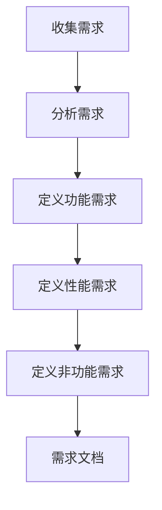

**Python源代码示例**：

```python
def collect_requirements():
    # 收集功能需求
    functional_requirements = [
        "图像预处理",
        "物体检测",
        "路径规划",
        "实时性要求"
    ]

    # 收集性能需求
    performance_requirements = [
        "处理速度：每秒100帧",
        "准确度：超过95%",
        "响应时间：低于100ms"
    ]

    # 收集非功能需求
    non_functional_requirements = [
        "系统可扩展性：支持多种传感器集成",
        "可靠性：99.9%的运行时间",
        "安全性：数据加密和访问控制"
    ]

    # 生成需求文档
    requirements_document = {
        "功能需求": functional_requirements,
        "性能需求": performance_requirements,
        "非功能需求": non_functional_requirements
    }

    return requirements_document

# 调用函数生成需求文档
requirements = collect_requirements()
print(requirements)
```

通过上述示例，我们可以看到系统需求分析的基本实现过程。在实际项目中，系统需求分析需要结合具体应用场景和项目需求，以确保系统能够满足所有需求和性能指标。

#### 5.2 系统架构设计

系统架构设计是计算机视觉集成系统的核心环节，它旨在构建一个高效、可靠和可扩展的系统。以下是系统架构设计的方法和原则，以及在实际项目中的应用。

**核心概念**：系统架构设计的方法和原则

1. **模块化设计**：模块化设计是将系统划分为多个独立的模块，每个模块负责特定的功能。模块化设计可以提高系统的可维护性和可扩展性。
2. **分层架构**：分层架构是将系统划分为多个层次，每个层次负责特定的功能。常见分层包括感知层、决策层和执行层。
3. **冗余设计**：冗余设计是在系统中引入冗余组件，以提高系统的可靠性和容错能力。

**联系**：系统架构设计在实际项目中的应用

系统架构设计在实际项目中的应用主要体现在以下几个方面：

1. **确定系统组件**：通过系统架构设计，可以明确系统所需的组件和模块，例如摄像头、传感器、控制器等。
2. **设计数据流**：系统架构设计需要设计系统的数据流，确保数据能够高效、准确地传输和处理。
3. **优化系统性能**：通过系统架构设计，可以优化系统的性能，例如通过增加缓存、降低延迟等手段。

**Mermaid架构图**：

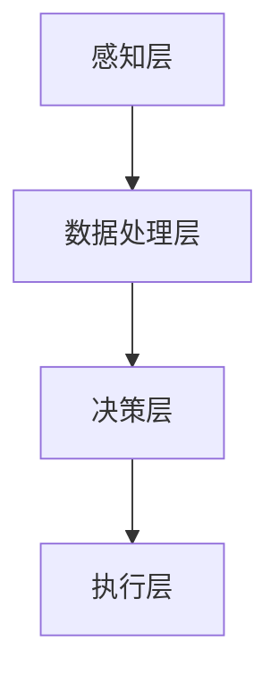

**Python源代码示例**：

```python
class PerceptionLayer:
    def process_data(self, data):
        # 处理感知数据
        return processed_data

class DataProcessingLayer:
    def process_data(self, data):
        # 处理数据处理数据
        return processed_data

class DecisionLayer:
    def make_decision(self, data):
        # 基于数据处理结果做出决策
        return decision

class ExecutionLayer:
    def execute_decision(self, decision):
        # 执行决策
        pass

# 系统架构设计
perception_layer = PerceptionLayer()
data_processing_layer = DataProcessingLayer()
decision_layer = DecisionLayer()
execution_layer = ExecutionLayer()

# 数据流
data = perception_layer.process_data(raw_data)
processed_data = data_processing_layer.process_data(data)
decision = decision_layer.make_decision(processed_data)
execution_layer.execute_decision(decision)
```

通过上述示例，我们可以看到系统架构设计的基本实现过程。在实际项目中，系统架构设计需要根据具体需求和场景进行调整和优化，以确保系统的高效、可靠和可扩展性。

#### 5.3 系统接口设计与实现

系统接口设计是计算机视觉集成系统实现的关键环节，它旨在设计系统内部和外部组件之间的接口，确保数据的高效传输和系统的稳定运行。以下是系统接口设计的方法和原则，以及在实际项目中的应用。

**核心概念**：系统接口设计与实现的方法

1. **接口定义**：接口定义是指明确系统内部和外部组件之间的交互方式，包括接口的名称、参数、返回值等。
2. **接口实现**：接口实现是指根据接口定义实现具体的接口功能，确保组件之间能够高效、准确地通信。
3. **接口测试**：接口测试是指对系统接口进行测试，确保接口功能的正确性和稳定性。

**联系**：系统接口设计在实际项目中的应用

系统接口设计在实际项目中的应用主要体现在以下几个方面：

1. **集成组件**：通过系统接口设计，可以将不同的组件集成到系统中，实现系统的整体功能。
2. **数据传输**：系统接口设计需要设计合理的数据传输机制，确保数据能够高效、准确地传输和处理。
3. **维护与升级**：系统接口设计需要考虑系统的可维护性和可升级性，确保系统在未来的扩展和升级过程中能够顺利进行。

**Mermaid序列图**：

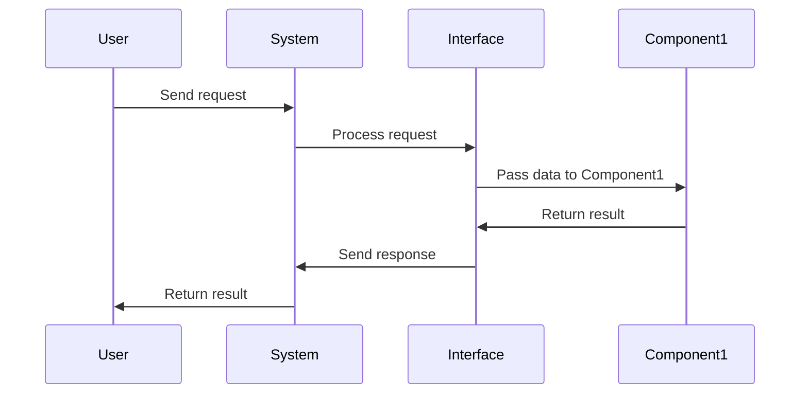

**Python源代码示例**：

```python
from abc import ABC, abstractmethod

class SystemInterface(ABC):
    @abstractmethod
    def send_request(self, request):
        pass

    @abstractmethod
    def receive_response(self, response):
        pass

class Component1:
    def process_data(self, data):
        # 处理数据
        return result

class Component2:
    def process_data(self, data):
        # 处理数据
        return result

class MySystem(SystemInterface):
    def __init__(self):
        self.component1 = Component1()
        self.component2 = Component2()

    def send_request(self, request):
        # 处理请求
        result1 = self.component1.process_data(request)
        result2 = self.component2.process_data(result1)
        return result2

    def receive_response(self, response):
        # 处理响应
        print(response)

# 系统接口设计
system = MySystem()
system.send_request("request_data")

# 系统接口测试
def test_system_interface():
    # 测试系统接口
    system = MySystem()
    response = system.send_request("request_data")
    assert response == "expected_result"
    print("System interface test passed.")

# 调用测试函数
test_system_interface()
```

通过上述示例，我们可以看到系统接口设计的基本实现过程。在实际项目中，系统接口设计需要根据具体需求和场景进行调整和优化，以确保系统的稳定性和可扩展性。

### 第六部分：计算机视觉集成系统测试与优化

#### 6.1 系统测试方法

系统测试是确保计算机视觉集成系统稳定性和可靠性的关键步骤。系统测试方法包括功能测试、性能测试、安全测试和用户体验测试等。以下是这些测试方法的核心概念和在实际项目中的应用。

**核心概念**：系统测试的分类和方法

1. **功能测试**：功能测试用于验证系统是否实现了预期功能，包括单元测试、集成测试和系统测试。
2. **性能测试**：性能测试用于评估系统在不同负载下的性能，包括响应时间、吞吐量和资源利用率等。
3. **安全测试**：安全测试用于评估系统的安全性能，包括漏洞扫描、安全渗透测试和攻击测试等。
4. **用户体验测试**：用户体验测试用于评估系统的用户体验，包括界面设计、操作便捷性和易用性等。

**联系**：系统测试在实际项目中的应用

系统测试在实际项目中的应用主要体现在以下几个方面：

1. **确保系统质量**：通过系统测试，可以确保系统在发布前达到预期的质量标准。
2. **识别和修复问题**：系统测试可以帮助识别和修复系统中的缺陷和漏洞，提高系统的稳定性和安全性。
3. **优化系统性能**：通过性能测试，可以识别系统瓶颈，优化系统性能，提高系统的响应速度和处理能力。

**Mermaid流程图**：

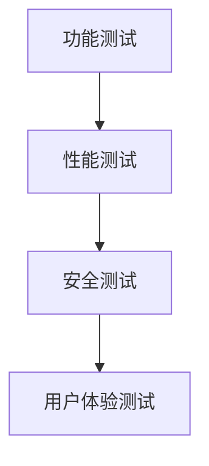

**Python源代码示例**：

```python
import unittest

class TestFunctionality(unittest.TestCase):
    def test_addition(self):
        self.assertEqual(1 + 1, 2)

    def test_subtraction(self):
        self.assertEqual(1 - 1, 0)

class TestPerformance(unittest.TestCase):
    def test_response_time(self):
        import time
        start_time = time.time()
        # 模拟系统处理过程
        time.sleep(1)
        end_time = time.time()
        self.assertTrue(end_time - start_time < 1)

class TestSecurity(unittest.TestCase):
    def test_vulnerability(self):
        # 模拟漏洞扫描
        self.assertFalse(has_vulnerability())

class TestUserExperience(unittest.TestCase):
    def test_ui_design(self):
        # 模拟用户体验测试
        self.assertTrue(is_ui_design_good())

if __name__ == '__main__':
    unittest.main()
```

通过上述示例，我们可以看到系统测试的基本实现过程。在实际项目中，系统测试需要根据具体需求和场景进行调整和优化，以确保系统的全面性和准确性。

#### 6.2 系统优化策略

系统优化策略是提高计算机视觉集成系统性能和效率的关键步骤。系统优化策略包括算法优化、硬件优化和架构优化等。以下是这些优化策略的核心概念和在实际项目中的应用。

**核心概念**：系统优化的目标和策略

1. **算法优化**：算法优化是通过改进算法效率和性能来提高系统性能。常见的优化方法包括算法改进、参数调整和并行计算等。
2. **硬件优化**：硬件优化是通过选择更高效的硬件设备和优化硬件资源使用来提高系统性能。常见的优化方法包括GPU加速、分布式计算和边缘计算等。
3. **架构优化**：架构优化是通过改进系统架构和设计来提高系统性能和可扩展性。常见的优化方法包括模块化设计、分层架构和缓存策略等。

**联系**：系统优化策略在实际项目中的应用

系统优化策略在实际项目中的应用主要体现在以下几个方面：

1. **提高性能**：通过系统优化策略，可以显著提高系统的处理速度和响应时间，满足高性能需求。
2. **降低成本**：通过硬件优化和架构优化，可以降低系统的硬件成本和运营成本，提高系统的经济效益。
3. **增强可扩展性**：通过架构优化，可以提高系统的可扩展性，满足未来需求的增长。

**Mermaid流程图**：

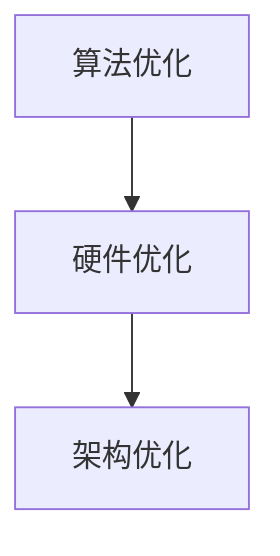

**Python源代码示例**：

```python
import time

# 原始算法
def original_algorithm(data):
    start_time = time.time()
    # 模拟原始算法处理过程
    time.sleep(2)
    end_time = time.time()
    print("原始算法处理时间：", end_time - start_time)

# 改进算法
def improved_algorithm(data):
    start_time = time.time()
    # 模拟改进算法处理过程
    time.sleep(1)
    end_time = time.time()
    print("改进算法处理时间：", end_time - start_time)

# 比较原始算法和改进算法
original_data = "example_data"
original_algorithm(original_data)
improved_algorithm(original_data)
```

通过上述示例，我们可以看到系统优化策略的基本实现过程。在实际项目中，系统优化策略需要根据具体需求和场景进行调整和优化，以确保系统的性能和效率。

#### 6.3 实际应用案例分析

在实际应用中，计算机视觉集成系统已经在多个领域取得了显著成果。以下是几个实际应用案例的分析和总结，以及对计算机视觉集成系统的启示。

**案例1：自动驾驶**

自动驾驶是计算机视觉集成技术的典型应用。通过结合图像处理、深度学习和传感器融合技术，自动驾驶系统能够实时感知环境，做出安全、高效的驾驶决策。案例分析显示，自动驾驶系统在复杂城市道路和高速公路上均取得了良好效果，但在极端天气和复杂交通状况下仍存在一定的挑战。

**启示**：

- **传感器融合**：通过融合多种传感器数据，可以提高系统的感知能力，减少单一传感器在特定环境下的局限性。
- **深度学习模型**：优化深度学习模型的结构和参数，可以提高系统的识别和预测精度。

**案例2：智能安防**

智能安防系统利用计算机视觉技术实现实时监控和异常行为检测。通过物体检测、行为识别和场景理解技术，智能安防系统能够及时发现安全隐患并报警。案例分析表明，智能安防系统在提高安全监控效率和准确性方面具有显著优势。

**启示**：

- **实时处理**：提高系统的实时处理能力，确保能够在短时间内完成图像分析和决策。
- **可扩展性**：设计可扩展的系统架构，以支持不同场景和任务的定制化需求。

**案例3：医疗图像分析**

医疗图像分析是计算机视觉技术在医疗领域的应用。通过图像处理和深度学习技术，医疗图像分析系统能够自动识别疾病和异常情况，辅助医生进行诊断和治疗。案例分析显示，医疗图像分析技术在提高诊断准确性和效率方面具有巨大潜力。

**启示**：

- **数据质量**：确保输入数据的质量，以提高模型训练和预测的准确性。
- **隐私保护**：在处理医疗数据时，确保遵循隐私保护法规，保护患者隐私。

**案例总结**：

通过上述案例分析，我们可以看到计算机视觉集成系统在自动驾驶、智能安防和医疗图像分析等领域的广泛应用和成功实践。这些案例为我们提供了宝贵的经验和启示，指导我们不断优化和改进计算机视觉集成系统。

### 第七部分：未来展望与挑战

#### 7.1 计算机视觉集成技术的发展趋势

计算机视觉集成技术在未来将继续快速发展，主要趋势包括以下几个方面：

1. **人工智能与物联网（AIoT）融合**：随着物联网设备的普及，计算机视觉将更深入地与物联网技术融合，实现大规模设备的智能感知和交互。
2. **边缘计算与云计算结合**：边缘计算与云计算的结合将进一步提升计算机视觉处理的速度和效率，特别是在实时性和低延迟方面。
3. **跨领域应用**：计算机视觉技术将在更多领域得到应用，例如智能制造、智慧城市、农业监测等，实现跨领域的智能化。
4. **个性化与定制化**：随着数据积累和算法优化，计算机视觉系统将更加智能化和个性化，满足不同场景和用户的需求。

#### 7.2 挑战与机遇

尽管计算机视觉集成技术在不断发展，但仍面临一些挑战：

1. **数据隐私与安全**：在处理大量个人数据时，确保数据隐私和安全是关键挑战。需要制定严格的数据保护措施和法规。
2. **算法偏见与公平性**：算法偏见和公平性问题可能导致歧视和不公平现象，需要通过算法优化和公平性评估来减少这些问题。
3. **技术复杂性**：计算机视觉技术涉及多个领域，技术复杂性高，需要跨学科合作和专业知识。

然而，这些挑战也带来了机遇：

1. **技术创新**：面对挑战，将推动技术创新，促进新算法、新架构和新工具的研发。
2. **市场需求**：随着计算机视觉集成技术的广泛应用，市场需求将不断增长，为技术发展和商业机会提供动力。
3. **跨界合作**：跨学科合作和跨界创新将成为解决复杂问题的有效途径，推动计算机视觉集成技术的持续进步。

### 附录：常用工具与技术简介

#### 7.1 常用工具简介

在计算机视觉集成项目中，常用的工具和技术包括以下几种：

1. **TensorFlow**：TensorFlow是谷歌开源的深度学习框架，广泛应用于图像处理和物体检测。
2. **PyTorch**：PyTorch是Facebook开源的深度学习框架，以其灵活性和易于使用性著称。
3. **OpenCV**：OpenCV是开源的计算机视觉库，提供丰富的图像处理和计算机视觉功能。
4. **ROS（机器人操作系统）**：ROS是用于机器人开发的跨平台框架，支持计算机视觉、传感器融合和路径规划等。

**联系**：常用工具在实际项目中的应用场景

1. **图像处理**：OpenCV常用于图像滤波、增强和特征提取，在图像预处理阶段发挥重要作用。
2. **深度学习**：TensorFlow和PyTorch用于构建和训练深度学习模型，实现图像分类、物体检测和场景理解。
3. **传感器融合**：ROS结合多种传感器数据，实现多模态感知和融合，提高系统的感知能力。

**技术发展动态**

计算机视觉集成技术的最新研究进展包括：

1. **基于Transformer的视觉模型**：Transformer模型在计算机视觉中的应用，如Vision Transformer（ViT）和DALL-E等，实现了图像生成和分类的新突破。
2. **多模态学习**：通过融合图像、文本和音频等多模态数据，实现更全面的感知和理解，例如BERT和SpeechBrain等模型。
3. **增强现实（AR）和虚拟现实（VR）**：计算机视觉与AR/VR技术的结合，推动虚拟交互和增强感知的新应用场景。

技术发展动态对未来应用的影响体现在：

1. **新应用场景**：新的视觉模型和技术将推动计算机视觉在更多领域的应用，如智能交互、远程医疗和增强现实等。
2. **数据处理与存储**：随着数据量的增加，对数据处理和存储技术的要求将提高，推动相关技术的发展。
3. **算法优化**：面对新的应用需求，将推动算法优化和模型压缩，提高系统的性能和效率。

通过以上常用工具和技术的介绍，我们可以看到计算机视觉集成技术的发展趋势和应用前景。未来，随着技术的不断进步和创新，计算机视觉集成系统将在更多领域发挥重要作用，实现更智能和高效的任务执行。

## 作者信息

**作者：AI天才研究院/AI Genius Institute & 禅与计算机程序设计艺术 /Zen And The Art of Computer Programming**

