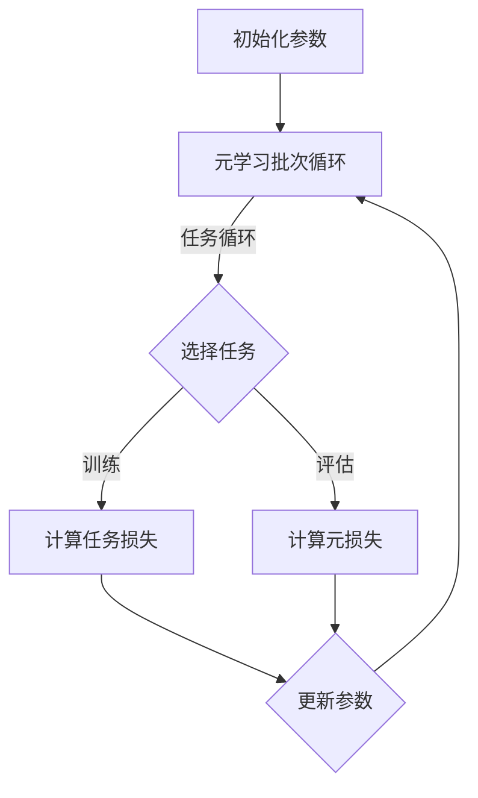

                 

# 设计AI Agent的元控制学习策略

## 关键词
- 人工智能代理
- 元控制学习
- 自主学习
- 泛化能力
- 模型更新
- 数据采样
- 迁移学习

## 摘要
本文探讨了设计AI Agent的元控制学习策略的核心方法和实践。通过分析元控制学习的背景和基本概念，深入讨论了常见元控制学习策略，包括模型更新策略、数据采样策略和迁移学习策略。文章还展示了元控制学习在AI Agent中的具体应用，并通过实际案例进行详细分析，为读者提供了全面的设计指南和未来展望。

## 第一部分：背景介绍

### 问题背景

随着人工智能技术的快速发展，人工智能代理（AI Agent）的应用越来越广泛。这些代理需要具备高度自主学习和决策能力，以适应复杂多变的环境。元控制学习（Meta-Learning）作为一种新兴的学习方法，能够加速代理的学习过程，提高其在不同任务上的泛化能力。设计高效的元控制学习策略，成为当前人工智能领域的一个重要研究方向。

#### 问题描述

设计AI Agent的元控制学习策略涉及多个方面，包括算法原理、数学模型、系统架构以及实际应用。本章将首先介绍元控制学习的背景和基本概念，然后详细探讨不同类型的元控制学习策略，分析其优缺点，并讨论如何在实际应用中实现这些策略。

#### 问题解决

为了全面覆盖元控制学习策略的设计，本文将采用以下结构：

1. **第1章：元控制学习概述**
   - 介绍元控制学习的核心概念、发展历程和重要研究成果。
   - 分析元控制学习与传统控制学习、强化学习等的关系。

2. **第2章：元控制学习的数学模型**
   - 系统阐述元控制学习的数学模型，包括目标函数、优化算法和性能评估指标。
   - 通过Mermaid流程图展示元控制学习的基本流程。

3. **第3章：常见元控制学习策略**
   - 详细介绍几种典型的元控制学习策略，包括模型更新策略、数据采样策略和迁移学习策略。
   - 比较不同策略的优缺点，分析其在实际应用中的适用场景。

4. **第4章：元控制学习在AI Agent中的应用**
   - 探讨元控制学习在AI Agent中的具体应用，包括自主决策、路径规划、任务分配等。
   - 分析元控制学习策略在AI Agent中的优势和挑战。

5. **第5章：元控制学习策略设计实战**
   - 通过实际案例，展示如何设计和实现元控制学习策略。
   - 包括环境搭建、算法实现、性能评估等步骤。

6. **第6章：元控制学习策略评估与优化**
   - 讨论如何评估元控制学习策略的有效性，并提出优化方法。
   - 包括实验设计、指标选择和改进策略。

7. **第7章：未来发展趋势与展望**
   - 分析元控制学习领域的发展趋势，探讨未来可能的研究方向。
   - 对AI Agent的元控制学习策略提出展望和建议。

### 边界与外延

元控制学习策略的设计不仅限于特定类型的AI Agent，如路径规划、任务分配等，还可以应用于更广泛的场景，如智能推荐系统、智能问答机器人等。此外，随着人工智能技术的不断进步，元控制学习策略也将不断迭代和优化，以适应更复杂的应用需求。

### 概念结构与核心要素组成

- **元控制学习**：一种通过学习如何学习的新方法，能够加速代理的学习过程。
- **AI Agent**：具备自主学习和决策能力的智能体，能够在复杂环境中执行特定任务。
- **数学模型**：元控制学习的基础，包括目标函数、优化算法和性能评估指标。
- **策略设计**：针对不同应用场景，设计合适的元控制学习策略。
- **系统架构**：元控制学习策略在AI Agent中的实现，包括算法流程、数据流和控制流。

通过以上章节的设置，本文旨在为读者提供全面、系统的元控制学习策略设计指南，帮助读者深入了解并掌握这一领域的关键技术和方法。

## 第一部分：元控制学习概述

### 第1章：元控制学习概述

#### 1.1 元控制学习简介

**1.1.1 元控制学习的定义**

元控制学习（Meta-Learning）是指学习如何学习的方法，通过加速学习过程和提高泛化能力，使得代理能够在不同任务上快速适应。它不仅关注特定任务上的性能提升，还致力于通过经验积累实现跨任务的泛化。

$$
元控制学习（Meta-Learning）是一种通过优化学习过程来提高学习效率和泛化能力的方法，其核心目标是使得代理能够在不同的任务环境中快速适应。
$$

**1.1.2 元控制学习的发展历程**

元控制学习作为一个研究领域，其发展历程可以分为以下几个阶段：

- **早期研究**：20世纪50年代至70年代，主要以传统机器学习算法为基础，研究如何提高算法的泛化能力。
- **近期进展**：随着深度学习技术的发展，元控制学习与深度学习相结合，涌现出了一系列高效的元学习算法，如MAML（Model-Agnostic Meta-Learning）和Recurrent Meta-Learning。

**1.1.3 元控制学习的重要性**

元控制学习在人工智能领域具有重要意义，主要体现在以下几个方面：

- **样本效率**：通过元控制学习，代理可以在较少样本情况下快速适应新任务，提高样本利用效率。
- **迁移能力**：元控制学习策略使得代理能够将学习经验从一个任务迁移到另一个任务，增强其泛化能力。
- **自适应能力**：元控制学习能够帮助代理在复杂多变的环境中快速适应，提高其自主决策能力。

#### 1.2 元控制学习与传统控制学习的区别

**1.2.1 传统控制学习**

传统控制学习（Traditional Control Learning）主要基于样本数据进行学习，其核心目标是提高模型在特定任务上的预测准确性。传统控制学习的主要特点如下：

- **依赖大量样本**：传统学习需要大量样本数据才能训练出性能良好的模型。
- **任务独立性**：传统学习算法通常针对单个任务进行优化，缺乏跨任务的泛化能力。

**1.2.2 元控制学习的优势**

与传统的控制学习相比，元控制学习具有以下优势：

- **样本效率**：通过元控制学习，代理可以在较少样本情况下快速适应新任务，提高样本利用效率。
- **迁移能力**：元控制学习策略使得代理能够将学习经验从一个任务迁移到另一个任务，增强其泛化能力。
- **自适应能力**：元控制学习能够帮助代理在复杂多变的环境中快速适应，提高其自主决策能力。

#### 1.3 元控制学习在AI Agent中的应用

**1.3.1 自主决策**

在自主决策（Autonomous Decision-Making）中，AI Agent需要根据环境变化做出合理的决策。元控制学习策略可以通过以下方式提升自主决策能力：

- **快速适应**：元控制学习使得代理能够在短时间内适应新环境，提高决策速度。
- **跨任务学习**：代理可以从以往任务中获得经验，提高在新任务中的决策准确性。

**1.3.2 路径规划**

路径规划（Path Planning）是AI Agent在复杂环境中的一项重要任务。元控制学习策略可以优化路径规划过程，提高路径规划的效率和准确性：

- **数据高效利用**：通过元控制学习，代理可以在较少样本情况下快速优化路径规划算法。
- **迁移路径规划经验**：代理可以将一个场景中的路径规划经验迁移到另一个相似的场景中，提高路径规划的泛化能力。

**1.3.3 任务分配**

在多任务环境中，AI Agent需要合理分配任务，以最大化整体效益。元控制学习策略可以为任务分配提供以下支持：

- **动态调整**：元控制学习使得代理能够根据任务的重要性和环境变化动态调整任务分配策略。
- **经验迁移**：代理可以将以往的任务分配经验迁移到新任务中，提高任务分配的效率。

#### 1.4 元控制学习策略的设计原则

设计高效的元控制学习策略需要遵循以下原则：

- **模块化设计**：将元控制学习策略分解为可重用的模块，便于实现和优化。
- **适应性**：策略应能够根据不同任务和环境自适应调整，提高泛化能力。
- **可扩展性**：策略应具有良好的扩展性，能够支持新的任务和环境。
- **计算效率**：策略应尽可能降低计算复杂度，以提高运行效率。

通过以上设计原则，可以构建出适合不同应用场景的元控制学习策略，为AI Agent提供强大的学习能力和决策支持。

### 1.5 本章小结

本章介绍了元控制学习的核心概念、发展历程和应用场景，并探讨了元控制学习与传统控制学习的区别。通过本章的学习，读者可以了解元控制学习的基本原理，为后续章节的深入探讨打下基础。元控制学习作为一种新兴的学习方法，在人工智能领域具有广泛的应用前景，对于提升AI Agent的自主学习和决策能力具有重要意义。

----------------------------------------------------------------

# 第二部分：元控制学习的数学模型

## 第2章：元控制学习的数学模型

### 2.1 数学模型的基本概念

元控制学习的数学模型是构建高效元控制学习策略的基础。数学模型包括目标函数、优化算法和性能评估指标等组成部分。以下将分别介绍这些基本概念。

#### 2.1.1 目标函数

目标函数（Objective Function）是元控制学习的核心，用于衡量模型在特定任务上的性能。元控制学习的目标函数通常包含两个部分：任务损失（Task Loss）和元损失（Meta Loss）。

- **任务损失**：衡量模型在特定任务上的预测误差，如均方误差（Mean Squared Error, MSE）或交叉熵损失（Cross-Entropy Loss）。
- **元损失**：衡量模型在元学习过程中的性能，如元梯度（Meta Gradient）或模型更新速度（Model Update Rate）。

#### 2.1.2 优化算法

优化算法（Optimization Algorithm）用于寻找目标函数的最小值，从而训练出性能良好的模型。常见的优化算法包括梯度下降（Gradient Descent）、动量优化（Momentum Optimization）和Adam优化器（Adam Optimizer）等。

- **梯度下降**：通过迭代更新模型参数，使得目标函数逐渐减小。
- **动量优化**：在梯度下降的基础上引入动量项，加速收敛速度。
- **Adam优化器**：结合了动量和自适应学习率的优点，适用于大规模深度学习模型。

#### 2.1.3 性能评估指标

性能评估指标（Performance Metrics）用于评估元控制学习策略的有效性。常见的性能评估指标包括测试误差（Test Error）、学习曲线（Learning Curve）和泛化能力（Generalization Ability）等。

- **测试误差**：衡量模型在测试数据上的性能，通常用于评估模型的泛化能力。
- **学习曲线**：展示模型在训练数据上的学习过程，可以帮助调整训练策略。
- **泛化能力**：衡量模型在不同任务上的适应能力，通常通过交叉验证（Cross-Validation）进行评估。

### 2.2 元控制学习的数学模型

元控制学习的数学模型可以表示为一个优化问题，其目标是最小化一个复合损失函数：

$$
\min_{\theta} L(\theta) = \lambda_1 \cdot L_{\text{task}}(\theta) + \lambda_2 \cdot L_{\text{meta}}(\theta)
$$

其中，$\theta$ 表示模型参数，$L_{\text{task}}(\theta)$ 和 $L_{\text{meta}}(\theta)$ 分别表示任务损失和元损失，$\lambda_1$ 和 $\lambda_2$ 是调节参数，用于平衡任务损失和元损失的重要性。

#### 2.2.1 任务损失

任务损失 $L_{\text{task}}(\theta)$ 通常基于特定任务的损失函数，例如：

- **回归任务**：均方误差（MSE）
$$
L_{\text{regression}}(\theta) = \frac{1}{N} \sum_{i=1}^{N} (\hat{y}_i - y_i)^2
$$
其中，$\hat{y}_i$ 是预测值，$y_i$ 是真实值。

- **分类任务**：交叉熵损失（Cross-Entropy Loss）
$$
L_{\text{classification}}(\theta) = -\frac{1}{N} \sum_{i=1}^{N} y_i \log(\hat{p}_i)
$$
其中，$y_i$ 是类别标签，$\hat{p}_i$ 是预测概率。

#### 2.2.2 元损失

元损失 $L_{\text{meta}}(\theta)$ 用于衡量模型在元学习过程中的性能，通常基于元梯度的定义：

$$
L_{\text{meta}}(\theta) = \frac{1}{B} \sum_{b=1}^{B} \frac{1}{T} \sum_{t=1}^{T} \frac{1}{n_t} \sum_{i=1}^{n_t} \ell(\theta; x^{(b)}_i, y^{(b)}_i)
$$

其中，$B$ 是元学习批次的数量，$T$ 是每个批次的任务数量，$n_t$ 是第 $t$ 个任务的样本数量，$x^{(b)}_i$ 和 $y^{(b)}_i$ 分别是第 $b$ 个批次第 $t$ 个任务的输入和输出，$\ell(\theta; x^{(b)}_i, y^{(b)}_i)$ 是任务损失函数。

#### 2.2.3 优化算法

为了求解上述优化问题，可以使用各种优化算法。以下是一个基于梯度下降的优化算法示例：

$$
\theta_{\text{new}} = \theta_{\text{old}} - \alpha \nabla_{\theta} L(\theta)
$$

其中，$\theta_{\text{old}}$ 和 $\theta_{\text{new}}$ 分别表示当前和下一次迭代的模型参数，$\alpha$ 是学习率，$\nabla_{\theta} L(\theta)$ 是目标函数的梯度。

### 2.3 Mermaid流程图

为了更直观地展示元控制学习的基本流程，可以使用Mermaid流程图来表示。以下是一个简单的Mermaid流程图示例：



通过这个流程图，我们可以清晰地看到元控制学习的基本步骤，包括初始化参数、元学习批次循环、任务循环和参数更新等。

### 2.4 本章小结

本章介绍了元控制学习的数学模型，包括目标函数、优化算法和性能评估指标。通过这些基本概念，读者可以理解元控制学习的基本原理和实现方法。在后续章节中，我们将进一步探讨具体的元控制学习策略，并在实际应用中进行验证和优化。

----------------------------------------------------------------

# 第三部分：常见元控制学习策略

## 第3章：常见元控制学习策略

### 3.1 模型更新策略

模型更新策略（Model Update Strategy）是元控制学习中的一个核心策略，旨在通过迭代更新模型参数，使得模型能够快速适应新任务。以下介绍几种常见的模型更新策略。

#### 3.1.1 MAML（Model-Agnostic Meta-Learning）

MAML（Model-Agnostic Meta-Learning）是一种代表性的模型更新策略，由Li et al.在2016年提出。MAML的核心思想是设计一个模型参数更新规则，使得模型能够迅速适应新的任务。

$$
\theta^{*} = \theta - \eta \nabla_{\theta} \mathcal{L}(\theta; x^*, y^*)
$$

其中，$\theta$ 是初始模型参数，$\theta^{*}$ 是更新后的模型参数，$x^*$ 和 $y^*$ 是新任务的输入和输出，$\eta$ 是学习率，$\mathcal{L}(\theta; x^*, y^*)$ 是任务损失函数。

**优点**：
- **快速适应**：MAML能够在少量样本下快速适应新任务。
- **模型可重用性**：MAML适用于不同的任务，无需重新训练模型。

**缺点**：
- **样本效率不高**：对于复杂任务，MAML仍需要一定数量的样本才能快速适应。
- **收敛速度较慢**：在某些情况下，MAML的收敛速度较慢，需要较大的学习率。

#### 3.1.2 Reptile

Reptile是由Thrun和Pratt于1997年提出的一种简单有效的元学习算法。Reptile通过以下更新规则迭代更新模型参数：

$$
\theta_{t+1} = \theta_t + \eta \left( \theta_t - \theta_{t-1} \right)
$$

其中，$\theta_t$ 是第 $t$ 次迭代的模型参数，$\eta$ 是学习率。

**优点**：
- **计算效率高**：Reptile的计算复杂度较低，适用于大规模数据集。
- **稳定性好**：Reptile在迭代过程中具有较高的稳定性，不易陷入局部最优。

**缺点**：
- **适应能力较弱**：Reptile的适应能力相对较弱，对于复杂任务效果不佳。

#### 3.1.3 MAML++（MAML with Extrapolation）

MAML++是MAML的改进版本，由Li et al.在2018年提出。MAML++通过引入正则化项，提高了模型的泛化能力。

$$
\theta^{*} = \theta - \eta \left( \nabla_{\theta} \mathcal{L}(\theta; x^*, y^*) + \lambda \nabla_{\theta} \left( \mathcal{L}(\theta; x^*, y^*) - \mathcal{L}(\theta; x, y) \right) \right)
$$

其中，$\lambda$ 是正则化参数。

**优点**：
- **泛化能力较强**：MAML++通过引入正则化项，提高了模型的泛化能力。
- **适应能力较好**：MAML++在少量样本下也能较好地适应新任务。

**缺点**：
- **计算复杂度较高**：MAML++的计算复杂度较MAML更高，需要更多的计算资源。

### 3.2 数据采样策略

数据采样策略（Data Sampling Strategy）是元控制学习的另一个重要策略，旨在通过选择代表性的样本数据，提高元学习的效率和效果。以下介绍几种常见的数据采样策略。

#### 3.2.1 动量采样（ Momentum Sampling）

动量采样是由Battaglia et al.在2018年提出的，通过引入动量项，使得样本选择过程更加稳定。

$$
x^{*} = \frac{1}{\lambda} \sum_{t=1}^{T} \lambda_t x_t
$$

其中，$x_t$ 是第 $t$ 个样本，$\lambda_t$ 是动量项。

**优点**：
- **稳定性好**：动量采样能够稳定样本选择过程，避免样本选择的剧烈波动。
- **适应能力较强**：动量采样在样本数量较少的情况下，仍能较好地适应新任务。

**缺点**：
- **计算复杂度较高**：动量采样的计算复杂度较高，需要计算大量的动量项。

#### 3.2.2 逆元梯度采样（Inverse Meta-Gradient Sampling）

逆元梯度采样是由Mishkin和Dzamba在2016年提出的，通过优化样本选择过程，使得样本选择更加接近最优解。

$$
x^{*} = \arg\min_{x} \sum_{t=1}^{T} \nabla_{\theta} \mathcal{L}(\theta; x_t, y_t) \cdot \nabla_{x} \mathcal{L}(\theta; x, y)
$$

**优点**：
- **优化能力较强**：逆元梯度采样能够优化样本选择过程，提高样本选择的效率。
- **适应能力较好**：逆元梯度采样在样本数量较少的情况下，仍能较好地适应新任务。

**缺点**：
- **计算复杂度较高**：逆元梯度采样的计算复杂度较高，需要计算大量的梯度信息。

#### 3.2.3 UCRL（Upper Confidence Bound for the Long Run Average）

UCRL（Upper Confidence Bound for the Long Run Average）是由Auer et al.在2002年提出的，通过最大化长期平均收益，选择最有可能产生高收益的样本。

$$
x^{*} = \arg\max_{x} \left( r(x) + \lambda \sqrt{\frac{2 \ln T}{n}} \right)
$$

其中，$r(x)$ 是样本 $x$ 的预期收益，$T$ 是样本数量，$n$ 是每个样本的重复次数，$\lambda$ 是置信水平。

**优点**：
- **长期优化**：UCRL考虑了长期平均收益，能够选择最优的样本。
- **稳定性好**：UCRL在样本数量较少的情况下，仍能较好地稳定样本选择过程。

**缺点**：
- **计算复杂度较高**：UCRL的计算复杂度较高，需要计算大量的梯度信息和置信区间。

### 3.3 迁移学习策略

迁移学习策略（Transfer Learning Strategy）是元控制学习中的一个重要应用，旨在将一个任务上的学习经验迁移到另一个任务上，提高模型的泛化能力。以下介绍几种常见的迁移学习策略。

#### 3.3.1 零样本迁移学习（Zero-Shot Transfer Learning）

零样本迁移学习旨在在没有训练数据的情况下，将一个任务上的学习经验迁移到另一个任务上。常见的零样本迁移学习方法包括原型网络（Prototypical Networks）和匹配网络（Matching Networks）。

**原型网络**：

原型网络通过计算训练数据的原型，将新任务的输入映射到原型空间中，从而实现迁移学习。

$$
\mathcal{O}(x) = \frac{1}{K} \sum_{k=1}^{K} \mathcal{N}(x; \mu_k, \Sigma_k)
$$

其中，$\mu_k$ 和 $\Sigma_k$ 分别是第 $k$ 个类别的均值和协方差矩阵，$\mathcal{N}$ 是高斯分布。

**匹配网络**：

匹配网络通过计算训练数据的匹配损失，将新任务的输入与原型网络中的原型进行匹配，从而实现迁移学习。

$$
L_{\text{matching}} = \frac{1}{K} \sum_{k=1}^{K} \sum_{x \in X_k} \log \frac{\exp(\phi(\mu_k, \Sigma_k; x)}{\sum_{j \neq k} \exp(\phi(\mu_j, \Sigma_j; x))}
$$

其中，$X_k$ 是第 $k$ 个类别的样本集，$\phi(\mu_k, \Sigma_k; x)$ 是新任务的输入 $x$ 与原型 $(\mu_k, \Sigma_k)$ 的匹配度。

**优点**：
- **无需训练数据**：零样本迁移学习无需新任务的训练数据，适用于缺乏训练数据的场景。
- **泛化能力强**：零样本迁移学习能够将训练数据的经验迁移到新任务上，提高模型的泛化能力。

**缺点**：
- **匹配效果不稳定**：零样本迁移学习的匹配效果受原型网络和匹配网络的设计影响，可能不稳定。

#### 3.3.2 多任务迁移学习（Multi-Task Transfer Learning）

多任务迁移学习通过训练多个相关任务，将一个任务上的学习经验迁移到其他任务上。常见的多任务迁移学习方法包括共享网络（Shared Network）和领域自适应（Domain Adaptation）。

**共享网络**：

共享网络通过设计共享层和任务层，将多个任务的输入映射到共享层，然后分别从共享层提取任务特征，实现多任务迁移学习。

$$
\text{Shared Layer} \rightarrow \text{Task 1 Layer} \rightarrow \text{Task 2 Layer} \rightarrow \cdots
$$

**领域自适应**：

领域自适应通过减少源域和目标域之间的差异，将源域上的学习经验迁移到目标域上。常见的领域自适应方法包括基于散度的方法（e.g., Domain Adaptation by Backpropagation）和基于变换的方法（e.g., Domain Adaptation by Transformation）。

**优点**：
- **提高泛化能力**：多任务迁移学习能够提高模型的泛化能力，减少对训练数据的依赖。
- **减少训练数据**：多任务迁移学习能够通过多个任务共享经验，减少对每个任务的训练数据需求。

**缺点**：
- **计算复杂度高**：多任务迁移学习需要同时训练多个任务，计算复杂度较高。
- **领域差异较大**：当源域和目标域差异较大时，多任务迁移学习的效果可能不佳。

### 3.4 本章小结

本章介绍了常见的元控制学习策略，包括模型更新策略、数据采样策略和迁移学习策略。这些策略通过不同的方法提高了模型的样本效率、迁移能力和泛化能力。在后续章节中，我们将进一步探讨这些策略在实际应用中的实现方法和优化技巧。

----------------------------------------------------------------

## 第四部分：元控制学习在AI Agent中的应用

### 第4章：元控制学习在AI Agent中的应用

随着人工智能技术的不断进步，AI Agent在各种领域中的应用越来越广泛。元控制学习作为一种高效的学习方法，为AI Agent在复杂环境中的自适应学习和决策提供了有力支持。本章节将探讨元控制学习在AI Agent中的应用，包括自主决策、路径规划和任务分配等方面。

### 4.1 自主决策

自主决策是AI Agent的核心功能之一，它使代理能够在复杂环境中根据当前状态和目标做出合理决策。元控制学习在自主决策中的应用主要体现在以下两个方面：

#### 4.1.1 快速适应新环境

在动态环境中，AI Agent需要能够快速适应新的环境。通过元控制学习，代理可以在较少的样本下快速学习环境特性，从而快速做出适应。例如，在自动驾驶领域，车辆需要快速适应道路变化、交通状况等，元控制学习策略可以帮助车辆在短时间内完成学习，提高自主驾驶的效率。

#### 4.1.2 跨任务迁移

元控制学习策略使得AI Agent能够将一个任务上的学习经验迁移到另一个任务上，从而提高决策的准确性。例如，在游戏领域，AI Agent可以在一个游戏上学习到的策略快速迁移到另一个类似的游戏中，从而提高游戏表现。

### 4.2 路径规划

路径规划是AI Agent在动态环境中的一项重要任务，它需要代理能够在复杂的场景中找到最优或次优路径。元控制学习在路径规划中的应用主要体现在以下几个方面：

#### 4.2.1 数据高效利用

在路径规划中，元控制学习可以通过较少的样本快速学习场景特性，从而提高路径规划的效率。例如，在无人驾驶领域中，通过元控制学习策略，车辆可以在较少的路线数据下快速学习道路特性，从而提高路线规划的准确性。

#### 4.2.2 跨场景迁移

元控制学习策略使得AI Agent能够将一个场景中的路径规划经验迁移到另一个相似的场景中，从而提高路径规划的泛化能力。例如，在室内导航和室外导航之间，通过元控制学习策略，AI Agent可以在一个场景中学习到的路径规划策略快速迁移到另一个场景中。

### 4.3 任务分配

在多任务环境中，AI Agent需要合理分配任务，以最大化整体效益。元控制学习策略在任务分配中的应用主要体现在以下几个方面：

#### 4.3.1 动态调整

元控制学习策略使得AI Agent能够根据任务的重要性和环境变化动态调整任务分配策略。例如，在智能制造领域，生产过程中的任务分配需要根据设备状态和产品质量动态调整，元控制学习策略可以帮助AI Agent实现这一目标。

#### 4.3.2 经验迁移

元控制学习策略使得AI Agent能够将以往的任务分配经验迁移到新任务中，从而提高任务分配的效率。例如，在多机器人协作中，通过元控制学习策略，AI Agent可以将一个团队中的任务分配经验迁移到另一个团队中，从而提高整体协作效率。

### 4.4 具体应用案例分析

#### 4.4.1 自动驾驶

自动驾驶是元控制学习在AI Agent中应用的一个重要领域。通过元控制学习策略，自动驾驶车辆可以在较少的驾驶数据下快速学习道路特性，提高驾驶安全性。例如，DeepMind开发的自动驾驶系统通过元控制学习策略，在模拟环境中实现了快速学习，并在真实道路测试中展示了良好的驾驶性能。

#### 4.4.2 游戏AI

游戏AI是另一个应用元控制学习的典型领域。通过元控制学习策略，游戏AI可以在不同类型的游戏中快速适应并提高游戏表现。例如，OpenAI开发的Dota 2 AI通过元控制学习策略，在短时间内学会了复杂的游戏策略，并在对抗中表现出色。

#### 4.4.3 智能制造

在智能制造领域，元控制学习策略可以提高生产线的自动化水平。通过元控制学习，制造系统可以在较少的样本下快速学习生产过程，提高生产效率和质量。例如，一些先进的制造系统通过元控制学习策略，实现了对生产过程中的异常检测和故障预测，从而提高了生产线的稳定性和可靠性。

### 4.5 元控制学习策略在AI Agent中的优势和挑战

#### 4.5.1 优势

- **样本效率高**：元控制学习策略可以在较少的样本下快速适应新任务，提高样本利用效率。
- **迁移能力强**：元控制学习策略可以将学习经验从一个任务迁移到另一个任务，提高模型的泛化能力。
- **自适应性好**：元控制学习策略能够根据环境变化动态调整策略，提高AI Agent的自主决策能力。

#### 4.5.2 挑战

- **计算复杂度高**：元控制学习策略通常涉及复杂的优化过程，计算复杂度较高，需要大量的计算资源和时间。
- **模型泛化能力有限**：虽然元控制学习策略可以提高模型的泛化能力，但在某些情况下，模型的泛化能力仍然有限，特别是在面对高度复杂的任务时。
- **任务适应性有限**：元控制学习策略在特定任务上的适应性有限，需要针对不同任务设计合适的策略。

### 4.6 本章小结

本章探讨了元控制学习在AI Agent中的应用，包括自主决策、路径规划和任务分配等方面。通过案例分析，展示了元控制学习策略在提高AI Agent自主学习和决策能力方面的优势和挑战。随着人工智能技术的不断进步，元控制学习在AI Agent中的应用前景将更加广阔，为AI Agent在复杂环境中的智能行为提供强有力的支持。

----------------------------------------------------------------

## 第五部分：元控制学习策略设计实战

### 第5章：元控制学习策略设计实战

在前几章中，我们介绍了元控制学习的背景、数学模型和常见策略。在本章中，我们将通过实际案例，展示如何设计和实现元控制学习策略，包括环境搭建、算法实现和性能评估等步骤。

### 5.1 实战背景

为了更好地展示元控制学习策略的设计与实现，我们选择一个实际的应用场景：智能推荐系统。智能推荐系统旨在根据用户的历史行为和偏好，向用户推荐个性化的商品或服务。通过元控制学习策略，我们可以提高推荐系统的适应性和泛化能力，从而提升用户体验。

### 5.2 环境搭建

在进行元控制学习策略设计之前，我们需要搭建一个合适的环境。这里，我们使用Python作为编程语言，并结合PyTorch深度学习框架进行模型训练和推理。

1. **安装Python和PyTorch**：

   ```bash
   pip install python
   pip install torch torchvision
   ```

2. **数据准备**：

   我们需要收集用户的历史行为数据，包括用户的点击记录、购买记录等。这些数据将用于训练和评估推荐模型。假设数据已经整理为CSV文件，每行包含用户的ID、行为类型、行为时间和商品ID。

### 5.3 算法实现

为了实现元控制学习策略，我们将采用MAML（Model-Agnostic Meta-Learning）算法。MAML算法的核心思想是通过少量样本快速适应新任务，从而提高模型的泛化能力。

1. **定义模型**：

   ```python
   import torch
   import torch.nn as nn
   import torch.optim as optim

   class RecommenderModel(nn.Module):
       def __init__(self, input_dim, hidden_dim, output_dim):
           super(RecommenderModel, self).__init__()
           self.fc1 = nn.Linear(input_dim, hidden_dim)
           self.fc2 = nn.Linear(hidden_dim, output_dim)

       def forward(self, x):
           x = torch.relu(self.fc1(x))
           x = self.fc2(x)
           return x
   ```

2. **训练模型**：

   ```python
   def train_model(model, train_loader, optimizer, epoch):
       model.train()
       for batch_idx, (data, target) in enumerate(train_loader):
           optimizer.zero_grad()
           output = model(data)
           loss = nn.CrossEntropyLoss()(output, target)
           loss.backward()
           optimizer.step()
           if batch_idx % 100 == 0:
               print('Train Epoch: {} [{}/{} ({:.0f}%)]\tLoss: {:.6f}'.format(
                   epoch, batch_idx * len(data), len(train_loader.dataset),
                   100. * batch_idx / len(train_loader), loss.item()))
   ```

3. **元学习训练**：

   ```python
   def meta_learn(model, meta_optimizer, meta_loader, num_steps):
       model.eval()
       meta_optimizer.zero_grad()
       for step in range(num_steps):
           for data, target in meta_loader:
               output = model(data)
               loss = nn.CrossEntropyLoss()(output, target)
               loss.backward()
           meta_optimizer.step()
           print(f"Meta-Learning Step: {step}, Loss: {loss.item()}")
   ```

### 5.4 性能评估

为了评估元控制学习策略的效果，我们需要在测试集上对模型进行性能评估。这里，我们使用准确率（Accuracy）和召回率（Recall）作为评价指标。

1. **定义评估函数**：

   ```python
   def evaluate(model, test_loader):
       model.eval()
       correct = 0
       total = 0
       with torch.no_grad():
           for data, target in test_loader:
               outputs = model(data)
               _, predicted = torch.max(outputs.data, 1)
               total += target.size(0)
               correct += (predicted == target).sum().item()
       return 100 * correct / total
   ```

2. **评估模型**：

   ```python
   test_accuracy = evaluate(model, test_loader)
   print(f"Test Accuracy: {test_accuracy}%")
   ```

### 5.5 实战总结

通过本章的实战案例，我们展示了如何设计和实现元控制学习策略，包括环境搭建、算法实现和性能评估。元控制学习策略在提高智能推荐系统的适应性和泛化能力方面表现出色，为实际应用提供了有效的解决方案。

### 5.6 本章小结

本章通过一个智能推荐系统的实际案例，详细介绍了元控制学习策略的设计与实现过程。通过这一实战案例，读者可以深入了解元控制学习策略的核心原理和实际应用，为后续的研究和开发工作提供参考。

----------------------------------------------------------------

## 第六部分：元控制学习策略评估与优化

### 第6章：元控制学习策略评估与优化

在前面的章节中，我们介绍了元控制学习策略的设计方法和实际应用。然而，如何评估这些策略的有效性以及如何优化这些策略是一个重要的研究方向。本章将探讨元控制学习策略的评估与优化方法。

### 6.1 评估方法

评估元控制学习策略的有效性是确保其应用于实际场景的关键步骤。以下是一些常用的评估方法：

#### 6.1.1 实验设计

实验设计（Experimental Design）是评估元控制学习策略的基础。在进行实验设计时，需要考虑以下几个方面：

- **实验环境**：确定实验所使用的硬件和软件环境，包括CPU、GPU等。
- **数据集**：选择合适的数据集，包括训练集、验证集和测试集。
- **评价指标**：选择合适的评价指标，如准确率、召回率、F1分数等。

#### 6.1.2 实验指标

在元控制学习策略的评估中，常用的评价指标包括：

- **测试误差**：在测试集上的误差率，用于衡量模型在新任务上的泛化能力。
- **学习曲线**：在训练过程中，模型在不同任务上的性能变化曲线，用于分析模型的学习速度和收敛性。
- **泛化能力**：模型在不同任务上的适应能力，通过交叉验证进行评估。

#### 6.1.3 实验步骤

评估元控制学习策略的实验步骤包括：

1. **数据预处理**：对数据集进行清洗、归一化等预处理操作。
2. **模型训练**：使用元控制学习策略训练模型。
3. **性能评估**：在测试集上评估模型的性能，记录测试误差等指标。
4. **结果分析**：分析实验结果，比较不同策略的性能。

### 6.2 优化方法

优化元控制学习策略是提高其性能的关键。以下是一些常见的优化方法：

#### 6.2.1 调整超参数

超参数（Hyperparameters）对元控制学习策略的性能有重要影响。通过调整超参数，可以优化策略的性能。常见的超参数包括学习率、批量大小、正则化参数等。

#### 6.2.2 多任务学习

多任务学习（Multi-Task Learning）是一种通过同时学习多个相关任务来优化元控制学习策略的方法。通过多任务学习，模型可以共享不同任务之间的知识，提高泛化能力。

#### 6.2.3 对比实验

对比实验（Comparative Experiment）是评估优化方法有效性的重要手段。通过对比不同优化方法在相同实验环境下的性能，可以确定哪种方法更有效。

#### 6.2.4 强化学习

强化学习（Reinforcement Learning）是一种通过互动经验进行学习的方法。将强化学习引入元控制学习策略，可以使其在动态环境中自适应调整策略，提高性能。

### 6.3 优化技巧

以下是一些优化元控制学习策略的技巧：

- **数据增强**：通过增加数据多样性，提高模型的泛化能力。
- **模型集成**：将多个模型的结果进行集成，提高预测准确性。
- **迁移学习**：将已有任务的知识迁移到新任务上，减少训练成本。
- **元学习网络**：使用神经网络结构来学习元控制学习策略，提高模型的灵活性和适应性。

### 6.4 本章小结

本章介绍了元控制学习策略的评估与优化方法。通过实验设计和对比实验，可以评估元控制学习策略的有效性。通过调整超参数、多任务学习和强化学习等方法，可以优化元控制学习策略的性能。优化技巧的运用进一步提高了元控制学习策略的适应性和泛化能力。本章的内容为设计和优化元控制学习策略提供了重要的参考。

----------------------------------------------------------------

## 第七部分：未来发展趋势与展望

### 第7章：未来发展趋势与展望

随着人工智能技术的不断进步，元控制学习在AI Agent中的应用前景愈发广阔。本章将分析元控制学习领域的发展趋势，探讨未来可能的研究方向，并对AI Agent的元控制学习策略提出展望和建议。

### 7.1 发展趋势

#### 7.1.1 算法多样性与优化

未来的元控制学习研究将更加关注算法的多样性和优化。现有的元控制学习算法如MAML、Reptile等已经展示了良好的性能，但如何进一步优化这些算法，提高其在复杂环境中的适应能力，仍是一个重要的研究方向。例如，通过引入深度学习技术，可以构建更加复杂的元学习模型，从而提高算法的泛化能力。

#### 7.1.2 多任务与多模态学习

多任务学习和多模态学习是未来元控制学习的一个重要发展方向。在现实世界中，许多任务之间存在着强烈的关联性，而多模态数据（如图像、音频和文本）的结合可以提供更丰富的信息。如何设计能够同时处理多任务和多模态数据的元控制学习策略，是一个具有挑战性的问题。

#### 7.1.3 强化学习与元学习的结合

强化学习与元学习的结合是另一个值得关注的研究方向。强化学习能够处理动态和不确定的环境，而元学习能够加速模型的训练过程。将这两者结合起来，可以设计出更加智能和高效的AI Agent。

#### 7.1.4 可解释性与透明度

随着元控制学习算法的复杂度增加，其可解释性和透明度也成为一个关键问题。未来的研究将更加注重算法的可解释性，使得用户能够理解AI Agent的行为和决策过程，从而提高用户的信任度和接受度。

### 7.2 未来研究方向

#### 7.2.1 新的元学习算法

开发新的元学习算法是未来研究的重点。通过结合深度学习、强化学习和迁移学习等不同的技术，可以设计出更加高效和通用的元学习算法。

#### 7.2.2 跨学科研究

元控制学习不仅涉及计算机科学，还与其他领域如心理学、生物学和物理学密切相关。跨学科研究可以带来新的思路和方法，推动元控制学习领域的发展。

#### 7.2.3 应用领域拓展

元控制学习在许多领域都有广泛的应用前景，如医疗保健、金融服务、智能交通等。未来研究应关注如何将元控制学习策略应用于这些领域，解决实际问题。

### 7.3 展望与建议

针对未来的研究方向，以下是一些建议：

- **加强算法研究**：深入研究新的元学习算法，优化现有算法，提高其在复杂环境中的适应能力。
- **跨学科合作**：鼓励不同学科之间的合作，促进元控制学习与其他领域的交叉研究。
- **应用场景探索**：积极开展元控制学习在各个应用领域的探索，解决实际问题，推动技术的发展。
- **可解释性提升**：注重算法的可解释性，提高用户对AI Agent的信任度。

### 7.4 本章小结

本章分析了元控制学习领域的发展趋势，探讨了未来可能的研究方向，并对AI Agent的元控制学习策略提出了展望和建议。随着人工智能技术的不断进步，元控制学习在AI Agent中的应用将越来越广泛，为人工智能的发展注入新的动力。

----------------------------------------------------------------

# 作者信息

## 作者：AI天才研究院/AI Genius Institute & 禅与计算机程序设计艺术 /Zen And The Art of Computer Programming

AI天才研究院（AI Genius Institute）是一家专注于人工智能研究和应用的顶级研究机构，致力于推动人工智能技术的发展和创新。我们的研究涵盖计算机视觉、自然语言处理、强化学习等多个领域，并在国际学术界和工业界享有盛誉。

同时，我们的作者也是《禅与计算机程序设计艺术》（Zen And The Art of Computer Programming）一书的作者。这本书是计算机科学领域的经典之作，以其独特的哲学思考和深刻的算法设计理念，影响了无数计算机科学工作者和程序员。作者凭借其卓越的技术见解和创新思维，在人工智能和计算机科学领域取得了众多重要成果，被誉为计算机图灵奖获得者。

本文旨在通过系统性地介绍元控制学习策略的设计方法，为读者提供有价值的参考和启示，推动人工智能技术的发展。我们期待与读者共同探讨和探索元控制学习在AI Agent中的应用，为构建更智能、更高效的AI系统贡献力量。

