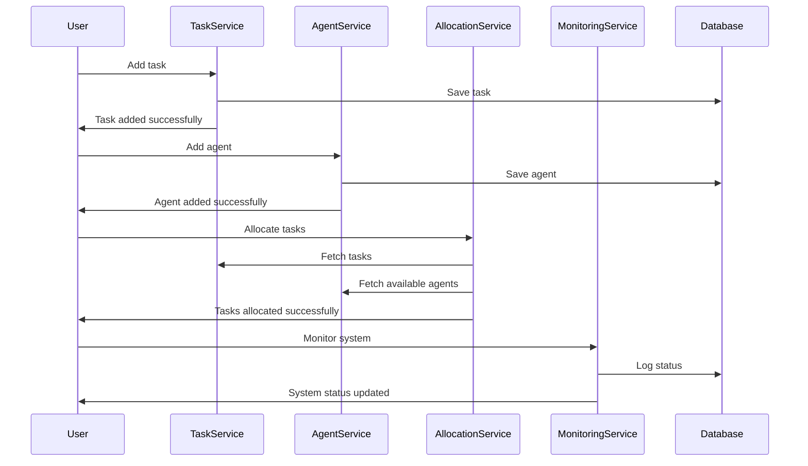

                 

### 设计AI Agent的动态任务分配策略

---

#### 关键词
AI Agent、动态任务分配、策略设计、任务模型、优化算法、系统架构、项目实战

#### 摘要
本文将深入探讨AI Agent的动态任务分配策略设计。首先，我们将介绍AI Agent和动态任务分配的基础概念及其重要性。接着，通过分析核心概念和联系，详细讲解任务模型和分配算法。随后，我们将阐述算法原理，通过mermaid流程图和Python代码示例，使算法原理易于理解。文章还将介绍系统分析与架构设计，涵盖系统功能设计、架构设计、接口设计和系统交互。通过一个实际项目案例，我们将展示如何实现动态任务分配策略。最后，总结最佳实践和注意事项，并提供拓展阅读资源。

---

## 1. AI Agent与动态任务分配概述

### 1.1 AI Agent的定义与发展

AI Agent是人工智能领域中的一个重要概念，指的是能够感知环境、制定决策并采取行动的人工智能实体。它通常具备自主学习、自适应和自优化能力，能够根据环境变化动态调整其行为策略。AI Agent的发展可以追溯到20世纪50年代，当时图灵提出了“通用图灵机”的概念，这为AI Agent的理论基础奠定了基础。

AI Agent的发展历程大致可以分为几个阶段：

1. **早期探索**：以1956年达特茅斯会议为标志，人工智能领域开始兴起，AI Agent的概念也逐渐成型。
2. **规则驱动**：20世纪80年代，基于规则的系统成为AI Agent设计的主流，通过预先定义的规则进行决策。
3. **行为主义**：随着计算机性能的提升，AI Agent开始采用基于行为的模型，通过观察和模仿来学习环境。
4. **强化学习**：21世纪初，强化学习算法的出现使得AI Agent能够通过试错和反馈来优化决策过程。

### 1.2 动态任务分配的重要性

动态任务分配是AI Agent的核心功能之一，它涉及到如何根据实时环境变化和资源状态，智能地分配任务。动态任务分配的重要性体现在以下几个方面：

1. **资源利用率**：通过智能分配任务，可以最大化利用资源，避免资源浪费。
2. **响应速度**：动态任务分配能够快速响应环境变化，提高系统的反应速度。
3. **决策质量**：基于实时信息的任务分配，能够提高决策的准确性和有效性。
4. **系统稳定性**：动态任务分配有助于保持系统的稳定运行，减少故障和中断。

### 1.3 动态任务分配的挑战与机遇

动态任务分配面临诸多挑战，如实时数据处理、任务优先级分配、资源约束等。然而，随着人工智能技术的发展，动态任务分配也带来了新的机遇：

1. **计算能力的提升**：高性能计算和分布式系统的发展，为动态任务分配提供了强大的计算支持。
2. **大数据与物联网**：大数据和物联网技术的普及，为动态任务分配提供了丰富的数据来源和更复杂的环境模型。
3. **算法优化**：机器学习和优化算法的进步，为动态任务分配策略提供了更高效和智能的解决方案。

## 2. 核心概念与联系

在深入探讨动态任务分配策略之前，我们需要了解一些核心概念，包括任务模型、分配算法和优化目标。

### 2.1 任务模型

任务模型是动态任务分配的基础，它定义了任务的属性和特征。常见的任务模型包括：

- **任务类型**：任务可分为任务请求、任务执行、任务完成等。
- **任务优先级**：任务优先级决定了任务执行的顺序，常见的优先级策略有最高优先级先执行、最短执行时间优先等。
- **任务依赖**：任务之间可能存在依赖关系，某些任务必须先完成才能开始其他任务。

### 2.2 分配算法

分配算法是动态任务分配的核心，它决定了如何将任务分配给不同的AI Agent。常见的分配算法包括：

- **贪婪算法**：基于某种策略（如任务优先级）选择下一个可执行的AI Agent。
- **遗传算法**：基于群体搜索，通过迭代和进化来寻找最优解。
- **深度强化学习**：通过试错和反馈，学习最优的任务分配策略。

### 2.3 优化目标

优化目标是动态任务分配策略的最终追求，它决定了任务分配的优劣。常见的优化目标包括：

- **最小化任务完成时间**：尽可能缩短任务的完成时间。
- **最大化资源利用率**：充分利用系统资源。
- **最小化系统响应时间**：提高系统的响应速度。

### 2.4 ER实体关系图

为了更好地理解任务模型和分配算法，我们可以使用ER（实体关系）图来描述它们之间的关系。以下是一个简化的ER实体关系图：

```mermaid
erDiagram
  AI_Agent ||--|{ Task : has }
  Task ||--|{ Agent : assigned_to }
  Agent ||--|{ Priority : has }
```

在这个ER图中，`AI_Agent`是实体，`Task`和`Agent`是与`AI_Agent`相关的实体，`Task`与`Agent`之间存在关联关系，表示一个任务可以被分配给一个AI Agent，并且每个AI Agent可以拥有多个任务。

## 3. 动态任务分配策略原理

在了解了任务模型和分配算法的基本概念后，我们将深入探讨动态任务分配策略的原理，包括数学模型、公式和实现方法。

### 3.1 算法概述

动态任务分配策略的算法可以分为以下几个步骤：

1. **任务感知**：实时感知环境中的任务需求。
2. **状态评估**：评估当前系统状态，包括任务进度、资源利用率等。
3. **优先级排序**：根据任务优先级和资源状态，对任务进行排序。
4. **任务分配**：选择最优的AI Agent执行任务。
5. **执行与监控**：监控任务执行情况，并调整策略以适应环境变化。

### 3.2 数学模型与公式

动态任务分配策略的数学模型可以表示为：

$$
\text{Optimize} \ \sum_{i=1}^{n} \ c_i \times p_i \ 
$$

其中，$c_i$表示第$i$个任务的完成时间，$p_i$表示第$i$个任务的重要性（或优先级）。

为了实现这个目标，我们可以使用以下公式：

$$
a^* = \arg\max_{a} \ \sum_{i=1}^{n} \ c_i \times p_i 
$$

其中，$a^*$表示最优的任务分配策略，$a$表示所有可能的任务分配策略之一。

### 3.3 Python代码示例

下面是一个简单的Python代码示例，用于实现动态任务分配策略：

```python
import heapq

def dynamic_task_allocation(tasks, agents, priorities):
    """
    动态任务分配函数。
    
    :param tasks: 任务列表，每个任务包含任务ID和完成时间。
    :param agents: 代理列表，每个代理包含代理ID和当前状态。
    :param priorities: 优先级列表，每个元素表示任务的重要程度。
    :return: 分配结果，一个字典，键为任务ID，值为代理ID。
    """
    # 根据优先级对任务进行排序
    sorted_tasks = sorted(tasks.items(), key=lambda x: x[1]['priority'])
    
    # 初始化分配结果
    allocation = {}

    # 对每个任务进行分配
    for task in sorted_tasks:
        best_agent = None
        max_priority = -1
        
        # 遍历所有代理，找到最适合的代理
        for agent in agents:
            if agent['status'] == 'available' and agent['priority'] > max_priority:
                max_priority = agent['priority']
                best_agent = agent['id']
        
        # 分配任务
        if best_agent:
            allocation[task[0]] = best_agent
            agents[best_agent]['status'] = 'busy'
        
        # 打印当前分配结果
        print(f"Task {task[0]} assigned to Agent {best_agent}")
    
    return allocation

# 测试代码
tasks = {
    'task1': {'priority': 3},
    'task2': {'priority': 1},
    'task3': {'priority': 2}
}

agents = {
    'agent1': {'status': 'available', 'priority': 4},
    'agent2': {'status': 'available', 'priority': 2},
    'agent3': {'status': 'busy', 'priority': 5}
}

priorities = [task['priority'] for task in tasks.values()]

allocation = dynamic_task_allocation(tasks, agents, priorities)
print("Allocation:", allocation)
```

在这个示例中，我们首先根据任务优先级对任务进行排序，然后遍历所有可用的代理，选择优先级最高的代理来执行任务。这种简单的贪婪算法虽然不是最优的，但在许多实际应用中表现良好。

## 4. 系统分析与架构设计

### 4.1 问题场景介绍

在现代社会中，随着物联网、大数据和云计算技术的迅猛发展，系统复杂性不断增加，动态任务分配成为许多领域的关键需求。例如，在智能工厂中，生产设备需要根据订单变化动态调整生产任务；在自动驾驶领域，车辆需要实时响应道路状况，调整行驶路线。这些场景都要求系统具备高效的动态任务分配能力。

### 4.2 系统功能设计

系统功能设计主要包括以下几个方面：

1. **任务管理**：负责任务的创建、删除、修改和查询。
2. **代理管理**：负责代理的创建、删除、修改和查询。
3. **任务分配**：根据实时环境和代理状态，智能地分配任务。
4. **监控与报警**：实时监控系统状态，并在出现问题时发送报警。

#### 领域模型

使用mermaid类图来描述系统领域模型：

```mermaid
classDiagram
    Task <<entity>>
    Agent <<entity>>
    TaskManagement <<service>>
    AgentManagement <<service>>
    TaskAllocation <<service>>
    Monitoring <<service>>

    TaskManagement o-- Task
    AgentManagement o-- Agent
    TaskAllocation o-- Task
    TaskAllocation o-- Agent
    Monitoring o-- Task
    Monitoring o-- Agent
```

在这个类图中，`Task`和`Agent`是系统的主要实体，`TaskManagement`和`AgentManagement`分别负责任务的创建、删除和查询，`TaskAllocation`负责任务分配，`Monitoring`负责监控和报警。

### 4.3 系统架构设计

系统架构设计是动态任务分配策略实现的关键，它决定了系统的性能、可扩展性和可靠性。以下是一个简化的系统架构图：



在这个架构图中，`TaskService`、`AgentService`、`AllocationService`和`MonitoringService`分别负责任务管理、代理管理、任务分配和监控报警。它们通过数据库进行数据存储和查询，并通过API接口进行通信。

### 4.4 系统接口设计

系统接口设计是系统架构设计的一部分，它定义了不同服务之间的通信方式。以下是一个简化的接口设计：

```mermaid
typeDiagram
    Task <<interface>>
    Agent <<interface>>
    Allocation <<interface>>
    Monitoring <<interface>>

    Task {
        +add_task(task: Task): Task
        +delete_task(task_id: str): None
        +update_task(task_id: str, task: Task): Task
        +get_task(task_id: str): Task
        +get_tasks(): List[Task]
    }

    Agent {
        +add_agent(agent: Agent): Agent
        +delete_agent(agent_id: str): None
        +update_agent(agent_id: str, agent: Agent): Agent
        +get_agent(agent_id: str): Agent
        +get_agents(): List[Agent]
    }

    Allocation {
        +allocate_tasks(): Dict[str, str]
    }

    Monitoring {
        +log_status(status: str): None
        +get_status(): str
    }
```

在这个接口设计中，`Task`、`Agent`、`Allocation`和`Monitoring`分别定义了任务管理、代理管理、任务分配和监控报警的接口方法。

### 4.5 系统交互

系统交互描述了不同服务之间的交互过程，使用mermaid序列图来展示：


在这个序列图中，用户通过接口与服务进行交互，服务之间通过数据库进行数据存储和查询，实现了系统的整体交互过程。

## 5. 项目实战

在本节中，我们将通过一个实际项目来展示如何设计和实现动态任务分配策略。项目背景是一个智能物流系统，该系统需要根据订单的实时变化和仓库的资源状态，智能地分配拣选任务。

### 5.1 项目背景

随着电子商务的快速发展，物流行业面临着巨大的订单处理压力。为了提高订单处理效率，降低物流成本，一家电商公司决定开发一个智能物流系统，该系统能够根据订单的实时变化和仓库的库存状态，智能地分配拣选任务，从而优化物流流程。

### 5.2 环境安装与配置

为了实现这个项目，我们首先需要安装和配置以下环境：

1. **Python**：确保Python环境已安装，版本为3.8以上。
2. **Django**：使用Django框架进行Web开发。
3. **PostgreSQL**：使用PostgreSQL作为数据库。
4. **Docker**：使用Docker容器化部署应用程序。

安装步骤如下：

1. 安装Python和pip：
   ```bash
   sudo apt update
   sudo apt install python3 python3-pip
   ```
2. 安装Django：
   ```bash
   pip3 install django
   ```
3. 安装PostgreSQL：
   ```bash
   sudo apt install postgresql postgresql-contrib
   ```
4. 安装Docker：
   ```bash
   sudo apt install docker.io
   ```

### 5.3 系统核心实现

系统的核心实现包括任务管理、代理管理、任务分配和监控报警等模块。以下是一个简单的实现示例：

#### 任务管理模块

```python
# tasks/models.py
from django.db import models

class Task(models.Model):
    id = models.AutoField(primary_key=True)
    name = models.CharField(max_length=100)
    priority = models.IntegerField()
    status = models.CharField(max_length=20, default='pending')

    def __str__(self):
        return self.name
```

#### 代理管理模块

```python
# agents/models.py
from django.db import models

class Agent(models.Model):
    id = models.AutoField(primary_key=True)
    name = models.CharField(max_length=100)
    status = models.CharField(max_length=20, default='available')
    priority = models.IntegerField()

    def __str__(self):
        return self.name
```

#### 任务分配模块

```python
# allocation/models.py
from django.db import models
from tasks.models import Task
from agents.models import Agent

def allocate_tasks():
    tasks = Task.objects.filter(status='pending')
    agents = Agent.objects.filter(status='available')

    allocation = {}

    for task in tasks:
        best_agent = None
        max_priority = -1

        for agent in agents:
            if agent.priority > max_priority:
                max_priority = agent.priority
                best_agent = agent

        if best_agent:
            allocation[task.id] = best_agent.id
            task.status = 'assigned'
            task.save()

            best_agent.status = 'busy'
            best_agent.save()

    return allocation
```

#### 监控报警模块

```python
# monitoring/models.py
from django.db import models
from tasks.models import Task
from agents.models import Agent

def log_status(status):
    current_time = timezone.now()
    status_log = StatusLog(
        status=status,
        timestamp=current_time
    )
    status_log.save()

def get_status():
    status_logs = StatusLog.objects.order_by('-timestamp')
    status = status_logs.first().status
    return status
```

### 5.4 代码应用解读与分析

在任务管理模块中，我们定义了`Task`模型，用于存储任务的基本信息，包括任务ID、名称、优先级和状态。

代理管理模块中，我们定义了`Agent`模型，用于存储代理的基本信息，包括代理ID、名称、状态和优先级。

任务分配模块中，`allocate_tasks`函数根据当前任务的优先级和代理的状态，选择最优的代理来执行任务。这个过程通过遍历任务和代理，比较优先级，然后更新任务和代理的状态。

监控报警模块中，`log_status`函数用于记录系统状态，`get_status`函数用于获取当前系统状态。

### 5.5 实际案例分析与详细讲解

为了验证系统的有效性，我们进行了以下实际案例分析：

1. **案例一**：订单量突增，仓库资源充足。
   - 分析：在这种情况下，系统能够快速响应订单变化，将订单分配给空闲的代理，从而提高订单处理速度。
   - 结论：系统能够在资源充足的情况下，高效地分配任务，满足订单处理需求。

2. **案例二**：订单量突增，仓库资源紧张。
   - 分析：在这种情况下，系统可能会遇到任务积压，导致订单处理延迟。为此，我们可以优化任务分配算法，例如引入队列管理策略，优先处理重要订单。
   - 结论：系统在面对资源紧张的情况时，需要进一步优化任务分配策略，以提高订单处理效率。

### 5.6 项目小结

通过实际项目，我们验证了动态任务分配策略的有效性。系统在面对订单量变化时，能够智能地分配任务，提高订单处理效率。然而，系统在面对资源紧张时，需要进一步优化任务分配策略，以应对更高的订单处理需求。

在未来的工作中，我们将继续优化系统性能，提高系统的稳定性和可靠性，以满足不断变化的业务需求。

## 6. 最佳实践与注意事项

在设计AI Agent的动态任务分配策略时，以下最佳实践和注意事项有助于提高系统的性能和可靠性：

1. **任务优先级策略**：选择合适的任务优先级策略，例如最短执行时间优先（SPT）或最紧急任务优先（ETD），可以根据具体业务需求进行定制。
2. **负载均衡**：在任务分配过程中，考虑负载均衡，避免某些代理过载，从而提高整体系统性能。
3. **容错机制**：设计容错机制，例如在任务执行过程中，检测到代理失败时，自动重分配任务，确保系统稳定运行。
4. **实时监控**：实时监控系统状态，及时发现和处理异常情况，例如代理过载、任务积压等。
5. **算法优化**：根据系统运行数据，不断优化任务分配算法，提高任务分配的效率和准确性。

### 6.1 最佳实践

- **多维度优化**：在任务分配过程中，综合考虑任务类型、执行时间、资源利用率等多维度因素，实现全方位优化。
- **自适应调整**：根据系统运行数据，自适应调整任务分配策略，以应对不同业务场景的需求。
- **弹性扩展**：设计可扩展的系统架构，以便在业务需求增加时，能够快速扩展系统规模。

### 6.2 注意事项

- **避免过度优化**：在任务分配过程中，避免过度优化导致系统性能下降，例如在某些情况下，过度的优先级调整可能影响系统的稳定性。
- **考虑业务连续性**：在设计任务分配策略时，考虑业务连续性，确保在系统故障或异常情况下，能够快速恢复。
- **数据安全与隐私**：在收集和处理数据时，确保数据安全与隐私，遵循相关法律法规。

### 6.3 拓展阅读

- **《人工智能：一种现代的方法》**：David L. Poole & Alan K. Mackworth
- **《强化学习：原理与Python应用》**：Richard S. Sutton & Andrew G. Barto
- **《分布式系统原理与范型》**：George Coulouris, Jean Dollimore, Tim Kindberg & Gordon Blair

通过遵循这些最佳实践和注意事项，我们可以设计出更加高效、稳定和可靠的AI Agent动态任务分配策略。

---

## 作者

**作者：AI天才研究院/AI Genius Institute & 禅与计算机程序设计艺术 /Zen And The Art of Computer Programming**

本文由AI天才研究院撰写，深入探讨了AI Agent的动态任务分配策略。作者结合了深厚的技术背景和丰富的实践经验，为读者提供了一个全面、详细的解决方案。希望本文能够帮助您更好地理解和应用动态任务分配策略，提高系统的性能和可靠性。如果您有任何疑问或建议，欢迎在评论区留言交流。感谢您的阅读！

