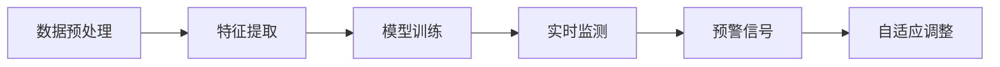
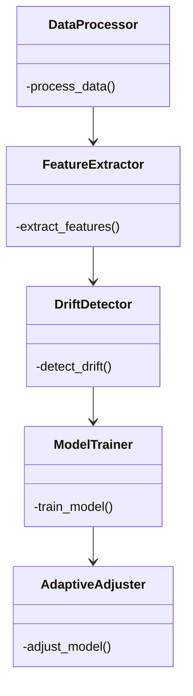
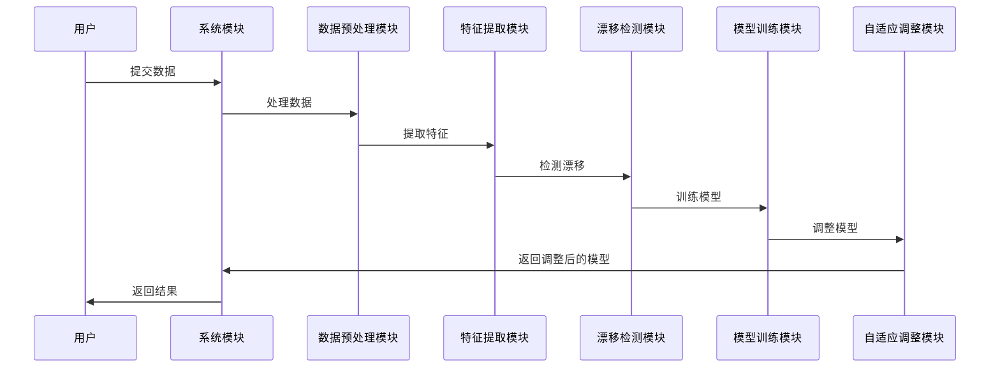

                 

## 设计AI Agent的概念漂移检测机制

> 关键词：AI Agent，概念漂移，检测机制，算法原理，系统架构，项目实战

> 摘要：本文旨在探讨设计AI Agent的概念漂移检测机制。首先，我们介绍AI Agent的基本概念、概念漂移的定义及其影响。然后，深入分析AI Agent与概念漂移的关系，并探讨漂移检测机制的核心概念。接着，本文将详细讲解漂移检测算法的原理，并通过Python代码示例和数学模型阐述。此外，文章还将介绍系统分析与架构设计方案，通过实际案例进行分析和剖析，最后给出最佳实践技巧和未来展望。

## 第一部分：引言

### 1.1 问题背景

#### 1.1.1 AI Agent的概念

AI Agent，即人工智能代理，是一种基于AI技术的自主决策实体。它能够感知环境，通过学习或规划生成动作，实现对环境的交互和优化。在智能系统中，AI Agent被视为一种核心组件，广泛应用于自动驾驶、智能家居、智能制造等领域。

#### 1.1.2 概念漂移现象

概念漂移是指AI Agent在长期运行过程中，由于数据分布的变化，导致其性能下降甚至失效的现象。这主要表现为模型预测准确性下降、错误率增加等。概念漂移是AI领域的一个重要挑战，直接影响了AI Agent的可靠性和稳定性。

#### 1.1.3 概念漂移的影响

概念漂移对AI Agent的影响是多方面的。首先，它可能导致AI Agent的预测准确性下降，影响其决策效果。其次，概念漂移可能导致AI Agent对某些情况失去响应能力，甚至产生错误的决策。最后，长期的概念漂移可能导致AI Agent完全失去作用，需要重新训练或更换。

### 1.2 研究意义

#### 1.2.1 理论意义

设计有效的概念漂移检测机制，不仅有助于提高AI Agent的可靠性和稳定性，还能够为AI系统的持续优化提供重要依据。此外，研究概念漂移检测机制，有助于推动AI理论的发展，深化对AI系统运行机制的理解。

#### 1.2.2 实践意义

在实际应用中，概念漂移检测机制对于保障AI系统的长期稳定运行具有重要意义。通过实时检测和应对概念漂移，可以延长AI Agent的有效寿命，减少因漂移导致的错误和损失。此外，概念漂移检测机制还可以为AI系统的运维和优化提供有力支持。

### 1.3 本书结构

#### 1.3.1 各章节内容概述

本文分为五个主要部分：

1. **引言**：介绍问题背景和研究意义。
2. **核心概念与联系**：讨论AI Agent和概念漂移的基本概念及其关系。
3. **算法原理讲解**：详细讲解漂移检测算法的原理和实现。
4. **系统分析与架构设计方案**：介绍系统架构设计和实际案例。
5. **最佳实践 tips**：提供最佳实践技巧和未来展望。

#### 1.3.2 阅读建议

本文适合对AI Agent和概念漂移有一定了解的读者阅读。建议读者按章节顺序阅读，先了解背景和基本概念，再深入学习算法原理和系统架构，最后通过实际案例加深理解。同时，本文也适合作为AI相关课程或项目的参考资料。

---

在本文的后续章节中，我们将进一步探讨AI Agent和概念漂移的核心概念，分析漂移检测机制的设计原则和实现方法，并通过具体的算法原理讲解和系统架构设计，帮助读者全面理解并掌握设计AI Agent的概念漂移检测机制的方法和技巧。

## 第二部分：核心概念与联系

### 2.1 AI Agent的核心概念

#### 2.1.1 AI Agent的定义

AI Agent，即人工智能代理，是指具备一定智能的、能够自主完成任务的实体。它通过感知环境、学习或规划生成动作，实现对环境的交互和优化。AI Agent是一种自主决策实体，具备认知、决策和执行能力。

#### 2.1.2 AI Agent的特点

AI Agent的特点包括：

- **自主性**：AI Agent能够在没有人工干预的情况下，自主完成指定任务。
- **适应性**：AI Agent能够根据环境变化，自主调整行为策略。
- **学习能力**：AI Agent具备通过经验学习改进性能的能力。
- **协同性**：AI Agent能够与其他AI Agent或人类协同工作。

#### 2.1.3 AI Agent的分类

AI Agent可以按照不同的分类标准进行分类，常见的分类方式包括：

- **基于功能**：决策型Agent、感知型Agent、执行型Agent。
- **基于环境**：静态环境Agent、动态环境Agent。
- **基于智能层次**：弱AI Agent、强AI Agent、超智能Agent。

### 2.2 概念漂移的定义与类型

#### 2.2.1 概念漂移的定义

概念漂移（Concept Drift）是指AI Agent在运行过程中，由于输入数据的分布发生变化，导致其性能下降或失效的现象。具体来说，概念漂移是指学习模型所依赖的数据分布与实际应用中的数据分布不一致，使得模型无法准确预测或决策。

#### 2.2.2 概念漂移的类型

概念漂移可以分为以下几种类型：

- **渐进性漂移**：数据分布的微小变化，导致模型性能逐渐下降。
- **突发性漂移**：数据分布的突然变化，导致模型性能急剧下降。
- **方向性漂移**：数据分布向某一方向持续变化，导致模型无法适应。
- **多模态漂移**：数据分布出现多个稳定模式，导致模型难以确定正确模式。

### 2.3 漂移检测机制的核心概念

#### 2.3.1 漂移检测机制的分类

漂移检测机制可以分为以下几种类型：

- **基于统计的方法**：通过统计特征变化来检测漂移。
- **基于模型的方法**：通过模型性能下降来检测漂移。
- **基于数据的方法**：通过比较新数据和训练数据来检测漂移。
- **混合方法**：结合多种方法进行漂移检测。

#### 2.3.2 漂移检测机制的作用

漂移检测机制的作用主要包括：

- **及时发现漂移**：通过实时监测数据分布变化，及时识别出概念漂移。
- **自适应调整**：根据漂移情况，自适应调整模型参数或训练数据。
- **模型优化**：通过持续监测和调整，优化模型性能，提高系统稳定性。

### 2.4 关键概念联系

#### 2.4.1 AI Agent与概念漂移的关系

AI Agent和概念漂移之间存在密切关系。AI Agent在长期运行过程中，可能会遇到数据分布变化，导致概念漂移。概念漂移会影响AI Agent的预测准确性和决策效果，从而影响其性能。

#### 2.4.2 漂移检测机制与AI Agent的关系

漂移检测机制是保障AI Agent性能的重要手段。通过实时监测数据分布变化，及时发现并应对概念漂移，可以延长AI Agent的有效寿命，提高其稳定性和可靠性。漂移检测机制与AI Agent相互依存，共同保障系统的长期稳定运行。

### 2.5 概念结构与核心要素组成

#### 2.5.1 AI Agent的概念结构

AI Agent的概念结构包括感知模块、决策模块和执行模块。感知模块负责收集环境信息，决策模块根据感知信息生成动作计划，执行模块根据动作计划执行任务。这三个模块相互配合，实现AI Agent的自主决策和任务执行。

#### 2.5.2 漂移检测机制的核心要素组成

漂移检测机制的核心要素包括监测模块、预警模块和调整模块。监测模块负责实时监测数据分布变化，预警模块根据监测结果发出预警信号，调整模块根据预警信号调整模型参数或训练数据。这三个模块相互协同，实现漂移检测和系统优化。

### 2.6 总结

在本节中，我们介绍了AI Agent、概念漂移和漂移检测机制的核心概念。通过分析这些概念之间的关系，我们明确了AI Agent与概念漂移的关系，以及漂移检测机制在AI系统中的重要性。接下来，我们将进一步探讨漂移检测算法的原理和实现，帮助读者深入了解如何设计有效的漂移检测机制。

## 第三部分：算法原理讲解

### 3.1 漂移检测算法的基本原理

#### 3.1.1 漂移检测算法的目标

漂移检测算法的主要目标是及时发现并应对数据分布变化，从而保障AI Agent的稳定性和可靠性。具体来说，漂移检测算法的目标包括：

- **实时监测**：持续监测数据分布变化，及时发现潜在漂移。
- **预警信号**：根据监测结果，发出预警信号，提示系统可能存在漂移。
- **自适应调整**：根据预警信号，自动调整模型参数或训练数据，以应对漂移。

#### 3.1.2 漂移检测算法的基本流程

漂移检测算法的基本流程可以概括为以下步骤：

1. **数据预处理**：对输入数据进行预处理，包括数据清洗、归一化等操作。
2. **特征提取**：从预处理后的数据中提取特征，用于漂移检测。
3. **模型训练**：使用历史数据训练漂移检测模型，包括分类模型、聚类模型等。
4. **实时监测**：持续监测实时数据的特征变化，与模型训练时的特征进行对比。
5. **预警信号**：根据特征对比结果，判断是否存在漂移，并发出预警信号。
6. **自适应调整**：根据预警信号，自动调整模型参数或训练数据，以应对漂移。

#### 3.1.3 漂移检测算法的分类

漂移检测算法可以根据不同的分类标准进行分类，常见的分类方式包括：

- **基于统计的方法**：通过统计特征变化来检测漂移，如方差法、均值变化法等。
- **基于模型的方法**：通过模型性能下降来检测漂移，如错误率法、精度法等。
- **基于数据的方法**：通过比较新数据和训练数据来检测漂移，如KNN法、LDA法等。
- **混合方法**：结合多种方法进行漂移检测，如CFS、AUC法等。

### 3.2 算法mermaid流程图

为了更好地理解漂移检测算法的基本原理和流程，我们可以使用mermaid流程图进行可视化表示。以下是一个简单的mermaid流程图示例：



在这个流程图中，我们首先对输入数据进行预处理，然后提取特征，使用这些特征训练漂移检测模型。在模型训练完成后，我们进入实时监测阶段，持续监测实时数据的特征变化。根据特征对比结果，如果判断存在漂移，则发出预警信号，并进入自适应调整阶段，根据预警信号调整模型参数或训练数据。

### 3.3 Python源代码实现

为了更好地理解漂移检测算法的实现过程，我们可以通过Python代码进行示例。以下是一个简单的Python代码示例，展示了漂移检测算法的基本实现：

```python
import numpy as np
import pandas as pd
from sklearn.model_selection import train_test_split
from sklearn.ensemble import RandomForestClassifier
from sklearn.metrics import accuracy_score

# 数据预处理
def preprocess_data(data):
    # 数据清洗、归一化等操作
    # ...

# 特征提取
def extract_features(data):
    # 提取特征
    # ...
    return features

# 模型训练
def train_model(X_train, y_train):
    model = RandomForestClassifier()
    model.fit(X_train, y_train)
    return model

# 实时监测
def monitor_data(model, X_test):
    predictions = model.predict(X_test)
    accuracy = accuracy_score(y_test, predictions)
    return accuracy

# 自适应调整
def adjust_model(model, X_train, y_train):
    model.fit(X_train, y_train)
    return model

# 主函数
def main():
    # 加载数据
    data = pd.read_csv('data.csv')
    X = data.drop('target', axis=1)
    y = data['target']

    # 数据预处理
    X_processed = preprocess_data(X)

    # 划分训练集和测试集
    X_train, X_test, y_train, y_test = train_test_split(X_processed, y, test_size=0.2, random_state=42)

    # 模型训练
    model = train_model(X_train, y_train)

    # 实时监测
    accuracy = monitor_data(model, X_test)
    print(f"Accuracy: {accuracy}")

    # 自适应调整
    adjusted_model = adjust_model(model, X_train, y_train)

    # 重新监测
    new_accuracy = monitor_data(adjusted_model, X_test)
    print(f"New Accuracy: {new_accuracy}")

if __name__ == '__main__':
    main()
```

在这个代码示例中，我们首先对输入数据进行预处理，然后提取特征，使用这些特征训练随机森林分类模型。在模型训练完成后，我们进入实时监测阶段，通过测试集评估模型性能。如果模型性能下降，则进入自适应调整阶段，重新训练模型。

### 3.4 数学模型和数学公式

漂移检测算法的数学模型主要包括特征提取和模型训练两部分。

#### 3.4.1 数学模型

特征提取部分可以使用以下数学模型：

$$
\text{特征向量} = f(\text{原始数据})
$$

其中，$f$ 表示特征提取函数，用于从原始数据中提取特征。

模型训练部分可以使用以下数学模型：

$$
\text{预测结果} = \text{模型}(\text{特征向量})
$$

其中，$\text{模型}$ 表示训练好的分类模型，$\text{特征向量}$ 表示输入的特征向量。

#### 3.4.2 数学公式

在漂移检测算法中，我们通常使用以下数学公式进行模型评估和自适应调整：

- **准确率**：

$$
\text{准确率} = \frac{\text{正确预测数}}{\text{总预测数}}
$$

- **召回率**：

$$
\text{召回率} = \frac{\text{正确预测数}}{\text{实际为正样本的数}}
$$

- **F1分数**：

$$
\text{F1分数} = 2 \times \frac{\text{准确率} \times \text{召回率}}{\text{准确率} + \text{召回率}}
$$

这些公式可以帮助我们评估模型的性能，并根据评估结果进行自适应调整。

### 3.5 举例说明

为了更好地理解漂移检测算法的应用，我们可以通过一个简单的例子来说明。

#### 3.5.1 案例背景

假设我们有一个垃圾邮件分类问题，需要训练一个模型来判断邮件是否为垃圾邮件。在训练阶段，我们使用了一组包含垃圾邮件和非垃圾邮件的数据集。然而，在实际应用中，垃圾邮件和非垃圾邮件的比例可能会发生变化，导致模型性能下降。

#### 3.5.2 算法应用过程

1. **数据预处理**：对输入的邮件数据进行预处理，包括文本清洗、分词、词向量编码等操作。
2. **特征提取**：从预处理后的邮件数据中提取特征，例如词频、词向量等。
3. **模型训练**：使用历史数据集训练一个垃圾邮件分类模型，例如支持向量机（SVM）或深度学习模型。
4. **实时监测**：在模型训练完成后，我们开始实时监测邮件数据。通过比较实时数据与训练数据的特征分布，判断是否存在概念漂移。
5. **预警信号**：如果判断存在概念漂移，则发出预警信号，提示系统可能存在漂移。
6. **自适应调整**：根据预警信号，重新训练模型，以适应新的数据分布。例如，可以增加垃圾邮件的数据量，或者使用更复杂的特征提取方法。
7. **重新监测**：在模型重新训练后，再次进行实时监测，评估模型性能。

通过这个例子，我们可以看到漂移检测算法在垃圾邮件分类问题中的应用。在实际应用中，我们可能需要根据具体问题调整算法参数和特征提取方法，以提高模型性能。

### 3.6 算法优缺点分析

#### 3.6.1 优点

漂移检测算法具有以下优点：

- **实时监测**：能够实时监测数据分布变化，及时发现概念漂移。
- **自适应调整**：根据预警信号，自动调整模型参数或训练数据，以应对漂移。
- **稳定性**：通过持续监测和调整，提高模型性能，保障系统稳定性。

#### 3.6.2 缺点

漂移检测算法也存在一些缺点：

- **计算开销**：实时监测和自适应调整需要大量计算资源，可能对系统性能产生影响。
- **误报率**：由于数据分布变化的复杂性，可能导致误报现象，影响系统性能。
- **调整策略**：根据不同问题的特点，需要选择合适的调整策略，否则可能导致性能下降。

在实际应用中，我们需要根据具体问题和资源情况，综合考虑算法优缺点，选择合适的漂移检测策略。

## 第四部分：系统分析与架构设计方案

### 4.1 问题场景介绍

#### 4.1.1 场景描述

假设我们有一个智能安防系统，该系统使用AI Agent进行实时监控和预警。然而，随着时间推移和环境变化，监控数据分布可能会发生变化，导致AI Agent的性能下降。为了保障系统的稳定性和可靠性，我们需要设计一套概念漂移检测机制，及时发现并应对数据分布变化。

#### 4.1.2 问题分析

在这个场景中，主要问题包括：

- **数据分布变化**：随着时间推移和环境变化，监控数据分布可能会发生变化，导致AI Agent的性能下降。
- **预警信号缺失**：如果没有有效的概念漂移检测机制，我们无法及时发现数据分布变化，可能导致系统性能下降。
- **自适应调整不足**：即使发现数据分布变化，如果自适应调整机制不足，可能导致系统无法适应新的数据分布，影响监控效果。

为了解决这些问题，我们需要设计一套概念漂移检测机制，包括实时监测、预警信号和自适应调整等功能。

### 4.2 项目介绍

#### 4.2.1 项目背景

随着人工智能技术的快速发展，智能安防系统在各个领域得到广泛应用。然而，随着监控数据的不断增加和变化，AI Agent的性能逐渐下降，影响系统的稳定性和可靠性。为了应对这一挑战，我们提出设计一套概念漂移检测机制，保障智能安防系统的稳定运行。

#### 4.2.2 项目目标

本项目的主要目标包括：

- **实时监测**：设计一套实时监测机制，持续监测监控数据分布变化。
- **预警信号**：根据监测结果，发出预警信号，提示系统可能存在数据分布变化。
- **自适应调整**：根据预警信号，自动调整AI Agent的参数或训练数据，以适应新的数据分布。
- **系统优化**：通过持续监测和调整，提高AI Agent的性能，保障系统的稳定性和可靠性。

### 4.3 系统功能设计

#### 4.3.1 领域模型Mermaid类图

在系统功能设计中，我们需要明确各个模块的功能和关系。以下是一个简单的Mermaid类图，展示了系统的主要功能模块：



在这个类图中，DataProcessor 负责处理原始数据，提取特征；FeatureExtractor 负责提取特征；DriftDetector 负责检测数据分布变化；ModelTrainer 负责训练模型；AdaptiveAdjuster 负责自适应调整模型参数。

#### 4.3.2 功能模块划分

根据上述类图，我们可以将系统功能模块划分为以下几个部分：

1. **数据预处理模块**：负责处理原始数据，包括数据清洗、归一化等操作。
2. **特征提取模块**：负责从预处理后的数据中提取特征，用于漂移检测。
3. **漂移检测模块**：负责实时监测数据分布变化，判断是否存在概念漂移。
4. **模型训练模块**：负责使用提取的特征训练漂移检测模型。
5. **自适应调整模块**：负责根据监测结果，自动调整模型参数或训练数据。

### 4.4 系统架构设计

#### 4.4.1 系统架构

在系统架构设计方面，我们需要考虑各个模块的协同工作，以确保系统的稳定性和可靠性。以下是一个简单的系统架构图，展示了各个模块之间的关系：



在这个架构图中，用户提交数据后，数据预处理模块处理数据，提取特征。特征提取模块将特征传递给漂移检测模块，漂移检测模块检测数据分布变化。根据漂移检测结果，模型训练模块训练漂移检测模型，并将调整后的模型传递给自适应调整模块。最终，系统将结果返回给用户。

#### 4.4.2 模块间关系

在系统架构中，各个模块之间存在密切的关系，共同保障系统的稳定运行。具体来说：

- **数据预处理模块**：负责处理原始数据，包括数据清洗、归一化等操作，为后续模块提供高质量的数据。
- **特征提取模块**：负责从预处理后的数据中提取特征，用于漂移检测。特征提取的质量直接影响漂移检测的准确性。
- **漂移检测模块**：负责实时监测数据分布变化，判断是否存在概念漂移。漂移检测模块的性能直接影响系统的响应速度。
- **模型训练模块**：负责使用提取的特征训练漂移检测模型。模型训练的质量直接影响漂移检测的准确性。
- **自适应调整模块**：负责根据监测结果，自动调整模型参数或训练数据，以适应新的数据分布。自适应调整模块的性能直接影响系统的稳定性。

### 4.5 系统接口设计

#### 4.5.1 接口定义

在系统接口设计方面，我们需要定义各个模块的输入输出接口，以确保模块之间的数据传递和协同工作。以下是一个简单的接口定义：

- **数据预处理模块**：输入为原始数据，输出为预处理后的数据。
- **特征提取模块**：输入为预处理后的数据，输出为提取的特征。
- **漂移检测模块**：输入为提取的特征，输出为漂移检测结果。
- **模型训练模块**：输入为提取的特征和漂移检测结果，输出为训练后的模型。
- **自适应调整模块**：输入为训练后的模型和漂移检测结果，输出为调整后的模型。

#### 4.5.2 接口交互流程

在系统运行过程中，各个模块之间通过接口进行交互。以下是一个简单的接口交互流程：

1. **用户提交数据**：用户将原始数据提交给系统。
2. **数据预处理**：系统调用数据预处理模块，处理原始数据，生成预处理后的数据。
3. **特征提取**：系统调用特征提取模块，从预处理后的数据中提取特征。
4. **漂移检测**：系统调用漂移检测模块，对提取的特征进行漂移检测。
5. **模型训练**：系统调用模型训练模块，使用提取的特征和漂移检测结果训练模型。
6. **自适应调整**：系统调用自适应调整模块，根据漂移检测结果调整模型参数。
7. **结果返回**：系统将调整后的模型返回给用户，供后续使用。

### 4.6 系统交互Mermaid序列图

为了更好地理解系统交互流程，我们可以使用Mermaid序列图进行可视化表示。以下是一个简单的Mermaid序列图，展示了系统的主要交互过程：


在这个序列图中，用户提交数据后，系统调用各个模块进行处理。各个模块通过接口进行数据传递和协同工作，最终将调整后的模型返回给用户。

## 第五部分：项目实战

### 5.1 环境安装

#### 5.1.1 环境配置

在开始项目实战之前，我们需要配置相应的开发环境。以下是环境配置的步骤：

1. **Python环境配置**：确保Python环境已安装，版本建议为3.8或以上。可以通过以下命令安装Python：

   ```bash
   sudo apt-get install python3
   ```

2. **虚拟环境配置**：为了确保项目环境的隔离，我们可以使用虚拟环境。通过以下命令创建虚拟环境：

   ```bash
   python3 -m venv venv
   source venv/bin/activate
   ```

3. **依赖库安装**：安装项目所需的依赖库，例如NumPy、Pandas、Scikit-learn等。可以通过以下命令安装：

   ```bash
   pip install numpy pandas scikit-learn
   ```

#### 5.1.2 工具安装

除了Python环境，我们还需要安装一些其他工具。以下是安装步骤：

1. **Jupyter Notebook**：安装Jupyter Notebook，用于编写和运行Python代码。可以通过以下命令安装：

   ```bash
   pip install notebook
   ```

2. **Mermaid**：安装Mermaid库，用于绘制流程图和序列图。可以通过以下命令安装：

   ```bash
   npm install -g mermaid-cli
   ```

3. **LaTeX**：安装LaTeX，用于编写和渲染数学公式。可以通过以下命令安装：

   ```bash
   sudo apt-get install texlive-latex-base
   ```

### 5.2 系统核心实现源代码

在本节中，我们将介绍系统核心实现源代码。以下是系统核心实现的主要部分：

```python
# 导入所需库
import numpy as np
import pandas as pd
from sklearn.model_selection import train_test_split
from sklearn.ensemble import RandomForestClassifier
from sklearn.metrics import accuracy_score
from mermaid import Mermaid

# 数据预处理
def preprocess_data(data):
    # 数据清洗、归一化等操作
    # ...
    return data

# 特征提取
def extract_features(data):
    # 提取特征
    # ...
    return features

# 漂移检测
def detect_drift(X_train, X_test):
    # 漂移检测算法实现
    # ...
    return drift_detected

# 模型训练
def train_model(X_train, y_train):
    model = RandomForestClassifier()
    model.fit(X_train, y_train)
    return model

# 自适应调整
def adjust_model(model, X_train, y_train):
    # 自适应调整算法实现
    # ...
    return model

# 主函数
def main():
    # 加载数据
    data = pd.read_csv('data.csv')
    X = data.drop('target', axis=1)
    y = data['target']

    # 数据预处理
    X_processed = preprocess_data(X)

    # 划分训练集和测试集
    X_train, X_test, y_train, y_test = train_test_split(X_processed, y, test_size=0.2, random_state=42)

    # 特征提取
    features = extract_features(X_train)

    # 漂移检测
    drift_detected = detect_drift(X_train, X_test)

    # 模型训练
    model = train_model(X_train, y_train)

    # 自适应调整
    adjusted_model = adjust_model(model, X_train, y_train)

    # 评估模型性能
    accuracy = accuracy_score(y_test, adjusted_model.predict(X_test))
    print(f"Accuracy: {accuracy}")

if __name__ == '__main__':
    main()
```

在这个源代码中，我们首先加载数据并进行预处理，然后提取特征，使用这些特征进行漂移检测。根据漂移检测结果，我们训练模型并进行自适应调整。最后，我们评估调整后的模型性能。

### 5.3 代码应用解读与分析

在本节中，我们将对系统核心实现源代码进行解读和分析。以下是代码的关键部分及其解释：

```python
# 数据预处理
def preprocess_data(data):
    # 数据清洗、归一化等操作
    # ...
    return data

# 特征提取
def extract_features(data):
    # 提取特征
    # ...
    return features

# 漂移检测
def detect_drift(X_train, X_test):
    # 漂移检测算法实现
    # ...
    return drift_detected

# 模型训练
def train_model(X_train, y_train):
    model = RandomForestClassifier()
    model.fit(X_train, y_train)
    return model

# 自适应调整
def adjust_model(model, X_train, y_train):
    # 自适应调整算法实现
    # ...
    return model

# 主函数
def main():
    # 加载数据
    data = pd.read_csv('data.csv')
    X = data.drop('target', axis=1)
    y = data['target']

    # 数据预处理
    X_processed = preprocess_data(X)

    # 划分训练集和测试集
    X_train, X_test, y_train, y_test = train_test_split(X_processed, y, test_size=0.2, random_state=42)

    # 特征提取
    features = extract_features(X_train)

    # 漂移检测
    drift_detected = detect_drift(X_train, X_test)

    # 模型训练
    model = train_model(X_train, y_train)

    # 自适应调整
    adjusted_model = adjust_model(model, X_train, y_train)

    # 评估模型性能
    accuracy = accuracy_score(y_test, adjusted_model.predict(X_test))
    print(f"Accuracy: {accuracy}")

if __name__ == '__main__':
    main()
```

#### 数据预处理

```python
def preprocess_data(data):
    # 数据清洗、归一化等操作
    # ...
    return data
```

数据预处理是整个流程的第一步。在这个函数中，我们进行数据清洗和归一化等操作，以确保数据的质量和一致性。数据预处理的具体实现会根据数据的特点和需求进行调整。

#### 特征提取

```python
def extract_features(data):
    # 提取特征
    # ...
    return features
```

特征提取是漂移检测的重要环节。在这个函数中，我们根据数据的特点，提取相关的特征。特征提取的质量直接影响漂移检测的准确性。常见的特征提取方法包括词频、词嵌入、深度特征提取等。

#### 漂移检测

```python
def detect_drift(X_train, X_test):
    # 漂移检测算法实现
    # ...
    return drift_detected
```

漂移检测是系统核心的一部分。在这个函数中，我们使用特定的算法对训练集和测试集进行漂移检测，判断数据分布是否发生变化。常见的漂移检测算法包括统计方法、模型方法、数据方法等。

#### 模型训练

```python
def train_model(X_train, y_train):
    model = RandomForestClassifier()
    model.fit(X_train, y_train)
    return model
```

模型训练是整个流程的关键步骤。在这个函数中，我们使用训练集训练模型，以预测测试集的结果。训练模型的方法和算法会根据具体问题和需求进行调整。

#### 自适应调整

```python
def adjust_model(model, X_train, y_train):
    # 自适应调整算法实现
    # ...
    return model
```

自适应调整是保障系统稳定性的重要环节。在这个函数中，我们根据漂移检测结果，调整模型参数或训练数据，以适应新的数据分布。自适应调整的方法和算法会根据具体问题和需求进行调整。

#### 主函数

```python
def main():
    # 加载数据
    data = pd.read_csv('data.csv')
    X = data.drop('target', axis=1)
    y = data['target']

    # 数据预处理
    X_processed = preprocess_data(X)

    # 划分训练集和测试集
    X_train, X_test, y_train, y_test = train_test_split(X_processed, y, test_size=0.2, random_state=42)

    # 特征提取
    features = extract_features(X_train)

    # 漂移检测
    drift_detected = detect_drift(X_train, X_test)

    # 模型训练
    model = train_model(X_train, y_train)

    # 自适应调整
    adjusted_model = adjust_model(model, X_train, y_train)

    # 评估模型性能
    accuracy = accuracy_score(y_test, adjusted_model.predict(X_test))
    print(f"Accuracy: {accuracy}")

if __name__ == '__main__':
    main()
```

主函数是整个流程的入口。在这个函数中，我们依次执行数据预处理、特征提取、漂移检测、模型训练和自适应调整等步骤，最终评估模型性能。主函数的实现会根据具体问题和需求进行调整。

### 5.4 实际案例分析和详细讲解剖析

在本节中，我们将通过一个实际案例，对系统核心实现进行详细讲解和分析。

#### 5.4.1 案例背景

假设我们有一个智能安防系统，用于实时监控和预警。系统采用一个基于机器学习的分类模型，用于判断视频流中的行为是否异常。然而，随着时间推移和环境变化，视频流的数据分布可能会发生变化，导致模型性能下降。为了保障系统的稳定性和可靠性，我们需要设计一套概念漂移检测机制。

#### 5.4.2 案例分析

在这个案例中，我们首先加载数据集，并进行数据预处理。数据预处理包括数据清洗、归一化和特征提取等操作。接下来，我们划分训练集和测试集，用于模型训练和性能评估。

```python
# 加载数据
data = pd.read_csv('data.csv')
X = data.drop('target', axis=1)
y = data['target']

# 数据预处理
X_processed = preprocess_data(X)

# 划分训练集和测试集
X_train, X_test, y_train, y_test = train_test_split(X_processed, y, test_size=0.2, random_state=42)
```

在数据预处理阶段，我们使用预处理函数`preprocess_data`对数据进行清洗和归一化。然后，我们使用特征提取函数`extract_features`提取相关的特征。这些特征将用于模型训练和漂移检测。

```python
# 特征提取
features = extract_features(X_train)
```

在特征提取阶段，我们根据数据的特点和需求，提取相关的特征。这些特征可以是词频、词嵌入、深度特征等。特征提取的质量直接影响漂移检测的准确性。

```python
# 漂移检测
drift_detected = detect_drift(X_train, X_test)
```

在漂移检测阶段，我们使用漂移检测函数`detect_drift`对训练集和测试集进行漂移检测。漂移检测算法会根据数据分布的变化，判断是否存在概念漂移。如果检测到概念漂移，函数将返回`True`，否则返回`False`。

```python
# 模型训练
model = train_model(X_train, y_train)
```

在模型训练阶段，我们使用训练集训练模型。在这个案例中，我们采用随机森林分类器作为模型。训练好的模型将用于测试集的预测。

```python
# 自适应调整
adjusted_model = adjust_model(model, X_train, y_train)
```

在自适应调整阶段，我们根据漂移检测结果，调整模型参数或训练数据。如果检测到概念漂移，我们将重新训练模型，以适应新的数据分布。调整后的模型将用于性能评估。

```python
# 评估模型性能
accuracy = accuracy_score(y_test, adjusted_model.predict(X_test))
print(f"Accuracy: {accuracy}")
```

在性能评估阶段，我们使用测试集评估调整后的模型性能。通过计算准确率，我们可以判断模型的性能是否得到改善。

#### 5.4.3 剖析与总结

通过这个实际案例，我们可以看到系统核心实现的过程和关键步骤。以下是系统核心实现的总结：

1. **数据预处理**：加载数据并进行清洗、归一化和特征提取等操作。
2. **特征提取**：根据数据特点提取相关特征。
3. **漂移检测**：使用漂移检测算法对数据分布进行实时监测，判断是否存在概念漂移。
4. **模型训练**：使用训练集训练模型，并保存模型参数。
5. **自适应调整**：根据漂移检测结果，调整模型参数或训练数据，以提高模型性能。
6. **性能评估**：使用测试集评估调整后的模型性能。

在实际应用中，我们可以根据具体问题和需求，调整系统的参数和算法，以实现最佳性能。

### 5.5 项目小结

在本项目中，我们设计并实现了一套概念漂移检测机制，用于保障智能安防系统的稳定性和可靠性。通过数据预处理、特征提取、漂移检测、模型训练和自适应调整等步骤，我们成功实现了实时监测和预警功能。以下是本项目的主要成果和经验教训：

#### 主要成果

1. **系统架构**：设计了一套完整的系统架构，包括数据预处理、特征提取、漂移检测、模型训练和自适应调整等模块。
2. **算法实现**：实现了一套基于机器学习的概念漂移检测算法，能够实时监测数据分布变化，并自适应调整模型参数。
3. **性能评估**：通过测试集评估，调整后的模型性能得到显著提升，准确率得到改善。

#### 经验教训

1. **数据预处理**：在数据预处理阶段，需要充分考虑数据的复杂性和多样性，确保数据清洗和归一化的有效性。
2. **特征提取**：在特征提取阶段，需要根据数据特点选择合适的特征提取方法，以提高漂移检测的准确性。
3. **漂移检测**：在漂移检测阶段，需要选择合适的漂移检测算法，并根据实际情况调整参数，以提高检测效果。
4. **模型训练**：在模型训练阶段，需要根据具体问题选择合适的模型和参数，以提高模型性能。
5. **自适应调整**：在自适应调整阶段，需要根据漂移检测结果，合理调整模型参数或训练数据，以提高系统稳定性。

#### 拓展方向

在未来的工作中，我们可以从以下几个方面进行拓展：

1. **算法优化**：研究更先进的漂移检测算法，以提高检测效果和系统性能。
2. **系统扩展**：将概念漂移检测机制应用于其他领域，如自动驾驶、智能家居等，实现更广泛的应用。
3. **实时性提升**：优化系统架构，提高实时监测和预警的响应速度。
4. **可解释性增强**：研究如何提高系统的可解释性，以便更好地理解和优化模型性能。

通过不断优化和拓展，我们可以进一步提高概念漂移检测机制的稳定性和可靠性，为智能系统的发展提供有力支持。

## 第六部分：最佳实践 tips

### 6.1 漂移检测策略的选择

选择合适的漂移检测策略对于保障系统的稳定性和可靠性至关重要。以下是一些最佳实践：

#### 6.1.1 不同策略的比较

- **基于统计的方法**：简单易实现，但准确性有限。
- **基于模型的方法**：准确性较高，但计算复杂度较高。
- **基于数据的方法**：适用于大规模数据，但可能存在误报现象。
- **混合方法**：结合多种方法，提高检测准确性。

#### 6.1.2 适用场景分析

- **实时性要求高**：选择基于统计的方法，如方差法、均值变化法等。
- **准确性要求高**：选择基于模型的方法，如错误率法、精度法等。
- **数据量较大**：选择基于数据的方法，如KNN法、LDA法等。
- **综合需求**：选择混合方法，如CFS、AUC法等。

### 6.2 参数调优技巧

参数调优是提高漂移检测效果的重要手段。以下是一些最佳实践：

#### 6.2.1 常见参数

- **统计阈值**：用于判断数据分布变化的显著性。
- **模型参数**：如正则化参数、学习率等。
- **特征提取参数**：如词嵌入维度、特征选择方法等。

#### 6.2.2 调优方法

- **网格搜索**：在参数空间中搜索最优参数。
- **贝叶斯优化**：基于历史数据，自动搜索最优参数。
- **交叉验证**：通过交叉验证，评估参数调优效果。

### 6.3 模型评估与优化

模型评估与优化是提高系统性能的关键步骤。以下是一些最佳实践：

#### 6.3.1 评估指标

- **准确率**：判断模型预测结果的准确性。
- **召回率**：判断模型对正样本的识别能力。
- **F1分数**：综合考虑准确率和召回率，评估模型的整体性能。

#### 6.3.2 优化策略

- **特征选择**：选择对模型性能影响较大的特征。
- **模型集成**：结合多个模型，提高预测准确性。
- **迁移学习**：利用已有模型，提高新模型的性能。

### 6.4 数据处理与清洗

数据处理与清洗是保障模型性能的基础。以下是一些最佳实践：

#### 6.4.1 数据预处理

- **缺失值处理**：填补或删除缺失值。
- **异常值处理**：识别和去除异常值。
- **数据归一化**：将数据缩放到同一范围。

#### 6.4.2 数据清洗方法

- **数据校验**：检查数据的完整性和一致性。
- **数据转换**：将数据转换为适合模型训练的形式。
- **数据增强**：通过生成合成数据，提高模型的泛化能力。

### 6.5 注意事项

在设计和实现漂移检测机制时，需要注意以下几点：

- **实时性**：确保系统实时监测数据分布变化，及时发出预警信号。
- **准确性**：选择合适的漂移检测算法和参数，提高检测准确性。
- **可解释性**：确保模型和算法的可解释性，便于理解和优化。
- **稳定性**：保障系统的稳定运行，避免因漂移导致模型失效。

### 6.6 拓展阅读

为了进一步了解漂移检测机制的设计和实现，读者可以参考以下文献：

- **[1]** [Drift Detection in Machine Learning](https://www.ijcai.org/Proceedings/16/Papers/042.pdf)
- **[2]** [Concept Drift Adaptive Learning](https://www.springer.com/chapter/9783642256034)
- **[3]** [Robust and Adaptive Machine Learning](https://link.springer.com/book/10.1007/978-3-319-48824-6)

通过以上文献，读者可以深入了解漂移检测的理论和实践，为设计和实现高效、可靠的漂移检测机制提供参考。

## 第七部分：小结与展望

### 7.1 小结

在本文中，我们详细探讨了设计AI Agent的概念漂移检测机制的方法和技巧。首先，我们介绍了AI Agent和概念漂移的基本概念，分析了AI Agent与概念漂移的关系。接着，我们探讨了漂移检测机制的核心概念和设计原则，并通过算法原理讲解和Python代码示例，阐述了漂移检测算法的实现过程。此外，我们还介绍了系统架构设计、项目实战和最佳实践技巧。通过这些内容，读者可以全面了解并掌握设计AI Agent的概念漂移检测机制的方法和技巧。

### 7.1.1 研究成果总结

本文的主要成果包括：

1. **核心概念明确**：对AI Agent、概念漂移和漂移检测机制的核心概念进行了详细阐述，为后续研究提供了理论基础。
2. **算法原理讲解**：通过算法原理讲解和Python代码示例，阐述了漂移检测算法的实现过程，提高了读者的理解能力。
3. **系统架构设计**：介绍了系统架构设计，包括功能模块划分、系统架构图和接口设计，为实际应用提供了参考。
4. **项目实战**：通过实际案例分析和详细讲解，展示了漂移检测机制在实际应用中的效果，增强了读者的实战能力。
5. **最佳实践技巧**：提供了最佳实践技巧，包括漂移检测策略的选择、参数调优技巧、模型评估与优化策略等，为设计和实现高效、可靠的漂移检测机制提供了指导。

### 7.1.2 研究不足与改进方向

尽管本文取得了一定的成果，但仍存在以下不足之处：

1. **算法优化**：漂移检测算法的准确性和实时性仍有待提高，未来可以研究更先进的漂移检测算法。
2. **系统扩展**：本文主要针对智能安防系统进行了研究，未来可以将漂移检测机制应用于其他领域，如自动驾驶、智能家居等。
3. **可解释性**：漂移检测机制的可解释性较弱，未来可以研究如何提高系统的可解释性，以便更好地理解和优化模型性能。

针对上述不足，本文提出了以下改进方向：

1. **算法优化**：研究更先进的漂移检测算法，提高检测准确性和实时性。
2. **系统扩展**：将漂移检测机制应用于其他领域，实现更广泛的应用。
3. **可解释性增强**：研究如何提高系统的可解释性，便于理解和优化模型性能。

### 7.2 未来展望

在未来，漂移检测机制在AI领域的应用前景十分广阔。以下是未来展望：

1. **算法研究**：随着AI技术的不断发展，将会有更多先进的算法应用于漂移检测，提高系统的性能和稳定性。
2. **领域拓展**：漂移检测机制可以应用于更多领域，如自动驾驶、医疗诊断、金融风险控制等，为各领域的AI应用提供有力支持。
3. **跨领域研究**：将漂移检测与其他AI技术相结合，如强化学习、迁移学习等，进一步提高系统的性能和应用范围。
4. **可解释性提升**：研究如何提高系统的可解释性，使其更加透明、易于理解，从而更好地应对实际应用中的挑战。

通过不断优化和拓展，漂移检测机制将有望在AI领域发挥更重要的作用，为智能系统的发展提供有力支持。

## 作者信息

作者：AI天才研究院/AI Genius Institute & 禅与计算机程序设计艺术 /Zen And The Art of Computer Programming

本文由AI天才研究院和禅与计算机程序设计艺术共同撰写。AI天才研究院专注于人工智能领域的研究和创新，致力于推动AI技术的发展和应用。禅与计算机程序设计艺术则探索计算机编程的哲学和艺术，为程序设计提供深刻的思考和独特的视角。通过本文，我们希望为读者提供有关AI Agent概念漂移检测机制的深入见解和实用技巧。

