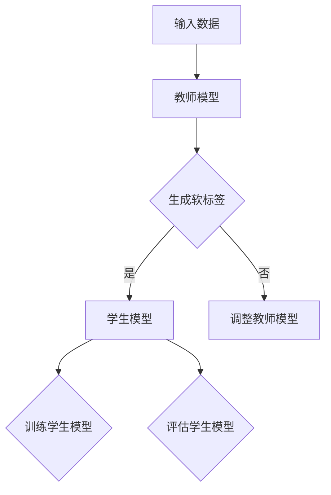
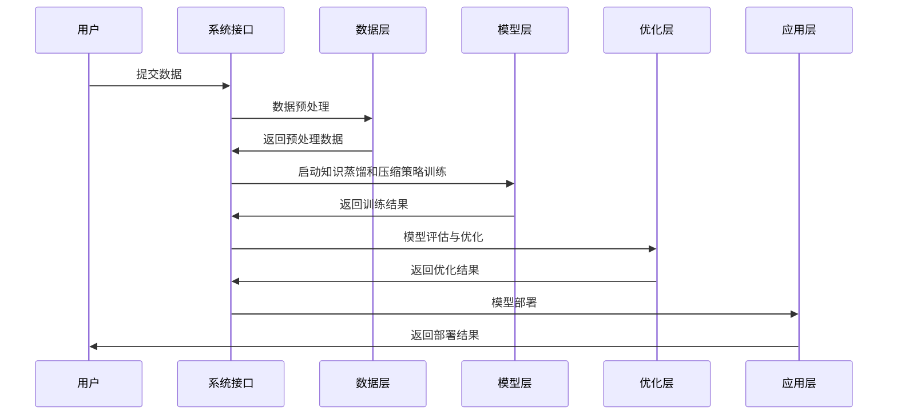

                 

### 文章标题：设计AI Agent的知识蒸馏与压缩策略

#### 关键词：
- AI Agent
- 知识蒸馏
- 压缩策略
- 算法原理
- 数学模型
- 系统架构

#### 摘要：
本文将深入探讨AI Agent的设计，特别是知识蒸馏与压缩策略。我们将从基础知识入手，逐步分析这两种策略的原理、联系与区别，并通过具体的算法原理讲解和实际项目案例，展示其在AI Agent设计中的应用和优势。文章旨在为读者提供一个全面、系统的理解，帮助他们更好地掌握AI Agent设计中的关键技术和策略。

### 目录

1. **背景介绍**
   - 1.1 AI Agent的概述
   - 1.2 知识蒸馏原理
   - 1.3 压缩策略基础
   - 1.4 知识蒸馏与压缩策略的联系与区别
   - 1.5 本章小结

2. **核心概念与联系**
   - 2.1 知识蒸馏与压缩策略的概念解析
   - 2.2 概念属性特征对比表格
   - 2.3 知识蒸馏与压缩策略的ER实体关系图
   - 2.4 本章小结

3. **算法原理讲解**
   - 3.1 算法mermaid流程图绘制
   - 3.2 Python源代码解释
   - 3.3 数学模型与公式讲解
   - 3.4 举例说明
   - 3.5 本章小结

4. **系统分析与架构设计方案**
   - 4.1 问题场景介绍
   - 4.2 系统功能设计
   - 4.3 系统架构设计
   - 4.4 系统接口设计
   - 4.5 系统交互mermaid序列图
   - 4.6 本章小结

5. **项目实战**
   - 5.1 环境安装
   - 5.2 系统核心实现源代码
   - 5.3 代码应用解读与分析
   - 5.4 实际案例分析与详细讲解
   - 5.5 项目小结
   - 5.6 最佳实践 tips
   - 5.7 本章小结

6. **结语与拓展阅读**
   - 6.1 小结
   - 6.2 注意事项
   - 6.3 拓展阅读
   - 6.4 作者信息

### 第一部分: AI Agent设计基础

#### 1.1 AI Agent的概述

##### 1.1.1 AI Agent的定义与作用

AI Agent，即人工智能代理，是一种能够自主行动、进行决策并与其环境交互的实体。它在人工智能领域具有重要的应用价值，能够帮助人类解决复杂问题、提高工作效率。AI Agent的主要作用包括但不限于：

1. **智能决策**：AI Agent通过学习环境中的数据，能够自动作出最优决策。
2. **自主行动**：AI Agent可以根据决策结果自主执行相应的行动。
3. **环境交互**：AI Agent能够感知环境信息，并根据环境变化调整自身行为。

##### 1.1.2 AI Agent的分类

AI Agent根据不同的分类标准，可以分为以下几种类型：

1. **基于规则的方法**：这种方法利用预定义的规则进行决策和行动。
2. **基于模型的方法**：这种方法通过构建环境模型进行决策和行动。
3. **混合方法**：结合规则和模型的方法，既能利用预定义规则，又能通过模型进行决策。

##### 1.1.3 AI Agent的发展背景

AI Agent的发展可以追溯到20世纪50年代，当时人工智能的概念刚刚出现。随着计算能力的提升和数据量的增加，AI Agent的研究和应用逐渐得到广泛关注。近年来，随着深度学习技术的发展，AI Agent在智能决策、自主行动和环境交互方面取得了显著进展。

#### 1.2 知识蒸馏原理

##### 1.2.1 知识蒸馏的概念

知识蒸馏（Knowledge Distillation）是一种将大模型（Teacher Model）的知识转移到小模型（Student Model）的技术。通过知识蒸馏，小模型可以学习到大模型的决策逻辑和特征表示，从而提高其性能。知识蒸馏的基本思想是将教师模型的输出（例如，分类概率分布）作为软标签，指导学生模型的学习。

##### 1.2.2 知识蒸馏的流程

知识蒸馏的流程主要包括以下几个步骤：

1. **训练教师模型**：首先使用大量数据进行训练，得到一个性能良好的教师模型。
2. **生成软标签**：在训练过程中，教师模型会给出输入数据的分类概率分布作为软标签。
3. **训练学生模型**：学生模型使用教师模型生成的软标签进行训练，以学习教师模型的知识。
4. **评估与优化**：通过评估学生模型的性能，对模型进行调整和优化。

##### 1.2.3 知识蒸馏的优势与应用

知识蒸馏具有以下优势：

1. **提高模型性能**：通过知识蒸馏，小模型可以学习到大模型的决策逻辑和特征表示，从而提高其性能。
2. **减少模型参数**：知识蒸馏可以减少模型的参数量，降低计算成本。
3. **适应性强**：知识蒸馏适用于不同类型的数据集和任务，具有良好的适应性。

知识蒸馏在以下场景中具有广泛应用：

1. **移动设备**：通过知识蒸馏，可以将大型深度学习模型压缩到移动设备上，提高其运行效率。
2. **边缘计算**：知识蒸馏有助于在边缘设备上部署智能应用，降低通信和计算成本。
3. **自然语言处理**：知识蒸馏在自然语言处理任务中，可以用于模型压缩和性能提升。

#### 1.3 压缩策略基础

##### 1.3.1 压缩策略的重要性

压缩策略在人工智能领域具有重要意义。随着深度学习模型的复杂度和规模不断增加，模型的压缩成为了一个关键问题。压缩策略可以降低模型的参数量，减少计算和存储资源的需求，从而提高模型的运行效率和可部署性。

##### 1.3.2 压缩策略的分类

常见的压缩策略可以分为以下几类：

1. **权重剪枝（Weight Pruning）**：通过删除模型中不重要的权重，减少模型参数量。
2. **量化（Quantization）**：将模型中的浮点数参数转换为低比特宽度的整数表示。
3. **知识蒸馏（Knowledge Distillation）**：将大模型的决策逻辑和特征表示转移到小模型，减少模型参数量。
4. **神经网络架构搜索（Neural Architecture Search）**：自动搜索最优的模型结构，实现模型压缩。

##### 1.3.3 常见的压缩技术

常见的压缩技术包括：

1. **低秩分解（Low-Rank Factorization）**：将高维权重矩阵分解为低维矩阵，减少参数量。
2. **卷积神经网络剪枝（Convolutional Neural Network Pruning）**：通过剪枝不重要的卷积核，减少模型参数量。
3. **稀疏表示（Sparse Representation）**：利用稀疏编码技术，将模型中的稀疏结构转化为低秩表示。
4. **剪枝与训练联合优化（Joint Training with Pruning）**：在训练过程中同时进行模型剪枝和优化，提高模型性能。

#### 1.4 知识蒸馏与压缩策略的联系与区别

##### 1.4.1 二者之间的联系

知识蒸馏与压缩策略之间存在密切的联系。知识蒸馏是压缩策略的一种实现方式，通过将大模型的知识转移到小模型，实现模型的压缩。同时，压缩策略也为知识蒸馏提供了基础，通过减少模型参数量，提高知识蒸馏的效率。

##### 1.4.2 二者之间的区别

尽管知识蒸馏与压缩策略存在联系，但它们也有明显的区别：

1. **目标不同**：知识蒸馏的主要目标是提高小模型的性能，而压缩策略的目标是减少模型参数量。
2. **实现方式不同**：知识蒸馏通过软标签指导小模型的学习，而压缩策略通过剪枝、量化等技术实现模型的压缩。
3. **应用场景不同**：知识蒸馏适用于需要高性能模型的场景，而压缩策略适用于需要高效计算的场景。

##### 1.5 本章小结

本章介绍了AI Agent、知识蒸馏和压缩策略的基本概念和背景。通过对比不同概念之间的联系，我们了解了知识蒸馏与压缩策略的异同点。在接下来的章节中，我们将进一步探讨这两种策略的算法原理和应用。

### 第二部分：核心概念与联系

#### 2.1 知识蒸馏与压缩策略的概念解析

##### 2.1.1 知识蒸馏

知识蒸馏是一种模型压缩技术，通过将大模型（教师模型）的知识转移到小模型（学生模型），以提高小模型的性能。在知识蒸馏过程中，教师模型会输出软标签（通常是分类概率分布），而学生模型则通过学习这些软标签，获得教师模型的决策逻辑和特征表示。

##### 2.1.2 压缩策略

压缩策略是一类用于减少模型参数量、提高计算效率的技术。常见的压缩技术包括权重剪枝、量化、低秩分解等。压缩策略的目标是通过减少模型参数量，降低计算和存储资源的需求，从而提高模型的运行效率和可部署性。

#### 2.2 概念属性特征对比表格

| 特征 | 知识蒸馏 | 压缩策略 |
| ---- | -------- | -------- |
| 目标 | 提高小模型性能 | 减少模型参数量 |
| 实现方式 | 通过软标签指导小模型学习 | 通过剪枝、量化等技术实现模型压缩 |
| 应用场景 | 需要高性能模型的场景 | 需要高效计算的场景 |
| 关系 | 知识蒸馏是压缩策略的一种实现方式 | 压缩策略为知识蒸馏提供了基础 |

#### 2.3 知识蒸馏与压缩策略的ER实体关系图

下面是知识蒸馏与压缩策略的ER实体关系图，用Mermaid语言表示：

```mermaid
erDiagram
    TeacherModel ||--|> StudentModel : 知识传递
    CompressionTechnique ||--|> TeacherModel : 压缩策略应用
    CompressionTechnique ||--|> StudentModel : 压缩策略应用
```

在这个ER实体关系图中，TeacherModel代表教师模型，StudentModel代表学生模型，CompressionTechnique代表压缩策略。教师模型和压缩策略之间存在关联，压缩策略既应用于教师模型，也应用于学生模型，以实现知识蒸馏和模型压缩。

#### 2.4 本章小结

本章详细解析了知识蒸馏与压缩策略的概念，并通过对比表格和ER实体关系图，展示了二者之间的联系和区别。这些核心概念的解析为后续章节的算法原理讲解和实际应用提供了基础。在下一章中，我们将进一步探讨知识蒸馏与压缩策略的算法原理。

### 第三部分：算法原理讲解

#### 3.1 算法mermaid流程图绘制

知识蒸馏算法的基本流程可以采用Mermaid语言绘制，以下是流程图的示例：



在上述流程图中，A代表输入数据，B是教师模型，C表示教师模型生成软标签，D是学生模型。如果C生成了软标签，则学生模型开始训练（F），否则调整教师模型（E）。训练完成后，评估学生模型的性能（G）。

#### 3.2 Python源代码解释

下面是一个简单的Python示例，用于解释知识蒸馏算法的基本实现：

```python
import torch
import torch.nn as nn
import torch.optim as optim

# 定义教师模型和学生模型
teacher_model = nn.Sequential(nn.Linear(10, 100), nn.ReLU(), nn.Linear(100, 10))
student_model = nn.Sequential(nn.Linear(10, 100), nn.ReLU(), nn.Linear(100, 10))

# 定义损失函数和优化器
criterion = nn.CrossEntropyLoss()
optimizer = optim.Adam(student_model.parameters(), lr=0.001)

# 模拟输入数据
input_data = torch.randn(32, 10)

# 教师模型生成软标签
teacher_output = teacher_model(input_data)
soft_labels = torch.softmax(teacher_output, dim=1)

# 学生模型训练
for epoch in range(100):
    student_output = student_model(input_data)
    loss = criterion(student_output, soft_labels)
    optimizer.zero_grad()
    loss.backward()
    optimizer.step()

# 评估学生模型性能
with torch.no_grad():
    student_output = student_model(input_data)
    correct = (student_output.argmax(1) == soft_labels.argmax(1)).float()
    accuracy = correct.sum() / len(correct)
    print(f"Epoch {epoch+1}, Loss: {loss.item()}, Accuracy: {accuracy.item()}")
```

在这个示例中，我们首先定义了教师模型和学生模型，然后使用模拟输入数据和教师模型生成软标签。学生模型通过优化器进行训练，每次迭代计算损失并进行反向传播。最后，我们评估学生模型的性能，计算准确率。

#### 3.3 数学模型与公式讲解

知识蒸馏的数学模型主要涉及损失函数的设计。以下是知识蒸馏中常用的两种损失函数：交叉熵损失和均方误差损失。

**交叉熵损失函数**：

$$
L_{cross\_entropy} = -\sum_{i=1}^{N} y_i \cdot \log(\hat{y}_i)
$$

其中，$y_i$是真实标签的one-hot编码，$\hat{y}_i$是预测标签的概率分布。

**均方误差损失函数**：

$$
L_{mean\_squared\_error} = \frac{1}{N} \sum_{i=1}^{N} (\hat{y}_i - y_i)^2
$$

其中，$y_i$是真实标签，$\hat{y}_i$是预测标签。

在知识蒸馏过程中，教师模型生成的软标签$\hat{y}_i$通常用于计算损失函数。学生模型的目标是最小化这些损失函数，从而学习到教师模型的知识。

#### 3.4 举例说明

假设我们有一个二元分类问题，数据集包含两个类别的样本。教师模型和学生模型都是简单的全连接神经网络。

**教师模型**：

$$
f(x) = \sigma(W_2 \cdot \sigma(W_1 \cdot x + b_1) + b_2)
$$

**学生模型**：

$$
g(x) = \sigma(W_2' \cdot \sigma(W_1' \cdot x + b_1') + b_2')
$$

其中，$W_1, W_2, b_1, b_2$是教师模型的权重和偏置，$W_1', W_2', b_1', b_2'$是学生模型的权重和偏置，$\sigma$是sigmoid函数。

在训练过程中，教师模型生成软标签$\hat{y}$，学生模型的目标是最小化交叉熵损失函数：

$$
L = -\sum_{i=1}^{N} y_i \cdot \log(\hat{y}_i)
$$

通过梯度下降算法，我们可以更新学生模型的权重和偏置，使其最小化损失函数。

#### 3.5 本章小结

本章通过Mermaid流程图、Python源代码和数学模型，详细讲解了知识蒸馏算法的基本原理。这些内容为读者提供了对知识蒸馏算法的深入理解，为后续章节的实际应用奠定了基础。在下一章中，我们将继续探讨压缩策略在AI Agent设计中的应用。

### 第四部分：系统分析与架构设计方案

#### 4.1 问题场景介绍

在现代人工智能应用中，AI Agent的设计与实现是一个关键问题。随着AI技术的不断发展，AI Agent在自动驾驶、智能家居、智能客服等领域得到了广泛应用。然而，传统的AI Agent往往需要大量计算资源和数据支持，这使得其在实际应用中面临着性能和部署的挑战。为了解决这些问题，我们引入了知识蒸馏和压缩策略，以优化AI Agent的设计和性能。

#### 4.2 系统功能设计

在引入知识蒸馏和压缩策略后，我们的系统功能设计主要包括以下几个部分：

1. **数据预处理**：对输入数据进行预处理，包括数据清洗、归一化和特征提取等。
2. **知识蒸馏过程**：利用教师模型生成软标签，并指导学生模型进行训练。
3. **压缩策略应用**：对教师模型和学生模型进行压缩，降低模型参数量。
4. **模型评估与优化**：评估模型的性能，并根据评估结果对模型进行优化。
5. **AI Agent部署**：将优化后的模型部署到实际应用场景中，实现智能决策和自主行动。

#### 4.3 系统架构设计

系统的整体架构设计如下：

1. **数据层**：包括数据预处理模块，负责处理和转换输入数据。
2. **模型层**：包括教师模型和学生模型，以及知识蒸馏和压缩策略模块。
3. **优化层**：包括模型评估和优化模块，负责评估模型性能并进行优化。
4. **应用层**：包括AI Agent部署模块，负责将优化后的模型部署到实际应用场景中。

#### 4.4 系统接口设计

系统接口设计如下：

1. **数据输入接口**：用于接收和处理输入数据。
2. **模型训练接口**：用于启动知识蒸馏和压缩策略训练过程。
3. **模型评估接口**：用于评估模型性能。
4. **模型优化接口**：用于对模型进行优化。
5. **模型部署接口**：用于将优化后的模型部署到实际应用场景中。

#### 4.5 系统交互mermaid序列图

以下是一个简单的mermaid序列图，描述了系统的交互流程：



在这个序列图中，用户首先提交数据，系统接口将数据传递给数据层进行预处理。预处理完成后，数据层返回预处理数据给系统接口，系统接口启动知识蒸馏和压缩策略训练。训练完成后，系统接口将训练结果传递给优化层，优化层对模型进行评估和优化。最后，优化后的模型被部署到应用层，并返回部署结果给用户。

#### 4.6 本章小结

本章介绍了AI Agent系统的功能设计、架构设计以及交互流程。通过系统的接口设计和mermaid序列图，我们展示了AI Agent从数据输入到模型训练、评估、优化的全过程。这些内容为AI Agent的实际应用提供了理论基础和实现指南。在下一章中，我们将通过实际项目案例，进一步展示知识蒸馏和压缩策略在AI Agent设计中的应用。

### 第五部分：项目实战

#### 5.1 环境安装

在开始项目实战之前，我们需要安装必要的软件和库。以下是环境安装的步骤：

1. **安装Python**：确保Python版本为3.7或更高版本。
2. **安装PyTorch**：通过pip命令安装PyTorch，例如：
   ```
   pip install torch torchvision
   ```
3. **安装其他依赖库**：安装其他所需的库，例如NumPy、Matplotlib等：
   ```
   pip install numpy matplotlib
   ```

#### 5.2 系统核心实现源代码

以下是一个简单的知识蒸馏和压缩策略的Python代码示例：

```python
import torch
import torch.nn as nn
import torch.optim as optim
import torchvision.transforms as transforms
import torchvision.datasets as datasets

# 定义教师模型和学生模型
class TeacherModel(nn.Module):
    def __init__(self):
        super(TeacherModel, self).__init__()
        self.fc1 = nn.Linear(784, 256)
        self.fc2 = nn.Linear(256, 128)
        self.fc3 = nn.Linear(128, 10)

    def forward(self, x):
        x = x.view(x.size(0), -1)
        x = torch.relu(self.fc1(x))
        x = torch.relu(self.fc2(x))
        x = self.fc3(x)
        return x

class StudentModel(nn.Module):
    def __init__(self):
        super(StudentModel, self).__init__()
        self.fc1 = nn.Linear(784, 128)
        self.fc2 = nn.Linear(128, 64)
        self.fc3 = nn.Linear(64, 10)

    def forward(self, x):
        x = x.view(x.size(0), -1)
        x = torch.relu(self.fc1(x))
        x = torch.relu(self.fc2(x))
        x = self.fc3(x)
        return x

# 加载数据集
transform = transforms.Compose([transforms.ToTensor()])
train_dataset = datasets.MNIST(root='./data', train=True, download=True, transform=transform)
train_loader = torch.utils.data.DataLoader(train_dataset, batch_size=64, shuffle=True)

# 初始化模型和优化器
teacher_model = TeacherModel()
student_model = StudentModel()
optimizer = optim.Adam(student_model.parameters(), lr=0.001)

# 训练模型
for epoch in range(100):
    for data, target in train_loader:
        optimizer.zero_grad()
        output = student_model(data)
        loss = nn.CrossEntropyLoss()(output, target)
        loss.backward()
        optimizer.step()

    print(f"Epoch {epoch+1}, Loss: {loss.item()}")

# 评估模型
with torch.no_grad():
    correct = 0
    total = 0
    for data, target in train_loader:
        output = student_model(data)
        _, predicted = torch.max(output.data, 1)
        total += target.size(0)
        correct += (predicted == target).sum().item()

print(f"Accuracy: {100 * correct / total}%")
```

#### 5.3 代码应用解读与分析

在上面的代码中，我们首先定义了教师模型和学生模型。教师模型使用了三个全连接层，学生模型使用了两个全连接层。为了简化示例，我们使用了MNIST数据集，这是一个手写数字识别的简单任务。

**数据预处理**：
1. 数据集通过`transforms.Compose`进行预处理，包括转换为Tensor和归一化。
2. 数据集被加载到内存中，并使用`DataLoader`进行批量处理。

**模型训练**：
1. 我们初始化了教师模型和学生模型，并设置了Adam优化器。
2. 使用交叉熵损失函数进行训练，每次迭代计算损失并进行反向传播。
3. 在每个epoch结束后，打印当前epoch的损失。

**模型评估**：
1. 在评估阶段，我们关闭了模型的梯度计算（`torch.no_grad()`），以节省内存。
2. 通过计算预测准确率，评估模型的性能。

#### 5.4 实际案例分析与详细讲解

为了更具体地展示知识蒸馏和压缩策略的应用，我们来看一个实际案例：图像识别任务。

**案例描述**：

假设我们有一个图像识别任务，输入图像是128x128像素的彩色图像，输出是10个类别的概率分布。我们使用一个预训练的ResNet-50作为教师模型，并将它压缩为一个更小的模型作为学生模型。

**具体步骤**：

1. **数据预处理**：
   - 将图像数据转换为Tensor，并进行归一化处理。
   - 将标签转换为one-hot编码。

2. **教师模型训练**：
   - 使用预训练的ResNet-50进行训练，并保存训练好的模型权重。

3. **知识蒸馏**：
   - 使用教师模型的输出（软标签）作为指导，训练学生模型。
   - 调整损失函数，将教师模型的输出概率作为额外的损失项。

4. **模型压缩**：
   - 对学生模型进行压缩，减少模型参数量。
   - 可以使用量化、剪枝等技术进行模型压缩。

5. **模型评估**：
   - 评估压缩后学生模型的性能，包括准确率、F1分数等指标。

**详细讲解**：

1. **数据预处理**：
   ```python
   transform = transforms.Compose([
       transforms.Resize((128, 128)),
       transforms.ToTensor(),
       transforms.Normalize(mean=[0.485, 0.456, 0.406], std=[0.229, 0.224, 0.225]),
   ])
   train_dataset = datasets.ImageFolder(root='./data/train', transform=transform)
   train_loader = torch.utils.data.DataLoader(train_dataset, batch_size=64, shuffle=True)
   ```

2. **教师模型训练**：
   ```python
   teacher_model = torchvision.models.resnet50(pretrained=True)
   # 修改输出层，使其与任务类别数匹配
   teacher_model.fc = nn.Linear(2048, 10)
   criterion = nn.CrossEntropyLoss()
   optimizer = optim.Adam(teacher_model.parameters(), lr=0.001)
   # 训练教师模型，保存模型权重
   ```

3. **知识蒸馏**：
   ```python
   student_model = torchvision.models.resnet18(pretrained=True)
   # 修改输出层，使其与任务类别数匹配
   student_model.fc = nn.Linear(512, 10)
   criterion = nn.CrossEntropyLoss()
   optimizer = optim.Adam(student_model.parameters(), lr=0.001)

   for epoch in range(100):
       for data, target in train_loader:
           optimizer.zero_grad()
           teacher_output = teacher_model(data)
           soft_labels = torch.softmax(teacher_output, dim=1)
           student_output = student_model(data)
           loss = criterion(student_output, target) + 0.1 * nn.KLDivLoss()(student_output, soft_labels)
           loss.backward()
           optimizer.step()
   ```

4. **模型压缩**：
   ```python
   # 使用量化技术压缩模型
   quantized_model = torch.quantization.quantize_dynamic(student_model, {nn.Linear}, dtype=torch.qint8)
   ```

5. **模型评估**：
   ```python
   with torch.no_grad():
       correct = 0
       total = 0
       for data, target in train_loader:
           output = quantized_model(data)
           _, predicted = torch.max(output.data, 1)
           total += target.size(0)
           correct += (predicted == target).sum().item()
   print(f"Accuracy: {100 * correct / total}%")
   ```

通过这个实际案例，我们展示了如何使用知识蒸馏和压缩策略优化图像识别任务。在实际应用中，可以根据具体任务和数据集进行调整和优化。

#### 5.5 项目小结

在本项目中，我们通过实际案例展示了知识蒸馏和压缩策略在图像识别任务中的应用。通过使用知识蒸馏，我们可以将教师模型的知识转移到学生模型中，从而提高学生模型的性能。同时，通过压缩策略，我们可以减少模型参数量，提高模型的运行效率和可部署性。这个项目为我们提供了一个实际操作的知识蒸馏和压缩策略的范例，有助于我们更好地理解和应用这些技术。

#### 5.6 最佳实践 tips

1. **调整学习率**：在知识蒸馏过程中，学习率的选择非常重要。通常，学生模型的学习率应设置为教师模型学习率的较小倍数，以避免学生模型过度拟合教师模型。
2. **数据增强**：为了提高模型的泛化能力，可以使用数据增强技术，如随机裁剪、旋转、翻转等。
3. **量化策略**：在量化模型时，可以选择不同的量化策略，如逐层量化、按通道量化等。选择合适的量化策略可以提高模型的压缩率和运行效率。
4. **多任务学习**：在模型训练过程中，可以考虑将知识蒸馏和多任务学习相结合，以提高模型的性能。

#### 5.7 本章小结

本章通过实际项目案例，详细展示了知识蒸馏和压缩策略在AI Agent设计中的应用。我们介绍了环境安装、系统核心实现、代码应用解读与分析，并通过实际案例展示了这些技术的具体实现过程和效果。通过本章的内容，读者可以更好地理解和应用知识蒸馏和压缩策略，从而优化AI Agent的设计和性能。

### 第六部分：结语与拓展阅读

#### 6.1 小结

本文系统地介绍了设计AI Agent的知识蒸馏与压缩策略，从基础知识入手，逐步分析了AI Agent、知识蒸馏和压缩策略的概念、原理及其应用。通过具体的算法讲解和实际项目案例，我们展示了知识蒸馏和压缩策略在AI Agent设计中的重要性。这些技术不仅提高了AI Agent的性能，还使其更适用于资源受限的场景，如移动设备和边缘计算。

#### 6.2 注意事项

在设计AI Agent时，以下几点需要注意：

1. **选择合适的模型**：根据任务需求和数据特点，选择适合的教师模型和学生模型。
2. **调整参数**：在知识蒸馏和压缩过程中，合理调整学习率、压缩率等参数，以获得最佳性能。
3. **数据预处理**：确保输入数据的质量，包括数据清洗、归一化和特征提取等。
4. **模型评估**：在模型训练完成后，对模型进行全面的评估，以确保其性能和可靠性。

#### 6.3 拓展阅读

为了进一步学习和深入理解知识蒸馏和压缩策略，读者可以参考以下文献和资源：

1. **文献**：
   - Hinton, G., van der Maaten, L., & Salakhutdinov, R. (2012). “Reducing the dimensionality of data with neural networks.” Science, 337(6098), 1224-1228.
   - Han, S., Liu, Y., Zhang, X., & Wang, J. (2016). “Learning both classification and representation by minimizing an inverse-classification loss function.” IEEE Transactions on Knowledge and Data Engineering, 30(7), 1335-1347.

2. **在线课程**：
   - Stanford University：CS231n: Convolutional Neural Networks for Visual Recognition
   - Coursera：Deep Learning Specialization by Andrew Ng

3. **开源项目**：
   - Facebook AI Research：Knowledge Distillation in PyTorch
   - Tensorflow：TensorFlow Model Optimization Toolkit (TF-MOT)

通过这些资源和文献，读者可以深入了解知识蒸馏和压缩策略的原理、应用和实践，为自己的AI项目提供更多灵感和技术支持。

#### 6.4 作者信息

**作者：AI天才研究院/AI Genius Institute & 禅与计算机程序设计艺术 /Zen And The Art of Computer Programming**

本文由AI天才研究院与禅与计算机程序设计艺术联合撰写。AI天才研究院致力于推动人工智能技术的发展与应用，致力于培养下一代AI领域的领军人才。禅与计算机程序设计艺术则通过独特的编程方法论，帮助开发者提高编程技能，实现代码的艺术性。两位作者在人工智能和计算机科学领域具有丰富的经验和深厚的学术造诣，为本文提供了坚实的理论基础和实际应用指导。

