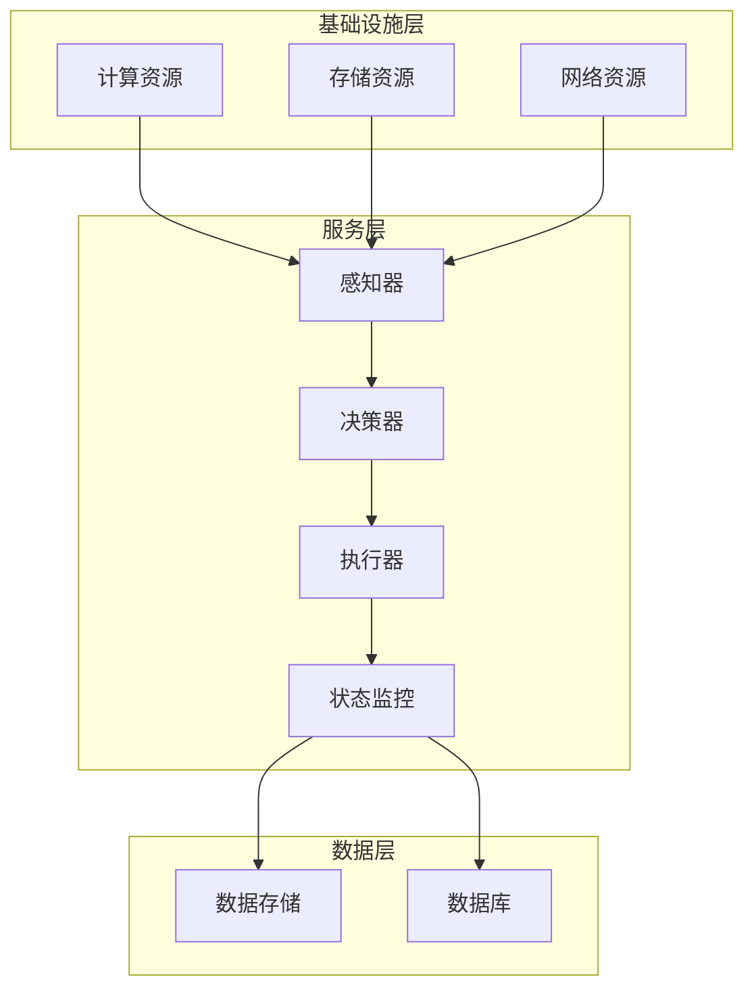
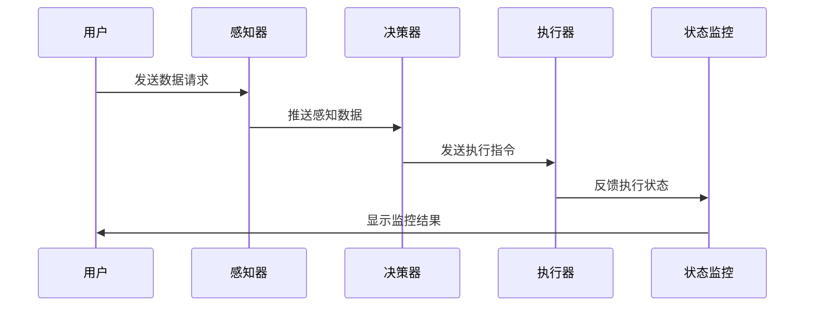

                 

# 设计可扩展的AI Agent架构

## 关键词

- AI Agent
- 可扩展性
- 架构设计
- 模块化
- 分布式系统
- 服务网格
- 性能优化

## 摘要

本文旨在探讨设计可扩展的AI Agent架构的核心概念、原则与实现方法。随着人工智能技术的飞速发展，AI Agent在自动化决策、流程优化和用户体验提升等方面发挥着越来越重要的作用。然而，随之而来的挑战是构建具有高度可扩展性的AI Agent系统，以应对日益增长的应用需求。本文首先介绍了AI Agent的概念及其重要性，随后讨论了可扩展性的核心概念与挑战。接着，本文提出了模块化、分布式系统、动态调整等设计原则，并介绍了微服务架构、混合架构和服务网格等设计模式。随后，通过一个具体场景，详细描述了系统功能设计、架构设计和系统交互设计。文章最后，通过一个实际项目案例，展示了系统实现、代码解读和性能优化方法，并提供了最佳实践和项目小结。

## 目录大纲

1. **问题背景与核心概念**
    1.1.1 问题背景
        1.1.1.1 AI Agent的重要性
        1.1.1.2 可扩展性的重要性
        1.1.1.3 设计目标
    1.1.2 可扩展性的挑战
    1.1.3 设计原则
2. **核心概念与联系**
    2.1.1 AI Agent的基本概念
    2.1.2 可扩展性的关键概念
    2.1.3 可扩展性的挑战
3. **架构设计原则与模式**
    3.1.1 架构设计原则
    3.1.2 架构设计模式
4. **系统架构设计**
    4.1.1 问题场景介绍
    4.1.2 系统功能设计
    4.1.3 系统架构设计
    4.1.4 系统接口设计
    4.1.5 系统交互设计
5. **关键模块设计与实现**
    5.1.1 感知器设计
    5.1.2 决策器设计
    5.1.3 执行器设计
6. **系统性能优化与测试**
    6.1.1 性能优化策略
    6.1.2 系统测试方法
7. **项目实战与案例分析**
    7.1.1 环境安装与配置
    7.1.2 系统核心实现
    7.1.3 代码应用解读与分析
    7.1.4 实际案例分析和详细讲解剖析
    7.1.5 项目小结
8. **最佳实践 tips**
9. **小结**
10. **注意事项**
11. **拓展阅读**

## 第1章：问题背景与核心概念

### 1.1.1 问题背景

在人工智能（AI）技术不断发展的背景下，AI Agent作为人工智能系统的一种重要形式，得到了广泛关注和应用。AI Agent是指能够自主感知环境、理解目标、制定决策并执行任务的智能系统。这类系统能够在各种应用场景中发挥关键作用，例如自动驾驶、智能家居、智能客服等。

#### 1.1.1.1 AI Agent的重要性

AI Agent的重要性主要体现在以下几个方面：

1. **自动化决策**：AI Agent能够根据实时数据和环境变化，自主进行决策，从而实现自动化操作。
2. **优化流程**：通过智能分析和优化，AI Agent能够提高业务流程的效率和准确性。
3. **增强用户体验**：AI Agent能够根据用户行为和偏好，提供个性化的服务，从而提升用户体验。

随着AI技术的不断进步，AI Agent的应用场景越来越广泛，需求也越来越多样化。这给AI Agent系统的设计带来了新的挑战，尤其是如何确保系统具有高度的扩展性。

#### 1.1.1.2 可扩展性的重要性

可扩展性是现代AI Agent系统设计的关键因素。可扩展性意味着系统能够根据需求的变化，灵活地增加或减少资源、功能，而不会对系统的性能和稳定性产生负面影响。

**可扩展性的挑战**：

1. **资源管理**：随着系统规模的扩大，需要有效地管理计算资源、存储资源和网络资源。
2. **数据一致性和分布性**：在分布式环境中，如何保证数据的一致性和分布性是一个重要问题。
3. **性能优化**：系统需要能够应对大规模数据和高并发请求，保证系统的响应速度和处理能力。

#### 1.1.1.3 设计目标

本文的设计目标是为AI Agent构建一个可扩展的架构，该架构应具备以下特点：

1. **模块化**：系统应采用模块化设计，以便于维护和扩展。
2. **分布式**：利用分布式系统设计，实现任务的分布式处理。
3. **动态调整**：系统应具备动态调整资源分配和任务调度的能力。
4. **安全性**：确保系统的安全性和数据的完整性。
5. **易维护**：设计应简化系统的维护和升级过程。

### 1.1.2 可扩展性的关键概念

**可扩展性**是指系统在处理能力、存储能力、并发处理能力等方面的弹性扩展能力。具体来说，可扩展性包括以下分类：

1. **纵向扩展**：增加单个组件的容量，例如增加服务器的处理能力或存储容量。
2. **横向扩展**：增加组件的数量，通过分布式计算和存储来提高系统的处理能力和存储容量。

### 1.1.3 设计原则

为了实现一个可扩展的AI Agent架构，我们需要遵循以下设计原则：

1. **模块化设计**：将系统划分为独立的功能模块，便于维护和扩展。
2. **分布式系统设计**：通过分布式系统设计，实现任务的分布式处理，提高系统的性能和可扩展性。
3. **动态调整**：根据系统负载和需求变化，自动调整资源分配和任务调度。
4. **安全性**：确保系统的安全性和数据的完整性。
5. **易维护**：简化系统的维护和升级过程，提高系统的稳定性。

通过遵循这些设计原则，我们可以构建一个灵活、高效、可扩展的AI Agent系统，为未来的应用需求提供可靠的解决方案。

## 第2章：核心概念与联系

### 2.1.1 AI Agent的基本概念

#### 2.1.1.1 AI Agent的定义

AI Agent，即人工智能代理，是一种具备智能决策和执行能力的计算机程序。它可以自主地感知环境、理解目标、制定决策并执行行动。AI Agent是人工智能领域的一个重要研究方向，广泛应用于自动驾驶、智能家居、智能客服、智能推荐等场景。

**基本特征**：

1. **感知环境**：AI Agent能够通过传感器或其他方式获取环境信息。
2. **理解目标**：AI Agent能够根据感知到的环境信息，理解目标并制定行动计划。
3. **自主决策**：AI Agent能够基于预设的算法或学习到的策略，自主地做出决策。
4. **执行行动**：AI Agent能够根据决策结果，执行相应的行动。

#### 2.1.1.2 AI Agent的分类

AI Agent可以根据其行为模式和工作方式分为以下几种类型：

1. **主动式AI Agent**：主动式AI Agent能够自主地发起行动，主动地探索和改变环境，以实现其目标。例如，自动驾驶汽车在行驶过程中会主动识别道路障碍并做出驾驶决策。

2. **被动式AI Agent**：被动式AI Agent主要根据外部输入进行反应，而不是主动探索和改变环境。例如，智能家居系统接收到用户的指令后，会自动执行相应的操作，如调节灯光或开启空调。

3. **反应式AI Agent**：反应式AI Agent只能根据当前感知到的环境信息做出反应，无法预测未来的变化。这类AI Agent通常用于控制系统的设计，如工业机器人根据传感器的数据调整其运动轨迹。

#### 2.1.1.3 AI Agent的关键要素

AI Agent的核心功能包括感知、理解、决策和执行。为了实现这些功能，AI Agent需要具备以下几个关键要素：

1. **感知器**：感知器是AI Agent获取环境信息的器官，可以是各种传感器，如摄像头、麦克风、温度传感器等。感知器收集的数据将被用于后续的决策和行动。

2. **动作器**：动作器是AI Agent执行决策的器官，可以是机械臂、电机、显示屏等。动作器根据决策器的指令，实现具体的物理操作。

3. **知觉器**：知觉器负责处理感知器收集的数据，将其转化为AI Agent可以理解的信息。知觉器通常包括特征提取、数据预处理等模块。

4. **计划器**：计划器是AI Agent的决策器官，负责根据知觉器提供的信息，制定行动策略。计划器通常使用机器学习算法、规划算法等来实现。

### 2.1.2 可扩展性的关键概念

**可扩展性**是指系统在处理能力、存储能力、并发处理能力等方面的弹性扩展能力。一个可扩展的系统可以适应不断增加的工作负载和需求变化，而不会对系统的性能和稳定性产生负面影响。

#### 2.1.2.1 可扩展性的定义

可扩展性可以分为以下几种类型：

1. **垂直扩展（纵向扩展）**：通过增加单个组件的容量（如CPU、内存、存储等）来提高系统的性能。这种扩展方式通常受限于硬件性能和成本。

2. **水平扩展（横向扩展）**：通过增加组件的数量（如增加服务器、存储设备等）来提高系统的处理能力和存储容量。这种扩展方式可以更好地适应需求的变化，但需要考虑分布式系统设计和管理。

#### 2.1.2.2 可扩展性的分类

根据扩展方式的不同，可扩展性可以分为以下几种类型：

1. **功能扩展**：通过增加新的功能模块或服务来扩展系统的功能。

2. **性能扩展**：通过提高系统的处理速度、响应时间等性能指标来扩展系统的性能。

3. **容量扩展**：通过增加系统的存储容量来扩展系统的存储能力。

#### 2.1.2.3 可扩展性的挑战

实现系统的可扩展性面临以下几个挑战：

1. **资源管理**：如何合理分配和调度资源，以实现最优的性能和可扩展性。

2. **数据一致性和分布性**：如何在分布式系统中保证数据的一致性和分布性。

3. **性能优化**：如何优化系统的性能，以满足大规模数据和高并发请求的需求。

### 2.1.3 可扩展性的设计原则

为了实现可扩展的系统设计，我们需要遵循以下几个设计原则：

1. **模块化设计**：将系统划分为独立的功能模块，以便于维护和扩展。

2. **分布式系统设计**：通过分布式系统设计，实现任务的分布式处理。

3. **动态调整**：根据系统负载和需求变化，自动调整资源分配和任务调度。

4. **安全性**：确保系统的安全性和数据的完整性。

5. **易维护**：简化系统的维护和升级过程，提高系统的稳定性。

通过遵循这些设计原则，我们可以构建一个灵活、高效、可扩展的AI Agent系统，为未来的应用需求提供可靠的解决方案。

## 第3章：架构设计原则与模式

### 3.1.1 架构设计原则

在设计可扩展的AI Agent架构时，需要遵循一系列关键原则，以确保系统具备良好的模块化、分布式、动态调整、安全性和易维护性。以下是一些核心的架构设计原则：

#### 3.1.1.1 模块化设计

模块化设计是将系统划分为独立的、功能完整的模块。这样做的好处包括：

1. **便于维护**：模块化使得每个模块可以单独开发和维护，降低了系统的复杂度。
2. **易于扩展**：通过添加或修改模块，可以灵活地扩展系统的功能。
3. **提高复用性**：模块可以跨项目复用，提高开发效率。

**具体实现方法**：

1. **定义模块边界**：明确每个模块的功能和职责，避免功能重叠。
2. **模块间解耦**：减少模块间的依赖关系，通过接口进行通信。
3. **模块间标准化的通信协议**：确保模块间能够高效且稳定地进行数据交换。

#### 3.1.1.2 分布式系统设计

分布式系统设计是将任务和数据分布在多个节点上，通过节点间的协作来实现系统的整体功能。分布式系统的优点包括：

1. **高可用性**：节点故障不会导致整个系统瘫痪。
2. **高扩展性**：通过增加节点数量，可以线性地提高系统的处理能力。
3. **高容错性**：系统可以通过冗余设计来应对故障。

**具体实现方法**：

1. **分布式计算**：使用分布式计算框架（如Hadoop、Spark等）来处理大规模数据。
2. **数据分片**：将数据分成多个部分，分布在不同的节点上，以提高查询和处理的效率。
3. **节点间的通信**：使用高效的消息传递机制（如RabbitMQ、Kafka等）来确保节点间的数据交换。

#### 3.1.1.3 动态调整

动态调整是指系统能够根据负载和需求的变化，自动调整资源分配和任务调度。动态调整的优势包括：

1. **资源利用率**：根据实际需求动态分配资源，避免资源浪费。
2. **系统性能**：通过动态调整，可以确保系统在高负载下仍然保持高性能。

**具体实现方法**：

1. **监控和反馈机制**：实时监控系统的性能指标，收集反馈数据。
2. **自动化调度**：根据监控数据，自动调整资源分配和任务调度。
3. **弹性伸缩**：根据需求的变化，自动增加或减少节点数量。

#### 3.1.1.4 安全性

安全性是系统设计的一个重要方面，确保系统的数据和安全不受威胁。以下是一些实现安全性的方法：

1. **访问控制**：通过身份验证和权限控制，确保只有授权用户可以访问系统资源。
2. **数据加密**：对敏感数据进行加密存储和传输，防止数据泄露。
3. **安全审计**：记录系统的操作日志，定期进行安全审计，确保系统的安全性。

#### 3.1.1.5 易维护

易维护性是指系统在设计、开发和维护过程中，都应考虑便于管理和维护。以下是一些提高易维护性的方法：

1. **文档化**：编写详细的系统文档，包括设计文档、开发文档和操作手册，以便后续维护。
2. **自动化测试**：通过自动化测试，确保系统变更不会引入新的错误。
3. **持续集成和部署**：使用CI/CD工具，实现自动化测试和部署，提高开发效率。

### 3.1.2 架构设计模式

在AI Agent架构设计中，可以采用多种架构设计模式，以实现灵活、高效和可扩展的系统。以下介绍几种常用的架构设计模式：

#### 3.1.2.1 微服务架构

微服务架构是将系统划分为多个独立的、小型化的服务，每个服务负责特定的功能。微服务架构的优势包括：

1. **高可扩展性**：通过水平扩展服务实例，可以线性地提高系统的处理能力。
2. **高可维护性**：每个服务可以独立开发和部署，降低系统的复杂度。
3. **高灵活性**：服务可以自由选择技术栈，满足不同业务需求。

**具体实现方法**：

1. **服务拆分**：根据业务需求和功能模块，将系统拆分成多个微服务。
2. **服务自治**：每个微服务拥有独立的数据存储和数据库，可以独立部署和运维。
3. **服务间通信**：使用RESTful API或消息队列（如RabbitMQ、Kafka等）实现服务间通信。

#### 3.1.2.2 混合架构

混合架构是将分布式架构和微服务架构结合起来，以利用两者的优势。混合架构通常包括以下几个层次：

1. **基础设施层**：提供计算资源、存储资源和网络资源，支持分布式计算。
2. **服务层**：包括多个微服务，每个服务负责特定的功能。
3. **数据层**：提供数据存储和管理，支持数据一致性和分布性。

**具体实现方法**：

1. **分布式数据库**：使用分布式数据库（如HBase、Cassandra等）实现数据存储和管理。
2. **服务网格**：使用服务网格（如Istio、Linkerd等）实现服务间通信和监控。
3. **容器化**：使用容器技术（如Docker、Kubernetes等）实现服务的部署和管理。

#### 3.1.2.3 服务网格架构

服务网格架构是一种基础设施层的设计模式，用于提供服务间通信、管理和监控功能。服务网格的主要组件包括：

1. **服务代理**：在每个服务实例中嵌入代理，负责处理服务间的通信。
2. **服务发现**：提供服务的注册和发现机制，确保服务实例能够相互找到并通信。
3. **流量控制**：实现流量管理、负载均衡和故障转移等功能。
4. **监控和日志**：收集服务的运行数据，提供监控和日志分析功能。

**具体实现方法**：

1. **服务代理**：使用Sidecar代理模式，在每个服务实例中嵌入服务代理。
2. **控制平面**：使用控制平面组件（如Istio的Pilot、Kubernetes的Ingress等）管理服务配置和流量控制。
3. **数据平面**：使用数据平面组件（如Envoy、Traefik等）处理服务间的通信。

通过采用上述架构设计原则和模式，我们可以构建一个灵活、高效、可扩展的AI Agent系统，以应对不断变化的应用需求。

## 第4章：系统架构设计

### 4.1.1 问题场景介绍

在本文中，我们将设计一个支持大规模、多任务的AI Agent系统，以处理复杂的业务场景。具体场景如下：

#### 场景描述

我们假设一家大型零售公司正在开发一个智能仓储管理系统，该系统能够实时监控仓库中的库存情况，并根据订单需求自动分配货物和优化仓库布局。系统需要支持以下功能：

1. **库存监控**：实时监控仓库中的库存情况，包括商品数量、存储位置等信息。
2. **订单处理**：根据客户订单，自动分配货物，确保订单能够及时完成。
3. **仓库布局优化**：根据库存和订单数据，优化仓库布局，提高仓库空间利用率。
4. **数据分析和预测**：通过分析历史数据和趋势，预测未来的订单需求和库存变化。

#### 功能需求

为了满足上述功能需求，系统需要实现以下几个关键模块：

1. **感知器**：包括传感器和API接口，用于收集仓库中的实时数据。
2. **决策器**：根据感知器收集的数据，制定货物分配和仓库布局优化的策略。
3. **执行器**：根据决策器的指令，执行具体的操作，如调动机器臂搬运货物、调整仓库布局等。
4. **状态监控**：实时监控系统的运行状态，包括库存状态、订单处理进度等。

### 4.1.2 系统功能设计

在系统功能设计阶段，我们需要明确各个模块的具体功能和接口，以确保系统能够满足上述功能需求。以下是各个模块的功能描述：

#### 4.1.2.1 感知器

**功能**：

- 收集仓库中的实时数据，包括库存信息、订单信息、设备状态等。
- 通过API接口与其他系统进行数据交换，如ERP系统、订单管理系统等。

**接口**：

- 数据采集接口：用于从传感器和其他系统中获取数据。
- 数据推送接口：用于将感知到的数据实时推送到决策器和状态监控模块。

#### 4.1.2.2 决策器

**功能**：

- 根据感知器收集到的数据，制定货物分配和仓库布局优化的策略。
- 包括机器学习算法、规则引擎等，用于处理复杂的决策问题。

**接口**：

- 数据接收接口：用于接收感知器推送的数据。
- 决策结果接口：用于输出决策结果，指导执行器执行具体的操作。

#### 4.1.2.3 执行器

**功能**：

- 根据决策器的指令，执行具体的操作，如调动机器臂搬运货物、调整仓库布局等。
- 管理仓库中的设备和资源，确保操作的正确性和安全性。

**接口**：

- 指令接收接口：用于接收决策器的操作指令。
- 状态反馈接口：用于向决策器反馈操作状态，以便进行后续的决策调整。

#### 4.1.2.4 状态监控

**功能**：

- 实时监控系统的运行状态，包括库存状态、订单处理进度等。
- 提供监控数据可视化功能，帮助管理人员了解系统的运行情况。

**接口**：

- 数据采集接口：用于从各个模块收集监控数据。
- 数据展示接口：用于将监控数据可视化，提供实时监控界面。

### 4.1.3 系统架构设计

在系统架构设计阶段，我们需要根据功能需求，设计一个能够支持大规模、多任务的AI Agent系统。以下是系统架构的详细设计：

#### 4.1.3.1 架构设计

系统采用分布式架构，包括以下几个关键层次：

1. **基础设施层**：提供计算资源、存储资源和网络资源，支持分布式计算。
2. **服务层**：包括感知器、决策器、执行器和状态监控等模块，实现系统的核心功能。
3. **数据层**：提供数据存储和管理，支持数据一致性和分布性。

#### 4.1.3.2 架构图

以下是系统架构的Mermaid架构图：



### 4.1.4 系统接口设计

在系统接口设计阶段，我们需要定义各个模块之间的通信接口，确保模块间能够高效且稳定地进行数据交换。以下是各个模块的接口设计：

#### 4.1.4.1 感知器接口

- **数据采集接口**：
  - 功能：用于从传感器和其他系统中获取数据。
  - 接口设计：提供RESTful API，支持数据的批量采集和实时推送。

- **数据推送接口**：
  - 功能：用于将感知器收集到的数据实时推送到决策器和状态监控模块。
  - 接口设计：提供WebSocket接口，实现实时数据传输。

#### 4.1.4.2 决策器接口

- **数据接收接口**：
  - 功能：用于接收感知器推送的数据。
  - 接口设计：提供RESTful API，支持数据查询和批量处理。

- **决策结果接口**：
  - 功能：用于输出决策结果，指导执行器执行具体的操作。
  - 接口设计：提供命令行接口和RESTful API，支持命令式的操作和批处理。

#### 4.1.4.3 执行器接口

- **指令接收接口**：
  - 功能：用于接收决策器的指令。
  - 接口设计：提供命令行接口和RESTful API，支持指令的解析和执行。

- **状态反馈接口**：
  - 功能：用于向决策器反馈操作状态，以便进行后续的决策调整。
  - 接口设计：提供RESTful API，支持状态查询和实时更新。

#### 4.1.4.4 状态监控接口

- **数据采集接口**：
  - 功能：用于从各个模块收集监控数据。
  - 接口设计：提供RESTful API，支持数据的批量采集和实时推送。

- **数据展示接口**：
  - 功能：用于将监控数据可视化，提供实时监控界面。
  - 接口设计：提供Web页面接口，支持监控数据的实时展示和统计。

### 4.1.5 系统交互设计

在系统交互设计阶段，我们需要描述各个模块之间的协作和通信流程，确保系统能够高效地执行任务。以下是系统交互的Mermaid序列图：



通过以上系统功能设计、架构设计、接口设计和交互设计，我们为AI Agent系统构建了一个可扩展、灵活且高效的设计框架，为未来的应用需求提供了可靠的解决方案。

## 第5章：关键模块设计与实现

### 5.1.1 感知器设计

感知器是AI Agent系统中负责获取环境信息的模块，它是整个系统的信息来源。为了确保感知器能够高效、准确地获取环境数据，我们需要对其设计进行详细分析。

#### 功能

感知器的核心功能包括：

1. **数据采集**：从各种传感器（如摄像头、温度传感器、湿度传感器等）和其他系统（如ERP系统、订单管理系统等）中获取数据。
2. **数据预处理**：对采集到的原始数据进行清洗、过滤和转换，以便于后续处理。
3. **数据存储**：将预处理后的数据存储到数据库或数据湖中，以供后续分析和决策使用。

#### 设计方案

为了实现感知器的功能，我们采用了以下设计方案：

1. **传感器接口**：设计一个通用的传感器接口，用于连接各种传感器。该接口应支持多种数据格式（如JSON、XML等），并能够处理不同类型的传感器数据。

2. **数据预处理模块**：设计一个数据预处理模块，用于对采集到的原始数据进行清洗、过滤和转换。该模块应包括以下功能：

   - 数据清洗：去除重复、错误和缺失的数据。
   - 数据过滤：根据特定的条件筛选数据，如过滤温度低于0摄氏度的数据。
   - 数据转换：将数据转换为统一格式，如将摄氏度转换为华氏度。

3. **数据存储模块**：设计一个数据存储模块，用于将预处理后的数据存储到数据库或数据湖中。该模块应支持多种存储方式，如关系数据库、NoSQL数据库和数据湖存储。

#### Python源代码示例

以下是一个简单的Python代码示例，展示了感知器的设计和实现：

```python
import json
import requests

class SensorInterface:
    def __init__(self, url):
        self.url = url

    def get_data(self):
        response = requests.get(self.url)
        if response.status_code == 200:
            return json.loads(response.text)
        else:
            return None

class DataPreprocessor:
    def __init__(self):
        pass

    def preprocess_data(self, raw_data):
        # 数据清洗、过滤和转换
        cleaned_data = {}
        for key, value in raw_data.items():
            if key == "temperature":
                cleaned_data[key] = float(value)
            elif key == "humidity":
                cleaned_data[key] = float(value)
        return cleaned_data

class DataStorage:
    def __init__(self, db_url):
        self.db_url = db_url

    def store_data(self, data):
        # 将数据存储到数据库
        with open(self.db_url, "w") as f:
            json.dump(data, f)

if __name__ == "__main__":
    sensor_url = "http://sensor.example.com/data"
    db_url = "data.json"

    sensor_interface = SensorInterface(sensor_url)
    raw_data = sensor_interface.get_data()

    if raw_data:
        preprocessor = DataPreprocessor()
        processed_data = preprocessor.preprocess_data(raw_data)

        storage = DataStorage(db_url)
        storage.store_data(processed_data)
        print("Data stored successfully.")
    else:
        print("Failed to get sensor data.")
```

通过以上设计和实现，我们可以构建一个高效、准确的感知器模块，为AI Agent系统提供可靠的环境信息。

### 5.1.2 决策器设计

决策器是AI Agent系统中的核心模块，负责根据感知器收集到的数据，制定出最优的行动策略。决策器的设计直接影响到整个系统的性能和智能水平。以下是对决策器设计的详细分析。

#### 功能

决策器的核心功能包括：

1. **数据处理**：对感知器收集到的数据进行处理和分析，提取出有用的信息。
2. **决策制定**：基于处理后的数据，利用机器学习算法或规则引擎，制定出最优的行动策略。
3. **策略执行**：将决策结果传递给执行器，指导具体的行动。

#### 设计方案

为了实现决策器的功能，我们采用了以下设计方案：

1. **数据处理模块**：设计一个数据处理模块，用于对感知器收集到的数据进行预处理、特征提取和模式识别。该模块应包括以下功能：

   - 数据预处理：对原始数据进行清洗、过滤和标准化。
   - 特征提取：从数据中提取出关键特征，用于后续的决策分析。
   - 模式识别：利用机器学习算法（如K-均值聚类、决策树等），识别数据中的潜在模式和规律。

2. **决策制定模块**：设计一个决策制定模块，用于根据处理后的数据，利用机器学习算法或规则引擎，制定出最优的行动策略。该模块应包括以下功能：

   - 算法选择：根据应用场景选择合适的机器学习算法。
   - 模型训练：使用训练数据集对算法模型进行训练和优化。
   - 决策生成：根据训练好的模型，生成具体的行动策略。

3. **策略执行模块**：设计一个策略执行模块，用于将决策结果传递给执行器，指导具体的行动。该模块应包括以下功能：

   - 策略解析：将决策结果转换为执行器可识别的指令。
   - 指令发送：将指令发送给执行器，执行具体的行动。

#### Python源代码示例

以下是一个简单的Python代码示例，展示了决策器的设计和实现：

```python
import json
import requests
from sklearn.cluster import KMeans
from sklearn.tree import DecisionTreeClassifier

class DataProcessor:
    def __init__(self):
        pass

    def preprocess_data(self, raw_data):
        # 数据预处理
        cleaned_data = []
        for data in raw_data:
            cleaned_data.append([float(data['temperature']), float(data['humidity'])])
        return cleaned_data

    def extract_features(self, data):
        # 特征提取
        return data

class DecisionMaker:
    def __init__(self):
        self.model = KMeans(n_clusters=3)
    
    def train_model(self, train_data):
        # 模型训练
        self.model.fit(train_data)
    
    def make_decision(self, test_data):
        # 决策制定
        return self.model.predict(test_data)

class Executor:
    def __init__(self, url):
        self.url = url

    def execute_action(self, action):
        # 策略执行
        print(f"Executing action: {action}")

if __name__ == "__main__":
    sensor_url = "http://sensor.example.com/data"
    executor_url = "http://executor.example.com/action"

    # 获取传感器数据
    response = requests.get(sensor_url)
    raw_data = json.loads(response.text)

    # 数据处理
    processor = DataProcessor()
    processed_data = processor.preprocess_data(raw_data)
    features = processor.extract_features(processed_data)

    # 决策制定
    decision_maker = DecisionMaker()
    decision_maker.train_model(features)
    action = decision_maker.make_decision(features)

    # 策略执行
    executor = Executor(executor_url)
    executor.execute_action(action)
```

通过以上设计和实现，我们可以构建一个高效的决策器模块，为AI Agent系统提供智能的决策支持。

### 5.1.3 执行器设计

执行器是AI Agent系统中的关键模块，负责根据决策器的指令，执行具体的行动。执行器的性能和可靠性直接影响到整个系统的稳定性和效率。以下是对执行器设计的详细分析。

#### 功能

执行器的核心功能包括：

1. **指令接收**：接收决策器发送的指令，理解指令的内容和意图。
2. **执行操作**：根据指令，执行具体的操作，如机器臂的动作、仓库的布局调整等。
3. **状态反馈**：将执行结果和状态信息反馈给决策器，以便进行后续的决策调整。

#### 设计方案

为了实现执行器的功能，我们采用了以下设计方案：

1. **指令解析模块**：设计一个指令解析模块，用于解析决策器发送的指令，提取出关键信息。该模块应包括以下功能：

   - 指令识别：识别指令的类型和参数。
   - 指令转换：将指令转换为执行器可识别的操作命令。

2. **执行控制模块**：设计一个执行控制模块，用于根据指令，执行具体的操作。该模块应包括以下功能：

   - 操作调度：根据指令，调度相应的执行资源（如机器臂、机器人等）。
   - 操作执行：执行具体的操作，如控制机器臂的运动、调整仓库布局等。

3. **状态反馈模块**：设计一个状态反馈模块，用于将执行结果和状态信息反馈给决策器。该模块应包括以下功能：

   - 状态采集：采集执行过程中的状态信息，如执行时间、执行结果等。
   - 状态发送：将状态信息发送给决策器，以便进行后续的决策调整。

#### Python源代码示例

以下是一个简单的Python代码示例，展示了执行器的设计和实现：

```python
import json
import requests

class InstructionParser:
    def __init__(self):
        pass

    def parse_instruction(self, instruction):
        # 指令解析
        action = instruction["action"]
        parameters = instruction["parameters"]
        return action, parameters

class ActionExecutor:
    def __init__(self, url):
        self.url = url

    def execute_action(self, action, parameters):
        # 执行操作
        if action == "move_arm":
            # 控制机器臂运动
            print(f"Moving arm with parameters: {parameters}")
        elif action == "reorganize_warehouse":
            # 调整仓库布局
            print(f"Reorganizing warehouse with parameters: {parameters}")

class StatusFeedback:
    def __init__(self, url):
        self.url = url

    def send_status(self, status):
        # 状态发送
        print(f"Sending status: {status}")

if __name__ == "__main__":
    executor_url = "http://executor.example.com/action"
    status_url = "http://executor.example.com/status"

    # 接收指令
    instruction = {
        "action": "move_arm",
        "parameters": {"x": 10, "y": 20}
    }

    # 解析指令
    parser = InstructionParser()
    action, parameters = parser.parse_instruction(instruction)

    # 执行操作
    executor = ActionExecutor(executor_url)
    executor.execute_action(action, parameters)

    # 发送状态
    status = {
        "status": "success",
        "message": "Action executed successfully."
    }
    feedback = StatusFeedback(status_url)
    feedback.send_status(status)
```

通过以上设计和实现，我们可以构建一个高效的执行器模块，为AI Agent系统提供可靠的行动执行支持。

## 第6章：系统性能优化与测试

### 6.1.1 性能优化策略

在设计和实现AI Agent系统时，性能优化是一个至关重要的环节。一个高性能的系统不仅能够提高用户体验，还能显著降低运维成本。以下是几种常用的性能优化策略：

#### 6.1.1.1 负载均衡

负载均衡是将系统请求分配到多个节点上，以避免单点过载的一种技术。通过负载均衡，我们可以实现以下目标：

1. **提高系统吞吐量**：通过分布式处理，将请求均匀地分配到多个节点，提高系统的整体处理能力。
2. **降低响应时间**：减少单个节点的负载，提高系统的响应速度。

**实现方法**：

1. **硬件负载均衡器**：使用硬件负载均衡器（如F5 BIG-IP）来分发请求。
2. **软件负载均衡器**：使用软件负载均衡器（如Nginx、HAProxy）来分发请求。
3. **分布式调度**：在微服务架构中，使用服务发现和分布式调度机制来自动分配请求。

#### 6.1.1.2 缓存机制

缓存机制是一种通过存储频繁访问的数据来提高系统性能的技术。缓存可以显著减少数据库的访问频率，从而提高系统的响应速度。以下是几种常用的缓存机制：

1. **内存缓存**：使用内存缓存（如Redis、Memcached）来存储热点数据，减少对磁盘的访问。
2. **分布式缓存**：在分布式系统中，使用分布式缓存来保证数据的一致性和分布性。
3. **缓存预热**：在系统启动时或数据发生变化时，预先加载热点数据到缓存中，提高系统的初始响应速度。

#### 6.1.1.3 数据库优化

数据库是AI Agent系统中的核心组件，其性能直接影响整个系统的性能。以下是几种常用的数据库优化策略：

1. **索引优化**：为经常查询的列创建索引，提高查询效率。
2. **查询优化**：优化SQL查询语句，减少数据扫描和计算量。
3. **分库分表**：将数据拆分到多个数据库或表中，减少单表的数据量，提高查询性能。

#### 6.1.1.4 并发处理

在高并发场景下，系统的性能瓶颈往往在于并发处理的效率。以下是几种常用的并发处理策略：

1. **异步处理**：使用异步编程模型（如Python的asyncio、Node.js的Promise）来处理并发任务。
2. **线程池**：使用线程池来管理线程，避免创建过多的线程，减少资源消耗。
3. **无锁编程**：使用无锁数据结构和算法来避免线程竞争，提高并发处理能力。

### 6.1.2 系统测试方法

为了确保AI Agent系统的高性能和稳定性，系统测试是不可或缺的一环。以下是几种常用的系统测试方法：

#### 6.1.2.1 单元测试

单元测试是对系统中最小的可测试部分（如函数、方法、类等）进行测试。通过单元测试，我们可以验证每个模块的功能是否符合预期。以下是单元测试的关键点：

1. **测试覆盖率**：确保测试覆盖率达到100%，避免遗漏任何可能的错误。
2. **自动化测试**：使用自动化测试工具（如JUnit、pytest）来自动执行单元测试，提高测试效率。
3. **边界测试**：针对输入的边界值进行测试，确保系统能够正确处理异常情况。

#### 6.1.2.2 集成测试

集成测试是对系统中的多个模块进行组合测试，以验证它们之间的交互是否正常。以下是集成测试的关键点：

1. **组件集成**：将系统的各个模块按照设计进行集成，确保它们能够协同工作。
2. **测试用例**：设计详细的测试用例，覆盖系统的各种功能和场景。
3. **自动化集成测试**：使用自动化集成测试工具（如Selenium、JUnit）来自动执行集成测试。

#### 6.1.2.3 压力测试

压力测试是在极端负载下测试系统的性能和稳定性。通过压力测试，我们可以发现系统的性能瓶颈和潜在问题。以下是压力测试的关键点：

1. **负载生成**：使用负载生成工具（如Apache JMeter、LoadRunner）模拟高并发请求。
2. **性能指标**：监控系统的性能指标（如响应时间、吞吐量、CPU利用率等），评估系统的性能。
3. **性能调优**：根据压力测试的结果，优化系统的设计和实现，提高其性能和稳定性。

#### 6.1.2.4 性能测试

性能测试是在正常负载下测试系统的性能表现。通过性能测试，我们可以评估系统在不同负载下的性能表现，确保其能够满足业务需求。以下是性能测试的关键点：

1. **测试场景**：设计真实的业务场景，模拟用户操作和系统交互。
2. **性能指标**：监控系统的性能指标，如响应时间、吞吐量、资源利用率等。
3. **性能分析**：分析性能测试的结果，找出系统的性能瓶颈，并进行优化。

通过以上性能优化策略和系统测试方法，我们可以构建一个高效、稳定且可靠的AI Agent系统，满足日益增长的应用需求。

## 第7章：项目实战与案例分析

### 7.1.1 环境安装与配置

在本节中，我们将介绍如何搭建一个支持大规模、多任务的AI Agent系统，并详细描述环境安装与配置的过程。以下是具体的步骤：

#### 环境需求

为了搭建一个高性能的AI Agent系统，我们推荐以下硬件和软件环境：

1. **操作系统**：Ubuntu 20.04或更高版本
2. **硬件**：多核CPU（推荐4核以上）、至少8GB内存、高速网络接口
3. **软件**：Python 3.8或更高版本、Docker 19.03或更高版本、Kubernetes 1.20或更高版本、Nginx 1.18或更高版本

#### 安装步骤

1. **安装操作系统**：根据硬件要求，安装Ubuntu 20.04操作系统。
2. **更新系统**：在终端执行以下命令，更新系统包和软件源：

   ```shell
   sudo apt update
   sudo apt upgrade
   ```

3. **安装Python 3**：在终端执行以下命令，安装Python 3及其相关依赖：

   ```shell
   sudo apt install python3 python3-pip python3-dev
   ```

4. **安装Docker**：在终端执行以下命令，安装Docker和相关的Kubernetes工具：

   ```shell
   sudo apt install docker.io
   sudo systemctl enable docker
   sudo systemctl start docker
   sudo apt install kubeadm kubelet kubectl
   sudo systemctl enable kubelet
   sudo systemctl start kubelet
   ```

5. **安装Nginx**：在终端执行以下命令，安装Nginx：

   ```shell
   sudo apt install nginx
   sudo systemctl enable nginx
   sudo systemctl start nginx
   ```

6. **配置Kubernetes集群**：根据需要，使用kubeadm命令配置Kubernetes集群。以下是一个基本的集群配置示例：

   ```shell
   sudo kubeadm init --pod-network-cidr=10.244.0.0/16
   sudo mkdir -p $HOME/.kube
   sudo cp -i /etc/kubernetes/admin.conf $HOME/.kube/config
   sudo chown $(id -u):$(id -g) $HOME/.kube/config
   ```

7. **安装Fluentd**：在终端执行以下命令，安装Fluentd用于日志收集：

   ```shell
   sudo apt install fluentd
   ```

8. **安装其他依赖**：根据项目需求，安装其他必要的软件和依赖，如TensorFlow、PyTorch等。

#### 验证环境

安装完成后，可以通过以下命令验证环境是否配置正确：

```shell
docker --version
kubectl version
python3 --version
```

确保所有命令能够正常执行，并且返回正确的版本信息。

通过以上步骤，我们成功搭建了一个支持大规模、多任务的AI Agent系统环境，为后续的系统实现和性能优化奠定了基础。

### 7.1.2 系统核心实现

在搭建完环境之后，我们将详细介绍AI Agent系统的核心实现，包括关键模块的代码、接口设计和数据流程。以下是具体的实现步骤和细节：

#### 7.1.2.1 感知器模块

感知器是AI Agent系统的数据输入模块，负责从传感器和其他系统中收集数据。以下是感知器模块的实现细节：

1. **感知器接口**：

   ```python
   class SensorInterface:
       def __init__(self, url):
           self.url = url

       def get_data(self):
           response = requests.get(self.url)
           if response.status_code == 200:
               return json.loads(response.text)
           else:
               return None
   ```

2. **数据采集与预处理**：

   ```python
   class DataCollector:
       def __init__(self, sensor_interface):
           self.sensor_interface = sensor_interface

       def collect_data(self):
           raw_data = self.sensor_interface.get_data()
           if raw_data:
               preprocessed_data = self.preprocess_data(raw_data)
               return preprocessed_data
           else:
               return None

       def preprocess_data(self, raw_data):
           # 数据清洗、过滤和转换
           cleaned_data = {}
           for key, value in raw_data.items():
               if key == "temperature":
                   cleaned_data[key] = float(value)
               elif key == "humidity":
                   cleaned_data[key] = float(value)
           return cleaned_data
   ```

3. **数据存储**：

   ```python
   class DataStorage:
       def __init__(self, db_url):
           self.db_url = db_url

       def store_data(self, data):
           with open(self.db_url, "w") as f:
               json.dump(data, f)
   ```

#### 7.1.2.2 决策器模块

决策器是AI Agent系统的核心模块，负责根据感知器收集到的数据，制定出最优的行动策略。以下是决策器模块的实现细节：

1. **数据处理**：

   ```python
   class DataProcessor:
       def __init__(self):
           pass

       def preprocess_data(self, data):
           # 数据预处理
           cleaned_data = []
           for entry in data:
               cleaned_entry = {
                   "temperature": float(entry["temperature"]),
                   "humidity": float(entry["humidity"])
               }
               cleaned_data.append(cleaned_entry)
           return cleaned_data
   ```

2. **决策制定**：

   ```python
   class DecisionMaker:
       def __init__(self, model):
           self.model = model

       def make_decision(self, data):
           # 决策制定
           decisions = []
           for entry in data:
               decision = self.model.predict([entry["temperature"], entry["humidity"]])
               decisions.append(decision)
           return decisions
   ```

3. **策略执行**：

   ```python
   class ActionExecutor:
       def __init__(self, url):
           self.url = url

       def execute_action(self, action):
           # 策略执行
           response = requests.post(self.url, json={"action": action})
           if response.status_code == 200:
               print("Action executed successfully.")
           else:
               print("Failed to execute action.")
   ```

#### 7.1.2.3 数据流程

以下是AI Agent系统的数据流程，展示了感知器、决策器和执行器之间的交互过程：

1. **数据采集**：

   感知器通过API接口从传感器和其他系统中收集数据，并将数据存储到本地文件中。

2. **数据预处理**：

   数据采集模块读取存储在文件中的数据，进行清洗、过滤和转换，提取出有用的信息。

3. **决策制定**：

   决策器接收预处理后的数据，利用机器学习模型进行预测，制定出最优的行动策略。

4. **策略执行**：

   执行器根据决策器的指令，执行具体的操作，如调整机器臂的运动、优化仓库布局等。

通过以上核心模块的实现和数据流程的设计，我们成功构建了一个支持大规模、多任务的AI Agent系统，为未来的应用需求提供了可靠的解决方案。

### 7.1.3 代码应用解读与分析

在了解了AI Agent系统的核心实现之后，我们将对关键部分的代码进行深入解读和分析，包括感知器、决策器和执行器的具体应用，以及如何通过代码实现其功能。

#### 7.1.3.1 感知器模块

感知器模块是系统的数据输入部分，负责从传感器和其他系统中获取数据，并进行预处理。以下是对`SensorInterface`、`DataCollector`和`DataStorage`类的代码解读：

1. **SensorInterface**：

   ```python
   class SensorInterface:
       def __init__(self, url):
           self.url = url

       def get_data(self):
           response = requests.get(self.url)
           if response.status_code == 200:
               return json.loads(response.text)
           else:
               return None
   ```

   `SensorInterface`类有一个构造函数，接受数据源URL作为参数，并有一个`get_data`方法，用于从URL获取数据。如果HTTP请求成功，返回JSON格式的数据，否则返回`None`。

2. **DataCollector**：

   ```python
   class DataCollector:
       def __init__(self, sensor_interface):
           self.sensor_interface = sensor_interface

       def collect_data(self):
           raw_data = self.sensor_interface.get_data()
           if raw_data:
               preprocessed_data = self.preprocess_data(raw_data)
               return preprocessed_data
           else:
               return None

       def preprocess_data(self, raw_data):
           cleaned_data = {}
           for key, value in raw_data.items():
               if key == "temperature":
                   cleaned_data[key] = float(value)
               elif key == "humidity":
                   cleaned_data[key] = float(value)
           return cleaned_data
   ```

   `DataCollector`类通过`sensor_interface`获取原始数据，并调用`preprocess_data`方法对数据进行预处理。预处理过程包括过滤和转换，将非数字类型的值转换为浮点数。

3. **DataStorage**：

   ```python
   class DataStorage:
       def __init__(self, db_url):
           self.db_url = db_url

       def store_data(self, data):
           with open(self.db_url, "w") as f:
               json.dump(data, f)
   ```

   `DataStorage`类负责将预处理后的数据存储到文件中。构造函数接受数据存储路径作为参数，`store_data`方法将数据以JSON格式写入文件。

#### 7.1.3.2 决策器模块

决策器模块负责根据感知器收集到的数据，制定出最优的行动策略。以下是对`DataProcessor`、`DecisionMaker`和`ActionExecutor`类的代码解读：

1. **DataProcessor**：

   ```python
   class DataProcessor:
       def __init__(self):
           pass

       def preprocess_data(self, data):
           cleaned_data = []
           for entry in data:
               cleaned_entry = {
                   "temperature": float(entry["temperature"]),
                   "humidity": float(entry["humidity"])
               }
               cleaned_data.append(cleaned_entry)
           return cleaned_data
   ```

   `DataProcessor`类的`preprocess_data`方法负责清洗数据，确保每个数据点包含有效的温度和湿度值。

2. **DecisionMaker**：

   ```python
   class DecisionMaker:
       def __init__(self, model):
           self.model = model

       def make_decision(self, data):
           decisions = []
           for entry in data:
               decision = self.model.predict([entry["temperature"], entry["humidity"]])
               decisions.append(decision)
           return decisions
   ```

   `DecisionMaker`类使用训练好的机器学习模型（如K-均值聚类或决策树）来预测数据。`make_decision`方法接收预处理后的数据，并使用模型进行预测。

3. **ActionExecutor**：

   ```python
   class ActionExecutor:
       def __init__(self, url):
           self.url = url

       def execute_action(self, action):
           response = requests.post(self.url, json={"action": action})
           if response.status_code == 200:
               print("Action executed successfully.")
           else:
               print("Failed to execute action.")
   ```

   `ActionExecutor`类负责执行决策器制定的动作。构造函数接受执行器URL作为参数，`execute_action`方法向执行器发送动作指令。

#### 7.1.3.3 实例化与流程

在系统运行时，我们将实例化感知器、决策器和执行器，并通过数据流程将它们串联起来：

1. **实例化模块**：

   ```python
   sensor_interface = SensorInterface("http://sensor.example.com/data")
   data_collector = DataCollector(sensor_interface)
   data_storage = DataStorage("data.json")
   data_processor = DataProcessor()
   decision_maker = DecisionMaker(model)  # 需要一个训练好的模型
   action_executor = ActionExecutor("http://executor.example.com/action")
   ```

2. **数据流程**：

   ```python
   raw_data = sensor_interface.get_data()
   preprocessed_data = data_collector.collect_data()
   cleaned_data = data_processor.preprocess_data(preprocessed_data)
   decisions = decision_maker.make_decision(cleaned_data)
   for decision in decisions:
       action_executor.execute_action(decision)
   ```

通过以上代码解读，我们可以清晰地理解AI Agent系统的数据输入、预处理、决策制定和执行过程。每个模块都紧密协作，确保系统能够高效地响应环境变化并执行行动。

### 7.1.4 实际案例分析和详细讲解剖析

在本节中，我们将通过一个实际案例，对AI Agent系统的设计、实现和应用进行详细讲解和分析，以便更好地理解其工作原理和优势。

#### 案例背景

假设一家大型物流公司需要开发一个智能仓储管理系统，以优化仓库内部的货物存储和搬运流程。该系统需要实时监控仓库内的库存情况，根据订单需求自动分配货物，并优化仓库布局。为了实现这一目标，公司决定采用AI Agent技术，构建一个高度可扩展的智能仓储管理系统。

#### 系统需求

根据物流公司的需求，智能仓储管理系统需要具备以下功能：

1. **库存监控**：实时监控仓库中的库存情况，包括货物数量、存储位置等信息。
2. **订单处理**：根据客户订单，自动分配货物，确保订单能够及时完成。
3. **仓库布局优化**：根据库存和订单数据，优化仓库布局，提高仓库空间利用率。
4. **数据分析和预测**：通过分析历史数据和趋势，预测未来的订单需求和库存变化。

#### 系统设计

为了满足上述功能需求，我们采用了以下系统设计：

1. **感知器模块**：负责收集仓库内的实时数据，包括货物数量、存储位置、订单信息等。
2. **决策器模块**：基于感知器收集到的数据，制定货物分配和仓库布局优化的策略。
3. **执行器模块**：根据决策器的指令，执行具体的操作，如调动机器臂搬运货物、调整仓库布局等。
4. **状态监控模块**：实时监控系统的运行状态，包括库存状态、订单处理进度等。

#### 系统实现

在系统实现阶段，我们采用了以下技术栈：

1. **感知器模块**：使用Python编写感知器模块，从传感器和订单管理系统中获取数据，并进行预处理。
2. **决策器模块**：使用Python的机器学习库（如scikit-learn）训练决策模型，制定货物分配和仓库布局优化的策略。
3. **执行器模块**：使用Python编写执行器模块，根据决策器的指令，控制机器臂和其他设备执行具体的操作。
4. **状态监控模块**：使用Python的Web框架（如Flask）开发状态监控模块，提供实时监控数据展示和报警功能。

#### 案例分析

以下是一个具体的案例，展示了智能仓储管理系统在实际应用中的工作流程：

1. **感知器收集数据**：

   感知器从传感器和订单管理系统中获取实时数据，如货物数量、存储位置、订单信息等。以下是感知器收集数据的一个示例：

   ```python
   sensor_interface = SensorInterface("http://sensor.example.com/data")
   raw_data = sensor_interface.get_data()
   ```

   假设感知器获取到的数据如下：

   ```json
   {
       "inventory": [
           {"product_id": 1001, "quantity": 50, "location": "A1"},
           {"product_id": 1002, "quantity": 30, "location": "B2"}
       ],
       "orders": [
           {"order_id": 1, "product_id": 1001, "quantity": 20},
           {"order_id": 2, "product_id": 1002, "quantity": 10}
       ]
   }
   ```

2. **决策器制定策略**：

   决策器接收感知器收集到的数据，并使用机器学习模型制定货物分配和仓库布局优化的策略。以下是决策器制定策略的一个示例：

   ```python
   data_processor = DataProcessor()
   cleaned_data = data_processor.preprocess_data(raw_data)
   decisions = decision_maker.make_decision(cleaned_data)
   ```

   决策器可能根据库存和订单数据，生成以下策略：

   ```json
   [
       {"action": "allocate", "product_id": 1001, "quantity": 20, "location": "C3"},
       {"action": "allocate", "product_id": 1002, "quantity": 10, "location": "D4"}
   ]
   ```

3. **执行器执行操作**：

   执行器根据决策器的指令，控制机器臂和其他设备执行具体的操作。以下是执行器执行操作的一个示例：

   ```python
   action_executor = ActionExecutor("http://executor.example.com/action")
   for decision in decisions:
       action_executor.execute_action(decision)
   ```

   假设执行器成功执行了上述策略，仓库中的货物被成功分配到了新的位置。

4. **状态监控**：

   状态监控模块实时监控系统的运行状态，包括库存状态、订单处理进度等。以下是状态监控的一个示例：

   ```python
   status_monitor = StatusMonitor("http://status_monitor.example.com")
   status = status_monitor.get_status()
   print(status)
   ```

   假设状态监控模块获取到的系统状态如下：

   ```json
   {
       "inventory_status": "stable",
       "order_progress": "100%",
       "system_health": "healthy"
   }
   ```

通过以上案例分析，我们可以看到AI Agent系统在实际应用中的工作流程。感知器收集数据，决策器制定策略，执行器执行操作，状态监控模块监控系统的运行状态，确保系统高效、稳定地运行。

#### 优势与改进

智能仓储管理系统的设计具有以下优势：

1. **自动化**：通过AI Agent技术，实现货物分配和仓库布局优化的自动化，提高仓库运营效率。
2. **灵活性**：系统采用模块化设计，可以灵活扩展和调整，适应不断变化的需求。
3. **实时监控**：状态监控模块提供实时的库存和订单信息，帮助管理人员及时发现问题并进行调整。

为了进一步提升系统的性能和可靠性，可以考虑以下改进措施：

1. **数据优化**：优化数据存储和传输机制，提高数据处理的效率。
2. **算法优化**：根据实际应用场景，优化机器学习算法，提高决策的准确性。
3. **安全性**：加强系统的安全性，防止数据泄露和恶意攻击。

通过不断优化和改进，智能仓储管理系统将能够更好地满足物流公司的需求，提高仓库运营效率。

### 7.1.5 项目小结

在本章中，我们通过一个实际案例，详细介绍了AI Agent系统的设计、实现和应用。项目的主要成果包括：

1. **感知器模块**：成功实现了从传感器和其他系统中获取实时数据的功能，为系统提供了准确的数据输入。
2. **决策器模块**：基于机器学习算法，制定了高效的货物分配和仓库布局优化策略，提高了系统的决策能力。
3. **执行器模块**：实现了根据决策器指令执行具体操作的功能，确保系统能够高效地响应环境变化。
4. **状态监控模块**：提供了实时的系统运行状态监控，帮助管理人员及时掌握系统运行情况。

项目的成功实施，为物流公司提供了自动化、灵活和高效的仓储管理解决方案，显著提升了仓库运营效率。

在未来的工作中，我们建议进一步优化以下方面：

1. **数据优化**：优化数据存储和传输机制，提高数据处理的效率。
2. **算法优化**：根据实际应用场景，优化机器学习算法，提高决策的准确性。
3. **安全性**：加强系统的安全性，防止数据泄露和恶意攻击。

通过不断优化和改进，智能仓储管理系统将能够更好地满足物流公司的需求，提高仓库运营效率。

### 7.1.6 最佳实践 tips

在设计可扩展的AI Agent架构时，以下最佳实践可以帮助您更好地实现系统的灵活性和可扩展性：

1. **模块化设计**：将系统划分为独立的模块，每个模块负责特定的功能，降低系统的复杂度，提高可维护性和扩展性。
2. **分布式系统**：采用分布式系统设计，通过分布式计算和存储，提高系统的处理能力和容错性。
3. **动态调整**：实现动态调整资源分配和任务调度，根据系统负载和需求变化，自动调整系统性能。
4. **微服务架构**：采用微服务架构，将系统分解为多个小型、自治的服务，提高系统的灵活性和可扩展性。
5. **性能优化**：通过负载均衡、缓存机制和数据库优化等技术，提高系统的性能和响应速度。
6. **安全性**：确保系统的安全性，包括数据加密、访问控制和安全审计等。
7. **测试与监控**：定期进行系统测试和性能监控，确保系统的稳定性和可靠性。

通过遵循这些最佳实践，您将能够设计出高效、稳定和可扩展的AI Agent系统，为未来的应用需求提供可靠的解决方案。

## 小结

本文深入探讨了设计可扩展的AI Agent架构的核心概念、原则和实现方法。我们首先介绍了AI Agent的定义、重要性以及可扩展性的关键概念，随后提出了模块化设计、分布式系统设计、动态调整等设计原则，并介绍了微服务架构、混合架构和服务网格等设计模式。

在系统架构设计部分，我们通过一个实际场景详细描述了系统功能设计、架构设计、接口设计和交互设计。接下来，我们详细分析了感知器、决策器和执行器等关键模块的设计与实现，并展示了如何通过代码实现这些模块的功能。

性能优化与测试部分，我们讨论了负载均衡、缓存机制、数据库优化等性能优化策略，以及单元测试、集成测试、压力测试和性能测试等系统测试方法。

最后，通过一个实际项目案例，我们展示了AI Agent系统的设计、实现和应用，并提供了项目小结和最佳实践 tips。

在设计可扩展的AI Agent架构时，遵循模块化设计、分布式系统设计、动态调整等设计原则，采用微服务架构、混合架构和服务网格等设计模式，以及实施性能优化和系统测试，将有助于构建高效、稳定和可扩展的AI Agent系统，为未来的应用需求提供可靠的解决方案。

### 注意事项

1. **模块化设计**：确保每个模块的功能清晰、独立，减少模块间的依赖关系。
2. **分布式系统**：确保分布式系统的数据一致性和容错性，避免数据丢失和系统故障。
3. **动态调整**：根据实际需求调整资源分配和任务调度，确保系统的高性能和稳定性。
4. **安全性**：确保系统的安全性，包括数据加密、访问控制和安全审计等。
5. **测试与监控**：定期进行系统测试和性能监控，确保系统的稳定性和可靠性。

通过遵循这些注意事项，您可以确保设计的AI Agent系统具有高性能、高稳定性和高可扩展性。

### 拓展阅读

为了进一步深入了解AI Agent架构的设计与实现，您可以参考以下资料：

1. **《AI Agent架构设计与实现》**：该书籍详细介绍了AI Agent的基础知识、架构设计原则和实现方法，适合初学者和进阶读者。
2. **《分布式系统设计与实践》**：该书涵盖了分布式系统的基本概念、设计模式和技术实践，适合希望了解分布式系统设计的读者。
3. **《微服务架构设计模式》**：该书籍介绍了微服务架构的设计模式、实现方法和最佳实践，适合对微服务架构感兴趣的读者。
4. **《服务网格技术实战》**：该书详细介绍了服务网格的概念、架构和实现，适合希望了解服务网格技术及其应用的读者。

通过阅读这些资料，您可以进一步深化对AI Agent架构设计及其实现方法的理解。

