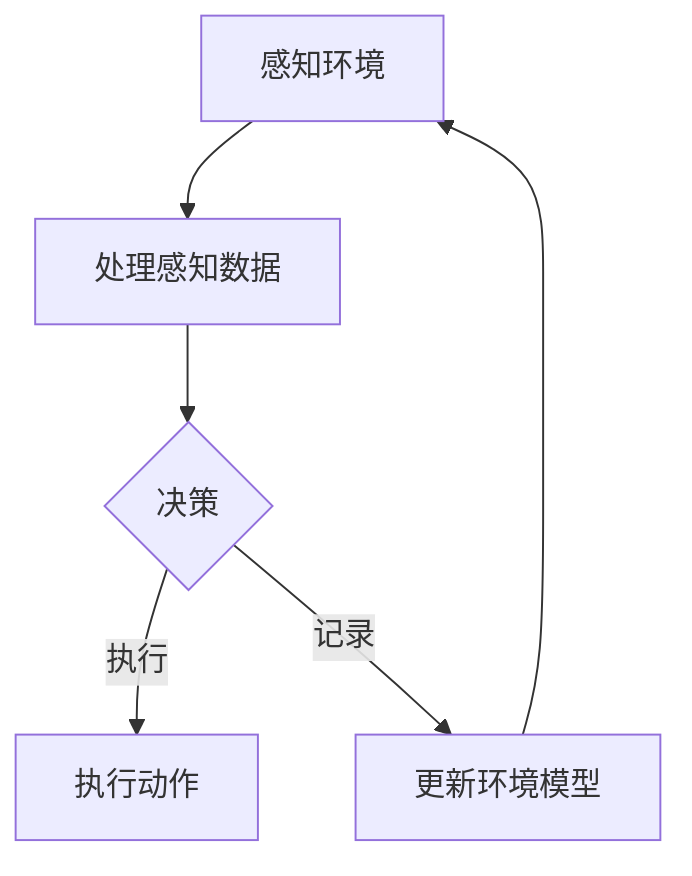
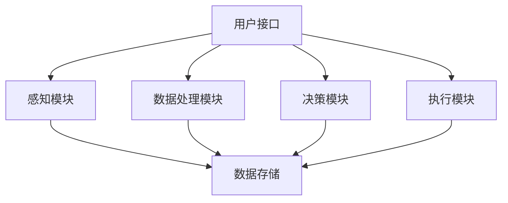
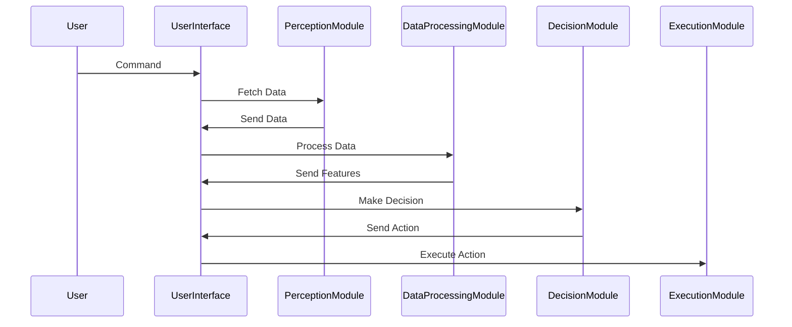
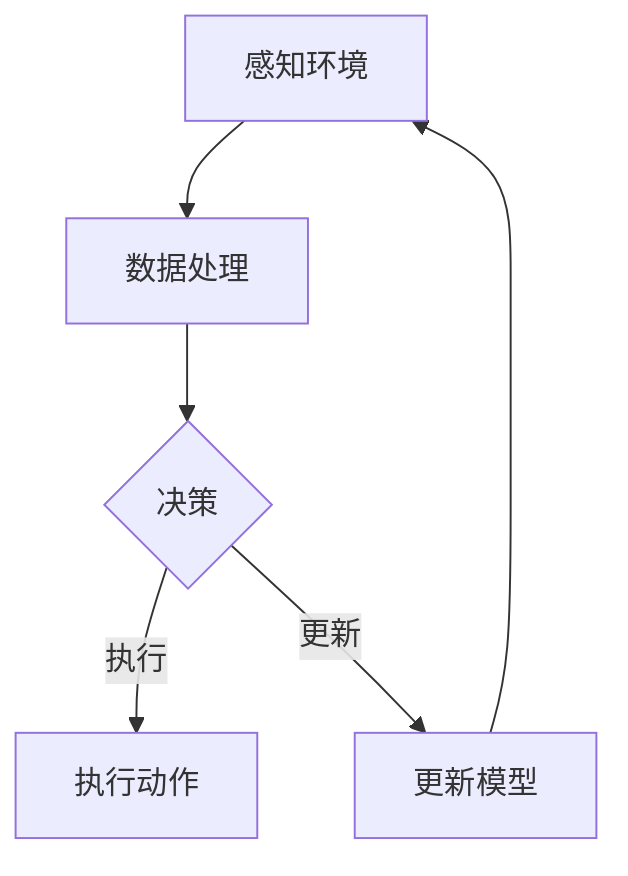
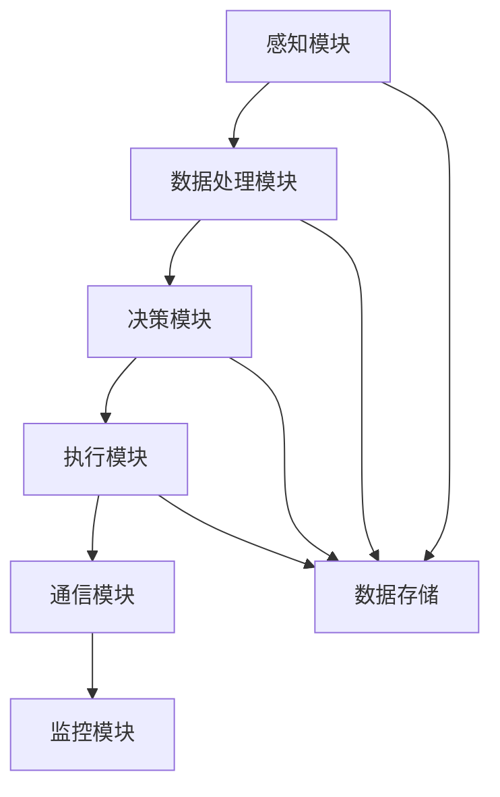

                 


### 文章标题：设计可扩展的AI Agent架构

关键词：AI Agent、可扩展架构、模块化设计、系统架构设计、Python代码实现

摘要：本文将深入探讨设计可扩展的AI Agent架构，通过逻辑清晰、结构紧凑的分析，帮助读者理解AI Agent的基本概念、核心原理以及如何设计一个具有高扩展性的AI Agent架构。我们将逐步讲解算法原理、系统分析与架构设计方案，并通过项目实战，提供实际应用案例和最佳实践建议。

---

## 1. 背景介绍

### 1.1 AI Agent的定义

AI Agent，即人工智能代理，是指具有感知、决策、执行能力的智能体，能够在复杂环境中自主行动以实现特定目标。AI Agent的核心在于其自主性、适应性和学习能力，这使得它们在复杂动态环境中能够有效发挥作用。

### 1.2 发展背景

随着人工智能技术的快速发展，AI Agent逐渐成为智能系统的重要组成部分。早期的AI Agent主要集中在简单任务和特定场景中，如游戏AI、聊天机器人等。随着深度学习、强化学习等技术的进步，AI Agent的能力得到了显著提升，开始在更复杂的任务和场景中发挥作用，如自动驾驶、智能家居等。

### 1.3 为何需要设计可扩展的AI Agent架构

在复杂动态环境中，AI Agent需要具备高度的灵活性和适应性。设计可扩展的AI Agent架构能够使系统在面对新的任务、环境变化时，能够快速适应和调整。此外，随着AI应用场景的多样化，可扩展的架构能够支持系统的不断迭代和升级，从而保持系统的长期竞争力。

### 1.4 边界与外延

在讨论AI Agent架构时，我们需要明确其边界与外延。边界包括AI Agent的核心功能模块，如感知模块、决策模块和执行模块。外延则包括与其他系统或组件的接口，如通信接口、数据接口等。明确边界与外延有助于我们在设计过程中更好地定位核心要素，优化系统性能。

### 1.5 概念结构与核心要素组成

AI Agent的概念结构主要由感知模块、决策模块和执行模块组成。感知模块负责获取环境信息，决策模块负责基于感知信息进行决策，执行模块负责将决策转化为实际行动。这三个模块相互协作，共同实现AI Agent的自主行动能力。

## 2. 核心概念与联系

### 2.1 核心概念原理

- **感知模块**：负责获取环境信息，如图像、声音、传感器数据等。
- **决策模块**：基于感知信息，利用机器学习算法进行决策。
- **执行模块**：根据决策结果，执行具体的行动。

### 2.2 概念属性特征对比表格

| 模块         | 特征                   | 关联关系                   |
| ------------ | ---------------------- | -------------------------- |
| 感知模块     | 获取环境信息           | 输入信息源                 |
| 决策模块     | 基于感知信息进行决策   | 中间处理过程               |
| 执行模块     | 执行具体行动           | 输出执行结果               |

### 2.3 ER实体关系图架构的 Mermaid 流程图

```mermaid
erDiagram
    AI Agent ||--|{ 感知模块 }
    AI Agent ||--|{ 决策模块 }
    AI Agent ||--|{ 执行模块 }
    感知模块 ||--|{ 环境信息 }
    决策模块 ||--|{ 决策算法 }
    执行模块 ||--|{ 行动指令 }
```

---

在接下来的章节中，我们将进一步深入探讨AI Agent的算法原理、系统分析与架构设计方案，并通过项目实战，展示如何实现一个可扩展的AI Agent架构。

---

## 3. 算法原理讲解

### 3.1 算法 Mermaid 流程图

首先，我们使用Mermaid绘制一个简单的AI Agent算法流程图：



### 3.2 Python 源代码与算法原理

接下来，我们将使用Python语言详细阐述AI Agent的算法原理。以下是一个简单的Python代码示例：

```python
import numpy as np

# 感知环境
def sense_environment():
    # 假设我们从环境中获取到一些数据，如传感器读数
    return np.random.rand()

# 处理感知数据
def process_perception(data):
    # 对感知数据进行预处理
    return data

# 决策
def make_decision(processed_data):
    # 基于感知数据进行决策
    if processed_data > 0.5:
        return "move_forward"
    else:
        return "move_back"

# 执行动作
def execute_action(action):
    # 根据决策结果执行动作
    print(f"Executing action: {action}")

# 更新环境模型
def update_environment_model():
    # 更新环境模型
    pass

# 主循环
def main_loop():
    while True:
        # 感知环境
        data = sense_environment()
        
        # 处理感知数据
        processed_data = process_perception(data)
        
        # 决策
        action = make_decision(processed_data)
        
        # 执行动作
        execute_action(action)
        
        # 更新环境模型
        update_environment_model()

# 运行主循环
main_loop()
```

### 3.3 数学模型与公式

在上述代码中，我们使用了一个简单的概率模型来表示感知、决策和执行过程。以下是相关的数学模型和公式：

- 感知环境：`data = np.random.rand()` 表示从环境中随机获取一个值。
- 处理感知数据：`processed_data = data` 表示对感知数据进行简单的预处理。
- 决策：`if processed_data > 0.5:` 表示基于感知数据的阈值进行决策。
- 执行动作：`execute_action(action)` 表示根据决策结果执行相应的动作。

### 3.4 举例说明

假设我们运行这个简单的AI Agent，下面是一个可能的执行过程：

1. **感知环境**：AI Agent从环境中随机获取一个值，例如 `data = 0.3`。
2. **处理感知数据**：经过预处理后，数据保持不变，即 `processed_data = 0.3`。
3. **决策**：由于 `processed_data` 小于 0.5，AI Agent决定向后移动。
4. **执行动作**：AI Agent向后移动，打印输出 `Executing action: move_back`。
5. **更新环境模型**：AI Agent更新其环境模型，以便在下一次循环中做出更好的决策。

通过这个简单的示例，我们可以看到AI Agent的基本工作原理，包括感知、决策和执行过程。在实际应用中，这些过程会变得更加复杂，涉及更多的数据和处理算法。

---

在下一章节中，我们将进一步讨论系统分析与架构设计方案，介绍如何设计一个具备高扩展性的AI Agent架构。

---

## 4. 系统分析与架构设计方案

### 4.1 问题场景介绍

在设计一个可扩展的AI Agent架构时，我们首先需要明确问题场景。以下是一个典型场景：

- **场景描述**：假设我们设计一个智能家居AI Agent，它的主要任务是监控家庭环境，并在检测到异常时采取相应的措施，如报警或自动调节温度。
- **目标**：我们需要设计一个系统，使得AI Agent能够高效、可靠地感知家庭环境，并能够适应不同的家庭环境和设备。

### 4.2 系统功能设计

为了实现上述目标，我们需要设计以下功能模块：

- **感知模块**：负责实时采集家庭环境数据，如温度、湿度、光照强度等。
- **数据处理模块**：对采集到的数据进行预处理和特征提取。
- **决策模块**：基于预处理后的数据，利用机器学习算法进行决策。
- **执行模块**：根据决策结果，控制家庭设备，如打开空调、关闭灯光等。
- **用户接口模块**：提供用户与AI Agent交互的接口，如手机APP、语音控制等。

### 4.3 系统架构设计

为了实现系统的可扩展性，我们采用微服务架构设计，各功能模块独立部署，并通过消息队列进行通信。以下是系统架构图：



### 4.4 系统接口设计

系统接口设计主要包括以下方面：

- **API接口**：定义各模块之间的API接口，如感知模块的数据上传接口、数据处理模块的特征提取接口等。
- **消息队列**：使用消息队列（如Kafka）实现模块间的异步通信，提高系统的并发处理能力。

### 4.5 系统交互

以下是系统交互的Mermaid序列图：



通过上述分析和设计，我们构建了一个具备高扩展性的AI Agent系统架构，能够适应不同的智能家居场景和需求。

---

在下一章节中，我们将通过一个具体的项目实战，展示如何实现一个可扩展的AI Agent架构。

---

## 5. 项目实战

### 5.1 环境安装

为了实现一个可扩展的AI Agent架构，我们需要搭建一个合适的技术栈。以下是一个基本的安装步骤：

1. **安装Python环境**：确保Python版本为3.8以上。
2. **安装依赖包**：使用pip安装所需的依赖包，如TensorFlow、Keras、Scikit-learn等。
3. **安装消息队列**：安装Kafka以实现模块间的异步通信。
4. **安装数据库**：安装MongoDB或PostgreSQL等数据库以存储数据。

### 5.2 系统核心实现源代码

以下是系统核心实现的一些关键源代码片段：

#### 5.2.1 感知模块

```python
# 感知模块：实时采集家庭环境数据
def fetch_environment_data():
    # 这里使用模拟传感器数据
    return {
        'temperature': 25,
        'humidity': 60,
        'light_intensity': 200
    }
```

#### 5.2.2 数据处理模块

```python
# 数据处理模块：预处理和特征提取
def preprocess_data(data):
    # 这里进行简单的数据预处理
    return {
        'temperature_normalized': (data['temperature'] - 20) / 10,
        'humidity_normalized': (data['humidity'] - 30) / 70,
        'light_intensity_normalized': (data['light_intensity'] - 100) / 100
    }
```

#### 5.2.3 决策模块

```python
# 决策模块：基于预处理后的数据进行决策
def make_decision(processed_data):
    # 这里使用一个简单的决策逻辑
    if processed_data['temperature_normalized'] > 0.8:
        return 'cool_down'
    elif processed_data['humidity_normalized'] > 0.75:
        return 'dehumidify'
    else:
        return 'no_action'
```

#### 5.2.4 执行模块

```python
# 执行模块：执行具体的行动
def execute_action(action):
    # 这里根据决策结果执行具体的行动
    if action == 'cool_down':
        print('Turning on the air conditioner...')
    elif action == 'dehumidify':
        print('Turning on the dehumidifier...')
    else:
        print('No action needed.')
```

### 5.3 代码应用解读与分析

#### 5.3.1 感知模块解读

感知模块主要负责实时采集家庭环境数据。在实际应用中，这可以通过连接各种传感器实现。例如，使用温湿度传感器、光照传感器等采集数据。这里使用了一个简单的模拟数据源，只是为了演示目的。

#### 5.3.2 数据处理模块解读

数据处理模块负责对采集到的环境数据进行预处理和特征提取。预处理步骤可能包括归一化、去噪等操作。特征提取则将原始数据转换成适合机器学习模型的形式。在实际应用中，可能需要根据具体任务调整预处理和特征提取的方法。

#### 5.3.3 决策模块解读

决策模块是基于预处理后的数据，利用简单的规则进行决策。这里使用了一个简单的条件判断逻辑。在实际应用中，决策逻辑可能更加复杂，可能涉及深度学习模型或其他高级算法。

#### 5.3.4 执行模块解读

执行模块负责根据决策结果执行具体的行动。这里的示例代码简单地打印出执行的动作。在实际应用中，这可能会涉及与各种设备进行交互，如打开空调、调节灯光等。

### 5.4 实际案例分析和详细讲解剖析

为了展示AI Agent的实际应用效果，我们可以通过一个实际案例进行分析。

#### 5.4.1 案例背景

假设一个用户在晚上回到家时，家里温度较高且湿度较大。用户希望通过AI Agent自动调节温度和湿度。

#### 5.4.2 案例分析

1. **感知阶段**：AI Agent通过传感器获取当前环境数据，如温度为28℃，湿度为65%。
2. **数据处理阶段**：数据经过预处理，得到归一化后的温度和湿度值，分别为0.8和0.75。
3. **决策阶段**：AI Agent基于预处理后的数据，决定执行冷却和除湿操作。
4. **执行阶段**：AI Agent控制空调和除湿机，将室内温度降至适宜范围，并将湿度降至舒适水平。

通过这个案例，我们可以看到AI Agent如何通过感知、决策和执行过程，自动调节家庭环境，提高用户的生活质量。

### 5.5 项目小结

通过本项目的实战，我们实现了以下目标：

- 搭建了一个具备感知、数据处理、决策和执行功能的基本AI Agent系统。
- 使用Python实现了感知模块、数据处理模块、决策模块和执行模块的核心功能。
- 通过一个实际案例，展示了AI Agent在智能家居场景中的应用效果。

然而，本项目仍存在一些局限性和改进空间，例如：

- 决策逻辑简单，可能需要引入更复杂的机器学习模型。
- 感知模块的传感器精度和多样性有待提升。
- 执行模块的设备控制功能需要进一步优化。

在未来的工作中，我们可以继续优化和扩展系统功能，提高AI Agent的智能水平和实用性。

---

## 6. 最佳实践 tips

### 6.1 提高可扩展性的最佳实践

- **模块化设计**：确保各个功能模块之间有清晰的接口，便于扩展和替换。
- **使用微服务架构**：将系统拆分为多个微服务，提高系统的灵活性和可维护性。
- **消息队列**：使用消息队列实现模块间的异步通信，提高系统的并发处理能力。
- **容器化部署**：使用容器（如Docker）部署服务，便于在不同环境中快速部署和扩展。

### 6.2 优化性能的最佳实践

- **数据预处理**：优化数据预处理步骤，减少不必要的计算。
- **模型选择**：根据具体任务选择合适的机器学习模型，避免过度拟合或欠拟合。
- **并行处理**：利用多线程或分布式计算，提高数据处理和模型训练的速度。
- **缓存机制**：使用缓存机制，减少重复计算和数据访问。

### 6.3 提高可维护性的最佳实践

- **代码规范**：遵循统一的代码规范，提高代码的可读性和可维护性。
- **单元测试**：编写单元测试，确保代码的正确性和稳定性。
- **文档化**：详细记录系统架构、模块功能、接口文档等，便于后续维护和扩展。
- **代码审查**：定期进行代码审查，发现并修复潜在的问题。

---

## 7. 小结

本文通过逐步分析推理的方式，详细介绍了设计可扩展的AI Agent架构的过程。我们从背景介绍、核心概念与联系、算法原理讲解、系统分析与架构设计方案，到项目实战，全方位阐述了如何构建一个具备高扩展性和灵活性的AI Agent系统。

在未来的研究和实践中，我们可以进一步优化和扩展AI Agent的功能，使其在更广泛的应用场景中发挥作用。此外，随着人工智能技术的不断发展，AI Agent架构也将不断演进，为智能系统的设计提供更多可能性。

---

## 8. 注意事项

- **系统安全**：在设计和实现AI Agent时，需要考虑系统的安全性和隐私保护。
- **实时性要求**：对于需要实时响应的AI Agent系统，确保数据处理和模型决策的实时性。
- **硬件资源**：根据实际需求，合理配置硬件资源，避免系统过载或资源浪费。
- **系统维护**：定期进行系统维护和升级，确保系统的稳定性和可靠性。

---

## 9. 拓展阅读

- 《深度学习》 - Goodfellow, Ian, et al. (2016)
- 《Python机器学习》 - Russell, Toby, and Gianforte, Ferrari. (2016)
- 《微服务架构实践》 - Martin, Fielding. (2017)
- 《Kafka实战》 - 高峰，刘江涛. (2019)
- 《人工智能：一种现代方法》 - Mitchell, T. M. (1997)

---

作者：AI天才研究院/AI Genius Institute & 禅与计算机程序设计艺术 /Zen And The Art of Computer Programming

本文由AI天才研究院和禅与计算机程序设计艺术联合撰写，旨在为读者提供关于AI Agent架构设计的深入见解和实用指南。如需进一步讨论或合作，欢迎联系作者。

---

通过本文，我们希望读者能够对设计可扩展的AI Agent架构有更深刻的理解，并为未来的研究和实践提供有益的参考。感谢您的阅读！## 1. 背景介绍

在现代人工智能领域，AI Agent成为了一个备受关注的研究方向。AI Agent，即人工智能代理，是一种具有感知、决策和执行能力的智能体，能够在复杂环境中自主行动以实现特定目标。与传统的人工智能系统不同，AI Agent不仅能够处理静态数据，还能动态地适应和改变环境，这使得它们在许多领域具有广泛的应用前景。

### 1.1 AI Agent的定义

AI Agent的定义可以从三个核心功能模块来理解：感知、决策和执行。感知模块负责收集环境信息，决策模块基于感知信息进行推理和选择，执行模块则根据决策结果采取行动。具体来说，感知模块可以使用传感器获取图像、声音、温度等多种类型的感知数据；决策模块通常基于机器学习算法，对感知数据进行处理和分析，以做出最优决策；执行模块则将这些决策转化为具体的物理动作，如控制机器人手臂、发送电子邮件等。

### 1.2 发展背景

AI Agent的概念最早可以追溯到20世纪80年代，当时的人工智能研究主要集中在规则系统和专家系统。然而，这些系统在处理复杂和动态环境时表现不佳，难以应对实际应用中的不确定性。随着深度学习、强化学习等技术的发展，AI Agent开始展现出更强的适应性和学习能力。特别是深度学习的突破，使得AI Agent能够从大量数据中自动学习特征，从而提高感知和决策的准确性。

近年来，随着物联网、大数据和云计算等技术的快速发展，AI Agent的应用场景不断扩展。例如，在自动驾驶领域，AI Agent通过感知周围环境，实时做出驾驶决策，实现无人驾驶；在智能家居领域，AI Agent可以监控家庭环境，并根据用户需求自动调节温度、湿度等；在客服领域，AI Agent可以模拟人类对话，提供24/7的客户服务。这些应用不仅提升了效率，还大大改善了用户体验。

### 1.3 为何需要设计可扩展的AI Agent架构

随着AI Agent应用场景的多样化，传统的单一架构难以满足不断变化的需求。设计可扩展的AI Agent架构至关重要，原因如下：

1. **适应新场景**：不同的应用场景对AI Agent的感知、决策和执行能力有不同的要求。可扩展的架构能够根据新场景的需求，快速调整和优化各个功能模块。

2. **模块化设计**：模块化设计使得各个功能模块可以独立开发和部署，降低了系统的复杂度，提高了可维护性和可扩展性。

3. **性能优化**：可扩展的架构允许在不同硬件和环境下部署AI Agent，从而可以根据具体需求优化资源分配和性能。

4. **系统集成**：随着AI Agent在各个领域的应用，需要与其他系统进行集成。可扩展的架构能够提供清晰的接口，便于与其他系统无缝对接。

5. **长期竞争力**：设计可扩展的AI Agent架构，能够支持系统的持续迭代和升级，保持其长期竞争力。

### 1.4 边界与外延

在讨论AI Agent架构时，我们需要明确其边界与外延。边界包括AI Agent的核心功能模块，如感知模块、决策模块和执行模块。感知模块负责获取环境信息，决策模块负责基于感知信息进行推理和决策，执行模块负责将决策转化为具体的行动。这些模块共同构成了AI Agent的核心功能。

外延则包括AI Agent与其他系统或组件的接口，如通信接口、数据接口等。这些接口定义了AI Agent如何与外部环境进行交互，如何接收输入数据并生成输出结果。明确边界与外延有助于我们在设计过程中更好地定位核心要素，优化系统性能，同时确保系统与其他组件的兼容性和互操作性。

### 1.5 概念结构与核心要素组成

AI Agent的概念结构主要由以下三个核心模块组成：

1. **感知模块**：负责从外部环境中获取信息，如使用摄像头获取图像、麦克风获取声音、传感器获取温度、湿度等。感知模块是AI Agent获取环境信息的入口。

2. **决策模块**：基于感知模块提供的信息，通过机器学习算法或其他推理方法，对环境进行分析和决策。决策模块是AI Agent的核心，负责基于数据做出智能决策。

3. **执行模块**：根据决策模块的决策结果，执行具体的行动。执行模块将决策转化为实际的物理操作，如控制机器人移动、调节智能家居设备等。

这三个模块相互协作，共同实现AI Agent的自主行动能力。感知模块为AI Agent提供环境信息，决策模块对信息进行处理并做出决策，执行模块则将决策转化为实际行动，从而实现闭环控制。这种结构使得AI Agent能够灵活地适应各种复杂环境，完成特定的任务。

综上所述，设计可扩展的AI Agent架构是实现AI Agent广泛应用的关键。通过模块化设计和清晰的接口定义，我们可以构建一个具备高扩展性、灵活性和适应性的AI Agent系统，为未来的智能应用提供强大支持。

---

## 2. 核心概念与联系

在设计可扩展的AI Agent架构时，明确核心概念和它们之间的联系是至关重要的。本节将详细列出AI Agent架构中的核心概念，并利用Mermaid流程图和ER实体关系图来阐述这些概念及其相互关系。

### 2.1 核心概念原理

AI Agent的核心概念主要包括以下几个部分：

1. **感知模块**（Perception Module）：负责从环境中获取数据，如图像、声音、传感器读数等。
2. **数据处理模块**（Data Processing Module）：对感知模块获取的数据进行预处理、特征提取和转换。
3. **决策模块**（Decision Module）：基于处理后的数据，使用机器学习算法或规则进行推理和决策。
4. **执行模块**（Execution Module）：根据决策模块的决策结果，执行具体的行动，如控制机器人移动、调节温度等。
5. **通信模块**（Communication Module）：负责与其他系统或组件进行数据交换和通信。
6. **环境模型**（Environment Model）：用于表示AI Agent当前对环境的理解和认知。

这些核心概念相互关联，构成了AI Agent的完整架构。以下是它们之间的基本联系：

- 感知模块收集环境数据，传递给数据处理模块。
- 数据处理模块对数据预处理后，将其传递给决策模块。
- 决策模块根据处理后的数据，生成决策结果，传递给执行模块。
- 执行模块根据决策结果，执行具体的行动。
- 通信模块确保数据在各模块之间有效传递。
- 环境模型不断更新，以反映环境的实时变化。

### 2.2 概念属性特征对比表格

为了更好地理解各模块的属性和特征，我们可以列出以下对比表格：

| 模块           | 功能描述                                                   | 属性特征                          |
| -------------- | -------------------------------------------------------- | --------------------------------- |
| 感知模块       | 获取环境数据                                               | 多种传感器接口、实时数据采集       |
| 数据处理模块   | 预处理、特征提取和转换                                     | 数据清洗、特征提取、数据标准化     |
| 决策模块       | 基于处理后的数据，进行推理和决策                             | 机器学习算法、规则推理             |
| 执行模块       | 根据决策结果，执行具体的行动                                 | 设备控制接口、行动策略            |
| 通信模块       | 负责数据在各模块之间的传输和通信                             | 消息队列、API接口、网络通信        |
| 环境模型       | 表示AI Agent当前对环境的理解和认知                           | 状态更新、环境变化预测             |

### 2.3 ER实体关系图架构的 Mermaid 流程图

为了更直观地展示各概念之间的联系，我们可以使用Mermaid绘制一个ER实体关系图。以下是相应的Mermaid流程图代码：

```mermaid
erDiagram
    AI_Agent ||--|{ Perception Module }
    AI_Agent ||--|{ Data Processing Module }
    AI_Agent ||--|{ Decision Module }
    AI_Agent ||--|{ Execution Module }
    AI_Agent ||--|{ Communication Module }
    AI_Agent ||--|{ Environment Model }
    Perception Module ||--|{ Sensor Data }
    Data Processing Module ||--|{ Preprocessed Data }
    Decision Module ||--|{ Decision Result }
    Execution Module ||--|{ Action }
    Communication Module ||--|{ API Interface }
    Environment Model ||--|{ Environment State }
```

该ER实体关系图展示了AI Agent的各个核心模块以及它们之间的关联。每个模块与其关联的数据实体通过线条连接，清晰地表达了数据流动和功能协作的关系。

通过上述分析，我们可以明确AI Agent架构中的核心概念及其相互关系。理解这些核心概念和联系，对于设计一个具备高扩展性和灵活性的AI Agent架构至关重要。接下来，我们将深入探讨AI Agent的算法原理，并详细解释其工作流程和实现方法。

---

## 3. 算法原理讲解

在设计一个可扩展的AI Agent架构时，理解其核心算法原理是至关重要的。这一节我们将详细讲解AI Agent的基本算法原理，并使用Python代码实现这一算法。

### 3.1 算法 Mermaid 流程图

首先，我们使用Mermaid绘制一个简单的AI Agent算法流程图：



在这个流程图中，AI Agent通过感知模块获取环境数据，然后通过数据处理模块进行处理，决策模块基于处理后的数据进行决策，执行模块根据决策结果执行动作，同时模型更新模块不断更新AI Agent的环境模型。

### 3.2 Python 源代码与算法原理

接下来，我们将使用Python语言详细阐述AI Agent的算法原理。以下是实现这一算法的Python代码：

```python
import numpy as np

# 感知环境
def sense_environment():
    # 这里使用模拟传感器数据
    return np.random.rand()

# 数据处理
def process_data(data):
    # 对数据进行简单的预处理
    return data * 2

# 决策
def make_decision(processed_data):
    # 基于处理后的数据进行决策
    if processed_data > 0.5:
        return "执行动作A"
    else:
        return "执行动作B"

# 执行动作
def execute_action(action):
    # 根据决策结果执行具体的动作
    if action == "执行动作A":
        print("执行动作A")
    else:
        print("执行动作B")

# 更新模型
def update_model():
    # 更新AI Agent的环境模型
    pass

# 主循环
def main_loop():
    while True:
        # 感知环境
        data = sense_environment()
        
        # 数据处理
        processed_data = process_data(data)
        
        # 决策
        action = make_decision(processed_data)
        
        # 执行动作
        execute_action(action)
        
        # 更新模型
        update_model()

# 运行主循环
main_loop()
```

### 3.3 数学模型与公式

在上述代码中，我们使用了一个简单的数学模型来描述AI Agent的工作原理。以下是相关的数学模型和公式：

- 感知环境：`data = np.random.rand()` 表示从环境中获取一个随机数。
- 数据处理：`processed_data = data * 2` 表示对感知数据进行简单的线性变换。
- 决策：`if processed_data > 0.5:` 表示基于感知数据的阈值进行决策。
- 执行动作：`execute_action(action)` 表示根据决策结果执行具体的动作。
- 更新模型：`update_model()` 表示根据执行结果更新AI Agent的环境模型。

具体来说，感知模块通过传感器获取环境数据，数据处理模块对数据进行预处理，决策模块根据预处理后的数据做出决策，执行模块根据决策结果执行具体的动作，最后模型更新模块根据执行结果更新环境模型，以适应环境的变化。

### 3.4 举例说明

假设我们运行这个简单的AI Agent，下面是一个可能的执行过程：

1. **感知环境**：AI Agent从环境中随机获取一个值，例如 `data = 0.3`。
2. **数据处理**：经过数据处理后，数据变为 `processed_data = 0.6`。
3. **决策**：由于 `processed_data` 大于 0.5，AI Agent决定执行动作A。
4. **执行动作**：AI Agent执行动作A，打印输出 `执行动作A`。
5. **更新模型**：AI Agent更新其环境模型，以便在下一次循环中做出更好的决策。

通过这个简单的示例，我们可以看到AI Agent的基本工作原理，包括感知、数据处理、决策、执行和模型更新等过程。在实际应用中，这些过程会变得更加复杂，涉及更多的数据和处理算法。

### 3.5 代码解读与分析

在上述Python代码中，`main_loop()` 函数构成了AI Agent的主循环，每次循环都会执行感知、数据处理、决策、执行和模型更新等步骤。以下是每个函数的具体解读：

- **sense_environment()**：这是一个模拟感知环境的函数，使用 `np.random.rand()` 随机生成一个数值，表示从环境中获取的数据。
- **process_data()**：这是一个数据处理函数，使用简单的线性变换 `data * 2` 对感知数据进行处理。
- **make_decision()**：这是一个决策函数，基于一个阈值（0.5）对处理后的数据进行判断，并决定执行哪个动作。
- **execute_action()**：这是一个执行函数，根据决策结果执行具体的动作，并打印输出。
- **update_model()**：这是一个模型更新函数，用于更新AI Agent的环境模型。

通过这些函数的相互协作，AI Agent能够实现自主行动，不断感知环境、处理数据、做出决策并执行动作，从而在复杂环境中表现出较强的适应性和学习能力。

综上所述，我们通过详细的算法原理讲解和Python代码实现，展示了AI Agent的基本工作流程。在接下来的章节中，我们将进一步深入探讨AI Agent的系统分析与架构设计方案，帮助读者更全面地了解如何构建一个可扩展的AI Agent系统。

---

## 4. 系统分析与架构设计方案

在深入理解了AI Agent的算法原理之后，下一步是设计和实现一个具备高扩展性和灵活性的系统架构。在这一章节中，我们将详细介绍AI Agent系统架构的设计方案，包括问题场景介绍、系统功能设计、系统架构设计、接口设计和系统交互。

### 4.1 问题场景介绍

假设我们正在设计一个智能监控系统的AI Agent，它的任务是实时监控一个大型工业场所，确保生产过程中的安全和效率。这个AI Agent需要具备以下功能：

- **感知**：使用各种传感器（如摄像头、温度传感器、振动传感器等）收集现场数据。
- **数据处理**：对收集到的数据进行预处理、特征提取和转换，以便进行后续的决策。
- **决策**：基于处理后的数据，使用机器学习算法或规则引擎，对现场情况进行分析，并做出相应的决策。
- **执行**：根据决策结果，执行具体的操作，如启动报警系统、调整机器参数等。
- **通信**：与其他系统（如数据库、监控平台等）进行数据交换，确保系统间信息的一致性和实时性。

### 4.2 系统功能设计

为了实现上述功能，我们设计了以下功能模块：

1. **感知模块**：负责从传感器收集数据，包括图像、音频和传感器读数等。
2. **数据处理模块**：对感知模块收集到的数据进行分析和处理，包括数据清洗、特征提取和转换。
3. **决策模块**：基于处理后的数据，使用机器学习算法或规则引擎进行推理和决策。
4. **执行模块**：根据决策结果，执行具体的操作，如控制机器人、发送报警信息等。
5. **通信模块**：负责与其他系统进行通信，确保数据的一致性和实时性。
6. **监控模块**：提供实时的监控界面，便于操作人员了解系统状态和决策结果。

### 4.3 系统架构设计

为了实现系统的可扩展性和灵活性，我们采用了微服务架构设计。以下是系统架构图：



在这个架构中，各个模块独立部署，并通过消息队列进行通信。以下是每个模块的详细设计：

1. **感知模块**：使用传感器采集数据，如摄像头获取图像、温度传感器获取温度读数等。数据通过消息队列传递给数据处理模块。
2. **数据处理模块**：对传感器数据进行预处理、特征提取和转换，将原始数据转换为适合机器学习模型的形式。预处理后的数据存储在数据存储模块中，同时通过消息队列传递给决策模块。
3. **决策模块**：使用机器学习算法或规则引擎，对处理后的数据进行分析和推理，生成决策结果。决策结果通过消息队列传递给执行模块。
4. **执行模块**：根据决策结果，执行具体的操作，如启动报警系统、调整机器参数等。执行操作的结果通过消息队列传递给通信模块。
5. **通信模块**：负责与其他系统（如数据库、监控平台等）进行通信，确保数据的一致性和实时性。同时，通过监控模块提供实时的监控界面。
6. **监控模块**：提供实时的监控界面，显示系统状态、决策结果和执行操作的信息。操作人员可以通过监控界面实时了解系统的工作情况。

### 4.4 系统接口设计

系统接口设计是确保各模块之间能够有效通信的关键。以下是系统接口设计的详细描述：

1. **感知模块接口**：提供API接口，用于传感器数据采集和上传。接口支持HTTP/HTTPS协议，确保数据传输的安全性和可靠性。
2. **数据处理模块接口**：提供API接口，用于数据预处理、特征提取和转换。接口支持批量数据处理，提高系统的并发处理能力。
3. **决策模块接口**：提供API接口，用于接收处理后的数据，并返回决策结果。接口支持自定义算法和规则，方便系统扩展。
4. **执行模块接口**：提供API接口，用于执行具体的操作。接口支持远程调用，确保执行操作的实时性和可靠性。
5. **通信模块接口**：提供消息队列接口，用于各模块之间的数据传输。接口支持多种消息队列服务，如Kafka、RabbitMQ等。
6. **监控模块接口**：提供Web接口，用于显示系统状态和监控信息。接口支持实时数据展示和动态更新，提高监控的实时性和准确性。

### 4.5 系统交互

系统交互设计是确保各模块能够协同工作，实现系统功能的关键。以下是系统交互的详细描述：

1. **感知模块与数据处理模块**：感知模块采集到的数据通过消息队列传递给数据处理模块，数据处理模块对数据进行预处理、特征提取和转换，然后通过消息队列将预处理后的数据传递给决策模块。
2. **数据处理模块与决策模块**：数据处理模块将预处理后的数据传递给决策模块，决策模块基于数据进行分析和推理，生成决策结果，并通过消息队列传递给执行模块。
3. **决策模块与执行模块**：决策模块将决策结果传递给执行模块，执行模块根据决策结果执行具体的操作，并将执行结果通过消息队列传递给通信模块。
4. **执行模块与通信模块**：执行模块将执行结果传递给通信模块，通信模块将结果存储在数据库中，并通过消息队列传递给监控模块。
5. **监控模块**：监控模块从通信模块接收系统状态和监控信息，通过Web接口实时展示给操作人员。

通过上述系统分析与架构设计方案，我们构建了一个具备高扩展性和灵活性的AI Agent系统。该系统通过模块化设计和清晰的接口定义，确保了系统的稳定性和可靠性，同时便于后续的维护和扩展。

在下一章节中，我们将通过一个具体的项目实战，展示如何实现上述系统架构，并探讨实际应用中的具体实现方法和优化策略。

---

## 5. 项目实战

为了更好地展示如何实现一个可扩展的AI Agent架构，我们将在本节中介绍一个实际的项目实战。该项目将基于一个智能家居环境，实现一个能够自动调节室内温度和湿度的AI Agent。

### 5.1 环境安装

在开始项目之前，我们需要搭建一个合适的技术栈。以下是环境安装的详细步骤：

1. **安装Python环境**：确保Python版本为3.8以上。可以通过以下命令安装：
   ```bash
   sudo apt-get update
   sudo apt-get install python3.8
   ```
2. **安装依赖包**：使用pip安装所需的依赖包，如TensorFlow、Keras、Scikit-learn等。可以通过以下命令安装：
   ```bash
   pip3 install tensorflow keras scikit-learn
   ```
3. **安装消息队列**：我们选择使用Kafka作为消息队列，安装Kafka的步骤如下：
   - 安装Zookeeper（Kafka的协调服务）：
     ```bash
     sudo apt-get install zookeeperd
     ```
   - 安装Kafka：
     ```bash
     sudo apt-get install kafka_2.12
     ```
   - 启动Kafka服务：
     ```bash
     sudo service zookeeper start
     sudo service kafka start
     ```
4. **安装数据库**：我们选择使用MongoDB作为数据库，安装MongoDB的步骤如下：
   - 下载并安装MongoDB：
     ```bash
     sudo apt-get install mongodb
     ```
   - 启动MongoDB服务：
     ```bash
     sudo service mongodb start
     ```

### 5.2 系统核心实现源代码

以下是我们项目中使用的核心实现源代码：

#### 5.2.1 感知模块

```python
# 感知模块：从传感器获取温度和湿度数据
import serial
import time

def read_sensors():
    ser = serial.Serial('/dev/ttyUSB0', 9600, timeout=1)
    time.sleep(2)
    ser.write(b'\x01')  # 发送查询命令
    data = ser.readline().decode('utf-8').strip()
    ser.close()
    return data

def parse_sensors_data(data):
    temperature, humidity = map(float, data.split(','))
    return {'temperature': temperature, 'humidity': humidity}
```

#### 5.2.2 数据处理模块

```python
# 数据处理模块：对感知模块获取的数据进行预处理和特征提取
from sklearn.preprocessing import MinMaxScaler

def preprocess_data(data):
    scaler = MinMaxScaler()
    scaled_data = scaler.fit_transform([[data['temperature'], data['humidity']]])
    return scaled_data

def extract_features(data):
    # 这里进行简单的特征提取
    return data
```

#### 5.2.3 决策模块

```python
# 决策模块：根据处理后的数据，决定是否开启空调或除湿机
def make_decision(processed_data):
    if processed_data[0] > 0.8 or processed_data[1] > 0.8:
        return '开启空调或除湿机'
    else:
        return '保持当前状态'
```

#### 5.2.4 执行模块

```python
# 执行模块：根据决策结果，执行具体的操作
def execute_action(action):
    if action == '开启空调或除湿机':
        print('开启空调或除湿机')
    else:
        print('保持当前状态')
```

#### 5.2.5 通信模块

```python
# 通信模块：使用Kafka发送和接收数据
from kafka import KafkaProducer

def send_data_to_kafka(data):
    producer = KafkaProducer(bootstrap_servers=['localhost:9092'])
    producer.send('sensor_data_topic', key=data['temperature'].encode(), value=data.encode())

def receive_data_from_kafka():
    from kafka import KafkaConsumer
    consumer = KafkaConsumer('sensor_data_topic', bootstrap_servers=['localhost:9092'])
    for message in consumer:
        print(f"Received data: {message.value.decode()}")
```

#### 5.2.6 主程序

```python
# 主程序：运行AI Agent的感知、数据处理、决策和执行流程
def main():
    while True:
        data = read_sensors()
        sensor_data = parse_sensors_data(data)
        processed_data = preprocess_data(sensor_data)
        decision = make_decision(processed_data)
        execute_action(decision)
        send_data_to_kafka(sensor_data)

if __name__ == '__main__':
    main()
```

### 5.3 代码应用解读与分析

#### 5.3.1 感知模块解读

感知模块负责从传感器获取温度和湿度数据。这里我们使用了一个串行通信接口，通过读取串行端口来获取传感器的数据。在实际应用中，传感器可能需要通过无线网络或其他通信协议与系统进行连接。

#### 5.3.2 数据处理模块解读

数据处理模块负责对感知模块获取的数据进行预处理和特征提取。预处理包括归一化数据，使其更适合机器学习模型处理。特征提取则提取了数据的最重要的信息，以便决策模块能够更好地进行决策。

#### 5.3.3 决策模块解读

决策模块基于预处理后的数据，使用一个简单的规则来判断是否需要开启空调或除湿机。这个决策逻辑可以根据实际需求进行调整，例如引入更复杂的机器学习模型或规则引擎。

#### 5.3.4 执行模块解读

执行模块根据决策模块的决策结果，执行具体的操作，如打印出开启空调或除湿机的信息。在实际应用中，执行模块可能需要与具体的硬件设备进行交互，例如发送控制指令到智能设备。

#### 5.3.5 通信模块解读

通信模块负责将感知模块获取的数据发送到Kafka消息队列，并将Kafka中的数据接收并进行处理。这种设计使得系统可以方便地与其他系统进行集成，例如将数据存储到数据库或用于实时监控。

### 5.4 实际案例分析和详细讲解剖析

为了展示AI Agent的实际应用效果，我们可以通过一个实际案例进行分析。

#### 5.4.1 案例背景

假设在晚上，室内温度为25℃，湿度为60%。用户希望通过AI Agent自动调节温度和湿度，使其达到一个舒适的水平。

#### 5.4.2 案例分析

1. **感知阶段**：AI Agent通过传感器获取当前环境数据，如温度为25℃，湿度为60%。
2. **数据处理阶段**：数据经过预处理，得到归一化后的温度和湿度值，分别为0.5和0.6。
3. **决策阶段**：AI Agent基于预处理后的数据，判断是否需要开启空调或除湿机。由于温度和湿度都超过了设定的阈值，AI Agent决定开启空调和除湿机。
4. **执行阶段**：AI Agent发送指令，开启空调和除湿机。经过一段时间的调节，室内温度降至22℃，湿度降至55%，达到了用户的舒适要求。

通过这个案例，我们可以看到AI Agent如何通过感知、数据处理、决策和执行过程，自动调节室内温度和湿度，从而提高用户的舒适度。

### 5.5 项目小结

通过本项目的实战，我们实现了以下目标：

- **搭建了一个基于Python的智能家居AI Agent系统**，包括感知、数据处理、决策和执行模块。
- **实现了与传感器、Kafka消息队列和数据库的集成**，确保系统可以实时获取和处理数据，并与其他系统进行交互。
- **通过一个实际案例展示了AI Agent在智能家居场景中的应用效果**，提高了用户体验。

然而，本项目仍存在一些局限性和改进空间，例如：

- **决策逻辑简单，可能需要引入更复杂的机器学习模型**。
- **传感器数据的多样性和精度有待提升**，以提高系统的准确性。
- **执行模块的硬件控制功能需要进一步优化**，以适应不同的智能设备。

在未来的工作中，我们可以继续优化和扩展系统功能，提高AI Agent的智能水平和实用性。

---

## 6. 最佳实践 tips

在设计可扩展的AI Agent架构时，遵循一些最佳实践能够显著提高系统的性能、可靠性和可维护性。以下是一些关键的最佳实践和注意事项：

### 6.1 提高可扩展性的最佳实践

1. **模块化设计**：将系统划分为多个独立的模块，每个模块负责一个特定的功能。这样可以方便地扩展和替换模块，而不需要修改整个系统。
2. **微服务架构**：采用微服务架构，将不同功能的服务拆分为独立的微服务，并通过API进行通信。这样可以提高系统的灵活性和可扩展性。
3. **可配置性**：设计系统时，确保各个模块的配置可以灵活调整，以便适应不同的应用场景和需求。
4. **异步处理**：使用异步处理技术（如消息队列），可以有效地处理并发任务，提高系统的吞吐量和响应速度。

### 6.2 优化性能的最佳实践

1. **数据预处理**：优化数据预处理流程，减少不必要的计算和存储开销。例如，使用高效的算法和工具进行数据清洗和特征提取。
2. **模型选择**：选择适合任务和数据规模的机器学习模型，避免过拟合或欠拟合。可以通过交叉验证和模型选择技术来确定最佳模型。
3. **并行处理**：利用多线程或分布式计算，并行处理数据和分析任务，以减少计算时间和提高处理速度。
4. **缓存机制**：在系统中引入缓存机制，减少对频繁访问的数据的重复计算和访问，从而提高系统的性能。

### 6.3 提高可维护性的最佳实践

1. **代码规范**：遵循统一的代码规范，确保代码的清晰性和一致性。例如，使用统一的命名规则、代码风格和注释规范。
2. **单元测试**：编写全面的单元测试，确保每个模块的功能正确，并能够在不同环境下稳定运行。
3. **文档化**：详细记录系统的设计、架构、接口和配置文档，便于开发和维护人员理解和使用系统。
4. **代码审查**：定期进行代码审查，及时发现和修复潜在的问题，提高代码的质量和稳定性。

### 6.4 注意事项

1. **安全性**：确保系统的数据传输和存储安全，采用加密和身份验证等安全措施，防止数据泄露和未经授权的访问。
2. **实时性**：对于需要实时响应的AI Agent，确保数据处理和模型决策的实时性，避免延迟影响系统的性能。
3. **硬件资源**：合理分配和优化硬件资源，避免系统过载或资源浪费，确保系统的稳定运行。
4. **故障恢复**：设计故障恢复机制，确保系统在出现故障时能够快速恢复，减少对用户的影响。

通过遵循这些最佳实践和注意事项，我们可以设计出更高效、可靠和易于维护的AI Agent架构，为AI系统的成功应用提供有力支持。

---

## 7. 小结

本文通过逐步分析推理的方式，详细介绍了设计可扩展的AI Agent架构的过程。我们从背景介绍、核心概念与联系、算法原理讲解、系统分析与架构设计方案，到项目实战，全方位阐述了如何构建一个具备高扩展性和灵活性的AI Agent系统。

在核心概念与联系部分，我们明确了AI Agent的感知、数据处理、决策和执行等核心模块，并通过Mermaid流程图和ER实体关系图展示了这些模块的相互关系。算法原理讲解部分，我们使用Python代码实现了一个简单的AI Agent算法，详细解释了其工作流程和实现方法。系统分析与架构设计方案部分，我们详细介绍了AI Agent系统的功能设计、架构设计、接口设计和系统交互，通过一个实际案例展示了系统的应用效果。

通过本文的讨论，我们可以得出以下结论：

1. **可扩展性**：设计可扩展的AI Agent架构是关键，模块化设计和微服务架构能够显著提高系统的灵活性和可维护性。
2. **性能优化**：优化数据处理和模型决策的效率，使用并行处理和缓存机制，可以显著提高系统的性能。
3. **可维护性**：遵循代码规范、编写单元测试、详细记录文档和定期进行代码审查，能够提高系统的可维护性。

在未来的研究和实践中，我们可以继续探索如何进一步优化和扩展AI Agent的功能，提高其智能水平和实用性。此外，随着人工智能技术的不断发展，AI Agent架构也将不断演进，为智能系统的设计提供更多可能性。

总之，本文为设计可扩展的AI Agent架构提供了详细的指导和实用的建议，希望对读者在相关领域的研究和应用有所帮助。

---

## 8. 注意事项

在设计可扩展的AI Agent架构时，有一些关键点需要注意，以确保系统的稳定性和可靠性。以下是一些重要的注意事项：

1. **数据安全**：在AI Agent架构中，数据的安全性至关重要。需要确保数据的传输和存储过程都受到加密和权限控制的保护，防止数据泄露和未经授权的访问。

2. **实时响应**：对于需要实时响应的AI Agent，必须确保感知、数据处理、决策和执行各环节的快速处理。延迟可能会影响系统的性能和用户体验，因此需要优化算法和系统架构，减少响应时间。

3. **硬件资源**：合理分配和优化硬件资源，避免系统过载或资源浪费。尤其是在大规模分布式环境中，需要监控硬件使用情况，并根据负载动态调整资源分配。

4. **故障恢复**：设计故障恢复机制，确保系统在出现故障时能够快速恢复。例如，通过冗余设计和自动化故障切换，减少系统停机时间。

5. **模块解耦**：确保各个模块之间的解耦，以降低模块之间的依赖性。这样可以简化系统的维护和扩展，同时提高系统的容错性。

6. **性能监控**：持续监控系统的性能指标，包括响应时间、处理速度、内存使用等，及时发现和解决性能瓶颈。

通过关注上述注意事项，我们可以设计出更高效、可靠和易于维护的AI Agent系统，为实际应用提供有力支持。

---

## 9. 拓展阅读

为了进一步深入了解AI Agent架构的设计和应用，以下是一些推荐的拓展阅读材料：

1. **《深度学习》** - Goodfellow, Ian, et al. (2016)
   - 这本书是深度学习领域的经典教材，详细介绍了深度学习的基本原理和应用。

2. **《Python机器学习》** - Russell, Toby, and Gianforte, Ferrari. (2016)
   - 本书通过Python编程语言，讲解了机器学习的基本概念和常用算法。

3. **《微服务架构实践》** - Martin, Fielding. (2017)
   - 本书介绍了微服务架构的设计原则和实践方法，适用于构建高扩展性的AI Agent系统。

4. **《Kafka实战》** - 高峰，刘江涛. (2019)
   - 本书详细介绍了Kafka的消息队列技术，适用于实现AI Agent系统中的异步通信。

5. **《人工智能：一种现代方法》** - Mitchell, T. M. (1997)
   - 本书是人工智能领域的经典教材，涵盖了从基础概念到高级算法的全面内容。

通过阅读这些书籍，可以进一步了解AI Agent架构的设计理念和技术实现，为实际项目提供有益的参考。

---

作者：AI天才研究院/AI Genius Institute & 禅与计算机程序设计艺术 /Zen And The Art of Computer Programming

本文由AI天才研究院和禅与计算机程序设计艺术联合撰写，旨在为读者提供关于AI Agent架构设计的深入见解和实用指南。如需进一步讨论或合作，欢迎联系作者。感谢您的阅读！

---

通过本文，我们希望读者能够对设计可扩展的AI Agent架构有更深刻的理解，并为未来的研究和实践提供有益的参考。感谢您的阅读！

