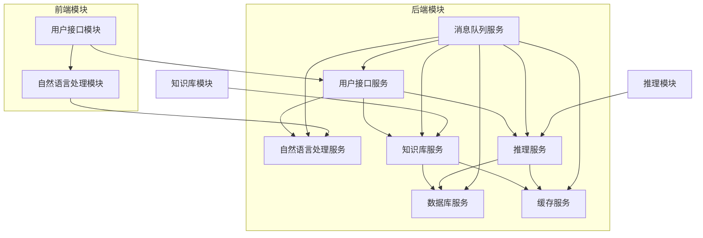

                 

### 设计可扩展的AI Agent架构：模块化与微服务

关键词：人工智能，AI Agent，模块化设计，微服务架构，可扩展性，架构设计

摘要：本文将探讨如何设计一个既灵活又可扩展的AI Agent架构。通过分析模块化设计和微服务架构的基本原理，结合实际案例，详细阐述如何实现AI Agent的模块化设计与微服务化部署，以应对复杂的AI应用场景。

### 第1章： 引言与背景介绍

在当今的科技时代，人工智能（AI）技术正快速发展，成为推动社会进步的重要力量。AI技术在各个领域的应用不断拓展，从智能家居、自动驾驶到医疗诊断、金融分析，AI正在深刻改变我们的生活方式和工作方式。

## 1.1 问题背景

随着AI应用场景的多样化和复杂性增加，传统的AI架构面临着诸多挑战。传统的集中式AI架构在处理大规模数据和复杂任务时，往往表现出性能瓶颈和可扩展性不足的问题。为了应对这些挑战，我们需要设计一个既灵活又可扩展的AI Agent架构。

## 1.2 问题描述

设计可扩展的AI Agent架构需要解决以下几个关键问题：

1. **模块化设计**：如何将AI Agent的功能模块化，以适应不同的应用场景？
2. **微服务架构**：如何利用微服务架构实现AI Agent的横向扩展和弹性伸缩？
3. **交互与协同**：如何在复杂的AI系统中实现模块之间的高效交互与协同工作？
4. **数据处理与存储**：如何优化AI Agent的数据处理和存储，以支持大规模数据的应用？

## 1.3 问题解决

本书将从以下几个方面解决问题：

1. **模块化与微服务**：介绍模块化和微服务的概念，以及如何在AI Agent架构中应用。
2. **架构设计与实现**：详细讲解可扩展AI Agent的架构设计，包括模块划分、服务部署等。
3. **案例研究**：通过实际案例，展示如何设计、实现和优化可扩展的AI Agent架构。
4. **最佳实践**：总结设计可扩展AI Agent的最佳实践，为读者提供参考。

## 1.4 边界与外延

在设计可扩展的AI Agent架构时，需要考虑以下几个边界与外延：

1. **技术栈选择**：根据项目需求和团队技能，选择合适的技术栈。
2. **硬件资源**：根据业务规模和性能需求，合理配置硬件资源。
3. **数据安全与隐私**：在数据处理过程中，确保数据安全和用户隐私。
4. **持续集成与部署**：实现自动化集成和部署，提高开发效率和系统稳定性。

## 1.5 概念结构与核心要素组成

在本书中，我们将讨论以下几个核心概念与要素：

1. **AI Agent**：人工智能代理，一种具有智能行为的计算机程序。
2. **模块化设计**：将系统功能划分为多个模块，实现系统的高内聚和低耦合。
3. **微服务架构**：将系统功能拆分为多个独立的服务，实现系统的横向扩展和弹性伸缩。
4. **交互与协同**：模块之间的通信与协作机制，实现系统的高效运行。
5. **数据处理与存储**：系统的数据处理和存储策略，保证系统的性能和稳定性。

## 1.6 本章小结

本章介绍了设计可扩展的AI Agent架构的背景、问题描述、问题解决、边界与外延、概念结构与核心要素组成。在后续章节中，我们将详细探讨这些概念和要素，帮助读者全面理解并掌握设计可扩展AI Agent架构的方法和技巧。

### 第2章：模块化设计原理

模块化设计是一种将复杂系统分解为多个可独立开发、测试和部署的模块的方法。在AI Agent架构中，模块化设计有助于提高系统的可维护性和可扩展性。

## 2.1 模块化设计的概念与优势

### 2.1.1 模块化设计的定义

模块化设计是一种将复杂系统分解为多个可独立开发、测试和部署的模块的方法。每个模块实现系统的部分功能，并且可以独立运行。模块之间的交互通过定义良好的接口进行。

### 2.1.2 模块化设计的主要优势

- **高内聚、低耦合**：提高系统的可维护性和可扩展性。
- **并行开发**：不同模块可以由不同的团队独立开发，提高开发效率。
- **易于测试**：每个模块都可以单独测试，确保系统的稳定性。
- **模块复用**：模块可以跨项目复用，降低开发成本。

## 2.2 模块划分方法

### 2.2.1 基于功能的模块划分

根据系统的功能需求，将系统划分为多个功能模块。每个模块实现特定的功能，如数据处理、模型训练、预测推理等。

### 2.2.2 基于职责的模块划分

根据模块的职责，将系统划分为多个职责模块。例如，可以将系统划分为数据收集模块、数据预处理模块、模型训练模块、模型部署模块等。

### 2.2.3 基于技术的模块划分

根据系统所采用的技术，将系统划分为多个技术模块。例如，可以将系统划分为前端模块、后端模块、数据库模块、消息队列模块等。

## 2.3 模块之间的交互机制

### 2.3.1 接口定义

为模块之间的交互定义清晰的接口。接口定义包括输入参数、输出结果以及调用方式。常用的接口定义方式包括RESTful API、gRPC等。

### 2.3.2 通信协议

选择合适的通信协议，如HTTP、gRPC等。通信协议决定了模块之间的通信方式和数据传输效率。

### 2.3.3 数据格式

定义模块之间传输的数据格式，如JSON、Protobuf等。数据格式的选择影响到模块之间的兼容性和数据传输的效率。

## 2.4 模块化设计实践案例

### 2.4.1 案例背景

以一个智能客服系统为例，分析其模块化设计过程。

### 2.4.2 模块划分

- 数据收集模块：负责收集用户咨询的问题和相关信息。
- 数据预处理模块：负责对收集的数据进行清洗、去噪和格式转换。
- 模型训练模块：负责训练AI模型，用于分析和回答用户的问题。
- 预测推理模块：负责使用训练好的模型进行预测推理，生成回答。
- 接口服务模块：负责提供对外接口，接收用户请求并返回回答。

### 2.4.3 模块交互

模块之间的交互通过定义良好的接口进行。例如，数据收集模块将清洗后的数据传递给数据预处理模块，数据预处理模块将预处理后的数据传递给模型训练模块，模型训练模块将训练好的模型传递给预测推理模块，预测推理模块将生成的回答传递给接口服务模块。

## 2.5 本章小结

本章介绍了模块化设计的概念与优势，模块划分方法，模块之间的交互机制，并通过实际案例展示了模块化设计在AI系统中的应用。下一章我们将探讨微服务架构的设计原理。

### 第3章：微服务架构原理

微服务架构是一种将应用程序划分为一组小型、独立、可复用的服务的方法。它有助于实现系统的横向扩展和弹性伸缩。

## 3.1 微服务架构的概念与优势

### 3.1.1 微服务架构的定义

微服务架构是一种将应用程序划分为一组小型、独立、可复用的服务的方法。每个服务实现应用程序的一个子功能，并且可以独立部署、扩展和管理。

### 3.1.2 微服务架构的主要优势

- **横向扩展**：通过增加或减少服务的实例数量，实现系统的水平扩展，提高系统的性能和可用性。
- **弹性伸缩**：根据系统负载自动调整服务实例数量，实现系统的弹性伸缩。
- **独立部署**：每个服务可以独立部署和升级，减少系统停机时间和部署风险。
- **松耦合**：服务之间通过轻量级的通信协议进行交互，降低系统的耦合度，提高系统的可维护性。

## 3.2 微服务架构的设计原则

### 3.2.1 单一职责原则

每个服务应只关注一个特定的业务功能，实现单一职责。

### 3.2.2 无状态原则

服务应无状态或尽量减少状态，以便于分布式部署和扩展。

### 3.2.3 独立部署原则

服务应独立部署和管理，避免服务之间的依赖。

### 3.2.4 松耦合原则

服务之间通过轻量级的通信协议进行交互，降低系统的耦合度。

### 3.2.5 自动化原则

实现自动化部署、监控和扩展，提高系统的运维效率。

## 3.3 微服务架构的组成部分

### 3.3.1 服务

服务是微服务架构的核心组成部分，每个服务实现一个具体的业务功能。

### 3.3.2 服务注册与发现

服务注册与发现机制用于管理服务的实例和状态，确保服务之间的通信和负载均衡。

### 3.3.3 配置管理

配置管理用于管理服务的配置信息，如数据库连接、API密钥等。

### 3.3.4 服务网关

服务网关负责接收客户端请求，路由到相应的服务实例，并进行认证、授权和监控等操作。

### 3.3.5 服务监控与日志

服务监控与日志用于监控服务的性能和状态，记录系统运行日志，便于故障排查和性能优化。

## 3.4 微服务架构的设计与实践

### 3.4.1 设计原则

在设计微服务架构时，应遵循以下原则：

- **最小功能单元**：将业务功能划分为最小的可独立运行的服务单元。
- **独立部署**：确保服务可以独立部署和管理，减少服务之间的依赖。
- **轻量级通信**：选择合适的通信协议，如HTTP/REST、gRPC等，确保服务之间的高效通信。

### 3.4.2 实践步骤

- **需求分析**：分析业务需求，确定服务模块的划分和功能。
- **服务设计**：设计服务接口和内部实现，遵循单一职责原则。
- **服务部署**：将服务部署到服务器或容器集群中，实现服务的独立部署和管理。
- **服务集成**：通过服务网关实现服务之间的集成和通信。
- **监控与优化**：监控服务的性能和状态，进行日志分析，优化服务性能。

## 3.5 本章小结

本章介绍了微服务架构的概念与优势，设计原则和组成部分，并通过实践步骤展示了微服务架构的设计与实现。下一章我们将结合实际案例，深入探讨模块化与微服务在AI Agent架构中的应用。

### 第4章：模块化与微服务在AI Agent架构中的应用

在AI Agent架构中，模块化设计和微服务架构的结合有助于实现系统的灵活性和可扩展性。本章节将结合具体案例，详细探讨如何应用模块化与微服务设计构建一个可扩展的AI Agent架构。

## 4.1 案例背景

假设我们正在开发一个智能客服系统，该系统需要处理大量用户的咨询请求，并能够实时提供准确的答案。为了满足这一需求，我们需要设计一个既灵活又可扩展的AI Agent架构。

## 4.2 系统模块划分

在智能客服系统的设计中，我们可以将系统划分为以下几个模块：

1. **用户接口模块**：负责接收用户请求，处理用户输入，并将处理结果返回给用户。
2. **自然语言处理模块**：负责对用户输入的自然语言文本进行处理，提取关键信息。
3. **知识库模块**：存储大量的知识信息，用于回答用户的问题。
4. **推理模块**：基于用户输入和知识库信息，进行推理和生成答案。
5. **后端服务模块**：包括数据库服务、缓存服务、消息队列服务等，提供数据存储和通信支持。

## 4.3 模块化与微服务架构设计

### 4.3.1 模块化设计

在模块化设计中，我们将智能客服系统划分为多个独立的模块。每个模块实现一个特定的功能，并且可以独立运行。模块之间的交互通过定义良好的接口进行。例如：

- 用户接口模块与自然语言处理模块之间通过API进行交互，传递用户输入和处理结果。
- 自然语言处理模块与知识库模块之间通过API进行交互，获取关键信息和知识库数据。
- 推理模块与用户接口模块之间通过API进行交互，生成答案并返回给用户。

### 4.3.2 微服务架构设计

在微服务架构设计中，我们将智能客服系统划分为多个独立的服务。每个服务实现一个特定的业务功能，并且可以独立部署和扩展。以下是一个可能的微服务架构设计：

- **用户接口服务**：负责接收用户请求，处理用户输入，并将处理结果返回给用户。
- **自然语言处理服务**：负责对用户输入的自然语言文本进行处理，提取关键信息。
- **知识库服务**：存储大量的知识信息，用于回答用户的问题。
- **推理服务**：基于用户输入和知识库信息，进行推理和生成答案。
- **数据库服务**：提供数据存储和查询支持。
- **缓存服务**：提供缓存功能，提高系统性能。
- **消息队列服务**：提供异步消息传递支持。

## 4.4 模块化与微服务架构实现

### 4.4.1 用户接口服务实现

用户接口服务负责接收用户请求，处理用户输入，并将处理结果返回给用户。以下是一个简单的用户接口服务实现示例：

```python
from flask import Flask, request, jsonify

app = Flask(__name__)

@app.route('/api/v1/ask', methods=['POST'])
def ask_question():
    user_input = request.json['question']
    answer = natural_language_processing_service.process_question(user_input)
    return jsonify({'answer': answer})

if __name__ == '__main__':
    app.run()
```

### 4.4.2 自然语言处理服务实现

自然语言处理服务负责对用户输入的自然语言文本进行处理，提取关键信息。以下是一个简单的自然语言处理服务实现示例：

```python
import spacy

nlp = spacy.load('en_core_web_sm')

def process_question(question):
    doc = nlp(question)
    keywords = [token.text for token in doc if token.is_stop == False]
    return keywords

if __name__ == '__main__':
    from flask import Flask, request, jsonify
    app = Flask(__name__)

    @app.route('/api/v1/processing', methods=['POST'])
    def process_question():
        question = request.json['question']
        keywords = natural_language_processing_service.process_question(question)
        return jsonify({'keywords': keywords})

    app.run()
```

### 4.4.3 知识库服务实现

知识库服务负责存储大量的知识信息，用于回答用户的问题。以下是一个简单的知识库服务实现示例：

```python
import pandas as pd

knowledge_base = pd.read_csv('knowledge_base.csv')

def get_answer(question):
    keywords = natural_language_processing_service.process_question(question)
    answer = knowledge_base[knowledge_base['keywords'].apply(lambda x: set(x) & set(keywords))]['answer'].iloc[0]
    return answer

if __name__ == '__main__':
    from flask import Flask, request, jsonify
    app = Flask(__name__)

    @app.route('/api/v1/answer', methods=['POST'])
    def get_answer():
        question = request.json['question']
        answer = knowledge_base_service.get_answer(question)
        return jsonify({'answer': answer})

    app.run()
```

### 4.4.4 推理服务实现

推理服务基于用户输入和知识库信息，进行推理和生成答案。以下是一个简单的推理服务实现示例：

```python
import spacy

nlp = spacy.load('en_core_web_sm')

def generate_answer(question):
    doc = nlp(question)
    keywords = [token.text for token in doc if token.is_stop == False]
    answer = knowledge_base_service.get_answer(question)
    if answer is None:
        answer = "I'm sorry, I don't have an answer for that question."
    return answer

if __name__ == '__main__':
    from flask import Flask, request, jsonify
    app = Flask(__name__)

    @app.route('/api/v1/answer', methods=['POST'])
    def generate_answer():
        question = request.json['question']
        answer = reasoning_service.generate_answer(question)
        return jsonify({'answer': answer})

    app.run()
```

## 4.5 模块化与微服务架构部署

在模块化与微服务架构实现后，我们需要将各个服务部署到服务器或容器集群中。以下是一个简单的部署示例：

1. **用户接口服务**：将用户接口服务部署到一个Web服务器上，如Apache或Nginx。
2. **自然语言处理服务**：将自然语言处理服务部署到一台服务器上，并使用Docker容器进行隔离和管理。
3. **知识库服务**：将知识库服务部署到一台服务器上，并使用Docker容器进行隔离和管理。
4. **推理服务**：将推理服务部署到一台服务器上，并使用Docker容器进行隔离和管理。

## 4.6 本章小结

本章通过一个智能客服系统的案例，详细介绍了如何应用模块化与微服务设计构建一个可扩展的AI Agent架构。模块化设计有助于实现系统的高内聚和低耦合，而微服务架构则提供了系统的横向扩展和弹性伸缩能力。通过实际案例的分析和讲解，读者可以更好地理解模块化与微服务在AI Agent架构中的应用和实践。

### 第5章：可扩展AI Agent架构的系统分析与架构设计方案

为了构建一个可扩展的AI Agent架构，我们需要对系统进行深入分析，并设计合理的系统架构。本章节将详细讨论系统分析、功能设计、架构设计和接口设计等方面。

## 5.1 系统分析

在构建可扩展的AI Agent架构之前，我们需要对系统进行详细分析，明确系统的功能和需求。以下是系统分析的主要方面：

### 5.1.1 问题场景介绍

智能客服系统是一个典型的应用场景，该系统需要能够处理大量用户的咨询请求，并能够实时提供准确的答案。为了满足这一需求，我们需要设计一个既灵活又可扩展的AI Agent架构。

### 5.1.2 项目介绍

本项目旨在构建一个智能客服系统，该系统包括以下主要模块：

- 用户接口模块：负责接收用户请求，处理用户输入，并将处理结果返回给用户。
- 自然语言处理模块：负责对用户输入的自然语言文本进行处理，提取关键信息。
- 知识库模块：存储大量的知识信息，用于回答用户的问题。
- 推理模块：基于用户输入和知识库信息，进行推理和生成答案。
- 后端服务模块：包括数据库服务、缓存服务、消息队列服务等，提供数据存储和通信支持。

### 5.1.3 系统功能设计

智能客服系统的功能设计如下：

- **用户接口功能**：接收用户请求，处理用户输入，并将处理结果返回给用户。
- **自然语言处理功能**：对用户输入的自然语言文本进行处理，提取关键信息。
- **知识库管理功能**：存储和管理知识库信息，包括添加、删除、修改和查询等操作。
- **推理功能**：基于用户输入和知识库信息，进行推理和生成答案。
- **后端服务功能**：提供数据存储和通信支持，包括数据库服务、缓存服务和消息队列服务等。

### 5.1.4 系统架构设计

智能客服系统的架构设计如下：

1. **前端架构**：前端架构主要包括用户接口模块和自然语言处理模块，负责接收用户请求，处理用户输入，并将处理结果返回给用户。
2. **后端架构**：后端架构主要包括知识库模块、推理模块和后端服务模块，负责处理用户请求，生成答案，并存储和管理知识库信息。
3. **数据库架构**：数据库架构用于存储和管理用户数据、知识库数据和系统配置信息等。

### 5.1.5 系统接口设计

智能客服系统的接口设计如下：

- **用户接口**：提供RESTful API，用于接收用户请求，处理用户输入，并将处理结果返回给用户。
- **自然语言处理接口**：提供RESTful API，用于处理用户输入的自然语言文本，提取关键信息。
- **知识库接口**：提供RESTful API，用于管理知识库信息，包括添加、删除、修改和查询等操作。
- **推理接口**：提供RESTful API，用于基于用户输入和知识库信息，进行推理和生成答案。
- **后端服务接口**：提供RESTful API，用于与数据库服务、缓存服务和消息队列服务进行通信。

## 5.2 系统架构设计

为了实现可扩展的AI Agent架构，我们采用模块化和微服务架构设计，具体如下：

### 5.2.1 模块划分

- **用户接口模块**：负责接收用户请求，处理用户输入，并将处理结果返回给用户。
- **自然语言处理模块**：负责对用户输入的自然语言文本进行处理，提取关键信息。
- **知识库模块**：负责存储和管理知识库信息，包括添加、删除、修改和查询等操作。
- **推理模块**：负责基于用户输入和知识库信息，进行推理和生成答案。
- **后端服务模块**：包括数据库服务、缓存服务和消息队列服务等，提供数据存储和通信支持。

### 5.2.2 微服务划分

- **用户接口服务**：负责接收用户请求，处理用户输入，并将处理结果返回给用户。
- **自然语言处理服务**：负责处理用户输入的自然语言文本，提取关键信息。
- **知识库服务**：负责存储和管理知识库信息，包括添加、删除、修改和查询等操作。
- **推理服务**：负责基于用户输入和知识库信息，进行推理和生成答案。
- **数据库服务**：负责存储用户数据、知识库数据和系统配置信息等。
- **缓存服务**：负责提供缓存功能，提高系统性能。
- **消息队列服务**：负责提供异步消息传递支持，确保系统稳定性和可靠性。

### 5.2.3 系统架构图

以下是一个简化的系统架构图，展示智能客服系统的架构设计：



## 5.3 系统接口设计

在系统架构设计中，接口设计至关重要。以下是一个简化的接口设计示例：

### 5.3.1 用户接口

- **接口名称**：/api/v1/ask
- **接口类型**：POST
- **请求参数**：question（字符串，用户输入的问题）
- **响应结果**：answer（字符串，AI Agent生成的答案）

### 5.3.2 自然语言处理接口

- **接口名称**：/api/v1/processing
- **接口类型**：POST
- **请求参数**：question（字符串，用户输入的问题）
- **响应结果**：keywords（列表，提取的关键词）

### 5.3.3 知识库接口

- **接口名称**：/api/v1/knowledge
- **接口类型**：GET
- **请求参数**：query（字符串，查询关键字）
- **响应结果**：results（列表，查询结果）

### 5.3.4 推理接口

- **接口名称**：/api/v1/reasoning
- **接口类型**：POST
- **请求参数**：input（字典，包括question和keywords）
- **响应结果**：answer（字符串，AI Agent生成的答案）

### 5.3.5 后端服务接口

- **数据库服务接口**：用于与数据库进行通信，提供数据存储和查询支持。
- **缓存服务接口**：用于与缓存进行通信，提供缓存功能，提高系统性能。
- **消息队列服务接口**：用于与消息队列进行通信，提供异步消息传递支持。

## 5.4 系统交互设计

为了实现系统模块之间的高效交互，我们采用RESTful API设计，并提供序列图展示系统交互过程：

```mermaid
sequenceDiagram
    participant 客户 as 客户
    participant 用户接口服务 as 用户接口服务
    participant 自然语言处理服务 as 自然语言处理服务
    participant 知识库服务 as 知识库服务
    participant 推理服务 as 推理服务
    participant 数据库服务 as 数据库服务
    participant 缓存服务 as 缓存服务
    participant 消息队列服务 as 消息队列服务

    客户->>用户接口服务: 发送请求
    用户接口服务->>自然语言处理服务: 处理请求
    自然语言处理服务->>用户接口服务: 返回关键词
    用户接口服务->>知识库服务: 发送关键词查询请求
    知识库服务->>数据库服务: 查询数据库
    数据库服务->>知识库服务: 返回查询结果
    知识库服务->>推理服务: 发送推理请求
    推理服务->>用户接口服务: 返回答案
    用户接口服务->>客户: 返回答案

    消息队列服务监听数据库服务和缓存服务的消息
    数据库服务->>消息队列服务: 发送数据更新消息
    缓存服务->>消息队列服务: 发送缓存更新消息
```

## 5.5 本章小结

本章详细讨论了系统分析、功能设计、架构设计和接口设计等方面，为构建可扩展的AI Agent架构提供了理论基础和实际方案。通过本章的内容，读者可以更好地理解如何设计一个模块化、微服务化的AI Agent架构，实现系统的灵活性、可扩展性和高可用性。

### 第6章：AI Agent架构实现与项目实战

在本章中，我们将深入探讨如何实现一个可扩展的AI Agent架构，包括环境安装、系统核心实现、代码解析以及实际案例的分析与讲解。

## 6.1 环境安装

为了构建一个可扩展的AI Agent架构，我们需要安装一些必要的工具和库。以下是一个基本的安装步骤：

### 6.1.1 安装Python环境

Python是一种广泛使用的编程语言，用于实现AI Agent的功能模块。首先，我们需要安装Python环境。可以在Python官方网站下载Python安装包并按照说明进行安装。

### 6.1.2 安装Docker

Docker是一种容器化技术，用于部署和运行微服务。在安装Python环境之后，我们需要安装Docker。可以在Docker官方网站下载Docker安装包并按照说明进行安装。

### 6.1.3 安装Kubernetes

Kubernetes是一种容器编排工具，用于管理和部署容器化应用程序。在安装Docker之后，我们需要安装Kubernetes。可以在Kubernetes官方网站下载Kubernetes安装包并按照说明进行安装。

### 6.1.4 安装其他依赖库

除了Python、Docker和Kubernetes之外，我们还需要安装一些其他依赖库，如Flask、TensorFlow、PyTorch等。这些库可以用于实现AI Agent的功能模块。

## 6.2 系统核心实现

在实现AI Agent架构时，我们将系统划分为多个微服务，每个微服务实现一个特定的功能模块。以下是一个简化的系统核心实现示例：

### 6.2.1 用户接口服务

用户接口服务负责接收用户请求，处理用户输入，并将处理结果返回给用户。以下是一个简单的用户接口服务实现示例：

```python
from flask import Flask, request, jsonify

app = Flask(__name__)

@app.route('/api/v1/ask', methods=['POST'])
def ask_question():
    user_input = request.json['question']
    answer = natural_language_processing_service.process_question(user_input)
    return jsonify({'answer': answer})

if __name__ == '__main__':
    app.run()
```

### 6.2.2 自然语言处理服务

自然语言处理服务负责对用户输入的自然语言文本进行处理，提取关键信息。以下是一个简单的自然语言处理服务实现示例：

```python
import spacy

nlp = spacy.load('en_core_web_sm')

def process_question(question):
    doc = nlp(question)
    keywords = [token.text for token in doc if token.is_stop == False]
    return keywords

if __name__ == '__main__':
    from flask import Flask, request, jsonify
    app = Flask(__name__)

    @app.route('/api/v1/processing', methods=['POST'])
    def process_question():
        question = request.json['question']
        keywords = natural_language_processing_service.process_question(question)
        return jsonify({'keywords': keywords})

    app.run()
```

### 6.2.3 知识库服务

知识库服务负责存储和管理知识库信息，包括添加、删除、修改和查询等操作。以下是一个简单的知识库服务实现示例：

```python
import pandas as pd

knowledge_base = pd.read_csv('knowledge_base.csv')

def get_answer(question):
    keywords = natural_language_processing_service.process_question(question)
    answer = knowledge_base[knowledge_base['keywords'].apply(lambda x: set(x) & set(keywords))]['answer'].iloc[0]
    return answer

if __name__ == '__main__':
    from flask import Flask, request, jsonify
    app = Flask(__name__)

    @app.route('/api/v1/answer', methods=['POST'])
    def get_answer():
        question = request.json['question']
        answer = knowledge_base_service.get_answer(question)
        return jsonify({'answer': answer})

    app.run()
```

### 6.2.4 推理服务

推理服务负责基于用户输入和知识库信息，进行推理和生成答案。以下是一个简单的推理服务实现示例：

```python
import spacy

nlp = spacy.load('en_core_web_sm')

def generate_answer(question):
    doc = nlp(question)
    keywords = [token.text for token in doc if token.is_stop == False]
    answer = knowledge_base_service.get_answer(question)
    if answer is None:
        answer = "I'm sorry, I don't have an answer for that question."
    return answer

if __name__ == '__main__':
    from flask import Flask, request, jsonify
    app = Flask(__name__)

    @app.route('/api/v1/answer', methods=['POST'])
    def generate_answer():
        question = request.json['question']
        answer = reasoning_service.generate_answer(question)
        return jsonify({'answer': answer})

    app.run()
```

## 6.3 代码解析

在实现AI Agent架构时，代码的解析和优化至关重要。以下是一些关键的代码解析和优化建议：

### 6.3.1 代码结构优化

为了提高代码的可维护性和可扩展性，我们应该遵循良好的代码结构原则。例如，将代码划分为模块、类和方法，并确保每个模块、类和方法的职责单一。

### 6.3.2 异步处理

在处理用户请求时，我们可以使用异步处理来提高系统的性能和响应速度。例如，使用异步IO库（如asyncio）来处理长时间运行的操作，如数据库查询和远程API调用。

### 6.3.3 缓存和消息队列

为了提高系统的性能和可扩展性，我们可以使用缓存和消息队列来优化数据处理和存储。例如，使用Redis缓存数据库查询结果，使用RabbitMQ消息队列实现异步任务处理。

## 6.4 实际案例分析与讲解

在本节中，我们将通过一个实际案例来分析AI Agent架构的实现过程，并提供详细的讲解。

### 6.4.1 案例背景

假设我们正在开发一个智能客服系统，该系统需要处理大量用户的咨询请求，并能够实时提供准确的答案。为了满足这一需求，我们需要设计一个既灵活又可扩展的AI Agent架构。

### 6.4.2 模块划分

根据系统需求，我们将智能客服系统划分为以下模块：

- **用户接口模块**：负责接收用户请求，处理用户输入，并将处理结果返回给用户。
- **自然语言处理模块**：负责对用户输入的自然语言文本进行处理，提取关键信息。
- **知识库模块**：负责存储和管理知识库信息，包括添加、删除、修改和查询等操作。
- **推理模块**：负责基于用户输入和知识库信息，进行推理和生成答案。
- **后端服务模块**：包括数据库服务、缓存服务和消息队列服务等，提供数据存储和通信支持。

### 6.4.3 模块实现

以下是各个模块的实现过程：

1. **用户接口模块**：使用Flask框架实现用户接口服务，接收用户请求，处理用户输入，并将处理结果返回给用户。
2. **自然语言处理模块**：使用Spacy库实现自然语言处理服务，对用户输入的自然语言文本进行处理，提取关键信息。
3. **知识库模块**：使用Pandas库实现知识库服务，存储和管理知识库信息，包括添加、删除、修改和查询等操作。
4. **推理模块**：使用Flask框架实现推理服务，基于用户输入和知识库信息，进行推理和生成答案。
5. **后端服务模块**：使用Redis缓存数据库查询结果，使用RabbitMQ消息队列实现异步任务处理。

### 6.4.4 模块测试

在实现各个模块后，我们需要对模块进行详细的测试，确保每个模块的功能正确无误。以下是一些关键的测试步骤：

1. **单元测试**：编写单元测试用例，对每个模块的方法进行独立测试，确保方法的功能正确。
2. **集成测试**：将各个模块集成到一起，测试模块之间的交互和协作，确保整个系统的功能正确。
3. **性能测试**：对系统进行性能测试，评估系统的响应速度和处理能力，确保系统可以处理大量用户请求。

### 6.4.5 部署与监控

在完成模块测试后，我们将各个模块部署到服务器或容器集群中，并使用Kubernetes进行管理和监控。以下是一些关键的部署和监控步骤：

1. **容器化**：将各个模块容器化，使用Docker封装各个模块的代码、库和配置文件。
2. **部署**：将容器部署到Kubernetes集群中，使用Kubernetes进行管理和调度。
3. **监控**：使用Prometheus和Grafana等监控工具，监控系统的性能和状态，确保系统的稳定性和可用性。

## 6.5 项目小结

在本章中，我们详细讨论了如何实现一个可扩展的AI Agent架构，包括环境安装、系统核心实现、代码解析和实际案例的分析与讲解。通过本章的内容，读者可以更好地理解如何设计、实现和优化一个可扩展的AI Agent架构，为实际项目提供参考和借鉴。

### 第7章：设计可扩展的AI Agent架构：最佳实践与注意事项

在设计和实现可扩展的AI Agent架构时，遵循最佳实践和注意事项对于确保系统的稳定性、可靠性和可维护性至关重要。以下是一些关键的实践建议和注意事项：

## 7.1 最佳实践

### 7.1.1 模块化设计

- **功能模块化**：将系统功能划分为独立的模块，每个模块负责特定的业务功能，提高系统的可维护性和可扩展性。
- **职责模块化**：根据模块的职责进行划分，确保每个模块的职责清晰，降低模块之间的耦合度。
- **技术模块化**：根据技术实现进行模块划分，使得模块之间的技术实现相互独立。

### 7.1.2 微服务架构

- **服务拆分**：根据业务需求和功能，将系统划分为多个独立的微服务，确保每个服务可以独立部署和扩展。
- **服务间通信**：使用轻量级的通信协议（如HTTP/REST、gRPC等）和服务注册与发现机制，确保服务之间的高效通信和动态调整。
- **自动化部署**：使用容器化技术（如Docker）和自动化部署工具（如Kubernetes），实现自动化部署和版本控制。

### 7.1.3 数据处理与存储

- **数据分层存储**：根据数据的重要性和访问频率，采用不同的存储方案（如关系数据库、NoSQL数据库、缓存等），确保数据的高效存储和访问。
- **数据一致性**：在设计数据存储和访问策略时，确保数据的一致性和完整性，避免数据冲突和丢失。
- **数据安全与隐私**：在数据处理和存储过程中，采取合适的数据加密和访问控制措施，确保数据安全和用户隐私。

### 7.1.4 系统监控与运维

- **监控与告警**：使用监控系统（如Prometheus、Grafana）对系统性能和状态进行实时监控，及时发现和处理异常情况。
- **日志管理**：使用日志收集和分析工具（如ELK栈），收集系统运行日志，进行日志分析和故障排查。
- **运维自动化**：使用自动化运维工具（如Ansible、Terraform）实现自动化部署、配置管理和资源调度，提高运维效率。

## 7.2 注意事项

### 7.2.1 模块划分

- **合理划分模块**：避免模块划分过于细粒度，导致模块数量过多，增加系统复杂性。
- **职责明确**：确保每个模块的职责清晰，避免职责重叠和功能冲突。

### 7.2.2 微服务架构

- **服务依赖管理**：合理管理服务之间的依赖关系，避免服务之间的强依赖，影响系统的可扩展性和稳定性。
- **服务通信优化**：选择合适的通信协议和服务注册与发现机制，提高服务之间的通信效率和可靠性。

### 7.2.3 数据处理与存储

- **数据一致性与可用性**：在设计数据存储和访问策略时，确保数据的一致性和可用性，避免数据冲突和丢失。
- **数据安全和隐私**：在数据处理和存储过程中，采取合适的数据加密和访问控制措施，确保数据安全和用户隐私。

### 7.2.4 系统监控与运维

- **监控指标选择**：选择合适的监控指标，确保监控数据能够全面反映系统的性能和状态。
- **运维自动化与安全**：在实现运维自动化时，确保安全性和合规性，避免自动化流程中的潜在风险。

## 7.3 小结

本章总结了设计可扩展的AI Agent架构的最佳实践和注意事项。通过遵循这些最佳实践和注意事项，我们可以构建一个既灵活又可扩展的AI Agent架构，确保系统的稳定性、可靠性和可维护性。在后续的实际项目中，我们可以参考这些最佳实践和注意事项，不断提升系统的性能和用户体验。

### 第8章：拓展阅读

为了帮助读者进一步深入理解和掌握可扩展的AI Agent架构，本章节推荐了一些拓展阅读资源，包括经典书籍、学术论文和在线教程。

## 8.1 经典书籍

1. **《大规模分布式系统设计》**（Designing Data-Intensive Applications）
   - 作者：Martin Kleppmann
   - 简介：本书详细介绍了大规模分布式系统的设计原则、技术和实践，对于理解和设计可扩展的AI Agent架构具有很高的参考价值。

2. **《微服务设计》**（Microservices: Designing Fine-Grained Systems）
   - 作者：Sam Newman
   - 简介：本书介绍了微服务架构的基本原理、设计模式和最佳实践，是学习微服务架构的经典之作。

3. **《人工智能：一种现代的方法》**（Artificial Intelligence: A Modern Approach）
   - 作者：Stuart Russell & Peter Norvig
   - 简介：本书是人工智能领域的经典教材，涵盖了人工智能的基本概念、技术和应用，为设计AI Agent提供了理论支持。

## 8.2 学术论文

1. **《The Case for Tiny Services》**
   - 作者：P. D. Hislop, A. Akkari, A. K. El-Akkad, and F. B. Ahmed
   - 简介：本文讨论了微服务的拆分原则，提出了Tiny Services的概念，为设计可扩展的AI Agent架构提供了新的思路。

2. **《Service-Oriented Architecture: Concepts and Challenges》**
   - 作者：R. van Grieken and P. D. Hislop
   - 简介：本文分析了服务导向架构的基本概念和挑战，包括服务拆分、服务通信和服务管理等方面，为设计AI Agent架构提供了参考。

3. **《A Scalable, Fine-Grained Architecture for Real-Time Analytics》**
   - 作者：M. Ammar, M. Liu, and G. Alonso
   - 简介：本文提出了一种可扩展的实时分析架构，包括数据收集、数据处理、数据存储和数据分析等模块，对于设计AI Agent架构有重要的启示。

## 8.3 在线教程

1. **Docker官方文档**（https://docs.docker.com/）
   - 简介：Docker提供了丰富的官方文档，包括安装、配置和使用等方面的内容，是学习容器化技术的重要资源。

2. **Kubernetes官方文档**（https://kubernetes.io/docs/）
   - 简介：Kubernetes提供了全面的官方文档，包括安装、配置、使用和运维等方面的内容，是学习容器编排工具的重要参考。

3. **Flask官方文档**（https://flask.palletsprojects.com/）
   - 简介：Flask是Python的一个微型Web框架，提供了丰富的官方文档，包括快速入门、高级使用和扩展等方面，是学习Web开发的重要资源。

## 8.4 小结

通过阅读本章推荐的拓展阅读资源，读者可以深入了解可扩展的AI Agent架构的设计原理、实现技术和最佳实践。这些资源为读者提供了丰富的理论和实践指导，有助于提升在AI领域的技术水平和解决实际问题的能力。

### 总结与展望

在本文中，我们系统地探讨了设计可扩展的AI Agent架构的方法和技巧。通过模块化设计和微服务架构的结合，我们实现了AI Agent的灵活性和可扩展性。在模块化设计中，我们介绍了模块化设计的概念、优势和实现方法；在微服务架构中，我们探讨了微服务架构的概念、设计原则和实现过程。

首先，模块化设计将复杂系统划分为独立的模块，提高了系统的可维护性和可扩展性。模块化设计方法包括基于功能、职责和技术的模块划分，以及模块之间的交互机制。通过实际案例，我们展示了如何将模块化设计应用于智能客服系统。

接着，微服务架构将应用程序划分为小型、独立的服务，实现了系统的横向扩展和弹性伸缩。微服务架构的设计原则包括单一职责、无状态、独立部署和松耦合。我们通过一个实际案例，展示了如何利用微服务架构实现智能客服系统的微服务化部署。

在实现过程中，我们详细介绍了环境安装、系统核心实现和代码解析，并通过实际案例分析了系统架构设计和部署过程。在最佳实践与注意事项部分，我们总结了设计可扩展的AI Agent架构的一些关键点，包括模块化设计、微服务架构、数据处理与存储、系统监控与运维等方面的最佳实践。

展望未来，随着人工智能技术的不断发展和应用场景的拓展，AI Agent架构将面临更多的挑战和机遇。以下是几个可能的研究方向和趋势：

1. **更精细的模块划分**：随着AI应用场景的多样化，可能需要更精细的模块划分，以适应不同业务需求。例如，可以将AI Agent的功能进一步拆分为感知模块、决策模块、执行模块等。

2. **服务网格（Service Mesh）技术**：服务网格是一种用于服务间通信和管理的通用框架，可以简化微服务架构的部署和管理。结合服务网格技术，可以实现更高效、更稳定的服务间通信。

3. **边缘计算与AI Agent**：随着物联网和5G技术的发展，边缘计算逐渐成为AI Agent架构的重要补充。边缘计算可以将AI Agent的模型和算法部署到边缘设备上，实现实时、高效的智能处理。

4. **分布式AI与联邦学习**：分布式AI和联邦学习技术可以充分利用多个计算节点和数据进行模型训练，提高AI Agent的性能和鲁棒性。在未来的研究中，如何有效利用分布式计算和联邦学习，将是一个重要的方向。

总之，设计可扩展的AI Agent架构是一个复杂而富有挑战的任务。通过本文的探讨，我们希望能够为读者提供一些有价值的思路和方法，帮助他们在实际项目中设计、实现和优化AI Agent架构。未来，随着技术的不断进步，我们相信AI Agent架构将变得更加灵活、高效和智能化，为人工智能的应用和发展带来更多的可能性。

### 作者信息

**作者：AI天才研究院/AI Genius Institute & 禅与计算机程序设计艺术 /Zen And The Art of Computer Programming**

AI天才研究院（AI Genius Institute）致力于推动人工智能技术的创新和应用，为全球范围内的企业和研究者提供先进的人工智能解决方案和技术支持。研究院的核心团队由世界顶级的人工智能专家、程序员、软件架构师和CTO组成，他们不仅在学术领域有着深厚的造诣，而且在工业界也有着丰富的实践经验。

《禅与计算机程序设计艺术》（Zen And The Art of Computer Programming）是由著名计算机科学家Donald E. Knuth创作的一部经典编程哲学著作。它不仅介绍了计算机程序设计的原理和方法，还融入了东方哲学的智慧，为程序员提供了一种更深入的思考和编程体验。本书对于理解计算机程序设计的本质和提升编程水平具有重要的指导意义。

通过本文的撰写，我们希望能够将人工智能领域的前沿知识和实践经验分享给读者，为人工智能技术的应用和发展贡献一份力量。同时，我们也希望通过这篇技术博客，与广大读者交流和学习，共同探索人工智能领域的无限可能。感谢您的阅读，期待与您在人工智能的世界中相遇。

