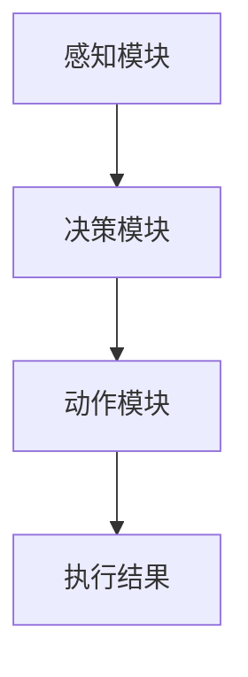
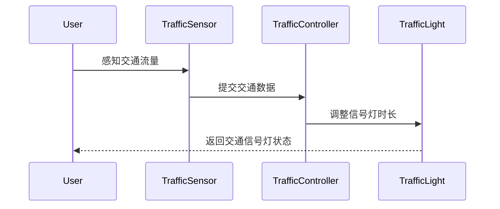

                 

### 文章标题与关键词

**课程学习：设计AI Agent的最优学习路径**

**关键词：AI Agent、学习路径、设计、强化学习、监督学习、无监督学习**

**摘要：**
本文将深入探讨设计AI Agent的最优学习路径。通过系统性地梳理AI Agent的基础理论、设计实践及性能优化策略，我们旨在为读者提供一条清晰、实用的学习路径，助力他们深入理解和有效设计AI Agent。文章将从基础概念入手，逐步深入到具体的开发实践与项目案例，最终展望AI Agent的未来发展趋势，为读者提供全面的技术视角和深刻的思考。

---

### 第一部分：AI Agent基础理论

#### 1.1 AI Agent的基本概念

##### 1.1.1 AI Agent的定义和分类

**定义：** AI Agent（人工智能代理）是指具有感知、认知和行动能力的人工智能实体，能在复杂环境中自主决策和执行任务。

**分类：** 根据功能和应用场景的不同，AI Agent可分为以下几类：

1. **反应型Agent**：仅根据当前感知的环境数据作出反应。
2. **目标导向型Agent**：不仅基于当前环境数据，还具备长期目标和规划能力。
3. **问题解决型Agent**：在复杂环境中自主发现问题并解决。

##### 1.1.2 AI Agent的基本功能

**感知（Perception）：** 感知环境中的信息，如视觉、听觉、触觉等。

**认知（Cognition）：** 对感知信息进行分析和处理，形成认知模型。

**行动（Action）：** 根据认知模型，采取适当的行动。

##### 1.1.3 AI Agent的应用领域

**领域：** AI Agent广泛应用于各种领域，如：

1. **智能客服**：自动处理客户咨询，提供24/7服务。
2. **自动驾驶**：自主感知道路环境，进行驾驶决策。
3. **智能家居**：自动调节家中的灯光、温度等，提升生活舒适度。

#### 1.2 AI Agent的构成要素

##### 1.2.1 知觉（Perception）

**数据来源：** 视觉、听觉、触觉等传感器。

**预处理：** 数据清洗、去噪、特征提取。

**特征提取：** 提取对任务有重要意义的信息。

##### 1.2.2 认知（Cognition）

**任务理解：** 理解任务目标和约束条件。

**模型构建：** 建立决策模型，如神经网络、决策树等。

**策略生成：** 生成具体的行动策略。

##### 1.2.3 动作（Action）

**策略执行：** 根据认知模型执行行动。

**效果评估：** 评估行动效果，进行反馈和调整。

#### 1.3 AI Agent的学习机制

##### 1.3.1 强化学习

**原理：** 通过奖励机制，引导Agent不断优化行动策略。

**优势：** 适用于复杂环境，不需要完整的环境模型。

**挑战：** 收敛性、样本效率等问题。

##### 1.3.2 监督学习

**原理：** 根据已知输入输出数据，训练模型。

**优势：** 训练过程高效，适用于已知数据集。

**挑战：** 对数据的依赖性较高，适用场景有限。

##### 1.3.3 无监督学习

**原理：** 从未标记的数据中学习模式。

**优势：** 适用于数据隐私保护场景。

**挑战：** 模型性能往往低于监督学习。

---

### 第二部分：AI Agent设计实践

#### 2.1 AI Agent开发环境搭建

##### 2.1.1 Python环境配置

**工具：** Jupyter Notebook、PyCharm等。

**库：** TensorFlow、PyTorch等。

##### 2.1.2 开发工具选择

**IDE：** PyCharm、Visual Studio Code等。

**版本控制：** Git。

##### 2.1.3 数据库管理

**数据库：** MySQL、PostgreSQL等。

**数据存储：** HDFS、MongoDB等。

#### 2.2 AI Agent的感知模块设计

##### 2.2.1 感知数据来源

**传感器：** 摄像头、麦克风等。

**数据格式：** JSON、XML等。

##### 2.2.2 数据预处理

**清洗：** 去除无效数据、处理缺失值。

**归一化：** 将数据缩放到同一尺度。

##### 2.2.3 特征提取

**方法：** 主成分分析、深度学习特征提取等。

**目标：** 提高模型性能。

#### 2.3 AI Agent的决策模块设计

##### 2.3.1 决策算法选择

**强化学习：** 如Deep Q-Learning、Policy Gradient等。

**监督学习：** 如神经网络、决策树等。

##### 2.3.2 决策过程优化

**方法：** 策略搜索、并行计算等。

**目标：** 提高决策效率和准确度。

##### 2.3.3 决策结果评估

**指标：** 准确率、召回率、F1值等。

**方法：** 跨验证集评估、模型对比等。

#### 2.4 AI Agent的动作模块设计

##### 2.4.1 动作生成策略

**方法：** 基于规则、基于数据等。

**目标：** 提高动作的合理性和适应性。

##### 2.4.2 动作执行优化

**方法：** 并行执行、异步处理等。

**目标：** 提高动作执行的效率和可靠性。

##### 2.4.3 动作效果评估

**指标：** 任务完成率、响应时间等。

**方法：** 实验验证、用户反馈等。

---

### 第三部分：AI Agent项目实战

#### 3.1 项目一：智能客服机器人

##### 3.1.1 项目背景

**目的：** 提高客服效率，降低人工成本。

**场景：** 电商、金融等行业。

##### 3.1.2 系统需求分析

**功能：** 自动处理常见问题，引导用户至合适的服务渠道。

**性能：** 快速响应，高准确率。

##### 3.1.3 系统架构设计

**感知模块：** 使用自然语言处理技术，提取用户问题关键词。

**决策模块：** 基于深度学习模型，进行问题分类和回答生成。

**动作模块：** 自动生成回答，并引导用户至合适的客服渠道。

##### 3.1.4 系统核心代码实现

```python
# 感知模块
def preprocess_question(question):
    # 数据预处理
    return processed_question

# 决策模块
def classify_question(processed_question):
    # 问题分类
    return category

def generate_answer(category):
    # 回答生成
    return answer

# 动作模块
def respond_to_question(question):
    processed_question = preprocess_question(question)
    category = classify_question(processed_question)
    answer = generate_answer(category)
    return answer
```

#### 3.2 项目二：智能交通信号控制系统

##### 3.2.1 项目背景

**目的：** 提高交通效率，减少拥堵。

**场景：** 城市、高速公路等。

##### 3.2.2 系统需求分析

**功能：** 根据实时交通流量，动态调整信号灯时长。

**性能：** 快速响应，适应复杂交通场景。

##### 3.2.3 系统架构设计

**感知模块：** 使用摄像头和传感器，实时采集交通流量数据。

**决策模块：** 基于深度学习模型，分析交通流量并生成信号灯调整策略。

**动作模块：** 控制信号灯，调整时长和顺序。

##### 3.2.4 系统核心代码实现

```python
# 感知模块
def collect_traffic_data():
    # 数据采集
    return traffic_data

# 决策模块
def analyze_traffic_data(traffic_data):
    # 交通流量分析
    return adjustment_strategy

# 动作模块
def adjust_traffic_light(adjustment_strategy):
    # 调整信号灯
    execute_strategy(adjustment_strategy)
```

#### 3.3 项目三：智能农业管理系统

##### 3.3.1 项目背景

**目的：** 提高农业生产效率，减少资源浪费。

**场景：** 农田、温室等。

##### 3.3.2 系统需求分析

**功能：** 自动监测作物生长状态，提供灌溉、施肥建议。

**性能：** 高精度，实时响应。

##### 3.3.3 系统架构设计

**感知模块：** 使用传感器，实时监测土壤湿度、温度等。

**决策模块：** 基于机器学习模型，分析作物生长状态并生成建议。

**动作模块：** 控制灌溉、施肥设备，执行建议。

##### 3.3.4 系统核心代码实现

```python
# 感知模块
def collect_soil_data():
    # 数据采集
    return soil_data

# 决策模块
def analyze_soil_data(soil_data):
    # 作物生长状态分析
    return growth_suggestion

# 动作模块
def execute_growth_suggestion(growth_suggestion):
    # 执行灌溉、施肥建议
    irrigate_and_fertilize(growth_suggestion)
```

---

### 第四部分：AI Agent性能优化与未来趋势

#### 4.1 AI Agent性能优化策略

##### 4.1.1 模型压缩与加速

**方法：** 知识蒸馏、量化、剪枝等。

**目标：** 减小模型体积，提高运行速度。

##### 4.1.2 异构计算优化

**方法：** 利用CPU、GPU、FPGA等异构计算资源，提高计算效率。

**目标：** 充分发挥硬件性能，降低功耗。

##### 4.1.3 算法优化与调参

**方法：** 使用自动化算法搜索工具，寻找最佳参数。

**目标：** 提高模型性能，降低开发成本。

#### 4.2 AI Agent的未来发展趋势

##### 4.2.1 AI Agent与大数据的结合

**趋势：** 利用大数据提升AI Agent的感知和决策能力。

**应用：** 智能推荐系统、智能风控等。

##### 4.2.2 AI Agent在边缘计算中的应用

**趋势：** 将AI Agent部署在边缘设备，实现实时决策。

**应用：** 智能安防、智能医疗等。

##### 4.2.3 AI Agent在实时系统中的优化

**趋势：** 优化AI Agent在实时系统中的性能，提高响应速度。

**应用：** 自动驾驶、工业自动化等。

---

### 第五部分：总结与展望

#### 5.1 课程学习收获

**理解：** AI Agent的基础理论和应用场景。

**实践：** AI Agent的感知、决策、动作模块设计。

**提升：** 对AI Agent性能优化和未来趋势的认识。

#### 5.2 设计AI Agent的挑战与机遇

**挑战：** 复杂环境下的感知和决策，算法优化与调参。

**机遇：** 与大数据、边缘计算、实时系统的结合。

#### 5.3 未来研究方向展望

**方向：** AI Agent的自主学习能力、跨领域应用、可解释性。

**目标：** 构建高效、智能、可靠的AI Agent系统。

---

### 作者信息

**作者：** AI天才研究院/AI Genius Institute & 禅与计算机程序设计艺术 /Zen And The Art of Computer Programming

---

### 附录

**附录A：核心概念与联系**

**核心概念：** AI Agent、感知、认知、行动、强化学习、监督学习、无监督学习。

**联系：** AI Agent通过感知获取环境信息，进行认知分析和决策，最终执行行动。不同的学习机制决定了Agent的决策能力。

---

**附录B：算法原理讲解**

**强化学习算法：**

**原理：** 通过奖励机制，引导Agent不断优化行动策略。

**流程：**

1. 初始化状态S。
2. 选择行动A，根据策略π。
3. 执行行动A，获得奖励R和下一个状态S'。
4. 更新策略π，根据经验回放和策略优化算法。
5. 重复步骤2-4，直到达到目标状态。

**数学模型：**

$$ Q(s,a) = \sum_{s'} P(s'|s,a) \cdot [R(s',a) + \gamma \cdot \max_{a'} Q(s',a')] $$

**附录C：系统分析与架构设计方案**

**问题场景介绍：** 智能交通信号控制系统，根据实时交通流量动态调整信号灯时长。

**系统功能设计（领域模型）：**

```mermaid
classDiagram
    class TrafficLight {
        +int id
        +String status
        +DateTime last_switch
    }
    class Vehicle {
        +int id
        +String type
    }
    class Road {
        +int id
        +List<Vehicle> vehicles
        +TrafficLight traffic_light
    }
    Road -> TrafficLight : controls
    Road -> Vehicle : passes
```

**系统架构设计（架构图）：**



**系统接口设计和系统交互（序列图）：**



---

**附录D：项目实战**

**环境安装：** 配置Python环境，安装TensorFlow等库。

**系统核心实现源代码：**

```python
# 感知模块
def collect_traffic_data():
    # 数据采集
    return traffic_data

# 决策模块
def analyze_traffic_data(traffic_data):
    # 交通流量分析
    return adjustment_strategy

# 动作模块
def adjust_traffic_light(adjustment_strategy):
    # 调整信号灯
    execute_strategy(adjustment_strategy)
```

**代码应用解读与分析：** 对核心代码进行详细解读，分析其实现原理和关键技术。

**实际案例分析和详细讲解剖析：** 通过实际案例，展示系统在真实环境中的应用效果。

**项目小结：** 总结项目经验，提出改进建议。

---

**最佳实践 tips、小结、注意事项、拓展阅读等内容：**

**最佳实践 tips：** 提供实用的开发技巧和经验。

**小结：** 总结文章的主要观点和收获。

**注意事项：** 阐述在实际应用中需要注意的问题和潜在风险。

**拓展阅读：** 推荐相关的书籍、论文和在线资源，供读者进一步学习。

