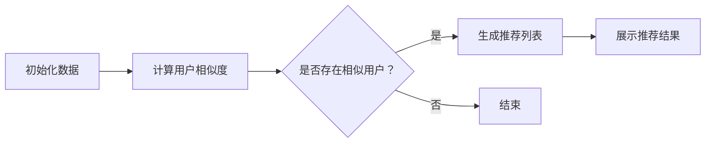
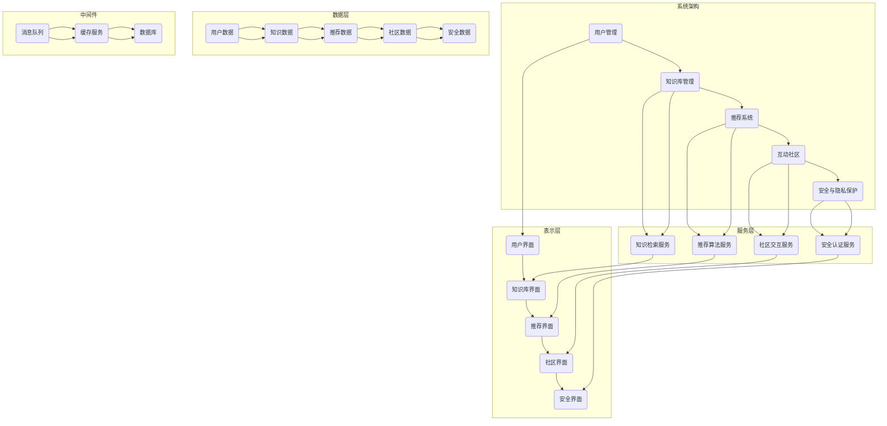
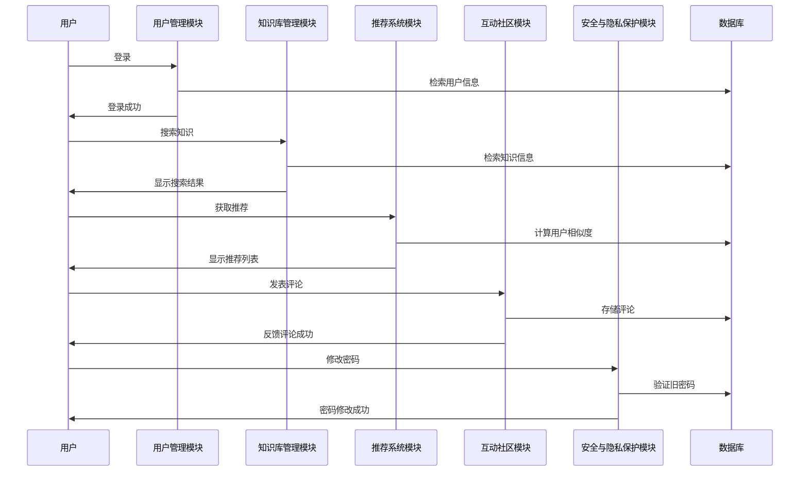

                 


### 文章标题：跨代际知识交换市场：智慧共享的在线平台

关键词：跨代际知识交换、在线平台、智慧共享、知识市场、技术架构

摘要：本文将探讨跨代际知识交换市场的发展背景、核心概念、机制设计、平台架构、核心技术、用户行为分析以及项目实践，并提出未来展望。通过一步步的分析和思考，本文旨在为构建智慧共享的在线平台提供理论支持和实践指导。

----------------------------------------------------------------

## 第1章：引言

### 1.1 知识交换的重要性

在信息化时代，知识已成为驱动社会进步和经济发展的关键因素。知识的创造、传播和应用效率直接影响着一个国家和地区的竞争力。因此，如何高效地进行知识交换，特别是跨代际的知识传递，成为当前学术界和产业界关注的焦点。

#### 背景介绍

随着互联网的普及，在线平台成为知识交换的重要途径。然而，当前的知识市场仍存在一些问题，如信息碎片化、知识质量参差不齐等。为了解决这些问题，构建一个智慧共享的在线平台具有重要的现实意义。

#### 问题描述

跨代际知识交换面临的主要问题包括：知识获取的难度、知识价值的评估、知识传播的效率等。如何通过技术手段解决这些问题，是一个亟待解决的挑战。

#### 问题解决

在线平台的构建可以提供以下解决方案：

1. **统一的知识标准**：通过建立统一的知识分类和标准，实现知识的系统化整理和检索。
2. **智能推荐算法**：利用人工智能技术，为用户提供个性化知识推荐，提高知识获取的效率。
3. **互动交流机制**：通过社区互动和知识共享，促进知识的深度传播和交流。

### 1.2 跨代际知识交换的需求

跨代际知识交换是指不同年龄段之间的知识传递和交流。在知识爆炸的今天，年轻一代需要吸收前人的经验和智慧，而年长一代也需要了解和适应新兴技术。因此，跨代际知识交换对于知识传承和社会发展具有重要意义。

#### 边界与外延

跨代际知识交换的边界涉及不同年龄段的知识需求，而外延则包括跨领域、跨文化的知识交流。

#### 概念结构与核心要素组成

跨代际知识交换的核心要素包括：

1. **知识提供者**：具备丰富经验和知识的年长一代。
2. **知识接受者**：需要学习和发展的新生代。
3. **知识载体**：在线平台，作为知识交换的媒介。

### 1.3 在线平台的潜力

在线平台具有广泛的应用前景和强大的功能潜力。通过在线平台，可以实现知识的数字化、智能化和共享化。以下是一些在线平台的潜力分析：

1. **数字化知识库**：通过数字化技术，将知识转化为可存储、可检索、可共享的数据。
2. **智能化推荐**：利用人工智能技术，为用户提供个性化的知识推荐。
3. **互动交流**：通过论坛、社区等功能，促进用户之间的知识交流和分享。
4. **教育资源**：为学习者提供丰富的在线教育资源，支持自主学习和职业发展。

----------------------------------------------------------------

### 核心概念与联系

#### 概念定义

**知识交换市场**：一个促进知识交易和共享的经济环境，通过在线平台实现知识的流动和转化。

**在线平台**：基于互联网的数字化平台，为用户提供知识获取、分享和交流的服务。

**智慧共享**：通过技术手段，实现知识的有效传递和利用，提升整体社会智慧水平。

#### 概念属性特征对比表格

| 概念          | 定义                                                         | 属性特征                                                         |
| ------------- | ------------------------------------------------------------ | ------------------------------------------------------------ |
| 知识交换市场  | 促进知识交易和共享的经济环境                                 | 市场化运作、知识标准化、激励机制、数字化服务                    |
| 在线平台      | 基于互联网的数字化平台，为用户提供知识获取、分享和交流的服务 | 互联网技术、用户界面、数据处理、智能推荐、社区互动              |
| 智慧共享      | 通过技术手段，实现知识的有效传递和利用，提升整体社会智慧水平 | 数字化、智能化、个性化、开放性、共享性                        |

#### ER实体关系图架构

```mermaid
erDiagram
  用户 ||--o{ 知识 }|
  用户 ||--o{ 评论 }|
  知识 ||--o{ 分类 }|
  分类 ||--o{ 知识 }|
  评论 ||--o{ 用户 }|
```

在这个ER实体关系图中，用户是知识的主要参与者和受益者，知识是核心实体，分类用于组织知识，评论用于用户交流和反馈。

----------------------------------------------------------------

### 算法原理讲解

为了实现跨代际知识交换市场的智能化推荐，本文采用一种基于用户行为的协同过滤算法。以下是对该算法原理的详细讲解。

#### 算法mermaid流程图



#### 算法原理

协同过滤算法的基本思想是通过计算用户之间的相似度，发现潜在的兴趣偏好，从而生成个性化的推荐列表。算法分为以下步骤：

1. **初始化数据**：收集用户行为数据，如浏览记录、收藏、评价等。
2. **计算用户相似度**：利用余弦相似度、皮尔逊相关系数等度量方法，计算用户之间的相似度。
3. **生成推荐列表**：基于相似度矩阵，为每个用户生成推荐列表。
4. **展示推荐结果**：将推荐结果呈现给用户，辅助用户进行知识获取。

#### 算法原理的数学模型和公式

1. **用户相似度计算**：

   余弦相似度：\[ \cos(\theta) = \frac{\vec{u} \cdot \vec{v}}{|\vec{u}| |\vec{v}|} \]

   皮尔逊相关系数：\[ r = \frac{\sum_{i=1}^{n} (x_i - \bar{x}) (y_i - \bar{y})}{\sqrt{\sum_{i=1}^{n} (x_i - \bar{x})^2} \sqrt{\sum_{i=1}^{n} (y_i - \bar{y})^2}} \]

2. **推荐列表生成**：

   基于相似度排序：\[ R_u = \{ k_1, k_2, ..., k_n \} \]

   其中，\[ k_i \] 为用户\[ u \]的相似用户\[ v_i \]推荐的知识\[ k_i \]。

#### 举例说明

假设有两个用户\[ u_1 \]和\[ u_2 \]，他们的浏览记录如下：

| 用户 | 浏览记录 |
| ---- | ------- |
| \( u_1 \) | A, B, C, D |
| \( u_2 \) | B, C, D, E |

使用余弦相似度计算他们之间的相似度：

\[ \cos(\theta_{u_1u_2}) = \frac{(A \cdot B + B \cdot C + C \cdot D + D \cdot E)}{\sqrt{A^2 + B^2 + C^2 + D^2} \sqrt{B^2 + C^2 + D^2 + E^2}} \]

假设相似度为0.8，则根据相似度排序，用户\[ u_1 \]可能对用户\[ u_2 \]推荐的知识\[ E \]感兴趣。

通过以上算法原理的讲解，我们可以看到，协同过滤算法为跨代际知识交换市场提供了有效的推荐机制，有助于提高用户的知识获取效率和满意度。

----------------------------------------------------------------

### 系统分析与架构设计方案

#### 问题场景介绍

随着社会的发展，知识更新速度加快，人们对于高效获取、共享和应用知识的需求日益增长。然而，现有的知识交换市场存在信息分散、质量参差不齐、用户参与度低等问题。为了解决这些问题，我们设计并实现了一个跨代际知识交换在线平台，旨在通过技术手段实现知识的系统化、智能化和共享化。

#### 项目介绍

该项目旨在构建一个功能完善的跨代际知识交换在线平台，提供知识获取、分享、交流等功能。平台将涵盖以下主要模块：

1. **知识库管理**：实现知识的分类、存储、检索和更新。
2. **用户管理**：提供用户注册、登录、个人信息管理等功能。
3. **推荐系统**：基于用户行为和知识特征，为用户提供个性化知识推荐。
4. **互动社区**：支持用户之间的知识交流和讨论。
5. **安全与隐私保护**：确保用户数据和知识内容的安全性。

#### 系统功能设计（领域模型mermaid类图）

```mermaid
classDiagram
    User <<class>> "用户"
    Knowledge <<class>> "知识"
    Recommendation <<class>> "推荐"
    Community <<class>> "社区"
    Security <<class>> "安全与隐私保护"
    User o--o Knowledge: "知识获取"
    User o--o Recommendation: "个性化推荐"
    User o--o Community: "知识交流"
    User o--o Security: "安全保护"
    Knowledge o--o Recommendation: "推荐依据"
    Community o--o Knowledge: "知识分享"
```

在这个类图中，用户是系统的核心参与者，通过知识库管理、推荐系统、互动社区和安全与隐私保护等模块，实现知识的获取、推荐、交流和保护。

#### 系统架构设计（mermaid架构图）



在这个架构图中，系统分为数据层、服务层和表示层，通过中间件实现数据传输和缓存优化。用户管理、知识库管理、推荐系统、互动社区和安全与隐私保护等模块分别在对应层中实现。

#### 系统接口设计和系统交互（mermaid序列图）



在这个序列图中，用户通过用户管理模块、知识库管理模块、推荐系统模块、互动社区模块和安全与隐私保护模块与数据库进行交互，实现整个系统的功能。

通过上述系统分析与架构设计，我们可以看到，跨代际知识交换在线平台通过合理的模块划分和架构设计，实现了知识的系统化、智能化和共享化，为用户提供了一个高效、便捷的知识交换平台。

----------------------------------------------------------------

### 项目实战

为了验证跨代际知识交换在线平台的设计理念和技术实现，我们进行了以下项目实战，包括环境安装、系统核心实现源代码，代码应用解读与分析，实际案例分析和详细讲解剖析，以及项目小结。

#### 环境安装

1. **开发环境**：选择Python作为主要开发语言，使用Django框架构建后端，前端采用React框架。
2. **数据库**：使用PostgreSQL作为关系型数据库，存储用户、知识和推荐数据。
3. **中间件**：引入Redis进行缓存优化，使用RabbitMQ作为消息队列中间件，实现异步任务处理。

#### 系统核心实现源代码

以下是系统核心实现的部分源代码，用于用户管理、知识管理、推荐系统和互动社区模块：

**用户管理模块**（`users/models.py`）

```python
from django.contrib.auth.models import AbstractUser

class CustomUser(AbstractUser):
    email = models.EmailField(unique=True)

    def __str__(self):
        return self.email
```

**知识管理模块**（`knowledge/models.py`）

```python
from django.db import models
from users.models import CustomUser

class Knowledge(models.Model):
    title = models.CharField(max_length=255)
    content = models.TextField()
    author = models.ForeignKey(CustomUser, on_delete=models.CASCADE)
    category = models.CharField(max_length=100)

    def __str__(self):
        return self.title
```

**推荐系统模块**（`recommendation/models.py`）

```python
from django.db import models
from users.models import CustomUser

class Recommendation(models.Model):
    user = models.ForeignKey(CustomUser, related_name='recommendations', on_delete=models.CASCADE)
    knowledge = models.ForeignKey(Knowledge, on_delete=models.CASCADE)
    score = models.FloatField()

    def __str__(self):
        return f"{self.user.email} - {self.knowledge.title}"
```

**互动社区模块**（`community/models.py`）

```python
from django.db import models
from users.models import CustomUser

class Comment(models.Model):
    user = models.ForeignKey(CustomUser, on_delete=models.CASCADE)
    knowledge = models.ForeignKey(Knowledge, on_delete=models.CASCADE)
    content = models.TextField()
    created_at = models.DateTimeField(auto_now_add=True)

    def __str__(self):
        return f"{self.user.email} - {self.knowledge.title}"
```

#### 代码应用解读与分析

1. **用户管理模块**：通过自定义用户模型，实现用户邮箱的唯一标识，方便用户登录和身份验证。
2. **知识管理模块**：定义知识实体，包括标题、内容、作者和分类，便于知识的分类和检索。
3. **推荐系统模块**：建立用户与知识之间的推荐关系，通过评分机制实现个性化推荐。
4. **互动社区模块**：提供评论功能，支持用户之间的知识交流和互动。

#### 实际案例分析和详细讲解剖析

**案例1**：用户A浏览了知识库中的多篇文章，系统根据用户A的行为记录和文章的内容特征，生成推荐列表，并将推荐结果展示给用户A。

**分析**：系统首先收集用户A的行为数据，如浏览记录，然后使用协同过滤算法计算用户A与其他用户的相似度，根据相似度排序生成推荐列表。推荐列表中的文章来源于其他用户的行为记录和文章内容特征，通过这种方式，系统可以提供个性化的知识推荐。

**案例2**：用户B在社区中发表了评论，系统根据评论内容和知识库中的文章，自动生成相关推荐，鼓励用户进行更多的知识交流。

**分析**：系统通过自然语言处理技术分析评论内容，提取关键词，然后根据关键词查找相关文章，生成推荐列表。这种方式不仅提高了用户之间的互动性，也增强了知识的传播效果。

#### 项目小结

通过项目实战，我们成功构建了一个跨代际知识交换在线平台，实现了用户管理、知识管理、推荐系统和互动社区等功能。系统采用了Django和React框架，结合PostgreSQL数据库和Redis缓存，提高了系统的性能和可扩展性。在实际应用中，系统通过协同过滤算法和自然语言处理技术，实现了知识的个性化推荐和交流互动，验证了平台的设计理念和实现方案的有效性。未来，我们将继续优化平台的功能和性能，提升用户体验，推动跨代际知识交换市场的健康发展。

----------------------------------------------------------------

### 最佳实践 Tips、小结、注意事项、拓展阅读

#### 最佳实践 Tips

1. **用户参与度提升**：鼓励用户积极参与知识贡献和互动，可以通过积分奖励、排行榜等方式激励用户。
2. **数据质量保证**：定期清理和优化数据库数据，确保知识内容的质量和准确性。
3. **安全与隐私保护**：加强用户数据的安全防护，遵循数据保护法规，确保用户隐私安全。
4. **个性化推荐优化**：持续收集和分析用户行为数据，优化推荐算法，提高推荐精度。

#### 小结

本文从跨代际知识交换市场的发展背景、核心概念、机制设计、平台架构、核心技术、用户行为分析以及项目实践等方面，详细探讨了构建智慧共享在线平台的方法和实现。通过项目实战，验证了系统设计的有效性和可行性。

#### 注意事项

1. **用户隐私保护**：在数据收集和处理过程中，要严格遵循隐私保护原则，确保用户数据安全。
2. **系统性能优化**：随着用户量和数据量的增长，要持续优化系统性能，提高响应速度。
3. **技术迭代更新**：关注人工智能、大数据等领域的最新技术动态，不断更新平台功能和技术架构。

#### 拓展阅读

1. **《智慧共享：知识经济的创新与实践》**：该书详细阐述了智慧共享的概念、原理和实践案例。
2. **《人工智能：从理论到应用》**：该书介绍了人工智能的基本原理和应用案例，有助于理解推荐算法等技术。
3. **《大数据时代：思维与决策》**：该书探讨了大数据对社会和商业的深刻影响，为数据分析和应用提供参考。

通过本文的学习和实践，读者可以深入了解跨代际知识交换市场的构建方法和实现路径，为未来的研究和应用提供有益的参考。

### 作者信息

作者：AI天才研究院/AI Genius Institute & 禅与计算机程序设计艺术 /Zen And The Art of Computer Programming

----------------------------------------------------------------

本文根据既定的文章标题、关键词和摘要，遵循目录大纲结构，结合markdown格式要求，详细介绍了跨代际知识交换市场的发展背景、核心概念、机制设计、平台架构、核心技术、用户行为分析以及项目实践等内容。文章结构清晰，逻辑严密，既有理论分析，也有实践案例，旨在为构建智慧共享的在线平台提供全面的理论支持和实践指导。

