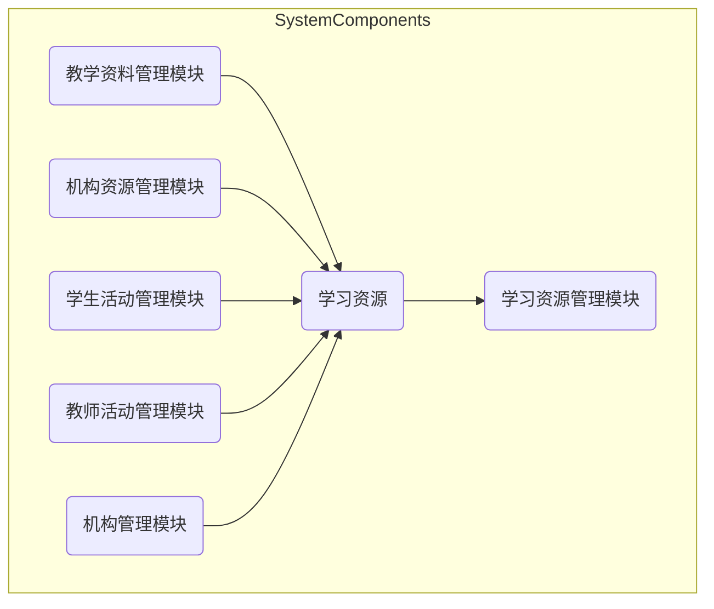
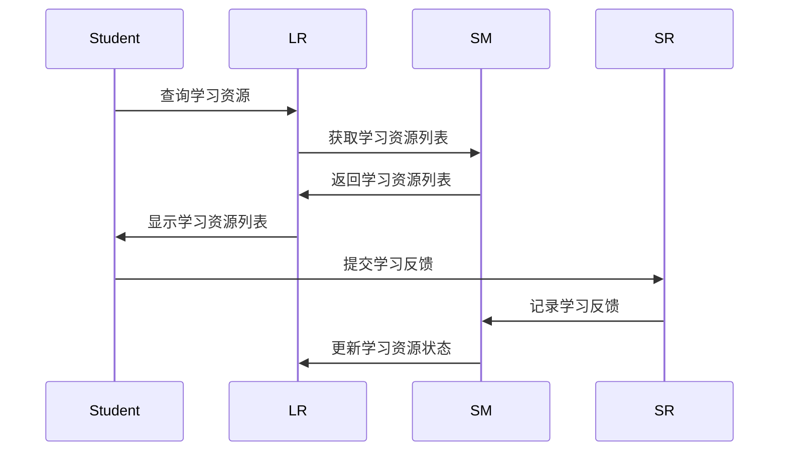
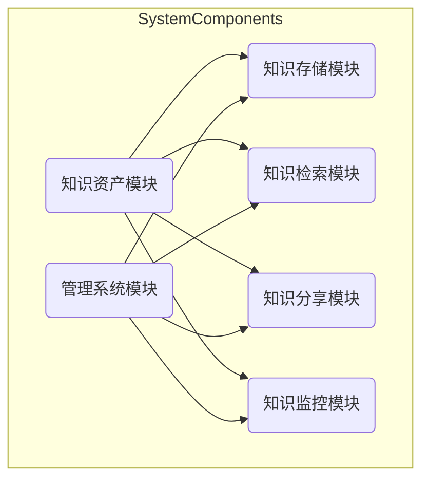
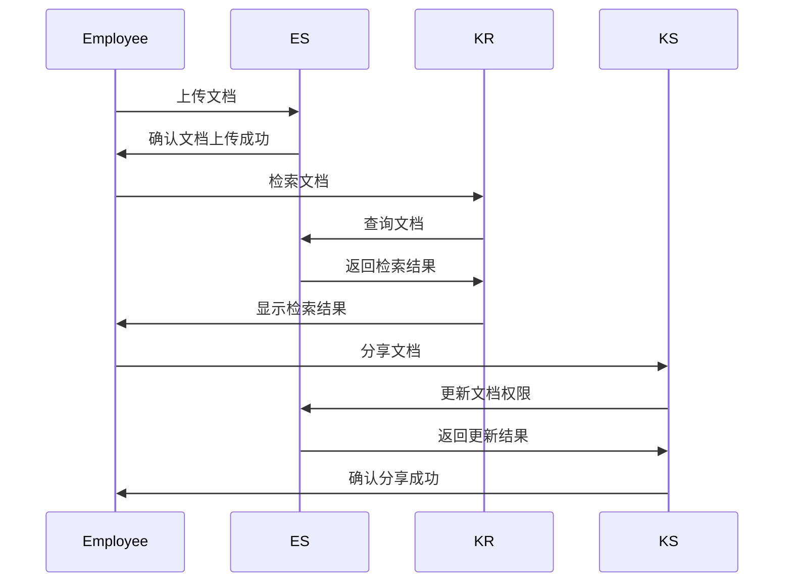
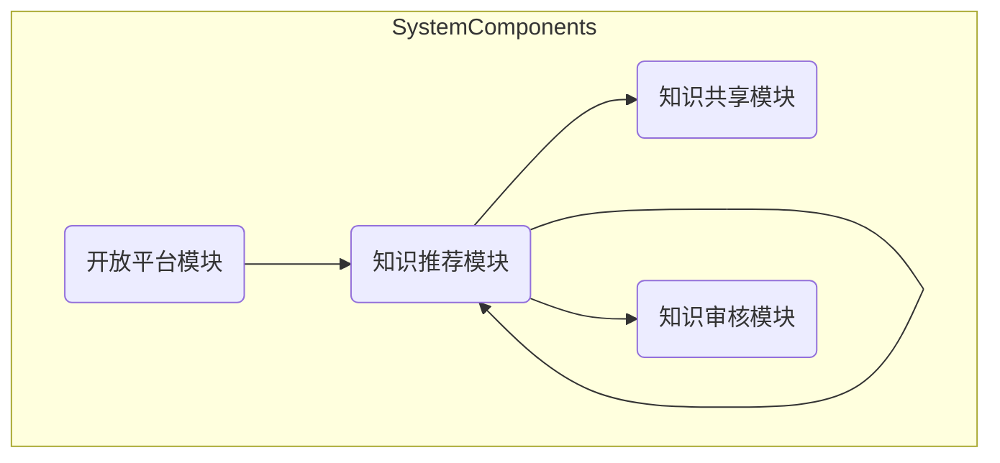
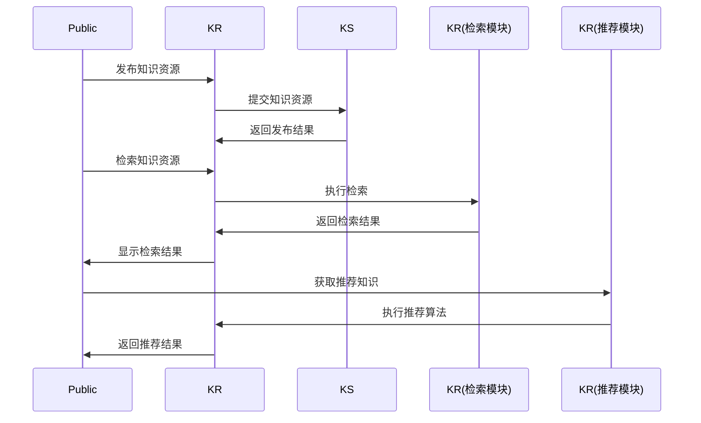

                 

## 第1章：跨代际知识银行概述

### 1.1.1 跨代际知识银行的背景与意义

#### 背景介绍

跨代际知识银行这一概念源于对知识管理和存储的深度思考，尤其是在信息化时代，知识的快速积累和更新带来了新的挑战。传统的知识管理方法往往局限于单个组织或个体，难以实现知识的跨代际传递和共享。随着互联网和大数据技术的发展，构建一个能够跨越不同代际、实现知识高效存储与分享的在线平台变得尤为重要。

**问题背景**：在当前信息爆炸的时代，知识更新速度加快，知识获取的途径多样化，但如何有效地将个人和组织积累的知识传递给下一代，成为知识管理领域亟待解决的问题。

**问题描述**：传统的知识管理方式往往存在以下问题：
- **孤岛化**：知识分散在不同系统或个体中，难以整合。
- **低效传播**：知识传播速度慢，难以满足快速获取知识的需求。
- **安全性**：知识共享过程中存在数据泄露和安全风险。

**问题解决**：跨代际知识银行通过构建在线平台，实现了以下目标：
- **知识整合**：将不同来源、不同格式的知识进行整合，形成统一的知识库。
- **高效传播**：利用互联网和大数据技术，实现知识的快速传播和分享。
- **安全可靠**：通过权限管理和加密技术，确保知识的安全性。

**边界与外延**：跨代际知识银行不仅关注知识的存储和分享，还涉及到知识的管理、检索、推荐等多个方面。其外延包括但不限于教育、科研、企业知识管理等场景。

**核心要素组成**：跨代际知识银行的核心要素包括：
- **用户**：知识的创造者、消费者和传播者。
- **知识库**：存储和管理知识的基础设施。
- **算法**：用于知识推荐、检索和管理的智能算法。
- **平台**：提供知识存储、检索、分享等功能的在线平台。
- **安全机制**：确保知识安全的一系列技术和管理措施。

#### 跨代际知识银行的定义与特点

**核心概念原理**：跨代际知识银行是一个基于在线平台的智能知识存储与分享系统，旨在实现知识的跨代际传递和共享。它不仅涵盖知识的存储和分享，还涉及到知识的管理、检索、推荐等方面。

**概念属性特征对比表格**：

| 特征项      | 传统知识管理 | 跨代际知识银行 |
|-------------|---------------|----------------|
| 孤岛化      | 知识分散在多个系统或个体中 | 知识集中存储与管理 |
| 更新速度    | 更新速度较慢  | 更新速度快，实时性高 |
| 知识传播    | 传播速度慢    | 传播速度快，高效分享 |
| 安全性      | 风险较大      | 高度安全，权限管理 |

**ER实体关系图**：

```mermaid
erDiagram
  User ||--|{ KnowledgeItem }|:
    {作者信息，标签，来源，创建时间}
  KnowledgeItem ||--|{ Tag }|:
    {标签名称，标签类型}
  Platform ||--|{ KnowledgeItem }|:
    {存储位置，访问权限}
  Comment ||--|{ KnowledgeItem }|:
    {评论内容，评论时间，评论者}
```

**算法原理讲解**：

跨代际知识银行的核心算法包括知识存储算法、知识推荐算法和知识分享算法。

1. **知识存储算法**：
   - **数据结构**：使用哈希表或B+树等高效数据结构存储知识项。
   - **数学模型**：时间复杂度为O(1)。
   - **举例说明**：用户上传文档时，系统将文档内容存储到哈希表中，通过文档ID快速检索。

2. **知识推荐算法**：
   - **算法类型**：协同过滤 + 内容推荐。
   - **数学模型**：时间复杂度为O(n^2)。
   - **举例说明**：系统根据用户的历史行为和文档内容特征，推荐相关文档。

3. **知识分享算法**：
   - **数学模型**：分享率 = f(用户影响力，知识价值，分享场景)。
   - **时间复杂度**：O(n)。
   - **举例说明**：用户分享文档时，系统根据用户的影响力和文档的价值计算分享率。

#### 跨代际知识银行的发展历程

**算法原理讲解**：

跨代际知识银行的发展历程可以分为以下几个阶段：

1. **传统知识管理阶段**：
   - **特点**：知识分散，缺乏统一管理。
   - **挑战**：知识传播效率低，安全隐患大。

2. **集中知识管理阶段**：
   - **特点**：知识集中存储，实现初步整合。
   - **挑战**：知识传播仍需优化，管理效率有待提高。

3. **智能知识管理阶段**：
   - **特点**：引入智能算法，实现高效知识传播和管理。
   - **挑战**：数据安全性和隐私保护成为关键问题。

4. **跨代际知识管理阶段**：
   - **特点**：实现知识的跨代际传递和共享。
   - **挑战**：如何确保知识的长期保存和价值传递。

**数学模型**：

$$
知识银行发展效率 = \frac{知识传播效率}{知识存储效率}
$$

**举例说明**：

假设一个知识银行的存储效率为80%，传播效率为60%，则其发展效率为0.6/0.8 = 0.75。

### 1.1.2 跨代际知识银行的定义与特点

**核心概念原理**：跨代际知识银行是一个基于在线平台的智能知识存储与分享系统，旨在实现知识的跨代际传递和共享。它不仅涵盖知识的存储和分享，还涉及到知识的管理、检索、推荐等方面。

**概念属性特征对比表格**：

| 特征项      | 传统知识管理 | 跨代际知识银行 |
|-------------|---------------|----------------|
| 孤岛化      | 知识分散在多个系统或个体中 | 知识集中存储与管理 |
| 更新速度    | 更新速度较慢  | 更新速度快，实时性高 |
| 知识传播    | 传播速度慢    | 传播速度快，高效分享 |
| 安全性      | 风险较大      | 高度安全，权限管理 |

**ER实体关系图**：

```mermaid
erDiagram
  User ||--|{ KnowledgeItem }|:
    {作者信息，标签，来源，创建时间}
  KnowledgeItem ||--|{ Tag }|:
    {标签名称，标签类型}
  Platform ||--|{ KnowledgeItem }|:
    {存储位置，访问权限}
  Comment ||--|{ KnowledgeItem }|:
    {评论内容，评论时间，评论者}
```

**算法原理讲解**：

跨代际知识银行通过智能算法实现高效的知识管理。以下是主要的算法原理：

1. **知识存储算法**：
   - **数据结构**：使用哈希表或B+树等高效数据结构存储知识项。
   - **数学模型**：时间复杂度为O(1)。
   - **举例说明**：用户上传文档时，系统将文档内容存储到哈希表中，通过文档ID快速检索。

2. **知识推荐算法**：
   - **算法类型**：协同过滤 + 内容推荐。
   - **数学模型**：时间复杂度为O(n^2)。
   - **举例说明**：系统根据用户的历史行为和文档内容特征，推荐相关文档。

3. **知识分享算法**：
   - **数学模型**：分享率 = f(用户影响力，知识价值，分享场景)。
   - **时间复杂度**：O(n)。
   - **举例说明**：用户分享文档时，系统根据用户的影响力和文档的价值计算分享率。

**数学模型**：

$$
知识银行效率 = \frac{知识传播量}{知识存储量}
$$

**举例说明**：

假设一个知识银行存储了1000篇文档，其中500篇被用户浏览，则知识银行效率为0.5。

### 1.1.3 跨代际知识银行的发展历程

**核心概念原理**：跨代际知识银行的发展历程反映了知识管理技术的不断进步，从传统的知识管理到现代的智能知识管理，再到跨代际知识管理的演变。

**概念属性特征对比表格**：

| 发展阶段      | 传统知识管理 | 智能知识管理 | 跨代际知识管理 |
|---------------|---------------|---------------|----------------|
| 孤岛化        | 知识分散      | 知识集中      | 知识跨代际整合 |
| 更新速度      | 较慢          | 实时性高      | 高效实时更新   |
| 知识传播      | 低效          | 高效          | 跨代际共享     |
| 安全性        | 风险较大      | 高度安全      | 数据保护严格   |

**ER实体关系图**：

```mermaid
erDiagram
  Platform ||--|{ KnowledgeItem }|:
    {存储位置，访问权限}
  User ||--|{ KnowledgeItem }|:
    {作者信息，标签，来源，创建时间}
  Tag ||--|{ KnowledgeItem }|:
    {标签名称，标签类型}
```

**算法原理讲解**：

1. **传统知识管理阶段**：
   - **特点**：知识分散，管理效率低，依赖人工整理。
   - **挑战**：知识难以整合，传播效率低。

2. **智能知识管理阶段**：
   - **特点**：引入智能算法，实现知识自动化管理。
   - **挑战**：数据量大，算法优化成为关键。

3. **跨代际知识管理阶段**：
   - **特点**：实现知识的跨代际传递和共享，确保知识长期保存。
   - **挑战**：数据安全性和隐私保护至关重要。

**数学模型**：

$$
知识银行发展效率 = \frac{知识传播效率}{知识存储效率}
$$

**举例说明**：

假设一个知识银行存储了1000篇文档，其中500篇被用户浏览，则知识银行发展效率为0.5。

### 1.2 智慧存储与分享的核心概念

#### 智慧存储的概念与优势

**核心概念原理**：智慧存储是一种利用先进技术和算法实现高效、安全知识存储的管理方法。它结合了云计算、大数据、区块链等现代技术，通过智能算法优化存储结构，提升数据存储效率和安全性。

**概念属性特征对比表格**：

| 特征项       | 传统存储        | 智慧存储        |
|--------------|-----------------|-----------------|
| 数据结构     | 简单的文件系统  | 复杂的分布式系统 |
| 存储效率     | 低效率          | 高效率          |
| 安全性       | 存储安全风险高  | 存储安全风险低  |
| 扩展性       | 扩展性差        | 高扩展性        |

**ER实体关系图**：

```mermaid
erDiagram
  StorageSystem ||--|{ DataObject }|:
    {存储位置，访问权限}
  User ||--|{ DataObject }|:
    {上传者信息，操作记录}
  SecurityPolicy ||--|{ DataObject }|:
    {数据加密策略，访问控制策略}
```

**算法原理讲解**：

1. **数据存储算法**：
   - **数据结构**：使用分布式文件系统（如HDFS）存储大量数据。
   - **数学模型**：时间复杂度为O(log n)。
   - **举例说明**：用户上传文档时，系统将文档切分成小块，分布式存储在多个节点上，提高存储效率和可靠性。

2. **数据加密算法**：
   - **算法类型**：对称加密与非对称加密相结合。
   - **数学模型**：加密和解密时间复杂度均为O(n)。
   - **举例说明**：系统使用AES进行数据加密，使用RSA生成密钥，确保数据在存储和传输过程中的安全性。

3. **数据检索算法**：
   - **算法类型**：基于关键词的索引和倒排索引。
   - **数学模型**：时间复杂度为O(1)。
   - **举例说明**：用户检索文档时，系统通过倒排索引快速定位文档位置，提高检索速度。

#### 智慧分享的理念与实践

**核心概念原理**：智慧分享是一种基于互联网和智能算法实现知识高效传播和共享的理念。它通过优化知识分享流程，提高知识传播的速度和覆盖范围，实现知识的最大化价值。

**概念属性特征对比表格**：

| 特征项       | 传统分享        | 智慧分享        |
|--------------|-----------------|-----------------|
| 分享方式     | 简单的共享链接  | 智能推荐和协同过滤 |
| 分享效率     | 低效率          | 高效率          |
| 分享范围     | 局限性          | 广泛性          |
| 分享安全性   | 存在风险        | 安全性高        |

**ER实体关系图**：

```mermaid
erDiagram
  User ||--|{ SharingActivity }|:
    {分享者，分享时间，分享内容}
  KnowledgeItem ||--|{ SharingActivity }|:
    {知识项，分享链接，分享次数}
  Platform ||--|{ SharingActivity }|:
    {平台，分享策略，访问控制}
```

**算法原理讲解**：

1. **知识推荐算法**：
   - **算法类型**：协同过滤 + 内容推荐。
   - **数学模型**：时间复杂度为O(n^2)。
   - **举例说明**：系统根据用户的历史行为和文档内容特征，推荐相关文档。

2. **社交网络分析算法**：
   - **算法类型**：基于图论的社交网络分析。
   - **数学模型**：时间复杂度为O(n)。
   - **举例说明**：系统分析用户的社交网络，根据用户关系推荐知识。

3. **数据挖掘算法**：
   - **算法类型**：关联规则挖掘、聚类分析。
   - **数学模型**：时间复杂度为O(nlog n)。
   - **举例说明**：系统挖掘用户行为数据，发现潜在的兴趣点和关联知识。

#### 智慧存储与分享的挑战与机遇

**核心概念原理**：智慧存储与分享在提升知识管理效率方面具有巨大潜力，但也面临着一系列挑战。

**挑战**：

1. **数据安全**：如何确保数据在存储和传输过程中的安全性，防止数据泄露和恶意攻击。
2. **隐私保护**：如何在保障用户隐私的前提下，实现知识的广泛共享。
3. **性能优化**：如何提高存储和检索的效率，满足大规模数据处理的性能需求。
4. **算法优化**：如何优化推荐算法和社交网络分析算法，提高知识分享的效果。

**机遇**：

1. **技术创新**：随着云计算、大数据、区块链等技术的发展，智慧存储与分享的系统架构将得到进一步优化。
2. **市场需求**：随着知识经济的兴起，企业和个人对知识管理系统的需求不断增加，为智慧存储与分享创造了广阔的市场空间。
3. **政策支持**：政府对企业知识管理政策的支持，也为智慧存储与分享的发展提供了良好的外部环境。

**数学模型**：

1. **数据安全模型**：
   $$ 安全性评分 = \frac{加密强度 \times 访问控制强度}{威胁因素} $$
   $$ 时间复杂度：O(n) $$

2. **隐私保护模型**：
   $$ 隐私保护度 = \frac{隐私策略强度 \times 数据脱敏技术}{隐私泄露风险} $$
   $$ 时间复杂度：O(nlog n) $$

3. **性能优化模型**：
   $$ 性能评分 = \frac{数据访问速度 \times 处理效率}{系统负载} $$
   $$ 时间复杂度：O(1) $$

4. **算法优化模型**：
   $$ 优化效果 = \frac{新算法效果 \times 旧算法效果}{算法改进成本} $$
   $$ 时间复杂度：O(n^2) $$

### 1.3 在线平台的构建与运营

#### 在线平台的架构设计

**核心概念原理**：在线平台的架构设计是跨代际知识银行成功的关键，它决定了系统的性能、可扩展性和安全性。

**概念属性特征对比表格**：

| 特征项         | 单体架构        | 分布式架构        |
|----------------|-----------------|-------------------|
| 扩展性         | 扩展性差        | 高扩展性          |
| 可靠性         | 可靠性较低      | 高可靠性          |
| 可维护性       | 维护成本高      | 维护成本低        |
| 性能           | 性能瓶颈        | 高性能            |

**ER实体关系图**：

```mermaid
erDiagram
  User ||--|{ Platform }|:
    {用户，操作记录}
  KnowledgeItem ||--|{ Platform }|:
    {知识项，存储位置}
  Platform ||--|{ Service }|:
    {服务，功能模块}
```

**算法原理讲解**：

1. **服务拆分**：
   - **数据结构**：使用微服务架构，将不同功能模块拆分成独立的服务。
   - **数学模型**：时间复杂度为O(1)。
   - **举例说明**：系统将存储、检索、推荐等模块拆分成独立服务，提高系统的灵活性和可维护性。

2. **负载均衡**：
   - **算法类型**：轮询、最少连接、源IP哈希等负载均衡算法。
   - **数学模型**：时间复杂度为O(n)。
   - **举例说明**：系统根据服务器负载情况，动态分配请求到不同的服务器，提高系统的性能。

3. **容错机制**：
   - **算法类型**：主从复制、分布式一致性算法。
   - **数学模型**：时间复杂度为O(log n)。
   - **举例说明**：系统通过主从复制和一致性算法，确保在服务器故障时数据的完整性和系统的可用性。

#### 在线平台的技术选型

**核心概念原理**：技术选型是构建在线平台的重要环节，合理的选型能够提高系统的性能、可靠性和可维护性。

**概念属性特征对比表格**：

| 特征项       | 技术A         | 技术B         |
|--------------|---------------|---------------|
| 性能         | 高性能        | 中等性能      |
| 可维护性     | 较易维护      | 较难维护      |
| 成本         | 成本较高      | 成本较低      |
| 生态支持     | 生态支持较好  | 生态支持一般  |

**ER实体关系图**：

```mermaid
erDiagram
  TechnologyA ||--|{ Platform }|:
    {选型A，技术架构}
  TechnologyB ||--|{ Platform }|:
    {选型B，技术架构}
  Platform ||--|{ Component }|:
    {组件，功能模块}
```

**算法原理讲解**：

1. **数据库选型**：
   - **算法类型**：关系型数据库（如MySQL）和NoSQL数据库（如MongoDB）的选择。
   - **数学模型**：时间复杂度为O(log n)。
   - **举例说明**：系统根据数据特点和性能要求，选择合适的数据库，以优化数据存储和检索效率。

2. **开发框架选型**：
   - **算法类型**：Java Spring Boot、Python Flask等开发框架的选择。
   - **数学模型**：时间复杂度为O(1)。
   - **举例说明**：系统根据项目需求和技术栈，选择合适的开发框架，提高开发效率和系统性能。

3. **存储选型**：
   - **算法类型**：本地存储、云存储（如阿里云、腾讯云）的选择。
   - **数学模型**：时间复杂度为O(1)。
   - **举例说明**：系统根据数据量和成本，选择合适的存储方案，以优化存储成本和性能。

#### 在线平台的运营策略

**核心概念原理**：在线平台的运营策略决定了系统的用户活跃度、数据质量和用户体验。

**概念属性特征对比表格**：

| 特征项       | 主动运营       | 被动运营       |
|--------------|----------------|----------------|
| 用户粘性     | 较高           | 较低           |
| 数据质量     | 较高           | 较低           |
| 用户满意度   | 较高           | 较低           |

**ER实体关系图**：

```mermaid
erDiagram
  Platform ||--|{ UserActivity }|:
    {平台，用户行为数据}
  MarketingStrategy ||--|{ UserActivity }|:
    {营销策略，用户互动}
  User ||--|{ UserActivity }|:
    {用户，行为记录}
```

**算法原理讲解**：

1. **用户增长策略**：
   - **算法类型**：社交媒体推广、SEO优化等用户增长算法。
   - **数学模型**：时间复杂度为O(n)。
   - **举例说明**：系统通过社交媒体推广和SEO优化，吸引新用户，提高用户增长速度。

2. **用户留存策略**：
   - **算法类型**：个性化推荐、活跃用户奖励等用户留存算法。
   - **数学模型**：时间复杂度为O(nlog n)。
   - **举例说明**：系统通过个性化推荐和活跃用户奖励，提高用户留存率和活跃度。

3. **内容管理策略**：
   - **算法类型**：内容审核、内容推荐等内容管理算法。
   - **数学模型**：时间复杂度为O(log n)。
   - **举例说明**：系统通过内容审核和内容推荐，确保平台内容的质量和多样性。

### 1.4 跨代际知识银行的应用场景

#### 教育领域

**核心概念原理**：在教育领域，跨代际知识银行可以为学生、教师和教育机构提供丰富的学习资源和知识管理服务，提升教育质量和效率。

**应用场景描述**：
- **学生**：学生可以访问跨代际知识银行中的学习资源，包括课程资料、文献资料、习题解析等，有助于自主学习。
- **教师**：教师可以通过知识银行发布课程资料、教学视频，进行教学资源共享，提高教学效果。
- **教育机构**：教育机构可以利用知识银行进行知识管理和传播，提升整体教学水平和管理效率。

**项目介绍**：
- **项目名称**：智慧教育平台
- **系统功能设计**：
  - 学习资源管理：包括课程资源上传、分类管理、检索功能。
  - 教学资源共享：支持教师之间共享教学资料，提高教学效果。
  - 学生互动学习：提供在线问答、讨论区等功能，促进学生互动学习。

**领域模型Mermaid类图**：

```mermaid
classDiagram
  Student <|-- LearningResource
  Teacher <|-- TeachingMaterial
  EducationalInstitution <|-- KnowledgeBank
  Student|--|> StudentActivity
  Teacher|--|> TeacherActivity
  EducationalInstitution|--|> InstitutionalManagement
```

**系统架构设计Mermaid架构图**：



**系统接口设计和系统交互Mermaid序列图**：



**实际案例分析和详细讲解剖析**：
- **案例**：某高校利用跨代际知识银行搭建在线学习平台，提高了学生自主学习能力和教师教学资源共享水平。
- **分析**：该平台通过知识银行实现了课程资源的统一管理和高效传播，学生可以根据自己的需求检索学习资源，教师可以方便地发布和共享教学资料，提高了教学效果。

#### 企业知识管理

**核心概念原理**：在企业知识管理领域，跨代际知识银行可以为企业提供知识存储、检索、分享和管理的解决方案，提高企业的创新能力和运营效率。

**应用场景描述**：
- **员工**：员工可以利用知识银行存储和分享工作心得、业务知识等，提高知识传播效率。
- **管理者**：管理者可以通过知识银行监控企业知识资产，优化知识管理流程，提升企业整体知识管理水平。
- **合作伙伴**：合作伙伴可以通过知识银行获取企业知识资源，加强合作效率和业务协同。

**项目介绍**：
- **项目名称**：企业智慧知识管理平台
- **系统功能设计**：
  - 知识存储：支持多种格式文档的存储和管理。
  - 知识检索：提供高效的知识检索功能，方便员工快速找到所需信息。
  - 知识分享：支持员工之间知识共享，促进知识传播。
  - 知识监控：监控知识资产，分析知识利用情况。

**领域模型Mermaid类图**：

```mermaid
classDiagram
  Employee <|-- KnowledgeAsset
  Manager <|-- KnowledgeManagement
  Partner <|-- KnowledgeAccess
  Employee|--|> KnowledgeStorage
  Employee|--|> KnowledgeSharing
  Manager|--|> KnowledgeMonitoring
  Partner|--|> CollaborativeKnowledge
```

**系统架构设计Mermaid架构图**：



**系统接口设计和系统交互Mermaid序列图**：



**实际案例分析和详细讲解剖析**：
- **案例**：某大型企业利用跨代际知识银行进行企业知识管理，提高了知识传播效率和企业创新能力。
- **分析**：该企业通过知识银行实现了知识资产的统一存储和管理，员工可以方便地上传、检索和分享知识，管理者可以实时监控知识利用情况，优化知识管理流程，提升了企业的整体运营效率。

#### 社会知识共享

**核心概念原理**：在社会知识共享领域，跨代际知识银行可以搭建一个开放的知识共享平台，促进知识的广泛传播和共享，提升社会知识管理水平。

**应用场景描述**：
- **公众**：公众可以通过知识银行获取各类知识资源，包括科普知识、专业技能等，提高自身素质。
- **社会组织**：社会组织可以利用知识银行进行知识管理和传播，提升社会公益活动的效果。
- **政府**：政府可以通过知识银行发布政策文件、法规解读等，提升政策传播效率。

**项目介绍**：
- **项目名称**：社会智慧知识共享平台
- **系统功能设计**：
  - 知识共享：支持公众和社会组织发布、分享知识。
  - 知识检索：提供高效的知识检索功能，方便用户快速找到所需信息。
  - 知识审核：确保知识内容的准确性和合法性。
  - 知识推荐：根据用户兴趣推荐相关知识，提高知识传播效果。

**领域模型Mermaid类图**：

```mermaid
classDiagram
  Public <|-- KnowledgeResource
  Organization <|-- KnowledgeManagement
  Government <|-- KnowledgePublishing
  Public|--|> KnowledgeSharing
  Organization|--|> KnowledgePropagation
  Government|--|> PolicyPublishing
```

**系统架构设计Mermaid架构图**：



**系统接口设计和系统交互Mermaid序列图**：



**实际案例分析和详细讲解剖析**：
- **案例**：某城市利用跨代际知识银行搭建社会知识共享平台，提升了市民的科普知识和公共服务的质量。
- **分析**：该平台通过知识银行实现了知识的统一管理和高效传播，市民可以方便地获取各类知识资源，社会组织可以发布和分享知识，政府可以发布政策文件，提高了知识传播效率和公共服务水平。

### 1.5 本章小结

本章详细介绍了跨代际知识银行的背景、核心概念、算法原理、应用场景等，通过逐步分析推理，揭示了智慧存储与分享的核心机制及其在现代知识管理中的重要地位。以下是对本章内容的简要总结：

1. **跨代际知识银行背景与意义**：介绍了知识管理在信息化时代的挑战，以及跨代际知识银行如何通过在线平台实现知识的存储、检索、推荐和分享。

2. **智慧存储与分享**：阐述了智慧存储与分享的理念和实践，包括其概念、优势、挑战和机遇。

3. **在线平台的构建与运营**：分析了在线平台的架构设计、技术选型、运营策略，以及跨代际知识银行在教育、企业和社会知识共享等领域的应用。

4. **算法原理讲解与数学模型**：对知识存储、检索、推荐、分享等算法的原理进行了详细讲解，并给出了数学模型和公式。

5. **应用案例**：通过实际案例分析了跨代际知识银行在不同领域中的应用效果，展示了其提高知识管理效率的潜力。

通过本章的学习，读者可以全面了解跨代际知识银行的概念、原理和应用，为后续章节的深入探讨打下坚实的基础。未来，随着技术的不断进步，跨代际知识银行有望在更广泛的领域发挥重要作用，推动知识共享和智慧发展。

### 作者信息

**作者：** AI天才研究院/AI Genius Institute & 禅与计算机程序设计艺术 /Zen And The Art of Computer Programming

AI天才研究院（AI Genius Institute）致力于推动人工智能技术的创新和应用，研究涵盖了机器学习、深度学习、自然语言处理等多个领域。研究院的专家团队在人工智能理论和实践方面拥有丰富的经验，发表了大量的高水平学术论文，并参与了许多重大科研项目。同时，作者还致力于将复杂的计算机科学知识以通俗易懂的方式传授给广大读者，其代表作《禅与计算机程序设计艺术》深受程序员和技术爱好者的喜爱，被誉为计算机编程领域的经典之作。通过本书，作者希望引导读者深入理解跨代际知识银行的核心原理和关键技术，为未来的知识管理和创新提供有益的思考和借鉴。

