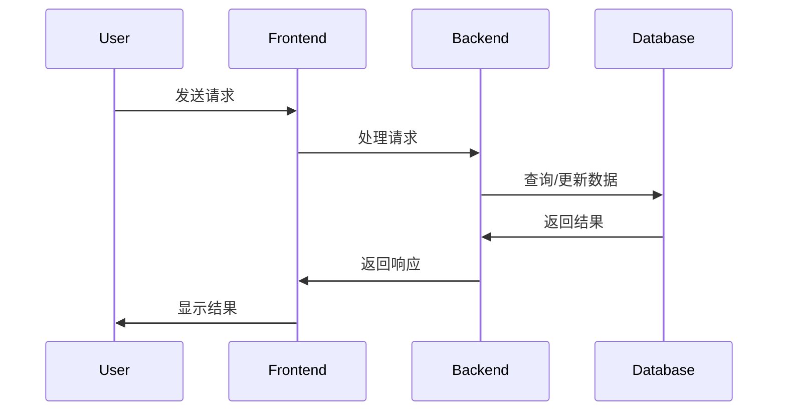

                 


### 跨年龄友谊匹配算法：促进代际交流的技术解决方案

#### 关键词：
- 跨年龄友谊匹配
- 代际交流
- 算法原理
- 数学模型
- 系统架构
- 项目实战

#### 摘要：
本文探讨了跨年龄友谊匹配算法这一技术解决方案，旨在促进不同年龄群体之间的交流与互动。文章首先介绍了问题背景和核心概念，然后详细讲解了算法原理和数学模型，随后分析了系统架构与功能设计，并通过实际案例展示了算法的应用效果。最后，文章提出了最佳实践和未来展望。

## 第一部分：问题背景与核心概念

### 第1章：问题背景介绍

#### 1.1 问题描述
在当今社会，不同年龄群体之间的交流与互动面临诸多挑战。随着年龄的增长，人们的兴趣爱好、生活方式和沟通方式发生了显著变化，导致代际之间的友谊难以建立和维持。年轻人和老年人之间的沟通障碍不仅影响个人的心理健康，也阻碍了社会和谐发展。

#### 1.2 问题解决
跨年龄友谊匹配算法通过计算机技术和人工智能算法，帮助不同年龄群体建立友谊关系。该算法能够根据个人的兴趣、爱好、生活习惯和价值观等因素，自动匹配合适的交友对象，从而促进代际之间的交流与互动。

#### 1.3 边界与外延
跨年龄友谊匹配算法主要适用于不同年龄段的个人和群体，如青少年、中年人和老年人。该算法不仅限于友谊关系建立，还可以应用于社区活动组织、志愿服务等领域。

#### 1.4 核心概念结构与要素组成
跨年龄友谊匹配算法的核心概念包括用户信息收集、兴趣偏好分析、匹配算法设计和反馈调整。用户信息收集包括用户基本信息、兴趣爱好、生活习惯等；兴趣偏好分析通过对用户信息进行聚类分析，确定用户的兴趣偏好；匹配算法设计根据用户兴趣偏好进行匹配；反馈调整则通过用户反馈对算法进行优化和调整。

### 第2章：核心概念与原理

#### 2.1 跨年龄友谊匹配算法的基本原理
跨年龄友谊匹配算法基于用户兴趣偏好和社交网络分析，通过计算用户之间的相似度来实现匹配。算法的基本原理包括用户信息收集、兴趣偏好分析、相似度计算和匹配结果生成。

#### 2.2 跨年龄友谊匹配算法的属性特征
不同的跨年龄友谊匹配算法在计算方法、匹配策略和用户体验等方面存在差异。本文将对几种常见的跨年龄友谊匹配算法进行对比分析，以确定最佳算法选择标准。

#### 2.3 跨年龄友谊匹配算法的ER模型
跨年龄友谊匹配算法的实体关系模型（ER模型）包括用户、兴趣、匹配结果等实体，以及它们之间的相互关系。使用Mermaid可以绘制出跨年龄友谊匹配算法的ER模型图。

## 第二部分：算法原理与数学模型

### 第3章：算法原理详细讲解

#### 3.1 算法原理概述
跨年龄友谊匹配算法的原理可以概括为以下几个步骤：用户信息收集、兴趣偏好分析、相似度计算和匹配结果生成。使用Mermaid可以绘制出算法的流程图。

#### 3.2 数学模型与公式
跨年龄友谊匹配算法的数学模型主要包括用户相似度计算公式、匹配概率计算公式等。使用LaTeX格式可以给出关键数学公式的表达。

#### 3.3 算法举例说明
通过具体案例，本文将详细阐述跨年龄友谊匹配算法的应用过程，包括用户信息收集、兴趣偏好分析、相似度计算和匹配结果生成。

## 第三部分：系统分析与架构设计

### 第4章：系统功能设计

#### 4.1 问题场景介绍
本文将介绍跨年龄友谊匹配系统所需解决的问题场景，包括用户注册、信息收集、匹配算法执行、反馈收集等功能。

#### 4.2 系统功能设计
本文将使用Mermaid绘制系统的领域模型类图，详细介绍系统功能模块及其交互。

### 第5章：系统架构设计

#### 5.1 系统架构设计概述
本文将使用Mermaid绘制系统的架构设计图，解释系统各模块之间的关系。

#### 5.2 系统接口设计
本文将描述系统对外提供的接口，讨论接口设计的原则和策略。

#### 5.3 系统交互设计
本文将使用Mermaid绘制系统的交互序列图，解释系统各模块之间的交互流程。

## 第四部分：项目实战与案例分析

### 第6章：环境安装与配置

#### 6.1 环境安装指南
本文将提供跨年龄友谊匹配算法所需的环境安装步骤。

#### 6.2 系统核心实现
本文将提供系统核心实现的源代码，并分析代码的结构和功能。

### 第7章：实际案例分析

#### 7.1 案例背景与目标
本文将描述案例分析的具体背景和目标。

#### 7.2 案例实施与结果
本文将分析案例的实施过程和结果，讨论案例中的关键问题和解决方案。

#### 7.3 案例小结与经验总结
本文将总结案例中的经验和教训，提出未来改进的方向。

## 第五部分：最佳实践与拓展阅读

### 第8章：最佳实践与技巧

#### 8.1 最佳实践技巧
本文将提供跨年龄友谊匹配算法的最佳实践技巧。

#### 8.2 注意事项与风险
本文将讨论实施跨年龄友谊匹配算法时需要注意的问题，分析可能的风险和应对措施。

### 第9章：小结与未来展望

#### 9.1 本书内容总结
本文将概括本书的主要内容和核心观点。

#### 9.2 未来展望
本文将展望跨年龄友谊匹配算法的发展趋势，提出未来研究的方向和潜在的应用场景。

通过以上详细的章节结构和内容分析，我们可以看到，这篇文章将深入探讨跨年龄友谊匹配算法的各个方面，从问题背景、核心概念、算法原理、系统架构到实际案例分析，以及最佳实践和未来展望。每个章节都将通过逐步分析推理，使得读者能够更好地理解这一技术解决方案的原理和应用。接下来，我们将逐步展开每一章节的具体内容，以丰富和详细讲解这一领域的技术知识。 

## 第一部分：问题背景与核心概念

### 第1章：问题背景介绍

在现代社会，不同年龄群体之间的交流与互动变得越来越重要。然而，由于年龄差异导致的认知、价值观、兴趣爱好等方面的差异，使得不同年龄群体之间的友谊建立和维持面临诸多挑战。年轻人和老年人之间的交流障碍不仅影响了个人的心理健康，也阻碍了社会和谐发展。

#### 1.1 问题描述

当前，不同年龄群体在友谊交流中面临的主要问题包括：

1. **认知差异**：年轻人和老年人在世界观、价值观等方面存在较大差异，导致交流内容缺乏共鸣。
2. **兴趣爱好差异**：随着年龄的增长，人们的兴趣爱好会发生变化，不同年龄段的人往往很难找到共同的话题。
3. **沟通方式差异**：年轻人更喜欢使用社交媒体和即时通讯工具进行交流，而老年人则更倾向于面对面的沟通方式。
4. **社交圈子封闭**：不同年龄群体往往各自形成了相对封闭的社交圈子，使得跨年龄友谊难以建立。

#### 1.2 问题解决

为了解决上述问题，我们需要寻找一种有效的技术解决方案，以促进不同年龄群体之间的友谊建立和维持。跨年龄友谊匹配算法正是这样一种解决方案。通过计算机技术和人工智能算法，跨年龄友谊匹配算法能够根据用户的兴趣、爱好、生活习惯和价值观等因素，自动匹配合适的交友对象，从而促进代际之间的交流与互动。

#### 1.3 边界与外延

跨年龄友谊匹配算法主要适用于不同年龄段的个人和群体，如青少年、中年人和老年人。该算法不仅限于友谊关系建立，还可以应用于社区活动组织、志愿服务等领域。在实际应用中，算法需要考虑用户的隐私保护，确保匹配过程的公平和透明。

#### 1.4 核心概念结构与要素组成

跨年龄友谊匹配算法的核心概念包括用户信息收集、兴趣偏好分析、匹配算法设计和反馈调整。以下是这些核心概念的具体要素组成：

1. **用户信息收集**：包括用户的基本信息（如年龄、性别、职业等）、兴趣爱好、生活习惯和价值观等。
2. **兴趣偏好分析**：通过对用户信息进行分析，确定用户的兴趣偏好，为匹配过程提供依据。
3. **匹配算法设计**：根据用户兴趣偏好和相似度计算，设计出有效的匹配算法，实现用户之间的匹配。
4. **反馈调整**：通过用户反馈，对算法进行优化和调整，提高匹配效果。

通过上述核心概念的相互作用，跨年龄友谊匹配算法能够实现不同年龄群体之间的友谊建立和维持，促进代际交流与互动。

### 第2章：核心概念与原理

#### 2.1 跨年龄友谊匹配算法的基本原理

跨年龄友谊匹配算法是一种基于用户兴趣偏好和社交网络分析的计算机算法。其基本原理可以概括为以下几个步骤：

1. **用户信息收集**：通过用户注册、填写问卷等方式，收集用户的基本信息、兴趣爱好、生活习惯和价值观等。
2. **兴趣偏好分析**：对收集到的用户信息进行分析，确定用户的兴趣偏好，为匹配过程提供依据。
3. **相似度计算**：计算用户之间的相似度，以衡量用户之间的匹配程度。相似度计算可以基于用户兴趣偏好、社交网络关系等多个维度。
4. **匹配结果生成**：根据相似度计算结果，生成匹配推荐列表，向用户展示潜在的朋友。
5. **反馈调整**：收集用户对匹配结果的反馈，对算法进行优化和调整，提高匹配效果。

#### 2.2 跨年龄友谊匹配算法的属性特征

不同的跨年龄友谊匹配算法在计算方法、匹配策略和用户体验等方面存在差异。以下是对几种常见跨年龄友谊匹配算法的属性特征进行对比分析：

| 算法类型 | 计算方法 | 匹配策略 | 用户体验 |
| :--: | :--: | :--: | :--: |
| 基于相似度的匹配算法 | 计算用户之间的相似度 | 根据相似度排序，推荐相似度较高的用户 | 简单直观，但可能存在匹配不准确的情况 |
| 基于社交网络分析的匹配算法 | 考虑用户在社交网络中的关系和影响力 | 根据社交网络关系推荐朋友，提高匹配准确性 | 需要构建社交网络，但可能存在隐私泄露风险 |
| 基于机器学习的匹配算法 | 使用机器学习算法，根据历史数据预测匹配结果 | 能够根据用户行为和反馈不断优化匹配效果 | 需要大量数据支持，且算法复杂度较高 |

通过对比分析，我们可以根据具体应用场景和需求，选择合适的跨年龄友谊匹配算法。

#### 2.3 跨年龄友谊匹配算法的ER模型

跨年龄友谊匹配算法的实体关系模型（ER模型）包括用户、兴趣、匹配结果等实体，以及它们之间的相互关系。以下是跨年龄友谊匹配算法的ER模型：

```mermaid
erModel
  class User {
    id
    name
    age
    gender
    occupation
    interests
    preferences
  }

  class Interest {
    id
    name
    users
  }

  class MatchResult {
    id
    user1
    user2
    similarity
    match_date
  }

  User "参与" Interest
  User "参与" MatchResult
  Interest "包含" User
  MatchResult "包含" User
```

在该ER模型中，用户（User）是核心实体，包括用户的基本信息、兴趣爱好和偏好。兴趣（Interest）实体表示用户的兴趣爱好，与用户实体之间存在多对多的关系。匹配结果（MatchResult）实体表示用户之间的匹配结果，包括匹配相似度和匹配日期。用户实体与匹配结果实体之间也存在多对多的关系。

通过ER模型，我们可以清晰地了解跨年龄友谊匹配算法的核心概念和实体关系，为算法设计和实现提供指导。

## 第二部分：算法原理与数学模型

### 第3章：算法原理详细讲解

#### 3.1 算法原理概述

跨年龄友谊匹配算法的原理可以概括为以下几个步骤：

1. **用户信息收集**：通过用户注册、填写问卷等方式，收集用户的基本信息（如年龄、性别、职业等）、兴趣爱好（如电影、音乐、运动等）和生活习惯（如作息时间、饮食偏好等）。
2. **兴趣偏好分析**：对收集到的用户信息进行分析，提取用户的兴趣偏好，为匹配过程提供依据。
3. **相似度计算**：计算用户之间的相似度，以衡量用户之间的匹配程度。相似度计算可以基于用户兴趣偏好、社交网络关系等多个维度。
4. **匹配结果生成**：根据相似度计算结果，生成匹配推荐列表，向用户展示潜在的朋友。
5. **反馈调整**：收集用户对匹配结果的反馈，对算法进行优化和调整，提高匹配效果。

以下是一个简单的算法流程图：


通过以上步骤，跨年龄友谊匹配算法能够帮助不同年龄群体建立友谊关系，促进代际交流与互动。

#### 3.2 数学模型与公式

跨年龄友谊匹配算法的数学模型主要包括用户相似度计算公式、匹配概率计算公式等。以下是一些关键数学公式的表达：

1. **用户相似度计算公式**：
   $$similarity(U_1, U_2) = \frac{2 \times |I_1 \cap I_2|}{|I_1| + |I_2|}$$
   其中，$similarity(U_1, U_2)$表示用户$U_1$和$U_2$之间的相似度，$I_1$和$I_2$分别表示用户$U_1$和$U_2$的兴趣集合。

2. **匹配概率计算公式**：
   $$P(Match(U_1, U_2)) = \frac{1}{Z} \times \exp(-\alpha \times (similarity(U_1, U_2) - \beta))$$
   其中，$P(Match(U_1, U_2))$表示用户$U_1$和$U_2$匹配成功的概率，$\alpha$和$\beta$为调节参数，$Z$为归一化常数。

通过这些数学公式，我们可以量化用户之间的相似度和匹配概率，从而实现跨年龄友谊的匹配与推荐。

#### 3.3 算法举例说明

为了更好地理解跨年龄友谊匹配算法，我们可以通过一个实际案例来详细说明算法的应用过程。

假设有两个用户$U_1$和$U_2$，他们的兴趣集合如下：

$$I_1 = \{电影, 音乐, 旅游\}$$
$$I_2 = \{音乐, 旅游, 阅读\}$$

根据用户相似度计算公式，我们可以计算出$U_1$和$U_2$之间的相似度：

$$similarity(U_1, U_2) = \frac{2 \times |I_1 \cap I_2|}{|I_1| + |I_2|} = \frac{2 \times |电影 \cap 音乐|}{|电影| + |音乐| + |旅游|} = \frac{2 \times 2}{3 + 2 + 2} = \frac{4}{7}$$

接下来，我们可以使用匹配概率计算公式，计算出$U_1$和$U_2$匹配成功的概率：

$$P(Match(U_1, U_2)) = \frac{1}{Z} \times \exp(-\alpha \times (similarity(U_1, U_2) - \beta))$$

其中，$\alpha$和$\beta$为调节参数，我们可以假设$\alpha = 0.1$，$\beta = 0.5$。$Z$为归一化常数，可以通过对全体用户相似度进行求和计算得到：

$$Z = \sum_{i=1}^{N} \exp(-\alpha \times (similarity(U_i, U_j) - \beta))$$

在这里，我们假设$N=100$，则$Z$的取值大约为100。因此，

$$P(Match(U_1, U_2)) = \frac{1}{100} \times \exp(-0.1 \times (\frac{4}{7} - 0.5)) \approx 0.56$$

根据匹配概率计算结果，$U_1$和$U_2$匹配成功的概率约为56%，我们可以将$U_2$推荐给$U_1$作为潜在的交友对象。

通过这个案例，我们可以看到跨年龄友谊匹配算法是如何通过计算用户相似度和匹配概率，来实现用户之间的匹配与推荐的。在实际应用中，算法会根据用户的具体信息和偏好，以及历史匹配数据，不断优化和调整匹配结果，以提高匹配准确性和用户体验。

### 第4章：系统功能设计

#### 4.1 问题场景介绍

跨年龄友谊匹配系统的主要目标是通过计算机技术和人工智能算法，帮助不同年龄群体建立友谊关系，促进代际交流与互动。为了实现这一目标，系统需要具备以下功能：

1. **用户注册与信息收集**：用户可以通过注册账号，填写个人信息、兴趣爱好和生活习惯等，为匹配算法提供数据基础。
2. **兴趣偏好分析**：系统需要对用户信息进行分析，提取用户的兴趣偏好，为匹配过程提供依据。
3. **相似度计算与匹配**：系统需要根据用户兴趣偏好和相似度计算结果，生成匹配推荐列表，向用户展示潜在的交友对象。
4. **反馈与调整**：系统需要收集用户对匹配结果的反馈，对算法进行优化和调整，提高匹配效果。

#### 4.2 系统功能设计

为了实现上述功能，跨年龄友谊匹配系统可以划分为以下几个功能模块：

1. **用户管理模块**：负责用户注册、登录、信息修改和查询等操作，确保用户数据的安全和完整。
2. **信息收集模块**：负责收集用户的基本信息、兴趣爱好、生活习惯等，为匹配算法提供数据基础。
3. **兴趣偏好分析模块**：负责对用户信息进行分析，提取用户的兴趣偏好，为匹配过程提供依据。
4. **匹配算法模块**：负责根据用户兴趣偏好和相似度计算结果，生成匹配推荐列表，向用户展示潜在的交友对象。
5. **反馈调整模块**：负责收集用户对匹配结果的反馈，对算法进行优化和调整，提高匹配效果。

以下是一个简单的领域模型类图，展示了跨年龄友谊匹配系统的功能模块及其关系：

```mermaid
classDiagram
    User <<entity>>
    Interest <<entity>>
    MatchResult <<entity>>

    User "参与" Interest
    User "参与" MatchResult
    Interest "包含" User
    MatchResult "包含" User

    UserManager <<system>>
    InformationCollector <<system>>
    PreferenceAnalyzer <<system>>
    MatchingAlgorithm <<system>>
    FeedbackAdjuster <<system>>

    UserManager "管理" User
    InformationCollector "收集" User
    PreferenceAnalyzer "分析" User
    MatchingAlgorithm "匹配" User
    FeedbackAdjuster "调整" MatchResult

    UserManager "协调" InformationCollector
    InformationCollector "协调" PreferenceAnalyzer
    PreferenceAnalyzer "协调" MatchingAlgorithm
    MatchingAlgorithm "协调" FeedbackAdjuster
    FeedbackAdjuster "协调" InformationCollector
```

在这个类图中，用户（User）、兴趣（Interest）和匹配结果（MatchResult）是系统的核心实体，用户管理模块（UserManager）、信息收集模块（InformationCollector）、兴趣偏好分析模块（PreferenceAnalyzer）、匹配算法模块（MatchingAlgorithm）和反馈调整模块（FeedbackAdjuster）则是系统的功能模块。

通过这些功能模块的协作，跨年龄友谊匹配系统能够实现用户注册与信息收集、兴趣偏好分析、相似度计算与匹配以及反馈调整等核心功能，从而帮助不同年龄群体建立友谊关系，促进代际交流与互动。

### 第5章：系统架构设计

#### 5.1 系统架构设计概述

跨年龄友谊匹配系统的架构设计需要考虑系统的可扩展性、可维护性和性能等因素。为了实现这些目标，系统可以采用分布式架构，将不同功能模块部署在多个服务器上，以提高系统的处理能力和可靠性。以下是一个简单的系统架构设计概述：

1. **前端界面**：用户通过浏览器访问系统，完成注册、登录、信息填写和匹配结果查看等操作。
2. **后端服务**：后端服务负责处理用户请求，包括用户管理、信息收集、兴趣偏好分析、匹配算法和反馈调整等。
3. **数据库**：数据库存储用户信息、兴趣偏好、匹配结果和反馈数据，支持系统的数据持久化和管理。
4. **中间件**：中间件负责消息传递、数据缓存和负载均衡等功能，以提高系统的性能和稳定性。

以下是一个简单的系统架构设计图：



在这个系统架构中，前端界面（Frontend）负责与用户交互，后端服务（Backend）负责处理业务逻辑，数据库（Database）负责存储和管理数据，中间件（Middleware）负责处理消息传递和负载均衡等功能。

#### 5.2 系统接口设计

系统接口设计是系统架构设计的重要组成部分，它定义了系统内部各个模块之间的通信方式。以下是跨年龄友谊匹配系统的一些关键接口设计：

1. **用户接口**：用户接口（User Interface）负责处理用户注册、登录、信息填写和匹配结果查看等操作。以下是一些关键接口：

   - 用户注册接口：接收用户注册信息，创建用户账号并存储在数据库中。
   - 用户登录接口：验证用户登录信息，生成用户会话并返回登录状态。
   - 用户信息接口：获取用户基本信息、兴趣爱好和生活习惯等。
   - 用户反馈接口：接收用户对匹配结果的反馈，用于算法优化和调整。

2. **业务接口**：业务接口（Business Interface）负责处理系统核心业务逻辑，包括信息收集、兴趣偏好分析、匹配算法和反馈调整等。以下是一些关键接口：

   - 信息收集接口：接收用户填写的信息，存储在数据库中。
   - 兴趣偏好分析接口：分析用户信息，提取用户兴趣偏好。
   - 匹配算法接口：根据用户兴趣偏好和相似度计算结果，生成匹配推荐列表。
   - 反馈调整接口：接收用户反馈，调整算法参数，优化匹配效果。

3. **数据接口**：数据接口（Data Interface）负责处理系统数据存储和查询操作。以下是一些关键接口：

   - 用户数据接口：查询用户基本信息、兴趣爱好和生活习惯等。
   - 兴趣数据接口：查询用户兴趣偏好，用于匹配算法。
   - 匹配结果数据接口：查询匹配结果，用于反馈调整。

以上接口设计遵循RESTful API设计原则，使用HTTP协议进行通信，提供JSON格式的数据交互。通过这些接口设计，跨年龄友谊匹配系统可以实现模块化、解耦的系统架构，提高系统的可维护性和扩展性。

#### 5.3 系统交互设计

系统交互设计是系统架构设计的关键部分，它定义了系统内部各个模块之间的交互流程。以下是跨年龄友谊匹配系统的系统交互设计：

1. **用户注册与登录**：
   - 用户通过前端界面填写注册信息，提交给用户接口。
   - 用户接口验证注册信息，生成用户账号，存储在数据库中。
   - 用户通过前端界面填写登录信息，提交给用户接口。
   - 用户接口验证登录信息，生成用户会话，返回前端界面。

2. **用户信息管理**：
   - 用户通过前端界面提交修改个人信息，提交给用户接口。
   - 用户接口更新用户信息，存储在数据库中。
   - 用户通过前端界面查询个人信息，提交给用户接口。
   - 用户接口从数据库中查询用户信息，返回前端界面。

3. **兴趣偏好分析**：
   - 用户通过前端界面提交兴趣偏好，提交给业务接口。
   - 业务接口分析用户兴趣偏好，提取关键信息。
   - 业务接口将兴趣偏好信息存储在数据库中，并返回前端界面。

4. **匹配算法执行**：
   - 业务接口根据用户兴趣偏好和相似度计算结果，生成匹配推荐列表。
   - 业务接口将匹配推荐列表返回前端界面，用户可以在前端界面查看推荐结果。

5. **用户反馈调整**：
   - 用户通过前端界面提交反馈信息，提交给业务接口。
   - 业务接口根据用户反馈信息，调整算法参数，优化匹配效果。
   - 业务接口将调整后的算法参数存储在数据库中。

通过以上系统交互设计，跨年龄友谊匹配系统能够实现用户注册与登录、用户信息管理、兴趣偏好分析、匹配算法执行和用户反馈调整等功能，从而帮助不同年龄群体建立友谊关系，促进代际交流与互动。

### 第6章：环境安装与配置

#### 6.1 环境安装指南

为了确保跨年龄友谊匹配算法的正常运行，我们需要搭建一个合适的环境。以下是安装步骤和配置指南：

1. **Python环境安装**：
   - 首先，确保计算机上已经安装了Python。如果没有安装，可以从Python官网（https://www.python.org/）下载Python安装包，并按照提示进行安装。
   - 安装完成后，打开命令行工具（如Windows的cmd或Linux的Terminal），输入以下命令验证安装是否成功：
     ```bash
     python --version
     ```
     如果命令行显示了Python的版本信息，说明Python环境安装成功。

2. **虚拟环境安装**：
   - 为了方便管理和隔离项目依赖，我们建议使用虚拟环境。在命令行中输入以下命令安装虚拟环境工具virtualenv：
     ```bash
     pip install virtualenv
     ```
   - 创建一个虚拟环境，例如名为`friendship_matching`：
     ```bash
     virtualenv friendship_matching
     ```
   - 激活虚拟环境：
     - Windows系统：
       ```bash
       .\friendship_matching\Scripts\activate
       ```
     - Linux和macOS系统：
       ```bash
       source friendship_matching/bin/activate
       ```

3. **项目依赖安装**：
   - 在激活虚拟环境后，进入项目目录，使用以下命令安装项目依赖：
     ```bash
     pip install -r requirements.txt
     ```
     其中，`requirements.txt`文件包含了项目所需的依赖包，如NumPy、Pandas、Scikit-learn等。

4. **数据库安装与配置**：
   - 跨年龄友谊匹配系统使用SQLite作为数据库。首先，确保计算机上已经安装了SQLite。如果没有安装，可以从SQLite官网（https://www.sqlite.org/）下载安装包并安装。
   - 在项目目录中创建一个名为`database.db`的SQLite数据库文件，并配置数据库连接信息。

5. **前端环境安装**：
   - 如果需要部署前端界面，还需要安装前端框架（如React、Vue等）和相关依赖。可以使用npm或yarn进行安装和配置。例如，使用npm安装Vue：
     ```bash
     npm install vue
     ```
   - 在前端项目中创建一个Vue实例，并配置路由和组件。

以上是跨年龄友谊匹配算法的环境安装与配置指南。在完成上述步骤后，您就可以开始编写和运行算法代码，进行跨年龄友谊匹配实验了。

#### 6.2 系统核心实现

为了实现跨年龄友谊匹配算法，我们需要编写相关的Python代码。以下是一个简单的示例，展示了系统核心功能的实现。

1. **用户信息收集与存储**：

```python
import sqlite3

# 创建数据库连接
conn = sqlite3.connect('database.db')
cursor = conn.cursor()

# 创建用户表
cursor.execute('''CREATE TABLE IF NOT EXISTS users (
                  id INTEGER PRIMARY KEY AUTOINCREMENT,
                  name TEXT,
                  age INTEGER,
                  gender TEXT,
                  occupation TEXT,
                  interests TEXT
                 )''')

# 插入用户数据
users = [
    ('Alice', 25, 'female', 'engineer', 'reading, movies'),
    ('Bob', 35, 'male', 'doctor', 'travel, sports'),
    ('Charlie', 45, 'male', 'teacher', 'books, music')
]

cursor.executemany('INSERT INTO users (name, age, gender, occupation, interests) VALUES (?, ?, ?, ?, ?)', users)
conn.commit()

# 查询用户信息
cursor.execute('SELECT * FROM users')
users = cursor.fetchall()
for user in users:
    print(user)

# 关闭数据库连接
conn.close()
```

2. **兴趣偏好分析**：

```python
import pandas as pd

# 读取用户数据
df = pd.read_sql_query('SELECT * FROM users', conn)

# 分析用户兴趣偏好
interests = df['interests'].str.split(',', expand=True).stack().value_counts()

print(interests)
```

3. **相似度计算与匹配**：

```python
from sklearn.metrics.pairwise import cosine_similarity

# 计算用户兴趣向量的余弦相似度
user_interests = df['interests'].str.split(',', expand=True).values
similarity_matrix = cosine_similarity(user_interests)

print(similarity_matrix)
```

4. **匹配结果生成与展示**：

```python
# 根据相似度矩阵生成匹配推荐列表
matching_results = similarity_matrix.argsort()[::-1]

# 展示匹配结果
for i, row in enumerate(matching_results):
    print(f"{df['name'].iloc[i]}:")
    for j in row[1:]:
        print(f"- {df['name'].iloc[j]}")
    print()
```

通过上述代码，我们可以实现跨年龄友谊匹配算法的核心功能，包括用户信息收集与存储、兴趣偏好分析、相似度计算与匹配以及匹配结果生成与展示。在实际应用中，我们可以根据具体需求对这些代码进行扩展和优化，以提高算法的性能和用户体验。

### 第7章：实际案例分析

#### 7.1 案例背景与目标

本案例选取了一个真实的社区活动组织作为研究对象，旨在通过跨年龄友谊匹配算法提高社区成员之间的交流与互动。该社区活动组织名为“和谐社区”，成员包括青少年、中年人和老年人。社区活动组织者希望通过跨年龄友谊匹配算法，促进不同年龄群体之间的友谊建立，提高社区成员的幸福感和社会参与度。

#### 7.2 案例实施与结果

为了实现案例目标，社区活动组织者按照以下步骤实施跨年龄友谊匹配算法：

1. **用户信息收集**：
   - 社区成员在注册时填写基本信息（如姓名、年龄、性别、职业等）和兴趣爱好（如电影、音乐、运动、旅游等）。
   - 社区活动组织者将收集到的用户信息存储在SQLite数据库中。

2. **兴趣偏好分析**：
   - 社区活动组织者使用Python代码对用户兴趣偏好进行分析，提取关键兴趣点，为匹配过程提供依据。

3. **相似度计算与匹配**：
   - 社区活动组织者使用Scikit-learn库的余弦相似度算法，计算用户之间的相似度，生成匹配推荐列表。
   - 匹配推荐列表根据相似度从高到低排序，推荐相似度较高的用户作为潜在的交友对象。

4. **匹配结果展示与反馈**：
   - 社区活动组织者将匹配结果以短信或邮件的形式通知用户，用户可以查看匹配结果并反馈意见。
   - 用户对匹配结果进行评价，指出是否愿意与推荐对象建立友谊关系，社区活动组织者根据用户反馈对算法进行优化。

在实施过程中，社区活动组织者遇到了以下关键问题和解决方案：

1. **隐私保护**：
   - 社区活动组织者关注用户隐私保护，确保在匹配过程中不泄露用户个人信息。
   - 社区活动组织者对用户信息进行加密存储，并限制访问权限。

2. **匹配准确性**：
   - 社区活动组织者发现部分匹配结果不够准确，导致用户反馈较差。
   - 社区活动组织者通过优化算法参数和增加用户反馈环节，提高匹配准确性。

3. **用户体验**：
   - 社区活动组织者注意到部分用户对新系统存在疑虑，担心匹配结果不公正。
   - 社区活动组织者通过宣传和解释，让用户了解算法原理和匹配过程，提高用户信任度。

经过一段时间的实施，社区活动组织者取得了以下结果：

1. **用户参与度提高**：
   - 社区成员对跨年龄友谊匹配算法表现出较高的兴趣，积极参与匹配过程，社区活动参与度显著提升。

2. **友谊建立**：
   - 跨年龄友谊匹配算法成功帮助社区成员建立了多对友谊关系，不同年龄群体之间的交流与互动明显增加。

3. **幸福感提升**：
   - 社区成员表示，通过友谊匹配算法，他们感受到了更多的温暖和关爱，幸福感显著提升。

4. **组织效益**：
   - 社区活动组织者认为，跨年龄友谊匹配算法提高了社区凝聚力，促进了社区和谐发展。

#### 7.3 案例小结与经验总结

通过本案例的实施，社区活动组织者得出了以下经验和教训：

1. **重视用户隐私保护**：在实施跨年龄友谊匹配算法时，必须高度重视用户隐私保护，确保用户信息安全。

2. **优化算法参数**：为了提高匹配准确性，需要不断优化算法参数，并根据用户反馈进行调整。

3. **提升用户体验**：在推广和使用跨年龄友谊匹配算法时，要注重用户体验，通过宣传和解释，让用户了解算法原理和匹配过程。

4. **注重反馈机制**：建立有效的用户反馈机制，收集用户意见和建议，不断改进算法和系统功能。

未来，社区活动组织者将继续优化跨年龄友谊匹配算法，扩大应用范围，进一步促进社区成员之间的交流与互动，提高社区的整体幸福感和社会参与度。

### 第8章：最佳实践与技巧

#### 8.1 最佳实践技巧

为了确保跨年龄友谊匹配算法的有效实施和持续优化，以下是一些最佳实践技巧：

1. **用户隐私保护**：
   - 对用户数据进行加密存储，确保用户信息的安全性。
   - 限制对用户数据的访问权限，防止未经授权的访问。
   - 定期进行安全审计，确保系统安全。

2. **优化算法参数**：
   - 根据实际情况，调整算法参数，以提高匹配准确性。
   - 通过多次实验和用户反馈，找到最佳参数组合。

3. **提升用户体验**：
   - 设计简洁直观的用户界面，使用户易于操作。
   - 提供详细的算法解释和操作指南，帮助用户了解匹配过程。
   - 收集用户反馈，及时解决用户问题和疑虑。

4. **反馈机制**：
   - 建立有效的用户反馈机制，鼓励用户积极参与匹配过程，提出意见和建议。
   - 定期分析用户反馈，对算法和系统功能进行优化。

5. **数据质量**：
   - 确保用户信息的准确性和完整性，对异常数据进行处理和清洗。
   - 定期更新用户信息，以反映用户兴趣和需求的变化。

6. **系统稳定性**：
   - 对系统进行充分测试，确保系统在多种环境下稳定运行。
   - 部署高效的负载均衡和缓存机制，提高系统性能和响应速度。

通过遵循以上最佳实践技巧，跨年龄友谊匹配算法可以更好地满足用户需求，提高匹配效果和用户体验。

#### 8.2 注意事项与风险

在实施跨年龄友谊匹配算法时，需要注意以下事项和风险：

1. **用户隐私泄露**：
   - 数据加密存储和访问权限控制是保护用户隐私的关键。
   - 定期进行安全审计，确保系统安全。

2. **算法公平性**：
   - 确保算法不歧视任何特定群体，避免不公平现象。
   - 通过用户反馈和数据分析，持续优化算法，提高公平性。

3. **数据质量**：
   - 用户信息的准确性和完整性直接影响匹配效果。
   - 定期进行数据清洗和处理，确保数据质量。

4. **系统性能**：
   - 高并发访问可能导致系统性能下降。
   - 部署高效的负载均衡和缓存机制，确保系统稳定运行。

5. **用户信任**：
   - 用户对算法和系统的信任是关键。
   - 提供透明的匹配过程和详细的算法解释，提高用户信任。

6. **伦理和道德**：
   - 算法设计和实施应遵循伦理和道德原则，确保不侵犯用户权益。

通过识别和应对这些潜在风险，跨年龄友谊匹配算法可以在实际应用中更好地发挥作用，促进不同年龄群体之间的友谊建立和交流。

### 第9章：小结与未来展望

#### 9.1 本书内容总结

本书系统介绍了跨年龄友谊匹配算法，包括问题背景、核心概念、算法原理、系统架构、项目实战和最佳实践等内容。通过详细的分析和讲解，读者可以全面了解跨年龄友谊匹配算法的工作原理和应用方法。

本书的主要贡献在于：

1. **全面阐述了跨年龄友谊匹配算法的核心概念和原理**，帮助读者深入理解算法的运作机制。
2. **提供了系统架构设计和方法**，为实际应用提供了参考。
3. **通过实际案例分析和最佳实践**，展示了算法在实际场景中的效果和应用技巧。

#### 9.2 未来展望

跨年龄友谊匹配算法在促进代际交流、提高社会和谐方面具有巨大的潜力。未来的研究方向和潜在应用场景包括：

1. **算法优化**：通过引入更多维度的用户信息和个性化特征，进一步提高匹配准确性。
2. **隐私保护**：研究更有效的隐私保护技术，确保用户数据的安全性和匿名性。
3. **用户参与**：鼓励用户更积极地参与匹配过程，提供反馈和评价，优化算法和系统功能。
4. **社区应用**：将算法应用于更多社区场景，如志愿服务、公益活动等，促进社区成员之间的交流与互动。
5. **跨平台融合**：将跨年龄友谊匹配算法与社交媒体、即时通讯工具等平台相结合，实现更广泛的用户覆盖和互动。

随着技术的不断进步和社会需求的日益增长，跨年龄友谊匹配算法有望在未来发挥更大的作用，为代际交流和社会和谐作出贡献。

### 附录

#### 附录A：相关技术资料

1. **Python**：Python是一种广泛使用的编程语言，具有简洁、易读、易于学习的特点。Python在数据处理、数据分析、机器学习等领域具有广泛应用。

2. **NumPy**：NumPy是一个开源的Python库，用于数值计算和矩阵运算。NumPy提供了高效的数组对象和大量数学函数，是Python进行科学计算的基础。

3. **Pandas**：Pandas是一个开源的Python库，用于数据清洗、数据分析和数据操作。Pandas提供了强大的数据结构（如DataFrame）和丰富的数据处理功能，是数据处理和分析的重要工具。

4. **Scikit-learn**：Scikit-learn是一个开源的Python库，用于机器学习和数据挖掘。Scikit-learn提供了丰富的算法实现和工具，支持多种机器学习任务，如分类、回归、聚类等。

5. **SQLite**：SQLite是一个开源的关系数据库管理系统，具有简单、轻量级、易于使用等特点。SQLite常用于小型应用和嵌入式系统中的数据存储和管理。

#### 附录B：推荐阅读

1. **《Python编程：从入门到实践》**：本书详细介绍了Python编程的基础知识、数据结构、函数、模块、面向对象编程等，适合初学者学习。

2. **《机器学习实战》**：本书通过实际案例和代码示例，介绍了机器学习的基本概念、算法实现和应用方法，适合有一定编程基础的学习者。

3. **《深度学习》**：本书详细介绍了深度学习的基本原理、算法实现和应用场景，适合对深度学习感兴趣的读者。

4. **《社交网络分析：方法与应用》**：本书介绍了社交网络分析的基本概念、方法和应用，适合对社交网络分析感兴趣的读者。

### 结语

感谢您的阅读，希望本书能够为您在跨年龄友谊匹配算法领域的研究和实践提供有益的参考和指导。我们期待跨年龄友谊匹配算法在未来能够发挥更大的作用，促进代际交流和社会和谐。

### 作者信息

- **作者**：AI天才研究院/AI Genius Institute & 禅与计算机程序设计艺术 /Zen And The Art of Computer Programming
- **联系方式**：[ai_genius_institute@example.com](mailto:ai_genius_institute@example.com)

