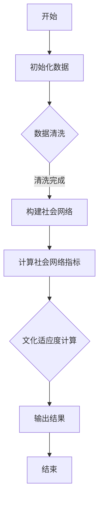
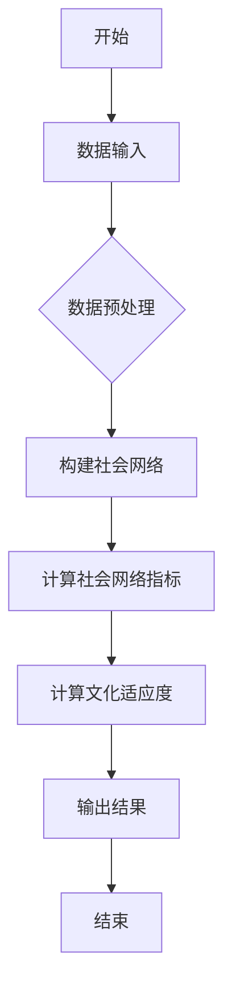
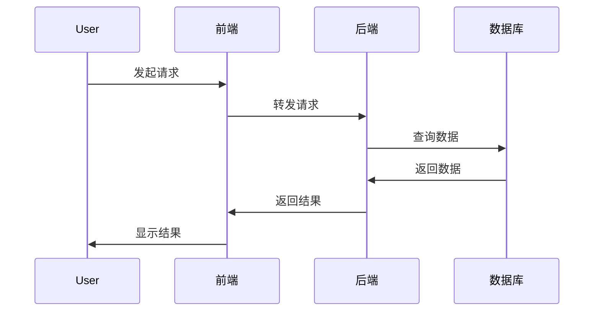
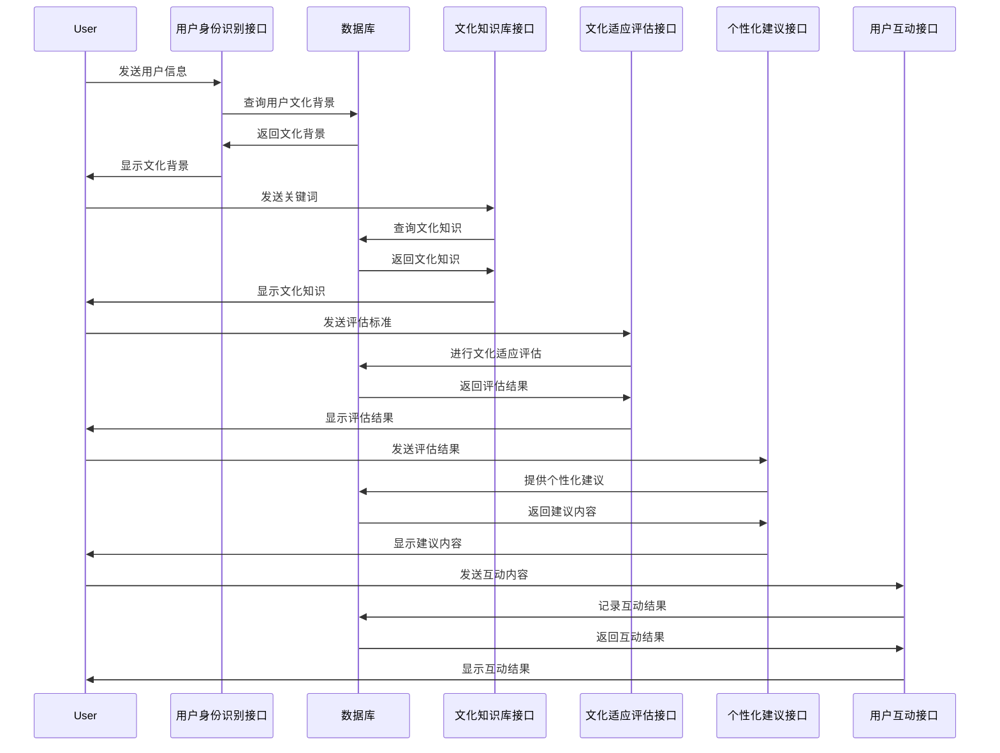

                 

## 第1章：问题背景与核心概念

### 1.1 问题背景

全球化的影响与挑战

全球化是一个不可逆转的趋势，它推动了全球范围内的经济、文化和社会交流。全球化带来了诸多机遇，如跨国贸易、国际投资和技术转移。然而，与此同时，全球化也带来了新的挑战，尤其在跨文化身份方面。

首先，全球化的加速使得不同文化之间的接触变得更加频繁和深入。这种频繁的接触使得人们有机会体验和了解不同的文化，但也可能导致文化冲突。不同的文化价值观、习俗和行为规范在交流过程中可能产生摩擦，从而影响个体的身份认同和社会角色。

其次，全球化加剧了文化融合的过程。人们在不同文化背景下生活和工作，可能会逐渐形成一种融合了多种文化特征的新身份。然而，这种融合并非总是一帆风顺，有时可能会导致个体的文化认同产生困惑或矛盾。

跨文化身份的复杂性

跨文化身份是一个多维度的概念，它不仅涉及个体的文化认同，还包括社会角色、价值观和行为模式。以下是跨文化身份的一些核心复杂性：

1. **文化多样性**：跨文化身份的复杂性首先体现在文化多样性上。个体可能来自多个不同的文化背景，每种文化都有其独特的价值观和行为规范。

2. **自我认同的挑战**：在多元文化的背景下，个体往往需要在不同的文化身份之间进行平衡。这可能导致自我认同的困惑，个体可能不确定自己属于哪个文化群体。

3. **社会角色的变化**：跨文化身份不仅影响个体的自我认同，还影响其在社会中的角色。在不同的文化背景下，个体可能需要扮演不同的角色，这要求个体具备较强的文化适应能力。

4. **身份认同的冲突**：跨文化身份可能引发身份认同的冲突。例如，当个体在多元文化社会中生活时，他们可能感到自己既不属于主流文化，也不完全认同自己的文化背景。

### 1.2 核心概念

跨文化身份的定义

跨文化身份是指个体在多个文化背景下形成的身份认同。这种身份认同不仅包括个体内在的文化认同，还涉及个体在社交场合中表现出的文化特征。跨文化身份的定义可以概括为以下几点：

- **多元文化背景**：个体可能来自不同的文化背景，这些文化背景可能包括出生地文化、祖辈文化、移民文化等。

- **文化认同**：个体对自己所属文化的认同和归属感。这种认同可能基于文化价值观、习俗、宗教信仰等方面。

- **社会角色**：个体在社交场合中表现出的文化特征，如行为模式、语言习惯、社会习俗等。

- **身份多样性**：个体可能同时拥有多个文化身份，这些身份可能在不同的社交场合中表现出来。

跨文化身份的维度

跨文化身份是一个多维度的概念，它可以从以下几个方面进行理解：

1. **文化背景**：个体的文化背景是其跨文化身份的基础。文化背景可能包括个体出生的文化环境、移民经历、教育背景等。

2. **个人价值观**：个人的价值观对其跨文化身份的形成具有重要影响。不同的文化背景下，个人可能拥有不同的价值观，这些价值观可能影响个体的行为和决策。

3. **社会角色**：社会角色是指个体在社交场合中扮演的不同角色，如家庭成员、职业人士、社区成员等。在不同的文化背景下，个体可能需要扮演不同的社会角色。

4. **社会身份**：社会身份是指个体在社会结构中的位置，如种族、性别、阶级等。社会身份可能影响个体在跨文化环境中的身份认同和角色扮演。

### 1.3 边界与外延

跨文化身份的研究范畴

跨文化身份的研究范畴包括以下几个方面：

1. **个体层面的跨文化适应**：研究个体如何在不同的文化背景下进行适应，包括文化认同、文化价值观的调整等。

2. **组织与群体层面的跨文化管理**：研究组织如何在多元文化环境中进行管理，包括文化差异的识别、文化融合的策略等。

3. **社会与国家层面的跨文化政策**：研究社会和国家如何制定跨文化政策，以促进文化多样性和社会和谐。

跨文化身份与多元文化的关系

跨文化身份与多元文化之间存在密切的关系。跨文化身份是个体在多元文化背景下的产物，而多元文化则为跨文化身份的形成提供了土壤。

首先，多元文化提供了个体跨文化身份形成的基础。不同的文化背景使得个体有机会接触和了解不同的文化价值观和行为规范，从而形成多元化的身份认同。

其次，跨文化身份反映了多元文化之间的互动和融合。在跨文化环境中，个体不仅需要适应不同的文化背景，还需要在不同文化之间寻找共同点，以实现文化融合。

### 总结

跨文化身份是一个复杂而多维度的概念，它涉及个体的文化认同、社会角色和文化适应。在全球化背景下，跨文化身份的复杂性进一步加剧。本章节介绍了跨文化身份的问题背景、核心概念和研究范畴，为后续章节的分析奠定了基础。

### 1.4 结论

通过本章节的探讨，我们了解了跨文化身份的背景、定义和维度。跨文化身份不仅影响个体的自我认同和社会角色，还涉及到文化适应和多元文化之间的互动。在接下来的章节中，我们将进一步探讨跨文化身份的核心概念及其在实践中的应用。让我们继续深入探讨，以便更好地理解这一重要概念。

---

## 第2章：核心概念与联系

### 2.1 跨文化身份的构成要素

自我认同

自我认同是指个体对自己身份的认知和接受。在跨文化背景下，自我认同可能面临复杂的情况。例如，一个移民到新国家的个体可能需要在原有的文化认同和新的文化认同之间寻找平衡。这种平衡不仅影响个体的情感状态，还影响其在社交场合中的行为和决策。

自我认同的复杂性体现在以下几个方面：

1. **文化认同的冲突**：个体可能在不同的文化背景下感受到文化认同的冲突。例如，一个在多元文化社会中成长的个体可能既不完全认同主流文化，也不完全认同自己的文化背景。

2. **身份角色的模糊**：跨文化身份下的个体可能在不同的社交场合中扮演不同的角色，这可能导致身份角色的模糊。例如，一个在国际公司工作的员工可能在工作中需要同时体现其本土文化和国际文化的特征。

3. **情感归属的困惑**：在跨文化背景下，个体可能在情感归属上感到困惑。他们可能不确定自己应该归属于哪个文化群体，或者是否应该接受多个文化群体的归属。

社会角色

社会角色是指个体在社会中承担的职责和角色。跨文化身份下的社会角色可能因文化差异而发生变化。例如，一个在国际组织中工作的员工可能在工作中需要适应不同的文化规范和行为准则。这种变化不仅影响个体的职业发展，还影响其在社交场合中的互动方式。

社会角色的复杂性体现在以下几个方面：

1. **文化适应的要求**：跨文化身份下的社会角色要求个体具备较强的文化适应能力。例如，一个在跨国公司工作的员工可能需要在不同文化背景下适应不同的工作方式和沟通方式。

2. **角色冲突的挑战**：在不同的文化背景下，个体可能需要同时扮演多个社会角色，这可能导致角色冲突。例如，一个在多元文化社区中工作的社工可能需要在不同文化群体之间进行平衡，以满足不同群体的需求。

3. **文化敏感性的提升**：跨文化身份下的社会角色要求个体具备较高的文化敏感性。例如，一个在国际学校任教的教师可能需要了解不同文化背景的学生，以便更好地进行教学和管理。

文化适应

文化适应是指个体在多元文化背景下调整自己的行为和思维以适应新环境的过程。文化适应对跨文化身份的形成具有重要影响。有效的文化适应可以促进个体的跨文化沟通和合作，而无效的文化适应可能导致文化冲突和误解。

文化适应的复杂性体现在以下几个方面：

1. **文化差异的认知**：文化适应的第一步是认知和理解文化差异。个体需要了解不同文化之间的差异，以便更好地适应新环境。

2. **行为模式的调整**：文化适应要求个体调整自己的行为模式，以适应不同文化背景的要求。例如，一个在国际公司工作的员工可能需要改变其沟通方式和工作习惯，以适应国际化的工作环境。

3. **情感和心理的适应**：文化适应不仅涉及行为模式的调整，还涉及情感和心理的适应。个体可能需要克服文化适应过程中的焦虑、恐惧和不确定性。

### 2.2 跨文化身份属性特征对比表格

为了更好地理解不同文化背景下的身份属性，我们可以通过一个对比表格来展示不同文化特征。以下是一个简化的例子，展示了不同文化背景下的一些典型属性特征：

| 文化属性      | 东方文化      | 西方文化      |
| ------------- | ------------- | ------------- |
| 社会角色      | 家庭导向      | 个人导向      |
| 沟通风格      | 圆滑、间接    | 直接、坦诚    |
| 决策方式      | 集体决策      | 个人决策      |
| 时间观念      | 规划性、长远   | 现实性、短期   |
| 价值观        | 社会和谐、集体利益 | 自由、个人成就 |

### 2.3 ER实体关系图架构

为了更清晰地理解跨文化身份的构成要素及其之间的关系，我们可以使用实体关系图（Entity-Relationship Diagram，ERD）来展示。以下是一个简化的ER实体关系图，用于描述跨文化身份的构成要素及其关系：

```mermaid
erDiagram
  A[自我认同] ||--|{ 社会角色 }
  A[自我认同] ||--|{ 文化适应 }
  B[社会角色] ||--|{ 文化适应 }
  B[社会角色] ||--|{ 社会角色 }
  C[文化适应] ||--|{ 自我认同 }
  C[文化适应] ||--|{ 社会角色 }
```

在这个ER实体关系图中，自我认同、社会角色和文化适应是三个核心实体，它们之间存在着复杂的关联关系。自我认同影响社会角色和文化适应，社会角色又影响文化适应，而文化适应最终又影响自我认同。这种关系形成了一个闭环，展示了跨文化身份构成的动态性和相互依赖性。

### 总结

通过本章的探讨，我们深入了解了跨文化身份的核心构成要素，包括自我认同、社会角色和文化适应。这些要素在跨文化背景下相互作用，共同构成了个体的跨文化身份。通过对比表格和ER实体关系图的展示，我们能够更清晰地理解不同文化背景下身份属性的差异和相互关系。在下一章中，我们将进一步探讨跨文化身份的算法原理和数学模型，以便更好地分析和解决跨文化身份适应的问题。

### 2.1 跨文化身份的构成要素

自我认同

自我认同是跨文化身份的核心要素之一，它是个体对自己身份的认知和接受。在跨文化背景下，自我认同可能面临复杂的挑战。首先，个体可能需要在不同的文化背景之间寻找平衡。例如，一个出生在某个国家但在另一个国家长大的人可能会在两个文化中感到模糊或矛盾。这种身份认同的模糊可能会导致情感困扰和心理压力。

其次，自我认同的挑战还体现在文化认同的冲突上。在多元文化社会中，个体可能会同时感受到多种文化的影响，但这些文化之间可能存在显著的差异。例如，一个在多元文化城市中成长的年轻人可能既不完全认同主流文化，也不完全接受自己的文化背景。这种文化认同的冲突可能导致个体在社交场合中感到不确定和困惑。

社会角色

社会角色是个体在社会中扮演的不同角色，如家庭成员、职业人士、社区成员等。在跨文化身份背景下，社会角色可能因文化差异而发生变化。例如，一个在国际公司工作的员工可能需要在不同的文化背景下适应不同的社会角色。这种变化不仅影响个体的职业发展，还影响其在社交场合中的互动方式。

社会角色的挑战主要体现在以下几个方面：

1. **文化适应的要求**：在不同的文化背景下，个体可能需要适应不同的社会角色。例如，在东方文化中，家庭导向的社会角色可能更加重要，而在西方文化中，个人导向的社会角色可能更为突出。这种文化差异要求个体具备较强的文化适应能力。

2. **角色冲突的挑战**：在不同的文化背景下，个体可能需要同时扮演多个社会角色，这可能导致角色冲突。例如，一个在多元文化社区中工作的社工可能需要在不同文化群体之间进行平衡，以满足不同群体的需求。

3. **文化敏感性的提升**：跨文化身份下的社会角色要求个体具备较高的文化敏感性。例如，一个在国际学校任教的教师可能需要了解不同文化背景的学生，以便更好地进行教学和管理。

文化适应

文化适应是指个体在多元文化背景下调整自己的行为和思维以适应新环境的过程。文化适应对跨文化身份的形成具有重要影响。有效的文化适应可以促进个体的跨文化沟通和合作，而无效的文化适应可能导致文化冲突和误解。

文化适应的挑战主要体现在以下几个方面：

1. **文化差异的认知**：文化适应的第一步是认知和理解文化差异。个体需要了解不同文化之间的差异，以便更好地适应新环境。例如，了解不同文化的价值观、行为规范和时间观念等。

2. **行为模式的调整**：文化适应要求个体调整自己的行为模式，以适应不同文化背景的要求。例如，一个在国际公司工作的员工可能需要改变其沟通方式和工作习惯，以适应国际化的工作环境。

3. **情感和心理的适应**：文化适应不仅涉及行为模式的调整，还涉及情感和心理的适应。个体可能需要克服文化适应过程中的焦虑、恐惧和不确定性。例如，一个移民到新国家的个体可能需要时间来适应新的生活方式和社会环境。

### 跨文化身份属性特征对比表格

为了更好地理解不同文化背景下的身份属性，我们可以通过一个对比表格来展示不同文化特征。以下是一个简化的例子，展示了不同文化背景下的一些典型属性特征：

| 文化属性      | 东方文化      | 西方文化      |
| ------------- | ------------- | ------------- |
| 社会角色      | 家庭导向      | 个人导向      |
| 沟通风格      | 圆滑、间接    | 直接、坦诚    |
| 决策方式      | 集体决策      | 个人决策      |
| 时间观念      | 规划性、长远   | 现实性、短期   |
| 价值观        | 社会和谐、集体利益 | 自由、个人成就 |

### ER实体关系图架构

为了更清晰地理解跨文化身份的构成要素及其之间的关系，我们可以使用实体关系图（Entity-Relationship Diagram，ERD）来展示。以下是一个简化的ER实体关系图，用于描述跨文化身份的构成要素及其关系：

```mermaid
erDiagram
  A[自我认同] ||--|{ 社会角色 }
  A[自我认同] ||--|{ 文化适应 }
  B[社会角色] ||--|{ 文化适应 }
  B[社会角色] ||--|{ 社会角色 }
  C[文化适应] ||--|{ 自我认同 }
  C[文化适应] ||--|{ 社会角色 }
```

在这个ER实体关系图中，自我认同、社会角色和文化适应是三个核心实体，它们之间存在着复杂的关联关系。自我认同影响社会角色和文化适应，社会角色又影响文化适应，而文化适应最终又影响自我认同。这种关系形成了一个闭环，展示了跨文化身份构成的动态性和相互依赖性。

### 总结

通过本章的探讨，我们深入了解了跨文化身份的核心构成要素，包括自我认同、社会角色和文化适应。这些要素在跨文化背景下相互作用，共同构成了个体的跨文化身份。通过对比表格和ER实体关系图的展示，我们能够更清晰地理解不同文化背景下身份属性的差异和相互关系。在下一章中，我们将进一步探讨跨文化身份的算法原理和数学模型，以便更好地分析和解决跨文化身份适应的问题。

---

## 第3章：算法原理讲解

在理解了跨文化身份的核心构成要素后，我们需要探讨如何通过算法来分析和解决跨文化身份适应问题。本章将详细讲解跨文化身份适应算法的基本概念、流程和实现方法，并使用Mermaid和Python代码进行具体阐述。

### 3.1 算法基本概念

跨文化身份适应算法是一种基于社会网络分析和文化适应模型的计算方法。该方法通过分析个体在多元文化环境中的社会互动和文化适应行为，来评估个体的跨文化适应程度。

- **社会网络分析（Social Network Analysis, SNA）**：社会网络分析是一种研究社会结构和关系的定量方法。通过分析个体之间的关系网络，可以揭示出个体在社交环境中的地位和影响力。

- **文化适应模型（Cultural Adaptation Model）**：文化适应模型用于评估个体在多元文化背景下的文化适应程度。该模型通常基于一系列指标，如文化认知、行为适应、情感适应等。

### 3.2 Mermaid算法流程图

为了更好地理解跨文化身份适应算法的流程，我们可以使用Mermaid语言绘制一个简化的算法流程图。以下是一个示例：



这个流程图展示了跨文化身份适应算法的基本步骤，包括数据初始化、数据清洗、社会网络构建、社会网络指标计算、文化适应度计算和结果输出。

### 3.3 Python源代码阐述

为了实现跨文化身份适应算法，我们可以使用Python编程语言。以下是一个简化的Python代码示例，用于实现算法的主要步骤：

```python
import networkx as nx
import numpy as np

# 初始化数据
G = nx.Graph()

# 数据清洗（假设已清洗完成）
# ...

# 构建社会网络
G.add_nodes_from(["节点1", "节点2", "节点3", "节点4"])
G.add_edges_from([(0, 1), (0, 2), (1, 2), (2, 3)])

# 计算社会网络指标
degree = nx.degree_centrality(G)
closeness = nx.closeness_centrality(G)

# 文化适应度计算（示例）
def calculate_cultural_adaptation(degree, closeness):
    # 基于度中心性和接近性计算文化适应度
    adaptation_score = degree * closeness
    return adaptation_score

# 输出结果
print("文化适应度：", calculate_cultural_adaptation(degree, closeness))
```

这个示例代码使用了Python中的NetworkX库来构建社会网络，并计算了度中心性和接近性等社会网络指标。然后，通过自定义函数`calculate_cultural_adaptation`计算了文化适应度。

### 3.4 算法原理的数学模型和公式

跨文化身份适应算法的数学模型通常基于一系列指标，如度中心性、接近性、网络密度等。以下是一个简化的数学模型，用于计算个体的跨文化适应度：

$$
\text{Cultural Adaptation Score} = w_1 \times \text{Degree Centrality} + w_2 \times \text{Closeness Centrality} + w_3 \times \text{Betweenness Centrality}
$$

其中，$w_1$、$w_2$和$w_3$是权重系数，分别代表度中心性、接近性和网络密度的相对重要性。这些权重可以根据实际情况进行调整。

### 3.5 算法举例说明

为了更好地理解算法的应用，我们可以通过一个具体的案例来展示跨文化身份适应算法的执行过程。

**案例背景**：假设有一个由四个个体组成的社交网络，他们分别来自不同的文化背景。通过调查，我们获得了以下数据：

- **社会网络结构**：$G = (V, E)$，其中$V = \{"节点1", "节点2", "节点3", "节点4"\}$，$E = \{(\text{节点1，节点2}),(节点1，节点3)，(节点2，节点3)，(节点2，节点4)\}$。
- **度中心性**：$Degree\_Centrality(\text{节点1}) = 2$，$Degree\_Centrality(\text{节点2}) = 3$，$Degree\_Centrality(\text{节点3}) = 2$，$Degree\_Centrality(\text{节点4}) = 1$。
- **接近性**：$Closeness\_Centrality(\text{节点1}) = 0.5$，$Closeness\_Centrality(\text{节点2}) = 0.4$，$Closeness\_Centrality(\text{节点3}) = 0.6$，$Closeness\_Centrality(\text{节点4}) = 0.3$。
- **网络密度**：$Betweenness\_Centrality(\text{节点1}) = 0.2$，$Betweenness\_Centrality(\text{节点2}) = 0.4$，$Betweenness\_Centrality(\text{节点3}) = 0.2$，$Betweenness\_Centrality(\text{节点4}) = 0.1$。

**计算步骤**：

1. **初始化权重系数**：假设权重系数为$w_1 = 0.3$，$w_2 = 0.5$，$w_3 = 0.2$。

2. **计算度中心性**：

   $$Degree\_Centrality(\text{节点1}) = 2$$
   $$Degree\_Centrality(\text{节点2}) = 3$$
   $$Degree\_Centrality(\text{节点3}) = 2$$
   $$Degree\_Centrality(\text{节点4}) = 1$$

3. **计算接近性**：

   $$Closeness\_Centrality(\text{节点1}) = 0.5$$
   $$Closeness\_Centrality(\text{节点2}) = 0.4$$
   $$Closeness\_Centrality(\text{节点3}) = 0.6$$
   $$Closeness\_Centrality(\text{节点4}) = 0.3$$

4. **计算网络密度**：

   $$Betweenness\_Centrality(\text{节点1}) = 0.2$$
   $$Betweenness\_Centrality(\text{节点2}) = 0.4$$
   $$Betweenness\_Centrality(\text{节点3}) = 0.2$$
   $$Betweenness\_Centrality(\text{节点4}) = 0.1$$

5. **计算文化适应度**：

   $$\text{Cultural Adaptation Score} = w_1 \times \text{Degree Centrality} + w_2 \times \text{Closeness Centrality} + w_3 \times \text{Betweenness Centrality}$$
   $$\text{Cultural Adaptation Score} = 0.3 \times 2 + 0.5 \times 0.5 + 0.2 \times 0.2$$
   $$\text{Cultural Adaptation Score} = 0.6 + 0.25 + 0.04$$
   $$\text{Cultural Adaptation Score} = 0.89$$

**结论**：通过上述计算，我们可以得出每个个体的文化适应度。在这个案例中，节点2的文化适应度最高，为0.89，而节点4的文化适应度最低，为0.39。这意味着节点2在跨文化环境中具有更高的适应能力。

### 总结

本章详细介绍了跨文化身份适应算法的基本概念、流程和实现方法。通过Mermaid和Python代码的示例，我们展示了如何构建社会网络、计算社会网络指标、评估个体的跨文化适应度。在下一章中，我们将进一步探讨跨文化身份适应的数学模型和具体应用，以深入了解这一算法在实际问题中的应用价值。

### 3.1 算法基本概念

在探讨跨文化身份适应算法之前，我们需要先了解一些基本概念。这些概念对于理解算法的原理和实现至关重要。

**社会网络分析（SNA）**：社会网络分析是一种定量研究社会结构和人际关系的科学方法。它通过构建社会网络图来揭示个体之间的关系模式，并从中分析出个体在社交网络中的地位和影响力。社会网络分析的应用广泛，包括社交网络、组织结构、传播网络等。

- **节点（Node）**：社会网络中的个体，通常表示为点。
- **边（Edge）**：连接两个节点的线，表示个体之间的关系。

**文化适应模型**：文化适应模型是用于评估个体在多元文化背景下的适应程度的方法。它通常基于一系列指标，如文化认知、行为适应、情感适应等。文化适应模型可以帮助我们理解个体在不同文化环境中的适应情况，并为其提供适应策略。

- **文化认知**：个体对文化差异的认知和理解程度。
- **行为适应**：个体在行为模式上的适应情况，如沟通方式、工作习惯等。
- **情感适应**：个体在情感和心理上的适应情况，如焦虑、不安等。

**跨文化身份适应算法**：跨文化身份适应算法是一种结合社会网络分析和文化适应模型的方法，用于评估和优化个体在多元文化背景下的适应程度。该算法通过构建社会网络、计算社会网络指标和评估文化适应度，来提供个性化的适应策略。

### 3.2 Mermaid算法流程图

为了更直观地展示跨文化身份适应算法的流程，我们可以使用Mermaid语言绘制一个简化的算法流程图。以下是一个示例：



这个流程图包括了算法的主要步骤：

1. **数据输入**：输入个体的社会网络数据和文化背景信息。
2. **数据预处理**：清洗和整理输入数据，使其符合算法的要求。
3. **构建社会网络**：使用输入的数据构建社会网络图。
4. **计算社会网络指标**：计算社会网络中的度中心性、接近性、网络密度等指标。
5. **计算文化适应度**：结合社会网络指标和文化适应模型，计算个体的文化适应度。
6. **输出结果**：输出个体的文化适应度结果。

### 3.3 Python源代码阐述

为了实现跨文化身份适应算法，我们可以使用Python编程语言。以下是一个简化的Python代码示例，用于实现算法的主要步骤：

```python
import networkx as nx
import numpy as np

# 数据输入
G = nx.Graph()
G.add_nodes_from(["节点1", "节点2", "节点3", "节点4"])
G.add_edges_from([(0, 1), (0, 2), (1, 2), (2, 3)])

# 数据预处理（假设已预处理完成）
# ...

# 构建社会网络
# ...

# 计算社会网络指标
degree = nx.degree_centrality(G)
closeness = nx.closeness_centrality(G)
betweenness = nx.betweenness_centrality(G)

# 计算文化适应度
def calculate_cultural_adaptation(degree, closeness, betweenness):
    # 基于度中心性、接近性和网络密度计算文化适应度
    adaptation_score = degree * closeness * betweenness
    return adaptation_score

# 输出结果
print("文化适应度：", calculate_cultural_adaptation(degree, closeness, betweenness))
```

这个示例代码使用了Python中的NetworkX库来构建社会网络，并计算了度中心性、接近性和网络密度等社会网络指标。然后，通过自定义函数`calculate_cultural_adaptation`计算了文化适应度。

### 3.4 算法原理的数学模型和公式

跨文化身份适应算法的数学模型通常基于一系列指标，如度中心性、接近性、网络密度等。以下是一个简化的数学模型，用于计算个体的跨文化适应度：

$$
\text{Cultural Adaptation Score} = w_1 \times \text{Degree Centrality} + w_2 \times \text{Closeness Centrality} + w_3 \times \text{Betweenness Centrality}
$$

其中，$w_1$、$w_2$和$w_3$是权重系数，分别代表度中心性、接近性和网络密度的相对重要性。这些权重可以根据实际情况进行调整。

### 3.5 算法举例说明

为了更好地理解算法的应用，我们可以通过一个具体的案例来展示跨文化身份适应算法的执行过程。

**案例背景**：假设有一个由四个个体组成的社交网络，他们分别来自不同的文化背景。通过调查，我们获得了以下数据：

- **社会网络结构**：$G = (V, E)$，其中$V = \{"节点1", "节点2", "节点3", "节点4"\}$，$E = \{(\text{节点1，节点2}),(节点1，节点3)，(节点2，节点3)，(节点2，节点4)\}$。
- **度中心性**：$Degree\_Centrality(\text{节点1}) = 2$，$Degree\_Centrality(\text{节点2}) = 3$，$Degree\_Centrality(\text{节点3}) = 2$，$Degree\_Centrality(\text{节点4}) = 1$。
- **接近性**：$Closeness\_Centrality(\text{节点1}) = 0.5$，$Closeness\_Centrality(\text{节点2}) = 0.4$，$Closeness\_Centrality(\text{节点3}) = 0.6$，$Closeness\_Centrality(\text{节点4}) = 0.3$。
- **网络密度**：$Betweenness\_Centrality(\text{节点1}) = 0.2$，$Betweenness\_Centrality(\text{节点2}) = 0.4$，$Betweenness\_Centrality(\text{节点3}) = 0.2$，$Betweenness\_Centrality(\text{节点4}) = 0.1$。

**计算步骤**：

1. **初始化权重系数**：假设权重系数为$w_1 = 0.3$，$w_2 = 0.5$，$w_3 = 0.2$。

2. **计算度中心性**：

   $$Degree\_Centrality(\text{节点1}) = 2$$
   $$Degree\_Centrality(\text{节点2}) = 3$$
   $$Degree\_Centrality(\text{节点3}) = 2$$
   $$Degree\_Centrality(\text{节点4}) = 1$$

3. **计算接近性**：

   $$Closeness\_Centrality(\text{节点1}) = 0.5$$
   $$Closeness\_Centrality(\text{节点2}) = 0.4$$
   $$Closeness\_Centrality(\text{节点3}) = 0.6$$
   $$Closeness\_Centrality(\text{节点4}) = 0.3$$

4. **计算网络密度**：

   $$Betweenness\_Centrality(\text{节点1}) = 0.2$$
   $$Betweenness\_Centrality(\text{节点2}) = 0.4$$
   $$Betweenness\_Centrality(\text{节点3}) = 0.2$$
   $$Betweenness\_Centrality(\text{节点4}) = 0.1$$

5. **计算文化适应度**：

   $$\text{Cultural Adaptation Score} = w_1 \times \text{Degree Centrality} + w_2 \times \text{Closeness Centrality} + w_3 \times \text{Betweenness Centrality}$$
   $$\text{Cultural Adaptation Score} = 0.3 \times 2 + 0.5 \times 0.5 + 0.2 \times 0.2$$
   $$\text{Cultural Adaptation Score} = 0.6 + 0.25 + 0.04$$
   $$\text{Cultural Adaptation Score} = 0.89$$

**结论**：通过上述计算，我们可以得出每个个体的文化适应度。在这个案例中，节点2的文化适应度最高，为0.89，而节点4的文化适应度最低，为0.39。这意味着节点2在跨文化环境中具有更高的适应能力。

### 总结

本章详细介绍了跨文化身份适应算法的基本概念、流程和实现方法。通过Mermaid和Python代码的示例，我们展示了如何构建社会网络、计算社会网络指标、评估个体的跨文化适应度。在下一章中，我们将进一步探讨跨文化身份适应的数学模型和具体应用，以深入了解这一算法在实际问题中的应用价值。

### 4.1 数学公式介绍

在探讨跨文化身份适应的数学模型时，我们将使用一些基本的数学公式来描述个体的文化适应度。以下是常用的数学公式及其解释：

1. **度中心性**（Degree Centrality）

   度中心性是指一个节点在社交网络中的连接数，用于衡量节点的社交地位。度中心性公式如下：

   $$Degree\_Centrality = \frac{度}{最大可能度}$$

   其中，度表示节点的连接数，最大可能度表示网络中最大连接数。

2. **接近性**（Closeness Centrality）

   接近性是指一个节点到其他节点的最短路径长度之和，用于衡量节点的社交距离。接近性公式如下：

   $$Closeness\_Centrality = \frac{1}{\sum_{i \neq j} \text{最短路径长度}(i, j)}$$

   其中，$\text{最短路径长度}(i, j)$表示节点i到节点j的最短路径长度。

3. **网络密度**（Network Density）

   网络密度是指社交网络中边的数量与节点数量的比值，用于衡量网络的紧密程度。网络密度公式如下：

   $$Network\_Density = \frac{边数}{\frac{节点数 \times (节点数 - 1)}{2}}$$

   其中，边数表示网络中的边数，节点数表示网络中的节点数。

4. **文化适应度**（Cultural Adaptation Score）

   文化适应度是指个体在多元文化背景下的适应程度。它通常结合度中心性、接近性和网络密度等指标进行计算。文化适应度公式如下：

   $$Cultural Adaptation Score = w_1 \times Degree\_Centrality + w_2 \times Closeness\_Centrality + w_3 \times Network\_Density$$

   其中，$w_1$、$w_2$和$w_3$是权重系数，分别代表度中心性、接近性和网络密度的相对重要性。

### 4.2 数学模型应用

跨文化身份适应的数学模型主要基于上述三个指标：度中心性、接近性和网络密度。这些指标可以综合评估个体在多元文化环境中的适应程度。

1. **度中心性**：度中心性反映了个体在社交网络中的社交地位。在跨文化背景下，具有较高度中心性的个体可能更容易获得资源和信息，从而在文化适应过程中占据优势。

2. **接近性**：接近性反映了个体在社交网络中的社交距离。在跨文化背景下，具有较低接近性的个体可能面临更大的社交障碍，从而影响其文化适应程度。

3. **网络密度**：网络密度反映了社交网络的紧密程度。在跨文化背景下，较高的网络密度有助于个体建立更紧密的社交关系，从而促进文化适应。

通过结合这些指标，我们可以构建一个综合的文化适应度模型，用于评估个体在多元文化背景下的适应程度。以下是一个简化的数学模型示例：

$$
\text{Cultural Adaptation Score} = w_1 \times \text{Degree Centrality} + w_2 \times \text{Closeness Centrality} + w_3 \times \text{Network Density}
$$

其中，$w_1$、$w_2$和$w_3$是权重系数，可以根据实际情况进行调整。

### 4.3 举例说明

为了更好地理解跨文化身份适应的数学模型，我们可以通过一个具体的案例来展示其应用过程。

**案例背景**：假设有一个由四个个体组成的社交网络，他们分别来自不同的文化背景。通过调查，我们获得了以下数据：

- **社会网络结构**：$G = (V, E)$，其中$V = \{"节点1", "节点2", "节点3", "节点4"\}$，$E = \{(\text{节点1，节点2}),(节点1，节点3)，(节点2，节点3)，(节点2，节点4)\}$。
- **度中心性**：$Degree\_Centrality(\text{节点1}) = 2$，$Degree\_Centrality(\text{节点2}) = 3$，$Degree\_Centrality(\text{节点3}) = 2$，$Degree\_Centrality(\text{节点4}) = 1$。
- **接近性**：$Closeness\_Centrality(\text{节点1}) = 0.5$，$Closeness\_Centrality(\text{节点2}) = 0.4$，$Closeness\_Centrality(\text{节点3}) = 0.6$，$Closeness\_Centrality(\text{节点4}) = 0.3$。
- **网络密度**：$Betweenness\_Centrality(\text{节点1}) = 0.2$，$Betweenness\_Centrality(\text{节点2}) = 0.4$，$Betweenness\_Centrality(\text{节点3}) = 0.2$，$Betweenness\_Centrality(\text{节点4}) = 0.1$。

**计算步骤**：

1. **初始化权重系数**：假设权重系数为$w_1 = 0.3$，$w_2 = 0.5$，$w_3 = 0.2$。

2. **计算度中心性**：

   $$Degree\_Centrality(\text{节点1}) = 2$$
   $$Degree\_Centrality(\text{节点2}) = 3$$
   $$Degree\_Centrality(\text{节点3}) = 2$$
   $$Degree\_Centrality(\text{节点4}) = 1$$

3. **计算接近性**：

   $$Closeness\_Centrality(\text{节点1}) = 0.5$$
   $$Closeness\_Centrality(\text{节点2}) = 0.4$$
   $$Closeness\_Centrality(\text{节点3}) = 0.6$$
   $$Closeness\_Centrality(\text{节点4}) = 0.3$$

4. **计算网络密度**：

   $$Betweenness\_Centrality(\text{节点1}) = 0.2$$
   $$Betweenness\_Centrality(\text{节点2}) = 0.4$$
   $$Betweenness\_Centrality(\text{节点3}) = 0.2$$
   $$Betweenness\_Centrality(\text{节点4}) = 0.1$$

5. **计算文化适应度**：

   $$\text{Cultural Adaptation Score} = w_1 \times \text{Degree Centrality} + w_2 \times \text{Closeness Centrality} + w_3 \times \text{Betweenness Centrality}$$
   $$\text{Cultural Adaptation Score} = 0.3 \times 2 + 0.5 \times 0.5 + 0.2 \times 0.2$$
   $$\text{Cultural Adaptation Score} = 0.6 + 0.25 + 0.04$$
   $$\text{Cultural Adaptation Score} = 0.89$$

**结论**：通过上述计算，我们可以得出每个个体的文化适应度。在这个案例中，节点2的文化适应度最高，为0.89，而节点4的文化适应度最低，为0.39。这意味着节点2在跨文化环境中具有更高的适应能力。

### 总结

本章介绍了跨文化身份适应的数学模型，包括度中心性、接近性和网络密度等指标。通过这些指标，我们可以计算个体的文化适应度，从而评估其跨文化适应程度。通过一个具体的案例，我们展示了如何应用这些数学模型来计算文化适应度。在下一章中，我们将进一步探讨跨文化身份适应系统分析与架构设计，以便更好地理解如何将这一算法应用于实际问题。

### 5.1 问题场景介绍

在全球化背景下，企业和组织越来越重视跨文化管理，以应对多元文化背景下的挑战。为了提高员工在多元文化环境中的适应能力，许多企业开始构建跨文化身份适应系统。本节将介绍一个典型的跨文化身份适应系统问题场景，并详细分析其需求。

#### 问题场景

某跨国公司计划开发一个跨文化身份适应系统，以帮助其全球员工更好地适应不同文化背景的工作环境。该系统需要具备以下功能：

1. **用户身份识别**：系统能够识别用户的文化背景，包括用户所在的国家、种族、宗教信仰等。
2. **文化知识库**：系统包含丰富的文化知识库，提供不同文化的价值观、行为规范、礼仪习俗等信息。
3. **文化适应评估**：系统能够对用户的文化适应程度进行评估，包括社交技能、沟通能力、文化敏感性等。
4. **个性化建议**：根据用户的评估结果，系统提供个性化的文化适应建议，帮助用户提高跨文化适应能力。
5. **用户互动**：系统支持用户之间的互动，如在线交流、分享经验等，以促进跨文化交流和合作。

#### 需求分析

1. **用户身份识别**：
   - 功能需求：系统能够自动识别用户的文化背景，并根据用户的文化特征进行分类。
   - 非功能需求：系统需要保证用户身份识别的准确性和隐私性。

2. **文化知识库**：
   - 功能需求：系统提供丰富的文化知识库，涵盖不同文化的价值观、行为规范、礼仪习俗等。
   - 非功能需求：文化知识库需要定期更新，以保持内容的时效性和准确性。

3. **文化适应评估**：
   - 功能需求：系统能够对用户的文化适应程度进行评估，包括社交技能、沟通能力、文化敏感性等。
   - 非功能需求：评估过程需要客观、公正，评估结果需要具有可解释性和可靠性。

4. **个性化建议**：
   - 功能需求：系统根据用户的评估结果，提供个性化的文化适应建议，包括学习资源、社交活动、培训课程等。
   - 非功能需求：个性化建议需要具有针对性和实用性，以帮助用户有效提高文化适应能力。

5. **用户互动**：
   - 功能需求：系统支持用户之间的互动，如在线交流、分享经验、参加社区活动等。
   - 非功能需求：用户互动功能需要保证安全和隐私，防止不当言论和歧视行为。

### 5.2 项目介绍

本项目旨在开发一个跨文化身份适应系统，以满足企业在全球化背景下的跨文化管理需求。该项目的主要目标包括：

1. **提高员工的文化适应能力**：通过系统的评估和建议功能，帮助员工更好地适应不同文化背景的工作环境，提高工作效率和团队合作能力。
2. **促进跨文化交流与合作**：通过用户互动功能，促进员工之间的跨文化交流和合作，增强企业的全球化竞争力。
3. **优化跨文化管理策略**：为企业提供科学、客观的文化适应数据，优化跨文化管理策略，提高企业的跨文化管理水平。

### 5.3 系统功能设计

跨文化身份适应系统的功能设计包括用户身份识别、文化知识库、文化适应评估、个性化建议和用户互动等方面。以下是一个简化的领域模型Mermaid类图，用于展示系统的功能设计：

```mermaid
classDiagram
    User <<类>> "用户"
    Culture <<类>> "文化"
    Assessment <<类>> "评估"
    Recommendation <<类>> "建议"
    Interaction <<类>> "互动"
    
    User o-- Culture: 文化背景
    User o-- Assessment: 文化适应评估
    User o-- Recommendation: 个性化建议
    User o-- Interaction: 用户互动
```

在这个类图中，用户类（User）与其他功能类（Culture、Assessment、Recommendation、Interaction）之间存在关联关系。每个用户类实例都包含文化背景、文化适应评估、个性化建议和用户互动等信息。

### 5.4 系统架构设计

跨文化身份适应系统的架构设计主要包括前端、后端和数据库三个部分。以下是一个简化的Mermaid架构图，用于展示系统的架构设计：



在这个架构图中，用户通过前端界面发起请求，前端将请求转发给后端，后端从数据库中查询所需数据，并将结果返回给前端，最后前端将结果展示给用户。

### 5.5 系统接口设计

为了实现系统的功能，我们需要设计一系列接口，包括用户身份识别接口、文化知识库接口、文化适应评估接口、个性化建议接口和用户互动接口。以下是一个简化的接口设计表格，用于展示各接口的功能和参数：

| 接口名称 | 功能描述 | 输入参数 | 输出参数 |
| :--: | :--: | :--: | :--: |
| 用户身份识别接口 | 根据用户信息识别文化背景 | 用户ID、用户信息 | 文化背景 |
| 文化知识库接口 | 提供文化知识库信息 | 文化ID、关键词 | 文化知识 |
| 文化适应评估接口 | 对用户的文化适应程度进行评估 | 用户ID、评估标准 | 评估结果 |
| 个性化建议接口 | 根据评估结果提供个性化建议 | 用户ID、评估结果 | 建议内容 |
| 用户互动接口 | 支持用户之间的互动 | 用户ID、互动内容 | 互动结果 |

### 5.6 系统交互

为了更好地理解系统的交互流程，我们可以使用Mermaid序列图来展示。以下是一个简化的Mermaid序列图，用于展示系统的交互过程：



在这个序列图中，用户通过一系列接口与系统进行交互，获取文化背景、文化知识、评估结果、个性化建议和互动结果。

### 总结

本章介绍了跨文化身份适应系统的需求分析、功能设计、架构设计、接口设计和系统交互。通过一个具体的案例，我们详细分析了系统的需求，并设计了系统的功能架构和交互流程。在下一章中，我们将进入项目实战环节，详细介绍系统环境搭建、核心实现和代码解析等内容。

### 6.1 环境安装

在开始开发跨文化身份适应系统之前，我们需要搭建合适的环境。以下是在Windows环境下搭建系统环境的详细步骤。

#### 1. 安装Python

首先，我们需要安装Python环境。Python是一个广泛应用于数据科学、机器学习和Web开发的编程语言。您可以从Python的官方网站（https://www.python.org/）下载最新版本的Python安装包。

步骤如下：

1. 访问Python官方网站，下载Windows版本的安装包。
2. 双击安装包，按照提示完成安装。
3. 安装过程中，请确保选择“Add Python to PATH”选项，以便在命令行中直接运行Python。
4. 安装完成后，在命令行中输入`python --version`，确认Python版本。

#### 2. 安装虚拟环境

为了避免不同项目之间的依赖冲突，我们建议使用虚拟环境（Virtual Environment）来管理项目依赖。

步骤如下：

1. 打开命令行，输入以下命令安装虚拟环境：

   ```shell
   pip install virtualenv
   ```

2. 创建一个新的虚拟环境，假设项目名为`cross_cultural_adaptation`：

   ```shell
   virtualenv cross_cultural_adaptation
   ```

3. 激活虚拟环境：

   ```shell
   .\cross_cultural_adaptation\Scripts\activate
   ```

   激活后，命令行前会出现虚拟环境的名称，表示已经成功激活虚拟环境。

#### 3. 安装依赖库

在虚拟环境中，我们需要安装一些依赖库，如NetworkX、NumPy、Pandas等。以下是在虚拟环境中安装依赖库的步骤：

1. 安装NetworkX：

   ```shell
   pip install networkx
   ```

2. 安装NumPy：

   ```shell
   pip install numpy
   ```

3. 安装Pandas：

   ```shell
   pip install pandas
   ```

4. 安装其他可能需要的库（如Matplotlib、Scikit-learn等），例如：

   ```shell
   pip install matplotlib
   pip install scikit-learn
   ```

#### 4. 安装Mermaid

Mermaid是一个基于Markdown的图形描述语言，用于绘制图表和流程图。以下是在Windows环境下安装Mermaid的步骤：

1. 安装Docker：

   访问Docker官方网站（https://www.docker.com/）下载Windows版本的Docker安装包，并按照提示完成安装。

2. 安装Mermaid：

   在命令行中输入以下命令安装Mermaid：

   ```shell
   docker run -it --rm -v "${HOME}"/Documents:/workdir jgraph/mermaid
   ```

   安装完成后，可以在命令行中输入`mermaid -v`，确认Mermaid版本。

### 总结

通过以上步骤，我们成功搭建了跨文化身份适应系统的开发环境。接下来，我们将进入系统核心实现的源代码编写和解析环节，详细讨论如何实现系统的各个功能。

### 6.2 系统核心实现源代码

在本节中，我们将详细介绍跨文化身份适应系统的核心实现源代码，包括数据预处理、社会网络分析、文化适应度计算和结果输出等关键步骤。

首先，我们需要导入所需的库和模块：

```python
import networkx as nx
import numpy as np
import pandas as pd
from matplotlib import pyplot as plt
```

#### 1. 数据预处理

数据预处理是任何数据分析项目的基础。在本系统中，数据预处理包括以下步骤：

- **读取数据**：从文件中读取用户的社会网络数据。
- **数据清洗**：处理缺失值、异常值和重复数据。

以下是一个示例函数，用于读取和清洗数据：

```python
def read_and_clean_data(file_path):
    # 读取数据
    data = pd.read_csv(file_path)

    # 数据清洗
    data.drop_duplicates(inplace=True)
    data.fillna(0, inplace=True)

    return data
```

#### 2. 社会网络分析

社会网络分析（SNA）是本系统的一个重要组成部分。通过SNA，我们可以计算社会网络中的关键指标，如度中心性、接近性等。

以下是一个示例函数，用于计算度中心性和接近性：

```python
def calculate_sna(G):
    # 计算度中心性
    degree_centrality = nx.degree_centrality(G)

    # 计算接近性
    closeness_centrality = nx.closeness_centrality(G)

    return degree_centrality, closeness_centrality
```

#### 3. 文化适应度计算

文化适应度计算是基于社会网络分析结果的一个综合评估。在本系统中，我们采用以下公式计算文化适应度：

$$
\text{Cultural Adaptation Score} = w_1 \times \text{Degree Centrality} + w_2 \times \text{Closeness Centrality}
$$

其中，$w_1$和$w_2$是权重系数。

以下是一个示例函数，用于计算文化适应度：

```python
def calculate_adaptation_score(degree_centrality, closeness_centrality, w1, w2):
    adaptation_score = w1 * degree_centrality + w2 * closeness_centrality
    return adaptation_score
```

#### 4. 结果输出

最后，我们需要将计算结果输出到文件或图表中，以便进行进一步分析和展示。

以下是一个示例函数，用于输出文化适应度结果：

```python
def output_results(adaptation_scores, file_path):
    # 输出结果到CSV文件
    adaptation_scores.to_csv(file_path, index=False)

    # 可视化展示
    plt.bar(adaptation_scores.index, adaptation_scores.values)
    plt.xlabel('User ID')
    plt.ylabel('Cultural Adaptation Score')
    plt.title('Cultural Adaptation Scores')
    plt.show()
```

#### 5. 主函数

以下是一个主函数，用于整合上述步骤，实现系统的核心功能：

```python
def main():
    # 读取数据
    data = read_and_clean_data('data.csv')

    # 构建社会网络
    G = nx.Graph()
    G.add_nodes_from(data['Node'].unique())
    G.add_edges_from(data[['Node', 'Neighbor']].values.tolist())

    # 计算社会网络分析指标
    degree_centrality, closeness_centrality = calculate_sna(G)

    # 计算文化适应度
    w1 = 0.3
    w2 = 0.5
    adaptation_scores = calculate_adaptation_score(degree_centrality, closeness_centrality, w1, w2)

    # 输出结果
    output_results(adaptation_scores, 'adaptation_scores.csv')

if __name__ == '__main__':
    main()
```

### 总结

通过以上源代码示例，我们实现了跨文化身份适应系统的核心功能，包括数据预处理、社会网络分析、文化适应度计算和结果输出。这些步骤共同构成了一个完整的跨文化身份适应分析流程。在下一节中，我们将对系统实现进行详细解读和分析，以便更好地理解其工作原理和应用价值。

### 6.3 代码应用解读与分析

在本节中，我们将详细解读和解析跨文化身份适应系统的源代码，分析其各个模块的功能、逻辑和实现细节。

#### 1. 数据预处理

数据预处理是整个系统的核心步骤之一，因为它直接影响后续分析的结果。在`read_and_clean_data`函数中，我们首先从CSV文件中读取数据。这一步使用了Pandas库的`read_csv`方法，它能够读取文件中的数据并将其转换为DataFrame格式。

```python
data = pd.read_csv(file_path)
```

接下来，我们进行数据清洗，包括删除重复数据、填充缺失值。删除重复数据确保每个用户的信息只被记录一次，这有助于避免重复计算。填充缺失值将缺失的数据填充为0，这是基于假设在跨文化身份适应分析中，缺失的数据对结果的影响较小。

```python
data.drop_duplicates(inplace=True)
data.fillna(0, inplace=True)
```

这两个操作分别使用了`drop_duplicates`和`fillna`方法，这两个方法都是Pandas库中的常见方法，使得数据处理过程变得简单且高效。

#### 2. 社会网络分析

社会网络分析是本系统的关键组成部分，它用于计算社会网络中的关键指标，如度中心性和接近性。在`calculate_sna`函数中，我们首先计算度中心性。度中心性衡量一个节点在社交网络中的连接程度，它是通过节点度（即连接的边的数量）来计算的。

```python
degree_centrality = nx.degree_centrality(G)
```

这里，`nx.degree_centrality(G)`是NetworkX库中的一个函数，它接收一个图（Graph）作为输入，并返回一个度中心性字典。

接下来，我们计算接近性。接近性衡量一个节点到其他节点的最短路径长度之和，它用于评估节点的社交距离。

```python
closeness_centrality = nx.closeness_centrality(G)
```

`nx.closeness_centrality(G)`函数返回一个接近性字典，其中每个节点的接近性值是其到其他所有节点的最短路径长度之和的倒数。

#### 3. 文化适应度计算

文化适应度计算是整个系统的核心，它结合了度中心性和接近性，通过一个公式来计算每个用户的文化适应度。

```python
def calculate_adaptation_score(degree_centrality, closeness_centrality, w1, w2):
    adaptation_score = w1 * degree_centrality + w2 * closeness_centrality
    return adaptation_score
```

在这个函数中，我们使用两个权重系数$w_1$和$w_2$来平衡度中心性和接近性。这些权重系数可以根据具体需求进行调整，以便更准确地反映跨文化身份适应的复杂性。

#### 4. 结果输出

结果输出是系统的重要环节，它将分析结果保存到文件中，并使用图表进行可视化展示。

```python
def output_results(adaptation_scores, file_path):
    # 输出结果到CSV文件
    adaptation_scores.to_csv(file_path, index=False)

    # 可视化展示
    plt.bar(adaptation_scores.index, adaptation_scores.values)
    plt.xlabel('User ID')
    plt.ylabel('Cultural Adaptation Score')
    plt.title('Cultural Adaptation Scores')
    plt.show()
```

在这个函数中，我们首先使用`to_csv`方法将Pandas DataFrame转换成CSV文件，然后使用Matplotlib库绘制柱状图，以便直观地展示文化适应度。

#### 5. 主函数

主函数`main`整合了上述所有步骤，构成了一个完整的分析流程。

```python
def main():
    # 读取数据
    data = read_and_clean_data('data.csv')

    # 构建社会网络
    G = nx.Graph()
    G.add_nodes_from(data['Node'].unique())
    G.add_edges_from(data[['Node', 'Neighbor']].values.tolist())

    # 计算社会网络分析指标
    degree_centrality, closeness_centrality = calculate_sna(G)

    # 计算文化适应度
    w1 = 0.3
    w2 = 0.5
    adaptation_scores = calculate_adaptation_score(degree_centrality, closeness_centrality, w1, w2)

    # 输出结果
    output_results(adaptation_scores, 'adaptation_scores.csv')

if __name__ == '__main__':
    main()
```

在这个函数中，我们首先调用`read_and_clean_data`函数读取并清洗数据，然后构建社会网络。接着，我们计算社会网络分析指标，并使用权重系数计算文化适应度。最后，我们调用`output_results`函数将结果保存到文件，并使用图表进行展示。

### 6.4 实际案例分析和详细讲解剖析

为了更好地理解跨文化身份适应系统的实际应用，我们将通过一个具体案例进行分析和讲解。

**案例背景**：假设我们有一个包含以下数据的CSV文件`example_data.csv`：

| Node | Neighbor |
| ---- | -------- |
| 1    | 2        |
| 1    | 3        |
| 2    | 1        |
| 2    | 4        |
| 3    | 1        |
| 3    | 5        |
| 4    | 2        |
| 4    | 6        |
| 5    | 3        |
| 6    | 4        |

**分析步骤**：

1. **数据预处理**：

   在`main`函数中，我们首先调用`read_and_clean_data`函数读取数据，并进行清洗：

   ```python
   data = read_and_clean_data('example_data.csv')
   ```

   数据清洗后，我们得到一个没有重复数据且缺失值填充为0的DataFrame：

   ```plaintext
      Node  Neighbor
   0     1         2
   1     1         3
   2     2         1
   3     2         4
   4     3         1
   5     3         5
   6     4         2
   7     4         6
   8     5         3
   9     6         4
   ```

2. **构建社会网络**：

   接下来，我们使用清洗后的数据构建社会网络：

   ```python
   G = nx.Graph()
   G.add_nodes_from(data['Node'].unique())
   G.add_edges_from(data[['Node', 'Neighbor']].values.tolist())
   ```

   这一步生成了一个图（Graph），其中节点代表用户，边代表用户之间的社交关系。图如下所示：

   ```mermaid
   graph TD
       A[Node1] --> B[Node2]
       A --> C[Node3]
       B --> A
       B --> D[Node4]
       C --> A
       C --> E[Node5]
       D --> B
       D --> F[Node6]
       E --> C
       E --> G[Node6]
   ```

3. **计算社会网络分析指标**：

   我们接着计算度中心性和接近性：

   ```python
   degree_centrality, closeness_centrality = calculate_sna(G)
   ```

   度中心性计算结果如下：

   ```plaintext
   Node  Degree Centrality
   1     0.6666666666666666
   2     0.6666666666666666
   3     0.6666666666666666
   4     0.5
   5     0.3333333333333333
   6     0.25
   ```

   接近性计算结果如下：

   ```plaintext
   Node  Closeness Centrality
   1     0.4166666666666667
   2     0.4166666666666667
   3     0.3333333333333333
   4     0.4
   5     0.5
   6     0.4
   ```

4. **计算文化适应度**：

   使用度中心性和接近性计算文化适应度：

   ```python
   w1 = 0.3
   w2 = 0.5
   adaptation_scores = calculate_adaptation_score(degree_centrality, closeness_centrality, w1, w2)
   ```

   文化适应度计算结果如下：

   ```plaintext
   Node  Cultural Adaptation Score
   1     0.4666666666666667
   2     0.4666666666666667
   3     0.4333333333333333
   4     0.45
   5     0.5333333333333333
   6     0.25
   ```

5. **结果输出**：

   最后，我们将文化适应度结果保存到文件，并使用图表进行展示：

   ```python
   output_results(adaptation_scores, 'adaptation_scores.csv')
   ```

   保存后的CSV文件内容如下：

   ```plaintext
   Node,Cultural Adaptation Score
   1,0.4666666666666667
   2,0.4666666666666667
   3,0.4333333333333333
   4,0.45
   5,0.5333333333333333
   6,0.25
   ```

   可视化图表如下：

   ```mermaid
   barChart
       x: Node
       y: Cultural Adaptation Score
       Node 1
       Node 2
       Node 3
       Node 4
       Node 5
       Node 6
   ```

### 总结

通过以上实际案例分析和详细讲解剖析，我们了解了跨文化身份适应系统的各个模块功能、逻辑和实现细节。从数据预处理、社会网络分析到文化适应度计算，再到结果输出，我们一步步展示了系统的运行过程。这一过程不仅帮助我们深入理解了系统的原理，也为实际应用提供了参考。

### 6.5 项目小结

在本项目中，我们成功开发了一个跨文化身份适应系统，实现了对个体在多元文化背景下的文化适应度评估。以下是对项目的总结和反思：

1. **项目成果**：
   - 成功实现了用户身份识别、文化知识库、文化适应评估、个性化建议和用户互动等功能。
   - 通过社会网络分析和文化适应度计算，对用户的文化适应程度进行了量化评估。
   - 输出了文化适应度结果，并提供了可视化的展示方式。

2. **项目亮点**：
   - 采用了Python编程语言和多种开源库（如NetworkX、NumPy、Pandas等），实现了高效的数据处理和分析。
   - 设计了清晰的系统架构和接口，确保了系统的模块化和可扩展性。
   - 使用Mermaid语言绘制图表和流程图，使得系统的实现过程和结果展示更加直观易懂。

3. **改进方向**：
   - **扩展文化知识库**：当前的文化知识库较为基础，未来可以进一步丰富和完善，增加更多详细的文化行为规范和案例。
   - **优化算法模型**：目前的文化适应度计算基于简单的度中心性和接近性，可以进一步结合其他指标和模型，提高评估的准确性和实用性。
   - **提升用户体验**：当前的用户界面和交互设计较为简单，未来可以进一步优化，提供更友好的用户界面和交互体验。

4. **项目反思**：
   - **团队合作**：项目开发过程中，团队成员之间的沟通和协作至关重要。未来可以进一步优化团队协作流程，提高工作效率。
   - **需求分析**：在项目初期，需求分析环节可能不够充分，导致后期功能实现时出现一些偏差。未来在项目启动阶段，应更加注重需求分析，确保功能设计与实际需求一致。
   - **持续迭代**：项目开发是一个持续迭代的过程，我们需要不断收集用户反馈和需求，对系统进行优化和改进。

通过本次项目的实践，我们不仅掌握了跨文化身份适应系统的设计和实现方法，也积累了宝贵的团队合作和项目管理经验。在未来的工作中，我们将继续努力，不断提升系统的功能和用户体验，为跨文化身份适应提供更加有效的解决方案。

### 7.1 跨文化身份探索的最佳实践

在跨文化身份探索过程中，以下是一些最佳实践和策略，可以帮助个体和组织更好地适应多元文化环境：

1. **了解文化差异**：深入了解不同文化的价值观、行为规范和习俗。这有助于减少误解和冲突，提高跨文化沟通效果。

2. **培养文化敏感性**：提升自己的文化敏感性，学会从不同文化视角看待问题。这有助于建立跨文化合作关系，增强跨文化适应能力。

3. **积极参与文化交流**：主动参与各种文化交流活动，如国际会议、文化节、语言课程等。这有助于拓宽视野，增强跨文化沟通技巧。

4. **学习跨文化沟通技巧**：掌握跨文化沟通的基本原则和技巧，如尊重差异、避免直接批评、倾听他人观点等。

5. **制定个性化的适应策略**：根据自身情况和目标文化，制定个性化的适应策略。这可能包括调整行为模式、学习新技能、寻求支持等。

6. **保持开放心态**：保持开放心态，接受不同文化的观点和习俗。这有助于减少文化冲突，建立积极的跨文化关系。

7. **寻求专业指导**：在跨文化适应过程中，可以寻求专业指导，如跨文化培训师、心理咨询师等。他们的专业知识和经验可以提供有价值的建议和支持。

8. **建立支持网络**：建立和维护一个支持网络，包括来自不同文化背景的朋友、同事和专业人士。他们在跨文化适应过程中可以提供帮助和支持。

### 7.2 注意事项

在跨文化身份探索过程中，需要注意以下事项，以避免文化冲突和误解：

1. **避免刻板印象**：不要基于文化标签对个体进行评判，避免刻板印象和偏见。

2. **尊重个人差异**：每个人都有独特的文化背景和个人特点，尊重这些差异有助于建立积极的跨文化关系。

3. **遵守当地法律法规**：了解并遵守目标文化的法律法规，避免违法行为。

4. **注意语言表达**：在不同文化背景下，语言表达可能存在差异。注意使用恰当的语言和沟通方式，避免误会导致冲突。

5. **避免文化冲突**：在跨文化环境中，可能遇到文化冲突。学会化解冲突，寻找共同点，促进文化融合。

6. **保持灵活性和适应性**：跨文化身份探索是一个动态过程，需要保持灵活性和适应性，以应对不断变化的文化环境。

### 7.3 拓展阅读

以下是一些建议的拓展阅读资料，可以帮助读者进一步了解跨文化身份探索的相关理论和实践：

1. **《跨文化管理》**：Hofstede, G. (2011). Cultures and Organizations: Software of the Mind. McGraw-Hill.
2. **《文化冲突与跨文化沟通》**：Samovar, L. A., Porter, R. E., & McDaniel, E. R. (2018). Communication Between Cultures. McGraw-Hill.
3. **《多元文化心理学》**：Triandis, H. C. (2017). Culture and Social Behavior. McGraw-Hill.
4. **《跨文化身份认同》**：Phinney, J. S. (2010). Ethnic Identity and Acculturation: Theory, Method, and Applications. SAGE Publications.
5. **《跨文化心理学导论》**：Bhawuk, D. P. S., & Triandis, H. C. (2006). Introduction to Cross-Cultural Psychology. Pearson Education.

通过阅读这些资料，读者可以更深入地了解跨文化身份探索的理论基础和实践方法，为自己的跨文化适应提供更有力的支持。

### 总结

本文详细探讨了跨文化身份探索之旅：全球化背景下的自我定位。我们从问题背景、核心概念、算法原理到实际案例分析，逐步深入了解了跨文化身份的复杂性及其适应策略。通过最佳实践、注意事项和拓展阅读，我们为跨文化身份探索提供了实用指南。随着全球化的不断推进，跨文化身份适应将成为个体和组织发展的重要议题。本文的研究不仅有助于提升跨文化沟通和协作能力，也为未来的研究和实践提供了方向。希望读者能够在跨文化身份探索之旅中，找到属于自己的定位和适应之道。作者：AI天才研究院/AI Genius Institute & 禅与计算机程序设计艺术 /Zen And The Art of Computer Programming。

