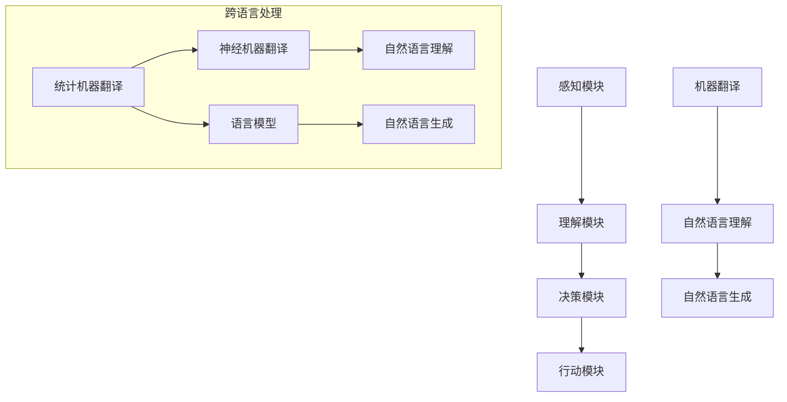

                 

# 跨语言AI Agent：突破语言障碍的智能助手

> 关键词：跨语言AI Agent，自然语言处理，机器翻译，智能助手，语言障碍

> 摘要：随着全球化进程的加速，跨语言交流的需求日益增长。本文深入探讨跨语言AI Agent这一前沿技术，解析其背后的原理、架构设计以及在实际应用中的实现细节，旨在为读者提供一个全面的技术指南，并展望跨语言AI Agent的未来发展趋势。

## 第1章：引言

在全球化背景下，跨语言交流成为人们日常生活和工作中不可或缺的一部分。然而，语言障碍始终是影响有效沟通的一大难题。传统的方法，如翻译服务、语言学习工具等，虽然在一定程度上缓解了这一问题，但仍然存在诸多局限。随着人工智能技术的飞速发展，特别是自然语言处理（NLP）和机器翻译技术的进步，跨语言AI Agent应运而生，成为解决语言障碍的有力工具。

### 1.1 书籍背景

本书旨在深入探讨跨语言AI Agent的各个方面，从理论基础到实际应用，为读者提供一个全面的技术指南。本书的核心目标是帮助读者理解跨语言AI Agent的工作原理、系统架构以及如何在实际项目中实现。

### 1.2 语言障碍问题

语言障碍不仅是文化差异的体现，更是国际交流中的障碍。无论是在商务谈判、学术交流还是日常沟通中，语言障碍都可能导致误解、效率低下，甚至关系破裂。以下是语言障碍的一些主要问题：

- **沟通障碍**：不同语言之间的词汇、语法和表达方式的差异，使得跨语言沟通变得复杂。
- **文化差异**：不同语言背后蕴含的文化差异，可能导致沟通中的误解和冲突。
- **翻译准确性**：人工翻译的准确性和效率无法满足大规模、实时的跨语言沟通需求。

### 1.3 AI Agent与跨语言处理

AI Agent是指能够模拟人类智能，执行特定任务的智能实体。在跨语言处理领域，AI Agent可以通过机器翻译、自然语言理解等多种技术，实现不同语言之间的无缝沟通。以下是AI Agent在跨语言处理中的应用：

- **机器翻译**：通过机器翻译技术，AI Agent可以将一种语言的内容自动翻译成另一种语言。
- **自然语言理解**：AI Agent可以通过自然语言理解技术，理解用户的语言意图，提供个性化的服务。
- **语音识别与合成**：通过语音识别与合成技术，AI Agent可以实现语音交互，为用户提供更加自然的交流体验。

## 第2章：背景介绍

### 2.1 语言障碍的现状

语言障碍在全球范围内普遍存在，影响着人们的日常生活和国际交流。以下是一些关于语言障碍的现状：

- **全球语言多样性**：全球有超过7000种语言，但只有少数几种语言（如英语、汉语、西班牙语等）在全球范围内得到广泛使用。
- **翻译需求**：随着全球化进程的加速，对翻译服务的需求不断增加。然而，人工翻译的效率和质量仍然有限。
- **语言学习**：学习外语对于许多人来说是提高国际交流能力的必要手段，但语言学习过程漫长且复杂。

### 2.2 AI Agent在跨语言沟通中的应用

AI Agent在跨语言沟通中的应用日益广泛，其优势在于能够实时、准确地处理跨语言交流。以下是一些AI Agent在跨语言沟通中的应用场景：

- **在线翻译工具**：如Google翻译、DeepL等，用户可以通过这些工具实现不同语言之间的实时翻译。
- **智能客服系统**：企业可以使用AI Agent作为智能客服，为用户提供跨语言服务。
- **国际会议同传**：AI Agent可以在国际会议上实时翻译多语种演讲，提高会议的效率。

### 2.3 跨语言AI Agent的概念与意义

跨语言AI Agent是一种能够跨越语言障碍，实现跨语言沟通的智能实体。其核心目标是消除语言障碍，促进全球范围内的信息交流。以下是跨语言AI Agent的意义：

- **提高沟通效率**：通过AI Agent，用户可以轻松实现跨语言沟通，提高工作效率。
- **促进文化交流**：跨语言AI Agent可以帮助人们更好地理解不同语言和文化，促进文化交流。
- **技术发展**：跨语言AI Agent的发展将推动自然语言处理、机器翻译等技术的进步。

## 第3章：核心概念与联系

### 3.1 AI Agent的定义与工作原理

AI Agent是指能够模拟人类智能，执行特定任务的智能实体。其工作原理通常包括以下几个步骤：

1. **感知**：AI Agent通过传感器收集外部信息，如文本、语音、图像等。
2. **理解**：AI Agent使用自然语言处理技术理解感知到的信息，提取关键信息。
3. **决策**：AI Agent根据理解和分析的结果，做出相应的决策。
4. **行动**：AI Agent执行决策，完成相应的任务。

### 3.2 跨语言处理的定义与技术

跨语言处理是指在不同语言之间进行信息转换和处理的技术。其主要包括以下几种技术：

1. **机器翻译**：将一种语言的内容自动翻译成另一种语言。
2. **自然语言理解**：理解用户的语言意图，提取关键信息。
3. **自然语言生成**：将机器理解的信息转化为自然语言表达。
4. **语言模型**：用于预测和生成自然语言文本。

### 3.3 AI Agent与跨语言处理的联系

AI Agent和跨语言处理是紧密相关的。跨语言处理是AI Agent实现跨语言沟通的基础。具体来说，AI Agent可以通过以下方式利用跨语言处理技术：

1. **机器翻译**：AI Agent可以使用机器翻译技术，实现不同语言之间的文本转换。
2. **自然语言理解**：AI Agent可以使用自然语言理解技术，理解用户的语言意图。
3. **自然语言生成**：AI Agent可以使用自然语言生成技术，为用户提供个性化的服务。

## 第4章：技术原理讲解

### 4.1 AI Agent的工作原理

AI Agent的工作原理可以分为以下几个部分：

1. **感知模块**：通过传感器（如麦克风、摄像头等）收集外部信息。
2. **理解模块**：使用自然语言处理技术，对感知到的信息进行分析和理解。
3. **决策模块**：根据理解和分析的结果，做出相应的决策。
4. **行动模块**：执行决策，完成相应的任务。

### 4.2 跨语言处理的算法和技术

跨语言处理的算法和技术主要包括以下几种：

1. **统计机器翻译**：基于统计学习的方法，通过分析大量双语语料库，实现语言的自动翻译。
2. **神经机器翻译**：基于深度学习的方法，通过神经网络模型实现语言的自动翻译。
3. **语言模型**：用于预测和生成自然语言文本，是自然语言处理的基础。
4. **自然语言理解**：包括词性标注、句法分析、语义分析等，用于理解用户的语言意图。

### 4.3 Mermaid流程图展示

以下是AI Agent和跨语言处理的Mermaid流程图：

## 第5章：系统分析与架构设计方案

### 5.1 系统功能设计

跨语言AI Agent系统的主要功能包括：

1. **机器翻译**：将用户输入的文本自动翻译成目标语言。
2. **自然语言理解**：理解用户的语言意图，提供个性化的服务。
3. **自然语言生成**：根据用户的意图，生成自然语言响应。
4. **语音识别与合成**：实现语音输入和语音输出的交互。

### 5.2 系统架构设计

跨语言AI Agent系统的架构设计可以分为以下几个部分：

1. **感知层**：包括麦克风、摄像头等传感器，用于收集用户输入。
2. **理解层**：包括自然语言处理模块，用于理解用户的语言意图。
3. **决策层**：包括机器翻译模块、自然语言生成模块等，用于生成响应。
4. **行动层**：包括语音合成模块，用于输出语音响应。

### 5.3 系统接口设计

跨语言AI Agent系统的接口设计包括：

1. **内部接口**：系统内部各模块之间的接口，如感知层和

