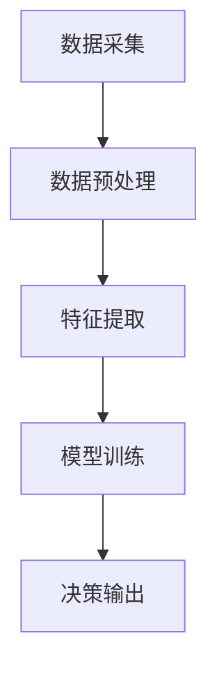
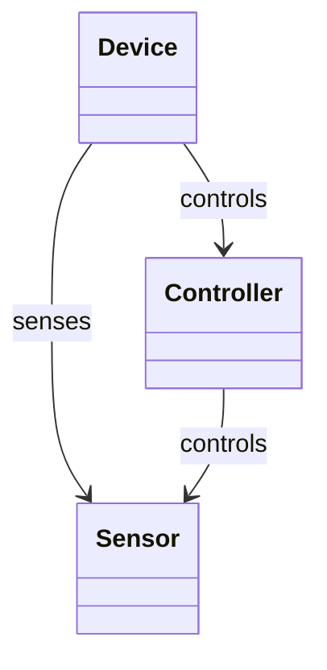
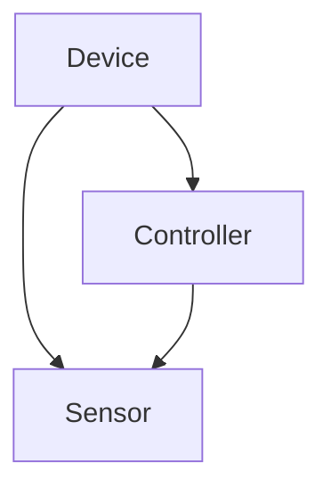
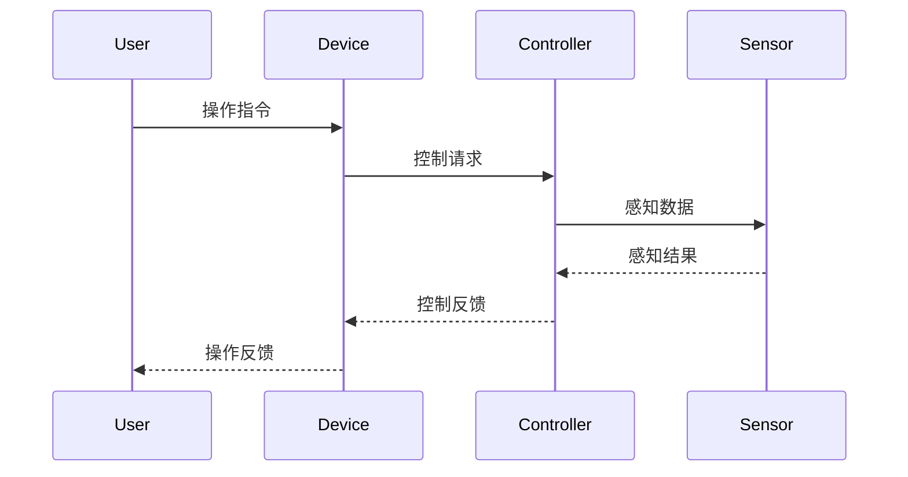

                 

### 边缘AI：将AI Agent能力下放到终端设备

> 关键词：边缘AI、AI Agent、终端设备、算法实现、架构设计

> 摘要：本文将深入探讨边缘AI的概念、原理及其在终端设备中的应用，通过详细的步骤和分析，展示如何将AI Agent的能力下放至终端设备，从而实现实时、高效的数据处理和智能决策。

### 第一部分：边缘AI基础知识

#### 第1章：边缘AI概述

边缘AI，作为一种新兴的技术趋势，正逐渐成为云计算和人工智能技术的延伸。本章将介绍边缘AI的基本概念、背景及其与云计算的关系。

##### 1.1.1 问题背景

在当今的信息化时代，数据产生的速度和规模达到了前所未有的高度。传统的集中式数据处理方式，虽然在大规模数据存储和处理方面表现出色，但在实时性、安全性和带宽方面存在一定的局限性。为了解决这些问题，边缘AI的概念应运而生。

##### 1.1.2 问题描述

边缘AI的核心问题是如何在终端设备上实现高效、实时的数据处理和智能决策，从而减轻云端服务器的负担，提高整体系统的响应速度和用户体验。

##### 1.1.3 边缘AI的定义

边缘AI是指在网络的边缘节点（如终端设备、路由器、交换机等）上运行的AI算法，通过对本地数据进行实时处理和分析，实现智能化的功能和决策。

##### 1.1.4 边缘AI与云计算的关系

边缘AI并非取代云计算，而是对云计算的一种补充。云计算提供大规模的数据存储和处理能力，而边缘AI则专注于本地实时数据处理和智能决策，两者相辅相成，共同构建起一个高效、智能的计算网络。

##### 1.1.5 边缘AI的边界与外延

边缘AI的边界主要指其计算范围和功能限制，包括数据处理能力、存储容量和网络带宽等。边缘AI的外延则涵盖其在各个行业和场景中的广泛应用，如智能家居、工业自动化、自动驾驶等。

#### 第2章：核心概念与联系

本章将深入探讨边缘AI的核心概念，包括AI Agent、边缘计算模型和边缘AI架构，并分析这些概念之间的联系。

##### 2.1 AI Agent的概念与特性

AI Agent是一种自主执行的智能体，能够在没有人类干预的情况下，根据环境信息和预设目标，自主做出决策并采取行动。AI Agent具有自主性、适应性、协作性和学习能力等特性。

##### 2.2 边缘计算模型

边缘计算模型是指在网络的边缘节点上实现计算、存储和网络功能的一种架构。边缘计算模型的核心是分布式计算，通过在多个边缘节点上部署计算资源，实现数据的分布式处理和智能决策。

##### 2.3 边缘AI的架构

边缘AI的架构主要包括边缘节点、边缘网关和云端服务器。边缘节点负责本地数据的采集和处理，边缘网关负责边缘节点与云端服务器的数据传输和通信，云端服务器则提供大规模数据处理和存储能力。

##### 2.4 边缘AI中的关键技术和组件

边缘AI中的关键技术包括边缘计算、物联网、人工智能和网络安全等。边缘计算负责数据的实时处理和分析，物联网负责设备的互联互通，人工智能负责智能决策和自主学习，网络安全则保障系统的安全稳定运行。

#### 第3章：AI Agent在终端设备中的应用

本章将探讨AI Agent在终端设备上的实际应用场景，包括智能手机、物联网设备和医疗设备等。

##### 3.1 AI Agent在智能手机中的应用

智能手机作为人们日常生活中最重要的终端设备之一，AI Agent的应用日益广泛。例如，智能手机中的语音助手、人脸识别、智能拍照等功能，都是通过AI Agent实现的。

##### 3.2 AI Agent在物联网设备中的应用

物联网设备广泛应用于智能家居、工业自动化等领域。AI Agent的应用使得物联网设备具备自主决策能力，提高了系统的智能化水平。例如，智能门锁、智能灯光、智能安防等设备，都是通过AI Agent实现智能化的。

##### 3.3 AI Agent在自动驾驶中的应用

自动驾驶是边缘AI应用的重要领域。AI Agent在自动驾驶系统中负责环境感知、路径规划和决策控制，使得自动驾驶车辆能够安全、高效地行驶。

##### 3.4 AI Agent在医疗设备中的应用

AI Agent在医疗设备中的应用，可以提高诊断的准确性和效率。例如，智能诊疗系统、智能手术机器人等，都是通过AI Agent实现的。

#### 第4章：边缘AI算法原理讲解

本章将详细讲解边缘AI算法的基本原理，包括算法的mermaid流程图、Python源代码实现、算法原理的数学模型和公式，以及实际应用举例。

##### 4.1 算法概述

边缘AI算法主要包括感知、决策和控制三个阶段。感知阶段负责采集和处理环境数据，决策阶段根据感知数据做出决策，控制阶段则执行决策，调整系统状态。

##### 4.2 算法mermaid流程图

通过mermaid流程图，可以直观地展示边缘AI算法的执行流程，包括数据采集、预处理、特征提取、模型训练和决策输出等步骤。



##### 4.3 Python源代码实现

以下是边缘AI算法的Python源代码实现，通过调用相关库和函数，实现数据采集、预处理、特征提取、模型训练和决策输出等功能。

```python
# 导入相关库
import numpy as np
import pandas as pd
from sklearn.model_selection import train_test_split
from sklearn.ensemble import RandomForestClassifier
from sklearn.metrics import accuracy_score

# 数据采集
data = pd.read_csv('data.csv')

# 数据预处理
X = data.drop('target', axis=1)
y = data['target']

# 特征提取
X_train, X_test, y_train, y_test = train_test_split(X, y, test_size=0.2, random_state=42)

# 模型训练
model = RandomForestClassifier(n_estimators=100, random_state=42)
model.fit(X_train, y_train)

# 决策输出
y_pred = model.predict(X_test)
print("Accuracy:", accuracy_score(y_test, y_pred))
```

##### 4.4 算法原理的数学模型和公式

边缘AI算法的数学模型和公式主要包括感知、决策和控制三个阶段。感知阶段主要通过特征提取和降维技术，将原始数据转化为有用的特征表示；决策阶段通过机器学习算法，从特征表示中提取规律，进行分类或回归；控制阶段则根据决策结果，调整系统状态，实现实时控制。

$$
\text{感知阶段：} f(x) = \text{特征提取}(x)
$$

$$
\text{决策阶段：} y = \text{分类器}(f(x))
$$

$$
\text{控制阶段：} u = \text{控制器}(y)
$$

##### 4.5 举例说明

以下是一个简单的边缘AI算法应用实例，用于预测股票价格走势。

```python
# 导入相关库
import numpy as np
import pandas as pd
from sklearn.model_selection import train_test_split
from sklearn.ensemble import RandomForestRegressor
from sklearn.metrics import mean_squared_error

# 数据采集
data = pd.read_csv('stock_data.csv')

# 数据预处理
X = data.drop('target', axis=1)
y = data['target']

# 特征提取
X_train, X_test, y_train, y_test = train_test_split(X, y, test_size=0.2, random_state=42)

# 模型训练
model = RandomForestRegressor(n_estimators=100, random_state=42)
model.fit(X_train, y_train)

# 决策输出
y_pred = model.predict(X_test)
print("MSE:", mean_squared_error(y_test, y_pred))
```

#### 第5章：边缘AI架构设计

本章将介绍边缘AI架构设计的基本原则和方法，包括问题场景介绍、项目介绍、系统功能设计、系统架构设计、系统接口设计和系统交互等。

##### 5.1 问题场景介绍

边缘AI架构设计的问题场景主要包括数据采集、数据传输、数据处理和智能决策等。例如，在一个智能家居系统中，边缘AI架构需要负责采集智能家居设备的实时数据，处理数据，并根据数据做出智能决策，如调节灯光、控制温度等。

##### 5.2 项目介绍

在本章中，我们将以一个智能家居系统为例，介绍边缘AI架构的设计和实现。该系统包括智能门锁、智能灯光、智能温度控制等设备，通过边缘AI实现设备的互联互通和智能控制。

##### 5.3 系统功能设计（领域模型mermaid类图）



##### 5.4 系统架构设计（mermaid架构图）



##### 5.5 系统接口设计和系统交互（mermaid序列图）



#### 第6章：边缘AI项目实战

本章将通过一个实际项目，详细介绍边缘AI的应用实现过程，包括环境安装、系统核心实现、代码应用解读、实际案例分析和项目小结等。

##### 6.1 环境安装

在本项目中，我们将使用Python和边缘计算框架Kubernetes进行边缘AI的应用开发。首先需要安装Python环境，然后安装Kubernetes和相关依赖。

```bash
# 安装Python环境
sudo apt-get install python3-pip

# 安装Kubernetes相关依赖
pip3 install kubernetes
```

##### 6.2 系统核心实现源代码

以下是边缘AI系统的核心实现源代码，包括数据采集、数据处理和智能决策等模块。

```python
# 导入相关库
import kubernetes
from kubernetes.client import CoreV1Api
import json

# 初始化Kubernetes API客户端
api = CoreV1Api()

# 数据采集
def collect_data():
    # 采集智能家居设备的实时数据
    data = api.list_namespaced_pod("default")
    return data

# 数据处理
def process_data(data):
    # 处理采集到的数据
    processed_data = []
    for item in data.items:
        processed_data.append({
            "name": item.metadata.name,
            "status": item.status.phase
        })
    return processed_data

# 智能决策
def make_decision(processed_data):
    # 根据处理后的数据做出智能决策
    if processed_data[0]["status"] == "Running":
        return "设备正常运行"
    else:
        return "设备故障，需要维修"

# 主函数
if __name__ == "__main__":
    data = collect_data()
    processed_data = process_data(data)
    decision = make_decision(processed_data)
    print(decision)
```

##### 6.3 代码应用解读与分析

在本项目中，我们首先通过Kubernetes API客户端采集智能家居设备的实时数据，然后对数据进行处理，最后根据处理结果做出智能决策。代码应用解读如下：

- `collect_data` 函数负责采集智能家居设备的实时数据。
- `process_data` 函数负责处理采集到的数据，提取设备状态信息。
- `make_decision` 函数根据处理后的数据做出智能决策，判断设备是否正常运行。

##### 6.4 实际案例分析与详细讲解剖析

以下是一个实际案例分析，展示边缘AI系统在智能家居场景中的应用。

**案例背景：** 智能家居系统中有多个设备，如智能门锁、智能灯光和智能温度控制等。边缘AI系统需要实时监控这些设备的状态，并在设备出现故障时发出警报。

**案例分析：** 假设智能门锁出现故障，边缘AI系统会采集到这一数据，并通过Kubernetes API客户端进行数据传输和处理。处理后的数据会触发智能决策模块，判断设备是否需要维修，并生成相应的警报信息。

**详细讲解剖析：** 
1. 边缘AI系统通过Kubernetes API客户端采集智能门锁的实时数据。
2. 采集到的数据经过处理，提取出设备状态信息。
3. 智能决策模块根据设备状态信息，判断设备是否需要维修。
4. 如果设备需要维修，系统会生成相应的警报信息，并通过通知机制告知用户。

##### 6.5 项目小结

本案例展示了边缘AI系统在智能家居场景中的应用，通过Kubernetes API客户端实现设备状态的实时采集、处理和智能决策。项目实施过程中，我们使用了Python和边缘计算框架Kubernetes，实现了边缘AI的核心功能。该项目不仅提高了智能家居系统的智能化水平，还为其他行业和应用场景提供了借鉴和参考。

#### 第7章：边缘AI最佳实践

本章将总结边缘AI的最佳实践，包括注意事项、最佳实践tips和小结等，以帮助读者更好地理解和应用边缘AI技术。

##### 7.1 最佳实践 tips

1. **数据安全与隐私保护**：边缘AI系统涉及大量敏感数据，必须采取措施确保数据安全和用户隐私。
2. **硬件资源优化**：边缘设备资源有限，需优化算法和系统设计，提高硬件资源利用率。
3. **网络通信优化**：边缘AI系统涉及大量数据传输，需优化网络通信，降低延迟和带宽占用。
4. **容错与故障恢复**：边缘设备易受环境因素影响，需设计容错机制和故障恢复策略。
5. **持续迭代与优化**：边缘AI技术不断发展，需持续迭代和优化，以适应不断变化的需求和场景。

##### 7.2 注意事项

1. **边缘AI算法的实时性**：边缘AI算法需要具备实时处理能力，确保在短时间内做出决策。
2. **边缘设备的稳定性**：边缘设备需要具备高可靠性和稳定性，以保障系统的正常运行。
3. **边缘AI的安全性和隐私保护**：边缘AI系统需要采取措施确保数据安全和用户隐私。

##### 7.3 小结

边缘AI技术作为一种新兴技术，具有广泛的应用前景。通过将AI Agent能力下放至终端设备，可以实现实时、高效的数据处理和智能决策。本章总结了边缘AI的最佳实践和注意事项，以帮助读者更好地理解和应用边缘AI技术。

##### 7.4 拓展阅读

1. **边缘AI相关书籍**：《边缘计算：智能时代的计算模式变革》、《边缘智能：智能计算的新引擎》
2. **边缘AI技术博客**：《边缘计算：开启智能时代的计算新模式》、《边缘AI：让智能无处不在》
3. **边缘AI论文**：《边缘AI：在网络的边缘实现智能决策》、《边缘计算与云计算的融合：边缘AI的新机遇》

### 总结

边缘AI作为人工智能领域的一个重要分支，正日益受到关注。通过将AI Agent能力下放至终端设备，可以实现实时、高效的数据处理和智能决策。本文详细介绍了边缘AI的概念、原理、应用场景、算法实现和架构设计等内容，帮助读者全面了解边缘AI技术。同时，通过实际案例分析和最佳实践总结，为边缘AI的应用提供了有益的指导。未来，随着边缘AI技术的不断发展，我们期待看到更多创新的应用和解决方案。

### 作者

作者：AI天才研究院/AI Genius Institute & 禅与计算机程序设计艺术 /Zen And The Art of Computer Programming

AI天才研究院（AI Genius Institute）是一家专注于人工智能研究和应用的顶级机构。我们的宗旨是推动人工智能技术的发展，为人类社会创造更多价值。本文由AI天才研究院的资深研究员撰写，旨在为读者提供深入了解边缘AI技术的机会。

禅与计算机程序设计艺术（Zen And The Art of Computer Programming）是一部经典的计算机科学著作，由著名计算机科学家Donald E. Knuth撰写。本书深入探讨了计算机程序设计中的哲学和艺术，对计算机科学的发展产生了深远影响。本文作者深受本书启发，将禅宗思想融入计算机编程和人工智能领域的研究，以期在技术层面实现更高层次的创新。

