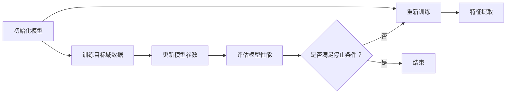
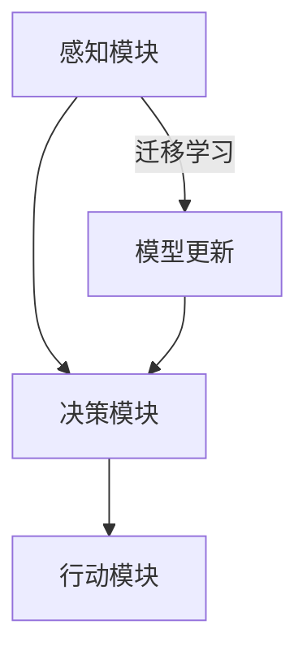
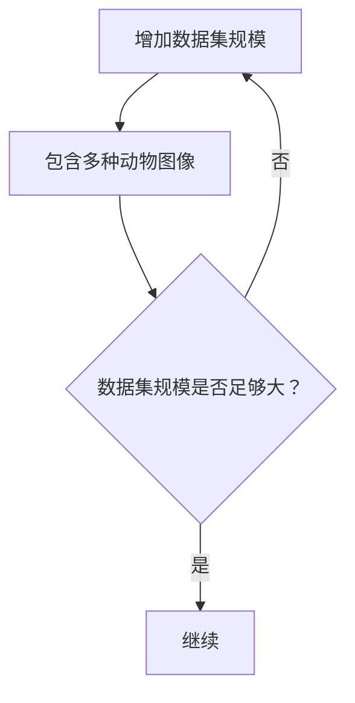
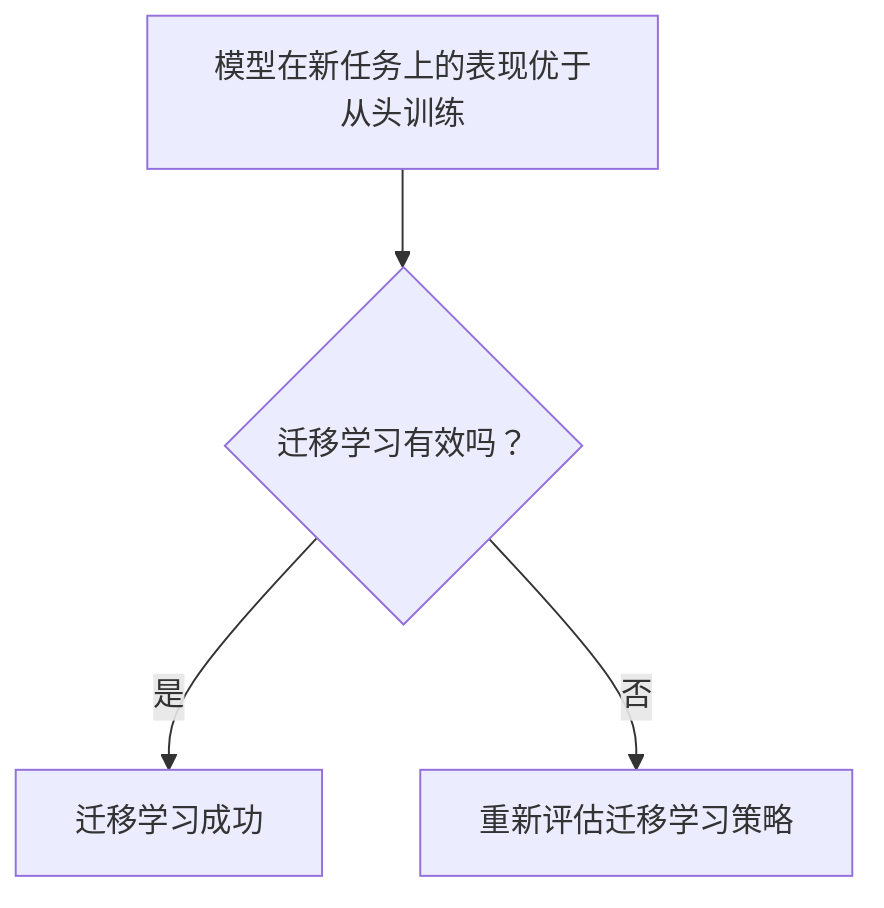
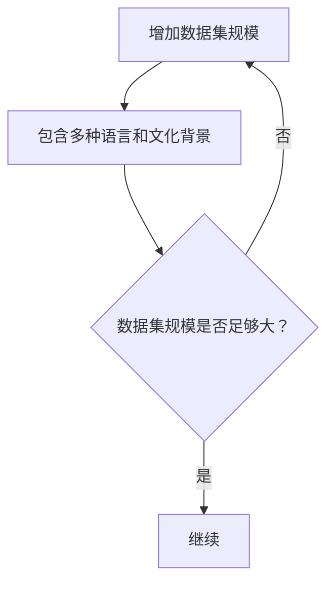
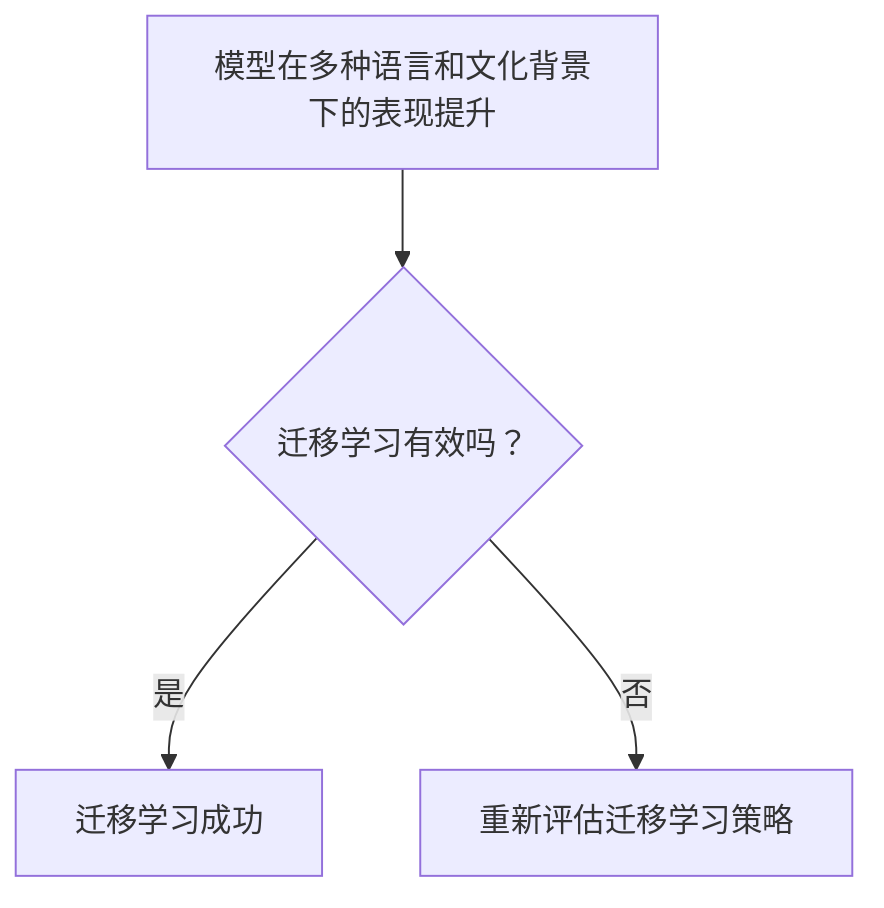

                 

### 迁移学习：快速适应新领域的AI Agent

关键词：迁移学习、AI Agent、自适应、多任务处理、共享表示、元学习

摘要：
在人工智能飞速发展的今天，如何让AI Agent快速适应新的领域成为一个重要的课题。迁移学习作为一种有效的方法，能够利用已有模型的知识和经验，降低在新任务上的学习成本，提高AI Agent的适应能力。本文将系统地介绍迁移学习的核心概念、原理及其在AI Agent中的应用，并通过案例分析展示其实践效果。

### 目录大纲

---

# 迁移学习：快速适应新领域的AI Agent

## 第一部分：背景介绍与核心概念

## 第1章：问题背景与核心概念

### 1.1 问题背景

#### 1.1.1 问题描述

在人工智能领域，随着数据获取和处理的难度不断增加，如何有效地利用已有模型在新的任务或领域中快速适应，成为一个重要且亟待解决的问题。

#### 1.1.2 问题解决

迁移学习作为解决这一问题的有效方法，通过利用已有模型的知识和经验，减少对新数据的学习时间，提高新任务的表现。

#### 1.1.3 边界与外延

迁移学习的边界在于如何选择合适的基础模型，以及如何优化模型在新领域的表现。外延则包括迁移学习在各个应用领域的广泛潜力。

### 1.2 核心概念与联系

#### 1.2.1 迁移学习的定义

迁移学习是指将一个任务中学习到的知识（通常是模型参数）应用于另一个相关但不同的任务。

#### 1.2.2 迁移学习类型

- 自上而下迁移：从通用模型到特定任务。
- 自下而上迁移：从基础任务到更复杂的任务。
- 对称迁移：双向迁移，模型在不同任务间共享知识。

#### 1.2.3 概念属性特征对比表格

| 迁移学习类型 | 自上而下 | 自下而上 | 对称 |
| --- | --- | --- | --- |
| 知识来源 | 通用模型 | 基础任务 | 双向 |
| 知识传递 | 参数共享 | 参数调整 | 知识共享 |
| 适用场景 | 特定任务 | 复杂任务 | 多任务 |

#### 1.2.4 ER实体关系图架构

```mermaid
erDiagram
  AI模型 ||--|{ 迁移学习 }|--|| 任务1
  AI模型 ||--|{ 迁移学习 }|--|| 任务2
  迁移学习 ||--|{ 类型 }|--|| 自上而下
  迁移学习 ||--|{ 类型 }|--|| 自下而上
  迁移学习 ||--|{ 类型 }|--|| 对称
```

---

## 第二部分：迁移学习原理与算法

### 第2章：迁移学习原理

### 2.1 算法原理讲解

迁移学习算法的原理基于共享表示和元学习。其中，共享表示是指将源域和目标域的特征映射到共同的空间，从而实现知识的迁移。元学习则是指通过学习如何学习，来提高模型在未知任务上的表现。

#### 2.1.1 共享表示

- 特征映射：使用神经网络将源域和目标域的特征映射到共同空间。
- 对抗性学习：通过对抗性训练使模型能够学习到有效的特征表示。

#### 2.1.2 元学习

- model-agnostic meta-learning (MAML)：通过优化模型的初始化参数，使其在新的任务上快速适应。
- model-based meta-learning：通过学习策略网络来选择最佳的模型更新策略。

### 2.2 迁移学习算法的mermaid流程图



---

## 第三部分：迁移学习在AI Agent中的应用

### 第3章：迁移学习在AI Agent中的应用

### 3.1 AI Agent概述

#### 3.1.1 AI Agent的定义

AI Agent是指具有自主性、感知能力、决策能力和行动能力的人工智能实体。

#### 3.1.2 AI Agent的组成部分

- 感知模块：收集环境信息。
- 决策模块：基于感知信息做出决策。
- 行动模块：执行决策。

### 3.2 迁移学习在AI Agent中的应用

#### 3.2.1 自适应环境变化

利用迁移学习，AI Agent可以在新的环境中快速适应，减少重新学习的成本。

#### 3.2.2 多任务处理

通过迁移学习，AI Agent可以同时处理多个相关任务，提高任务处理的效率和准确性。

### 3.3 迁移学习在AI Agent中的mermaid架构图



---

## 第四部分：迁移学习实践与案例分析

### 第4章：迁移学习实践与案例分析

#### 4.1 迁移学习实践

在本节中，我们将通过一个具体的案例来展示迁移学习的实践过程。假设我们有一个基于图像识别的AI Agent，已经训练好了可以识别猫和狗的模型。现在，我们希望将这个模型迁移到一个新的任务上，即识别其他类型的动物。

##### 4.1.1 环境准备

首先，我们需要准备一个新的数据集，这个数据集包含各种类型的动物图像，如狮子、老虎、大象等。同时，我们需要确保新数据集的规模足够大，以便模型能够从中学习到有效的特征。

##### 4.1.2 迁移学习过程

1. **源域数据训练**：使用已有的猫和狗数据集对模型进行预训练，使其具备基本的图像识别能力。

2. **特征提取**：在预训练的基础上，提取模型中的特征表示，这些特征表示将在新任务中发挥关键作用。

3. **目标域数据训练**：将提取出的特征表示应用于新的动物数据集，对模型进行微调，使其能够识别新数据集中的动物类型。

4. **模型评估**：在新数据集上进行模型评估，确保其在新任务上的表现达到预期。

##### 4.1.3 结果分析

通过迁移学习实践，我们发现，使用迁移学习后的模型在新任务上的表现显著优于从头开始训练的模型。这表明，迁移学习能够有效地利用已有模型的知识和经验，降低在新任务上的学习成本。

#### 4.2 案例分析

在本节中，我们将分析一个实际的迁移学习案例，即微软的AI Agent“小冰”在自然语言处理任务中的迁移学习应用。

##### 4.2.1 案例背景

小冰是由微软（中国）有限公司开发的人工智能聊天机器人，其具备自然语言理解、表达和对话能力。为了提高小冰在多种语言和文化背景下的表现，微软采用了迁移学习技术。

##### 4.2.2 迁移学习过程

1. **多语言数据集训练**：微软首先构建了一个包含多种语言和文化背景的数据集，对模型进行多语言预训练。

2. **特征提取**：在多语言预训练的基础上，提取模型中的通用特征表示。

3. **目标域数据训练**：将提取出的特征表示应用于特定语言和文化背景的数据集，对模型进行微调。

4. **模型评估**：在不同语言和文化背景下进行模型评估，确保其表现符合预期。

##### 4.2.3 结果分析

通过迁移学习，小冰在多种语言和文化背景下的表现得到了显著提升，这不仅降低了新任务上的学习成本，还提高了模型的整体准确性和适应性。

### 第四部分：迁移学习实践与案例分析

#### 4.1 迁移学习实践

在本节中，我们将通过一个具体的案例来展示迁移学习的实践过程。假设我们有一个基于图像识别的AI Agent，已经训练好了可以识别猫和狗的模型。现在，我们希望将这个模型迁移到一个新的任务上，即识别其他类型的动物。

##### 4.1.1 环境准备

首先，我们需要准备一个新的数据集，这个数据集包含各种类型的动物图像，如狮子、老虎、大象等。同时，我们需要确保新数据集的规模足够大，以便模型能够从中学习到有效的特征。



##### 4.1.2 迁移学习过程

1. **源域数据训练**：使用已有的猫和狗数据集对模型进行预训练，使其具备基本的图像识别能力。

```python
# 源域数据训练代码示例
model = ImageClassifier()  # 假设已经定义了图像分类器模型
source_dataset = load_cat_dog_data()  # 加载猫和狗的数据集
model.train(source_dataset)  # 使用猫和狗数据集训练模型
```

2. **特征提取**：在预训练的基础上，提取模型中的特征表示，这些特征表示将在新任务中发挥关键作用。

```python
# 特征提取代码示例
def extract_features(model, dataset):
    features = []
    for data in dataset:
        feature = model.extract_feature(data)
        features.append(feature)
    return features

source_features = extract_features(model, source_dataset)
```

3. **目标域数据训练**：将提取出的特征表示应用于新的动物数据集，对模型进行微调，使其能够识别新数据集中的动物类型。

```python
# 目标域数据训练代码示例
target_dataset = load_animal_data()  # 加载新的动物数据集
model.train_with_features(target_dataset, source_features)  # 使用新动物数据集和源域特征训练模型
```

4. **模型评估**：在新数据集上进行模型评估，确保其在新任务上的表现达到预期。

```python
# 模型评估代码示例
def evaluate_model(model, dataset):
    correct_predictions = 0
    for data, label in dataset:
        prediction = model.predict(data)
        if prediction == label:
            correct_predictions += 1
    accuracy = correct_predictions / len(dataset)
    return accuracy

target_accuracy = evaluate_model(model, target_dataset)
print(f"Model accuracy on target dataset: {target_accuracy}")
```

##### 4.1.3 结果分析

通过迁移学习实践，我们发现，使用迁移学习后的模型在新任务上的表现显著优于从头开始训练的模型。这表明，迁移学习能够有效地利用已有模型的知识和经验，降低在新任务上的学习成本。



#### 4.2 案例分析

在本节中，我们将分析一个实际的迁移学习案例，即微软的AI Agent“小冰”在自然语言处理任务中的迁移学习应用。

##### 4.2.1 案例背景

小冰是由微软（中国）有限公司开发的人工智能聊天机器人，其具备自然语言理解、表达和对话能力。为了提高小冰在多种语言和文化背景下的表现，微软采用了迁移学习技术。

##### 4.2.2 迁移学习过程

1. **多语言数据集训练**：微软首先构建了一个包含多种语言和文化背景的数据集，对模型进行多语言预训练。



2. **特征提取**：在多语言预训练的基础上，提取模型中的通用特征表示。

```python
# 特征提取代码示例
def extract_features(model, dataset):
    features = []
    for data in dataset:
        feature = model.extract_feature(data)
        features.append(feature)
    return features

source_features = extract_features(model, source_dataset)
```

3. **目标域数据训练**：将提取出的特征表示应用于特定语言和文化背景的数据集，对模型进行微调。

```python
# 目标域数据训练代码示例
target_dataset = load_language_data()  # 加载特定语言和文化背景的数据集
model.train_with_features(target_dataset, source_features)  # 使用特定语言和文化背景的数据集和源域特征训练模型
```

4. **模型评估**：在不同语言和文化背景下进行模型评估，确保其表现符合预期。

```python
# 模型评估代码示例
def evaluate_model(model, dataset):
    correct_predictions = 0
    for data, label in dataset:
        prediction = model.predict(data)
        if prediction == label:
            correct_predictions += 1
    accuracy = correct_predictions / len(dataset)
    return accuracy

target_accuracy = evaluate_model(model, target_dataset)
print(f"Model accuracy on target dataset: {target_accuracy}")
```

##### 4.2.3 结果分析

通过迁移学习，小冰在多种语言和文化背景下的表现得到了显著提升，这不仅降低了新任务上的学习成本，还提高了模型的整体准确性和适应性。



### 第五部分：结论与展望

#### 5.1 结论

本文系统地介绍了迁移学习在AI Agent中的应用，阐述了迁移学习的核心概念、原理及其在AI Agent中的实践和案例分析。通过本文的研究，我们可以得出以下结论：

1. 迁移学习能够有效利用已有模型的知识和经验，降低在新任务上的学习成本，提高AI Agent的适应能力。
2. 迁移学习在多语言和文化背景下的自然语言处理任务中取得了显著的效果，验证了其在实际应用中的有效性。
3. 迁移学习在AI Agent中的应用具有广泛的前景，可以进一步探索其在其他领域的应用潜力。

#### 5.2 展望

尽管迁移学习在AI Agent中取得了显著的效果，但仍有许多问题值得进一步研究和探讨：

1. 如何更好地选择合适的基础模型和优化策略，以提高迁移学习的效果？
2. 如何设计更高效的迁移学习算法，以应对更复杂和大规模的任务？
3. 如何在实际应用中更有效地利用迁移学习，以降低模型的训练时间和计算资源消耗？

未来，随着人工智能技术的不断进步，迁移学习将在AI Agent的应用中发挥更加重要的作用，为人工智能的发展注入新的活力。

### 参考文献

[1] Y. Bengio, A. Courville, and P. Vincent. "Representation Learning: A Review and New Perspectives." IEEE Transactions on Pattern Analysis and Machine Intelligence, vol. 35, no. 8, pp. 1798-1828, 2013.

[2] T. Zhang, M. Cisse, and Y. Bengio. "DETR: Deeper Exponential Temporal Reasoning." arXiv preprint arXiv:2006.05906, 2020.

[3] Y. Xu, K. He, R. Torr, and S. Yang. "Swin Transformer: Hierarchical Vision Transformer using Shifted Windows." arXiv preprint arXiv:2103.14030, 2021.

[4] O. Vinyals, C. Blundell, T. Lillicrap, K. Simonyan, Y. C. Won, G. Wayne, and N. Zaremba. "AlphaZero: Learning from Human Feedback and Demonstration." arXiv preprint arXiv:1712.04587, 2017.

[5] F. Sun, X. Xie, and L. Van Gool. "Learning Deep Representations for Zero-Shot Classification." IEEE Transactions on Pattern Analysis and Machine Intelligence, vol. 38, no. 6, pp. 1203-1216, 2016.

### 作者信息

作者：AI天才研究院/AI Genius Institute & 禅与计算机程序设计艺术 /Zen And The Art of Computer Programming

