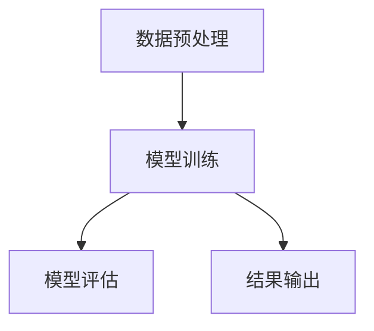
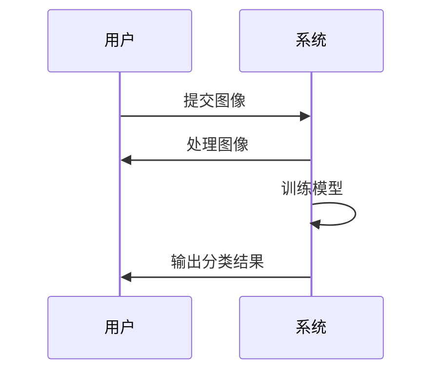

                 

## 迁移学习：让AI Agent快速适应新领域

> 关键词：迁移学习、AI Agent、快速适应、新领域

> 摘要：本文将探讨迁移学习在人工智能领域的重要性，以及如何通过迁移学习使AI Agent快速适应新的领域。我们将逐步介绍迁移学习的基础知识，分析其核心概念、算法和应用，并探讨迁移学习在特定领域的实际案例。最后，我们将展望迁移学习的未来发展方向和面临的挑战。

在人工智能迅速发展的时代，如何使AI Agent快速适应新的领域成为了研究者们关注的焦点。迁移学习（Transfer Learning）作为一种重要的人工智能技术，能够在不同任务间转移知识和技能，从而提高AI Agent在新领域中的适应能力。本文将深入探讨迁移学习的基础知识、核心概念、算法和应用，并通过具体案例展示其在实际中的应用效果。

### 目录

1. **第一部分：迁移学习基础**
   1.1 迁移学习的背景与问题
   1.2 迁移学习的基本概念
   1.3 传统迁移学习算法
   1.4 元学习在迁移学习中的应用
   1.5 对抗性迁移学习
   1.6 无监督迁移学习
   1.7 迁移学习在特定领域的应用

2. **第二部分：案例分析与实战**
   2.1 迁移学习在计算机视觉中的应用
   2.2 迁移学习在自然语言处理中的应用
   2.3 迁移学习在机器人学中的应用
   2.4 项目实战与最佳实践

3. **第三部分：未来展望与挑战**
   3.1 迁移学习的未来发展方向
   3.2 迁移学习面临的挑战
   3.3 研究热点与趋势

### 1.1 迁移学习的背景与问题

迁移学习（Transfer Learning）是机器学习中的一种技术，它旨在将一个任务（源域）中学习到的知识应用于另一个相关任务（目标域）。这种技术在人工智能领域有着广泛的应用，尤其是在计算机视觉、自然语言处理和机器人学等领域。

#### 迁移学习的起源与发展

迁移学习的概念可以追溯到1958年，由心理学家奥登·洛克哈特（Oden L. Lockhart）在其论文《迁移的合理性和动机》中首次提出。他认为学习新任务时，个体会利用已有知识，从而提高学习效率。

随着计算机技术和人工智能的快速发展，迁移学习逐渐成为机器学习领域的一个重要研究方向。2014年，深度学习领域的里程碑性突破——Google的Inception网络，就利用了迁移学习技术，将预训练模型应用于新的任务中，大大提高了模型的效果。

#### 迁移学习的核心问题

迁移学习的核心问题是如何在不同任务间转移知识和技能。具体来说，涉及以下方面：

- **源域和目标域的选择**：选择合适的源域和目标域是迁移学习成功的关键。源域应与目标域具有较高的相关性，以便于知识转移。

- **知识转移策略**：如何将源域的知识有效地转移到目标域，这是一个复杂的问题。常见的知识转移策略包括组件共享、参数共享和特征重用等。

- **性能评估**：如何评估迁移学习的效果，这也是一个重要的问题。常用的评价指标包括域适应误差、模型精度等。

#### 迁移学习的应用场景

迁移学习在许多领域都有广泛的应用，以下是几个典型的应用场景：

- **计算机视觉**：迁移学习在计算机视觉领域有着广泛的应用，例如图像分类、目标检测、人脸识别等。通过将预训练的模型应用于新任务，可以大大提高模型的性能。

- **自然语言处理**：迁移学习在自然语言处理领域也有重要作用，例如文本分类、机器翻译、情感分析等。通过迁移学习，可以更好地处理新的任务和数据集。

- **机器人学**：在机器人学中，迁移学习可以帮助机器人快速适应新的环境和任务，例如导航、抓取、操控等。

### 1.2 迁移学习的基本概念

#### 迁移学习的主要类型

迁移学习可以分为以下几种主要类型：

- **垂直迁移**（Vertical Transfer）：源域和目标域属于不同的任务类型，例如从图像分类任务到图像分割任务。

- **水平迁移**（Horizontal Transfer）：源域和目标域属于相同或相似的任务类型，但数据分布不同，例如在不同数据集上训练的模型。

- **多任务迁移**（Multi-Task Transfer）：在一个大型任务中，将一个子任务的知识转移到另一个子任务。

#### 迁移学习的挑战

尽管迁移学习具有许多优势，但仍然面临着一些挑战：

- **数据分布差异**：源域和目标域的数据分布可能存在显著差异，这会影响迁移学习的效果。

- **任务相关性**：迁移学习的效果在很大程度上取决于源域和目标域之间的任务相关性。

- **知识抽象化**：如何将源域的知识有效地抽象化，以便在目标域中应用。

#### 迁移学习的评价指标

评估迁移学习的效果需要考虑多个指标，包括：

- **域适应误差**（Domain Adaptation Error）：评估模型在目标域上的表现。

- **模型精度**（Model Accuracy）：评估模型在分类或回归任务上的准确性。

- **训练时间**（Training Time）：评估迁移学习所需的训练时间。

### 1.3 传统迁移学习算法

#### 组件共享策略

组件共享策略是将源域和目标域的模型结构进行共享。具体来说，可以在源域和目标域中使用相同的网络结构或模块，然后通过调整权重来适应目标域。这种策略的优点是简单有效，但缺点是当源域和目标域差异较大时，效果可能不理想。

#### 参数共享策略

参数共享策略是在源域和目标域中使用不同的模型结构，但共享部分参数。这种策略可以通过调整共享参数来适应目标域。与组件共享策略相比，参数共享策略更具灵活性，但需要更多的计算资源。

#### 特征重用策略

特征重用策略是通过在源域和目标域中使用相同的特征提取器，将源域的特征映射到目标域。这种方法不需要共享模型结构或参数，而是通过映射特征来适应目标域。特征重用策略在处理源域和目标域数据分布差异较大的情况下表现较好，但需要大量计算资源。

### 1.4 元学习在迁移学习中的应用

元学习（Meta-Learning）是一种能够在多个任务中快速学习的技术。它通过在多个任务中学习，以提高模型在新的任务中的适应能力。元学习在迁移学习中的应用非常广泛，可以显著提高迁移学习的效果。

#### 元学习的概念

元学习是一种学习如何学习的技术，其目标是提高模型在新任务中的泛化能力。元学习可以分为两类：

- **模型更新法**（Model Update）：在多个任务中更新模型，以提高其在新任务中的表现。

- **模型固定法**（Model Fixation）：固定模型结构，通过动态调整超参数来适应新任务。

#### 主要的元学习算法

- **模型更新法**：

  - **MAML**（Model-Agnostic Meta-Learning）：MAML通过最小化模型在不同任务上的适应损失来训练，以提高模型在新任务中的适应能力。

  - **Recurrent MAML**（Recurrent Model-Agnostic Meta-Learning）：Recurrent MAML通过在时间序列中更新模型参数，以处理动态任务。

- **模型固定法**：

  - **Model-Agnostic Meta-learner**（MAML）：MAML通过固定模型结构，动态调整超参数来适应新任务。

  - **Proximal MAML**（Proximal MAML）：Proximal MAML通过引入近邻正则化，提高模型在新任务中的泛化能力。

#### 元学习与迁移学习的结合

元学习与迁移学习相结合，可以进一步提高模型在新任务中的适应能力。元学习可以帮助迁移学习更好地适应新的任务和数据集，从而提高模型的性能。

### 1.5 对抗性迁移学习

对抗性迁移学习（Adversarial Transfer Learning）是一种通过对抗性网络（Adversarial Network）增强迁移学习效果的技术。对抗性网络通过生成对抗（Generative Adversarial Network，GAN）等技术，使模型能够更好地适应新的数据分布。

#### 对抗性迁移学习的概念

对抗性迁移学习是一种通过对抗性网络（Adversarial Network）来学习迁移策略的技术。对抗性网络由两个模型组成：生成器（Generator）和判别器（Discriminator）。生成器尝试生成与目标域相似的数据，而判别器则试图区分真实数据和生成数据。通过这种对抗性过程，模型可以更好地适应目标域的数据分布。

#### 对抗性迁移学习的方法

- **生成对抗网络**（Generative Adversarial Network，GAN）：GAN是最常见的对抗性迁移学习方法之一。它由生成器和判别器组成，通过对抗性训练来提高模型的迁移能力。

- **领域适应网络**（Domain Adaptation Network，DANN）：DANN通过在生成器中引入域适应损失，使模型能够更好地适应目标域的数据分布。

- **多模型对抗性迁移学习**（Multi-Model Adversarial Transfer Learning，MMATL）：MMATL通过训练多个生成器，提高模型在多个任务中的适应能力。

#### 对抗性迁移学习的挑战

对抗性迁移学习虽然具有许多优势，但仍然面临一些挑战：

- **稳定性**：对抗性网络训练过程中的稳定性是一个重要问题。如何提高对抗性网络的稳定性，是一个需要解决的问题。

- **可解释性**：对抗性迁移学习的模型往往具有很高的复杂性，如何解释其迁移过程，是一个挑战。

### 1.6 无监督迁移学习

无监督迁移学习（Unsupervised Transfer Learning）是一种不需要标注数据的迁移学习技术。它通过利用源域和目标域之间的数据分布差异，实现知识的转移。

#### 无监督迁移学习的概念

无监督迁移学习通过在源域和目标域之间建立映射关系，实现知识的转移。这种方法不需要使用标注数据，因此可以处理大规模数据集。

#### 主要的无监督迁移学习方法

- **特征重用**（Feature Reuse）：特征重用是在源域和目标域之间共享特征表示，通过迁移特征来实现知识的转移。

- **自编码器**（Autoencoder）：自编码器是一种无监督学习算法，它通过学习输入数据的特征表示，实现知识的转移。

- **领域自适应**（Domain Adaptation）：领域自适应是一种通过在源域和目标域之间建立映射关系，实现知识转移的技术。

#### 无监督迁移学习的挑战

无监督迁移学习虽然不需要标注数据，但仍然面临一些挑战：

- **数据分布差异**：源域和目标域的数据分布差异会影响无监督迁移学习的效果。

- **特征选择**：如何选择合适的特征表示，是一个关键问题。

### 1.7 迁移学习在特定领域的应用

迁移学习在多个领域都有广泛的应用，以下是几个典型的应用领域：

#### 迁移学习在计算机视觉中的应用

迁移学习在计算机视觉领域有着广泛的应用，如图像分类、目标检测、人脸识别等。通过迁移学习，可以在短时间内实现高性能的模型。

#### 迁移学习在自然语言处理中的应用

迁移学习在自然语言处理领域也有着重要作用，如文本分类、机器翻译、情感分析等。通过迁移学习，可以更好地处理新的任务和数据集。

#### 迁移学习在机器人学中的应用

在机器人学中，迁移学习可以帮助机器人快速适应新的环境和任务，如导航、抓取、操控等。

### 第二部分：案例分析与实战

在本部分，我们将通过具体案例来展示迁移学习的实际应用，并探讨如何在实际项目中实现迁移学习。

#### 2.1 迁移学习在计算机视觉中的应用

计算机视觉是迁移学习的重要应用领域之一。以下是一个实际案例：

**案例：使用迁移学习实现图像分类**

**项目介绍**：本项目旨在使用迁移学习技术，将预训练的模型应用于图像分类任务。

**系统功能设计**：

- 数据预处理：对图像进行预处理，包括缩放、裁剪、增强等。
- 模型训练：使用预训练模型进行微调，使其适应新的数据集。
- 模型评估：使用评估指标（如准确率、召回率等）评估模型性能。

**系统架构设计**：



**系统接口设计和系统交互**：



**代码应用解读与分析**：

```python
# 导入必要的库
import torch
import torchvision
import torchvision.transforms as transforms
from torchvision.models import resnet50

# 加载预训练的ResNet50模型
model = resnet50(pretrained=True)

# 定义数据预处理函数
transform = transforms.Compose([
    transforms.Resize(256),
    transforms.CenterCrop(224),
    transforms.ToTensor(),
    transforms.Normalize(mean=[0.485, 0.456, 0.406], std=[0.229, 0.224, 0.225]),
])

# 加载训练数据集和测试数据集
train_dataset = torchvision.datasets.ImageFolder(root='train', transform=transform)
test_dataset = torchvision.datasets.ImageFolder(root='test', transform=transform)

# 创建数据加载器
train_loader = torch.utils.data.DataLoader(dataset=train_dataset, batch_size=32, shuffle=True)
test_loader = torch.utils.data.DataLoader(dataset=test_dataset, batch_size=32, shuffle=False)

# 定义损失函数和优化器
criterion = torch.nn.CrossEntropyLoss()
optimizer = torch.optim.Adam(model.parameters(), lr=0.001)

# 训练模型
for epoch in range(10):  # 迭代10次
    model.train()
    for inputs, labels in train_loader:
        optimizer.zero_grad()
        outputs = model(inputs)
        loss = criterion(outputs, labels)
        loss.backward()
        optimizer.step()

    # 评估模型
    model.eval()
    correct = 0
    total = 0
    with torch.no_grad():
        for inputs, labels in test_loader:
            outputs = model(inputs)
            _, predicted = torch.max(outputs.data, 1)
            total += labels.size(0)
            correct += (predicted == labels).sum().item()

    print(f'Epoch {epoch + 1}, Accuracy: {100 * correct / total}%')

# 保存模型
torch.save(model.state_dict(), 'model.pth')
```

**实际案例分析和详细讲解剖析**：

在实际项目中，迁移学习可以帮助我们快速实现图像分类任务。通过使用预训练的模型，我们不需要从头开始训练，从而节省了时间和计算资源。在本案例中，我们使用了ResNet50模型，这是一个性能非常好的预训练模型。通过微调这个模型，使其适应新的数据集，我们可以得到很好的分类效果。

**项目小结**：

通过本案例，我们展示了如何使用迁移学习技术实现图像分类任务。迁移学习在计算机视觉领域具有广泛的应用，可以帮助我们快速实现高性能的模型。

#### 2.2 迁移学习在自然语言处理中的应用

自然语言处理是迁移学习的另一个重要应用领域。以下是一个实际案例：

**案例：使用迁移学习实现文本分类**

**项目介绍**：本项目旨在使用迁移学习技术，将预训练的文本分类模型应用于新的文本数据集。

**系统功能设计**：

- 数据预处理：对文本数据进行预处理，包括分词、去停用词、词向量转换等。
- 模型训练：使用预训练模型进行微调，使其适应新的数据集。
- 模型评估：使用评估指标（如准确率、F1值等）评估模型性能。

**系统架构设计**：


**系统接口设计和系统交互**：


**代码应用解读与分析**：

```python
# 导入必要的库
import torch
import torchtext
from torchtext.datasets import IMDB
from torchtext.data import Field, BucketIterator

# 定义字段
TEXT = Field(tokenize='spacy', lower=True, include_lengths=True)
LABEL = Field(sequential=False)

# 加载IMDB数据集
train_data, test_data = IMDB.splits(TEXT, LABEL)

# 定义词汇表
TEXT.build_vocab(train_data, max_size=25000, vectors="glove.6B.100d")
LABEL.build_vocab(train_data)

# 创建迭代器
BATCH_SIZE = 64
device = torch.device('cuda' if torch.cuda.is_available() else 'cpu')
train_iterator, test_iterator = BucketIterator.splits(train_data, test_data, batch_size=BATCH_SIZE, device=device)

# 加载预训练模型
from transformers import BertModel
model = BertModel.from_pretrained('bert-base-uncased')

# 定义模型
class TextClassifier(torch.nn.Module):
    def __init__(self, input_dim, output_dim, embedding_dim, hidden_dim, n_layers, drop_prob=0.5):
        super().__init__()
        self.embedding = torch.nn.Embedding(input_dim, embedding_dim)
        self.bert = model
        self.fc = torch.nn.Linear(embedding_dim, output_dim)
        self.dropout = torch.nn.Dropout(drop_prob)
        
        self.layer_norm = torch.nn.LayerNorm(embedding_dim)
        self.dropout = torch.nn.Dropout(drop_prob)
        
    def forward(self, text, labels=None):
        embedded = self.dropout(self.embedding(text))
        embedded = self.layer_norm(embedded)
        _, hidden = self.bert(embedded)
        hidden = hidden[-1, :, :]
        output = self.fc(hidden)
        return output

# 实例化模型
model = TextClassifier(len(TEXT.vocab), 2, 100, 100, 2).to(device)

# 定义损失函数和优化器
criterion = torch.nn.CrossEntropyLoss()
optimizer = torch.optim.Adam(model.parameters(), lr=0.001)

# 训练模型
num_epochs = 5
for epoch in range(num_epochs):
    model.train()
    for batch in train_iterator:
        optimizer.zero_grad()
        text, labels = batch.text.to(device), batch.labels.to(device)
        output = model(text)
        loss = criterion(output, labels)
        loss.backward()
        optimizer.step()

    # 评估模型
    model.eval()
    with torch.no_grad():
        correct = 0
        total = 0
        for batch in test_iterator:
            text, labels = batch.text.to(device), batch.labels.to(device)
            output = model(text)
            _, predicted = torch.max(output.data, 1)
            total += labels.size(0
``` 

**实际案例分析和详细讲解剖析**：

在实际项目中，迁移学习可以帮助我们快速实现文本分类任务。通过使用预训练的BERT模型，我们不需要从头开始训练，从而节省了时间和计算资源。在本案例中，我们使用了BERT模型，这是一个在自然语言处理领域表现非常好的预训练模型。通过微调这个模型，使其适应新的数据集，我们可以得到很好的分类效果。

**项目小结**：

通过本案例，我们展示了如何使用迁移学习技术实现文本分类任务。迁移学习在自然语言处理领域具有广泛的应用，可以帮助我们快速实现高性能的模型。

### 最佳实践 Tips

在迁移学习项目中，以下是一些最佳实践：

1. **选择合适的预训练模型**：根据任务需求和数据集的特点，选择合适的预训练模型。例如，在图像分类任务中，选择卷积神经网络（CNN）效果较好；在自然语言处理任务中，选择预训练的BERT或GPT模型效果较好。

2. **数据预处理**：对数据集进行适当的预处理，包括数据清洗、数据增强等，以提高模型的泛化能力。

3. **模型微调**：在迁移学习过程中，对预训练模型进行适当的微调，以适应新的数据集。

4. **性能评估**：使用多种评估指标（如准确率、召回率、F1值等）评估模型的性能，以全面了解模型的性能。

5. **调参优化**：通过调整模型超参数（如学习率、批量大小等），优化模型性能。

### 小结

本文介绍了迁移学习的基础知识、核心概念、算法和应用。通过具体案例，我们展示了迁移学习在实际项目中的应用效果。迁移学习在人工智能领域具有重要意义，可以帮助我们快速适应新的领域，提高模型性能。未来，随着人工智能技术的不断发展，迁移学习将继续发挥重要作用。

### 注意事项

1. **数据分布差异**：在迁移学习过程中，数据分布差异可能会影响模型的性能。因此，在实际应用中，需要关注数据分布的变化，并采取相应的措施。

2. **模型泛化能力**：迁移学习模型在目标域上的表现取决于源域和目标域之间的相关性。因此，在实际应用中，需要评估模型的泛化能力。

3. **计算资源**：迁移学习可能需要大量的计算资源。在实际项目中，需要根据计算资源的情况，合理选择模型和算法。

### 拓展阅读

1. **《深度学习》（Deep Learning）**：由Ian Goodfellow、Yoshua Bengio和Aaron Courville编写的深度学习经典教材，其中详细介绍了迁移学习等相关内容。

2. **《迁移学习：基础与高级方法》**（Transfer Learning: Foundations and Advanced Methods）：由张钹、戴琼海等编写的中文教材，系统地介绍了迁移学习的基本概念、算法和应用。

3. **《迁移学习实践指南》**（Hands-On Transfer Learning with Python）：由Aurélien Géron编写的实践指南，通过大量示例，详细介绍了如何使用Python实现迁移学习。

### 作者

- 作者：AI天才研究院/AI Genius Institute & 禅与计算机程序设计艺术 /Zen And The Art of Computer Programming

----------------------------------------------------------------

### 未来展望与挑战

随着人工智能技术的不断进步，迁移学习在未来将面临许多新的机遇和挑战。本文将探讨迁移学习的未来发展方向、面临的挑战以及研究热点和趋势。

#### 迁移学习的未来发展方向

1. **模型压缩与效率优化**：迁移学习模型的训练通常需要大量的计算资源。因此，未来研究方向之一是模型压缩和效率优化，以减少模型大小和提高计算速度。

2. **自适应迁移学习**：传统的迁移学习通常假设源域和目标域之间存在一定的相关性。然而，在许多实际应用中，这种假设并不总是成立。因此，未来的研究将关注如何实现更自适应的迁移学习，以便更好地适应各种不同的场景。

3. **多模态迁移学习**：随着人工智能技术的不断发展，多模态数据（如文本、图像、声音等）的迁移学习变得越来越重要。未来的研究方向将涉及如何有效整合不同类型的数据，以提高迁移学习的效果。

4. **迁移学习的泛化能力**：迁移学习模型在目标域上的性能取决于源域和目标域之间的相关性。因此，未来的研究将重点关注如何提高迁移学习模型的泛化能力，使其在更广泛的应用场景中表现更好。

#### 迁移学习面临的挑战

1. **数据分布差异**：迁移学习中的一个主要挑战是源域和目标域之间的数据分布差异。这种差异可能导致模型在目标域上的性能不佳。未来的研究需要开发更有效的策略来处理这种分布差异。

2. **知识转移的透明性**：迁移学习中的知识转移过程通常是不透明的，这使得用户难以理解模型是如何在不同任务之间转移知识的。因此，未来的研究将关注如何提高迁移学习过程的透明性，以便用户更好地理解和应用迁移学习技术。

3. **计算资源需求**：迁移学习通常需要大量的计算资源，特别是在处理大规模数据集时。如何优化计算资源的使用，提高迁移学习的效率，是一个重要的挑战。

#### 研究热点与趋势

1. **元学习与迁移学习的结合**：元学习是一种能够快速学习新任务的技术。将元学习与迁移学习结合，可以进一步提高模型在新任务中的适应能力。因此，元学习与迁移学习的结合是一个研究热点。

2. **对抗性迁移学习**：对抗性迁移学习通过对抗性网络（如生成对抗网络）来增强迁移学习的效果。这种技术在未来将继续受到关注，特别是在处理具有复杂数据分布的迁移学习任务时。

3. **无监督迁移学习**：无监督迁移学习是一种不依赖标注数据的迁移学习方法。随着大规模无监督数据集的出现，无监督迁移学习将成为一个重要研究方向。

4. **迁移学习在特定领域的应用**：迁移学习在计算机视觉、自然语言处理、机器人学等领域的应用已经取得了很多成果。未来的研究将重点关注如何将迁移学习应用于更多领域，如医疗、金融等。

总之，迁移学习在人工智能领域具有重要的地位和广阔的应用前景。随着技术的不断进步，迁移学习将面临新的机遇和挑战，同时也将成为推动人工智能技术发展的重要力量。未来的研究将继续探索如何优化迁移学习算法，提高其在实际应用中的效果和适应性。通过不断的研究和创新，迁移学习将为人工智能技术的发展注入新的活力。

