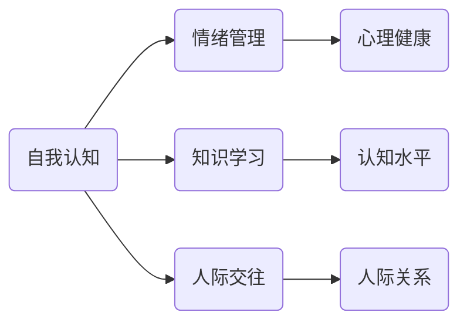
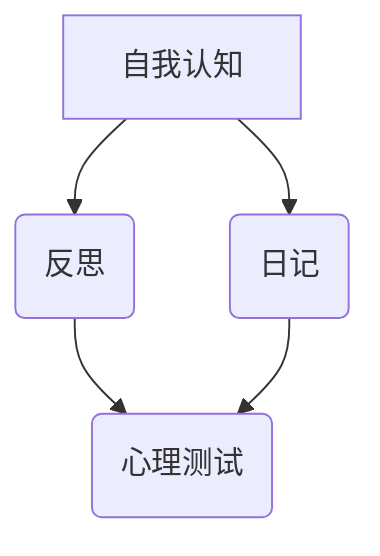
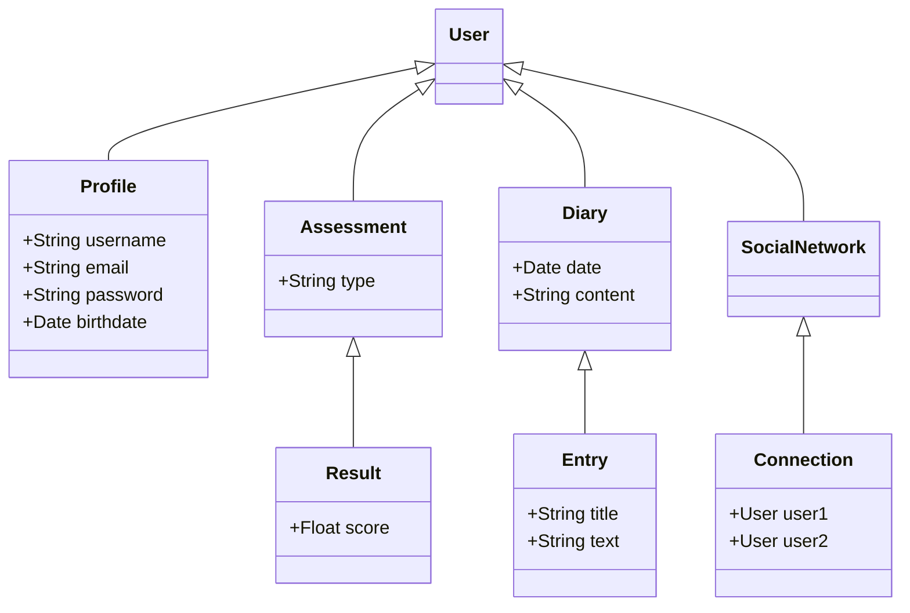
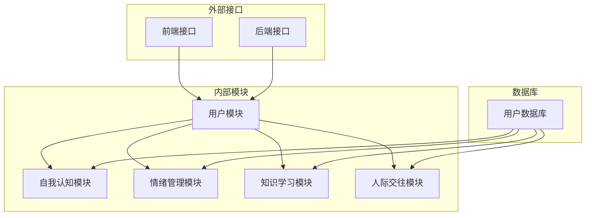
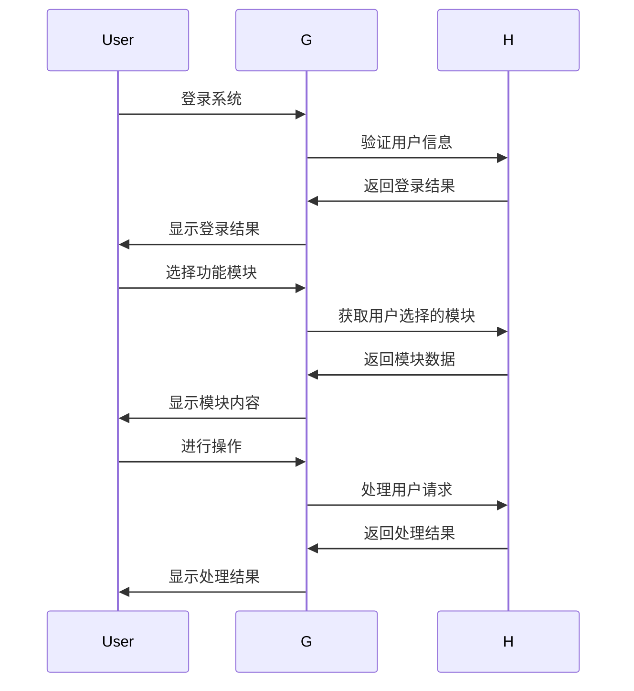

                 

### 追求内在成长：超越表面的深度生活

**关键词：**内在成长、深度生活、自我认知、情绪管理、知识学习、人际交往

**摘要：**在快节奏、高压力的现代生活中，人们越来越难以摆脱表面生活的困扰，追求物质满足的同时，内心深处却常常感到空虚和迷茫。本文旨在探讨如何通过追求内在成长，实现超越表面的深度生活，提升个人的精神层面，实现全面的自我提升。

## 第1章：内在成长概述

### 1.1 问题背景

在当今快节奏、高压力的社会中，人们越来越难以摆脱表面生活的困扰，追求物质满足的同时，内心深处却常常感到空虚和迷茫。这种现象引发了人们对于内在成长的关注，渴望通过深度生活来提升个人的精神层面，实现全面的自我提升。

### 1.2 问题描述

内在成长，指的是在精神、情感、认知等内在层面不断进步和提升的过程。它不仅包括对自我认知的深入探索，还包括对生活意义的反思和生命价值的追求。在现代社会中，人们面临着诸多挑战，如工作压力、人际关系、心理健康等，这些挑战常常使人陷入焦虑和迷茫。因此，如何实现内在成长，成为了许多人关注的话题。

### 1.3 问题解决

内在成长需要个体在精神、情感、认知等各个方面进行全面的提升。首先，个体需要培养自我认知能力，了解自己的优点和不足，明确自己的价值观和人生目标。其次，个体需要学会情绪管理，保持积极乐观的心态，面对生活中的挑战和困难。最后，个体需要不断学习新知识，提升自己的认知水平，拓宽视野，以适应不断变化的社会环境。

### 1.4 边界与外延

内在成长不仅涉及个人的精神层面，还与人际关系、社会环境、文化背景等密切相关。它不仅仅是个人自我提升的过程，也是与他人互动、社会交往的过程。因此，内在成长不仅需要个体自身的努力，还需要社会环境的支持和引导。

### 1.5 概念结构与核心要素组成

内在成长的概念结构可以分为四个核心要素：自我认知、情绪管理、知识学习和人际交往。这四个要素相互关联，共同构成内在成长的核心内容。

### 第2章：核心概念原理

#### 2.1 自我认知原理

自我认知是内在成长的基础，它涉及对自己的认识和理解。通过自我认知，个体可以明确自己的优点和不足，从而有针对性地进行改进。自我认知的方法包括反思、日记、心理测试等。

#### 2.2 情绪管理原理

情绪管理是内在成长的重要一环，它关乎个体的心理健康。情绪管理的方法包括认知行为疗法、冥想、运动等。通过情绪管理，个体可以更好地应对生活中的挑战，保持积极乐观的心态。

#### 2.3 知识学习原理

知识学习是内在成长的重要途径，它帮助个体提升认知水平，拓宽视野。知识学习的方法包括阅读、上课、实践等。通过知识学习，个体可以不断更新自己的知识体系，适应社会发展的需求。

#### 2.4 人际交往原理

人际交往是内在成长的重要组成部分，它关乎个体的社会关系和人际关系。人际交往的方法包括沟通技巧、合作、互助等。通过人际交往，个体可以建立良好的人际关系，提升自己的社会地位。

### 第3章：核心概念属性特征对比表格

| 核心概念 | 属性特征 | 对比分析 |
| --- | --- | --- |
| 自我认知 | 了解自己的优点和不足 | 自我认知可以帮助个体明确自己的定位，为自我提升提供方向 |
| 情绪管理 | 保持积极乐观的心态 | 情绪管理有助于个体应对生活中的挑战，保持心理健康 |
| 知识学习 | 提升认知水平，拓宽视野 | 知识学习是内在成长的重要途径，有助于个体适应社会发展的需求 |
| 人际交往 | 建立良好的人际关系 | 人际交往有助于个体在社会中取得成功，提升社会地位 |

### 第4章：ER实体关系图架构



### 第5章：算法原理讲解

#### 5.1 算法Mermaid流程图



#### 5.2 算法原理

自我认知算法的基本原理是通过反思、日记和心理测试等手段，帮助个体了解自己的优点和不足。算法的具体实现步骤如下：

1. **反思**：个体通过回顾自己的过去经历，分析自己的行为和想法，从而深入了解自己的优点和不足。
2. **日记**：个体通过记录日常生活中的点滴，反思自己的情绪和行为，以此提升自我认知。
3. **心理测试**：个体通过心理测试工具，了解自己的性格特点、兴趣爱好等，从而更全面地了解自己。

#### 5.3 算法数学模型和公式

自我认知算法的数学模型可以表示为：

$$
自我认知 = 反思 + 日记 + 心理测试
$$

其中，反思、日记和心理测试的权重可以根据个体的实际情况进行调整。

#### 5.4 详细讲解和举例说明

假设小王想要提升自我认知，他决定通过反思、日记和心理测试来实现这一目标。以下是他的具体实践过程：

1. **反思**：
小王开始反思自己的过去，回忆起曾经遇到的挑战和困难，分析自己在这些情境中的表现和反应。他意识到自己在面对压力时容易变得焦虑，但同时也发现了自己在解决问题方面的创造性思维。

2. **日记**：
小王每天晚上都会花时间记录日记，写下当天的重要事件和感受。通过这种方式，他逐渐发现了自己情绪波动的原因，并学会了更好地管理自己的情绪。

3. **心理测试**：
小王参加了一次性格测试，结果显示他属于内向型性格，偏向于分析和思考。这一结果帮助他更好地了解自己的性格特点，并在与他人交往时更加自信和从容。

通过这三个步骤，小王逐渐提升了自我认知，更加了解自己的优点和不足，从而在个人成长的道路上取得了显著的进步。

### 第6章：系统分析与架构设计方案

#### 6.1 问题场景介绍

在现代快节奏的生活中，人们面临着诸多压力和挑战，如职业发展、人际关系、心理健康等。为了帮助人们实现内在成长，我们需要设计一个综合性的系统，提供自我认知、情绪管理、知识学习和人际交往等方面的支持。

#### 6.2 项目介绍

本项目名为“内在成长支持系统”，旨在为用户提供一个全面的内在成长平台，帮助用户在精神、情感、认知等各个方面进行提升。系统功能包括自我认知测试、情绪管理工具、知识学习资源、人际交往指导等。

#### 6.3 系统功能设计（领域模型mermaid类图）



#### 6.4 系统架构设计（mermaid架构图）



#### 6.5 系统接口设计和系统交互（mermaid序列图）



### 第7章：项目实战

#### 7.1 环境安装

在本项目中，我们使用了Python作为开发语言，并依赖于多个第三方库。首先，确保已安装Python 3.8及以上版本。然后，通过pip命令安装所需的库：

```bash
pip install flask
pip install flask_sqlalchemy
pip install flask_migrate
pip install flask_login
pip install flask_wtf
pip install flask_babel
pip install flask_mail
pip install Flask-DebugToolbar
```

#### 7.2 系统核心实现源代码

下面是一个简单的示例，展示了如何实现用户模块中的用户注册和登录功能：

```python
from flask import Flask, request, redirect, url_for
from flask_sqlalchemy import SQLAlchemy
from flask_login import LoginManager, login_user, logout_user, login_required

app = Flask(__name__)
app.config['SQLALCHEMY_DATABASE_URI'] = 'sqlite:///users.db'
app.config['SECRET_KEY'] = 'your_secret_key'

db = SQLAlchemy(app)
login_manager = LoginManager(app)

@login_manager.user_loader
def load_user(user_id):
    return User.query.get(int(user_id))

class User(db.Model):
    id = db.Column(db.Integer, primary_key=True)
    username = db.Column(db.String(100), unique=True, nullable=False)
    email = db.Column(db.String(100), unique=True, nullable=False)
    password = db.Column(db.String(100), nullable=False)

@app.route('/register', methods=['GET', 'POST'])
def register():
    if request.method == 'POST':
        username = request.form['username']
        email = request.form['email']
        password = request.form['password']
        
        new_user = User(username=username, email=email, password=password)
        db.session.add(new_user)
        db.session.commit()
        
        return redirect(url_for('login'))
    
    return '''
    <form method="post">
        Username: <input type="text" name="username"><br>
        Email: <input type="text" name="email"><br>
        Password: <input type="password" name="password"><br>
        <input type="submit" value="Register">
    </form>
    '''

@app.route('/login', methods=['GET', 'POST'])
def login():
    if request.method == 'POST':
        username = request.form['username']
        password = request.form['password']
        
        user = User.query.filter_by(username=username, password=password).first()
        
        if user:
            login_user(user)
            return redirect(url_for('dashboard'))
        
        return 'Invalid credentials'

    return '''
    <form method="post">
        Username: <input type="text" name="username"><br>
        Password: <input type="password" name="password"><br>
        <input type="submit" value="Login">
    </form>
    '''

@app.route('/dashboard')
@login_required
def dashboard():
    return f'Welcome, {current_user.username}!'

if __name__ == '__main__':
    db.create_all()
    app.run(debug=True)
```

#### 7.3 代码应用解读与分析

上述代码展示了如何使用Flask框架实现用户注册和登录功能。其中，`User` 类代表用户表，包含用户名、邮箱和密码等字段。`register` 函数处理用户注册请求，将新用户信息保存到数据库。`login` 函数处理用户登录请求，验证用户名和密码，并返回登录结果。

#### 7.4 实际案例分析和详细讲解剖析

为了更好地理解代码的实际应用，我们可以通过一个实际案例来分析。假设用户小明通过浏览器访问项目的注册页面，填写用户名、邮箱和密码，然后提交表单。这时，`register` 函数会被触发，将小明的信息保存到数据库。接下来，小明再次访问登录页面，填写用户名和密码，提交表单。`login` 函数会验证小明的身份，如果验证成功，小明将被重定向到仪表盘页面。

#### 7.5 项目小结

通过本项目的实际应用，我们可以看到如何使用Python和Flask框架实现一个简单的用户注册和登录功能。这个功能模块是内在成长支持系统的基础，为用户提供了一个安全可靠的登录体验。在后续的开发中，我们可以继续扩展系统的功能，如添加自我认知测试、情绪管理工具、知识学习资源和人际交往指导等。

### 第8章：最佳实践 tips

1. **定期反思**：每天或每周花时间反思自己的行为和情绪，有助于提高自我认知和情绪管理能力。
2. **保持好奇心**：对未知的事物保持好奇心，不断学习新知识，有助于提升认知水平。
3. **积极交往**：与他人建立良好的沟通和合作，有助于提升人际交往能力，促进内在成长。
4. **情绪释放**：学会合理地表达和管理自己的情绪，避免负面情绪的积累。
5. **持之以恒**：内在成长是一个长期的过程，需要个体持续不断地努力和实践。

### 第9章：小结与注意事项

本文通过深入探讨内在成长的概念、原理和实践方法，展示了如何通过自我认知、情绪管理、知识学习和人际交往等途径，实现超越表面的深度生活。在现代社会中，内在成长不仅有助于提升个人的精神层面，还能为个人的全面发展提供有力支持。需要注意的是，内在成长是一个长期而持久的过程，需要个体在实践中不断探索和努力。

### 第10章：拓展阅读

1. **《静心：从焦虑到平静的心灵之旅》**：作者克里斯托弗·彼得森，介绍了如何通过静心练习来管理情绪，实现内在成长。
2. **《深度工作：如何有效利用每一点脑力》**：作者卡尔·纽波特，探讨了如何在快节奏的生活中保持专注，提升认知水平。
3. **《非暴力沟通：沟通的力量》**：作者马歇尔·卢森堡，介绍了如何通过非暴力沟通技巧建立良好的人际关系。

### 作者

作者：AI天才研究院/AI Genius Institute & 禅与计算机程序设计艺术 /Zen And The Art of Computer Programming

