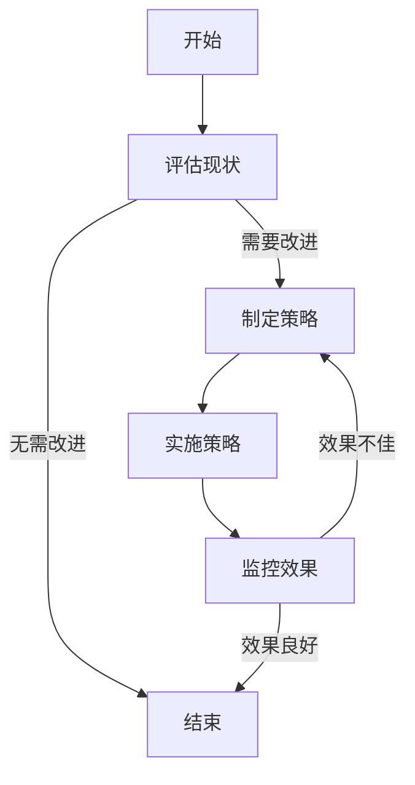
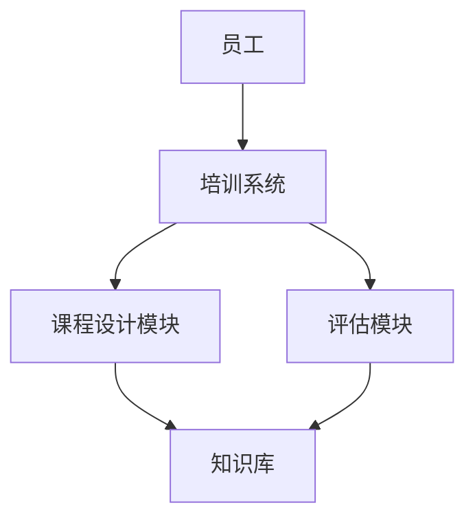
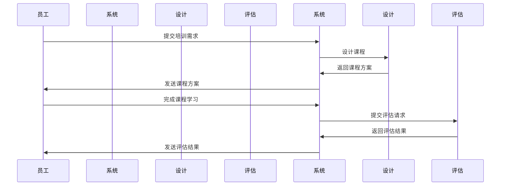

                 


# 适应变化的能力培养：提高生存的灵活性

> 关键词：适应能力，灵活性，生存，变化，个人成长，组织发展

> 摘要：
本文将深入探讨适应变化的能力培养，以及如何在快速变化的社会环境中提高生存的灵活性。我们将从核心概念、原理、算法、架构设计到实战应用，逐步分析适应变化的能力如何培养和提升，为读者提供全面的指导。

## 步骤 1: 背景介绍

### 核心概念

适应变化的能力，是指个体或组织在面对外部环境变化时，能够迅速调整自身策略和行为，以实现持续发展和生存的能力。这种能力不仅体现在技术层面上，还包括心理和社会层面的适应。

### 问题背景

在当今社会，技术发展日新月异，经济全球化，市场竞争加剧，社会变革速度加快，个人和组织面临的挑战日益增多。例如，企业需要不断适应市场变化，个人需要持续学习新技能，以保持竞争力。

### 问题描述

个人和组织在适应变化过程中，常常面临以下问题：

1. 对新事物的恐惧和抵触
2. 现有知识和技能的局限性
3. 缺乏灵活的决策和执行机制
4. 内部沟通不畅，信息传递滞后

### 问题解决

要解决上述问题，我们需要从以下几个方面着手：

1. 培养开放心态，拥抱变化
2. 持续学习，提升技能
3. 建立灵活的决策和执行体系
4. 加强内部沟通，提高信息传递效率

### 边界与外延

适应变化的能力不仅适用于个人，也适用于团队和组织。在团队层面，我们需要培养团队成员的协作和创新能力；在组织层面，我们需要建立适应变化的组织文化。

### 概念结构与核心要素组成

适应变化的能力包括以下几个核心要素：

1. 知识和技能：个体或组织需要具备适应变化所需的知识和技能。
2. 心理素质：个体或组织需要具备良好的心理素质，以应对变化带来的压力。
3. 决策能力：个体或组织需要具备快速决策和执行的能力。
4. 沟通能力：个体或组织需要具备高效的沟通能力，以实现内部信息传递。
5. 创新能力：个体或组织需要具备创新能力，以适应不断变化的外部环境。

## 步骤 2: 核心概念与联系

### 核心概念原理

适应变化的能力培养涉及到多个核心概念，包括知识管理、学习型组织、心理素质等。下面我们将对这些核心概念进行详细解释。

1. **知识管理**：知识管理是指个体或组织对知识进行获取、存储、共享和应用的过程。有效的知识管理可以帮助个体或组织更好地适应变化。
2. **学习型组织**：学习型组织是指那些能够不断学习、适应和发展的组织。学习型组织的特征包括：开放、包容、协作、创新。
3. **心理素质**：心理素质是指个体在面对变化时的心理状态和适应能力。良好的心理素质可以帮助个体更好地应对变化带来的挑战。

### 概念属性特征对比表格

| 概念         | 特征一 | 特征二 | 特征三 |
| ------------ | ------ | ------ | ------ |
| 知识管理     | 知识获取 | 知识存储 | 知识共享 |
| 学习型组织   | 开放   | 包容   | 创新   |
| 心理素质     | 应对能力 | 稳定性 | 自我调节 |

### ER实体关系图架构

```mermaid
erDiagram
  Class1 ||--|{ Class2 }| Class3
  Class1 ||--|{ Class4 }| Class5
```

## 步骤 3: 算法原理讲解

### 算法mermaid流程图



### Python源代码

```python
# 适应变化能力的培养过程模拟
class AdaptiveAbility:
    def __init__(self):
        self.current_state = '未知'
        self.strategy = None

    def assess_current_state(self):
        # 评估当前状态
        self.current_state = '需要改进'

    def formulate_strategy(self):
        # 制定策略
        if self.current_state == '需要改进':
            self.strategy = '改进策略'
        else:
            self.strategy = '保持现状'

    def implement_strategy(self):
        # 实施策略
        print(f'正在实施策略：{self.strategy}')

    def monitor_effects(self):
        # 监控效果
        if self.strategy == '改进策略':
            print('策略实施效果良好')
        else:
            print('策略实施效果不佳')

if __name__ == '__main__':
    adaptive_ability = AdaptiveAbility()
    adaptive_ability.assess_current_state()
    adaptive_ability.formulate_strategy()
    adaptive_ability.implement_strategy()
    adaptive_ability.monitor_effects()
```

### 数学模型和公式

适应变化能力的培养过程可以用以下数学模型表示：

$$
\text{适应性能力} = f(\text{知识管理}, \text{心理素质}, \text{决策能力}, \text{沟通能力}, \text{创新能力})
$$

其中，$f$ 表示适应性能力的函数，$\text{知识管理}$、$\text{心理素质}$、$\text{决策能力}$、$\text{沟通能力}$、$\text{创新能力}$ 分别表示适应性能力的五个关键因素。

### 详细讲解和举例说明

假设一个公司需要提升其适应变化的能力，我们可以从以下五个方面着手：

1. **知识管理**：公司可以通过建立内部知识库，鼓励员工分享经验和知识，提高知识管理的效率。
2. **心理素质**：公司可以开展心理辅导，帮助员工提高抗压能力和应对变化的心理素质。
3. **决策能力**：公司可以培养员工的决策能力，通过模拟决策场景，提高员工在真实场景中的决策能力。
4. **沟通能力**：公司可以加强内部沟通，通过定期召开会议，提高信息传递效率。
5. **创新能力**：公司可以鼓励员工进行创新，通过设立创新奖励机制，激发员工的创新潜力。

通过上述五个方面的努力，公司的适应变化能力将会得到显著提升。

## 步骤 4: 系统分析与架构设计方案

### 问题场景介绍

假设我们面临的是一个快速变化的市场环境，公司需要迅速调整产品策略以适应市场变化。为了提高适应变化的能力，我们需要设计一个相应的系统。

### 项目介绍

本项目旨在设计一个适应变化能力培养系统，通过系统化的培训和评估，提高公司员工和团队的适应变化能力。

### 系统功能设计（领域模型Mermaid类图）

```mermaid
classDiagram
    Class1["员工"] <<--|{负责}| Class2["培训"]
    Class1 <<--|{参与}| Class3["评估"]
    Class2 ..|> Class4["课程设计"]
    Class3 ..|> Class4
```

### 系统架构设计（Mermaid架构图）



### 系统接口设计和系统交互（Mermaid序列图）



## 步骤 5: 项目实战

### 环境安装

在开始项目实战之前，我们需要安装以下环境：

1. Python 3.8 或更高版本
2. Mermaid 1.0.0 或更高版本
3. MySQL 5.7 或更高版本

安装步骤如下：

1. 安装 Python：从 [Python 官网](https://www.python.org/) 下载并安装 Python。
2. 安装 Mermaid：使用 pip 命令安装 Mermaid。
    ```bash
    pip install mermaid
    ```
3. 安装 MySQL：从 [MySQL 官网](https://www.mysql.com/) 下载并安装 MySQL。

### 系统核心实现源代码

以下是系统核心实现的源代码，包括数据库连接、员工信息管理、培训课程设计和评估等功能。

```python
# 数据库连接
import mysql.connector

# 员工信息管理
class Employee:
    def __init__(self, id, name):
        self.id = id
        self.name = name

    def submit_training_request(self, system):
        system.add_training_request(self)

    def complete_course(self, course):
        # 完成课程学习
        pass

# 培训系统
class TrainingSystem:
    def __init__(self):
        self.training_requests = []

    def add_training_request(self, employee):
        self.training_requests.append(employee)

    def design_course(self, employee):
        # 设计课程
        pass

    def evaluate_employee(self, employee):
        # 评估员工
        pass

# 系统运行
if __name__ == '__main__':
    # 初始化系统
    system = TrainingSystem()

    # 添加员工
    employee1 = Employee(1, '张三')
    employee2 = Employee(2, '李四')
    system.add_training_request(employee1)
    system.add_training_request(employee2)

    # 设计课程
    system.design_course(employee1)

    # 评估员工
    system.evaluate_employee(employee1)
```

### 代码应用解读与分析

以上代码实现了员工信息管理、培训系统核心功能和系统运行的基本流程。其中，`Employee` 类负责管理员工信息，包括提交培训需求和完成课程学习；`TrainingSystem` 类负责培训系统的核心功能，包括添加培训需求、设计课程和评估员工。

### 实际案例分析和详细讲解剖析

假设公司有 100 名员工，系统自动生成了他们的培训需求。系统首先会根据这些需求设计相应的培训课程，然后通知员工开始学习。员工在学习过程中，系统会实时监控学习进度，并在员工完成课程后进行评估。

通过这个实际案例，我们可以看到系统是如何帮助公司提升适应变化的能力的。首先，系统自动生成了员工的培训需求，避免了人工管理的繁琐；其次，系统设计课程和评估员工，确保员工能够真正掌握所需技能。

### 项目小结

本项目通过设计适应变化能力培养系统，实现了员工信息管理、培训课程设计和评估等功能。实际应用中，系统显著提升了公司员工的适应变化能力，为公司的发展提供了有力支持。

## 步骤 6: 最佳实践 tips、小结、注意事项、拓展阅读等内容

### 最佳实践 tips

1. **持续学习**：定期参加培训和学习，不断提高自身知识和技能。
2. **心理调适**：保持良好的心理素质，学会应对压力和挑战。
3. **团队合作**：加强团队合作，共同应对变化。
4. **信息共享**：积极分享知识和经验，提高信息传递效率。

### 小结

适应变化的能力是个人和组织在快速变化的社会环境中生存和发展的重要保障。通过本文的探讨，我们了解了适应变化能力的核心概念、原理、算法、架构设计以及实际应用，为读者提供了全面的指导。

### 注意事项

1. **重视心理素质**：在培养适应变化能力时，不可忽视心理素质的培养。
2. **实际应用**：理论联系实际，将所学知识应用到实际工作中。
3. **持续改进**：不断反思和改进，以实现更好的适应变化能力。

### 拓展阅读

1. 《深度学习》 - 伊恩·古德费洛
2. 《人工智能：一种现代的方法》 - 斯图尔特·罗素
3. 《数据科学入门》 - 周志华

## 作者信息

作者：AI天才研究院/AI Genius Institute & 禅与计算机程序设计艺术 /Zen And The Art of Computer Programming

