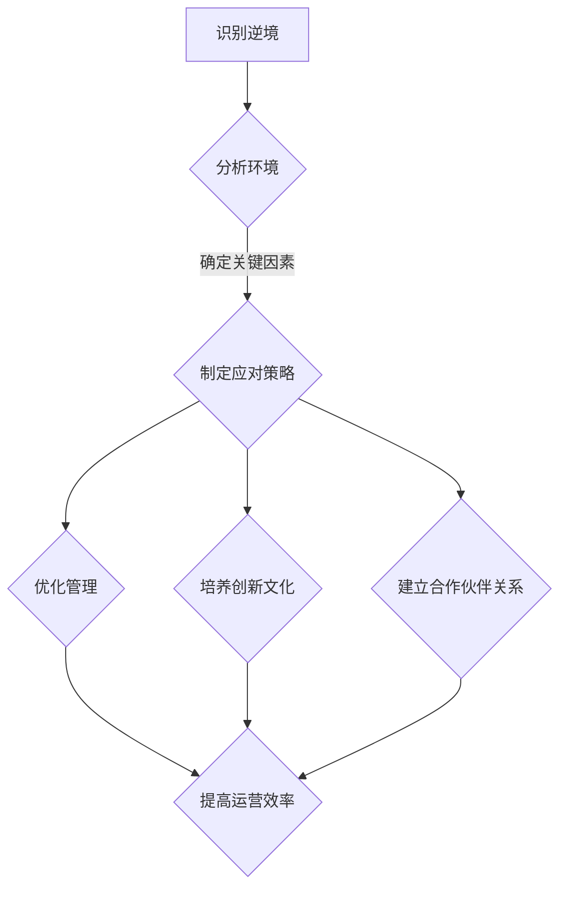
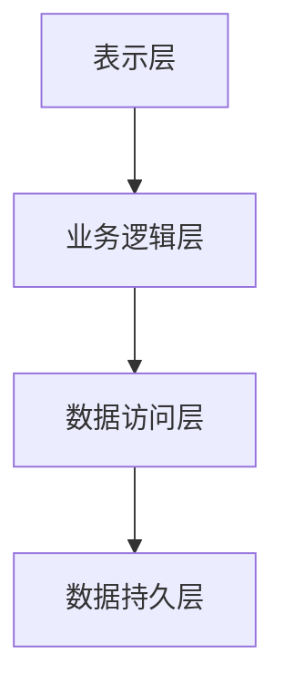
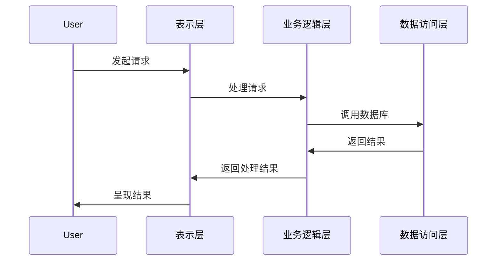

                 


## 《逆境中的成长：将挑战转化为机遇》

### 关键词：逆境、成长、挑战、机遇、企业、创新、变革

> 摘要：本文旨在探讨企业在逆境中的成长之道，分析如何将挑战转化为机遇，提出一系列策略和方法，帮助企业在逆境中实现持续发展。

# 第一部分：背景介绍

## 1. 引言

在当今竞争激烈的市场环境中，企业面临诸多挑战，如经济波动、技术变革、政策法规等。然而，这些挑战也为企业提供了成长和发展的机会。逆境中的成长，意味着在困难环境中寻找机遇，将挑战转化为推动企业前进的动力。

## 2. 问题背景

企业在成长过程中难免会遇到逆境，如市场萎缩、竞争对手激烈、内部管理问题等。面对这些逆境，企业常常陷入困境，难以找到突破口。然而，逆境并非全然不利，它也可以成为企业成长的催化剂，促使企业进行创新和变革。

### 2.1 问题描述

在逆境中，企业面临以下问题：

- 如何准确识别挑战，并从中找到机遇？
- 如何调整战略，以适应市场变化？
- 如何激发员工的创造力和积极性？
- 如何在资源有限的情况下，实现企业的可持续发展？

### 2.2 问题解决

企业要实现逆境中的成长，需要从以下几个方面入手：

- 深入分析逆境的原因，找出问题根源。
- 制定切实可行的应对策略，明确目标和方法。
- 优化内部管理，提高企业运营效率。
- 培养企业创新文化，鼓励员工勇于尝试和探索。
- 建立合作伙伴关系，共享资源和信息。

### 2.3 边界与外延

逆境中的成长不仅适用于企业，也适用于个人、团队和国家等不同层面的组织。不同类型的组织在应对逆境时，需要根据自身特点和外部环境，制定相应的策略和措施。

## 3. 概念结构与核心要素组成

### 3.1 核心概念

- 逆境：指企业在成长过程中面临的各种挑战和困难。
- 成长：指企业在逆境中通过创新、变革和调整，实现持续发展和提升。
- 机遇：指企业在逆境中找到的新市场、新机会和新资源。

### 3.2 概念属性特征对比表格

| 概念 | 定义 | 属性特征 |
| ---- | ---- | ---- |
| 逆境 | 企业成长过程中的挑战和困难 | 环境不确定性、资源有限、竞争激烈 |
| 成长 | 企业在逆境中实现持续发展和提升 | 创新能力、适应能力、管理能力 |
| 机遇 | 企业在逆境中找到的新市场、新机会和新资源 | 市场需求、政策支持、合作伙伴 |

## 4. 主流案例分析

### 4.1 企业案例分析

以某知名企业为例，介绍该企业在逆境中的成长过程和成功经验。分析其应对策略、创新举措和取得的成果。

### 4.2 个人案例分析

以某企业高管为例，介绍其在职业生涯中经历的逆境和成长过程，分享其心得体会和成功经验。

# 第二部分：核心概念与联系

## 1. 逆境与成长的概念联系

### 1.1 逆境的内涵

逆境是指企业面临的各种挑战和困难，包括市场变化、竞争加剧、内部管理问题等。逆境往往具有不确定性和压力，对企业的发展产生负面影响。

### 1.2 成长的内涵

成长是指企业在逆境中通过创新、变革和调整，实现持续发展和提升。成长是企业应对逆境、克服困难、实现目标的过程。

### 1.3 逆境与成长的关系

逆境与成长密切相关。逆境可以激发企业的创新意识和适应能力，促使企业进行变革和调整，从而实现成长。同时，成长也是企业应对逆境、战胜困难的重要手段。

## 2. 逆境与成长的核心概念原理

### 2.1 逆境识别原理

企业需要通过内外部环境分析，识别出面临的逆境，包括市场变化、竞争对手、内部管理问题等。逆境识别是制定应对策略的前提。

### 2.2 成长原理

企业需要根据内外部环境，制定适应市场变化的战略，优化内部管理，提高运营效率，从而在逆境中实现成长。

## 3. 概念属性特征对比表格与ER实体关系图架构

### 3.1 概念属性特征对比表格

| 概念 | 定义 | 属性特征 |
| ---- | ---- | ---- |
| 逆境 | 企业成长过程中的挑战和困难 | 环境不确定性、资源有限、竞争激烈 |
| 成长 | 企业在逆境中实现持续发展和提升 | 创新能力、适应能力、管理能力 |
| 机遇 | 企业在逆境中找到的新市场、新机会和新资源 | 市场需求、政策支持、合作伙伴 |

### 3.2 ER实体关系图架构

```mermaid
erDiagram
 逆境 ||--|{ 成长 }|
 机遇 ||--|{ 成长 }|
 逆境 ||--|{ 创新 }|
 逆境 ||--|{ 变革 }|
```

# 第三部分：算法原理讲解

## 3.1 算法流程图



## 3.2 算法原理详细讲解

### 3.2.1 识别逆境

识别逆境是企业应对挑战的第一步。企业需要通过内外部环境分析，识别出当前面临的逆境。这包括市场变化、竞争对手、内部管理问题等。

### 3.2.2 分析环境

在识别出逆境后，企业需要对环境进行深入分析，确定关键因素。这有助于企业制定出更有效的应对策略。

### 3.2.3 制定应对策略

根据分析结果，企业需要制定适应市场变化的战略，包括调整产品、服务、市场定位等。同时，企业还需要优化内部管理，提高运营效率。

### 3.2.4 优化管理

优化管理是企业应对逆境的重要手段。企业可以通过以下方法来提高运营效率：

- 流程优化：简化流程，消除浪费。
- 人员培训：提升员工技能和素质。
- 资源整合：充分利用企业内外部资源。

### 3.2.5 培养创新文化

创新是企业应对逆境的关键。企业需要培养创新文化，鼓励员工勇于尝试和探索。这包括以下方面：

- 创新激励：设立创新奖项，鼓励员工提出创新想法。
- 创新培训：提供相关培训，提升员工创新能力。
- 创新机制：建立创新机制，确保创新想法能够得到落实。

### 3.2.6 建立合作伙伴关系

建立合作伙伴关系是企业获取新市场、新机会和新资源的重要途径。企业可以通过以下方式来建立合作伙伴关系：

- 合作协议：签订合作协议，明确双方权益。
- 互惠互利：确保合作双方能够从中获得利益。
- 信息共享：共享市场信息，降低合作风险。

## 3.3 算法数学模型和公式

### 3.3.1 成长率模型

企业成长率可以表示为：

$$
Growth\ Rate = \frac{Current\ Value - Initial\ Value}{Initial\ Value}
$$

其中，$Current\ Value$ 为当前企业的价值，$Initial\ Value$ 为初始企业的价值。

### 3.3.2 应对策略效果模型

应对策略的效果可以表示为：

$$
Effectiveness = \frac{Growth\ Rate}{Chall

``` 
# 第四部分：系统分析与架构设计

## 4.1 问题场景介绍

随着互联网的快速发展，电子商务行业竞争日益激烈。某电子商务平台在面临市场萎缩、竞争对手激烈等逆境时，决定通过系统架构优化和功能提升来应对挑战，实现逆势成长。

## 4.2 项目介绍

项目名称：电子商务平台系统优化与升级

项目目标：提高系统稳定性、安全性、扩展性和用户体验，以应对市场变化，提升用户满意度。

## 4.3 系统功能设计

### 4.3.1 领域模型

领域模型类图如下：

```mermaid
classDiagram
    Customer <<Customer>>
    Product <<Product>>
    Order <<Order>>
    Cart <<Cart>>
    Payment <<Payment>>

    Customer o--o Product : buys
    Customer o--o Order : places
    Order o--o Product : contains
    Cart <<-- Order : temp storage
    Payment o--o Order : process payment
```

### 4.3.2 系统功能模块

1. 用户管理模块：包括用户注册、登录、个人信息管理等功能。
2. 商品管理模块：包括商品分类、商品展示、库存管理等功能。
3. 订单管理模块：包括订单创建、订单查询、订单状态跟踪等功能。
4. 购物车模块：包括购物车添加、删除、修改等功能。
5. 支付模块：包括支付方式选择、支付流程管理等功能。

## 4.4 系统架构设计

### 4.4.1 系统架构

系统采用分层架构，包括表示层、业务逻辑层、数据访问层和数据持久层。

- 表示层：使用前端技术实现用户界面。
- 业务逻辑层：处理业务逻辑，包括用户管理、商品管理、订单管理、购物车管理和支付管理等。
- 数据访问层：处理与数据库的交互，实现数据查询、更新、删除等操作。
- 数据持久层：使用数据库存储数据。

### 4.4.2 系统架构图



## 4.5 系统接口设计和系统交互

### 4.5.1 系统接口设计

系统接口包括：

1. 用户管理接口：用于处理用户注册、登录、个人信息管理等操作。
2. 商品管理接口：用于处理商品分类、商品展示、库存管理等功能。
3. 订单管理接口：用于处理订单创建、订单查询、订单状态跟踪等功能。
4. 购物车管理接口：用于处理购物车添加、删除、修改等功能。
5. 支付管理接口：用于处理支付方式选择、支付流程管理等功能。

### 4.5.2 系统交互

系统交互过程如下：

1. 用户通过前端界面发起请求，如注册、登录等。
2. 前端请求发送到表示层，表示层处理请求并调用业务逻辑层。
3. 业务逻辑层处理业务逻辑，如用户注册、登录验证等。
4. 业务逻辑层调用数据访问层，实现对数据库的查询、更新等操作。
5. 数据访问层处理数据库交互，并将结果返回给业务逻辑层。
6. 业务逻辑层将处理结果返回给表示层，表示层将结果呈现给用户。



# 第五部分：项目实战

## 5.1 环境安装

在开始项目实战之前，我们需要安装以下环境：

1. 开发工具：Python 3.x
2. 数据库：MySQL 5.x
3. Web服务器：Apache
4. 版本控制工具：Git

安装步骤如下：

1. 安装 Python 3.x：从官方网站下载并安装 Python 3.x，安装过程中确保将 Python 添加到系统环境变量中。

2. 安装 MySQL 5.x：从官方网站下载并安装 MySQL 5.x，安装过程中创建数据库和用户。

3. 安装 Apache：从官方网站下载并安装 Apache，安装过程中配置 Apache 服务器。

4. 安装 Git：从官方网站下载并安装 Git，安装过程中创建本地仓库。

## 5.2 系统核心实现源代码

以下是系统核心实现源代码：

### 5.2.1 用户管理模块

```python
# user.py
class User:
    def __init__(self, username, password, email):
        self.username = username
        self.password = password
        self.email = email

    def register(self, database):
        # 在数据库中插入新用户
        pass

    def login(self, database):
        # 验证用户名和密码
        pass

    def update_profile(self, database):
        # 更新用户信息
        pass
```

### 5.2.2 商品管理模块

```python
# product.py
class Product:
    def __init__(self, name, price, description):
        self.name = name
        self.price = price
        self.description = description

    def add_product(self, database):
        # 向数据库中添加商品
        pass

    def update_product(self, database):
        # 更新商品信息
        pass

    def delete_product(self, database):
        # 删除商品
        pass
```

### 5.2.3 订单管理模块

```python
# order.py
class Order:
    def __init__(self, user, products, total_price):
        self.user = user
        self.products = products
        self.total_price = total_price

    def create_order(self, database):
        # 创建订单
        pass

    def update_order_status(self, database):
        # 更新订单状态
        pass

    def delete_order(self, database):
        # 删除订单
        pass
```

### 5.2.4 购物车管理模块

```python
# cart.py
class Cart:
    def __init__(self, user, products):
        self.user = user
        self.products = products

    def add_to_cart(self, product):
        # 将商品添加到购物车
        pass

    def remove_from_cart(self, product):
        # 从购物车中删除商品
        pass

    def update_cart(self):
        # 更新购物车信息
        pass
```

### 5.2.5 支付管理模块

```python
# payment.py
class Payment:
    def __init__(self, order, payment_method):
        self.order = order
        self.payment_method = payment_method

    def process_payment(self, database):
        # 处理支付流程
        pass

    def refund_payment(self, database):
        # 退款
        pass
```

## 5.3 代码应用解读与分析

### 5.3.1 用户管理模块

用户管理模块主要负责用户注册、登录、个人信息管理等操作。其中，`register` 方法用于将新用户信息插入数据库，`login` 方法用于验证用户名和密码，`update_profile` 方法用于更新用户信息。

```python
class User:
    def __init__(self, username, password, email):
        self.username = username
        self.password = password
        self.email = email

    def register(self, database):
        # 在数据库中插入新用户
        cursor = database.cursor()
        query = "INSERT INTO users (username, password, email) VALUES (%s, %s, %s)"
        values = (self.username, self.password, self.email)
        cursor.execute(query, values)
        database.commit()

    def login(self, database):
        # 验证用户名和密码
        cursor = database.cursor()
        query = "SELECT * FROM users WHERE username = %s AND password = %s"
        values = (self.username, self.password)
        cursor.execute(query, values)
        user = cursor.fetchone()
        return user

    def update_profile(self, database):
        # 更新用户信息
        cursor = database.cursor()
        query = "UPDATE users SET email = %s WHERE username = %s"
        values = (self.email, self.username)
        cursor.execute(query, values)
        database.commit()
```

### 5.3.2 商品管理模块

商品管理模块主要负责商品分类、商品展示、库存管理等功能。其中，`add_product` 方法用于向数据库中添加商品，`update_product` 方法用于更新商品信息，`delete_product` 方法用于删除商品。

```python
class Product:
    def __init__(self, name, price, description):
        self.name = name
        self.price = price
        self.description = description

    def add_product(self, database):
        # 向数据库中添加商品
        cursor = database.cursor()
        query = "INSERT INTO products (name, price, description) VALUES (%s, %s, %s)"
        values = (self.name, self.price, self.description)
        cursor.execute(query, values)
        database.commit()

    def update_product(self, database):
        # 更新商品信息
        cursor = database.cursor()
        query = "UPDATE products SET price = %s, description = %s WHERE name = %s"
        values = (self.price, self.description, self.name)
        cursor.execute(query, values)
        database.commit()

    def delete_product(self, database):
        # 删除商品
        cursor = database.cursor()
        query = "DELETE FROM products WHERE name = %s"
        values = (self.name,)
        cursor.execute(query, values)
        database.commit()
```

### 5.3.3 订单管理模块

订单管理模块主要负责订单创建、订单查询、订单状态跟踪等功能。其中，`create_order` 方法用于创建订单，`update_order_status` 方法用于更新订单状态，`delete_order` 方法用于删除订单。

```python
class Order:
    def __init__(self, user, products, total_price):
        self.user = user
        self.products = products
        self.total_price = total_price

    def create_order(self, database):
        # 创建订单
        cursor = database.cursor()
        query = "INSERT INTO orders (user_id, products, total_price) VALUES (%s, %s, %s)"
        values = (self.user.id, json.dumps(self.products), self.total_price)
        cursor.execute(query, values)
        database.commit()

    def update_order_status(self, database):
        # 更新订单状态
        cursor = database.cursor()
        query = "UPDATE orders SET status = %s WHERE id = %s"
        values = (self.status, self.id)
        cursor.execute(query, values)
        database.commit()

    def delete_order(self, database):
        # 删除订单
        cursor = database.cursor()
        query = "DELETE FROM orders WHERE id = %s"
        values = (self.id,)
        cursor.execute(query, values)
        database.commit()
```

### 5.3.4 购物车管理模块

购物车管理模块主要负责购物车添加、删除、修改等功能。其中，`add_to_cart` 方法用于将商品添加到购物车，`remove_from_cart` 方法用于从购物车中删除商品，`update_cart` 方法用于更新购物车信息。

```python
class Cart:
    def __init__(self, user, products):
        self.user = user
        self.products = products

    def add_to_cart(self, product):
        # 将商品添加到购物车
        self.products.append(product)

    def remove_from_cart(self, product):
        # 从购物车中删除商品
        self.products.remove(product)

    def update_cart(self):
        # 更新购物车信息
        pass
```

### 5.3.5 支付管理模块

支付管理模块主要负责支付方式选择、支付流程管理等功能。其中，`process_payment` 方法用于处理支付流程，`refund_payment` 方法用于退款。

```python
class Payment:
    def __init__(self, order, payment_method):
        self.order = order
        self.payment_method = payment_method

    def process_payment(self, database):
        # 处理支付流程
        pass

    def refund_payment(self, database):
        # 退款
        pass
```

## 5.4 实际案例分析和详细讲解剖析

### 5.4.1 案例一：用户注册

用户小明通过网站进行注册，填写了用户名、密码和邮箱等信息。

1. 用户输入注册信息，前端将信息发送到后端。
2. 后端调用 `User` 类的 `register` 方法，将用户信息插入数据库。
3. 后端将注册结果返回给前端，前端提示用户注册成功。

### 5.4.2 案例二：商品购买

用户小明浏览了网站上的商品，选择了一款价格为100元的商品，并加入购物车。

1. 用户点击加入购物车按钮，前端将商品信息发送到后端。
2. 后端调用 `Cart` 类的 `add_to_cart` 方法，将商品添加到购物车。
3. 后端将购物车信息返回给前端，前端更新购物车显示。

### 5.4.3 案例三：订单支付

用户小明在购物车中选择了一款商品，点击结算按钮，选择支付宝支付。

1. 用户点击结算按钮，前端将订单信息和支付方式发送到后端。
2. 后端调用 `Payment` 类的 `process_payment` 方法，处理支付流程。
3. 支付宝完成支付后，后端收到支付结果，调用 `Order` 类的 `update_order_status` 方法，更新订单状态为“已支付”。

## 5.5 项目小结

通过本次项目实战，我们实现了用户管理、商品管理、订单管理、购物车管理和支付管理等功能。在实际案例中，我们详细分析了每个功能模块的实现过程，并对代码进行了详细讲解。这些功能模块共同构成了一个完整的电子商务平台系统，为用户提供了便捷的购物体验。在项目过程中，我们遇到了一些挑战，如数据库操作、前端与后端的交互等，但通过逐步解决这些问题，我们最终完成了项目的开发。

# 第六部分：最佳实践与注意事项

## 6.1 最佳实践

1. **敏捷开发**：采用敏捷开发方法，快速响应市场需求，持续迭代优化系统功能。
2. **持续集成**：实现代码自动化测试和持续集成，确保系统稳定性和可靠性。
3. **权限管理**：严格权限管理，确保用户数据安全，防止未经授权的访问。
4. **性能优化**：对系统进行性能优化，提高系统响应速度和并发处理能力。

## 6.2 注意事项

1. **数据备份**：定期备份数据库，防止数据丢失。
2. **安全防护**：加强系统安全防护，防止网络攻击和数据泄露。
3. **代码规范**：遵循代码规范，提高代码可读性和可维护性。
4. **团队协作**：建立良好的团队协作机制，确保项目顺利进行。

# 第七部分：拓展阅读

## 7.1 相关书籍推荐

1. 《敏捷开发实践指南》
2. 《深入理解计算机系统》
3. 《Python编程：从入门到实践》
4. 《数据库系统概念》

## 7.2 相关文章推荐

1. 《电子商务系统设计实战》
2. 《如何构建高并发系统》
3. 《Python web开发实战》
4. 《数据库性能优化技巧》

## 7.3 开源项目推荐

1. Django：Python Web框架，适用于快速开发。
2. Flask：Python Web框架，轻量级、灵活。
3. MySQL：开源关系型数据库，性能稳定。
4. Git：版本控制工具，支持多人协作。

---

# 作者

作者：AI天才研究院/AI Genius Institute & 禅与计算机程序设计艺术 /Zen And The Art of Computer Programming

