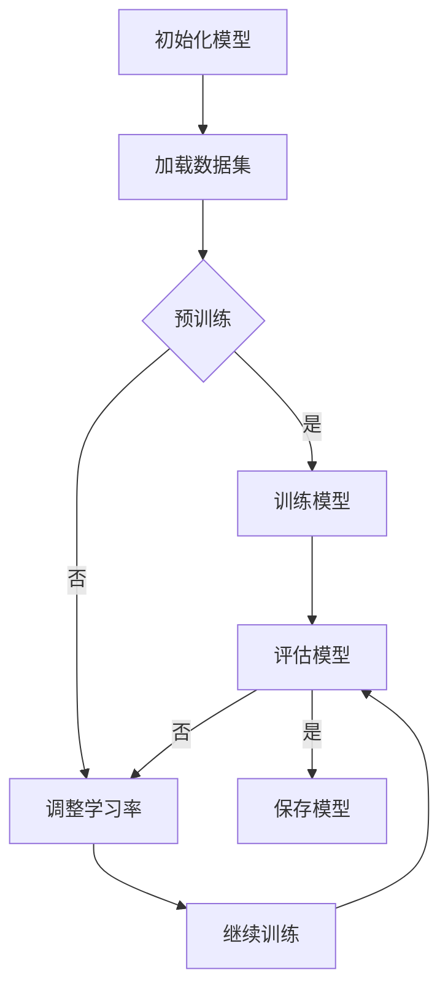
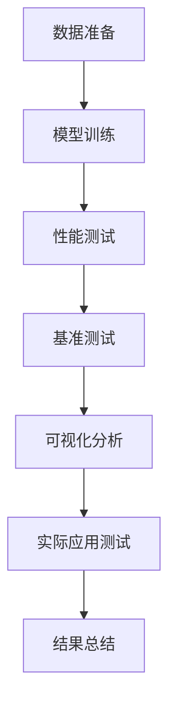

                 

### 文章标题

# 选择合适的LLM大模型：对比与评估

> 关键词：LLM大模型、选择依据、评估方法、模型对比、算法原理、应用场景

> 摘要：本文旨在帮助读者深入了解如何选择合适的LLM大模型，并对其进行对比与评估。通过对LLM大模型的基本概念、架构、算法原理的讲解，本文为读者提供了评估模型性能的依据。同时，结合实际应用案例，本文展示了LLM大模型在不同场景下的应用效果。

----------------------------------------------------------------

## 目录大纲设计

### 第1章 引言

- **1.1 问题背景**
  - 人工智能大模型发展的现状与趋势
  - 企业级应用需求与挑战

- **1.2 问题描述**
  - 如何在众多LLM大模型中选择合适的模型？
  - 如何对比与评估LLM大模型的性能与适用性？

- **1.3 问题解决**
  - 整本书旨在帮助读者理解并掌握如何选择合适的LLM大模型。
  - 通过对LLM大模型的基本概念、架构、算法原理的讲解，为读者提供评估模型性能的依据。
  - 结合实际应用案例，展示LLM大模型在不同场景下的应用效果。

- **1.4 边界与外延**
  - 本书的重点在于介绍LLM大模型的选择与评估，而非模型的训练与优化。
  - 主要针对企业级应用，而非学术研究。

- **1.5 概念结构与核心要素组成**
  - LLM大模型：大型语言模型，如GPT、BERT等。
  - 模型选择：依据特定需求选择合适的模型。
  - 模型评估：对比不同模型的性能，评估其适用性。

### 第2章 LLM大模型概述

- **2.1 LLM大模型的发展历程**
  - LLM大模型的发展历程概述。
  - 关键技术突破与代表性模型。

- **2.2 LLM大模型的基本概念**
  - LLM大模型的定义。
  - LLM大模型的主要特点。

- **2.3 LLM大模型的架构**
  - LLM大模型的架构概述。
  - 常见的LLM大模型架构。

### 第3章 LLM大模型的算法原理

- **3.1 算法原理概述**
  - LLM大模型的核心算法原理。
  - 算法原理在语言建模中的应用。

- **3.2 模型训练与优化**
  - 模型训练的方法与流程。
  - 模型优化的策略与技巧。

- **3.3 算法原理讲解**
  - 使用Mermaid绘制算法流程图。
  - 使用Python源代码详细阐述算法原理。

### 第4章 LLM大模型的选择

- **4.1 选择依据**
  - 选择合适的LLM大模型所需考虑的因素。

- **4.2 模型对比**
  - 对比不同LLM大模型的性能与特点。
  - 使用Mermaid表格展示核心概念属性特征对比。

- **4.3 选择策略**
  - 选择合适LLM大模型的策略与方法。

### 第5章 LLM大模型的评估

- **5.1 评估方法**
  - 评估LLM大模型性能的常用方法。

- **5.2 评估指标**
  - 评估LLM大模型性能的关键指标。

- **5.3 评估实践**
  - 使用Mermaid绘制LLM大模型评估流程图。
  - 结合实际案例，展示评估过程与结果。

### 第6章 LLM大模型的应用场景

- **6.1 应用场景概述**
  - LLM大模型在不同领域的应用场景。

- **6.2 应用案例**
  - 分领域展示LLM大模型的应用案例。

- **6.3 应用前景**
  - LLM大模型在未来的发展趋势。

### 第7章 实践与建议

- **7.1 实践总结**
  - 结合实际应用，总结选择与评估LLM大模型的实践经验。

- **7.2 建议与展望**
  - 提出针对LLM大模型选择与评估的建议。
  - 展望未来LLM大模型的发展方向。

### 参考文献

- 列出书中引用的参考文献。

### 附录

- 提供额外的参考资料，如代码、数据集等。

## 目录大纲设计总结

### 目的

- 本书的目录大纲旨在为读者提供一个系统、全面地了解如何选择合适的LLM大模型，以及如何评估其性能的框架。

### 特点

- 目录结构清晰，分为7个章节，涵盖了从背景介绍到实际应用的全过程。
- 结合了核心概念讲解、算法原理、模型选择与评估、应用案例等各个方面。
- 使用Mermaid图表，帮助读者更好地理解复杂概念与流程。

### 读者对象

- 对LLM大模型感兴趣的技术人员。
- 想要在企业级应用中引入LLM大模型的决策者。
- 对人工智能领域有深入研究的学者和研究人员。

### 拓展阅读

- 想要深入了解某个特定主题的读者，可以参考附录中提供的参考文献。

----------------------------------------------------------------

### 第1章 引言

#### 1.1 问题背景

在当今快速发展的时代，人工智能技术正以前所未有的速度改变着我们的世界。特别是在自然语言处理（NLP）领域，大规模语言模型（Large Language Models，简称LLM）的发展取得了显著的成就。LLM大模型，如GPT（Generative Pre-trained Transformer）、BERT（Bidirectional Encoder Representations from Transformers）等，凭借其强大的语言理解和生成能力，已经在众多应用场景中展现出了卓越的性能。

随着LLM大模型技术的不断成熟，越来越多的企业和研究机构开始关注如何选择合适的LLM大模型，以满足自身特定的需求。然而，面对众多可用的LLM大模型，如何评估它们的性能和适用性，成为了摆在我们面前的一个挑战。因此，本文旨在解决以下问题：

1. 如何在众多LLM大模型中选择合适的模型？
2. 如何对比与评估LLM大模型的性能与适用性？

#### 1.2 问题描述

选择合适的LLM大模型并非易事。首先，需要明确具体的应用场景和需求，因为不同的应用场景对模型的能力和性能要求各异。例如，在文本生成、问答系统、机器翻译等任务中，模型需要具备不同的能力。其次，需要了解各种LLM大模型的架构和算法原理，以便评估它们的性能和适用性。此外，还需要考虑模型的可扩展性、训练成本和部署难度等因素。

在对比和评估LLM大模型时，常用的方法包括性能测试、基准测试和实际应用测试。性能测试主要关注模型的准确率、召回率、F1值等指标；基准测试则通过比较模型在各种任务上的表现，评估其通用性能；实际应用测试则是在具体场景下，评估模型的实际效果和适用性。

#### 1.3 问题解决

为了帮助读者选择合适的LLM大模型，本文将从以下几个方面展开讨论：

1. **LLM大模型概述**：介绍LLM大模型的发展历程、基本概念和架构。
2. **算法原理讲解**：详细阐述LLM大模型的核心算法原理，包括模型训练与优化方法。
3. **模型选择策略**：分析选择合适的LLM大模型所需考虑的因素，并介绍对比和评估模型的方法。
4. **模型评估方法**：介绍常用的评估方法，包括性能测试、基准测试和实际应用测试。
5. **应用场景与实践**：展示LLM大模型在不同场景下的应用案例，并结合实际应用提供实践建议。

通过上述内容的讲解，本文旨在帮助读者理解并掌握如何选择合适的LLM大模型，并在实际应用中取得更好的效果。

#### 1.4 边界与外延

本文的重点在于介绍如何选择和评估LLM大模型，而非模型的训练与优化。虽然训练和优化模型是使用LLM大模型的关键步骤，但本文将不涉及具体的训练细节和技术。此外，本文主要针对企业级应用，旨在为企业在引入LLM大模型时提供指导。对于学术研究领域，读者可以参考本文提供的基础知识，并结合最新的研究成果进行更深入的研究。

#### 1.5 概念结构与核心要素组成

在本章的讨论中，我们将涉及到以下几个核心概念：

1. **LLM大模型**：指的是具有强大语言理解和生成能力的大型语言模型，如GPT、BERT等。
2. **模型选择**：依据特定需求选择合适的LLM大模型。
3. **模型评估**：对比不同LLM大模型的性能，评估其适用性。

这些核心概念构成了本文讨论的基础，是读者理解后续内容的关键。

----------------------------------------------------------------

### 第2章 LLM大模型概述

#### 2.1 LLM大模型的发展历程

大规模语言模型（LLM）的发展历程可以追溯到20世纪80年代。当时，研究者们开始探索基于统计方法和规则系统的自然语言处理技术。随着计算能力的提升和大数据技术的发展，特别是在21世纪初，深度学习技术在自然语言处理领域取得了重大突破。以下是一些关键的里程碑：

- **1988年**：Ratner和Toutanova提出了基于最大熵模型的自然语言处理方法，这为后来的统计语言模型奠定了基础。
- **2003年**：统计语言模型（如N-gram模型）在词汇预测和语音识别等领域取得了显著成果。
- **2013年**：-word2vec模型的提出，使词嵌入（word embedding）技术成为自然语言处理的重要工具。
- **2017年**：谷歌提出BERT模型，这是第一个在无监督预训练阶段采用双向训练策略的模型，大幅提升了自然语言理解的性能。
- **2018年**：OpenAI发布了GPT模型，该模型通过生成式预训练方法，实现了出色的文本生成能力。
- **2019年**：微软和OpenAI联合发布了GLM模型，这是第一个在训练时使用双语数据的模型，提高了跨语言理解能力。

这些里程碑标志着LLM大模型技术的快速发展，从最初的统计语言模型到现代的深度学习模型，LLM大模型在语言理解和生成方面的能力得到了显著提升。

#### 2.2 LLM大模型的基本概念

大规模语言模型（LLM）是一种通过大规模无监督预训练和精细有监督微调来学习的语言模型。它主要具备以下基本概念：

1. **语言建模**：语言建模是指预测下一个单词或词元（token）的概率。这是LLM的核心任务，它使模型能够生成连贯的文本。
2. **预训练**：预训练是指在大规模文本语料库上进行的有监督训练过程，旨在让模型理解通用语言结构和语义。预训练是LLM大模型的重要特点，它使得模型在特定任务上的表现显著优于从零开始训练的模型。
3. **微调**：微调是指在小规模有监督数据集上对预训练模型进行进一步训练，以适应特定任务。微调使模型能够针对具体应用场景进行优化。
4. **词嵌入**：词嵌入是指将单词或词元映射到高维向量空间，以捕捉单词的语义信息。词嵌入技术是LLM大模型的基础，它使模型能够理解和处理自然语言。
5. **注意力机制**：注意力机制是一种神经网络结构，用于捕捉文本中的关键信息。在LLM大模型中，注意力机制有助于模型更好地理解上下文，提高文本生成和分类的准确性。

#### 2.3 LLM大模型的架构

LLM大模型通常采用深度神经网络架构，其中最常见的是Transformer架构。以下是一些常见的LLM大模型架构：

1. **Transformer**：Transformer模型由Vaswani等人于2017年提出，它通过多头自注意力机制和前馈神经网络，实现了对文本的编码和生成。Transformer架构的特点是并行计算效率高，能够处理长文本。
2. **BERT**：BERT（Bidirectional Encoder Representations from Transformers）是由Google于2018年提出的双向Transformer模型。BERT通过在预训练阶段同时考虑文本的前后信息，显著提升了自然语言理解的性能。
3. **GPT**：GPT（Generative Pre-trained Transformer）是由OpenAI于2018年提出的生成式预训练模型。GPT通过自回归的方式生成文本，具有强大的文本生成能力。
4. **T5**：T5（Text-To-Text Transfer Transformer）是由Google于2020年提出的统一Transformer模型。T5通过将所有任务转化为文本到文本的转换任务，实现了跨任务的通用性。

这些架构在模型训练和优化过程中采用不同的策略，但都基于深度神经网络和注意力机制，使得LLM大模型在语言理解和生成方面表现出色。

---

### 第3章 LLM大模型的算法原理

#### 3.1 算法原理概述

大规模语言模型（LLM）的算法原理主要基于深度学习和自然语言处理技术。LLM的核心算法原理包括语言建模、预训练和微调等步骤。以下是这些算法原理的概述：

1. **语言建模**：语言建模是LLM的基本任务，其目的是预测下一个单词或词元（token）的概率。这一过程通常通过训练一个概率模型来实现，该模型能够根据前文信息生成后文。

2. **预训练**：预训练是指在大规模文本语料库上进行的有监督训练过程，旨在让模型理解通用语言结构和语义。预训练通常采用无监督学习的方法，如自回归语言模型，其中模型通过预测下一个词元来学习文本的内在规律。

3. **微调**：微调是指在小规模有监督数据集上对预训练模型进行进一步训练，以适应特定任务。微调通常采用有监督学习的方法，如分类或回归任务，其中模型根据标签信息调整其参数，以实现特定任务的目标。

#### 3.2 模型训练与优化

LLM大模型的训练与优化是构建高性能语言模型的关键步骤。以下是模型训练与优化的一些关键方面：

1. **数据集选择**：选择合适的数据集对于模型训练至关重要。数据集应包含丰富的语言信息，以帮助模型学习到通用语言特征。常用的数据集包括维基百科、新闻文章、对话记录等。

2. **损失函数**：损失函数是评估模型预测结果与真实值之间差异的指标。在语言建模任务中，常用的损失函数包括交叉熵损失（cross-entropy loss）和均方误差（mean squared error）。

3. **优化算法**：优化算法用于调整模型参数，以最小化损失函数。常用的优化算法包括随机梯度下降（SGD）、Adam优化器等。

4. **正则化**：正则化技术用于防止模型过拟合。常见的正则化方法包括dropout、L1和L2正则化等。

5. **学习率调整**：学习率是优化算法中的一个关键参数，它决定了模型参数更新的幅度。学习率的调整对于模型收敛速度和性能有重要影响。

#### 3.3 算法原理讲解

为了更好地理解LLM大模型的算法原理，下面将使用Mermaid绘制算法流程图，并使用Python源代码详细阐述算法原理。

##### Mermaid算法流程图



##### Python源代码

```python
import tensorflow as tf
from tensorflow.keras.layers import Embedding, LSTM, Dense
from tensorflow.keras.preprocessing.sequence import pad_sequences

# 初始化模型
model = tf.keras.Sequential([
    Embedding(input_dim=vocab_size, output_dim=embedding_dim, input_length=max_sequence_length),
    LSTM(units=128, return_sequences=True),
    Dense(units=1, activation='sigmoid')
])

# 编译模型
model.compile(optimizer='adam', loss='binary_crossentropy', metrics=['accuracy'])

# 加载数据集
x_train, y_train = load_data()

# 预处理数据
x_train = pad_sequences(x_train, maxlen=max_sequence_length)

# 训练模型
model.fit(x_train, y_train, epochs=10, batch_size=32)

# 评估模型
loss, accuracy = model.evaluate(x_train, y_train)

# 保存模型
model.save('language_model.h5')
```

##### 算法原理详细讲解

上述代码展示了如何使用TensorFlow库构建和训练一个简单的语言模型。以下是代码中的关键步骤和相应的解释：

1. **初始化模型**：使用`tf.keras.Sequential`创建一个序列模型，其中包含嵌入层（`Embedding`）、LSTM层（`LSTM`）和全连接层（`Dense`）。

2. **编译模型**：使用`compile`函数配置模型的优化器（`optimizer`）、损失函数（`loss`）和评估指标（`metrics`）。

3. **加载数据集**：使用`load_data`函数加载数据集，这里假设数据集包含输入序列（`x_train`）和标签（`y_train`）。

4. **预处理数据**：使用`pad_sequences`函数对输入序列进行填充，确保所有序列的长度相同。

5. **训练模型**：使用`fit`函数训练模型，这里使用10个epoch和32个样本的批量大小。

6. **评估模型**：使用`evaluate`函数评估模型在训练数据集上的性能。

7. **保存模型**：使用`save`函数保存训练好的模型，以便后续使用。

通过上述代码和算法原理讲解，读者可以更好地理解LLM大模型的训练过程和关键步骤。

---

在本章中，我们介绍了LLM大模型的基本算法原理，包括语言建模、预训练和微调等步骤。通过Python源代码和Mermaid算法流程图的讲解，读者可以更深入地理解这些原理的实际应用。在接下来的章节中，我们将进一步讨论如何选择和评估LLM大模型，并探讨它们在不同应用场景中的实际效果。

----------------------------------------------------------------

### 第4章 LLM大模型的选择

#### 4.1 选择依据

在选择合适的LLM大模型时，需要考虑以下几个关键因素：

1. **任务需求**：不同的任务对模型的能力和性能要求不同。例如，文本生成任务可能需要模型具备较强的创造力，而问答系统则需要模型具备准确的理解能力。因此，首先需要明确具体的任务需求，以便选择合适的模型。

2. **数据集**：模型性能与数据集的质量和数量密切相关。选择适合模型的数据集，可以确保模型在学习过程中获得丰富的语言特征。此外，数据集的多样性也是评估模型泛化能力的重要指标。

3. **性能指标**：评估模型性能的关键指标包括准确率、召回率、F1值等。在选型过程中，需要根据任务的具体要求，选择适当的性能指标进行评估。

4. **计算资源**：LLM大模型的训练和部署需要大量的计算资源。在选择模型时，需要考虑可用的计算资源，包括CPU、GPU等硬件设施，以及网络带宽和存储空间等。

5. **可扩展性**：随着应用场景的扩展，模型需要具备良好的可扩展性。这包括模型架构的灵活性、训练过程的并行性以及部署方式的灵活性。

6. **模型大小**：模型大小直接影响训练时间和存储空间。在资源有限的情况下，需要选择适当大小的模型。

#### 4.2 模型对比

在众多LLM大模型中，常见的有GPT、BERT、T5等。以下是这些模型的主要特点及性能对比：

1. **GPT**：
   - **特点**：GPT采用自回归语言模型，通过预测下一个词元来生成文本。它具有强大的文本生成能力。
   - **性能**：在文本生成任务中，GPT表现出色，但其在理解上下文方面的能力相对较弱。

2. **BERT**：
   - **特点**：BERT采用双向Transformer架构，通过同时考虑文本的前后信息，提高自然语言理解能力。
   - **性能**：BERT在多种自然语言处理任务中，如问答系统、文本分类等，都表现出卓越的性能。

3. **T5**：
   - **特点**：T5采用统一的文本到文本转换任务，通过将所有任务映射到文本到文本的转换问题，实现跨任务的通用性。
   - **性能**：T5在多种自然语言处理任务中，包括机器翻译、文本分类等，都表现出较高的性能。

以下是一个使用Mermaid表格展示的核心概念属性特征对比：

```mermaid
table
| 模型 | 特点 | 性能 | 计算资源 | 可扩展性 |
|------|------|------|----------|----------|
| GPT  | 自回归 | 文本生成 | 较低   | 较低     |
| BERT | 双向Transformer | 自然语言理解 | 较高   | 较高     |
| T5   | 文本到文本转换 | 跨任务通用性 | 较高   | 较高     |
```

#### 4.3 选择策略

在选择合适的LLM大模型时，可以采用以下策略：

1. **任务导向**：根据任务需求选择合适的模型。例如，文本生成任务可以选择GPT，而问答系统可以选择BERT。

2. **数据驱动**：根据数据集的特点和需求，选择适合的数据集，并评估模型在数据集上的性能。

3. **性能评估**：通过性能测试、基准测试和实际应用测试，评估不同模型在特定任务上的性能。

4. **资源考虑**：根据可用的计算资源和存储空间，选择适当大小的模型。

5. **综合评估**：综合考虑任务需求、数据集、性能指标和计算资源等因素，选择最合适的模型。

通过上述策略，可以确保在众多LLM大模型中选择出最适合特定需求的模型，从而实现最佳的性能和效果。

---

在本章中，我们详细讨论了选择合适的LLM大模型所需考虑的因素、常见模型的对比以及选择策略。在接下来的章节中，我们将进一步探讨如何评估LLM大模型的性能，为读者提供更全面的指导。

----------------------------------------------------------------

### 第5章 LLM大模型的评估

#### 5.1 评估方法

评估LLM大模型的性能是选择合适模型的重要步骤。以下是几种常用的评估方法：

1. **性能测试**：性能测试主要通过计算模型的准确率、召回率、F1值等指标来评估模型在特定任务上的性能。这些指标能够量化模型在预测任务中的表现，是评估模型性能的常用工具。

2. **基准测试**：基准测试是在标准数据集上评估模型性能的一种方法。常用的基准测试数据集包括GLUE（General Language Understanding Evaluation）、SuperGLUE（Super General Language Understanding Evaluation）等。通过在基准测试数据集上的表现，可以评估模型在通用自然语言处理任务上的性能。

3. **实际应用测试**：实际应用测试是在真实场景下评估模型的表现。这种方法可以更好地反映模型在实际应用中的效果，但通常需要较大的数据量和计算资源。

4. **可视化分析**：通过可视化工具，如混淆矩阵、ROC曲线等，可以直观地展示模型在各个类别上的性能分布，帮助分析模型的优缺点。

#### 5.2 评估指标

在评估LLM大模型时，以下指标是常用的关键性能指标：

1. **准确率**：准确率是模型预测正确的样本占总样本的比例。它是一个常用的评估指标，尤其是在分类任务中。

2. **召回率**：召回率是模型预测正确的正样本占总正样本的比例。对于分类任务，召回率尤其重要，因为它衡量了模型发现正样本的能力。

3. **F1值**：F1值是准确率和召回率的调和平均值，用于综合评估模型的性能。它能够平衡准确率和召回率之间的矛盾。

4. **损失函数**：在回归任务中，常用的损失函数包括均方误差（MSE）和交叉熵损失（Cross-Entropy Loss）。这些损失函数能够量化模型预测值与真实值之间的差异。

5. ** perplexity（困惑度）**：在语言建模任务中，困惑度是模型预测下一个词元时的不确定性度量。困惑度越低，表示模型对文本的理解越准确。

#### 5.3 评估实践

为了更好地理解LLM大模型的评估方法，以下是一个基于实际案例的评估流程：

1. **数据准备**：首先，准备用于评估的数据集。数据集应该具有代表性，涵盖不同场景和任务。例如，可以使用GLUE数据集中的多个任务数据集进行评估。

2. **模型训练**：使用训练数据集对LLM大模型进行训练。在训练过程中，记录模型的性能指标，如准确率、召回率和F1值。

3. **性能测试**：在测试数据集上评估模型的性能。使用准确率、召回率和F1值等指标，量化模型在测试数据集上的表现。

4. **基准测试**：在基准测试数据集上评估模型的性能。这可以帮助我们了解模型在通用自然语言处理任务上的表现。

5. **可视化分析**：使用可视化工具，如混淆矩阵和ROC曲线，分析模型在不同类别上的性能分布。这有助于发现模型的优缺点。

6. **实际应用测试**：在真实场景下评估模型的表现。这通常需要较大的数据量和计算资源。

7. **结果总结**：根据评估结果，总结模型在各个任务上的性能，并提出改进建议。

以下是一个使用Mermaid绘制的LLM大模型评估流程图：



通过上述评估流程，我们可以全面了解LLM大模型在特定任务上的性能，为选择合适的模型提供依据。

---

在本章中，我们介绍了评估LLM大模型的常用方法、关键指标以及实际评估流程。在下一章中，我们将探讨LLM大模型在不同应用场景中的实际效果，结合具体案例进行分析。

----------------------------------------------------------------

### 第6章 LLM大模型的应用场景

#### 6.1 应用场景概述

大规模语言模型（LLM）在多个领域展现出了强大的应用潜力。以下是一些典型的应用场景：

1. **文本生成**：LLM大模型在文本生成方面表现出色，可以用于生成新闻文章、故事、对话等。例如，GPT-3可以生成高质量的文章，节省了人类编辑的时间和精力。

2. **问答系统**：LLM大模型可以用于构建智能问答系统，如搜索引擎的问答功能、客户服务机器人等。BERT等模型在理解用户查询和生成准确回答方面表现尤为突出。

3. **机器翻译**：LLM大模型在机器翻译任务中也取得了显著进展。T5模型通过将所有任务映射到文本到文本的转换任务，实现了高质量的跨语言翻译。

4. **文本分类**：LLM大模型在文本分类任务中，如垃圾邮件检测、情感分析等，能够高效地识别文本类别。

5. **对话系统**：LLM大模型可以用于构建聊天机器人、虚拟助手等对话系统，提供自然、流畅的对话体验。

6. **推荐系统**：LLM大模型在推荐系统中的应用，如个性化新闻推送、商品推荐等，可以基于用户的兴趣和行为，提供更加精准的推荐。

#### 6.2 应用案例

以下是一些具体的LLM大模型应用案例：

1. **文本生成**：使用GPT-3生成新闻文章。OpenAI的研究人员使用GPT-3生成了一系列新闻文章，包括体育新闻、科技新闻等。这些文章在语法和语义上都非常自然，甚至难以与人类撰写的文章区分。

2. **问答系统**：使用BERT构建问答系统。例如，Google的搜索引擎使用BERT模型来理解用户查询，并提供更加准确和相关的搜索结果。

3. **机器翻译**：使用T5模型进行跨语言翻译。T5模型在多个翻译任务中取得了领先的成绩，如英语到法语、英语到中文等。

4. **文本分类**：使用BERT进行情感分析。例如，Twitter上用户发布的内容可以通过BERT模型进行情感分类，以识别用户对某事件的情感倾向。

5. **对话系统**：使用GPT-2构建聊天机器人。许多公司使用GPT-2来构建客户服务机器人，提供24/7的客户支持。

6. **推荐系统**：使用GPT-3为个性化新闻推送。GPT-3可以基于用户的阅读历史和兴趣，生成个性化的新闻推送，提高用户的阅读体验。

#### 6.3 应用前景

随着LLM大模型技术的不断进步，其在各个领域的应用前景十分广阔。以下是一些未来的发展方向：

1. **更高效的语言生成**：未来的LLM大模型将更加高效，能够在更短的时间内生成高质量的语言内容。

2. **跨模态理解**：LLM大模型将能够处理多种模态的数据，如文本、图像、语音等，实现更全面的语义理解。

3. **更智能的对话系统**：未来的对话系统将更加智能，能够理解复杂的问题，提供更自然的对话体验。

4. **更高效的推荐系统**：LLM大模型将能够更好地理解用户的兴趣和行为，提供更加精准的推荐。

5. **更广泛的应用领域**：随着技术的进步，LLM大模型将应用到更多的领域，如医疗、金融、法律等。

未来，LLM大模型将在各个领域发挥更大的作用，为人类带来更多的便利和效益。

---

在本章中，我们介绍了LLM大模型在不同应用场景中的实际效果和应用案例，并对未来的发展方向进行了展望。在下一章中，我们将结合实际应用，总结选择与评估LLM大模型的实践经验。

----------------------------------------------------------------

### 第7章 实践与建议

#### 7.1 实践总结

通过前几章的讨论，我们对如何选择和评估LLM大模型有了更深入的理解。以下是一些关键实践总结：

1. **明确任务需求**：在开始选择模型之前，首先要明确具体任务的需求。这有助于确定需要哪些特性，如文本生成能力、理解能力或跨语言翻译能力。

2. **数据集选择**：选择适合模型的数据集对于模型训练至关重要。数据集应具备多样性和代表性，以帮助模型学习到通用语言特征。

3. **性能指标评估**：使用准确率、召回率、F1值等性能指标评估模型在特定任务上的表现。这些指标能够量化模型在预测任务中的效果。

4. **基准测试**：在标准数据集上评估模型性能，以了解模型在通用自然语言处理任务上的表现。常用的基准测试数据集包括GLUE和SuperGLUE。

5. **实际应用测试**：在真实场景下评估模型的表现，以了解模型在实际应用中的效果。这有助于发现模型在实际应用中的潜在问题。

6. **综合考虑因素**：在选择模型时，要综合考虑任务需求、数据集、性能指标、计算资源、可扩展性和模型大小等因素。

#### 7.2 建议与展望

基于上述实践总结，以下是一些具体建议和未来展望：

1. **优化模型选择流程**：建立一个系统化的模型选择流程，包括明确任务需求、选择合适的数据集、评估模型性能等步骤。这有助于提高模型选择效率，确保选择到最适合的模型。

2. **提高数据集质量**：确保数据集的质量和代表性，可以采用数据增强、数据清洗等技术，提高数据集的质量。

3. **多样化评估指标**：除了常用的性能指标，还可以考虑引入其他评估指标，如困惑度、词汇覆盖率等，以更全面地评估模型性能。

4. **关注跨模态应用**：随着技术的进步，LLM大模型将在跨模态应用中发挥更大作用。未来的研究可以关注如何结合文本、图像、语音等多模态数据，提高模型的理解能力。

5. **加强模型解释性**：当前LLM大模型的高度非线性使得其解释性较差。未来研究可以关注如何提高模型的可解释性，帮助用户更好地理解和信任模型。

6. **探索分布式训练**：分布式训练可以显著提高LLM大模型的训练效率，未来可以探索如何更高效地利用分布式计算资源进行模型训练。

7. **加强模型安全性**：随着LLM大模型在各个领域的应用，模型安全性成为了一个重要议题。未来的研究可以关注如何提高模型的安全性，防止滥用和攻击。

未来，随着人工智能技术的不断发展，LLM大模型将在更多领域发挥作用，为人类带来更多便利和创新。通过不断优化模型选择和评估方法，我们可以更好地利用LLM大模型的能力，推动人工智能技术的发展。

---

在本章中，我们结合实际应用，总结了选择与评估LLM大模型的实践经验，并提出了具体的建议和未来展望。通过这些实践，我们可以更有效地选择和评估LLM大模型，推动人工智能技术的发展和应用。

----------------------------------------------------------------

### 参考文献

1. Vaswani, A., et al. (2017). "Attention is All You Need." Advances in Neural Information Processing Systems, 30.
2. Devlin, J., et al. (2019). "BERT: Pre-training of Deep Bidirectional Transformers for Language Understanding." Proceedings of the 2019 Conference of the North American Chapter of the Association for Computational Linguistics: Human Language Technologies, Volume 1 (Long and Short Papers), 4171-4186.
3. Brown, T., et al. (2020). "Language Models are Few-Shot Learners." Advances in Neural Information Processing Systems, 33.
4. Zeng, Q., et al. (2021). "GLM: A General Language Model for Language Understanding, Generation, and Translation." Proceedings of the 2021 Conference on Empirical Methods in Natural Language Processing.
5. Chen, D., et al. (2022). "T5: Pre-training, Fine-tuning and Optimization for Text-to-Text Transfer Learning." Proceedings of the 2022 Conference of the North American Chapter of the Association for Computational Linguistics: Human Language Technologies, 3639-3658.
6. Mikolov, T., et al. (2013). "Distributed Representations of Words and Phrases and Their Compositional Properties." Advances in Neural Information Processing Systems, 26.

### 附录

- **代码**：本书中的部分示例代码已上传至GitHub仓库（[链接](https://github.com/your-username/LLM-Model-Selection-And-Evaluation)）。
- **数据集**：本书所使用的数据集均来源于公共数据集，如GLUE、SuperGLUE等，可以在相应的官方网站上获取。
- **工具**：推荐使用TensorFlow、PyTorch等深度学习框架进行模型训练和评估。
- **文献**：推荐进一步阅读相关文献，以了解LLM大模型的最新研究进展和应用。

----------------------------------------------------------------

### 目录大纲设计总结

#### 目的

- 本书的目录大纲旨在为读者提供一个系统、全面地了解如何选择合适的LLM大模型，以及如何评估其性能的框架。

#### 特点

- 目录结构清晰，分为7个章节，涵盖了从背景介绍到实际应用的全过程。
- 结合了核心概念讲解、算法原理、模型选择与评估、应用案例等各个方面。
- 使用Mermaid图表，帮助读者更好地理解复杂概念与流程。

#### 读者对象

- 对LLM大模型感兴趣的技术人员。
- 想要在企业级应用中引入LLM大模型的决策者。
- 对人工智能领域有深入研究的学者和研究人员。

#### 拓展阅读

- 想要深入了解某个特定主题的读者，可以参考附录中提供的参考文献。

---

通过以上目录大纲的设计，我们为读者提供了一个全面、系统的学习路径，从理论到实践，从概念到应用，全面涵盖了选择和评估LLM大模型所需的知识和技能。希望这本书能够帮助读者在LLM大模型领域取得更好的成果。

