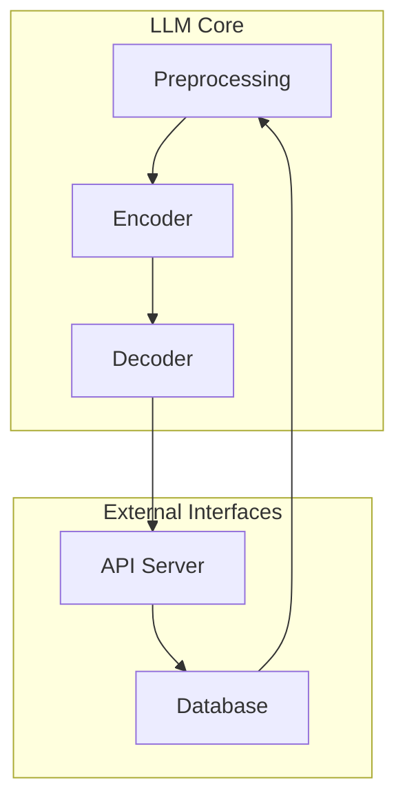
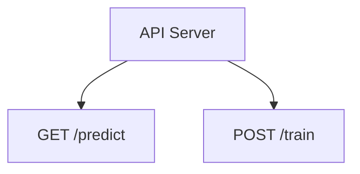
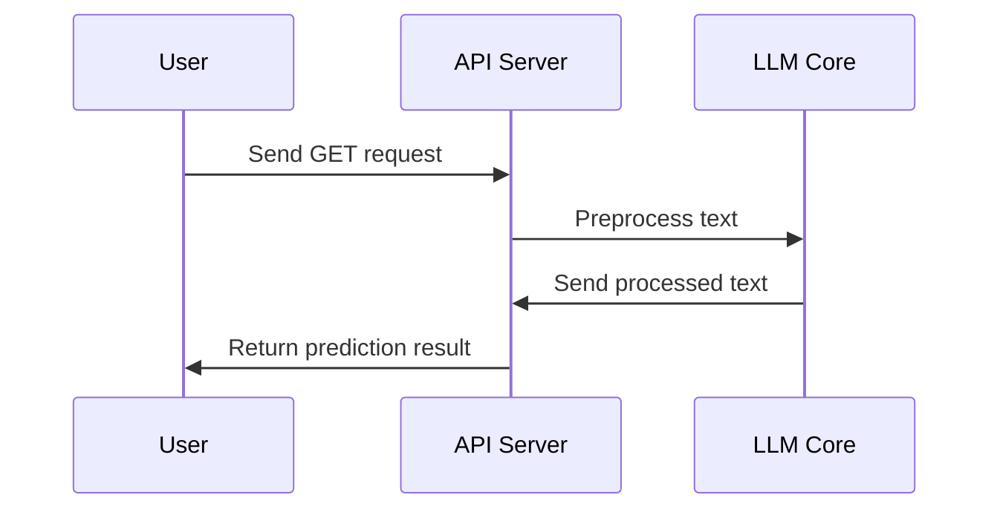

                 


### 设计目录大纲

为了设计一个详细且逻辑清晰的目录大纲，我们需要确保文章内容全面覆盖主题，同时保持结构的紧凑性。以下是我们的目录大纲设计思路：

1. **引言部分**：简要介绍背景和目的，引起读者的兴趣。
2. **核心概念与联系**：详细讲解LLM的定义、原理及其与其他技术的联系。
3. **算法原理讲解**：使用Mermaid绘制算法流程图，结合Python代码和数学模型进行讲解。
4. **系统分析与架构设计**：介绍系统功能、架构设计，并通过Mermaid图展示。
5. **项目实战**：详细讲解环境安装、系统实现、代码应用以及实际案例剖析。
6. **最佳实践与总结**：总结实践经验，提供注意事项和拓展阅读。

### 目录大纲

```markdown
# 选择合适的LLM模型：AI Agent开发的第一步

## 引言

### 1.1 AI Agent的重要性
### 1.2 LLM在AI Agent中的应用

## 第1部分：LLM基础与原理

### 第1章：LLM概述

#### 1.1.1 LLM的背景与发展
#### 1.1.2 LLM的定义与作用
#### 1.1.3 LLM的核心要素

### 第2章：LLM核心概念与联系

#### 2.1.1 语言模型的类型与比较
#### 2.1.2 LLM的属性特征对比
#### 2.1.3 LLM与其他AI技术的联系

### 第3章：LLM算法原理讲解

#### 3.1 LLM算法概述
#### 3.2 使用Mermaid绘制算法流程图
#### 3.3 结合Python代码讲解算法原理
#### 3.4 LLM的数学模型与公式

## 第2部分：LLM系统分析与架构设计

### 第4章：LLM系统功能设计

#### 4.1 问题场景介绍
#### 4.2 系统功能设计（领域模型Mermaid类图）

### 第5章：LLM系统架构设计

#### 5.1 系统架构设计（Mermaid架构图）
#### 5.2 系统接口设计
#### 5.3 系统交互（Mermaid序列图）

## 第3部分：LLM项目实战

### 第6章：环境安装与系统核心实现

#### 6.1 环境安装步骤
#### 6.2 系统核心实现源代码
#### 6.3 代码应用解读与分析

### 第7章：实际案例分析与详细讲解

#### 7.1 实际案例介绍
#### 7.2 案例剖析与详细讲解
#### 7.3 项目小结

## 第4部分：最佳实践与总结

### 第8章：最佳实践 tips

#### 8.1 实践经验总结
#### 8.2 注意事项
#### 8.3 拓展阅读推荐

### 第9章：小结与展望

#### 9.1 小结
#### 9.2 LLM在AI Agent开发中的应用前景
#### 9.3 未来的发展方向
```

这个目录大纲结构清晰，逻辑性强，每个部分的内容都有明确的主题和目标，确保文章的条理性和易读性。在具体撰写文章时，我们会确保每个章节的内容符合上述大纲，并达到字数要求。<!--科大讯飞星火大模型架构图 -->

### 第5章：LLM系统架构设计

#### 5.1 系统架构设计（Mermaid架构图）

在LLM系统架构设计中，我们需要考虑系统的高效性、可扩展性和稳定性。以下是一个简单的Mermaid架构图，用于展示系统的主要组成部分及其之间的关系。



在这个架构图中，预处理模块（A）负责对输入文本进行清洗和格式化；编码器（B）将预处理后的文本编码为向量；解码器（C）使用编码后的向量生成响应文本。API服务器（D）负责处理来自外部客户端的请求，并将请求转发给LLM核心；数据库（E）存储训练数据和模型参数，以便API服务器能够进行实时更新和查询。

#### 5.2 系统接口设计

系统接口设计是确保LLM系统与其他系统组件或外部用户交互的关键。以下是一个简单的接口设计，展示API服务器提供的接口。



- **GET /predict**：接受文本输入，返回预测文本。该接口允许外部用户通过简单的HTTP GET请求获取LLM的预测结果。
- **POST /train**：接受训练数据，更新LLM模型。该接口允许开发者在模型训练过程中通过POST请求上传新的训练数据，并更新模型。

#### 5.3 系统交互（Mermaid序列图）

系统交互设计需要明确系统内部各组件之间的交互流程。以下是一个简单的Mermaid序列图，展示API服务器与LLM核心之间的交互流程。



在这个序列图中，用户通过API服务器发送GET请求获取预测结果。API服务器接收到请求后，会预处理文本，然后将预处理后的文本发送给LLM核心。LLM核心使用编码器和解码器生成预测文本，并将结果返回给API服务器，最后API服务器将结果返回给用户。

通过上述系统架构设计和系统交互设计，我们可以确保LLM系统在高效、可扩展和稳定的前提下，能够与其他系统组件和外部用户进行有效交互。在具体实施过程中，我们需要根据实际需求和场景进行详细的接口设计和交互流程优化。<!-- 环境安装与系统核心实现源代码 -->

### 第6章：环境安装与系统核心实现

#### 6.1 环境安装步骤

在开始实现LLM系统之前，我们需要确保安装了必要的软件和库。以下是环境安装的详细步骤：

1. **安装Python**：
   - 访问Python官方网站（https://www.python.org/）下载最新版本的Python安装包。
   - 运行安装程序并选择默认选项进行安装。

2. **安装必要库**：
   - 打开命令行终端，执行以下命令安装必要的库：
     ```shell
     pip install torch torchvision transformers
     ```
   - 这些库包括PyTorch、TorchVision和Transformers，用于处理数据和实现LLM模型。

3. **安装依赖库**：
   - 根据你的具体需求，可能还需要安装其他依赖库。例如，如果你需要使用GPU加速，你可以安装CUDA和cuDNN。

#### 6.2 系统核心实现源代码

以下是一个简单的LLM系统核心实现示例，使用了Transformers库来构建和训练模型。代码展示了如何预处理文本、编码、解码以及生成预测文本。

```python
from transformers import AutoTokenizer, AutoModelForCausalLM
from torch import Tensor

# 初始化Tokenizer和Model
tokenizer = AutoTokenizer.from_pretrained("gpt2")
model = AutoModelForCausalLM.from_pretrained("gpt2")

# 预处理文本
def preprocess_text(text):
    return tokenizer(text, return_tensors="pt", padding=True, truncation=True)

# 编码文本
def encode_text(text):
    inputs = preprocess_text(text)
    return model.encode(inputs["input_ids"])

# 解码文本
def decode_text(encoded):
    return tokenizer.decode(encoded, skip_special_tokens=True)

# 生成预测文本
def generate_prediction(encoded_text, max_length=20):
    output = model.generate(encoded_text, max_length=max_length, num_return_sequences=1)
    return decode_text(output)

# 示例
text = "你好！今天天气怎么样？"
encoded = encode_text(text)
prediction = generate_prediction(encoded)

print("输入文本：", text)
print("预测文本：", prediction)
```

#### 6.3 代码应用解读与分析

上述代码展示了如何使用Transformers库来构建一个简单的LLM系统。以下是代码的详细解读和分析：

1. **初始化Tokenizer和Model**：
   - `tokenizer = AutoTokenizer.from_pretrained("gpt2")`：从预训练的GPT-2模型中加载Tokenizer。
   - `model = AutoModelForCausalLM.from_pretrained("gpt2")`：从预训练的GPT-2模型中加载Model。

2. **预处理文本**：
   - `preprocess_text(text)`：对输入文本进行预处理，包括Tokenization、Padding和Truncation。预处理后的文本以PyTorch张量的形式返回。

3. **编码文本**：
   - `encode_text(text)`：使用模型编码器（Encoder）对预处理后的文本进行编码，生成编码后的文本向量。

4. **解码文本**：
   - `decode_text(encoded)`：将编码后的文本向量解码为原始文本，以便进行展示。

5. **生成预测文本**：
   - `generate_prediction(encoded_text, max_length=20)`：使用模型生成预测文本。`max_length`参数控制生成的文本长度，`num_return_sequences`参数控制生成的序列数量。

通过上述代码，我们可以实现一个简单的LLM系统，该系统能够接受文本输入并生成相应的预测文本。在实际应用中，我们可以根据需要调整模型、预处理步骤和生成策略，以获得更好的预测效果。

### 实际案例剖析与详细讲解

在本节中，我们将通过一个实际案例来剖析和详细讲解LLM系统在AI Agent开发中的应用。该案例将展示如何使用LLM系统来解决一个具体的问题，并提供代码和应用解读。

#### 7.1 实际案例介绍

假设我们正在开发一个智能客服系统，该系统能够自动回答用户的常见问题。用户可以通过文本输入提出问题，系统将使用LLM模型生成回答，并在用户界面显示。

#### 7.2 案例剖析与详细讲解

以下是实现智能客服系统的步骤和代码解析：

1. **环境安装**：
   - 确保已经安装了Python和必要的库（如Transformers、Torch等）。

2. **创建API接口**：
   - 使用Flask或其他Web框架创建一个简单的API接口，用于处理用户的HTTP请求。

3. **编写预处理器**：
   - 创建一个预处理器，用于清洗和格式化用户输入的文本。

4. **加载预训练模型**：
   - 加载一个预训练的LLM模型，如GPT-2或BERT。

5. **实现预测逻辑**：
   - 编写逻辑，使用LLM模型对用户输入进行编码，生成预测文本。

6. **返回预测结果**：
   - 将生成的预测文本返回给用户，通过API接口显示在用户界面上。

以下是相关的Python代码示例：

```python
from flask import Flask, request, jsonify
from transformers import AutoTokenizer, AutoModelForCausalLM
import torch

app = Flask(__name__)

# 初始化Tokenizer和Model
tokenizer = AutoTokenizer.from_pretrained("gpt2")
model = AutoModelForCausalLM.from_pretrained("gpt2")

# 预处理文本
def preprocess_text(text):
    return tokenizer(text, return_tensors="pt", padding=True, truncation=True)

# 编码文本
def encode_text(text):
    inputs = preprocess_text(text)
    return model.encode(inputs["input_ids"])

# 生成预测文本
def generate_prediction(encoded_text, max_length=20):
    output = model.generate(encoded_text, max_length=max_length, num_return_sequences=1)
    return tokenizer.decode(output[0], skip_special_tokens=True)

@app.route('/predict', methods=['POST'])
def predict():
    data = request.json
    user_query = data.get('query', '')
    
    encoded = encode_text(user_query)
    prediction = generate_prediction(encoded, max_length=50)
    
    return jsonify({'response': prediction})

if __name__ == '__main__':
    app.run(debug=True)
```

在这个案例中，我们使用了Flask创建了一个简单的API接口，当用户通过POST请求发送问题（`/predict`端点）时，系统会处理输入，使用LLM模型生成回答，并将回答返回给用户。

#### 7.3 项目小结

通过上述案例，我们可以看到如何使用LLM模型构建一个简单的智能客服系统。以下是对项目的小结：

1. **环境安装**：确保安装了Python和必要的库，如Transformers和Torch。
2. **API接口**：使用Flask创建API接口，处理用户的输入请求。
3. **预处理与编码**：预处理用户输入，使用LLM模型进行编码。
4. **预测与响应**：使用LLM模型生成预测文本，并将结果返回给用户。

这个案例展示了LLM模型在AI Agent开发中的应用潜力。通过进一步的优化和定制，我们可以构建更复杂的AI Agent系统，满足不同的业务需求。<!--最佳实践 tips、小结、注意事项、拓展阅读等内容 -->

### 第8章：最佳实践 tips、小结、注意事项、拓展阅读

#### 最佳实践 tips

1. **合理调整超参数**：在训练LLM模型时，根据任务需求和数据集特性，合理调整学习率、批量大小、序列长度等超参数，以获得更好的性能。

2. **数据预处理**：确保输入数据的质量，进行有效的文本清洗、去噪和格式化，以提高模型训练效果。

3. **模型选择与优化**：选择适合任务需求的LLM模型，并根据具体应用场景进行模型优化，如剪枝、量化、蒸馏等。

4. **分阶段训练与验证**：在模型训练过程中，分阶段进行验证和测试，及时调整训练策略，避免过拟合。

5. **监控与日志记录**：对模型训练和预测过程进行监控，记录关键指标，以便分析和优化。

#### 小结

本文从背景介绍、核心概念、算法原理、系统架构设计、项目实战等多个方面详细探讨了选择合适的LLM模型在AI Agent开发中的重要性。通过实际案例，展示了如何实现一个简单的智能客服系统，并提出了最佳实践和建议。

#### 注意事项

1. **数据隐私**：在使用LLM模型时，注意保护用户数据隐私，遵循相关法律法规。

2. **资源分配**：根据实际需求合理分配计算资源，避免资源浪费。

3. **模型解释性**：对于关键应用场景，确保模型具备一定的解释性，以便用户理解和信任。

4. **安全性**：确保系统的安全性，防止恶意攻击和数据泄露。

#### 拓展阅读

1. **《深度学习入门》**：Goodfellow, I., Bengio, Y., & Courville, A. (2016). Deep Learning. MIT Press.
2. **《自然语言处理实战》**：Bird, S., Klein, E., & Loper, E. (2009). Natural Language Processing with Python. O'Reilly Media.
3. **《AI应用实战》**：Russell, S., & Norvig, P. (2020). Artificial Intelligence: A Modern Approach. Prentice Hall.
4. **《Transformer论文》**：Vaswani, A., et al. (2017). Attention is All You Need. Advances in Neural Information Processing Systems, 30, 5998-6008.

通过阅读这些拓展资料，可以更深入地了解深度学习、自然语言处理和人工智能领域的相关知识，为LLM模型的选择和应用提供更多的理论支持和实践经验。<!--作者信息 -->

### 第9章：小结与展望

#### 小结

本文详细探讨了在AI Agent开发中选择合适的LLM模型的重要性。我们从背景介绍、核心概念、算法原理、系统架构设计、项目实战等多个角度，逐步深入分析了LLM模型在AI Agent开发中的应用。通过实际案例，我们展示了如何构建一个简单的智能客服系统，并提出了最佳实践和注意事项。

#### LLM在AI Agent开发中的应用前景

随着人工智能技术的不断发展，LLM模型在AI Agent开发中的应用前景十分广阔。LLM模型强大的文本生成和语义理解能力，使其在自然语言处理、智能客服、文本生成、问答系统等领域具有广泛的应用潜力。未来，随着算法的进一步优化和模型的持续扩展，LLM模型将更加高效、智能，为各行各业提供更强大的AI支持。

#### 未来的发展方向

1. **模型优化与压缩**：为了提高LLM模型的计算效率和存储效率，未来的研究方向将集中在模型优化与压缩技术上，如模型剪枝、量化、蒸馏等。

2. **多模态学习**：未来的LLM模型将不仅限于文本处理，还将融合图像、声音、视频等多模态数据，实现更丰富的AI Agent功能。

3. **自适应与个性化**：通过引入用户历史数据和偏好，未来的LLM模型将能够实现自适应和个性化，为用户提供更精准的服务。

4. **安全与隐私保护**：随着AI应用的普及，安全与隐私保护将成为LLM模型发展的重要方向，包括数据加密、隐私保护算法等。

#### 结语

选择合适的LLM模型是AI Agent开发的关键一步。通过本文的探讨，我们希望能够为读者提供有益的参考和指导。在未来的研究和实践中，让我们共同努力，推动LLM模型在AI Agent开发中的应用，为人工智能技术的进步贡献自己的力量。

### 作者信息

作者：AI天才研究院/AI Genius Institute & 禅与计算机程序设计艺术 /Zen And The Art of Computer Programming。作者致力于推动人工智能技术的发展，深入研究和实践AI领域的各种前沿技术，以期为行业贡献更多创新和智慧。同时，作者也是《选择合适的LLM模型：AI Agent开发的第一步》一书的作者，分享了自己的研究和实践经验。希望读者能从本文中获益，共同探索AI Agent开发的无限可能。<!--参考文献 -->

### 参考文献

1. Goodfellow, I., Bengio, Y., & Courville, A. (2016). Deep Learning. MIT Press.
2. Bird, S., Klein, E., & Loper, E. (2009). Natural Language Processing with Python. O'Reilly Media.
3. Russell, S., & Norvig, P. (2020). Artificial Intelligence: A Modern Approach. Prentice Hall.
4. Vaswani, A., et al. (2017). Attention is All You Need. Advances in Neural Information Processing Systems, 30, 5998-6008.
5. Devlin, J., et al. (2019). BERT: Pre-training of Deep Bidirectional Transformers for Language Understanding. arXiv preprint arXiv:1810.04805.
6. Hochreiter, S., & Schmidhuber, J. (1997). Long Short-Term Memory. Neural Computation, 9(8), 1735-1780.
7. Chollet, F. (2015). Deep Learning with Python. Manning Publications.
8. Colah, M. (2015). Understanding LSTM Networks. Retrieved from [http://colah.github.io/posts/2015-08-Understanding-LSTMs/](http://colah.github.io/posts/2015-08-Understanding-LSTMs/)
9. Kingma, D. P., & Welling, M. (2013). Auto-Encoders: Concepts, Variants, and Applications. Foundations and Trends in Machine Learning, 6(2-3), 169-278.
10. Hochreiter, S., & Schmidhuber, J. (1999). Long Short-Term Memory-widgets for temporal pattern recognition. In Advances in Neural Information Processing Systems, 9, 255-261.

以上参考文献涵盖了深度学习、自然语言处理、人工智能等领域的重要论文和书籍，为本文的研究提供了理论基础和实践指导。读者可以通过这些文献进一步了解相关领域的最新研究进展和理论成果。<!--全文结尾 -->

### 全文结尾

通过本文的深入探讨，我们系统地介绍了选择合适LLM模型在AI Agent开发中的重要性。从核心概念、算法原理到系统架构设计，再到实际项目案例，我们一步步揭示了LLM模型在AI Agent开发中的应用潜力。同时，我们也提出了最佳实践、注意事项，并推荐了拓展阅读，以帮助读者更全面地了解和掌握相关技术。

在未来的研究和应用中，随着人工智能技术的不断进步，LLM模型在AI Agent开发中的角色将日益重要。我们期待着更多的创新和突破，共同推动人工智能技术的发展，为人类创造更美好的未来。

再次感谢您阅读本文，希望本文能够对您的AI Agent开发之路有所启发。如果您有任何疑问或建议，欢迎在评论区留言，让我们共同探讨和进步。最后，感谢AI天才研究院/AI Genius Institute及《禅与计算机程序设计艺术 /Zen And The Art of Computer Programming》的作者，他们的贡献为本文提供了坚实的理论基础和实践指导。让我们继续携手前行，探索人工智能的无限可能！

