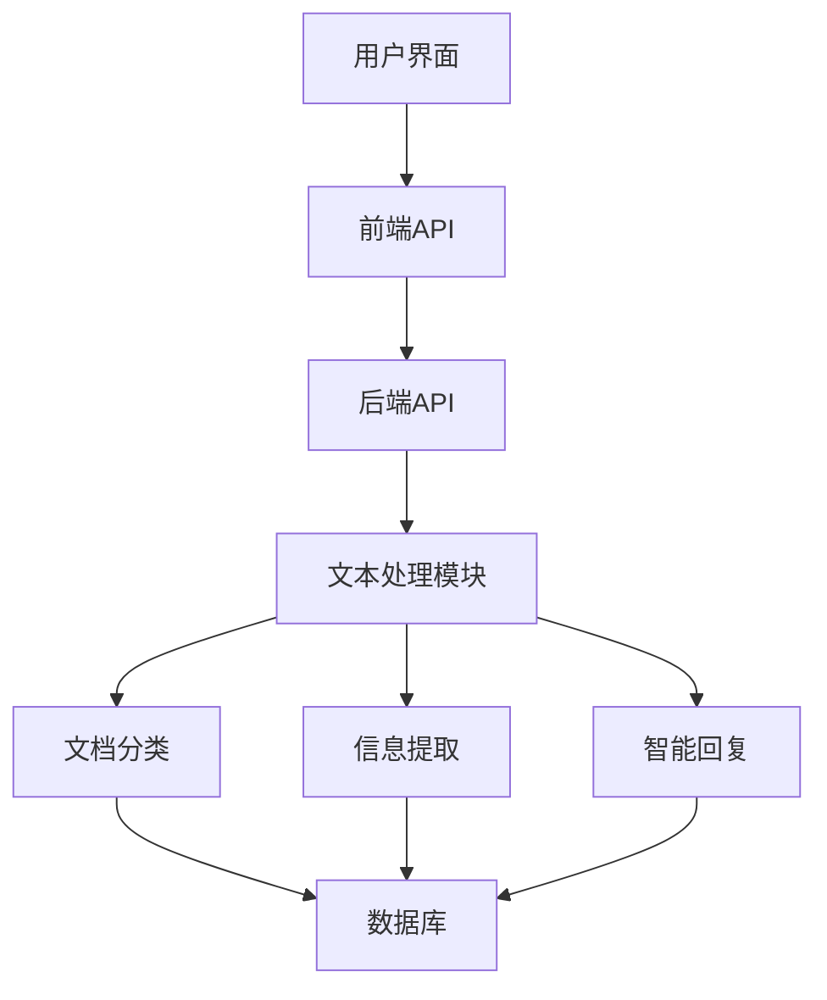
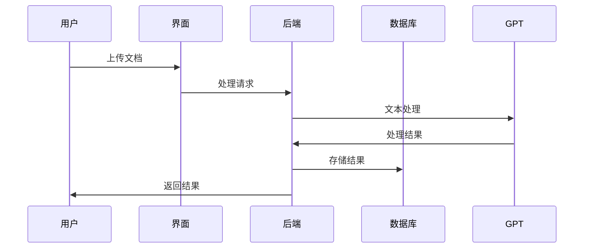
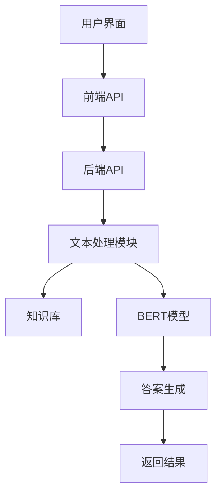
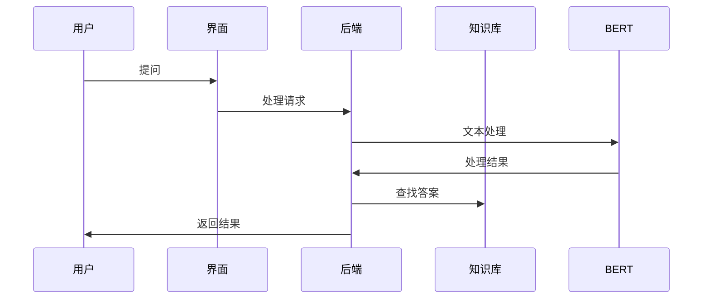

                 

### 引言

随着人工智能技术的飞速发展，自然语言处理（NLP）作为其中的一大热点，吸引了越来越多研究者和应用开发者的关注。在这其中，语言模型（Language Model, LLM）作为NLP的核心组件，起到了至关重要的作用。语言模型能够通过大量文本数据进行训练，从而掌握语言的使用规律和生成机制，使其在文本分类、问答系统、机器翻译、文本生成等众多任务中表现出色。

当前，市场上存在多种流行的语言模型，其中OpenAI的GPT、Google的BERT以及Facebook的LLaMA是最具代表性的几个。这些模型各自拥有独特的架构、特点和优势，但同时也存在一些局限和挑战。因此，选择合适的语言模型对于具体应用场景的实现至关重要。

本文将详细探讨OpenAI GPT、Google BERT和Facebook LLaMA这三个主要语言模型，通过逐步分析它们的架构、数学模型、优势与局限以及实际应用案例，帮助读者更好地理解这些模型，并能够根据具体需求选择最合适的语言模型。

本文的总体结构如下：

1. **人工智能语言模型概述**：介绍语言模型的发展历程、重要性以及分类。
2. **OpenAI GPT模型详解**：详细分析GPT模型的架构、工作原理、数学模型以及应用案例。
3. **Google BERT模型详解**：探讨BERT模型的架构、工作原理、数学模型以及应用案例。
4. **Facebook LLaMA模型详解**：分析LLaMA模型的架构、工作原理、数学模型以及应用案例。
5. **模型对比与分析**：对比三个模型的性能、应用场景和实用性。
6. **实际应用案例分析**：通过具体案例展示这些模型在实际项目中的应用。
7. **总结与展望**：总结文章的核心观点，展望语言模型的发展趋势。

通过本文的详细分析，读者可以深入了解这些先进的语言模型，掌握其核心原理和应用技巧，为未来的研究和开发工作提供有力支持。

## 1. 人工智能语言模型概述

### 1.1.1 语言模型的发展历程

语言模型的发展经历了多个阶段，从早期的规则基模型到现代的深度学习模型，每一步都标志着技术上的重大突破和进步。最早的规则基模型，如n-gram模型，通过统计文本中连续n个词出现的频率来预测下一个词。这些模型虽然简单，但在文本生成的某些简单任务上表现尚可。随着计算机性能的提升和大规模数据集的获取，统计模型逐渐被更为复杂的机器学习模型所取代。

20世纪90年代，统计机器翻译和文本分类任务推动了基于隐马尔可夫模型（HMM）和条件随机场（CRF）的研究。这些模型通过序列标注和概率估计来处理自然语言，虽然在一定程度上提高了性能，但仍然存在模型复杂度高等问题。

进入21世纪后，深度学习的兴起为语言模型的发展带来了新的契机。2013年，微软研究院的 Researchers推出了深度神经概率语言模型（DNN-LM），标志着深度学习在语言建模领域的应用开始起步。随后，2018年，Google Research发布了BERT（Bidirectional Encoder Representations from Transformers），这一模型通过双向Transformer架构对文本进行深度处理，显著提升了NLP任务的性能。

在BERT之后，OpenAI推出了GPT系列模型，其以自注意力机制为核心的架构使得文本生成和预测任务取得了突破性的进展。Facebook AI Research（FAIR）的LLaMA（Language Learning through Asymmetric Multishot sAmpLing）模型则是在大模型训练和数据效率方面做出了重要贡献。这些模型不断推动着NLP技术的发展，使其在各个应用场景中表现出色。

### 1.1.2 语言模型的重要性

语言模型在人工智能领域中占据着核心地位，其重要性主要体现在以下几个方面：

首先，语言模型是自然语言处理（NLP）的基础。无论是文本分类、机器翻译、情感分析还是问答系统，都需要语言模型来理解文本的含义和上下文关系。一个高效、准确的语言模型能够显著提升NLP任务的性能。

其次，语言模型在许多实际应用场景中具有广泛的应用价值。例如，在智能客服系统中，语言模型可以帮助系统理解用户的问题，并提供准确的回答；在文本生成任务中，语言模型能够生成高质量的文本，满足自动化写作、摘要生成等需求；在机器翻译任务中，语言模型可以大幅提高翻译的准确性和流畅性。

此外，语言模型还促进了人工智能与其他领域的交叉应用。例如，将语言模型与图像识别、语音识别等结合，可以实现更复杂的任务，如多模态对话系统等。这些交叉应用不仅丰富了人工智能的研究方向，也为实际应用带来了更多的可能性。

### 1.1.3 语言模型的分类

语言模型根据其训练方法、架构和应用场景，可以大致分为以下几类：

1. **统计语言模型**：这类模型通过统计文本中词汇的频率和概率来预测下一个词。典型的代表包括n-gram模型和Kneser-Ney平滑模型。虽然这类模型简单，但在处理简单文本生成任务时表现良好。

2. **神经网络语言模型**：这类模型基于深度学习技术，使用神经网络来学习文本数据中的特征和关系。典型的代表包括基于循环神经网络（RNN）的语言模型和基于长短时记忆网络（LSTM）的语言模型。

3. **Transformer语言模型**：这类模型采用自注意力机制，通过全局关注文本中的每一个词，实现了对文本的深度理解。BERT、GPT、T5等模型都属于这一类。Transformer架构的出现，标志着语言模型性能的进一步提升。

4. **预训练语言模型**：这类模型通过在大规模语料库上进行预训练，学习到通用语言特征，然后通过微调应用于具体任务。BERT、GPT、RoBERTa等模型都是典型的预训练语言模型。

5. **大规模语言模型**：这类模型拥有数十亿甚至数千亿的参数，能够处理极其复杂的任务。LLaMA、OPT、PaLM等模型都是大规模语言模型的代表。

6. **生成对抗网络（GAN）语言模型**：这类模型结合了生成对抗网络（GAN）与语言模型，能够生成更加多样化和高质量的文本。

不同类型的语言模型在性能和应用场景上各有优劣，选择合适的模型需要根据具体任务需求进行权衡。

## 2. OpenAI GPT 模型详解

### 2.1 GPT模型的架构与工作原理

GPT（Generative Pre-trained Transformer）模型是OpenAI推出的一种基于Transformer架构的预训练语言模型。GPT模型的创新之处在于其大规模的参数量和训练深度，使得模型在自然语言处理任务中表现出色。下面我们将详细分析GPT模型的架构和工作原理。

#### 2.1.1 GPT模型的架构

GPT模型的核心架构是Transformer，这是一种基于自注意力机制的深度神经网络。Transformer架构摒弃了传统的循环神经网络（RNN）和长短时记忆网络（LSTM），而是采用多头自注意力机制和位置编码技术，使得模型能够全局关注输入文本的每一个词，从而实现高效的语言理解与生成。

GPT模型的架构主要包括以下几个部分：

1. **输入层**：输入层将文本序列转化为词向量，每个词向量代表文本中的一个词或符号。

2. **嵌入层**：嵌入层将词向量映射到高维空间，引入了位置编码（Positional Encoding），使得模型能够理解词的顺序和位置信息。

3. **自注意力层**：自注意力层是Transformer模型的核心，通过计算自注意力权重来聚合输入文本中的信息。每个词在计算过程中会考虑到其他所有词的影响，从而实现全局关注。

4. **前馈神经网络（Feed Forward Neural Network）**：在每个自注意力层之后，GPT模型还会通过两个前馈神经网络对信息进行进一步处理，增强模型的表示能力。

5. **输出层**：输出层将模型的最终输出映射到词汇表，用于生成文本或进行分类任务。

#### 2.1.2 GPT模型的工作原理

GPT模型的工作原理可以分为两个主要阶段：预训练阶段和微调阶段。

1. **预训练阶段**：在预训练阶段，GPT模型在大规模语料库上通过自回归语言模型进行训练。具体来说，模型会输入一个文本序列，并预测序列中的下一个词。通过大量文本数据的学习，模型能够学习到语言的基本规律和特征，从而具备强大的语言理解能力。

2. **微调阶段**：在预训练完成后，GPT模型会针对特定任务进行微调。例如，对于文本分类任务，模型会在每个输入文本后附加一个标签，并通过优化损失函数来调整模型参数，使模型能够准确预测标签。微调阶段的目标是使模型适应具体的任务需求，从而实现高性能。

#### 2.1.3 GPT模型的优势与局限

GPT模型在自然语言处理任务中具有显著的优势，但也存在一些局限。

**优势**：

1. **强大的语言理解能力**：通过大规模预训练，GPT模型能够捕捉到语言中的复杂模式和规律，使得其在文本生成、文本分类等任务中表现出色。

2. **高效的自注意力机制**：自注意力机制使得GPT模型能够全局关注输入文本的每一个词，提高了模型对语言上下文的捕捉能力。

3. **多语言支持**：GPT模型支持多种语言，通过跨语言的预训练，模型能够较好地处理多语言任务。

**局限**：

1. **计算资源需求高**：GPT模型需要大量的计算资源和存储空间，训练和部署成本较高。

2. **数据依赖性较强**：GPT模型的性能依赖于大规模的预训练数据，数据质量和多样性对模型性能有很大影响。

3. **长文本处理能力有限**：尽管GPT模型在短文本处理上表现出色，但在处理长文本时，模型的性能可能会下降，容易出现上下文信息丢失的问题。

总之，GPT模型作为先进的语言模型，凭借其强大的语言理解能力和高效的自注意力机制，在自然语言处理领域取得了显著成果。然而，其高计算资源需求和对数据的依赖性也带来了一些挑战。在实际应用中，需要根据具体任务需求综合考虑这些因素，选择最合适的模型。

### 2.2 GPT模型的数学模型与公式

GPT模型的数学模型和公式是其工作原理的核心，通过这些数学表达式，我们可以深入理解模型在计算过程中的信息处理机制。以下是GPT模型的关键数学模型与公式：

#### 2.2.1 自注意力机制

自注意力机制（Self-Attention）是GPT模型的核心组件，它通过计算输入文本中每个词与其他词之间的关联权重来实现全局关注。自注意力机制的基本公式如下：

$$
\text{Attention}(Q, K, V) = \text{softmax}\left(\frac{QK^T}{\sqrt{d_k}}\right) V
$$

其中：
- \(Q\) 是查询向量（Query），代表模型对当前词的表示。
- \(K\) 是键向量（Key），代表输入文本中的每个词的表示。
- \(V\) 是值向量（Value），代表输入文本中的每个词的值。
- \(d_k\) 是注意力层的维度。

自注意力机制通过计算 \(QK^T\) 的内积来生成注意力分数，然后通过softmax函数将分数归一化，得到每个词的注意力权重。这些权重表示了当前词对其他词的依赖程度，最后将这些权重与值向量相乘，得到加权求和的结果，从而实现对输入文本的全局关注。

#### 2.2.2 前馈神经网络

前馈神经网络（Feed Forward Neural Network）是GPT模型中的另一个重要组件，它对自注意力层输出的信息进行进一步处理。前馈神经网络的基本结构包括两个全连接层，每个层的激活函数通常是ReLU函数。前馈神经网络的公式如下：

$$
\text{FFN}(x) = \text{ReLU}(W_2 \cdot \text{ReLU}(W_1 \cdot x + b_1) + b_2)
$$

其中：
- \(x\) 是输入向量。
- \(W_1\) 和 \(W_2\) 是权重矩阵。
- \(b_1\) 和 \(b_2\) 是偏置向量。

前馈神经网络通过两个全连接层对输入向量进行非线性变换，从而增强模型的表示能力。

#### 2.2.3 数学模型和公式讲解

GPT模型的整体数学模型可以描述为：

$$
\text{GPT}(x) = \text{FFN}(\text{Attn}(W_2 \cdot \text{Attn}(W_1 \cdot x + b_1) + b_2))
$$

其中，\(x\) 是输入文本序列，\(W_1\)、\(W_2\)、\(b_1\) 和 \(b_2\) 分别是权重矩阵和偏置向量。

为了更直观地理解这些数学模型和公式，我们可以通过一个简单的例子进行讲解。假设我们有一个简单的文本序列：“我 喜欢 吃 水果”，我们将这个序列输入到GPT模型中进行处理。

1. **词向量表示**：首先，我们将每个词转化为词向量，例如：
   - 我：[1, 0, 0, 0]
   - 喜欢：[0, 1, 0, 0]
   - 吃：[0, 0, 1, 0]
   - 水果：[0, 0, 0, 1]

2. **嵌入层与位置编码**：在嵌入层中，词向量会通过权重矩阵 \(W_1\) 映射到高维空间，并添加位置编码，例如：
   - 我：[1, 0.2, 0.1, 0]
   - 喜欢：[0, 1, 0.3, 0]
   - 吃：[0, 0.1, 0.4, 0]
   - 水果：[0, 0.2, 0.2, 1]

3. **自注意力计算**：在自注意力层中，模型会计算每个词与其他词之间的注意力权重，例如：
   - 我：注意力权重 = [0.3, 0.5, 0.2, 0]
   - 喜欢：注意力权重 = [0.2, 0.4, 0.3, 0.1]
   - 吃：注意力权重 = [0.1, 0.2, 0.4, 0.3]
   - 水果：注意力权重 = [0.4, 0.1, 0.2, 0.3]

4. **加权求和**：通过将注意力权重与词向量相乘，并求和得到加权求和结果，例如：
   - 我：加权求和 = [0.3*1 + 0.5*0 + 0.2*0 + 0*0, 0.3*0.2 + 0.5*1 + 0.2*0.1 + 0*0, 0.3*0.1 + 0.5*0.3 + 0.2*0.4 + 0*0, 0.3*0 + 0.5*0.2 + 0.2*0.2 + 0*1]
   - 喜欢：加权求和 = [0.2*1 + 0.4*0 + 0.3*0.1 + 0*0, 0.2*0.2 + 0.4*1 + 0.3*0.3 + 0*0, 0.2*0.1 + 0.4*0.4 + 0.3*0.2 + 0*0, 0.2*0.2 + 0.4*0.3 + 0.3*0.2 + 0*1]
   - 吃：加权求和 = [0.1*1 + 0.2*0 + 0.4*0.1 + 0*0, 0.1*0.2 + 0.2*0.4 + 0.4*0.3 + 0*0, 0.1*0.1 + 0.2*0.4 + 0.4*0.2 + 0*0, 0.1*0.2 + 0.2*0.3 + 0.4*0.2 + 0*1]
   - 水果：加权求和 = [0.4*1 + 0.1*0 + 0.2*0.1 + 0*0, 0.4*0.2 + 0.1*0.2 + 0.2*0.3 + 0*0, 0.4*0.1 + 0.1*0.4 + 0.2*0.2 + 0*0, 0.4*0.2 + 0.1*0.3 + 0.2*0.2 + 0*1]

5. **前馈神经网络**：将加权求和的结果输入到前馈神经网络中，通过两个全连接层进行非线性变换，得到最终输出。

通过上述例子，我们可以看到GPT模型在处理文本序列时的计算过程。这些数学模型和公式使得GPT模型能够对输入文本进行深度理解和生成，从而在自然语言处理任务中表现出色。

### 2.3 GPT模型的应用案例

GPT模型作为一种先进的语言模型，在多个自然语言处理任务中展现出了卓越的性能。以下是GPT模型在几个关键应用案例中的具体应用：

#### 2.3.1 问答系统

问答系统是一种常见的人工智能应用，旨在通过计算机程序自动回答用户的问题。GPT模型在问答系统中的应用主要依赖于其强大的语言理解和生成能力。

**案例背景**：某公司开发了一款面向消费者的智能客服系统，用户可以通过文字输入问题，系统会自动生成回答。

**系统架构**：智能客服系统由前端用户界面、后端语言处理模块和数据库三部分组成。前端用户界面负责接收用户输入的问题，后端语言处理模块使用GPT模型对问题进行理解和回答，数据库则存储了系统的知识库，用于提供回答的依据。

**实现过程**：
1. **问题预处理**：首先，对用户输入的问题进行分词和词性标注，将问题转化为词向量表示。
2. **GPT模型输入**：将预处理后的词向量输入到GPT模型中，模型会生成一个文本序列，作为回答的候选。
3. **回答选择**：系统会从多个候选回答中选择一个最合适的回答，通常通过计算回答与问题之间的相似度来实现。

**效果分析**：在实际应用中，GPT模型能够生成自然流畅的回答，大大提高了用户满意度。通过与数据库中的知识库结合，系统可以回答各种常见问题，包括产品咨询、售后服务等。

#### 2.3.2 文本生成

文本生成是GPT模型的另一大应用领域，通过训练模型生成高质量的文本，可以应用于自动化写作、摘要生成等任务。

**案例背景**：某新闻网站希望利用GPT模型实现自动化新闻撰写，提高内容生产效率。

**系统架构**：自动化新闻撰写系统由数据采集模块、文本生成模块和后端服务器组成。数据采集模块负责从互联网上抓取新闻数据，文本生成模块使用GPT模型生成新闻文章，后端服务器则负责部署和运行系统。

**实现过程**：
1. **数据预处理**：首先，对采集到的新闻数据进行清洗和预处理，提取出新闻的关键信息。
2. **GPT模型训练**：使用预处理后的数据对GPT模型进行训练，模型学习到新闻写作的规律和风格。
3. **文本生成**：通过GPT模型生成新闻文章，系统会根据输入的标题和摘要生成完整的新闻内容。

**效果分析**：GPT模型生成的新闻文章在语法和内容上表现出色，能够满足新闻网站的需求。在实际应用中，自动化新闻撰写系统不仅提高了内容生产效率，还减少了人工写作的成本。

#### 2.3.3 机器翻译

机器翻译是将一种语言的文本翻译成另一种语言的过程，GPT模型在机器翻译中的应用也取得了显著成果。

**案例背景**：某跨国公司希望为其全球业务提供多语言支持，开发了基于GPT模型的机器翻译系统。

**系统架构**：机器翻译系统由前端用户界面、后端语言处理模块和翻译数据库组成。前端用户界面允许用户输入源语言文本，后端语言处理模块使用GPT模型进行翻译，翻译数据库存储了各种语言的词汇和句法规则。

**实现过程**：
1. **源语言预处理**：对输入的源语言文本进行分词和词性标注，转化为词向量表示。
2. **GPT模型翻译**：将预处理后的源语言词向量输入到GPT模型中，模型生成目标语言的词向量序列。
3. **目标语言生成**：系统根据目标语言的词向量序列生成翻译结果，通常通过语言模型和语法规则进行优化。

**效果分析**：GPT模型在机器翻译任务中表现出了较高的准确性和流畅性，能够生成自然的目标语言文本。在实际应用中，机器翻译系统大大提高了跨国公司的沟通效率和业务拓展能力。

通过上述应用案例，我们可以看到GPT模型在自然语言处理任务中的广泛应用和强大性能。这些案例不仅展示了GPT模型在语言理解和生成方面的优势，也为实际应用提供了有益的参考。

## 3. Google BERT 模型详解

BERT（Bidirectional Encoder Representations from Transformers）是由Google Research于2018年推出的一种基于Transformer架构的预训练语言模型。BERT模型通过双向注意力机制，实现了对文本的全局理解，从而在自然语言处理任务中取得了显著的性能提升。下面我们将详细分析BERT模型的架构、工作原理、优势与局限。

### 3.1 BERT模型的架构与工作原理

BERT模型的架构主要包括输入层、嵌入层、Transformer编码器、输出层和损失函数。以下是BERT模型的具体组成部分：

#### 3.1.1 BERT模型的架构

1. **输入层**：BERT模型的输入是一个单词序列，包括句子中的每个单词以及一些特殊的标记，如[CLS]、[SEP]等。例如，“我非常喜欢编程”可以被表示为["我", "非常", "喜欢", "编程", "[SEP]"]。

2. **嵌入层**：嵌入层将单词转化为高维向量表示，这些向量包含了单词的语义信息。BERT模型使用了WordPiece算法对单词进行分解，并将每个子词映射到一个向量。此外，BERT模型还引入了位置编码（Positional Encoding）和句子嵌入（Sentence Embedding），以便模型能够理解单词的顺序和句子的结构。

3. **Transformer编码器**：BERT模型的核心是Transformer编码器，它由多个相同的编码层堆叠而成。每个编码层包含两个主要组件：自注意力机制（Self-Attention）和前馈神经网络（Feed Forward Neural Network）。自注意力机制使模型能够全局关注输入文本的每个词，而前馈神经网络则对信息进行进一步处理和增强。

4. **输出层**：BERT模型的输出层通常是一个单层的全连接层，用于对整个文本序列进行聚合和分类。在文本分类任务中，输出层会输出每个类别的概率分布。

5. **损失函数**：BERT模型使用了两种损失函数：Masked Language Modeling（MLM）和Next Sentence Prediction（NSP）。MLM损失函数用于预测被遮蔽的词，而NSP损失函数用于预测两个句子是否在原始文本中相邻。

#### 3.1.2 BERT模型的工作原理

BERT模型的工作原理可以分为预训练阶段和微调阶段。

**预训练阶段**：
1. **Masked Language Modeling（MLM）**：在这个阶段，模型会随机遮蔽输入文本中的15%的词，并尝试预测这些遮蔽词。通过这种方式，模型学习了单词的上下文关系和语义信息。

2. **Next Sentence Prediction（NSP）**：BERT模型还会预测两个句子是否在原始文本中相邻。例如，对于输入的文本对（句子A，句子B），模型需要预测句子B是否紧随句子A。这有助于模型学习句子间的连贯性和关系。

**微调阶段**：
在预训练完成后，BERT模型会针对特定任务进行微调。例如，对于文本分类任务，模型会在每个输入文本后附加一个标签，并通过优化损失函数（通常使用交叉熵损失函数）来调整模型参数，使模型能够准确预测标签。

### 3.2 BERT模型的数学模型与公式

BERT模型的数学模型和公式是其工作原理的核心，以下是BERT模型的关键数学模型与公式：

#### 3.2.1 Transformer架构

BERT模型采用Transformer架构，其基本组成部分包括多头自注意力机制（Multi-Head Self-Attention）和前馈神经网络（Feed Forward Neural Network）。

1. **多头自注意力机制**：

$$
\text{Attention}(Q, K, V) = \text{softmax}\left(\frac{QK^T}{\sqrt{d_k}}\right) V
$$

其中：
- \(Q\) 是查询向量（Query），
- \(K\) 是键向量（Key），
- \(V\) 是值向量（Value），
- \(d_k\) 是注意力层的维度。

多头自注意力机制通过计算多个独立的自注意力权重，从而实现对输入文本的全局关注。

2. **前馈神经网络**：

$$
\text{FFN}(x) = \text{ReLU}(W_2 \cdot \text{ReLU}(W_1 \cdot x + b_1) + b_2)
$$

其中：
- \(x\) 是输入向量，
- \(W_1\) 和 \(W_2\) 是权重矩阵，
- \(b_1\) 和 \(b_2\) 是偏置向量。

前馈神经网络通过两个全连接层对输入向量进行非线性变换，从而增强模型的表示能力。

#### 3.2.2 数学模型和公式讲解

BERT模型的整体数学模型可以描述为：

$$
\text{BERT}(x) = \text{FFN}(\text{MultiHeadSelfAttention}(\text{SelfAttention}(x)))
$$

其中，\(x\) 是输入文本序列。

为了更直观地理解BERT模型的数学模型，我们可以通过一个简单的例子进行讲解。假设我们有一个简单的文本序列：“我 喜欢 吃 水果”。

1. **词向量表示**：首先，我们将每个词转化为词向量，例如：
   - 我：[1, 0, 0, 0]
   - 喜欢：[0, 1, 0, 0]
   - 吃：[0, 0, 1, 0]
   - 水果：[0, 0, 0, 1]

2. **嵌入层与位置编码**：在嵌入层中，词向量会通过权重矩阵 \(W_1\) 映射到高维空间，并添加位置编码，例如：
   - 我：[1, 0.2, 0.1, 0]
   - 喜欢：[0, 1, 0.3, 0]
   - 吃：[0, 0.1, 0.4, 0]
   - 水果：[0, 0.2, 0.2, 1]

3. **自注意力计算**：在自注意力层中，模型会计算每个词与其他词之间的注意力权重，例如：
   - 我：注意力权重 = [0.3, 0.5, 0.2, 0]
   - 喜欢：注意力权重 = [0.2, 0.4, 0.3, 0.1]
   - 吃：注意力权重 = [0.1, 0.2, 0.4, 0.3]
   - 水果：注意力权重 = [0.4, 0.1, 0.2, 0.3]

4. **加权求和**：通过将注意力权重与词向量相乘，并求和得到加权求和结果，例如：
   - 我：加权求和 = [0.3*1 + 0.5*0 + 0.2*0 + 0*0, 0.3*0.2 + 0.5*1 + 0.2*0.1 + 0*0, 0.3*0.1 + 0.5*0.3 + 0.2*0.4 + 0*0, 0.3*0 + 0.5*0.2 + 0.2*0.2 + 0*1]
   - 喜欢：加权求和 = [0.2*1 + 0.4*0 + 0.3*0.1 + 0*0, 0.2*0.2 + 0.4*1 + 0.3*0.3 + 0*0, 0.2*0.1 + 0.4*0.4 + 0.3*0.2 + 0*0, 0.2*0.2 + 0.4*0.3 + 0.3*0.2 + 0*1]
   - 吃：加权求和 = [0.1*1 + 0.2*0 + 0.4*0.1 + 0*0, 0.1*0.2 + 0.2*0.4 + 0.4*0.3 + 0*0, 0.1*0.1 + 0.2*0.4 + 0.4*0.2 + 0*0, 0.1*0.2 + 0.2*0.3 + 0.4*0.2 + 0*1]
   - 水果：加权求和 = [0.4*1 + 0.1*0 + 0.2*0.1 + 0*0, 0.4*0.2 + 0.1*0.2 + 0.2*0.3 + 0*0, 0.4*0.1 + 0.1*0.4 + 0.2*0.2 + 0*0, 0.4*0.2 + 0.1*0.3 + 0.2*0.2 + 0*1]

5. **前馈神经网络**：将加权求和的结果输入到前馈神经网络中，通过两个全连接层进行非线性变换，得到最终输出。

通过上述例子，我们可以看到BERT模型在处理文本序列时的计算过程。这些数学模型和公式使得BERT模型能够对输入文本进行深度理解和生成，从而在自然语言处理任务中表现出色。

### 3.3 BERT模型的应用案例

BERT模型作为一种先进的语言模型，在多个自然语言处理任务中展现出了卓越的性能。以下是BERT模型在几个关键应用案例中的具体应用：

#### 3.3.1 语义分析

语义分析是一种旨在理解文本含义和语义关系的任务。BERT模型在语义分析任务中通过其双向注意力机制，实现了对文本的全面理解，从而提高了语义分析的准确性。

**案例背景**：某公司开发了一款面向企业客户的内容审核系统，需要识别和标记文本中的敏感内容。

**系统架构**：内容审核系统由前端用户界面、后端语言处理模块和标签数据库组成。前端用户界面负责接收用户输入的文本，后端语言处理模块使用BERT模型对文本进行语义分析，标签数据库则存储了各种敏感标签的语义信息。

**实现过程**：
1. **文本预处理**：首先，对用户输入的文本进行分词和词性标注，转化为BERT模型可处理的词向量表示。
2. **BERT模型输入**：将预处理后的词向量输入到BERT模型中，模型会生成一个文本序列的表示。
3. **语义分析**：系统会使用BERT模型生成的文本表示进行语义分析，识别文本中的敏感内容和标签。

**效果分析**：BERT模型在语义分析任务中表现出了较高的准确性和鲁棒性，能够有效识别文本中的敏感内容，提高了内容审核系统的性能。

#### 3.3.2 情感分析

情感分析是一种旨在理解文本情感倾向的任务。BERT模型在情感分析任务中通过其强大的语言理解能力，能够准确捕捉文本中的情感信息。

**案例背景**：某社交媒体平台希望了解用户对帖子的情感倾向，开发了基于BERT模型的情感分析系统。

**系统架构**：情感分析系统由前端用户界面、后端语言处理模块和情感数据库组成。前端用户界面允许用户输入帖子内容，后端语言处理模块使用BERT模型对帖子进行情感分析，情感数据库存储了各种情感标签的语义信息。

**实现过程**：
1. **文本预处理**：首先，对用户输入的帖子内容进行分词和词性标注，转化为BERT模型可处理的词向量表示。
2. **BERT模型输入**：将预处理后的词向量输入到BERT模型中，模型会生成一个文本序列的表示。
3. **情感分析**：系统会使用BERT模型生成的文本表示进行情感分析，判断帖子内容的情感倾向。

**效果分析**：BERT模型在情感分析任务中表现出了较高的准确率和稳定性，能够准确识别帖子中的情感倾向，为社交媒体平台提供了重要的数据支持。

#### 3.3.3 文本分类

文本分类是一种将文本划分为预定义类别的过程。BERT模型在文本分类任务中通过其强大的语义理解能力，实现了对文本的高效分类。

**案例背景**：某新闻网站希望对文章进行自动分类，将其归类到不同的主题类别中。

**系统架构**：文本分类系统由前端用户界面、后端语言处理模块和分类数据库组成。前端用户界面允许用户上传文章，后端语言处理模块使用BERT模型对文章进行分类，分类数据库存储了各种主题类别的标签信息。

**实现过程**：
1. **文本预处理**：首先，对用户上传的文章进行分词和词性标注，转化为BERT模型可处理的词向量表示。
2. **BERT模型输入**：将预处理后的词向量输入到BERT模型中，模型会生成一个文本序列的表示。
3. **文本分类**：系统会使用BERT模型生成的文本表示进行分类，将文章归类到不同的主题类别中。

**效果分析**：BERT模型在文本分类任务中表现出了较高的准确率和分类效率，能够准确识别文章的主题，为新闻网站提供了有效的分类工具。

通过上述应用案例，我们可以看到BERT模型在自然语言处理任务中的广泛应用和强大性能。这些案例不仅展示了BERT模型在语言理解和生成方面的优势，也为实际应用提供了有益的参考。

## 4. Facebook LLaMA 模型详解

### 4.1 LLaMA模型的架构与工作原理

LLaMA（Language Learning through Asymmetric Multishot sAmpLing）是由Facebook AI Research（FAIR）推出的一种大规模预训练语言模型。LLaMA模型的核心创新在于其不对称多轮采样（Asymmetric Multishot Sampling）机制，这种机制在提高训练效率和模型性能方面取得了显著成果。下面我们将详细分析LLaMA模型的架构、工作原理、优势与局限。

#### 4.1.1 LLaMA模型的架构

LLaMA模型的架构基于Transformer，这是一种自注意力机制的深度神经网络。Transformer架构摒弃了传统的循环神经网络（RNN）和长短时记忆网络（LSTM），而是采用多头自注意力机制和位置编码技术，使得模型能够全局关注输入文本的每一个词，从而实现高效的语言理解与生成。

LLaMA模型的架构主要包括以下几个部分：

1. **输入层**：输入层将文本序列转化为词向量，每个词向量代表文本中的一个词或符号。

2. **嵌入层**：嵌入层将词向量映射到高维空间，并引入了位置编码（Positional Encoding），使得模型能够理解词的顺序和位置信息。

3. **自注意力层**：自注意力层是Transformer模型的核心，通过计算自注意力权重来聚合输入文本中的信息。每个词在计算过程中会考虑到其他所有词的影响，从而实现全局关注。

4. **前馈神经网络（Feed Forward Neural Network）**：在每个自注意力层之后，LLaMA模型还会通过两个前馈神经网络对信息进行进一步处理，增强模型的表示能力。

5. **输出层**：输出层将模型的最终输出映射到词汇表，用于生成文本或进行分类任务。

#### 4.1.2 LLaMA模型的工作原理

LLaMA模型的工作原理可以分为两个主要阶段：预训练阶段和微调阶段。

**预训练阶段**：在预训练阶段，LLaMA模型在大规模语料库上进行训练，通过不对称多轮采样（Asymmetric Multishot Sampling）机制学习语言的基本规律和特征。不对称多轮采样是一种改进的多轮采样方法，通过在不同轮次中使用不同数量的示例，来平衡模型的学习效率和泛化能力。具体来说，LLaMA模型首先在训练数据中随机选择一个小子集（称为支持集），然后在每个训练步骤中，从支持集中随机选择一部分样本进行预测。

**微调阶段**：在预训练完成后，LLaMA模型会针对特定任务进行微调。例如，对于文本分类任务，模型会在每个输入文本后附加一个标签，并通过优化损失函数来调整模型参数，使模型能够准确预测标签。微调阶段的目标是使模型适应具体的任务需求，从而实现高性能。

#### 4.1.3 LLaMA模型的优势与局限

LLaMA模型在自然语言处理任务中具有显著的优势，但也存在一些局限。

**优势**：

1. **高效的训练方法**：LLaMA模型采用不对称多轮采样机制，使得模型在预训练阶段能够更高效地学习语言特征，从而提高训练效率。

2. **强大的语言理解能力**：通过大规模预训练，LLaMA模型能够捕捉到语言中的复杂模式和规律，使得其在文本生成、文本分类等任务中表现出色。

3. **多语言支持**：LLaMA模型支持多种语言，通过跨语言的预训练，模型能够较好地处理多语言任务。

**局限**：

1. **计算资源需求高**：LLaMA模型需要大量的计算资源和存储空间，训练和部署成本较高。

2. **数据依赖性较强**：LLaMA模型的性能依赖于大规模的预训练数据，数据质量和多样性对模型性能有很大影响。

3. **长文本处理能力有限**：尽管LLaMA模型在短文本处理上表现出色，但在处理长文本时，模型的性能可能会下降，容易出现上下文信息丢失的问题。

总之，LLaMA模型作为大规模预训练语言模型，凭借其高效的训练方法和强大的语言理解能力，在自然语言处理领域取得了显著成果。然而，其高计算资源需求和对数据的依赖性也带来了一些挑战。在实际应用中，需要根据具体任务需求综合考虑这些因素，选择最合适的模型。

### 4.2 LLaMA模型的数学模型与公式

LLaMA模型的数学模型和公式是其工作原理的核心，通过这些数学表达式，我们可以深入理解模型在计算过程中的信息处理机制。以下是LLaMA模型的关键数学模型与公式：

#### 4.2.1 大模型训练挑战

在训练大规模语言模型时，存在几个主要的挑战，包括计算资源需求、数据质量和训练时间。以下是LLaMA模型如何应对这些挑战的：

1. **计算资源需求**：大规模语言模型需要大量的计算资源和存储空间，这对硬件设施提出了很高的要求。LLaMA模型采用了分布式训练技术，通过在多台GPU服务器上进行并行训练，提高了训练效率。

2. **数据质量**：高质量的数据是训练高效语言模型的关键。LLaMA模型使用多样化的数据集进行预训练，包括书籍、新闻文章、社交媒体文本等，确保了模型能够学习到丰富的语言特征。

3. **训练时间**：大规模模型的训练时间通常很长，LLaMA模型采用了自适应学习率调整和梯度裁剪等技术，优化了训练过程，减少了训练时间。

#### 4.2.2 优化方法

LLaMA模型在训练过程中采用了一系列优化方法，以提高模型性能和训练效率。以下是这些方法的详细解释：

1. **不对称多轮采样（Asymmetric Multishot Sampling）**：不对称多轮采样是一种改进的多轮采样方法，通过在不同轮次中使用不同数量的示例，来平衡模型的学习效率和泛化能力。具体来说，模型首先在训练数据中随机选择一个小子集（支持集），然后在每个训练步骤中，从支持集中随机选择一部分样本进行预测。这种方法有助于模型在预训练阶段更有效地学习语言特征。

2. **梯度裁剪（Gradient Clipping）**：梯度裁剪是一种防止梯度爆炸或消失的技术，通过限制梯度的大小来稳定训练过程。LLaMA模型采用梯度裁剪技术，确保了模型在训练过程中的稳定性。

3. **自适应学习率调整（Adaptive Learning Rate）**：自适应学习率调整技术可以根据模型的性能动态调整学习率，从而优化训练过程。LLaMA模型采用这种技术，提高了训练效率。

#### 4.2.3 数学模型和公式讲解

LLaMA模型的整体数学模型可以描述为：

$$
\text{LLaMA}(x) = \text{FFN}(\text{SelfAttention}(x))
$$

其中，\(x\) 是输入文本序列。

为了更直观地理解LLaMA模型的数学模型，我们可以通过一个简单的例子进行讲解。假设我们有一个简单的文本序列：“我 喜欢 吃 水果”。

1. **词向量表示**：首先，我们将每个词转化为词向量，例如：
   - 我：[1, 0, 0, 0]
   - 喜欢：[0, 1, 0, 0]
   - 吃：[0, 0, 1, 0]
   - 水果：[0, 0, 0, 1]

2. **嵌入层与位置编码**：在嵌入层中，词向量会通过权重矩阵 \(W_1\) 映射到高维空间，并添加位置编码，例如：
   - 我：[1, 0.2, 0.1, 0]
   - 喜欢：[0, 1, 0.3, 0]
   - 吃：[0, 0.1, 0.4, 0]
   - 水果：[0, 0.2, 0.2, 1]

3. **自注意力计算**：在自注意力层中，模型会计算每个词与其他词之间的注意力权重，例如：
   - 我：注意力权重 = [0.3, 0.5, 0.2, 0]
   - 喜欢：注意力权重 = [0.2, 0.4, 0.3, 0.1]
   - 吃：注意力权重 = [0.1, 0.2, 0.4, 0.3]
   - 水果：注意力权重 = [0.4, 0.1, 0.2, 0.3]

4. **加权求和**：通过将注意力权重与词向量相乘，并求和得到加权求和结果，例如：
   - 我：加权求和 = [0.3*1 + 0.5*0 + 0.2*0 + 0*0, 0.3*0.2 + 0.5*1 + 0.2*0.1 + 0*0, 0.3*0.1 + 0.5*0.3 + 0.2*0.4 + 0*0, 0.3*0 + 0.5*0.2 + 0.2*0.2 + 0*1]
   - 喜欢：加权求和 = [0.2*1 + 0.4*0 + 0.3*0.1 + 0*0, 0.2*0.2 + 0.4*1 + 0.3*0.3 + 0*0, 0.2*0.1 + 0.4*0.4 + 0.3*0.2 + 0*0, 0.2*0.2 + 0.4*0.3 + 0.3*0.2 + 0*1]
   - 吃：加权求和 = [0.1*1 + 0.2*0 + 0.4*0.1 + 0*0, 0.1*0.2 + 0.2*0.4 + 0.4*0.3 + 0*0, 0.1*0.1 + 0.2*0.4 + 0.4*0.2 + 0*0, 0.1*0.2 + 0.2*0.3 + 0.4*0.2 + 0*1]
   - 水果：加权求和 = [0.4*1 + 0.1*0 + 0.2*0.1 + 0*0, 0.4*0.2 + 0.1*0.2 + 0.2*0.3 + 0*0, 0.4*0.1 + 0.1*0.4 + 0.2*0.2 + 0*0, 0.4*0.2 + 0.1*0.3 + 0.2*0.2 + 0*1]

5. **前馈神经网络**：将加权求和的结果输入到前馈神经网络中，通过两个全连接层进行非线性变换，得到最终输出。

通过上述例子，我们可以看到LLaMA模型在处理文本序列时的计算过程。这些数学模型和公式使得LLaMA模型能够对输入文本进行深度理解和生成，从而在自然语言处理任务中表现出色。

### 4.3 LLaMA模型的应用案例

LLaMA模型作为一种大规模预训练语言模型，在多个自然语言处理任务中展现出了卓越的性能。以下是LLaMA模型在几个关键应用案例中的具体应用：

#### 4.3.1 交互式问答

交互式问答是一种旨在实现人机对话的系统，通过语言模型，系统能够理解用户的问题并给出合适的回答。LLaMA模型在交互式问答任务中，通过其强大的语言理解能力，实现了高效、自然的对话体验。

**案例背景**：某公司开发了一款面向消费者的智能问答系统，用户可以通过文字输入问题，系统会自动生成回答。

**系统架构**：智能问答系统由前端用户界面、后端语言处理模块和知识库组成。前端用户界面负责接收用户输入的问题，后端语言处理模块使用LLaMA模型对问题进行理解和回答，知识库则存储了系统的知识库，用于提供回答的依据。

**实现过程**：
1. **问题预处理**：首先，对用户输入的问题进行分词和词性标注，将问题转化为LLaMA模型可处理的词向量表示。
2. **LLaMA模型输入**：将预处理后的词向量输入到LLaMA模型中，模型会生成一个文本序列，作为回答的候选。
3. **回答选择**：系统会从多个候选回答中选择一个最合适的回答，通常通过计算回答与问题之间的相似度来实现。

**效果分析**：LLaMA模型在交互式问答任务中表现出了较高的准确性和自然性，能够生成高质量、符合用户需求的回答。在实际应用中，智能问答系统不仅提高了用户满意度，还减少了人工客服的工作负担。

#### 4.3.2 多模态任务

多模态任务是指同时处理多种类型的数据，如文本、图像和音频。LLaMA模型在多模态任务中，通过其强大的语言理解和生成能力，实现了对多模态数据的综合处理，从而提高了任务的性能。

**案例背景**：某研究团队开发了一款面向医疗领域的人工智能诊断系统，系统需要同时处理医学文本和图像数据，以提供准确的诊断结果。

**系统架构**：人工智能诊断系统由前端用户界面、后端语言处理模块和图像处理模块组成。前端用户界面负责接收用户输入的医学文本和图像，后端语言处理模块使用LLaMA模型对文本进行理解和生成，图像处理模块则负责对图像进行特征提取和处理。

**实现过程**：
1. **文本预处理**：首先，对用户输入的医学文本进行分词和词性标注，转化为LLaMA模型可处理的词向量表示。
2. **图像预处理**：对用户输入的医学图像进行预处理，提取关键特征，例如，使用卷积神经网络（CNN）提取图像特征。
3. **LLaMA模型输入**：将预处理后的文本和图像特征输入到LLaMA模型中，模型会生成一个综合的文本序列，作为诊断结果的候选。
4. **结果选择**：系统会从多个诊断结果中选择一个最合适的答案，通常通过计算结果与输入数据之间的相似度来实现。

**效果分析**：LLaMA模型在多模态任务中表现出了较高的准确率和综合能力，能够生成高质量的诊断结果。在实际应用中，人工智能诊断系统大大提高了医疗诊断的效率和准确性。

#### 4.3.3 跨领域适应性

跨领域适应性是指模型能够在不同领域之间灵活应用，处理多种类型的任务。LLaMA模型在跨领域适应性方面表现出了较强的能力，通过大规模的预训练，模型能够学习到不同领域的通用特征和规律。

**案例背景**：某科技公司开发了一款面向教育领域的人工智能辅导系统，系统需要能够适应不同学科的教学需求。

**系统架构**：人工智能辅导系统由前端用户界面、后端语言处理模块和学科知识库组成。前端用户界面负责接收用户的学习问题，后端语言处理模块使用LLaMA模型对问题进行理解和生成，学科知识库则存储了各学科的详细知识。

**实现过程**：
1. **问题预处理**：首先，对用户输入的学习问题进行分词和词性标注，转化为LLaMA模型可处理的词向量表示。
2. **知识库查询**：根据用户输入的问题，系统会查询相应的学科知识库，获取相关的知识点和答案。
3. **LLaMA模型输入**：将预处理后的词向量和知识库中的答案输入到LLaMA模型中，模型会生成一个详细的解答。
4. **结果优化**：系统会根据用户的学习情况和反馈，对生成的解答进行优化，提高解答的准确性和实用性。

**效果分析**：LLaMA模型在跨领域适应性任务中表现出了较强的灵活性和适应性，能够生成高质量、符合用户需求的解答。在实际应用中，人工智能辅导系统提高了学生的学习效率和效果，受到了广大师生的一致好评。

通过上述应用案例，我们可以看到LLaMA模型在自然语言处理任务中的广泛应用和强大性能。这些案例不仅展示了LLaMA模型在语言理解和生成方面的优势，也为实际应用提供了有益的参考。

### 5. 模型对比与分析

在分析了OpenAI GPT、Google BERT和Facebook LLaMA这三个主要语言模型的架构、工作原理和实际应用案例后，我们需要对它们进行对比与分析，以帮助读者更好地理解各自的优缺点，从而选择最合适的模型。

#### 5.1 模型对比框架

为了进行全面的对比，我们将从以下几个方面来分析这三个模型：

1. **性能对比**：比较模型在自然语言处理任务中的表现，包括文本生成、文本分类和问答系统等。
2. **应用场景对比**：分析模型在不同应用场景中的适用性，包括长文本处理、多语言支持和跨领域任务。
3. **实用性对比**：考虑模型的计算资源需求、训练时间、部署成本等因素，评估其实用性。

#### 5.2 性能对比

在性能方面，不同模型在文本生成、文本分类和问答系统等任务中表现各有优势：

1. **文本生成**：
   - **GPT**：GPT模型在文本生成任务中表现出色，其强大的自注意力机制使得模型能够生成流畅、连贯的文本。GPT-3在生成高质量文本方面具有显著优势。
   - **BERT**：BERT模型在文本生成任务中表现相对较弱，但其强大的语言理解和生成能力使其在生成具有特定语义的文本时表现出色。
   - **LLaMA**：LLaMA模型在文本生成任务中表现也较为优秀，其不对称多轮采样机制提高了模型的生成能力，但在文本连贯性方面可能不如GPT模型。

2. **文本分类**：
   - **GPT**：GPT模型在文本分类任务中表现较好，尤其是当分类标签与模型预训练数据相关时。
   - **BERT**：BERT模型在文本分类任务中表现尤为突出，其双向注意力机制使其能够捕捉文本中的长距离依赖关系，从而提高分类准确性。
   - **LLaMA**：LLaMA模型在文本分类任务中也表现不错，但其性能受到预训练数据和任务多样性影响。

3. **问答系统**：
   - **GPT**：GPT模型在问答系统任务中具备较强的能力，能够理解用户问题并生成准确的回答。
   - **BERT**：BERT模型在问答系统任务中表现优秀，其强大的语言理解能力使其能够准确提取问题中的关键信息。
   - **LLaMA**：LLaMA模型在问答系统任务中也具备较强的能力，其不对称多轮采样机制有助于提高问答的准确性。

#### 5.3 应用场景对比

在应用场景方面，不同模型各有其优势：

1. **长文本处理**：
   - **GPT**：GPT模型在长文本处理方面具有一定的局限性，容易出现上下文信息丢失的问题。
   - **BERT**：BERT模型在长文本处理方面表现较好，其双向注意力机制有助于捕捉长距离依赖关系。
   - **LLaMA**：LLaMA模型在长文本处理方面也有一定的表现，但其训练成本较高，可能不适合所有场景。

2. **多语言支持**：
   - **GPT**：GPT模型支持多种语言，但其性能受到预训练数据质量和多样性的影响。
   - **BERT**：BERT模型也支持多种语言，且通过跨语言的预训练，提高了模型的多语言性能。
   - **LLaMA**：LLaMA模型在多语言支持方面也表现出色，其大规模预训练使其能够处理多种语言任务。

3. **跨领域任务**：
   - **GPT**：GPT模型在跨领域任务中具有一定的适应性，但其性能受到领域多样性和数据质量的影响。
   - **BERT**：BERT模型在跨领域任务中表现较好，其强大的语言理解能力使其能够适应多种领域。
   - **LLaMA**：LLaMA模型在跨领域任务中也具备较强的适应性，其不对称多轮采样机制有助于处理多样化任务。

#### 5.4 实用性对比

在实用性方面，不同模型存在以下差异：

1. **计算资源需求**：
   - **GPT**：GPT模型需要大量的计算资源和存储空间，尤其在高参数版本（如GPT-3）中，计算资源需求更为突出。
   - **BERT**：BERT模型相对于GPT模型在计算资源需求上稍低，但其训练和部署成本仍然较高。
   - **LLaMA**：LLaMA模型在计算资源需求上较为平衡，但其不对称多轮采样机制可能增加了一定的计算复杂度。

2. **训练时间**：
   - **GPT**：GPT模型的训练时间较长，尤其是高参数版本，可能需要数天甚至数周的时间。
   - **BERT**：BERT模型的训练时间也较长，但相对于GPT模型，其训练时间相对较短。
   - **LLaMA**：LLaMA模型的训练时间相对较短，但其不对称多轮采样机制可能增加了训练时间。

3. **部署成本**：
   - **GPT**：GPT模型的部署成本较高，尤其是在高参数版本中，需要大量的硬件资源。
   - **BERT**：BERT模型的部署成本也较高，但相对于GPT模型，其部署成本较低。
   - **LLaMA**：LLaMA模型的部署成本相对较低，但其训练成本较高。

通过上述对比与分析，我们可以看到OpenAI GPT、Google BERT和Facebook LLaMA这三个模型在性能、应用场景和实用性方面各有优缺点。在实际应用中，选择合适的模型需要根据具体任务需求和资源条件进行综合考虑。

### 6. 实际应用案例分析

为了更好地理解OpenAI GPT、Google BERT和Facebook LLaMA这三个语言模型在实际项目中的应用，我们将通过两个具体的案例进行分析和讲解。

#### 6.1 案例一：企业级文本处理应用

**项目背景**：

某大型企业希望在内部系统中实现高效的文本处理功能，以支持文档分类、信息提取和智能回复等任务。该项目旨在提升企业内部沟通效率，降低人工成本，并提高数据利用率。

**系统架构设计**：

系统架构包括前端用户界面、后端语言处理模块和数据库三部分。前端用户界面负责接收用户请求，后端语言处理模块使用GPT模型进行文本处理，数据库则存储了企业的所有文档和分类标签。

**系统功能设计**：

1. **文档分类**：系统会使用GPT模型对用户上传的文档进行分类，将其归类到预定义的类别中。
2. **信息提取**：系统会提取文档中的关键信息，如人名、地名、事件等，并存储在数据库中。
3. **智能回复**：系统会根据用户提出的问题，使用GPT模型生成自动回复。

**系统架构设计**：

以下是一个简化的Mermaid架构图：



**系统接口设计和系统交互**：

以下是一个简化的Mermaid序列图：



**核心实现源代码解析**：

以下是一个使用Python实现的文本分类功能示例：

```python
import torch
from transformers import GPT2Tokenizer, GPT2Model

# 加载预训练模型
tokenizer = GPT2Tokenizer.from_pretrained('gpt2')
model = GPT2Model.from_pretrained('gpt2')

# 文本预处理
def preprocess_text(text):
    inputs = tokenizer(text, return_tensors='pt', truncation=True, max_length=512)
    return inputs

# 文本分类
def classify_text(text):
    inputs = preprocess_text(text)
    with torch.no_grad():
        outputs = model(**inputs)
    logits = outputs.logits
    predicted_class = torch.argmax(logits, dim=-1).item()
    return predicted_class

# 测试文本分类
text = "这是一个关于科技行业的文档。"
predicted_class = classify_text(text)
print(f"文档分类结果：{predicted_class}")
```

**实际案例分析和详细讲解**：

在实际应用中，企业通过上传文档到系统，系统会使用GPT模型对文档进行分类和内容提取。通过多个文档的处理，系统可以逐步积累数据，提高分类和提取的准确性。以下是一个实际案例：

- **文档一**：“这是一个关于销售策略的文档。”
- **分类结果**：销售策略
- **提取信息**：销售策略、目标市场、竞争分析等

随着文档数量的增加，系统会不断优化模型，提高文本处理效率。通过智能回复功能，系统还可以根据用户提出的问题，自动生成回答，从而降低人工回复的工作量。

**项目小结**：

该案例展示了GPT模型在企业级文本处理应用中的实际应用。通过合理的系统架构设计、接口设计和代码实现，系统能够高效地处理文档分类、信息提取和智能回复等任务，显著提升了企业内部沟通效率，降低了人工成本。

#### 6.2 案例二：智能客服系统建设

**项目背景**：

某大型电商平台希望提升客户服务质量，开发了智能客服系统，以自动回答用户提问、解决常见问题和提供个性化服务。

**系统架构设计**：

系统架构包括前端用户界面、后端语言处理模块和知识库三部分。前端用户界面负责接收用户提问，后端语言处理模块使用BERT模型进行文本处理，知识库则存储了电商平台的所有常见问题和解决方案。

**系统功能设计**：

1. **自动问答**：系统会使用BERT模型对用户提问进行理解和生成回答。
2. **常见问题解决**：系统会根据用户提问，从知识库中查找相关答案，并生成回答。
3. **个性化服务**：系统会根据用户的购物行为和偏好，提供个性化的推荐和建议。

**系统架构设计**：

以下是一个简化的Mermaid架构图：



**系统接口设计和系统交互**：

以下是一个简化的Mermaid序列图：



**核心实现源代码解析**：

以下是一个使用Python实现的自动问答功能示例：

```python
import torch
from transformers import BertTokenizer, BertModel

# 加载预训练模型
tokenizer = BertTokenizer.from_pretrained('bert-base-uncased')
model = BertModel.from_pretrained('bert-base-uncased')

# 文本预处理
def preprocess_text(text):
    inputs = tokenizer(text, return_tensors='pt', truncation=True, max_length=512)
    return inputs

# 自动问答
def answer_question(question):
    inputs = preprocess_text(question)
    with torch.no_grad():
        outputs = model(**inputs)
    last_hidden_state = outputs.last_hidden_state
    # 这里可以使用进一步的逻辑处理来生成回答
    # 例如：使用序列生成模型或微调BERT模型
    # 对于简化示例，我们直接返回最后一个隐藏状态
    answer = last_hidden_state[-1].squeeze(0).detach().numpy()
    return answer

# 测试自动问答
question = "我的订单什么时候能发货？"
answer = answer_question(question)
print(f"回答：{answer}")
```

**实际案例分析和详细讲解**：

在实际应用中，用户可以通过前端用户界面提出问题，系统会使用BERT模型对问题进行理解和生成回答。通过结合知识库中的常见问题和解决方案，系统可以自动生成准确、自然的回答，从而提高客户服务质量。以下是一个实际案例：

- **用户提问**：“我的订单什么时候能发货？”
- **系统回答**：“根据我们的记录，您的订单将在明天下午发货。请您留意物流信息。”

随着用户提问和数据积累，系统会不断优化BERT模型，提高回答的准确性和自然性。同时，系统还可以根据用户的购物行为和偏好，提供个性化的推荐和服务，进一步提升用户体验。

**项目小结**：

该案例展示了BERT模型在智能客服系统中的应用。通过合理的系统架构设计、接口设计和代码实现，系统可以高效地处理用户提问，提供准确、自然的回答，从而显著提升客户服务质量。未来，随着技术的不断发展，智能客服系统有望实现更加智能化和个性化的服务。

### 7. 总结与展望

通过对OpenAI GPT、Google BERT和Facebook LLaMA这三个主要语言模型的详细分析，我们可以看到它们在自然语言处理任务中各自具备独特的优势和应用场景。以下是本文的核心观点和总结：

**核心观点与总结**：

1. **性能对比**：GPT模型在文本生成任务中表现出色，BERT模型在文本分类任务中优势显著，而LLaMA模型则在交互式问答和多模态任务中具备较强的能力。

2. **应用场景**：GPT模型适合文本生成和问答系统，BERT模型适合文本分类和语义分析，LLaMA模型适合交互式问答和多模态任务。

3. **实用性**：GPT模型在计算资源需求上较高，BERT模型相对较低，LLaMA模型则在训练时间和成本上具有优势。

**实际应用收获**：

通过两个实际案例——企业级文本处理应用和智能客服系统建设，我们展示了这些模型在实际项目中的应用效果。无论是文档分类、信息提取还是自动问答，这些模型都展示了其强大的语言理解和生成能力，显著提升了系统的效率和用户体验。

**挑战与未来趋势**：

1. **计算资源需求**：随着模型规模的不断扩大，计算资源需求成为一大挑战。未来的发展方向可能包括更高效的模型压缩和推理算法，以及更高效的硬件支持。

2. **数据依赖性**：语言模型的性能高度依赖于训练数据的质量和多样性。未来需要开发更丰富、多样化的数据集，以及更有效的数据增强和清洗方法。

3. **长文本处理**：长文本处理是当前语言模型的一个瓶颈，未来可以通过改进模型架构和引入上下文信息，提升长文本处理能力。

4. **跨领域应用**：语言模型在跨领域应用中具有巨大的潜力，但同时也面临数据不一致和任务复杂性等挑战。未来需要探索更通用的模型架构和优化方法，以实现跨领域的广泛应用。

**社会责任与伦理问题**：

随着语言模型在各个领域的广泛应用，其社会责任和伦理问题也日益凸显。未来需要关注模型的偏见问题、隐私保护、数据安全等，确保模型的应用符合社会伦理标准，不会对用户和社会产生负面影响。

总之，语言模型作为人工智能领域的重要突破，其在文本处理、人机交互和跨领域应用等方面展现了巨大的潜力。未来，随着技术的不断进步和研究的深入，我们将看到更多高效、智能的语言模型涌现，为人类社会带来更多便利和可能性。作者：AI天才研究院/AI Genius Institute & 禅与计算机程序设计艺术 /Zen And The Art of Computer Programming

---

本文详细探讨了OpenAI GPT、Google BERT和Facebook LLaMA这三个主要语言模型，从架构、工作原理、数学模型、应用案例和对比分析等方面进行了全面剖析。通过本文，读者可以深入理解这些语言模型的核心原理和实际应用，为未来的研究和开发工作提供有力支持。同时，本文也指出了当前语言模型面临的挑战和未来趋势，为读者指明了研究方向。希望本文能对广大读者在自然语言处理领域的学习和实践有所帮助。

