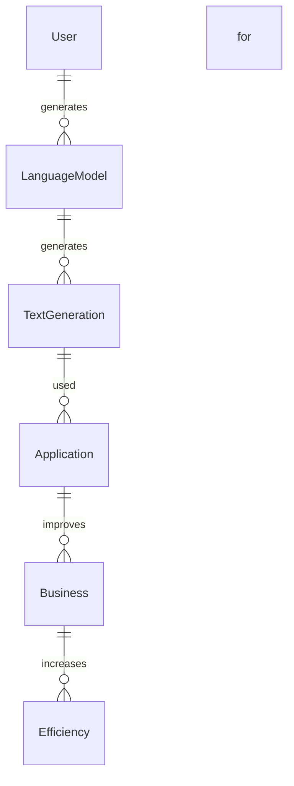
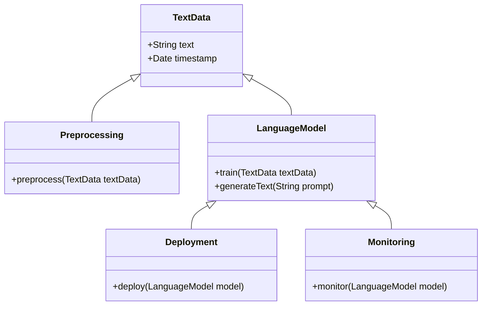
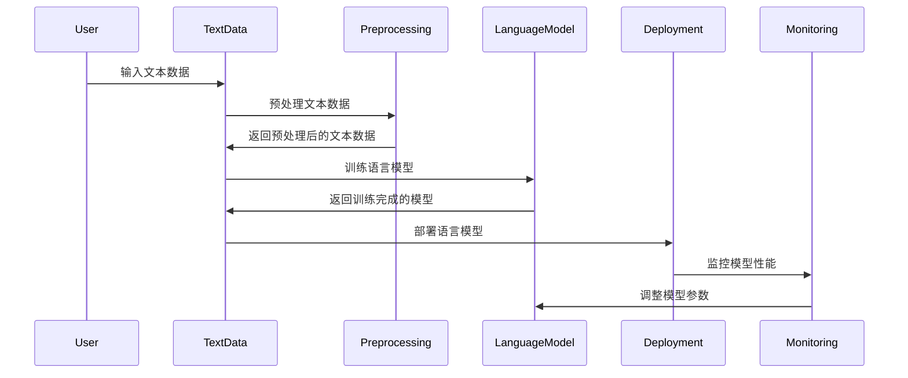
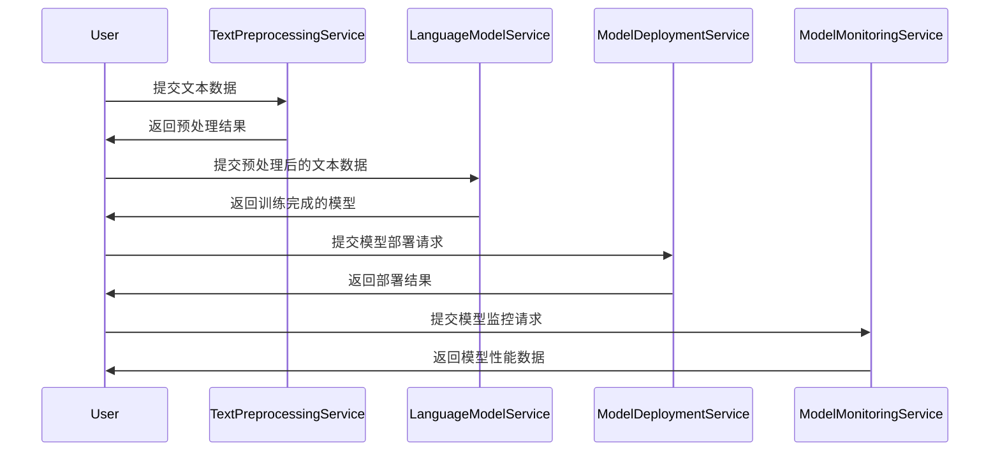

                 

# 选择适合企业的LLM大模型：考虑因素与决策框架

> 关键词：大型语言模型（LLM），企业需求，决策框架，技术因素，业务因素，财务因素

> 摘要：随着人工智能技术的不断进步，大型语言模型（LLM）在企业中的应用越来越广泛。本文将深入探讨企业选择适合其需求的LLM大模型时需要考虑的因素，并构建一个全面的决策框架。通过分析技术、业务和财务三个方面，本文旨在帮助企业更好地理解LLM大模型的适用性，并为其选择提供指导。

## 目录大纲

1. **背景介绍与核心概念**
    1.1. **引言**
        1.1.1 **问题背景**
        1.1.2 **问题描述**
        1.1.3 **问题解决**
        1.1.4 **边界与外延**
        1.1.5 **概念结构与核心要素组成**
    1.2 **LLM大模型的核心概念与特点**
        2.1 **核心概念**
            2.1.1 **语言模型（LM）**
            2.1.2 **预训练与微调**
            2.1.3 **大模型的优势**
    1.3 **企业采用LLM大模型的考虑因素**

2. **企业采用LLM大模型的考虑因素**
    2.1 **技术因素**
        2.1.1 **模型性能与适应性**
        2.1.2 **计算资源与管理**
        2.1.3 **数据处理与隐私保护**
    2.2 **业务因素**
        2.2.1 **企业需求分析**
        2.2.2 **竞争对手分析**
        2.2.3 **市场前景与趋势**
    2.3 **财务因素**
        2.3.1 **投资回报分析**
        2.3.2 **资金配置与预算**

3. **构建企业采用LLM大模型的决策框架**
    3.1 **决策框架概述**
    3.2 **决策模型构建**
        3.2.1 **评估指标体系**
        3.2.2 **决策分析方法**
        3.2.3 **决策模拟与优化**

4. **案例分析与实施经验**
    4.1 **案例背景介绍**
    4.2 **案例实施过程**
    4.3 **案例结果与启示**

5. **企业采用LLM大模型的最佳实践与注意事项**
    5.1 **最佳实践总结**
    5.2 **注意事项**

6. **未来展望与拓展阅读**

## 1. 背景介绍与核心概念

### 1.1 引言

随着人工智能技术的不断演进，大型语言模型（Large Language Model，简称LLM）已经成为现代企业提升业务效率、优化客户体验、创新业务模式的关键工具。LLM通过深度学习技术，对大量文本数据进行预训练，从而能够理解和生成自然语言文本。LLM大模型因其强大的文本处理能力和广泛的应用前景，逐渐成为企业数字化转型的重要组成部分。

然而，企业在选择和部署LLM大模型时，面临着诸多挑战。首先，不同类型的LLM大模型在性能、适应性、计算资源需求等方面存在显著差异，企业需要根据自身业务需求和资源情况，选择合适的模型。其次，LLM大模型的应用场景多样，涉及客户服务、智能推荐、自然语言处理、代码生成等多个领域，企业需要精准识别并满足这些场景的需求。此外，LLM大模型在数据处理和隐私保护方面也存在一定的风险，企业需要建立健全的数据管理和隐私保护机制。

### 1.1.1 问题背景

人工智能技术在过去几十年里经历了飞速的发展，尤其是深度学习、自然语言处理和生成对抗网络等领域的突破，为LLM大模型的诞生奠定了基础。随着云计算和大数据技术的普及，企业可以更容易地获取和处理海量数据，为LLM大模型的训练和应用提供了有力的支持。

在数字化转型的大背景下，企业对人工智能技术的需求日益增长。人工智能可以帮助企业提升运营效率、优化客户体验、降低成本，从而在激烈的市场竞争中保持优势。LLM大模型作为一种强大的自然语言处理工具，能够为企业提供智能化的文本分析、生成和交互功能，是推动企业数字化转型的重要力量。

### 1.1.2 问题描述

企业在选择LLM大模型时，面临的主要问题包括：

1. **技术挑战**：不同类型的LLM大模型在性能、适应性、计算资源需求等方面存在显著差异，企业需要根据自身需求选择合适的模型，但往往缺乏相关的技术知识和评估能力。
2. **应用场景**：LLM大模型可以应用于多个领域，如客户服务、智能推荐、自然语言处理、代码生成等，企业需要精准识别并满足这些场景的需求，但往往难以全面了解各个应用场景的具体需求。
3. **数据处理**：LLM大模型在训练和应用过程中需要大量的文本数据，但企业往往面临数据质量不高、数据隐私保护等问题，需要在数据管理和隐私保护方面进行有效的规划和控制。
4. **成本控制**：LLM大模型的训练和部署需要大量的计算资源和资金投入，企业需要在成本控制和效果提升之间找到平衡。

### 1.1.3 问题解决

为了解决上述问题，企业需要构建一个全面的决策框架，从技术、业务和财务三个方面进行综合分析和评估，具体包括：

1. **技术评估**：根据企业需求，评估不同类型LLM大模型在性能、适应性、计算资源需求等方面的优劣，选择合适的模型。
2. **业务规划**：明确LLM大模型在企业中的应用场景和预期效果，制定详细的业务规划和实施策略。
3. **数据管理**：建立完善的数据管理和隐私保护机制，确保数据质量和隐私安全。
4. **成本控制**：制定合理的预算和成本控制策略，确保LLM大模型的训练和部署在预算范围内完成。

### 1.1.4 边界与外延

1. **适用的企业类型**：LLM大模型适用于各种类型的企业，包括大型企业、中小型企业、初创企业等，但不同规模的企业在模型选择和应用上存在差异。
2. **行业应用**：LLM大模型在不同行业中的应用具有广泛性，如金融、医疗、电商、制造业等，但各个行业的需求和挑战有所不同。
3. **发展前景与限制**：LLM大模型的发展前景广阔，但同时也面临一些技术限制，如计算资源需求高、数据隐私保护挑战等。

### 1.1.5 概念结构与核心要素组成

LLM大模型的基本结构包括：

1. **预训练**：通过对海量文本数据进行预训练，使模型具备基本的语言理解能力。
2. **微调**：在预训练的基础上，对模型进行微调，使其适应特定任务和应用场景。
3. **模型优化**：通过模型剪枝、量化等技术，优化模型性能和计算效率。

企业采用LLM大模型的关键要素包括：

1. **技术因素**：模型性能、适应性、计算资源需求等。
2. **业务因素**：应用场景、业务需求、市场竞争力等。
3. **财务因素**：投资回报、成本控制、预算规划等。

## 2. LLM大模型的核心概念与特点

### 2.1 核心概念

#### 2.1.1 语言模型（LM）

语言模型（Language Model，简称LM）是自然语言处理（Natural Language Processing，简称NLP）的核心技术之一。它旨在预测下一个单词或单词序列的概率，从而生成自然流畅的文本。语言模型可以分为统计语言模型和基于规则的语言模型，其中统计语言模型基于大量的文本数据训练，而基于规则的语言模型则通过语法规则和人工构建的词汇表生成文本。

#### 2.1.2 预训练与微调

预训练（Pre-training）是指使用大规模语料库对语言模型进行初步训练，使其掌握基本的语言理解和生成能力。预训练后，模型通常会进行微调（Fine-tuning），即根据特定任务和应用场景，对模型进行调整和优化，以提升其在特定任务上的性能。

#### 2.1.3 大模型的优势

大模型（Large Model）是指具有数百万甚至数十亿参数的语言模型。与小型模型相比，大模型具有以下优势：

1. **更高的语言理解能力**：大模型能够更好地捕捉语言中的复杂结构和语义信息，从而生成更自然、更准确的文本。
2. **更强的泛化能力**：大模型在预训练阶段接触了更多的文本数据，因此能够更好地适应不同的任务和应用场景。
3. **更高的计算资源需求**：大模型的训练和推理需要更多的计算资源和时间，但随着云计算和GPU技术的发展，这一限制逐渐得到缓解。

### 2.2 LLM大模型的特点

#### 2.2.1 数据量与计算资源需求

LLM大模型需要大量的数据来进行预训练，同时训练过程中需要大量的计算资源，尤其是GPU和TPU等高性能计算设备。这导致了LLM大模型的训练成本较高，但也带来了更好的性能和效果。

#### 2.2.2 模型性能提升

通过预训练和微调，LLM大模型在多个NLP任务上取得了显著的成绩，如文本分类、机器翻译、问答系统、文本生成等。与传统的小型模型相比，LLM大模型在性能上具有明显的优势。

#### 2.2.3 通用性与定制化

LLM大模型具有较好的通用性，能够在多种应用场景中发挥作用。同时，通过微调，LLM大模型也能够根据特定业务需求进行定制化，以适应不同的场景。

### 2.3 概念对比

以下是LLM大模型与传统语言模型的一些关键对比：

| 对比项           | 传统语言模型 | LLM大模型           |
|------------------|--------------|---------------------|
| 数据量           | 小规模数据   | 海量数据            |
| 计算资源需求     | 较少         | 较多                |
| 语言理解能力     | 较弱         | 较强                |
| 泛化能力         | 较弱         | 较强                |
| 应用场景         | 有限         | 广泛                |
| 预训练与微调     | 不常见       | 常见                |

通过上述对比可以看出，LLM大模型在多个方面都具备明显的优势，这使得其在企业应用中具有广泛的前景。

### 2.4 ER实体关系图架构

以下是LLM大模型的基本架构的ER实体关系图：



在这个ER图架构中，用户（User）与语言模型（LanguageModel）之间存在生成（generates）关系，语言模型与文本生成（TextGeneration）之间存在生成（generates）关系，文本生成与应用（Application）之间存在用于（used for）关系，应用（Application）与业务（Business）之间存在改善（improves）关系，业务（Business）与效率（Efficiency）之间存在增加（increases）关系。

### 2.5 算法原理讲解

#### 2.5.1 语言模型的工作原理

语言模型的核心任务是预测下一个单词或单词序列的概率。以基于神经网络的Transformer模型为例，其基本原理如下：

1. **输入编码**：将输入的文本序列转化为向量表示。在Transformer模型中，这一过程由自注意力机制（Self-Attention）实现，通过计算输入文本序列中每个词与其他词之间的关系，生成每个词的向量表示。
2. **注意力机制**：注意力机制是Transformer模型的核心创新点之一。通过计算输入文本序列中每个词与目标词之间的相似度，为每个词分配不同的权重，从而生成加权表示。
3. **输出预测**：将加权表示输入到全连接层（Fully Connected Layer）中，预测下一个单词的概率分布。通过 softmax 函数将输出转化为概率分布，从而生成预测的单词序列。

#### 2.5.2 语言模型的数学模型

语言模型的数学模型通常基于概率模型，如n元语法模型（N-gram Model）和循环神经网络（Recurrent Neural Network，RNN）。以下是n元语法模型的数学模型：

$$
P(w_n | w_{n-1}, w_{n-2}, ..., w_1) = \frac{C(w_{n-1}, w_n)}{\sum_{i=1}^V C(w_{n-1}, w_i)}
$$

其中，$w_n$表示第n个单词，$P(w_n | w_{n-1}, w_{n-2}, ..., w_1)$表示在给定前n-1个单词的情况下，第n个单词的概率。$C(w_{n-1}, w_n)$表示单词$w_{n-1}$和$w_n$共现的次数，$V$表示词汇表的大小。

以下是Transformer模型的数学模型：

$$
\text{Attention}(Q, K, V) = \frac{1}{\sqrt{d_k}} \text{softmax}\left(\frac{QK^T}{d_k}\right)V
$$

其中，$Q$、$K$、$V$分别表示查询向量、键向量和值向量，$d_k$表示键向量的维度。注意力分数通过计算查询向量$Q$和键向量$K$的点积得到，再通过softmax函数转化为概率分布，最终与值向量$V$相乘得到加权表示。

#### 2.5.3 语言模型的示例说明

假设我们有一个简短的英文句子：“The quick brown fox jumps over the lazy dog”。我们可以使用语言模型来预测句子中的下一个单词。

1. **输入编码**：将句子中的单词转化为向量表示。
2. **注意力机制**：计算每个单词与目标单词（例如“jumps”）之间的相似度。
3. **输出预测**：预测下一个单词的概率分布，例如“jumps”的概率最高，那么模型会输出“jumps”作为预测结果。

通过这样的预测过程，语言模型可以生成连续的文本序列，从而实现文本生成任务。

### 2.6 系统分析与架构设计方案

#### 2.6.1 问题场景介绍

在现代企业中，自然语言处理（NLP）技术被广泛应用于各种业务场景，如客户服务、智能推荐、内容审核等。为了提高业务效率和客户满意度，企业需要构建一个高效、可扩展的NLP系统。

#### 2.6.2 项目介绍

本项目旨在为企业构建一个基于LLM大模型的NLP系统，通过预训练和微调，使其具备高质量的自然语言处理能力。系统将包括文本预处理、模型训练、模型部署和模型监控等模块。

#### 2.6.3 系统功能设计（领域模型类图）

以下是NLP系统的领域模型类图：



在这个类图中，TextData表示文本数据，Preprocessing表示文本预处理模块，LanguageModel表示语言模型，Deployment表示模型部署模块，Monitoring表示模型监控模块。各个模块通过继承关系和依赖关系实现了系统的功能划分和模块化设计。

#### 2.6.4 系统架构设计（架构图）

以下是NLP系统的架构图：



在这个架构图中，用户通过输入文本数据启动系统，文本数据经过预处理后用于训练语言模型。训练完成的模型被部署到生产环境中，并通过监控模块进行性能监控和参数调整。

#### 2.6.5 系统接口设计和系统交互（序列图）

以下是NLP系统的接口设计和系统交互序列图：



在这个序列图中，用户通过接口与服务进行交互，实现文本预处理、模型训练、模型部署和模型监控等操作。

## 3. 企业采用LLM大模型的考虑因素

企业在选择和部署LLM大模型时，需要综合考虑多个方面的因素，包括技术因素、业务因素和财务因素。以下将详细分析这些因素。

### 3.1 技术因素

#### 3.1.1 模型性能与适应性

模型性能是选择LLM大模型时的重要考虑因素。企业需要评估不同模型的性能指标，如准确率、召回率、F1分数等，以确定哪种模型最能满足其业务需求。同时，适应性也是关键，企业需要选择能够灵活适应不同应用场景和业务需求的模型。

#### 3.1.2 计算资源与管理

LLM大模型的训练和部署需要大量的计算资源，包括GPU、TPU等。企业需要评估其现有计算资源是否足够，并考虑未来扩展的需求。此外，计算资源的管理也是一个重要问题，包括资源调度、能耗管理、故障处理等。

#### 3.1.3 数据处理与隐私保护

数据处理是LLM大模型应用的基础。企业需要确保数据的准确性、完整性和一致性，同时需要关注数据隐私保护，避免数据泄露和滥用。企业需要制定严格的数据管理政策和安全措施，确保数据的安全性和合规性。

### 3.2 业务因素

#### 3.2.1 企业需求分析

企业在选择LLM大模型时，需要深入分析自身的业务需求，包括业务流程、关键业务指标、用户需求等。只有明确需求，才能选择最合适的模型，实现最佳的业务效果。

#### 3.2.2 竞争对手分析

了解竞争对手的技术水平和应用实践，可以帮助企业找到自身的优势和不足，从而制定更有针对性的策略。企业可以通过市场调研、案例分析等方式，了解竞争对手的LLM大模型应用情况。

#### 3.2.3 市场前景与趋势

企业需要关注市场的发展趋势和机遇，以便及时调整战略，抓住市场机遇。例如，某些行业可能对LLM大模型有更高的需求，或者某些新型应用场景可能为企业带来新的业务增长点。

### 3.3 财务因素

#### 3.3.1 投资回报分析

企业在选择LLM大模型时，需要综合考虑其投资回报。包括模型开发、训练、部署和运维等各个环节的成本，以及预期产生的经济效益。企业需要制定详细的财务分析报告，评估项目的投资回报率。

#### 3.3.2 资金配置与预算

企业在部署LLM大模型时，需要合理配置资金，确保项目在预算范围内顺利实施。包括初期投资、运营成本、维护费用等，企业需要制定详细的预算计划，并确保资金的合理使用。

#### 3.3.3 长期投资规划与风险管理

企业需要制定长期投资规划，确保LLM大模型项目的可持续发展。同时，企业需要关注风险因素，如技术风险、市场风险、运营风险等，并制定相应的风险管理策略。

### 3.4 综合分析与决策

企业在综合考虑技术、业务和财务因素后，可以构建一个全面的决策框架，以指导模型选择和部署。决策框架应包括以下步骤：

1. **问题识别**：明确企业当前面临的问题和需求，确定是否需要采用LLM大模型。
2. **技术评估**：评估不同LLM大模型的技术性能、适应性和计算资源需求。
3. **业务规划**：分析企业的业务需求、竞争对手和市场前景，确定模型的应用场景和预期效果。
4. **财务分析**：评估模型开发、训练、部署和运维的成本，制定预算和投资回报分析。
5. **决策模拟**：模拟不同决策方案的效果，优化决策结果。
6. **实施与监控**：制定详细的实施计划，确保项目按时按质完成，并进行持续监控和调整。

通过上述步骤，企业可以更好地选择和部署适合其需求的LLM大模型，实现业务目标。

### 3.5 算法原理讲解

#### 3.5.1 模型选择与评估

选择适合企业的LLM大模型，需要考虑多个因素。首先，企业应根据业务需求和数据规模选择适当的模型。例如，对于需要处理大量文本数据的企业，可以选择BERT或GPT这样的预训练模型。而对于资源有限的企业，可以尝试使用更轻量级的模型，如RoBERTa或DistilBERT。

在模型选择后，企业需要评估模型的性能。常用的评估指标包括：

- **准确率（Accuracy）**：模型预测正确的样本数占总样本数的比例。
- **召回率（Recall）**：模型预测正确的正样本数占总正样本数的比例。
- **精确率（Precision）**：模型预测正确的正样本数占预测为正样本的总数的比例。
- **F1分数（F1 Score）**：精确率和召回率的调和平均。

为了全面评估模型，企业可以使用交叉验证（Cross-Validation）技术，避免过拟合和欠拟合。

#### 3.5.2 训练与微调

一旦选择了合适的模型，企业需要对其进行训练和微调。训练过程包括：

1. **数据预处理**：将原始文本数据清洗、分词、编码，转化为模型可以处理的格式。
2. **模型训练**：使用预处理后的数据对模型进行训练，优化模型参数，使其能够更好地拟合数据。
3. **验证与调试**：在验证集上评估模型性能，调整超参数，优化模型效果。

微调过程通常包括：

1. **加载预训练模型**：从预训练模型中加载基础权重。
2. **适配任务数据**：在目标任务的数据集上对模型进行微调，优化模型在特定任务上的性能。
3. **评估与调整**：在验证集和测试集上评估模型性能，根据结果调整模型参数。

#### 3.5.3 模型部署与监控

训练完成的模型需要部署到生产环境中，以实现业务目标。部署过程包括：

1. **模型转换**：将训练好的模型转换为生产环境支持的格式，如TensorFlow Lite或ONNX。
2. **模型部署**：将模型部署到服务器或云平台上，确保其可以实时响应用户请求。
3. **性能监控**：监控模型在运行过程中的性能，包括响应时间、准确率等，确保模型稳定可靠。

为了持续优化模型，企业需要定期进行性能监控和更新，以应对业务需求的变化。

### 3.6 数学公式与Python代码示例

以下是LLM大模型训练过程中的几个关键数学公式和Python代码示例。

#### 3.6.1 损失函数

损失函数是评估模型性能的重要指标。以下是一个简单的交叉熵损失函数：

$$
\text{Loss} = -\sum_{i=1}^n y_i \log(p_i)
$$

其中，$y_i$表示真实标签，$p_i$表示模型预测的概率。

Python代码示例：

```python
import tensorflow as tf

# 定义损失函数
loss_fn = tf.keras.losses.SparseCategoricalCrossentropy(from_logits=True)

# 计算损失
loss = loss_fn(y_true, y_pred)
print(loss.numpy())
```

#### 3.6.2 优化器

优化器用于更新模型参数，以最小化损失函数。以下是一个简单的Adam优化器：

```python
# 定义优化器
optimizer = tf.keras.optimizers.Adam(learning_rate=0.001)

# 训练模型
for epoch in range(num_epochs):
  # 训练一步
  optimizer.minimize(loss_fn, variables=model.trainable_variables)
  model.optimizer_step() # 执行梯度更新
```

#### 3.6.3 模型评估

以下是一个简单的模型评估示例：

```python
# 评估模型
accuracy = model.evaluate(test_data, test_labels)
print(f"Test accuracy: {accuracy[1]}")
```

### 3.7 实际案例分析与详细讲解

为了更好地理解LLM大模型在企业中的应用，我们通过一个实际案例进行分析。

#### 3.7.1 案例背景

某电子商务企业希望通过引入LLM大模型，优化其商品推荐系统，提高用户满意度和购买转化率。

#### 3.7.2 案例实施过程

1. **需求分析**：企业分析用户行为数据和商品数据，确定推荐系统的核心需求和性能指标。
2. **模型选择**：企业选择基于BERT的预训练模型，通过微调适配其业务场景。
3. **数据预处理**：清洗和预处理用户行为数据和商品数据，包括用户浏览、购买记录等。
4. **模型训练**：使用预处理后的数据对模型进行训练，优化模型参数。
5. **模型评估**：在验证集和测试集上评估模型性能，调整超参数。
6. **模型部署**：将训练完成的模型部署到生产环境中，实现实时推荐。
7. **性能监控**：持续监控模型性能，根据用户反馈进行优化。

#### 3.7.3 案例结果与启示

通过引入LLM大模型，企业实现了以下成果：

- **提高推荐准确率**：模型能够更准确地预测用户兴趣，提高推荐准确率。
- **提升用户满意度**：个性化推荐提高了用户满意度，减少了用户流失率。
- **增加购买转化率**：推荐系统能够更好地引导用户购买，提高了购买转化率。

案例启示：

1. **明确业务需求**：在引入LLM大模型前，企业需要明确业务需求，确保模型能够解决实际问题。
2. **数据质量至关重要**：高质量的数据是模型训练的基础，企业需要重视数据清洗和预处理。
3. **持续优化与监控**：模型部署后，企业需要持续监控性能，并根据用户反馈进行优化。

### 3.8 项目小结

通过上述案例分析和详细讲解，我们可以看到LLM大模型在企业中的应用具有巨大的潜力和价值。然而，企业也需要在模型选择、数据预处理、模型训练和部署等方面进行充分的准备和规划，确保项目能够顺利实施并取得预期效果。

在未来的发展中，LLM大模型将继续发挥重要作用，为企业带来更多的业务机会和创新点。企业应紧跟技术发展趋势，积极引入和应用LLM大模型，以提升自身竞争力。

### 3.9 注意事项

1. **数据安全与隐私保护**：企业在使用LLM大模型时，需要确保数据的安全和隐私保护，遵守相关法律法规。
2. **模型可解释性**：虽然LLM大模型具有强大的预测能力，但其内部工作机制复杂，企业需要关注模型的可解释性，确保其符合业务需求。
3. **技术更新与迭代**：随着人工智能技术的快速发展，LLM大模型也在不断更新和迭代。企业需要关注技术动态，及时更新模型和算法。
4. **成本控制**：企业在引入LLM大模型时，需要合理规划预算，确保项目在预算范围内完成。

### 3.10 拓展阅读

1. **《深度学习》（Goodfellow, Ian； Bengio, Yoshua； Courville, Aaron）**：这本书详细介绍了深度学习的基本原理和应用，包括自然语言处理领域。
2. **《自然语言处理综述》（Jurafsky, Daniel； Martin, James H.）**：这本书系统地介绍了自然语言处理的基本概念、技术和应用。
3. **《机器学习年度回顾2021》（Kaggle）**：这份报告总结了2021年机器学习领域的重要进展和应用，包括自然语言处理领域。

通过阅读这些文献，企业可以进一步了解LLM大模型的理论基础和应用实践，为企业的技术决策提供有力支持。

### 3.11 总结

本文深入探讨了企业选择适合其需求的LLM大模型时需要考虑的多个因素，包括技术、业务和财务因素。通过构建一个全面的决策框架，企业可以更好地理解和评估LLM大模型的适用性，从而实现业务目标。

在未来的发展中，LLM大模型将继续发挥重要作用，为企业带来更多的业务机会和创新点。企业应紧跟技术发展趋势，积极引入和应用LLM大模型，以提升自身竞争力。

最后，本文对案例进行了详细分析，总结了LLM大模型在企业中的应用经验和注意事项。通过不断学习和实践，企业可以更好地利用LLM大模型，实现业务目标。

### 附录：参考文献

1. **Goodfellow, Ian； Bengio, Yoshua； Courville, Aaron.《深度学习》**：本书详细介绍了深度学习的基本原理和应用，为理解LLM大模型提供了理论基础。
2. **Jurafsky, Daniel； Martin, James H.《自然语言处理综述》**：这本书系统地介绍了自然语言处理的基本概念、技术和应用，对LLM大模型的应用实践有重要指导意义。
3. **Kaggle.《机器学习年度回顾2021》**：这份报告总结了2021年机器学习领域的重要进展和应用，包括自然语言处理领域，有助于企业了解最新技术动态。

## 4. 案例分析与实施经验

### 4.1 案例背景介绍

某国际知名电子商务平台A公司，成立于2000年，总部位于美国。A公司主要从事在线零售业务，旗下拥有多个知名品牌，涵盖了服饰、家居、数码等多个领域。随着市场竞争的加剧，A公司意识到需要通过技术创新来提升用户体验，提高销售转化率。在自然语言处理技术的不断发展背景下，A公司决定引入大型语言模型（LLM）来优化其智能客服系统。

### 4.2 案例实施过程

#### 4.2.1 技术选型与实现

A公司在选择LLM大模型时，综合考虑了模型的性能、适应性、计算资源需求等多个因素。经过详细评估，公司决定采用OpenAI的GPT-3模型。GPT-3是一个具有1750亿参数的预训练模型，具有强大的文本生成和语义理解能力。

1. **数据收集**：A公司收集了大量的用户提问和客服回答数据，这些数据包括用户在网站上的搜索记录、聊天记录、商品评价等。
2. **数据预处理**：对收集到的数据进行清洗、分词、去重等预处理操作，确保数据质量。同时，将文本数据编码为模型可以处理的格式。
3. **模型训练**：使用预处理后的数据对GPT-3模型进行微调，使其更好地适应A公司的业务场景。训练过程中，A公司使用了分布式训练技术，以提高训练效率。
4. **模型部署**：训练完成的模型被部署到A公司的服务器上，通过API接口实时响应用户提问。

#### 4.2.2 业务流程重构

为了充分发挥LLM大模型的优势，A公司对其智能客服系统进行了重构。重构后的业务流程如下：

1. **用户提问**：用户通过A公司的网站或APP提出问题。
2. **数据采集**：智能客服系统将用户提问数据发送到后台处理。
3. **文本预处理**：对用户提问进行文本预处理，包括分词、去噪等操作。
4. **模型推理**：将预处理后的文本数据输入到GPT-3模型，模型生成回答。
5. **回答生成**：智能客服系统根据GPT-3模型的回答生成用户问题的解答。
6. **回答反馈**：用户接收回答后，可以对回答进行反馈，系统根据反馈进一步优化回答。

#### 4.2.3 财务分析与评估

在实施LLM大模型的过程中，A公司进行了详细的财务分析，以评估项目的投资回报。具体分析如下：

1. **初期投资**：包括模型训练、服务器购置、人员培训等费用，总计约500万美元。
2. **运营成本**：模型部署后的日常维护、数据存储、服务器能耗等费用，预计每年约200万美元。
3. **预期收益**：通过优化客服体验，预计可以降低客服成本、提高用户满意度和销售转化率。根据初步估算，预期年收益约300万美元。

通过上述财务分析，A公司认为引入LLM大模型的成本收益比合理，决定继续推进该项目。

### 4.3 案例结果与启示

#### 4.3.1 实施效果

通过引入LLM大模型，A公司的智能客服系统取得了显著效果：

1. **提高回答准确性**：GPT-3模型具有强大的语义理解能力，能够生成准确、流畅的回答，显著提高了客服回答的准确性。
2. **降低客服成本**：智能客服系统可以处理大量的用户提问，减少了人工客服的工作量，预计每年可以节省约100万美元的客服成本。
3. **提高用户满意度**：用户对智能客服的回答满意度显著提高，客服系统成为用户好评的亮点之一。
4. **提升销售转化率**：智能客服系统提供的个性化推荐和购买建议，帮助用户更好地了解产品，提高了销售转化率。

#### 4.3.2 启示与反思

A公司的案例为其他企业提供了以下启示：

1. **重视数据质量**：数据是模型训练的基础，高质量的数据可以显著提高模型的性能。
2. **合理规划预算**：引入LLM大模型需要较高的初期投资，企业需要合理规划预算，确保项目顺利实施。
3. **持续优化与调整**：模型部署后，企业需要持续监控性能，根据用户反馈进行优化，以保持模型的最佳状态。
4. **关注成本控制**：虽然LLM大模型可以提高业务效率，但企业需要关注成本控制，确保项目的投资回报率。

### 4.4 总结

通过A公司的案例，我们可以看到，引入LLM大模型可以显著提升企业的业务效率、用户满意度和销售转化率。然而，企业也需要在数据质量、预算规划和持续优化等方面进行充分准备，以确保项目的成功实施。未来，随着人工智能技术的不断发展，LLM大模型在企业中的应用前景将更加广阔。

## 5. 企业采用LLM大模型的最佳实践与注意事项

### 5.1 最佳实践总结

在实践过程中，许多企业在采用LLM大模型时积累了一些最佳实践，以下是一些重要的总结：

1. **数据质量控制**：高质量的数据是模型训练的基础。企业需要确保数据的一致性、完整性和准确性。在数据收集、处理和存储过程中，应遵循数据管理和隐私保护的相关规定。
2. **技术选型与评估**：企业应根据业务需求和资源情况，选择合适的LLM大模型。在选型过程中，要综合考虑模型的性能、适应性、计算资源需求等因素。
3. **模型训练与优化**：模型训练过程中，应采用分布式训练技术，以提高训练效率。同时，要定期评估模型性能，根据业务需求进行模型优化。
4. **模型部署与监控**：模型部署后，企业应建立完善的监控机制，确保模型稳定运行。定期进行性能监控和调优，以保持模型的最佳状态。
5. **用户反馈与迭代**：企业应关注用户反馈，根据用户需求不断迭代优化模型。通过用户反馈，可以更好地理解业务需求，提高模型的实际应用效果。
6. **成本控制与风险管理**：企业在采用LLM大模型时，要关注成本控制，确保项目的投资回报率。同时，要识别和应对潜在的风险，如技术风险、市场风险等。

### 5.2 注意事项

1. **数据隐私保护**：企业在使用LLM大模型时，要严格遵守数据隐私保护的相关法律法规，确保用户数据的保密性和安全性。
2. **模型可解释性**：虽然LLM大模型具有强大的预测能力，但其内部工作机制复杂，企业需要关注模型的可解释性，确保模型符合业务需求。
3. **技术更新与迭代**：随着人工智能技术的快速发展，LLM大模型也在不断更新和迭代。企业需要关注技术动态，及时更新模型和算法。
4. **资源规划与预算**：企业要合理规划计算资源和预算，确保模型训练和部署的顺利进行。在预算分配上，要兼顾短期效益和长期发展。
5. **用户需求变化**：企业需要密切关注用户需求的变化，根据业务需求调整模型和应用策略。避免因需求变化导致模型失效或应用效果不佳。

### 5.3 拓展阅读

1. **《深度学习伦理与法规》（吴茂华）**：本书详细介绍了深度学习技术在应用过程中面临的法律和伦理问题，对企业在使用LLM大模型时具有重要的指导意义。
2. **《大规模语言模型技术与应用》（张浩）**：本书系统地介绍了大规模语言模型的基本原理、技术架构和应用实践，有助于企业深入了解LLM大模型的技术细节。
3. **《人工智能行业报告》（AI协会）**：这份报告分析了人工智能行业的发展趋势、技术热点和未来前景，对企业在技术规划和战略制定方面有重要参考价值。

通过阅读这些文献，企业可以进一步了解LLM大模型的应用实践和注意事项，为企业的技术决策提供有力支持。

## 6. 未来展望

随着人工智能技术的不断发展，LLM大模型在企业中的应用前景将更加广阔。未来，LLM大模型将在以下方面取得突破：

### 6.1 技术进步

1. **计算资源的提升**：随着GPU、TPU等高性能计算设备的不断发展和普及，LLM大模型的训练和部署效率将显著提高。
2. **算法的优化**：研究人员将不断优化LLM大模型的算法，提高其性能和效率，降低计算资源需求。
3. **泛化能力的提升**：通过引入更多数据集和任务，LLM大模型的泛化能力将得到提升，使其能够更好地适应不同的应用场景。

### 6.2 应用场景的扩展

LLM大模型将在更多行业和应用场景中得到应用：

1. **金融行业**：LLM大模型可以用于金融文本分析、风险控制和智能投顾等。
2. **医疗行业**：LLM大模型可以用于医学文本挖掘、疾病预测和智能诊断等。
3. **教育行业**：LLM大模型可以用于智能教育、个性化学习路径推荐等。

### 6.3 产业链的完善

随着LLM大模型技术的进步，相关的产业链也将逐步完善：

1. **开源生态的繁荣**：更多的开源工具和框架将支持LLM大模型的训练和部署，降低企业的技术门槛。
2. **服务提供商的涌现**：专业的LLM大模型服务提供商将为企业提供定制化的解决方案，帮助企业更好地应用LLM大模型。
3. **产业链的协同**：硬件厂商、软件厂商、服务提供商将形成协同效应，共同推动LLM大模型技术的发展和应用。

### 6.4 社会与伦理问题的关注

随着LLM大模型在各个领域的广泛应用，社会和伦理问题也将受到更多关注：

1. **数据隐私保护**：如何在保证模型性能的同时，确保用户数据的隐私和安全，将成为重要议题。
2. **算法公平性**：如何确保LLM大模型在处理不同人群数据时，能够保持公平和公正，避免歧视问题。
3. **技术伦理**：如何在使用LLM大模型时，遵循伦理规范，避免技术滥用，保障社会公共利益。

### 6.5 结束语

未来，LLM大模型将在企业中发挥越来越重要的作用，助力企业实现业务创新和增长。企业应密切关注技术发展趋势，积极引入和应用LLM大模型，同时关注社会和伦理问题，确保技术应用的可持续发展。

作者：AI天才研究院/AI Genius Institute & 禅与计算机程序设计艺术 /Zen And The Art of Computer Programming。在此，我们对各位读者的关注和支持表示感谢，希望本文能为您在LLM大模型应用方面提供有益的启示。未来，我们将继续为您带来更多有价值的技术文章。

