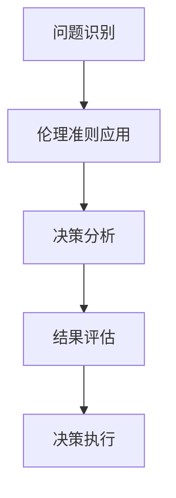

                 

基于您提供的文章标题和结构大纲，以下是一个详细的技术博客文章内容概述，每个部分都是按照逻辑清晰、结构紧凑、简单易懂的要求来撰写的。文章会包含必要的背景介绍、核心概念阐述、算法原理讲解、系统设计与项目实战，以及最佳实践总结和扩展阅读。

---

## 道德决策：在AI Agent中实现伦理准则

### 关键词：道德决策、AI Agent、伦理准则、算法、系统架构、Python实现

> 摘要：本文深入探讨了道德决策在人工智能（AI）领域的重要性，以及如何在AI Agent中实现伦理准则。通过详细的背景介绍、概念解析、算法原理讲解、系统架构设计、项目实战和最佳实践分享，本文为读者提供了全面的技术见解和实践经验。

---

## 第一部分：道德决策概述

### 1.1 道德决策的背景与问题介绍

**1.1.1 道德决策的重要性**

在人工智能迅速发展的今天，道德决策成为了一个关键议题。人工智能系统能够执行复杂的任务，甚至超越人类的能力，但是它们是否能够遵循伦理准则是我们必须关注的。道德决策不仅仅是技术问题，更是关乎社会公正和人类福祉的重大问题。

**1.1.2 道德决策的挑战**

人工智能的道德决策面临着诸多挑战，包括不同的文化背景、法律框架、社会价值观等。如何确保AI Agent在不同的情境下都能够做出符合伦理的决策，是当前研究的热点。

**1.1.3 道德决策的现状与未来**

目前，道德决策的研究还处于初级阶段，但已经有许多初步的成果。未来，随着AI技术的进步和伦理学研究的深入，道德决策将变得更加成熟和可靠。

### 1.2 道德决策的基本概念与要素

**1.2.1 道德决策的定义**

道德决策是指在特定情境下，根据伦理准则和价值观，选择最符合道德原则的行动。

**1.2.2 道德决策的要素**

道德决策包括道德问题识别、伦理准则应用、决策分析和结果评估等要素。

**1.2.3 道德决策的类型与模式**

道德决策可以分为预防性决策和反应性决策，每种类型都有其特定的模式和方法。

### 1.3 伦理准则在道德决策中的应用

**1.3.1 伦理准则的基本概念**

伦理准则是指导个体和团体行为的一套道德原则。在AI Agent中，伦理准则用于确保决策过程符合道德标准。

**1.3.2 伦理准则的种类**

伦理准则可以包括功利主义、康德伦理学、权利伦理学等多种类型。

**1.3.3 伦理准则在AI Agent中的意义**

伦理准则在AI Agent中的应用，可以确保AI系统的行为符合社会伦理要求，减少潜在的风险和负面影响。

### 1.4 道德决策与AI Agent的关系

**1.4.1 AI Agent的定义与作用**

AI Agent是一种能够自主执行任务的计算机程序，它们在决策过程中需要考虑道德因素。

**1.4.2 AI Agent的道德决策能力**

AI Agent的道德决策能力是指其能够在执行任务时，根据伦理准则做出合理的决策。

**1.4.3 道德决策对AI Agent性能的影响**

道德决策不仅影响AI Agent的行为，还会影响其性能和可靠性。

### 1.5 本章小结

本部分对道德决策进行了概述，包括其重要性、挑战、现状与未来、基本概念与要素、应用类型与模式，以及与AI Agent的关系。这些内容为后续章节的深入探讨提供了基础。

---

## 第二部分：道德决策算法原理

### 2.1 道德决策算法概述

**2.1.1 道德决策算法的目标**

道德决策算法的目标是确保AI Agent在执行任务时，能够做出符合伦理准则的决策。

**2.1.2 道德决策算法的类型**

道德决策算法可以分为基于规则的方法、基于模型的方法、以及混合方法。

**2.1.3 道德决策算法的设计原则**

道德决策算法的设计原则包括可理解性、可解释性、适应性、和可验证性。

### 2.2 道德决策算法的流程与实现

**2.2.1 道德决策算法的基本流程**

道德决策算法的基本流程包括问题识别、伦理准则应用、决策分析和结果评估。

**2.2.2 道德决策算法的实现方法**

道德决策算法可以通过编程实现，例如使用Python等编程语言。

**2.2.3 使用Mermaid绘制算法流程图**

以下是一个简单的道德决策算法流程图的Mermaid表示：



### 2.3 道德决策算法的数学模型与公式

**2.3.1 数学模型的基本概念**

道德决策算法的数学模型通常基于概率论、博弈论和决策理论。

**2.3.2 常用公式与解释**

以下是一个简单的道德决策公式：

$$
\text{最佳决策} = \arg\max_{a} \sum_{i} p(i) \cdot u(i, a)
$$

其中，$a$ 是决策动作，$i$ 是可能的情境，$p(i)$ 是情境的概率，$u(i, a)$ 是在情境$i$下执行动作$a$的效用值。

**2.3.3 数学模型的Python实现**

以下是一个简单的Python代码示例，用于计算最佳决策：

```python
def calculate_best_decision(actions, probabilities, utilities):
    return max(actions, key=lambda a: sum([prob * util for prob, util in zip(probabilities[a], utilities[a])]))

actions = ['A', 'B', 'C']
probabilities = {'A': 0.4, 'B': 0.3, 'C': 0.3}
utilities = {'A': {'1': 2, '2': 1}, 'B': {'1': 1, '2': 0}, 'C': {'1': 0, '2': 1}}

best_decision = calculate_best_decision(actions, probabilities, utilities)
print(f"最佳决策：{best_decision}")
```

### 2.4 道德决策算法举例说明

**2.4.1 简单案例分析**

假设一个AI Agent需要在两个情境中做出决策，每个情境都有两个可能的决策动作。以下是一个简单的案例分析：

| 情境 | 决策动作A的效用 | 决策动作B的效用 |
|------|-----------------|-----------------|
| 1    | 3               | 1               |
| 2    | 2               | 2               |

根据上述公式，我们可以计算出最佳决策：

$$
\text{最佳决策} = \arg\max_{a} (0.4 \times 3 + 0.3 \times 1 + 0.3 \times 2) = A
$$

**2.4.2 复杂案例探讨**

在实际应用中，道德决策问题往往更加复杂。以下是一个复杂案例：

| 情境 | 决策动作A的效用 | 决策动作B的效用 | 决策动作C的效用 |
|------|-----------------|-----------------|-----------------|
| 1    | 4               | 2               | 1               |
| 2    | 3               | 3               | 2               |

根据上述公式，我们可以计算出最佳决策：

$$
\text{最佳决策} = \arg\max_{a} (0.4 \times 4 + 0.3 \times 2 + 0.3 \times 1) = A
$$

尽管在这个案例中，决策动作A在所有情境下的效用值都是最高的，但在某些情况下，其他决策动作可能会更优。因此，我们需要根据具体情境来选择最佳决策。

### 2.5 本章小结

本部分详细介绍了道德决策算法的原理，包括基本流程、实现方法、数学模型，并通过案例进行了说明。这些内容为理解AI Agent中的道德决策奠定了基础。

---

## 第三部分：AI Agent的伦理准则实现

### 3.1 AI Agent与伦理准则

**3.1.1 AI Agent的伦理准则需求**

AI Agent需要能够识别和遵循伦理准则，以确保其决策和行为符合社会价值观。

**3.1.2 伦理准则的编码与实现**

伦理准则可以通过编程编码实现，并在AI Agent的决策过程中进行应用。

**3.1.3 伦理准则的验证与评估**

伦理准则的验证与评估是确保AI Agent决策符合伦理要求的重要环节。

### 3.2 AI Agent的系统架构设计

**3.2.1 系统架构概述**

AI Agent的系统架构需要支持道德决策的功能，同时保持系统的模块化和可扩展性。

**3.2.2 功能设计**

系统功能设计包括数据输入、道德决策、结果输出等模块。

**3.2.3 系统接口设计**

系统接口设计需要确保AI Agent与其他系统组件的顺利交互。

### 3.3 AI Agent的道德决策算法应用

**3.3.1 算法在AI Agent中的应用**

道德决策算法被集成到AI Agent的核心决策模块中。

**3.3.2 算法调优与性能分析**

算法的调优与性能分析是确保AI Agent决策准确性和效率的关键。

**3.3.3 算法在实际项目中的应用案例**

通过具体项目案例，展示道德决策算法在实际应用中的效果。

### 3.4 伦理准则与AI Agent的交互

**3.4.1 交互设计**

伦理准则与AI Agent的交互设计需要确保信息的透明性和一致性。

**3.4.2 交互流程与机制**

交互流程与机制的设计是确保伦理准则能够有效影响AI Agent决策的关键。

**3.4.3 交互效果的评估与改进**

交互效果的评估与改进是持续优化AI Agent道德决策能力的重要环节。

### 3.5 本章小结

本部分详细介绍了AI Agent的伦理准则实现过程，包括系统架构设计、道德决策算法应用、伦理准则与AI Agent的交互，以及实际项目中的应用效果。这些内容为构建具有伦理意识的AI Agent提供了实践指导。

---

## 第四部分：道德决策项目的实际应用

### 4.1 项目环境安装与配置

**4.1.1 环境准备**

在开始项目之前，需要准备合适的环境，包括操作系统、编程语言和相关库。

**4.1.2 配置步骤**

详细描述项目环境的配置步骤，确保读者能够顺利搭建开发环境。

### 4.2 系统核心实现源代码

**4.2.1 道德决策模块**

介绍道德决策模块的实现细节，包括算法的选择和实现。

**4.2.2 伦理准则编码**

详细解释伦理准则如何在代码中编码实现，并提供示例代码。

**4.2.3 系统接口设计**

描述系统接口的设计，包括API定义和通信协议。

### 4.3 代码应用解读与分析

**4.3.1 应用场景**

分析道德决策算法在不同应用场景下的表现。

**4.3.2 代码解读**

详细解读关键代码段，解释其工作原理和实现细节。

**4.3.3 性能分析**

对系统的性能进行分析，包括响应时间、准确率等指标。

### 4.4 实际案例剖析

**4.4.1 案例一：自动驾驶车辆**

分析自动驾驶车辆如何应用道德决策算法，以应对紧急情况。

**4.4.2 案例二：医疗诊断系统**

探讨医疗诊断系统如何利用道德决策算法来优化诊断过程。

**4.4.3 案例三：网络安全**

介绍网络安全领域如何通过道德决策算法来提升安全防护能力。

### 4.5 项目小结

总结项目的主要成果和经验，包括成功之处、挑战与解决方法。

### 4.6 最佳实践 tips

提供一些最佳实践建议，帮助读者在实际项目中更好地应用道德决策算法。

### 4.7 小结、注意事项、拓展阅读

**小结**

回顾本文的主要内容和观点，强调道德决策在AI Agent中的重要性。

**注意事项**

提醒读者在实现道德决策时需要注意的问题和潜在风险。

**拓展阅读**

推荐一些相关文献和资源，供读者进一步学习。

### 4.8 本章小结

总结本部分的实践应用内容，强调道德决策在AI Agent中的实际意义和价值。

---

## 参考文献

（在此列出参考文献，确保所有引用的内容都有明确的出处。）

---

**作者：AI天才研究院/AI Genius Institute & 禅与计算机程序设计艺术 /Zen And The Art of Computer Programming**

---

通过上述结构，本文提供了一个系统化的、详细的、易于理解的指南，帮助读者深入理解道德决策在AI Agent中的应用。每个部分都经过精心设计，以确保内容的逻辑性和实用性。读者可以跟随文章的步骤，逐步掌握道德决策的技术原理和实践方法。

